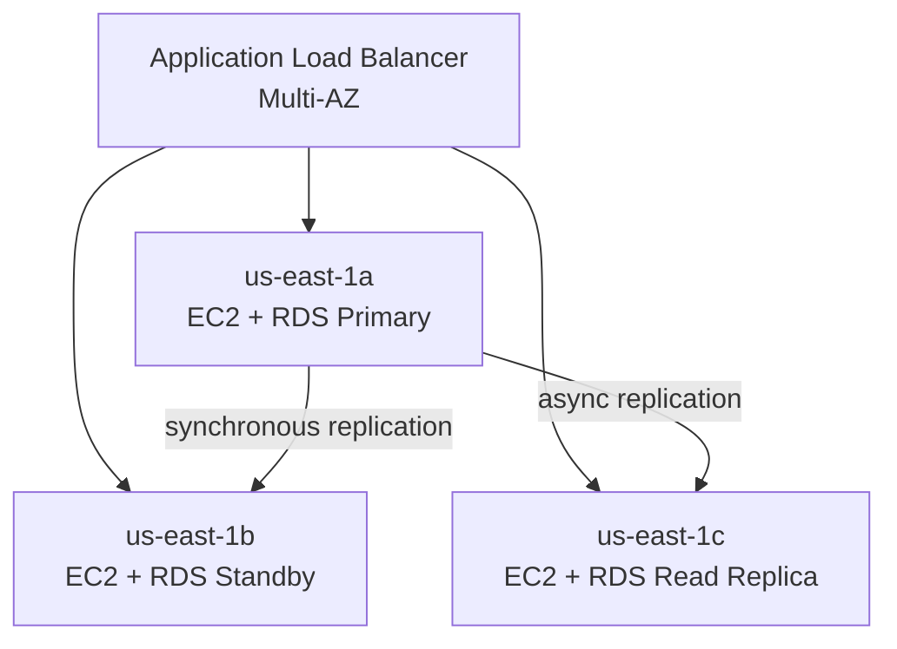
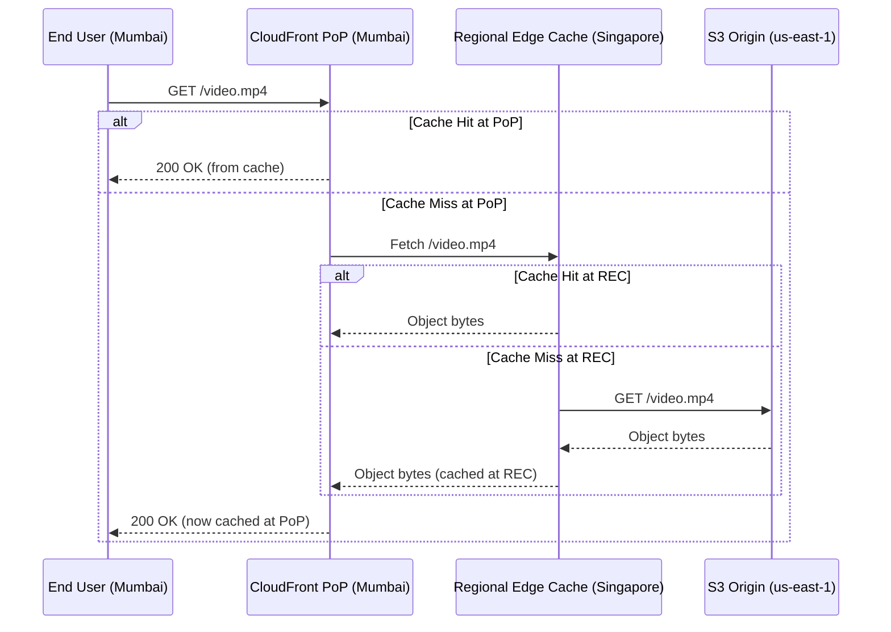
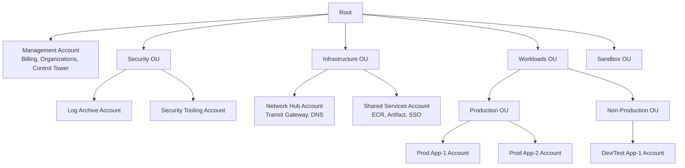
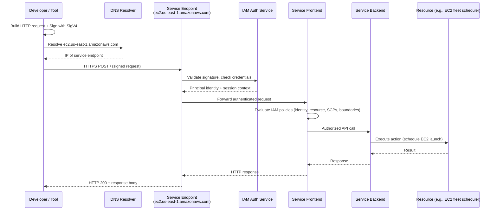

# AWS FUNDAMENTALS — Deep Dive Interview Preparation

> **Scope:** Section 1 of 20 | Beginner → Expert progression | FAANG-level depth  
> **Coverage:** Regions, AZs, Edge, Outposts, Organizations, SCPs, Control Tower, Well-Architected Framework, Shared Responsibility Model, SigV4, Control Plane internals

---

## Table of Contents

1. [AWS Global Infrastructure](#1-aws-global-infrastructure)
   - Regions
   - Availability Zones
   - Edge Locations
   - Local Zones
   - Wavelength Zones
   - Outposts
2. [Resource Groups & Tagging](#2-resource-groups--tagging)
3. [AWS Organizations & OUs](#3-aws-organizations--organizational-units)
4. [Service Control Policies (SCPs)](#4-service-control-policies-scps)
5. [AWS Control Tower & Landing Zones](#5-aws-control-tower--landing-zones)
6. [AWS Account Structure](#6-aws-account-structure)
7. [AWS Config](#7-aws-config)
8. [AWS Service Quotas](#8-aws-service-quotas)
9. [AWS Well-Architected Framework](#9-aws-well-architected-framework)
10. [Shared Responsibility Model](#10-shared-responsibility-model)
11. [AWS Control Plane Internals & API Flow](#11-aws-control-plane-internals--api-flow)
12. [SigV4 Request Signing](#12-sigv4-request-signing)
13. [Interview Questions & Answers](#13-interview-questions--answers)
14. [Troubleshooting Scenarios](#14-troubleshooting-scenarios)
15. [Production Best Practices](#15-production-best-practices)
16. [Documentation Links](#16-documentation-links)

---

## 1. AWS Global Infrastructure

### 1.1 AWS Regions

#### Beginner Foundation

An **AWS Region** is a discrete, geographically isolated cluster of data centers. Each Region is completely independent — it has its own power grid, networking infrastructure, and physical security. Data does not automatically replicate between Regions unless you explicitly configure it.

**Why Regions exist:** Cloud providers must satisfy data sovereignty regulations (GDPR, HIPAA, India PDPA, China cybersecurity law), minimize network latency for end users, and provide geographical redundancy for disaster recovery. A Region is the isolation boundary that makes these guarantees enforceable.

**When to choose a Region:**
- Choose the Region closest to your end users to minimize latency.
- Choose a Region mandated by regulatory compliance (e.g., `eu-west-1` for GDPR, `ap-south-1` for Indian data residency).
- Prefer Regions with the services you need — not all services are available in all Regions (check [https://aws.amazon.com/about-aws/global-infrastructure/regional-product-services/](https://aws.amazon.com/about-aws/global-infrastructure/regional-product-services/)).
- Never use a single Region for mission-critical, globally distributed workloads that require < 4-hour RTO.

**Key terminology:**
- **Region code:** A short identifier, e.g., `us-east-1` (N. Virginia), `eu-west-1` (Ireland).
- **Partition:** A set of Regions that share the same IAM scope. The three partitions are `aws` (commercial), `aws-cn` (China), and `aws-us-gov` (GovCloud). ARNs encode the partition: `arn:aws:s3:::my-bucket` vs `arn:aws-cn:s3:::my-bucket`.
- **Region endpoint:** Each AWS service in each Region has a DNS endpoint, e.g., `ec2.us-east-1.amazonaws.com`. This is what the AWS CLI and SDK call.

#### Intermediate Mechanics

As of 2024, AWS has **33 launched Regions** and several announced. Each Region contains **2–7 Availability Zones** (typically 3). The Regions are connected by the **AWS global backbone** — a private fiber network that carries inter-Region traffic without traversing the public internet, giving significantly better latency and reliability than standard internet routing.

**Regional service types:**
| Category | Examples | Notes |
|---|---|---|
| Global services | IAM, Route 53, CloudFront, WAF (global) | Single endpoint, data replicated globally |
| Regional services | EC2, S3, RDS, EKS, Lambda | Data stays in Region unless configured otherwise |
| Zonal services | EC2 instances, EBS volumes, subnet ENIs | Pinned to a specific AZ |

**S3 regional behavior:** S3 bucket names are globally unique but data is stored in the Region where the bucket was created. However, the S3 API endpoint (`s3.amazonaws.com`) resolves globally; AWS routes the request to the correct Region's data plane internally.

**Eventual consistency across Regions:** IAM, Route 53, and some global services propagate changes via eventual consistency. When you update an IAM policy in `us-east-1`, it may take a few seconds to minutes before the updated policy is enforced by service endpoints in `ap-southeast-1`. This matters for cross-region automation scripts.

#### Advanced Engineering

**Control plane vs. data plane per Region:**
- **Control plane:** The API layer that creates, reads, updates, and deletes resources (e.g., `ec2:RunInstances`, `s3:CreateBucket`). AWS isolates control planes per service per Region. A control plane outage in `us-east-1` does NOT affect `eu-west-1`.
- **Data plane:** The layer that serves live traffic (e.g., an EC2 instance serving HTTP, an S3 GET request returning object bytes, a Lambda function executing). Data planes are generally more resilient and are often replicated within a Region across AZs.

**Regional failure blast radius:** When AWS has a service event in one Region (e.g., `us-east-1` EC2 control plane), it cannot create new instances but existing running instances are unaffected (data plane continues). This is why you test your applications' resilience to *control-plane unavailability*, not just data-plane failures.

**Comparing approaches — single Region vs. multi-Region:**
| Dimension | Single Region | Multi-Region Active-Active |
|---|---|---|
| Cost | Low | High (2× infrastructure + data transfer) |
| RTO/RPO | Minutes to hours (AZ failover) | Seconds to minutes |
| Complexity | Low | High (global routing, replication lag, conflict resolution) |
| Regulatory | May violate data sovereignty if users in another jurisdiction | Can enforce per-Region data residency |
| Use case | Internal tools, dev/test, single-market | Global consumer apps, financial systems, regulated industries |

#### Expert Interview Depth

**Capacity planning across Regions:** AWS does not guarantee unlimited capacity in every Region. Instances can fail to launch during capacity shortage (common with Spot during high demand periods). AWS reserves capacity for Reserved Instance (RI) holders. For guaranteed capacity:
- Buy **On-Demand Capacity Reservations** (zonal) or use **EC2 Fleet** with `capacity-optimized` allocation.
- Maintain cross-Region AMIs and Terraform configurations so you can redirect workloads to an alternate Region within minutes.

**Region selection scoring matrix (used in real architecture reviews):**
1. Latency to 95th percentile of users (measure with CloudFront geo reports or Catchpoint).
2. Service availability for required AWS services.
3. Data sovereignty and regulatory compliance.
4. AWS support tier and enterprise agreements.
5. Disaster recovery paired Region (e.g., `us-east-1` ↔ `us-west-2`; `eu-west-1` ↔ `eu-central-1`).
6. Pricing (some Regions are 15–30% cheaper than `us-east-1`).

---

### 1.2 Availability Zones

#### Beginner Foundation

An **Availability Zone (AZ)** is one or more discrete data centers within a Region, each with redundant power, networking, and connectivity. AZs within a Region are connected by low-latency (single-digit millisecond), high-throughput, fully redundant private fiber links.

**Problem it solves:** A single data center is a single point of failure — a power outage, cooling failure, or fiber cut takes down all workloads. AZs let you spread workloads across physically separate facilities so a failure in one AZ does not affect another.

**Important caveat:** An AZ identifier like `us-east-1a` is **account-specific**. AWS maps AZ names to different physical AZs per account to prevent everyone from deploying to the same physical AZ. To identify the true physical AZ, use the AZ ID (e.g., `use1-az1`), which is consistent across accounts.

#### Intermediate Mechanics

**AZ failure isolation:**
- AZs are far enough apart to avoid correlated failures from floods, power grid failures, or fires, yet close enough (within ~100 km) for synchronous replication to be practical.
- AWS targets < 1 ms round-trip latency between AZs within the same Region, enabling synchronous database replication (RDS Multi-AZ, Aurora storage replication).
- Network traffic between instances in different AZs within the same Region traverses the AWS private network, not the public internet. Cross-AZ traffic incurs data transfer charges (~$0.01/GB each direction).

**Zonal resources:** EC2 instances, EBS volumes, and subnets are zonal — they exist in exactly one AZ. If that AZ experiences an outage, the resource is unavailable regardless of how many healthy AZs exist in the Region.

**High availability pattern — spread across AZs:**



**Walkthrough:** The ALB distributes traffic across all three AZs. RDS Multi-AZ places the primary in `1a` and a hot standby in `1b`; failover to the standby takes 60–120 s. A read replica in `1c` offloads read traffic and can be promoted to primary in a disaster. EC2 Auto Scaling places instances in all three AZs via the `balanced` distribution policy.

**Cross-AZ data transfer costs (2024 pricing, us-east-1):**
- Same AZ, private IP: $0.00/GB
- Different AZs, private IP: $0.01/GB each direction ($0.02/GB total round-trip)
- This is a significant cost driver for chatty microservices — use AZ-affinity (e.g., EKS `topologySpreadConstraints`) to reduce cross-AZ traffic.

#### Advanced Engineering

**AZ-level service dependencies:** During an AZ event, AWS services that have zonal components may partially degrade:
- **EC2 Auto Scaling:** Will relaunch instances in healthy AZs but capacity may be constrained.
- **RDS Multi-AZ:** Automatic failover to standby in another AZ; applications must reconnect via the DNS endpoint (not the IP), which is critical for failover to be transparent.
- **ELB:** ALB/NLB health checks detect unhealthy targets in the impacted AZ and stop routing to them within seconds (default health check interval 30 s, threshold 2).
- **EKS:** Pods scheduled in the failed AZ become unreachable; Kubernetes marks nodes NotReady after `node-monitor-grace-period` (default 40 s) and reschedules pods to healthy nodes.

**Zonal shift (AWS ARC):** AWS Application Recovery Controller's Zonal Shift lets you immediately shift traffic away from an impacted AZ without changing DNS or application code. This is the fastest way to respond to a partial AZ event.

```bash
# Shift traffic away from us-east-1a for an ALB
aws arc-zonal-shift start-zonal-shift \
  --resource-identifier arn:aws:elasticloadbalancing:us-east-1:123456789012:loadbalancer/app/my-alb/abc123 \
  --away-from us-east-1a \
  --comment "Responding to AZ degradation" \
  --expires-in 1h
```

---

### 1.3 Edge Locations, Local Zones, Wavelength Zones, and Outposts

#### Edge Locations

**What they are:** Points of Presence (PoPs) used by CloudFront, Route 53, AWS Shield, and Global Accelerator to cache content and terminate connections close to end users. As of 2024, there are **600+ PoPs** in **90+ cities** across **47 countries**.

**How CloudFront uses them:** When a user requests content, DNS (via Route 53 Anycast) resolves to the nearest Edge Location. If the object is in the local cache, it's served immediately (cache hit). On a cache miss, the Edge Location fetches the object from the CloudFront **Regional Edge Cache** (REC — 13 globally) or the **origin** (S3, ALB, EC2, custom HTTP server). The object is stored at both the REC and the PoP for subsequent requests.



#### Local Zones

**What they are:** AWS infrastructure extensions placed in metropolitan areas not covered by a full Region. They extend a parent Region (e.g., `us-east-1`) to a city (e.g., `us-east-1-bos-1` for Boston). You use them exactly like an AZ but the physical infrastructure is in or near that city.

**Why they exist:** Applications requiring < 10 ms latency (media production, gaming, real-time analytics, AR/VR) cannot tolerate the 20–100 ms latency to a full Region. Local Zones bring EC2, EBS, RDS, and select services within 1–10 ms of large metro populations.

**Limitations vs. full AZs:**
- Fewer available instance types and services.
- No AZ redundancy — one Local Zone in a city is a single failure domain.
- Higher cost than equivalent Region instances.
- Subnets in Local Zones are explicitly opted in; they don't appear by default.

```bash
# Enable a Local Zone (one-time per account per zone)
aws ec2 modify-availability-zone-group \
  --group-name us-east-1-bos-1 \
  --opt-in-status opted-in \
  --region us-east-1
```

#### Wavelength Zones

**What they are:** AWS compute and storage services embedded inside telecommunications providers' 5G networks (Verizon, KDDI, SK Telecom, Vodafone). A Wavelength Zone provides single-digit millisecond latency from 5G devices to application servers by colocating compute at the carrier's edge.

**Architecture:** A Wavelength Zone is attached to a parent AWS Region. Your VPC spans both the Region and the Wavelength Zone. EC2 instances in the Wavelength Zone get a **carrier IP** routable over the 5G network, in addition to an optional private IP. Traffic from 5G mobile devices goes directly to the carrier's network and then to the Wavelength Zone — never traversing the public internet before reaching your application.

**Use cases:** Ultra-low-latency 5G applications — autonomous vehicle telemetry, live game streaming with sub-20ms latency, real-time video analytics from mobile cameras, industrial IoT.

#### AWS Outposts

**What they are:** Fully managed AWS-owned and -operated hardware racks delivered to your on-premises data center or co-location facility. Outposts bring native AWS services (EC2, ECS, EKS, RDS, S3) to your facility while the control plane remains in the parent AWS Region.

**How it works:**
1. You order Outpost racks from AWS (42U rack, half rack, 1U/2U server form factors).
2. AWS ships and installs the hardware.
3. AWS remotely manages firmware, patches, and hardware replacement.
4. The Outpost connects to its parent AWS Region over a Direct Connect or internet link for control plane communication.
5. You deploy resources into the Outpost via the normal AWS Console, CLI, or Terraform using the `outpost-arn` parameter.

**Key architecture constraint:** The Outpost data plane runs locally (your application traffic stays on-premises), but the **control plane is in the parent Region**. If the WAN link to AWS goes down, you lose the ability to launch new instances or change configurations, but **running instances continue to operate**.

**When to choose Outposts:**
- Data that legally cannot leave a physical facility (defense, financial regulations).
- Applications requiring on-premises latency (manufacturing, robotics).
- Migration path from on-premises to AWS (keep some workloads on-premises while migrating others to the cloud).

**Cost:** Outposts are expensive — a 3-year all-upfront rack costs roughly $250,000–$750,000 depending on configuration, plus on-premises facility costs. Compare against the cost of maintaining your own hardware + 3 years of on-call engineering.

---

## 2. Resource Groups & Tagging

#### Beginner Foundation

**Tags** are key-value metadata pairs attached to AWS resources. A tag has a key (e.g., `Environment`) and a value (e.g., `Production`). Tags are the primary mechanism for:
- **Cost allocation:** Group costs by team, project, application, or environment in Cost Explorer and Cost and Usage Reports.
- **Access control:** IAM conditions can grant or deny access based on resource tags (e.g., `allow EC2:Stop if tag Environment=Development`).
- **Automation:** Lambda functions, Systems Manager Automation, and AWS Config rules can target resources by tag.
- **Operational visibility:** Search, filter, and group resources across a Region using Resource Groups.

#### Intermediate Mechanics

**Tag limits per resource:**
- Maximum 50 user-defined tags per resource.
- Tag key: 1–128 characters; Tag value: 0–256 characters.
- Keys and values are case-sensitive (`Environment` ≠ `environment`).
- Keys beginning with `aws:` are reserved for AWS-managed tags.

**AWS Tag Policies (via AWS Organizations):**
Tag policies enforce consistent tag case, allowed values, and required tags across all accounts in an Organization. Example: enforce that `CostCenter` exists on all EC2 instances and must be an 8-digit number.

```json
{
  "tags": {
    "CostCenter": {
      "tag_key": { "@@assign": "CostCenter" },
      "tag_value": {
        "@@assign": ["[0-9]{8}"]
      },
      "enforced_for": {
        "@@assign": ["ec2:instance"]
      }
    }
  }
}
```

**AWS Resource Groups:** Let you query resources across a Region by tags or by CloudFormation stack. Resource Groups integrate with Systems Manager (for patching), AWS Config (for compliance), and Cost Explorer.

```bash
# Create a resource group for all production EKS nodes
aws resource-groups create-group \
  --name prod-eks-nodes \
  --resource-query '{
    "Type": "TAG_FILTERS_1_0",
    "Query": "{\"ResourceTypeFilters\":[\"AWS::EC2::Instance\"],\"TagFilters\":[{\"Key\":\"Environment\",\"Values\":[\"Production\"]},{\"Key\":\"Application\",\"Values\":[\"EKS\"]}]}"
  }'
```

**Tag-based IAM condition example — developers can stop only their own instances:**
```json
{
  "Effect": "Allow",
  "Action": "ec2:StopInstances",
  "Resource": "*",
  "Condition": {
    "StringEquals": {
      "ec2:ResourceTag/Owner": "${aws:username}"
    }
  }
}
```

#### Advanced Engineering

**Cost allocation tags:** Must be explicitly activated in the Billing console. There is a lag of up to 24 hours before tag-based cost data appears in Cost Explorer. Critically, resources launched *before* tags are activated on the cost allocation dimension will not have historical tag data retroactively applied.

**Tagging gaps and detection:** AWS Config rule `required-tags` alerts on resources missing mandatory tags. Use AWS Config Aggregator to detect tagging violations across all accounts in an Organization from a central account.

**Terraform tagging pattern — default tags:**
```hcl
provider "aws" {
  region = "us-east-1"
  default_tags {
    tags = {
      ManagedBy   = "Terraform"
      Environment = var.environment
      Team        = var.team
      CostCenter  = var.cost_center
      Repository  = var.repo_url
    }
  }
}
```
This applies the default tag set to every resource the provider creates, reducing the risk of untagged resources.

---

## 3. AWS Organizations & Organizational Units

#### Beginner Foundation

**AWS Organizations** is a free AWS service that lets you manage multiple AWS accounts as a single entity. Without Organizations, each account is completely independent — billing is separate, there's no centralized governance, and sharing resources requires manual cross-account configuration. Organizations solves the management overhead of operating dozens or hundreds of AWS accounts.

**Why use multiple accounts at all?** Security and blast-radius reduction. A single account means a compromised IAM principal or a misconfigured resource policy can affect all workloads. Separate accounts provide hard isolation boundaries:
- A resource policy cannot grant cross-account access unless the target account explicitly allows it.
- Service quota exhaustion in one account doesn't affect others.
- CloudTrail, Config, and GuardDuty findings are scoped per account, reducing noise.

#### Intermediate Mechanics

**Organizational structure:**



**Key concepts:**
- **Management account** (formerly "master"): The account used to create the Organization. It has billing authority and can create/invite member accounts. Keep this account free of workloads.
- **Member accounts:** All other accounts in the Organization. They inherit policies from parent OUs.
- **Organizational Units (OUs):** Hierarchical groupings within the Organization. OUs can be nested. Policies attached to an OU cascade to all child OUs and accounts.

**AWS Organization features (activated per feature set):**
- `CONSOLIDATED_BILLING`: Combines usage across accounts for volume discounts (RI/SP sharing, S3 tiered pricing).
- `ALL_FEATURES`: Enables SCPs, tag policies, AI services opt-out policies, and Backup policies. This is the recommended setting.

**Consolidated billing benefits:**
- Reserved Instances and Savings Plans purchased in any account can be shared across the Organization (unless sharing is disabled).
- Free tier is per account (not shared), so multiple accounts can each use 750 hours of free EC2 per month.
- Volume discounts (e.g., S3, Data Transfer Out) are calculated on the aggregate usage of all accounts.

#### Advanced Engineering

**Account vending machine pattern:** In large organizations, new accounts are created programmatically via AWS Control Tower Account Factory or the Organizations API + Terraform. A new account is:
1. Created via the Organizations API.
2. A baseline CloudFormation StackSet deploys foundational resources (IAM roles, GuardDuty enrollment, Config recorder, CloudTrail organization trail).
3. The account is moved to the correct OU.
4. Developers receive access via AWS IAM Identity Center with pre-configured permission sets.

This reduces new-account time from days to minutes and ensures every account is compliant from day one.

**Delegated administrator pattern:** You can designate a member account as the delegated administrator for specific AWS services (GuardDuty, Security Hub, AWS Config, Macie, etc.). This lets a security team in a dedicated security account manage those services across the Organization without having access to the management account.

```bash
# Delegate Security Hub administration to the security tooling account
aws organizations register-delegated-administrator \
  --account-id 111122223333 \
  --service-principal securityhub.amazonaws.com
```

---

## 4. Service Control Policies (SCPs)

#### Beginner Foundation

**SCPs** are Organization-level guardrails that set the maximum permissions available to accounts and OUs. An SCP does not grant permissions — it only restricts what permissions can be granted by IAM policies within the affected accounts.

Think of SCPs as a fence: IAM policies are the doors. The fence defines where doors can be placed, but having a gap in the fence doesn't automatically open a door.

**Key property:** SCPs affect **all principals** in the account, including the root user of member accounts. This is the only mechanism that can restrict the AWS account root user.

**SCPs do NOT affect:**
- The management account itself (SCPs attached to the Root or the management account's OU do not restrict the management account's principals — this is a critical security implication).
- Service-linked roles (they bypass SCPs for some service operations).
- AWS-managed billing actions.

#### Intermediate Mechanics

**SCP evaluation order:**
1. The effective permissions for a principal are the intersection of: SCP inheritance chain AND IAM identity policies AND IAM resource policies AND permission boundaries.
2. An explicit Deny at any layer wins (explicit deny always overrides allow).
3. If no SCP allows an action, it is implicitly denied regardless of IAM policies.
4. The default SCP attached to the root is `FullAWSAccess` — this allows all actions, so by default SCPs don't restrict anything until you add deny SCPs.

**Deny-list vs. allow-list strategy:**
| Strategy | How it works | Tradeoff |
|---|---|---|
| **Deny-list** (recommended for most) | Keep `FullAWSAccess` SCP, add explicit Deny SCPs for prohibited actions | New services are accessible by default; easier to manage |
| **Allow-list** | Remove `FullAWSAccess`, add explicit Allow SCPs | Maximum control; every new service must be explicitly allowed; high maintenance burden |

**Common SCP patterns:**

*Prevent disabling CloudTrail (compliance guardrail):*
```json
{
  "Version": "2012-10-17",
  "Statement": [
    {
      "Sid": "DenyCloudTrailDisable",
      "Effect": "Deny",
      "Action": [
        "cloudtrail:DeleteTrail",
        "cloudtrail:StopLogging",
        "cloudtrail:UpdateTrail",
        "cloudtrail:PutEventSelectors"
      ],
      "Resource": "*"
    }
  ]
}
```

*Restrict to approved Regions (data sovereignty):*
```json
{
  "Version": "2012-10-17",
  "Statement": [
    {
      "Sid": "DenyNonApprovedRegions",
      "Effect": "Deny",
      "NotAction": [
        "iam:*", "sts:*", "organizations:*",
        "route53:*", "cloudfront:*", "waf:*",
        "support:*", "billing:*", "budgets:*",
        "ce:*", "health:*", "trustedadvisor:*"
      ],
      "Resource": "*",
      "Condition": {
        "StringNotEquals": {
          "aws:RequestedRegion": ["us-east-1", "us-west-2"]
        }
      }
    }
  ]
}
```

Note the use of `NotAction` (not `Action`) to exclude global services from the Region restriction. Forgetting to exclude IAM, STS, and global services is a common mistake that breaks accounts.

#### Advanced Engineering

**SCP inheritance and cumulative effect:**

```
Root SCP: DenyNonApprovedRegions
  └── WorkloadsOU SCP: DenyEC2LargeInstances
        └── ProductionOU SCP: RequireMFAForDelete
              └── Account: IAM Policy allows ec2:RunInstances in us-east-1
```

The effective permissions for a principal are: must pass ALL SCPs in the chain (Root → WorkloadsOU → ProductionOU) AND the IAM policy must allow the action. In this example, launching an `m5.16xlarge` fails because `DenyEC2LargeInstances` denies it, even though the IAM policy allows `ec2:RunInstances`.

**Testing SCPs with IAM policy simulator:** The IAM Policy Simulator does NOT simulate SCPs. Use the Organizations `simulate-principal-policy` API or the IAM Access Analyzer for SCP impact analysis. Always test SCPs on a non-production OU first.

**SCP size limit:** Each SCP has a maximum size of 5,120 characters (after whitespace removal). For complex deny rules across many services, combine related denies into a single SCP using arrays: `"Action": ["ec2:*", "rds:*", "lambda:*"]`.

---

## 5. AWS Control Tower & Landing Zones

#### Beginner Foundation

**AWS Control Tower** is an orchestration service that automates the setup and governance of a multi-account AWS environment following AWS best practices. It creates and manages the **Landing Zone** — the pre-configured, governed AWS environment.

**Problem it solves:** Setting up a proper multi-account environment with Organizations, SSO, GuardDuty, Config, CloudTrail, and cross-account logging is complex and takes weeks to configure manually and correctly. Control Tower does this automatically in hours.

**What Control Tower creates automatically:**
- Management account with Organizations enabled.
- Log Archive account (all CloudTrail and Config logs centralized here).
- Audit account (security tooling and read-only cross-account access for auditors).
- Mandatory SCPs and Config rules (called "guardrails" in Control Tower terminology).
- AWS IAM Identity Center (SSO) for centralized login.
- VPC baseline (optional — the default VPC may be deleted).

#### Intermediate Mechanics

**Guardrails (Controls in newer docs):**
- **Mandatory guardrails:** Always enabled, cannot be disabled (e.g., "Disallow changes to CloudTrail configured by Control Tower").
- **Strongly recommended guardrails:** AWS-recommended best practices you can optionally enable.
- **Elective guardrails:** Additional controls for specific compliance requirements (e.g., HIPAA, PCI).

**Account Factory:** The mechanism within Control Tower for provisioning new accounts. Account Factory uses AWS Service Catalog behind the scenes. You fill out a form (account name, email, OU, network configuration) and Control Tower creates and baselines the account automatically.

**Account Factory for Terraform (AFT):** An open-source solution from AWS that replaces Account Factory's GUI with a GitOps-driven Terraform workflow. Changes to accounts are triggered by pull requests to a `git` repository, giving full auditability and IaC-driven account management.

```
git repository (AFT)
├── accounts/
│   ├── prod-app-1/
│   │   ├── account-request.tf   # Account metadata
│   │   └── customizations/
│   │       ├── api-helpers/     # Lambda-based customization
│   │       └── terraform/       # Baseline Terraform modules
│   └── dev-app-1/
└── global-customizations/       # Applied to every account
```

#### Advanced Engineering

**Customizations for Control Tower (CfCT):** The AWS-maintained solution for deploying custom CloudFormation StackSets and SCPs as part of the Control Tower workflow. Replaces the need to manually deploy baseline resources after account vending.

**Landing Zone drift:** When a member account's configuration deviates from the Control Tower baseline (e.g., someone deletes a required IAM role or disables Config recording), Control Tower detects this as "drift" and marks the account as drifted. You repair drift from the Control Tower console with the "Repair" action, which re-applies the baseline.

**Multi-Region governance:** Control Tower can govern resources in multiple Regions for Config and CloudTrail. As of 2023, you can select "governed Regions" during setup, and Control Tower deploys Config recorders and CloudTrail trails to all of them from a central location.

**Control Tower limitations to know for interviews:**
1. Control Tower is a wrapper — it uses Organizations, Config, CloudTrail, SSO, and Service Catalog. Understanding what each underlying service does is essential for troubleshooting.
2. Control Tower does not support all AWS services in Account Factory customizations — complex VPC and network configurations often require post-launch scripts.
3. Upgrading Control Tower landing zone versions sometimes requires manual remediation steps.

---

## 6. AWS Account Structure

**Recommended multi-account structure (AWS reference architecture):**

```
Root
├── Management Account         ← Billing only, no workloads
├── Security OU
│   ├── Log Archive Account    ← S3 buckets with centralized CloudTrail, Config, VPC flow logs
│   └── Security Tooling Account ← GuardDuty admin, Security Hub admin, Inspector, Macie
├── Infrastructure OU
│   ├── Network Hub Account    ← Transit Gateway, Direct Connect, shared VPC, DNS
│   └── Shared Services Account ← ECR, Artifact, internal tooling, SSO
├── Workloads OU
│   ├── Production OU
│   │   ├── App-A Production
│   │   ├── App-B Production
│   │   └── Data Platform Production
│   └── Non-Production OU
│       ├── App-A Dev/Test
│       └── App-B Dev/Test
└── Sandbox OU               ← Short-lived experimentation accounts
```

**Account-per-environment vs. account-per-application decision framework:**
- Small organization (< 50 engineers, 5 services): 3–5 accounts (management, prod, non-prod, security, shared services).
- Medium organization: Account per environment per business unit.
- Large organization: Account per environment per service, with shared infrastructure accounts.

**IAM trust relationship for cross-account role assumption:**
```json
// Trust policy on the role in PROD account, allowing the CI/CD account to assume it
{
  "Version": "2012-10-17",
  "Statement": [
    {
      "Effect": "Allow",
      "Principal": {
        "AWS": "arn:aws:iam::CICD-ACCOUNT-ID:role/GitHubActionsRole"
      },
      "Action": "sts:AssumeRole",
      "Condition": {
        "StringEquals": {
          "sts:ExternalId": "unique-external-id-for-cicd"
        }
      }
    }
  ]
}
```

---

## 7. AWS Config

#### Beginner Foundation

**AWS Config** is a service that continuously records the configuration state of AWS resources and evaluates them against desired-state rules. It answers the questions: "What is the current configuration of this resource?", "What was it configured as 3 months ago?", "Is this resource compliant with our policies?"

**Configuration item (CI):** The recorded snapshot of a resource's configuration at a specific point in time, including relationships to other resources, tags, and metadata. Stored as JSON in an S3 bucket.

#### Intermediate Mechanics

**Config components:**
1. **Config Recorder:** Continuously tracks resource creation, modification, and deletion. By default, records all supported resource types; can be scoped to specific types.
2. **Config Delivery Channel:** Sends configuration snapshots and history to an S3 bucket and SNS topic.
3. **Config Rules:** Evaluate whether resources comply with desired state. Two types:
   - **Managed rules:** Pre-built by AWS (e.g., `restricted-ssh`, `s3-bucket-server-side-encryption-enabled`, `required-tags`).
   - **Custom rules:** Lambda functions you write to evaluate custom compliance logic.
4. **Remediation Actions:** Automated or manual actions triggered when a rule finds a non-compliant resource. Can invoke Systems Manager Automation documents.
5. **Config Aggregator:** Collects Config data from multiple accounts and Regions into a central account for cross-org compliance views.

**Config vs. CloudTrail:**
| Dimension | AWS Config | CloudTrail |
|---|---|---|
| What it records | Resource configuration states | API calls (who, what, when) |
| Format | Configuration item (resource snapshot) | Event record (API call details) |
| Use case | Compliance, drift detection, resource relationships | Audit trail, security investigation |
| Retention | Configurable (S3, 7 years typical) | 90-day event history; longer with S3 trail |
| Trigger | Resource change detected | API call made |

**Common Config rules for interview discussions:**
- `cloudtrail-enabled`: Verifies CloudTrail is active.
- `restricted-ssh`: Detects security groups allowing SSH from `0.0.0.0/0`.
- `root-account-mfa-enabled`: Ensures root MFA is on.
- `s3-bucket-public-read-prohibited`: Flags public S3 buckets.
- `ec2-instance-managed-by-ssm`: Confirms EC2 instances have SSM agent.

**Example: Query current Config state with advanced queries:**
```bash
# Find all EC2 instances NOT managed by SSM
aws configservice select-resource-config \
  --expression "SELECT resourceId, resourceName, tags \
                FROM AWS::EC2::Instance \
                WHERE configuration.state.name = 'running'" \
  --output json
```

#### Advanced Engineering

**Config organization-level aggregation:**
```hcl
# Terraform: Deploy Config Aggregator across the Organization
resource "aws_config_configuration_aggregator" "org" {
  name = "org-aggregator"
  organization_aggregation_source {
    all_regions = true
    role_arn    = aws_iam_role.config_aggregation.arn
  }
}
```

**Config recording cost:** Config charges per configuration item recorded and per active Config rule evaluation. In a large organization with thousands of resources, this can exceed $10,000/month. Optimize by:
- Recording only resource types you care about.
- Using periodic evaluation rules instead of change-triggered rules where real-time compliance is not required.
- Centralizing recording in fewer accounts (record in each account but aggregate centrally).

---

## 8. AWS Service Quotas

#### Beginner Foundation

**Service quotas** (formerly "limits") are the maximum values for AWS resources and operations per account per Region. They exist to protect both individual customers and the broader AWS infrastructure from accidental or malicious resource exhaustion.

**Examples:**
- Default EC2 vCPU limit: 32 vCPUs for On-Demand standard instances (per Region).
- Lambda concurrent executions: 1,000 (per Region, adjustable to tens of thousands).
- EKS clusters: 100 (per Region).
- S3 buckets: 100 (per account), adjustable to 1,000.

#### Intermediate Mechanics

**Quota increase workflow:**
1. Identify the quota: AWS Service Quotas console → select service → find quota.
2. Check current usage: Most quotas show a "Usage" column with current utilization.
3. Request increase: Click "Request increase" → specify new value → enter justification.
4. AWS reviews and approves (minutes to days depending on service and amount).

**Proactive quota monitoring (production critical):**

```bash
# Get current quota value for EC2 On-Demand vCPUs
aws service-quotas get-service-quota \
  --service-code ec2 \
  --quota-code L-1216C47A \
  --region us-east-1

# Get current usage
aws service-quotas get-aws-default-service-quota \
  --service-code ec2 \
  --quota-code L-1216C47A
```

**CloudWatch quota alarms:** AWS Service Quotas integrates with CloudWatch. Set an alarm when usage exceeds 80% of quota:

```bash
aws cloudwatch put-metric-alarm \
  --alarm-name "EC2-vCPU-Quota-80pct" \
  --metric-name "ResourceCount" \
  --namespace "AWS/Usage" \
  --dimensions Name=Type,Value=Resource Name=Resource,Value=vCPU Name=Service,Value=EC2 Name=Class,Value=Standard/OnDemand \
  --statistic Average \
  --period 300 \
  --threshold 25 \
  --comparison-operator GreaterThanOrEqualToThreshold \
  --alarm-actions arn:aws:sns:us-east-1:123456789012:ops-alerts
```

**Quota types:**
- **Adjustable:** Can be increased via a support request or the Service Quotas API.
- **Not adjustable:** Hard limits (e.g., maximum S3 object size of 5 TB, maximum Lambda function payload of 6 MB synchronous / 256 KB asynchronous).

---

## 9. AWS Well-Architected Framework

#### Beginner Foundation

The **Well-Architected Framework (WAF)** is AWS's structured methodology for evaluating cloud architectures. It comprises six pillars, each with design principles, questions, and best practices. In interviews, you're expected to reason through trade-offs using these pillars — not just recite their names.

**The six pillars:**
1. **Operational Excellence** — Automate operations, deploy small changes frequently, learn from failures.
2. **Security** — Apply defense in depth, least privilege, data protection, incident response.
3. **Reliability** — Design for failure, test recovery procedures, use managed services.
4. **Performance Efficiency** — Use the right compute type for the workload, benchmark, democratize advanced technologies.
5. **Cost Optimization** — Right-size resources, use the appropriate pricing model, attribute costs.
6. **Sustainability** — Minimize environmental impact, use managed services, right-size to reduce waste.

#### Intermediate Mechanics

**Operational Excellence deep dive:**

Key practices:
- **Infrastructure as Code:** Every resource is defined in code (Terraform, CDK, CloudFormation). Manual changes violate this pillar.
- **Runbooks and playbooks:** Operational procedures are documented, tested, and automated. The goal is to automate runbooks into Lambda/SSM Automation so humans only make decisions, not click buttons.
- **Annotation of systems:** CloudWatch dashboards, X-Ray traces, and structured logs give operators visibility into system behavior.
- **Small, frequent, reversible changes:** Deploy via CI/CD with canary or blue/green strategies. Large batch changes are risky and hard to roll back.
- **Anticipate failure:** Game day exercises, chaos engineering (AWS Fault Injection Simulator).

**Reliability pillar — key design patterns:**

| Pattern | AWS service | When to use |
|---|---|---|
| Multi-AZ deployment | ALB + Auto Scaling + RDS Multi-AZ | Every production workload |
| Circuit breaker | App Mesh / client-side library | Microservices preventing cascade failures |
| Exponential backoff + jitter | AWS SDK built-in | All API calls to AWS services |
| Queue-based load leveling | SQS | Bursty workloads, decoupled producers/consumers |
| Health check + auto-replacement | ALB target groups, Auto Scaling health checks | Automatic unhealthy instance replacement |
| Automated backup and restore testing | AWS Backup + Lambda | Verify recovery procedures are working |

**Performance Efficiency pillar — selection trade-offs:**

*Compute selection matrix:*
| Workload type | Recommended service | Reasoning |
|---|---|---|
| Stateless web API < 15 min execution | Lambda | No server management, scales to zero, pay per invocation |
| Stateless web API > 15 min or streaming | ECS/Fargate | Container-based, no EC2 management |
| Stateful, long-running, GPU | EC2 (GPU instances) | Full control, persistent storage, specialized hardware |
| ML training | SageMaker (p3/p4 instances) | Managed infrastructure for ML workloads |
| Batch compute (HPC) | AWS Batch + Spot | Cost-efficient parallel batch jobs |
| Event-driven with complex orchestration | Step Functions + Lambda | Visual workflow, built-in error handling |

#### Advanced Engineering

**Well-Architected Tool:** AWS provides a managed tool that guides you through a review of your architecture using the WAF questions. It generates a report with risk-level findings (High, Medium, Low). FAANG-level candidates are expected to have conducted WAF reviews and acted on the findings.

**Trade-off example (Reliability vs. Cost Optimization):**
An interviewer might ask: "Your team wants to add a standby RDS instance in each of 3 additional Regions for < 1-minute RTO globally. Your product manager wants to cut the database budget by 40%. How do you reconcile this?"

Strong answer approach:
1. Quantify the business value of < 1-minute RTO (revenue lost per minute of downtime × probability of failure).
2. Quantify the cost of multi-Region RDS Aurora Global Database vs. the baseline (approximately 3× data storage, 3× IOPS, replication data transfer).
3. Propose a tiered approach: Aurora Global for the most critical data, single-Region Multi-AZ for less critical data, with PiTR backup to S3 for RPO < 5 minutes (cheaper than active replicas).
4. Suggest right-sizing read replicas, using Reserved Instances, and eliminating non-production standby replicas as cost reduction levers.
5. Acknowledge that the 40% cost reduction target and < 1-minute global RTO are in direct tension and present the cost curve to management.

---

## 10. Shared Responsibility Model

#### Beginner Foundation

The **Shared Responsibility Model** defines what AWS manages (security **of** the cloud) and what the customer manages (security **in** the cloud). This is one of the most frequently asked foundational questions in AWS interviews.

**AWS is responsible for:**
- Physical security of data centers.
- Hardware (servers, networking equipment, storage).
- Virtualization layer (hypervisor).
- Managed service software (e.g., the RDS database engine software, EKS control plane components).
- Global infrastructure availability.

**Customer is responsible for:**
- Data (classification, encryption, access control).
- Identity and access management (IAM policies, MFA).
- Operating system (for EC2) — patching, hardening, firewall rules.
- Application code and dependencies.
- Network controls (security groups, NACLs, VPC configuration).
- Encryption configuration (enabling SSE, TLS, KMS).

#### Intermediate Mechanics

**Responsibility shifts by service type:**

| Service type | AWS responsibility boundary | Customer responsibility |
|---|---|---|
| EC2 (IaaS) | Hardware, hypervisor | OS, patches, runtime, apps, data, network config |
| RDS (PaaS) | Hardware, hypervisor, OS, DB engine patches | DB config, schema, data, access control, encryption config |
| Lambda (FaaS) | Hardware, hypervisor, OS, runtime engine | Function code, IAM permissions, data, environment config |
| S3 (object storage) | Hardware, durability, availability | Bucket policies, ACLs, encryption config, data classification |
| EKS (managed K8s control plane) | Control plane components (API server, etcd, scheduler) | Worker nodes (if self-managed), cluster config, pod security, network policies |

**EKS nuance (frequently tested):** For EKS with managed node groups, AWS manages the underlying EC2 instance OS AMI and kubelet version compatibility, but the customer must still patch the node group when updated AMIs are released — AWS does not auto-patch without customer action.

**Compliance implication:** Even in a fully compliant AWS service (e.g., a HIPAA-eligible service), the customer must configure the service compliantly. A HIPAA-eligible flag means AWS has built the infrastructure controls, but if the customer stores PHI in a public S3 bucket, the customer is in violation — not AWS.

#### Advanced Engineering

**Shared responsibility in containers:**

```
Customer                AWS
────────────────────    ────────────────────────────────────────
Application code        EKS Control Plane (API server, etcd)
Container images        Fargate runtime sandbox
Pod security policies   Physical infrastructure
Network policies        Managed node group AMI (Bottlerocket/AL2)
Secrets management      
RBAC configuration      
```

**Penetration testing:** Customers are permitted to conduct security tests on their own AWS infrastructure without prior approval for most services, but must follow AWS's Penetration Testing Policy. DDoS simulation, DNS zone walking, and port flooding are prohibited without prior approval.

---

## 11. AWS Control Plane Internals & API Flow

#### Beginner Foundation

**Control plane:** The management layer responsible for provisioning, configuring, and monitoring cloud resources. When you run `aws ec2 run-instances` or click "Launch Instance" in the console, you're using the control plane.

**Data plane:** The runtime layer that serves live application traffic. The EC2 instance itself running your application is the data plane. An S3 GET request returning object bytes is the data plane.

**Why the distinction matters:** AWS designs these layers to be independently resilient. During a control-plane event in a Region, existing resources continue to function normally. This is why your RDS instance keeps serving queries even if `rds.us-east-1.amazonaws.com` is having issues.

#### Intermediate Mechanics

**API request flow:**



**Key steps explained:**
1. **SigV4 signing (client-side):** The SDK or CLI computes an HMAC-SHA256 signature using the request headers, body hash, canonical query string, and credential scope. The signature proves the request came from a holder of the secret access key.
2. **Authentication (IAM auth service):** AWS verifies the SigV4 signature and looks up the IAM principal. For temporary credentials (role assumption), it also validates the session token expiry.
3. **Authorization (service frontend):** The service evaluates IAM policies — identity policies, resource policies, permission boundaries, SCPs, and session policies — to determine if the action is allowed.
4. **Execution (service backend):** The actual work is done — e.g., the EC2 fleet scheduler places an instance on a physical host.

**Idempotency tokens:** Many AWS APIs accept a `ClientToken` or `ClientRequestToken` to make requests idempotent. If the same token is reused within a window (typically 24 hours), AWS returns the same response as the first call without executing the action again. This prevents duplicate resource creation when a client retries after a timeout without knowing if the first call succeeded.

```bash
# Idempotent EC2 RunInstances
aws ec2 run-instances \
  --image-id ami-0abcdef1234567890 \
  --instance-type t3.micro \
  --min-count 1 --max-count 1 \
  --client-token "my-unique-token-$(date +%Y%m%d)-001"
```

#### Advanced Engineering

**Eventual consistency in AWS APIs:**
- IAM policy changes propagate across all AWS global endpoints within seconds to a few minutes. Do not assume a new IAM policy is immediately enforced everywhere.
- S3 provides **strong read-after-write consistency** for all operations as of December 2020 (before that, LIST was eventually consistent after DELETE).
- Route 53 record changes propagate within 60 seconds in most cases, but up to the TTL on DNS caches.
- EC2 resource states (tags, security group memberships) may have brief (< 5 s) eventual consistency delays after API calls.

**AWS endpoints and service endpoint architecture:**
- Each service in each Region has a regional endpoint (e.g., `s3.us-east-1.amazonaws.com`).
- Some services have global endpoints (e.g., `iam.amazonaws.com`, `route53.amazonaws.com`).
- Dual-stack endpoints (IPv4 and IPv6) are available for most services (e.g., `s3.dualstack.us-east-1.amazonaws.com`).
- FIPS 140-2 compliant endpoints are available for government/financial use (e.g., `ec2-fips.us-east-1.amazonaws.com`).

---

## 12. SigV4 Request Signing

#### Beginner Foundation

**Signature Version 4 (SigV4)** is the AWS authentication protocol used for all API requests. It provides:
1. **Authentication:** Proves the request was made by a holder of the secret access key.
2. **Data integrity:** The signature covers the request headers and body, preventing tampering in transit.
3. **Anti-replay:** The signature includes a timestamp; AWS rejects requests with timestamps more than 5 minutes old.

#### Intermediate Mechanics

**SigV4 signing process (4 steps):**

**Step 1 — Create a canonical request:**
```
HTTPMethod\n
CanonicalURI\n
CanonicalQueryString\n
CanonicalHeaders\n
SignedHeaders\n
HexEncode(Hash(RequestPayload))
```

Example canonical request for `s3:ListBuckets`:
```
GET
/

host:s3.amazonaws.com
x-amz-date:20240101T120000Z

host;x-amz-date
e3b0c44298fc1c149afbf4c8996fb92427ae41e4649b934ca495991b7852b855
```

**Step 2 — Create a string to sign:**
```
"AWS4-HMAC-SHA256" + "\n" +
TimeStamp + "\n" +
CredentialScope + "\n" +
HexEncode(Hash(CanonicalRequest))
```
Credential scope: `20240101/us-east-1/s3/aws4_request`

**Step 3 — Calculate the signature:**
```python
# Derived signing key
kDate    = HMAC-SHA256("AWS4" + secret_key, "20240101")
kRegion  = HMAC-SHA256(kDate, "us-east-1")
kService = HMAC-SHA256(kRegion, "s3")
kSigning = HMAC-SHA256(kService, "aws4_request")

# Signature
signature = HexEncode(HMAC-SHA256(kSigning, string_to_sign))
```

**Step 4 — Add the authorization header:**
```
Authorization: AWS4-HMAC-SHA256 
  Credential=AKIAEXAMPLE/20240101/us-east-1/s3/aws4_request,
  SignedHeaders=host;x-amz-date,
  Signature=<hex-encoded-signature>
```

**Pre-signed URLs:** Generated by the AWS SDK by running the same SigV4 algorithm with the signature embedded in the query string instead of the Authorization header. The URL expires after a specified duration (up to 7 days for presigned S3 URLs with IAM user credentials; up to the role session duration for STS credentials).

```python
import boto3

s3 = boto3.client('s3')
url = s3.generate_presigned_url(
    'get_object',
    Params={'Bucket': 'my-bucket', 'Key': 'private/report.pdf'},
    ExpiresIn=3600  # 1 hour
)
```

**Common interview gotcha:** Pre-signed URLs signed with an IAM role's temporary credentials expire when *either* the URL's `ExpiresIn` *or* the role's session token expires, whichever is first. This catches teams that generate 24-hour pre-signed URLs with role credentials but the role has a 1-hour session duration.

---

## 13. Interview Questions & Answers

---

### Question: What is the difference between an AWS Region and an Availability Zone, and why does this distinction matter for production architecture?

**What the interviewer is testing:** Understanding of AWS physical infrastructure, failure isolation boundaries, and the ability to design fault-tolerant systems.

**Strong answer:**

A Region is a geographical cluster of data centers in a single geographic area (e.g., `us-east-1` in Northern Virginia). An Availability Zone is one or more data centers within a Region, connected by low-latency private fiber but physically separated enough to prevent correlated failures.

The distinction matters because they represent different failure boundaries:

- **AZ failure:** One facility's power, cooling, or network fails. Workloads distributed across 3 AZs with an ALB continue serving traffic on 2/3 capacity. This is the most common failure mode you design against.
- **Region failure:** Extremely rare — typically limited to AWS networking events that affect the entire Region's control plane, not the data plane. For true region-level resilience, you need a multi-Region active-passive or active-active architecture.

In practice, you put every stateless component (EC2, ECS tasks, Lambda) across all AZs behind a load balancer. For stateful components (RDS), you use Multi-AZ which synchronously replicates to a standby in another AZ. EBS volumes are zonal — if the AZ fails, the volume is unavailable. For AZ-resilient storage, use EFS (multi-AZ) or S3.

**How it works:**

AZs are connected by the AWS internal backbone with < 1 ms round-trip latency, enabling synchronous RDS replication. AZs are 10–100 km apart — far enough to avoid correlated power failures, close enough for synchronous replication to be practical.

AZ names are account-specific mappings. `us-east-1a` in your account may be a different physical AZ from `us-east-1a` in my account. Use AZ IDs (e.g., `use1-az1`) to identify the same physical AZ across accounts.

**Example:**

```bash
# Find AZ IDs in your account vs. physical AZ mapping
aws ec2 describe-availability-zones \
  --region us-east-1 \
  --query 'AvailabilityZones[].{Name:ZoneName,Id:ZoneId}' \
  --output table
```

Output:
```
|     DescribeAvailabilityZones    |
+-----------+----------+
|    Id     |  Name    |
+-----------+----------+
|  use1-az1 | us-east-1a |
|  use1-az2 | us-east-1b |
|  use1-az4 | us-east-1c |
+-----------+----------+
```

**Trade-offs and alternatives:**

Cross-AZ traffic costs $0.01/GB each direction. For chatty microservices, this adds up. Use AZ-affinity patterns (EKS `topologySpreadConstraints`, ALB sticky sessions) to reduce cross-AZ traffic while maintaining HA.

**Common mistakes:**

1. Not distributing RDS across AZs (no Multi-AZ) then wondering why one AZ event caused complete database downtime.
2. Using a fixed AZ name (`us-east-1a`) in Terraform instead of dynamically selecting AZs via `data.aws_availability_zones`, breaking portability across accounts.
3. Confusing AZ failure (common, design for it) with Region failure (rare, design for it only for mission-critical workloads).

**Likely follow-ups:**
1. *How does AWS ensure AZs are actually physically isolated and not just logically separate?* — AWS uses separate power grids, separate cooling, separate fiber providers, and physical distance between AZ buildings. They cannot guarantee zero correlation but design to minimize it.
2. *What is the maximum supported latency for synchronous database replication between AZs?* — AWS targets < 1 ms round-trip for RDS Multi-AZ replication. If synchronous replication lag exceeds the threshold, writes may stall. This is why choosing the closest AZs for critical replicas matters.

---

### Question: Explain how an SCP interacts with an IAM policy to determine effective permissions.

**What the interviewer is testing:** Understanding of IAM policy evaluation logic, the layered security model, and the difference between policy types.

**Strong answer:**

SCPs and IAM policies are evaluated together using intersection logic — both must allow an action for it to succeed. The evaluation order for any API call in a member account is:

1. **Explicit deny check:** Any explicit Deny in any policy layer (SCP, identity policy, resource policy, permission boundary, session policy) immediately denies the request.
2. **SCP check:** The action must be allowed by every SCP in the chain from Root → OU → Account. If no SCP allows it, it's denied.
3. **IAM policy check:** The action must be allowed by IAM policies (identity policy + resource policy + permission boundary).

SCPs do not grant permissions — they set the ceiling. Even if an SCP allows `s3:*`, a principal needs an IAM identity policy also allowing `s3:GetObject` to perform that action.

**How it works — worked example:**

```
Root SCP: DenyRegionsExceptUS (denies all non-us regions)
  └── WorkloadsOU SCP: DenyEC2T2 (denies ec2:RunInstances for t2.* types)
        └── Account: IAM policy allows ec2:RunInstances for t3.micro in us-east-1

Principal tries: aws ec2 run-instances --instance-type t3.micro --region us-east-1
```

Evaluation:
1. Root SCP: `us-east-1` is in the allowed regions → passes.
2. WorkloadsOU SCP: `t3.micro` does not match `t2.*` → not denied by this SCP → passes.
3. Account IAM policy: `ec2:RunInstances` allowed for `t3.micro` → allowed.
4. Result: **Allowed.**

```
Principal tries: aws ec2 run-instances --instance-type t3.micro --region eu-west-1
```

Evaluation:
1. Root SCP: `eu-west-1` is not in the allowed regions → **Denied** (stops here).
Result: **Denied.**

**Example — complete policy evaluation trace:**
```bash
# Use IAM Policy Simulator to test (note: does NOT simulate SCPs)
aws iam simulate-principal-policy \
  --policy-source-arn arn:aws:iam::123456789012:role/DevRole \
  --action-names ec2:RunInstances \
  --resource-arns arn:aws:ec2:us-east-1::instance/* \
  --context-entries Key=aws:RequestedRegion,Type=String,Values=eu-west-1
```

For SCP simulation, use AWS Organizations `simulate-principal-policy` or test manually by applying the SCP to a test OU first.

**Trade-offs and alternatives:**

- **SCP deny-list strategy:** Keep `FullAWSAccess` SCP at root, add targeted deny SCPs. Advantage: new AWS services are accessible by default. Disadvantage: a misconfigured IAM policy in a member account could grant access to unrestricted services.
- **SCP allow-list strategy:** Remove `FullAWSAccess`, explicitly allow only needed services. Maximum control but high operational overhead — every new service requires a policy update.

**Common mistakes:**

1. Attaching SCPs to the management account, expecting them to restrict it — SCPs do not apply to the management account.
2. Forgetting to exclude global services (IAM, STS, Route 53, CloudFront, WAF, Support) from Region-restriction SCPs. This breaks role assumption, SSO login, and support ticket creation.
3. Assuming a permissive SCP alone secures an account — it doesn't. SCPs only restrict, they don't grant. Misconfigured IAM can still be overly permissive within SCP bounds.

**Likely follow-ups:**
1. *Can an SCP prevent the root user of a member account from taking actions?* — Yes. This is the only way to restrict the account root user. A Deny SCP in any ancestor OU prevents even root from performing that action.
2. *How would you test an SCP change before applying it broadly?* — Create a dedicated test OU, move a non-production account into it, apply the SCP to the test OU, verify expected denials, then roll out to the real OU hierarchy.

---

### Question: What is AWS Control Tower and when should you choose it over manually configuring AWS Organizations?

**What the interviewer is testing:** Understanding of account management automation, trade-offs of managed vs. custom solutions, and real-world multi-account governance.

**Strong answer:**

AWS Control Tower is an orchestration layer that automates the setup and ongoing governance of a multi-account AWS environment. It sits on top of AWS Organizations, IAM Identity Center, AWS Config, CloudTrail, and Service Catalog.

**Choose Control Tower when:**
- You're starting a new multi-account environment and want AWS best-practices built in from day one.
- Your team lacks the expertise or time to manually configure Organizations, SSO, logging accounts, and compliance guardrails.
- You need a GUI-driven or low-code account vending workflow.
- You want AWS-maintained guardrails that stay current with new security best practices.

**Choose manual Organizations configuration when:**
- You have an existing complex Organizations structure that predates Control Tower (migration is possible but involves significant drift remediation).
- Your governance requirements are highly custom and incompatible with Control Tower's opinionated structure.
- You're using Account Factory for Terraform (AFT) and want full IaC control without the Control Tower GUI layer.
- You have non-standard network requirements (e.g., you manage networking centrally and don't want Control Tower creating VPCs).

**How it works:**

Control Tower creates three foundational accounts on setup:
1. **Management account:** Billing, Organizations, SSO administration.
2. **Log Archive account:** Centralized S3 bucket for CloudTrail and Config logs from all member accounts.
3. **Audit account:** Read-only cross-account role for security auditors; GuardDuty, Security Hub admin delegation point.

Guardrails are implemented as either SCPs (preventive controls) or AWS Config rules (detective controls). Mandatory guardrails cannot be disabled; they enforce things like disabling CloudTrail modification and ensuring Config is recording.

**Example — enabling a Security Hub guardrail:**
In the Control Tower console, navigate to Controls → find "Enable AWS Security Hub" → Enable for the desired OU. Control Tower deploys the Config rule to all accounts in that OU.

**Trade-offs:**

| Dimension | Control Tower | Manual Organizations |
|---|---|---|
| Setup time | Hours | Days to weeks |
| Customization | Limited to guardrail catalog | Fully custom |
| Account vending | GUI + Account Factory | Custom automation (e.g., Lambda + Terraform) |
| Maintenance | AWS-maintained guardrails | Customer-maintained |
| Migration path | Complex for existing orgs | N/A |
| Cost | Control Tower itself is free | Underlying services (Config, CloudTrail) charged normally |

**Common mistakes:**

1. Running workloads in the management account — the management account should have minimal permissions and no workloads. An IAM credential compromise in the management account can affect the entire Organization.
2. Not testing guardrail impact on existing workloads before enabling — a guardrail that denies unencrypted S3 uploads will break applications using unencrypted S3.
3. Confusing Control Tower enrollment with account creation — you can also enroll *existing* accounts into Control Tower, but this requires satisfying all mandatory guardrail pre-conditions first.

**Likely follow-ups:**
1. *What is Account Factory for Terraform (AFT) and why use it?* — AFT replaces the Control Tower GUI-based account factory with a GitOps Terraform workflow. New accounts are provisioned by creating a pull request; merged PRs trigger a pipeline that calls the Organizations API and applies baseline Terraform to the new account. This gives full auditability, code review, and IaC-driven governance.
2. *How do you handle Control Tower drift?* — Detect it in the Control Tower console (accounts show "Drifted" status), identify which guardrail was violated (Config rule or SCP was modified), and use the "Re-register OU" or "Repair account" action to re-apply the baseline. Prevent drift by restricting who can modify SCPs and Config rules via additional SCPs.

---

### Question: Explain SigV4 signing. If my SDK call fails with SignatureDoesNotMatch, how do you debug it?

**What the interviewer is testing:** Understanding of AWS authentication internals and the ability to debug credential/signing issues.

**Strong answer:**

SigV4 is AWS's authentication protocol. The SDK signs every API request using HMAC-SHA256 with a derived signing key. The signature proves the request came from someone holding the secret access key and that the request body and headers haven't been changed in transit.

The signing inputs are:
1. The HTTP method, URL path, and query string.
2. Selected request headers (host, content-type, x-amz-date).
3. A hash of the request body.
4. The credential scope: `date/region/service/aws4_request`.

If any of these inputs differs between what the client signed and what AWS sees, the signature won't match.

**Debugging SignatureDoesNotMatch:**

Step 1 — Check the timestamp. SigV4 requires the `x-amz-date` header to be within 5 minutes of AWS server time. If the instance's clock is drifted (common on EC2 instances with NTP issues), signatures will fail.

```bash
# Check NTP sync on EC2 (Amazon Linux 2)
chronyc tracking
timedatectl status

# If clock is drifted, restart chrony
sudo systemctl restart chronyd
```

Step 2 — Check the region. If your AWS CLI or SDK is configured for `us-east-1` but the endpoint is `eu-west-1`, the credential scope in the signature won't match the endpoint's expected region.

```bash
# Verify which region the CLI is using
aws configure get region
aws sts get-caller-identity  # Make a simple signed call to verify credentials work
```

Step 3 — Check for proxy modification. If an HTTP proxy or network appliance modifies the request (e.g., adds headers, modifies the body for content inspection), the signature will be invalid because the headers/body no longer match what was signed.

```bash
# Capture the raw request with verbose SDK logging
AWS_DEBUG=1 aws s3 ls s3://my-bucket 2>&1 | grep -A 20 "Authorization:"
```

Step 4 — Check for credential type mismatch. Pre-signed URLs signed with role credentials expire when the session token expires, even if the URL expiry is longer. A 24-hour pre-signed URL signed with a 1-hour session token will fail after 1 hour.

**Example — diagnosing with AWS CLI debugging:**

```bash
# Enable full HTTP request/response logging
export AWS_CA_BUNDLE=/path/to/cert.pem  # If using custom CA
aws --debug s3 ls s3://my-bucket 2>&1 | grep -E "canonical|StringToSign|Signature"
```

The debug output shows the canonical request, string to sign, and computed signature — compare these with what the AWS error response shows (AWS includes the expected canonical request in the error response for `SignatureDoesNotMatch`).

**Trade-offs and alternatives:**

For machine-to-machine API calls where SigV4 signing is complex to implement, consider:
- Using the AWS SDK (handles signing automatically).
- Using IAM roles (no long-term credentials, signing handled by instance metadata service).
- Using VPC Interface Endpoints + resource-based policies to avoid signing entirely for some services.

**Common mistakes:**

1. Using long-term IAM user credentials on EC2 instead of an instance role. The instance role's credentials are refreshed automatically; hardcoded credentials in `/home/user/.aws/credentials` expire or get rotated, breaking the application.
2. Generating pre-signed URLs with cross-account assumed role credentials — the pre-signed URL works only as long as both the URL expiry AND the session token are valid. The minimum of the two wins.
3. Forgetting that VPC endpoint policies can deny requests even when the SigV4 signature is valid. The policy is evaluated after authentication.

**Likely follow-ups:**
1. *Can you pre-sign a URL for a POST operation to S3?* — Yes, using S3 pre-signed POSTs (different from GET pre-signed URLs). The POST policy is a Base64-encoded JSON document embedded in the form. This enables browser-direct-to-S3 uploads without routing through your server.
2. *How does SigV4 differ from SigV4A?* — SigV4A (Asymmetric SigV4) is used for multi-Region AWS services and is required by S3 Multi-Region Access Points and CloudFront signed requests. It uses an asymmetric key pair (ECDSA P-256) rather than a symmetric HMAC key, allowing the same signature to be verified by multiple services in different regions without sharing the signing key.

---

### Question: How does AWS Config differ from CloudTrail, and when would you use each?

**What the interviewer is testing:** Understanding of AWS governance tools, their data models, and practical operational use cases.

**Strong answer:**

CloudTrail records API calls — the who, what, and when of every control-plane action. AWS Config records resource configuration states — the what a resource looks like at any point in time and whether it complies with desired configuration.

**Concrete scenario:**

*Question: "Someone deleted our production security group. Who did it and what did the security group look like before deletion?"*

- **CloudTrail** answers: "User `arn:aws:iam::123456789012:user/john.doe` called `ec2:DeleteSecurityGroup` at `2024-03-15T14:32:17Z` from IP `203.0.113.45` using access key `AKIA...`."
- **AWS Config** answers: "The security group `sg-0a1b2c3d4e` had these inbound rules: port 443 from `10.0.0.0/8`, port 80 from `10.0.0.0/8`. Here is the JSON configuration snapshot as of 30 seconds before deletion."

You need both. CloudTrail tells you the actor and action; Config tells you the before/after state.

**How each works:**

CloudTrail: Every AWS API call writes an event record to S3 (if a trail is configured). Separate trails for management events (control plane changes) and data events (S3 object access, Lambda invocations — charged extra). Event history UI retains 90 days of management events free; S3 trail retains indefinitely.

AWS Config: A Config recorder continuously polls resource APIs and stores configuration items (JSON snapshots) to S3 when changes are detected. Config rules evaluate these configuration items against defined expected states and mark resources as compliant or non-compliant.

**Decision matrix:**

| Use case | CloudTrail | Config |
|---|---|---|
| Security investigation (who acted) | ✅ | ❌ |
| Compliance drift detection (is it configured correctly?) | ❌ | ✅ |
| Resource relationship mapping | ❌ | ✅ |
| Historical config state (what did it look like at time T?) | ❌ | ✅ |
| API call audit trail for SOC2 | ✅ | ❌ |
| Auto-remediation of non-compliant resources | ❌ | ✅ (with remediation actions) |
| Cost: who provisioned this expensive resource? | ✅ | ❌ |

**Example — Config advanced query for compliance:**
```bash
# Find all S3 buckets with public ACL enabled
aws configservice select-resource-config \
  --expression "SELECT resourceId, resourceName, tags, awsRegion \
                FROM AWS::S3::Bucket \
                WHERE configuration.publicAccessBlockConfiguration.blockPublicAcls = 'false'"
```

**Likely follow-ups:**
1. *How would you centralize CloudTrail logs across 50 AWS accounts?* — Create an Organization Trail in the management account. This automatically captures management events in all member accounts and delivers them to a central S3 bucket in the Log Archive account. Member accounts cannot disable or modify this trail (protected by SCPs).
2. *What's the difference between a Config configuration item and a Config rule evaluation?* — A configuration item is the recorded state of a resource at a point in time. A Config rule evaluation is a pass/fail assessment of a configuration item against a compliance rule. Multiple rules can evaluate the same configuration item independently.

---

## 14. Troubleshooting Scenarios

### Scenario 1: "A new AWS account's engineers cannot launch EC2 instances in eu-west-1, but IAM shows they have full EC2 permissions."

**Symptom:** `An error occurred (UnauthorizedOperation) when calling the RunInstances operation: You are not authorized to perform this operation.`

**Diagnostic decision tree:**

```
Step 1: Check if the error is from IAM or SCP
  → aws iam simulate-principal-policy (IAM only, not SCPs)
  → If IAM simulator shows "allowed" → SCP is likely the cause

Step 2: Identify SCPs affecting the account
  → Organizations console → Account → Policies
  → aws organizations list-policies-for-target --target-id ACCOUNT-ID --filter SERVICE_CONTROL_POLICY

Step 3: Check each SCP for Region restrictions
  → Look for NotAction + aws:RequestedRegion condition combinations
  → Look for Deny on ec2:RunInstances with region conditions

Step 4: Verify the account's OU hierarchy
  → SCPs are inherited from Root → every parent OU → Account
  → A deny in any ancestor blocks the action
```

**Investigation commands:**

```bash
# 1. Identify which account is affected
ACCOUNT_ID=$(aws sts get-caller-identity --query Account --output text)

# 2. List all SCPs attached to this account and its parent OUs
aws organizations list-policies-for-target \
  --target-id $ACCOUNT_ID \
  --filter SERVICE_CONTROL_POLICY \
  --query 'Policies[*].{Name:Name,Id:Id}' \
  --output table

# 3. Get the content of each SCP
for policy_id in $(aws organizations list-policies-for-target \
  --target-id $ACCOUNT_ID \
  --filter SERVICE_CONTROL_POLICY \
  --query 'Policies[*].Id' --output text); do
  echo "=== SCP: $policy_id ==="
  aws organizations describe-policy --policy-id $policy_id \
    --query 'Policy.Content' --output text | python3 -m json.tool
done

# 4. Also check parent OU SCPs
OU_ID=$(aws organizations list-parents --child-id $ACCOUNT_ID \
  --query 'Parents[0].Id' --output text)
aws organizations list-policies-for-target \
  --target-id $OU_ID --filter SERVICE_CONTROL_POLICY
```

**Plausible cause 1:** An SCP with `StringNotEquals aws:RequestedRegion: [us-east-1, us-west-2]` is applied to a parent OU. `eu-west-1` is not in the allowed list.

**Plausible cause 2:** An SCP with `Deny NotAction [ec2:Describe*, ...]` for non-approved services, and `ec2:RunInstances` was inadvertently excluded from the allowed actions list.

**Root cause (most likely):** A Region-restriction SCP on the parent OU allows only US regions, and `eu-west-1` is outside the allowed set.

**Fix:**
```bash
# Option A: Add eu-west-1 to the SCP's allowed regions list
# (Requires Organizations admin permissions — make the change in the SCP document)

# Option B: Move the account to an OU with a permissive Region SCP
aws organizations move-account \
  --account-id $ACCOUNT_ID \
  --source-parent-id $OU_ID \
  --destination-parent-id NEW_OU_ID
```

**Validation:**
```bash
# After fix, attempt the RunInstances call
aws ec2 run-instances --region eu-west-1 --image-id ami-... --instance-type t3.micro \
  --min-count 1 --max-count 1 --dry-run
# --dry-run validates permissions without launching; should return DryRunOperation error (not UnauthorizedOperation)
```

**Prevention:**
- Document all SCP constraints in your account onboarding guide.
- Add a Service Quotas / IAM check to the account vending pipeline that verifies engineers can take basic actions in all required regions before handing over the account.
- Use Control Tower's Account Factory which can be configured to pre-approve specific regions.

---

### Scenario 2: "AWS Config shows a resource as non-compliant for `s3-bucket-server-side-encryption-enabled`, but I can see SSE is enabled on the bucket."

**Symptom:** Config rule `s3-bucket-server-side-encryption-enabled` marks a bucket NONCOMPLIANT even though the S3 console shows SSE-S3 encryption is enabled.

**Investigation:**

```bash
# 1. Check the Config rule's last evaluation
aws configservice describe-compliance-by-resource \
  --resource-type AWS::S3::Bucket \
  --resource-id my-bucket-name \
  --compliance-types NON_COMPLIANT

# 2. Get the actual configuration item that Config evaluated
aws configservice get-resource-config-history \
  --resource-type AWS::S3::Bucket \
  --resource-id my-bucket-name \
  --limit 5 \
  --query 'configurationItems[0].configuration' \
  --output text | python3 -m json.tool | grep -A 10 -i "encrypt"

# 3. Force a re-evaluation
aws configservice start-config-rules-evaluation \
  --config-rule-names s3-bucket-server-side-encryption-enabled
```

**Plausible cause 1:** The encryption was enabled *after* Config's last evaluation. Config evaluates rules on resource change or on a periodic schedule (1-hour, 3-hour, 6-hour, or 24-hour intervals depending on the rule trigger type). The rule may not have re-evaluated since encryption was enabled.

**Plausible cause 2:** The Config recorder stopped recording briefly (storage issue, IAM permission removed from the Config service role) and missed the change event that enabled encryption.

**Plausible cause 3:** The bucket was enabled with SSE using a bucket key configuration that the Config rule's version doesn't recognize as compliant (rare — check the rule version).

**Root cause:** Config's last evaluation was before encryption was enabled, and the rule is change-triggered (not periodic), so it didn't re-evaluate.

**Fix:** Force re-evaluation using `start-config-rules-evaluation`. The rule will re-read the current resource configuration and should mark it compliant.

**Validation:**
```bash
# Check compliance status after re-evaluation (wait 2-5 minutes)
aws configservice describe-compliance-by-resource \
  --resource-type AWS::S3::Bucket \
  --resource-id my-bucket-name
```

**Prevention:** For critical compliance rules, configure them as **periodic** rules (evaluate every hour) in addition to change-triggered, ensuring stale evaluations don't persist.

---

## 15. Production Best Practices

### Multi-Account Architecture
- **Never run workloads in the management account.** Compromise of the management account is catastrophic — an attacker can create accounts, remove SCPs, disable security services, and delete audit logs.
- **Enforce account isolation at the OU level.** Workloads in different security tiers (PCI, HIPAA, general) live in separate OUs with appropriate SCPs.
- **Automate account vending.** Manual account creation introduces configuration drift. Use Control Tower + AFT or a custom Lambda + Terraform pipeline.

### Tagging Governance
- **Enforce tags at creation time** using Service Quotas API (resources without mandatory tags get a creation error) or AWS Config + auto-remediation (tag or terminate non-compliant resources after a grace period).
- **Activate cost allocation tags immediately** when setting up a new account — retroactive tag attribution is not possible.

### SCP Management
- **Test SCPs on a canary account in a dedicated test OU** before applying to production OUs.
- **Use SCP deny-listing** (keep `FullAWSAccess`, add targeted denies) for most organizations. Allow-listing is too operationally expensive at scale.
- **Always exclude global services** from region-restriction SCPs: `iam:*`, `sts:*`, `organizations:*`, `route53:*`, `cloudfront:*`, `waf:*`, `support:*`, `billing:*`.

### AWS Config
- **Record all resource types in all Regions** — unknown resources in unenforced regions create blind spots.
- **Use an Organization aggregator** for cross-account compliance reporting.
- **Automate remediation** for high-priority rules (e.g., auto-close public S3 ACLs, auto-enable encryption) using SSM Automation documents.

### Operational Excellence
- **Deploy CloudTrail organization trail** from day one — retroactively enabling it misses historical API calls you'll need for security investigations.
- **Set Service Quota alarms** at 80% of key quotas (EC2 vCPUs, Lambda concurrency, EKS clusters) before workloads scale into them.

---

## 16. Documentation Links

| Topic | Official Link |
|---|---|
| AWS Global Infrastructure | https://aws.amazon.com/about-aws/global-infrastructure/ |
| AWS Regions and Endpoints | https://docs.aws.amazon.com/general/latest/gr/rande.html |
| AWS Availability Zones | https://docs.aws.amazon.com/AWSEC2/latest/UserGuide/using-regions-availability-zones.html |
| AWS Local Zones | https://docs.aws.amazon.com/AWSEC2/latest/UserGuide/using-regions-availability-zones.html#concepts-local-zones |
| AWS Wavelength | https://docs.aws.amazon.com/wavelength/latest/developerguide/what-is-wavelength.html |
| AWS Outposts | https://docs.aws.amazon.com/outposts/latest/userguide/what-is-outposts.html |
| AWS Organizations | https://docs.aws.amazon.com/organizations/latest/userguide/orgs_introduction.html |
| Service Control Policies | https://docs.aws.amazon.com/organizations/latest/userguide/orgs_manage_policies_scps.html |
| AWS Control Tower | https://docs.aws.amazon.com/controltower/latest/userguide/what-is-control-tower.html |
| AWS Config | https://docs.aws.amazon.com/config/latest/developerguide/WhatIsConfig.html |
| AWS Service Quotas | https://docs.aws.amazon.com/servicequotas/latest/userguide/intro.html |
| Well-Architected Framework | https://docs.aws.amazon.com/wellarchitected/latest/framework/welcome.html |
| Shared Responsibility Model | https://aws.amazon.com/compliance/shared-responsibility-model/ |
| SigV4 Signing | https://docs.aws.amazon.com/general/latest/gr/signature-version-4.html |
| AWS Tagging Best Practices | https://docs.aws.amazon.com/whitepapers/latest/tagging-best-practices/tagging-best-practices.html |
| Resource Groups | https://docs.aws.amazon.com/ARG/latest/userguide/resource-groups.html |
| Zonal Shift (ARC) | https://docs.aws.amazon.com/r53recovery/latest/dg/arc-zonal-shift.html |
| Well-Architected Tool | https://docs.aws.amazon.com/wellarchitected/latest/userguide/intro.html |
| CloudTrail Organization Trail | https://docs.aws.amazon.com/awscloudtrail/latest/userguide/creating-trail-organization.html |
| Config Organization Aggregator | https://docs.aws.amazon.com/config/latest/developerguide/aggregate-data.html |
| Account Factory for Terraform | https://docs.aws.amazon.com/controltower/latest/userguide/aft-overview.html |
