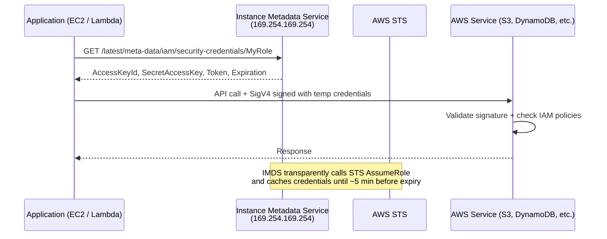
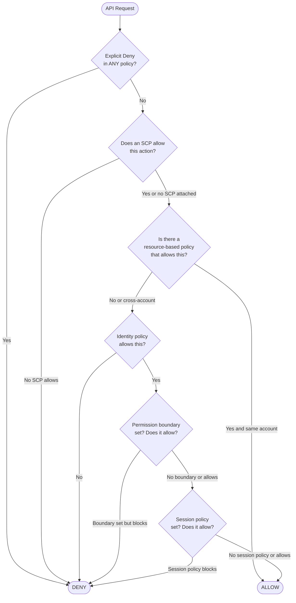
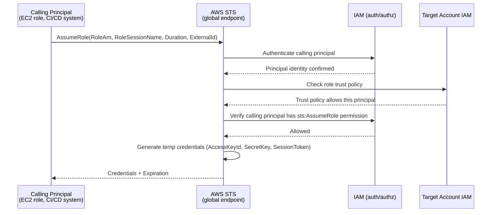
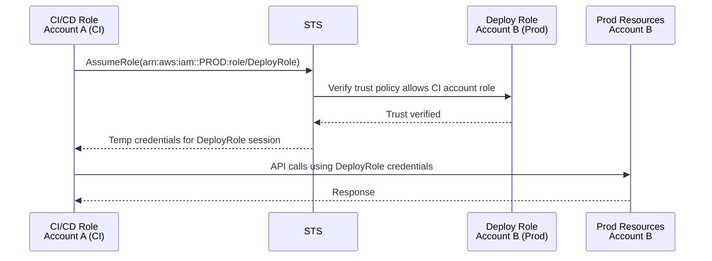
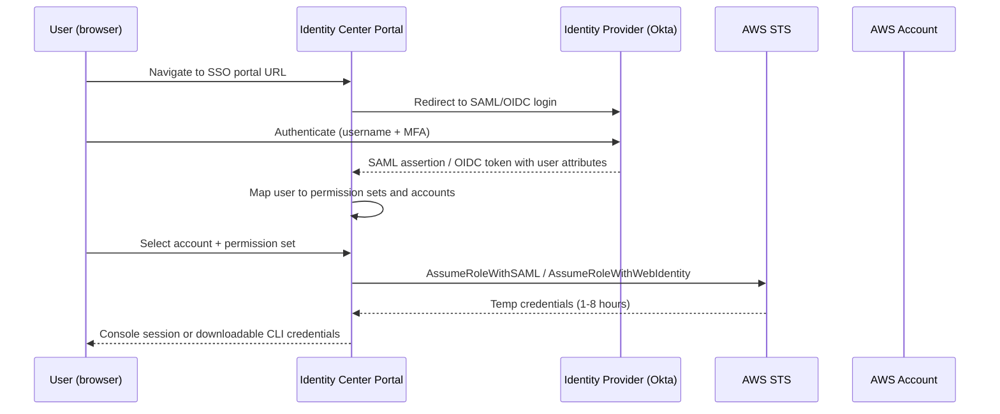
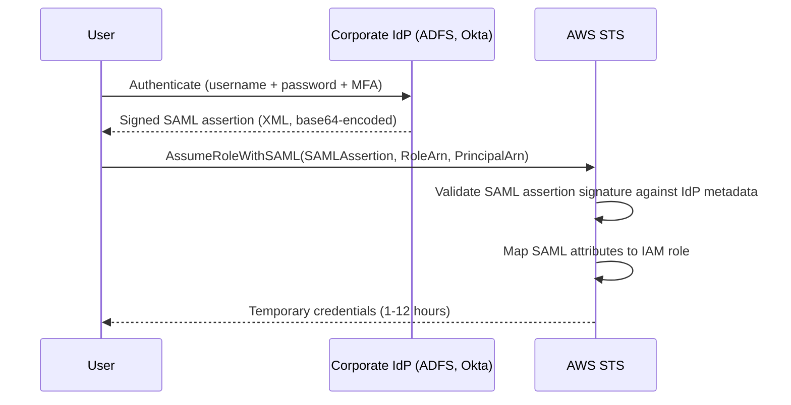
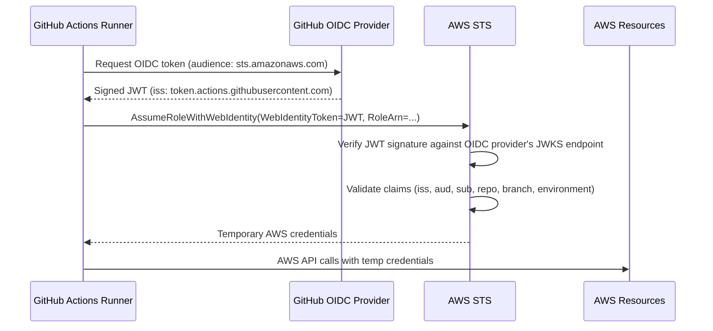

# AWS IDENTITY & ACCESS MANAGEMENT — Deep Dive Interview Preparation

> **Scope:** Section 2 of 20 | Beginner → Expert progression | FAANG-level depth  
> **Coverage:** IAM Users/Groups/Roles/Policies, Permission Boundaries, SCPs, STS, Identity Center, Federation, IRSA, EKS Pod Identity, 50+ Q&A

---

## Table of Contents

1. [IAM Core Concepts](#1-iam-core-concepts)
2. [IAM Policies In Depth](#2-iam-policies-in-depth)
3. [Permission Boundaries](#3-permission-boundaries)
4. [IAM Policy Evaluation Logic](#4-iam-policy-evaluation-logic)
5. [AWS STS & Temporary Credentials](#5-aws-sts--temporary-credentials)
6. [Cross-Account Access](#6-cross-account-access)
7. [IAM Identity Center (AWS SSO)](#7-iam-identity-center-aws-sso)
8. [Federation: SAML, OIDC, Web Identity](#8-federation-saml-oidc-web-identity)
9. [JWT Tokens — Access vs ID Tokens](#9-jwt-tokens--access-vs-id-tokens)
10. [IAM Roles for Service Accounts (IRSA)](#10-iam-roles-for-service-accounts-irsa)
11. [EKS Pod Identity](#11-eks-pod-identity)
12. [IAM Access Analyzer](#12-iam-access-analyzer)
13. [MFA & Security Best Practices](#13-mfa--security-best-practices)
14. [Interview Questions & Answers (50+)](#14-interview-questions--answers-50)
15. [Troubleshooting Scenarios](#15-troubleshooting-scenarios)
16. [Production Best Practices](#16-production-best-practices)
17. [Documentation Links](#17-documentation-links)

---

## 1. IAM Core Concepts

### 1.1 IAM Users

#### Beginner Foundation

An **IAM User** is a permanent identity in an AWS account representing a person or an application. IAM users have long-term credentials: a username/password for Console access and optionally an Access Key ID + Secret Access Key for programmatic access.

**Problem it solves:** Before IAM, you'd share root account credentials. IAM users give each person (or service) their own identity, with independently controllable permissions and auditable activity.

**When NOT to use IAM users:**
- For applications running on EC2, Lambda, ECS, or EKS — use IAM roles instead (no long-term credential management).
- For human access in organizations with > 1 account — use IAM Identity Center (federated login).
- Never share IAM users between people — it breaks individual auditability.

**Key properties:**
- Exist in exactly one AWS account.
- Can belong to multiple IAM groups.
- Have an ARN: `arn:aws:iam::123456789012:user/alice`.
- Can have up to 2 active access keys simultaneously (for rotation without downtime).

#### Intermediate Mechanics

**Access key rotation:** You should rotate access keys regularly (every 90 days per CIS benchmark). The two-key limit supports zero-downtime rotation:

```bash
# Step 1: Create new key while old key still works
NEW_KEY=$(aws iam create-access-key --user-name alice \
  --query 'AccessKey.{Key:AccessKeyId,Secret:SecretAccessKey}')

# Step 2: Update applications with new key, test

# Step 3: Deactivate old key (monitor for failures)
aws iam update-access-key \
  --user-name alice \
  --access-key-id AKIAOLDKEYEXAMPLE \
  --status Inactive

# Step 4: Delete old key after confirming everything works
aws iam delete-access-key \
  --user-name alice \
  --access-key-id AKIAOLDKEYEXAMPLE
```

**IAM User activity monitoring:**
```bash
# Check when credentials were last used
aws iam get-credential-report  # Generate report first
aws iam generate-credential-report

# Decode the CSV report
aws iam get-credential-report \
  --query 'Content' --output text | base64 -d | column -t -s ','
```

**Unused credential detection (AWS Config rule: `iam-user-unused-credentials-check`):** Marks users as non-compliant if they have access keys or console passwords unused for > 90 days.

#### Advanced Engineering

**The case against long-term IAM user credentials:**
- If a key is leaked (GitHub, logs, memory dump), it remains valid until manually rotated or deleted.
- Keys don't expire automatically — a terminated employee's key works until someone notices and deletes it.
- No MFA enforcement at the API level (MFA can be required via IAM policy conditions, but not enforced by the API itself for CLI calls).

**Preferred patterns in 2024:**
1. **Human access:** IAM Identity Center (SSO) with short-lived role credentials (1–8 hours).
2. **CI/CD:** OIDC federation (GitHub Actions, GitLab CI) with `sts:AssumeRoleWithWebIdentity` — zero long-term credentials.
3. **Application on EC2/ECS/Lambda:** IAM role attached to the compute resource — credentials delivered via IMDS, automatically rotated.
4. **Cross-account automation:** Role trust relationships — no user credentials cross account boundaries.

---

### 1.2 IAM Groups

**Groups** are containers for users that allow applying a common set of policies to multiple users at once. Groups cannot be nested (a group cannot contain another group). Groups cannot be assumed as principals.

**Practical pattern:**
```
Groups:
├── Developers      → PowerUserAccess (managed) + DenyBillingPolicy (inline)
├── Operators       → ReadOnlyAccess + EC2RestartPolicy + SSMSessionPolicy
├── SecurityTeam    → SecurityAuditAccess + GuardDutyReadOnly + IAMReadOnlyAccess
└── DataEngineers   → GlueFullAccess + AthenaFullAccess + S3ReadPolicy
```

**Limitation:** IAM groups are an account-level construct. For multi-account access management, use IAM Identity Center permission sets instead — permission sets are deployed across all accounts as IAM roles.

---

### 1.3 IAM Roles

#### Beginner Foundation

An **IAM Role** is an identity without permanent credentials. Instead of a static access key, roles issue **temporary credentials** via AWS STS when assumed. Any entity that the role's trust policy permits can assume the role and inherit its permissions.

**Why roles are superior to users for machine identities:**
- Temporary credentials auto-expire (15 min to 12 hours, configurable).
- If credentials leak, they expire quickly without manual intervention.
- No credential distribution problem — EC2 instances get role credentials via the instance metadata service (IMDS), not from stored files.
- Full auditability — every `AssumeRole` call is logged in CloudTrail with the requesting principal identity.

**Role components:**
1. **Trust policy** (resource-based policy on the role): Defines who can assume the role. The `Principal` specifies the allowed entities.
2. **Permissions policies** (identity-based policies): Define what actions the role can take.
3. **Session duration:** Configurable from 15 minutes to 12 hours (or up to the role's `MaxSessionDuration`, default 1 hour).
4. **Role name and ARN:** `arn:aws:iam::123456789012:role/MyRole`.

#### Intermediate Mechanics

**Role assumption flow:**



**Instance profile:** An EC2 instance cannot directly have an IAM role. An **instance profile** is the container that holds the role and is attached to the instance. The instance profile has a 1:1 relationship with a role.

```bash
# Create role, instance profile, and link them
aws iam create-role --role-name MyEC2Role \
  --assume-role-policy-document '{
    "Version":"2012-10-17",
    "Statement":[{"Effect":"Allow","Principal":{"Service":"ec2.amazonaws.com"},"Action":"sts:AssumeRole"}]
  }'

aws iam attach-role-policy \
  --role-name MyEC2Role \
  --policy-arn arn:aws:iam::aws:policy/AmazonS3ReadOnlyAccess

aws iam create-instance-profile --instance-profile-name MyEC2Profile
aws iam add-role-to-instance-profile \
  --instance-profile-name MyEC2Profile \
  --role-name MyEC2Role

# Attach instance profile to running instance
aws ec2 associate-iam-instance-profile \
  --instance-id i-0abc123def456 \
  --iam-instance-profile Name=MyEC2Profile
```

**Terraform equivalent:**
```hcl
resource "aws_iam_role" "ec2_role" {
  name = "ec2-app-role"
  assume_role_policy = jsonencode({
    Version = "2012-10-17"
    Statement = [{
      Effect    = "Allow"
      Principal = { Service = "ec2.amazonaws.com" }
      Action    = "sts:AssumeRole"
    }]
  })
}

resource "aws_iam_instance_profile" "app" {
  name = "ec2-app-profile"
  role = aws_iam_role.ec2_role.name
}

resource "aws_instance" "app" {
  ami                  = data.aws_ami.al2.id
  instance_type        = "t3.micro"
  iam_instance_profile = aws_iam_instance_profile.app.name
}
```

#### Advanced Engineering

**IMDSv2 vs IMDSv1:**

IMDSv1 (original) uses simple HTTP GET requests to `169.254.169.254`. Any process or SSRF attack can reach this endpoint and steal role credentials.

IMDSv2 (required for security hardening) requires a PUT request to get a session token first, then uses that token in GET requests. This prevents SSRF-based credential theft because the PUT request typically cannot be triggered by SSRF.

```bash
# Force IMDSv2 on all new instances
aws ec2 modify-instance-metadata-options \
  --instance-id i-0abc123 \
  --http-tokens required \
  --http-endpoint enabled

# Enforce IMDSv2 organization-wide via SCP
# Add to SCP: Deny ec2:RunInstances if imds-v1 is allowed
```

```json
{
  "Sid": "RequireIMDSv2",
  "Effect": "Deny",
  "Action": "ec2:RunInstances",
  "Resource": "arn:aws:ec2:*:*:instance/*",
  "Condition": {
    "StringNotEquals": {
      "ec2:MetadataHttpTokens": "required"
    }
  }
}
```

**Role session tagging:** When assuming a role, you can pass session tags that become part of the principal context and can be referenced in IAM conditions. This enables attribute-based access control (ABAC).

```bash
aws sts assume-role \
  --role-arn arn:aws:iam::123456789012:role/DataProcessor \
  --role-session-name john-session \
  --tags Key=Department,Value=Engineering Key=CostCenter,Value=12345
```

IAM policy using session tags for ABAC:
```json
{
  "Effect": "Allow",
  "Action": "s3:GetObject",
  "Resource": "arn:aws:s3:::data-lake/${aws:PrincipalTag/Department}/*"
}
```
This allows the `DataProcessor` role to read only objects under the `Engineering/` prefix when assumed with `Department=Engineering` session tag.

---

## 2. IAM Policies In Depth

### 2.1 Policy Types

AWS has six types of policies that can affect effective permissions:

| Policy Type | Attached to | Controls |
|---|---|---|
| **Identity-based (managed/inline)** | User, Group, Role | What the principal can do |
| **Resource-based** | Resource (S3 bucket, SQS, KMS key) | Who can access the resource |
| **Permission boundary** | User or Role | Maximum permissions (ceiling) |
| **Session policy** | STS `AssumeRole*` call | Further restrict session permissions |
| **SCP** | Org Root, OU, Account | Maximum permissions for all principals in the account |
| **ACL** | Legacy (S3, VPC) | Cross-account resource sharing |

### 2.2 Identity-Based Policies

**Managed policies:** Standalone policy documents with an ARN. Can be AWS-managed (`arn:aws:iam::aws:policy/...`) or customer-managed (`arn:aws:iam::123456789012:policy/...`). Can be attached to multiple principals.

**Inline policies:** Embedded directly in a user, group, or role. Cannot be shared. Useful when you want a strict 1:1 relationship between a policy and a principal (policy is deleted with the principal).

**Policy structure:**
```json
{
  "Version": "2012-10-17",
  "Statement": [
    {
      "Sid": "AllowS3BucketList",
      "Effect": "Allow",
      "Action": ["s3:ListBucket"],
      "Resource": "arn:aws:s3:::my-bucket",
      "Condition": {
        "StringLike": {
          "s3:prefix": ["home/${aws:username}/*", ""]
        }
      }
    },
    {
      "Sid": "AllowS3ObjectOps",
      "Effect": "Allow",
      "Action": ["s3:GetObject", "s3:PutObject", "s3:DeleteObject"],
      "Resource": "arn:aws:s3:::my-bucket/home/${aws:username}/*"
    }
  ]
}
```

**Policy variables:** `${aws:username}`, `${aws:userid}`, `${aws:PrincipalTag/key}` — substituted at evaluation time. Essential for ABAC and per-user home directory patterns.

**`NotAction` and `NotResource`:** The inverse of Action/Resource. `NotAction: ["iam:*"]` means "all actions except IAM actions." Used in deny SCPs to exclude global services from Region restrictions. **Never use NotAction in Allow statements** — it grants access to everything except the listed actions, which is almost always overly permissive.

### 2.3 Resource-Based Policies

A resource-based policy is attached to the resource rather than the principal. It specifies who (the `Principal`) can access the resource and what they can do.

**Services supporting resource-based policies:** S3 (bucket policy), SQS, SNS, KMS keys, Lambda functions, API Gateway, ECR repositories, Secrets Manager, CloudWatch Logs resource policies.

**Cross-account access via resource policy:**

For cross-account access, the requesting account's IAM policy AND the resource's resource-based policy must both allow the action:

```json
// S3 bucket policy in Account A — allows Account B to read
{
  "Version": "2012-10-17",
  "Statement": [
    {
      "Effect": "Allow",
      "Principal": {
        "AWS": "arn:aws:iam::ACCOUNT-B-ID:role/DataReaderRole"
      },
      "Action": "s3:GetObject",
      "Resource": "arn:aws:s3:::accountA-data-bucket/*"
    }
  ]
}
```

```json
// IAM policy in Account B — allows the role to call s3:GetObject cross-account
{
  "Effect": "Allow",
  "Action": "s3:GetObject",
  "Resource": "arn:aws:s3:::accountA-data-bucket/*"
}
```

**Exception — KMS key grants:** When a KMS key is used for S3 server-side encryption, the key's resource policy must explicitly allow the IAM role in Account B to use the key for decryption, even if S3 bucket access is granted.

### 2.4 Session Policies

A session policy further restricts the permissions of a role session. It is passed at `AssumeRole` time and cannot grant permissions beyond what the role's identity policy allows — it can only restrict.

```bash
# Assume a role with a session policy restricting to read-only S3
aws sts assume-role \
  --role-arn arn:aws:iam::123456789012:role/DataProcessorRole \
  --role-session-name limited-session \
  --policy '{
    "Version": "2012-10-17",
    "Statement": [{
      "Effect": "Allow",
      "Action": ["s3:GetObject", "s3:ListBucket"],
      "Resource": "*"
    }]
  }'
```

Even if `DataProcessorRole` has `AmazonS3FullAccess`, this session can only perform read operations.

**Use case:** A CI/CD pipeline assumes a deployment role but each job further restricts the session to only the resources it needs (least-privilege per pipeline stage).

---

## 3. Permission Boundaries

#### Beginner Foundation

A **permission boundary** is an IAM policy attached to a user or role that sets the *maximum* permissions they can have. Even if an identity policy grants `s3:*`, if the permission boundary allows only `s3:GetObject`, the effective permission is only `s3:GetObject`.

**Problem it solves:** Delegated administration. You want developers to be able to create their own IAM roles (for their applications), but you don't want them to create roles with permissions beyond what they themselves have (privilege escalation prevention).

**Key rule:** The effective permissions are the INTERSECTION of:
- What the identity policy allows
- What the permission boundary allows

Neither can grant what the other doesn't allow.

#### Intermediate Mechanics

**Permission boundary example — delegated role creation:**

```
Situation: Platform team needs to let developers create Lambda execution roles.
Risk: Developer creates a Lambda role with AdministratorAccess and uses Lambda to exfiltrate data.
Solution: Require all roles created by developers to have a permission boundary that limits maximum permissions.
```

**Permission boundary policy (restricts maximum permissions for created roles):**
```json
{
  "Version": "2012-10-17",
  "Statement": [
    {
      "Sid": "AllowedServices",
      "Effect": "Allow",
      "Action": [
        "s3:*", "dynamodb:*", "logs:*", "lambda:*",
        "xray:*", "ec2:DescribeVpcs", "ec2:DescribeSubnets"
      ],
      "Resource": "*"
    },
    {
      "Sid": "DenyIAMWithoutBoundary",
      "Effect": "Deny",
      "Action": "iam:*",
      "Resource": "*"
    }
  ]
}
```

**Developer's IAM policy that allows creating roles only if they attach the boundary:**
```json
{
  "Statement": [
    {
      "Effect": "Allow",
      "Action": [
        "iam:CreateRole",
        "iam:AttachRolePolicy",
        "iam:PutRolePolicy"
      ],
      "Resource": "*",
      "Condition": {
        "StringEquals": {
          "iam:PermissionsBoundary": "arn:aws:iam::123456789012:policy/DevRoleBoundary"
        }
      }
    }
  ]
}
```

Now developers can create roles, but only if they attach the boundary. Any role they create is limited to the services in the boundary policy — they cannot escalate beyond their own permissions.

#### Advanced Engineering

**Permission boundary vs. SCP — critical distinction:**

| Dimension | Permission Boundary | SCP |
|---|---|---|
| Applies to | Specific IAM user or role | All principals in account/OU |
| Set by | IAM admin in the account | Organization admin |
| Granularity | Individual principal | Account or OU |
| Cascades | No | Yes (inherited by child OUs) |
| Affects root user | No | Yes (member account root) |

**Common privilege escalation vectors that boundaries prevent:**
1. Developer with `iam:CreateRole + iam:AttachRolePolicy` creates a role with `AdministratorAccess` and assumes it.
2. Developer with `iam:PutUserPolicy` attaches an admin policy to their own user.
3. Developer with `iam:CreatePolicyVersion` creates a new version of an existing policy with elevated permissions and sets it as default.

The safest pattern: developers should not have any `iam:*` permissions in production. Use an IaC pipeline (Terraform + GitHub Actions + code review) for all IAM changes.

---

## 4. IAM Policy Evaluation Logic

This is the most commonly tested IAM topic in senior-level interviews. The algorithm is non-trivial and has subtle interactions between policy types.



**Complete evaluation order:**

1. **Explicit Deny:** Any Deny in any policy (SCP, identity, resource, boundary, session) immediately denies. No further evaluation.
2. **SCP:** If an SCP is attached to the account or any parent OU, the action must be explicitly allowed by the SCPs. The default `FullAWSAccess` SCP allows everything. If no SCP applies (management account), skip this step.
3. **Resource-based policy:** If a resource-based policy grants access to the calling principal, and the principal is in the **same account**, the request is allowed without needing an identity policy (exception for cross-account — see below).
4. **Identity-based policy:** The calling principal's attached policies (user policies, group policies, role policies) must allow the action.
5. **Permission boundary:** If a permission boundary is attached, the boundary must also allow the action.
6. **Session policy:** If a session policy was passed at AssumeRole time, it must also allow the action.

**Cross-account subtlety:** In cross-account requests, BOTH the resource-based policy AND an identity-based policy in the calling account must allow the action. A KMS key policy in Account A granting `kms:Decrypt` to a role in Account B is not sufficient — Account B's IAM policy must also allow `kms:Decrypt` on that key.

**Interview trick question:** *"Can a resource policy alone grant access without an identity policy?"*
- **Same account:** YES (e.g., an S3 bucket policy allowing `aws:PrincipalAccount: 123456789012` allows anyone in that account to access S3 without explicit IAM policies, but they still need SCP clearance).
- **Cross-account:** NO. Both resource policy AND identity policy must allow the action.

---

## 5. AWS STS & Temporary Credentials

#### Beginner Foundation

**AWS Security Token Service (STS)** is the service that issues temporary security credentials. Instead of using long-term IAM user credentials, applications assume an IAM role and receive temporary credentials (Access Key ID, Secret Access Key, Session Token) that expire automatically.

**Key operations:**
- `AssumeRole`: Assume a role within your own account or another account.
- `AssumeRoleWithWebIdentity`: Assume a role using an OIDC identity token (used by IRSA, EKS Pod Identity, GitHub Actions).
- `AssumeRoleWithSAML`: Assume a role using SAML assertion (used by enterprise SSO).
- `GetSessionToken`: Get temporary credentials for an IAM user (adds MFA token).
- `GetCallerIdentity`: Return information about the current credential (useful for debugging — which account, which principal).

#### Intermediate Mechanics

**AssumeRole request flow:**



**STS token components:**
- **AccessKeyId:** Always starts with `ASIA` (vs `AKIA` for IAM user keys).
- **SecretAccessKey:** Used for SigV4 signing.
- **SessionToken:** A cryptographically signed blob from STS. Must be included in every API request using the `x-amz-security-token` header.
- **Expiration:** UTC timestamp when credentials expire.

**ExternalId — the confused deputy problem:**

Without ExternalId, if Company A grants Company B's AWS account the ability to assume a role, and Company B serves many customers, a malicious customer could trick Company B's service into assuming Company A's role (confused deputy attack).

ExternalId is a customer-supplied secret added to the trust policy. Company A's trust policy requires ExternalId to match a specific customer-known value:

```json
{
  "Condition": {
    "StringEquals": {
      "sts:ExternalId": "customer-specific-unique-string"
    }
  }
}
```

Only Company B's service knows the ExternalId for each customer, preventing cross-customer confused deputy attacks.

#### Advanced Engineering

**STS regional endpoints vs. global endpoint:**

STS has a global endpoint (`sts.amazonaws.com`) and regional endpoints (`sts.us-east-1.amazonaws.com`, etc.). Best practices:
- Use regional endpoints for lower latency and to avoid dependency on the STS global endpoint.
- Regional STS tokens are valid in all Regions — the endpoint choice only affects where the token is *generated*, not where it can be *used*.
- Configure regional endpoints in AWS SDK: `AWS_STS_REGIONAL_ENDPOINTS=regional` or in `~/.aws/config: sts_regional_endpoints = regional`.

**Credential chain (how the AWS SDK finds credentials):**

The SDK checks in order:
1. Explicit credentials in code (never hardcode in production).
2. `AWS_ACCESS_KEY_ID` / `AWS_SECRET_ACCESS_KEY` / `AWS_SESSION_TOKEN` environment variables.
3. AWS credentials file (`~/.aws/credentials`).
4. AWS config file profile (`~/.aws/config`).
5. Container credential provider (ECS/Fargate — `AWS_CONTAINER_CREDENTIALS_RELATIVE_URI`).
6. IMDSv2 instance metadata (EC2 instance role).
7. EKS Pod Identity / IRSA (via projected volume — `AWS_WEB_IDENTITY_TOKEN_FILE`).

**Understanding this order is critical:** An EC2 instance with both environment variables set AND an instance role will use the environment variables (higher in the chain). This can cause unexpected behavior when developers set credentials in env vars on an EC2 instance.

**Token expiry and refresh:** AWS SDKs automatically refresh credentials before they expire. The refresh happens when < 5 minutes remain on the credentials. If the refresh fails (network issue, IAM change), the application receives an `ExpiredTokenException`. Applications should handle this gracefully with retry logic.

---

## 6. Cross-Account Access

#### Beginner Foundation

**Cross-account access** lets a principal in Account A access resources in Account B by assuming a role in Account B. This is the standard way to enable:
- CI/CD pipelines (central CI account deploying to multiple environment accounts).
- Centralized logging (all accounts writing to a Log Archive account).
- Security tooling (security account having read access to all other accounts).
- Data sharing between product teams.

#### Intermediate Mechanics

**Cross-account role assumption:**



**Trust policy in Account B (prod), trusting Account A (CI):**
```json
{
  "Version": "2012-10-17",
  "Statement": [
    {
      "Effect": "Allow",
      "Principal": {
        "AWS": "arn:aws:iam::ACCOUNT-A-ID:role/GitHubActionsRole"
      },
      "Action": "sts:AssumeRole",
      "Condition": {
        "StringEquals": {
          "sts:ExternalId": "prod-deploy-external-id"
        },
        "BoolIfExists": {
          "aws:MultiFactorAuthPresent": "true"
        }
      }
    }
  ]
}
```

**IAM policy in Account A, allowing role assumption:**
```json
{
  "Effect": "Allow",
  "Action": "sts:AssumeRole",
  "Resource": "arn:aws:iam::ACCOUNT-B-ID:role/DeployRole"
}
```

**AWS CLI cross-account profile:**
```ini
# ~/.aws/config
[profile prod-deploy]
role_arn = arn:aws:iam::PROD-ACCOUNT-ID:role/DeployRole
source_profile = default
role_session_name = my-session
external_id = prod-deploy-external-id
```

```bash
aws s3 ls --profile prod-deploy  # Automatically assumes the cross-account role
```

#### Advanced Engineering

**Role chaining:** Assuming a role from a role session is allowed, but the maximum session duration for a chained session is capped at 1 hour regardless of the role's MaxSessionDuration setting. This catches engineers who set MaxSessionDuration to 8 hours expecting it to work for chained role assumptions.

**Resource-based policy for S3 cross-account without role assumption:**

For some services (S3, SQS, SNS, KMS), you can grant direct cross-account access via resource policies without role assumption. The account B principal directly accesses Account A's resource using their own credentials, as long as:
- Account A's resource policy allows Account B's principal.
- Account B's IAM policy allows the action on Account A's resource.

This is simpler but provides less audit clarity than role assumption (no role session name, harder to track at the resource level).

---

## 7. IAM Identity Center (AWS SSO)

#### Beginner Foundation

**IAM Identity Center** (formerly AWS Single Sign-On) is AWS's managed SSO service. It provides a single login point for all AWS accounts in an Organization, with centralized user management, and supports federation from external identity providers (Okta, Azure AD, Google Workspace).

**Problem it solves:** Without Identity Center, every AWS account has separate IAM users for each person. With 50 people and 20 accounts, that's 1,000 IAM users to manage. Identity Center reduces this to one identity per person, managed centrally.

**Core components:**
- **Identity source:** Where users and groups are defined. Options: Identity Center's built-in directory, SAML-federated external IdP (Okta, Azure AD), or SCIM-synchronized external IdP.
- **Permission sets:** IAM policy templates deployed as roles to selected accounts. A permission set called "ReadOnly" deploys a role named `AWSReservedSSO_ReadOnly_XXXX` in each target account.
- **Account assignments:** Which users/groups get which permission sets in which accounts.
- **Portal URL:** `https://your-org.awsapps.com/start` — users land here, see their accounts, and get temporary credentials or console access.

#### Intermediate Mechanics

**How Identity Center login works:**



**SCIM provisioning:** SCIM (System for Cross-domain Identity Management) is a protocol for automatically provisioning and deprovisioning users in Identity Center when they're added/removed from the external IdP. Without SCIM, you'd need to manually sync users. With SCIM:
- New employee added to Okta → automatic user creation in Identity Center.
- Employee termination in Okta → automatic deprovisioning in Identity Center → immediate loss of AWS access.

**Permission set → role mapping:**
```
Permission Set: "PlatformEngineerAccess"
├── Policies: PowerUserAccess + EKSFullAccess
├── Session duration: 4 hours
└── Deployed to accounts: prod-app1, prod-app2, dev-app1

Creates in each account:
└── IAM Role: AWSReservedSSO_PlatformEngineerAccess_a1b2c3d4
    ├── Trust: identity-center.amazonaws.com
    └── Policies: PowerUserAccess + EKSFullAccess
```

**CLI access via Identity Center:**
```bash
# Configure SSO profile
aws configure sso
# Prompts for: SSO start URL, region, account, role

# Login (opens browser)
aws sso login --profile my-sso-profile

# Use the profile
aws s3 ls --profile my-sso-profile
```

#### Advanced Engineering

**Multi-identity-source limitation:** Identity Center supports only ONE active identity source at a time (either the built-in directory, or SAML/SCIM federation from one external IdP). You cannot federate from both Okta and Azure AD simultaneously into Identity Center. Workaround: federate from a single canonical IdP and configure that IdP to accept authentication from both providers.

**Identity Center attribute synchronization for ABAC:** Identity Center can pass user attributes (department, team, cost center) as session tags into the assumed role session. IAM policies in target accounts can then use `aws:PrincipalTag` conditions to enforce data access segregation without account-per-team separation.

**Audit trail:** Every Identity Center login and permission set assumption appears in CloudTrail as `sso.amazonaws.com` events. The `userIdentity.type` is `AssumedRole` and the session name identifies the Identity Center user.

---

## 8. Federation: SAML, OIDC, Web Identity

### 8.1 SAML 2.0 Federation

**SAML (Security Assertion Markup Language 2.0)** is an XML-based standard for exchanging authentication and authorization data between an identity provider (IdP) and a service provider (SP). AWS acts as the SP.

**SAML federation flow:**



**Key SAML configuration in AWS:**
1. Create SAML identity provider in IAM (upload IdP metadata XML).
2. Create IAM roles with trust policy allowing `sts:AssumeRoleWithSAML` for the SAML provider.
3. Configure IdP to include the `https://aws.amazon.com/SAML/Attributes/Role` attribute in assertions, mapping to the IAM role ARN.

**Trust policy for SAML federation:**
```json
{
  "Version": "2012-10-17",
  "Statement": [{
    "Effect": "Allow",
    "Principal": {
      "Federated": "arn:aws:iam::123456789012:saml-provider/MyCorpIdP"
    },
    "Action": "sts:AssumeRoleWithSAML",
    "Condition": {
      "StringEquals": {
        "SAML:aud": "https://signin.aws.amazon.com/saml"
      }
    }
  }]
}
```

### 8.2 OIDC (OpenID Connect) Federation

**OIDC** is an authentication layer built on top of OAuth2. It uses JSON Web Tokens (JWTs) instead of SAML's XML. Used for:
- GitHub Actions → AWS (CI/CD with no stored secrets).
- Kubernetes workloads via IRSA.
- Modern web applications federating to AWS.

**OIDC federation flow:**


**GitHub Actions OIDC trust policy:**
```json
{
  "Version": "2012-10-17",
  "Statement": [{
    "Effect": "Allow",
    "Principal": {
      "Federated": "arn:aws:iam::123456789012:oidc-provider/token.actions.githubusercontent.com"
    },
    "Action": "sts:AssumeRoleWithWebIdentity",
    "Condition": {
      "StringEquals": {
        "token.actions.githubusercontent.com:aud": "sts.amazonaws.com"
      },
      "StringLike": {
        "token.actions.githubusercontent.com:sub": "repo:myorg/myrepo:environment:production"
      }
    }
  }]
}
```

**GitHub Actions workflow using OIDC:**
```yaml
jobs:
  deploy:
    runs-on: ubuntu-latest
    permissions:
      id-token: write   # Required for OIDC token generation
      contents: read
    steps:
      - name: Configure AWS Credentials
        uses: aws-actions/configure-aws-credentials@v4
        with:
          role-to-assume: arn:aws:iam::123456789012:role/GitHubActionsDeployRole
          role-session-name: github-actions-${{ github.run_id }}
          aws-region: us-east-1

      - name: Deploy
        run: terraform apply -auto-approve
```

**Security consideration:** Always lock the OIDC trust policy's `sub` claim to a specific repository and environment (not just the organization). Without this, any repository in `myorg` could assume the role.

### 8.3 Web Identity Federation

Web Identity Federation uses `AssumeRoleWithWebIdentity` with external identity provider tokens (Amazon Cognito, Google, Facebook, Apple). Primarily used for mobile and web applications authenticating end users to access AWS resources directly.

**Modern pattern:** Use Amazon Cognito Identity Pools as the broker. The user authenticates with any supported IdP, Cognito validates the token, and Cognito calls STS to exchange it for AWS credentials. The application never directly interacts with STS.

---

## 9. JWT Tokens — Access vs ID Tokens

#### Beginner Foundation

A **JSON Web Token (JWT)** is a compact, URL-safe way to represent claims between parties. JWTs have three parts separated by dots: `header.payload.signature`, each base64url-encoded.

**Header:** Declares the token type and signing algorithm:
```json
{"typ": "JWT", "alg": "RS256", "kid": "key-id-for-verification"}
```

**Payload (claims):**
```json
{
  "iss": "https://cognito-idp.us-east-1.amazonaws.com/us-east-1_POOL",
  "sub": "user-id-uuid",
  "aud": "client-id-of-your-app",
  "exp": 1700000000,
  "iat": 1699996400,
  "email": "user@example.com",
  "cognito:groups": ["admins"]
}
```

**Signature:** `RS256(base64url(header) + "." + base64url(payload), private_key)`

#### Intermediate Mechanics

**Access Token vs. ID Token:**

| Dimension | Access Token | ID Token |
|---|---|---|
| **Purpose** | Authorize API access (who you're allowed to act as) | Authenticate user identity (who you are) |
| **Audience** (`aud`) | Resource servers (your API) | Client application (your app) |
| **Content** | Scopes, user ID, expiry | User profile claims (name, email, groups) |
| **Used by** | Your API to authorize requests | Your frontend to identify the logged-in user |
| **Should be validated by** | Your API server | Your application client |
| **Sent to** | Every API request as Bearer token | Only consumed by the client |
| **Lifespan** | Short (1 hour or less) | Short (1 hour or less) |

**Common mistake:** Using the ID token to authorize API access. The ID token is intended for the client (authentication) — it may contain user profile information but is not designed for resource authorization. The access token is what your API should validate.

**Refresh Token:** Long-lived token (days to weeks) used to obtain new access and ID tokens without re-authentication. Stored securely (httpOnly cookie or secure storage). If the refresh token is compromised, all sessions using it are at risk.

**JWT validation steps (your API must do all of these):**
1. Verify the signature using the IdP's public key (fetched from the JWKS endpoint: `/.well-known/jwks.json`).
2. Verify `exp` (not expired).
3. Verify `iss` matches the expected identity provider.
4. Verify `aud` contains your API's client ID.
5. Verify any required `scope` claims are present.

---

## 10. IAM Roles for Service Accounts (IRSA)

#### Beginner Foundation

**IRSA** is the mechanism for giving Kubernetes pods in EKS access to AWS services without storing credentials in the pod or using the EC2 node's role. Each Kubernetes service account is mapped to an IAM role, and pods using that service account get AWS credentials scoped to that role only.

**Problem it solves without IRSA:** All pods on an EC2 node share the node's IAM role. A compromised pod can use the node's role to access any AWS resource the node is allowed to access — often full EC2, S3, and network permissions.

**How IRSA works:**
1. EKS creates an **OIDC identity provider** for the cluster, registered in IAM.
2. A Kubernetes ServiceAccount is annotated with the IAM role ARN.
3. EKS mutates pods using that ServiceAccount to mount a projected OIDC token volume.
4. The AWS SDK inside the pod reads `AWS_WEB_IDENTITY_TOKEN_FILE` (path to the JWT) and calls `sts:AssumeRoleWithWebIdentity`.
5. STS validates the JWT, checks the IAM role trust policy, and issues temporary credentials.

#### Intermediate Mechanics

**Setting up IRSA:**

```bash
# Step 1: Get the OIDC provider URL for your cluster
OIDC_URL=$(aws eks describe-cluster \
  --name my-cluster \
  --query 'cluster.identity.oidc.issuer' \
  --output text | sed 's|https://||')
# e.g., oidc.eks.us-east-1.amazonaws.com/id/EXAMPLED539D4633E53DE1B716D3041E

# Step 2: Create the OIDC provider in IAM (if not already done)
aws iam create-open-id-connect-provider \
  --url https://$OIDC_URL \
  --client-id-list sts.amazonaws.com \
  --thumbprint-list $(openssl s_client -connect $OIDC_URL:443 < /dev/null 2>/dev/null \
    | openssl x509 -fingerprint -noout | sed 's/SHA1 Fingerprint=//' | tr -d ':' | tr '[:upper:]' '[:lower:]')

# Step 3: Create IAM role with trust policy allowing the service account
ACCOUNT_ID=$(aws sts get-caller-identity --query Account --output text)
cat > trust-policy.json << EOF
{
  "Version": "2012-10-17",
  "Statement": [{
    "Effect": "Allow",
    "Principal": {
      "Federated": "arn:aws:iam::${ACCOUNT_ID}:oidc-provider/${OIDC_URL}"
    },
    "Action": "sts:AssumeRoleWithWebIdentity",
    "Condition": {
      "StringEquals": {
        "${OIDC_URL}:sub": "system:serviceaccount:my-namespace:my-service-account",
        "${OIDC_URL}:aud": "sts.amazonaws.com"
      }
    }
  }]
}
EOF

aws iam create-role \
  --role-name my-app-irsa-role \
  --assume-role-policy-document file://trust-policy.json

aws iam attach-role-policy \
  --role-name my-app-irsa-role \
  --policy-arn arn:aws:iam::aws:policy/AmazonS3ReadOnlyAccess

# Step 4: Annotate the Kubernetes ServiceAccount
kubectl annotate serviceaccount my-service-account \
  -n my-namespace \
  eks.amazonaws.com/role-arn=arn:aws:iam::${ACCOUNT_ID}:role/my-app-irsa-role
```

**Terraform (eksctl-compatible):**
```hcl
module "irsa_role" {
  source  = "terraform-aws-modules/iam/aws//modules/iam-role-for-service-accounts-eks"
  version = "~> 5.0"

  role_name = "my-app-irsa"
  oidc_providers = {
    main = {
      provider_arn               = module.eks.oidc_provider_arn
      namespace_service_accounts = ["my-namespace:my-service-account"]
    }
  }
  role_policy_arns = {
    s3_read = "arn:aws:iam::aws:policy/AmazonS3ReadOnlyAccess"
  }
}
```

**Pod environment injected by EKS webhook:**
```yaml
# Automatically added to pods using an annotated ServiceAccount
env:
- name: AWS_ROLE_ARN
  value: "arn:aws:iam::123456789012:role/my-app-irsa-role"
- name: AWS_WEB_IDENTITY_TOKEN_FILE
  value: "/var/run/secrets/eks.amazonaws.com/serviceaccount/token"
volumeMounts:
- mountPath: /var/run/secrets/eks.amazonaws.com/serviceaccount
  name: aws-iam-token
volumes:
- name: aws-iam-token
  projected:
    sources:
    - serviceAccountToken:
        audience: sts.amazonaws.com
        expirationSeconds: 86400
        path: token
```

#### Advanced Engineering

**Token expiry and refresh:** The projected OIDC token expires every 24 hours by default (configurable). The AWS SDK watches the file and automatically calls `AssumeRoleWithWebIdentity` when the token is refreshed by the kubelet. The kubelet rotates the token file before expiry.

**IRSA token validation:** STS fetches the OIDC provider's JWKS endpoint to validate the JWT signature. If there's a network issue preventing STS from reaching the OIDC endpoint, IRSA token exchange fails. Ensure your cluster's OIDC endpoint is publicly accessible or use a private OIDC endpoint with a VPC endpoint for STS.

**Cross-account IRSA:** An EKS cluster in Account A can use IRSA to assume a role in Account B. The IAM role in Account B's trust policy must reference Account A's OIDC provider ARN.

---

## 11. EKS Pod Identity

#### Beginner Foundation

**EKS Pod Identity** is a newer (GA November 2023) mechanism for pod-level AWS credentials, designed to be simpler than IRSA. Unlike IRSA, Pod Identity does not require configuring an OIDC provider or annotating roles with cluster-specific trust policies. The cluster handles the association.

**Key difference from IRSA:**
| Dimension | IRSA | EKS Pod Identity |
|---|---|---|
| OIDC provider required | Yes (manual setup) | No |
| Trust policy configuration | Cluster-specific OIDC URL in trust policy | Generic `pods.eks.amazonaws.com` principal |
| Association mechanism | ServiceAccount annotation | EKS API (`create-pod-identity-association`) |
| Portability | Role bound to specific cluster OIDC | Same role reusable across any cluster |
| Credential delivery | OIDC token file + STS | EKS agent on node proxies credential request |
| Availability | All EKS-supported regions | Most regions (check regional support) |

#### Intermediate Mechanics

**Setup:**
```bash
# Step 1: Create IAM role with Pod Identity trust policy (no cluster-specific OIDC)
cat > trust-policy.json << 'EOF'
{
  "Version": "2012-10-17",
  "Statement": [{
    "Effect": "Allow",
    "Principal": {
      "Service": "pods.eks.amazonaws.com"
    },
    "Action": ["sts:AssumeRole", "sts:TagSession"]
  }]
}
EOF

aws iam create-role \
  --role-name my-app-pod-identity-role \
  --assume-role-policy-document file://trust-policy.json

aws iam attach-role-policy \
  --role-name my-app-pod-identity-role \
  --policy-arn arn:aws:iam::aws:policy/AmazonDynamoDBReadOnlyAccess

# Step 2: Create the association in EKS
aws eks create-pod-identity-association \
  --cluster-name my-cluster \
  --namespace my-namespace \
  --service-account my-service-account \
  --role-arn arn:aws:iam::123456789012:role/my-app-pod-identity-role
```

**How it works internally:** The EKS node runs a `eks-pod-identity-agent` DaemonSet. When a pod requests credentials via the extended ECS credentials endpoint (`http://169.254.170.23/v1/credentials`), the agent intercepts the request, validates the pod's ServiceAccount against registered associations, and calls STS on behalf of the pod. The pod's `AWS_CONTAINER_CREDENTIALS_FULL_URI` and `AWS_CONTAINER_AUTHORIZATION_TOKEN_FILE` environment variables point to the agent.

**When to prefer Pod Identity over IRSA:**
- New clusters: Pod Identity is simpler to operate.
- Multi-cluster environments: Same IAM role usable without per-cluster trust policy updates.
- When you want to avoid managing OIDC provider thumbprints.

**When IRSA might still be preferred:**
- Cross-account scenarios where fine-grained OIDC claims control is needed.
- Legacy workflows already built around IRSA.
- When the region does not yet support Pod Identity.

---

## 12. IAM Access Analyzer

**IAM Access Analyzer** identifies resources in your account that are accessible from external principals (other accounts, public, or the internet). It uses automated reasoning (provable security) to analyze resource-based policies.

**What it analyzes:**
- S3 buckets (bucket policies and ACLs).
- IAM roles (trust policies allowing external principals).
- KMS keys.
- SQS queues.
- Lambda functions.
- SNS topics.
- Secrets Manager secrets.

**Zone of trust:** You define the zone of trust (an account or an Organization). Findings are generated for any resource accessible from outside the zone of trust.

```bash
# Create an analyzer for an account
aws accessanalyzer create-analyzer \
  --analyzer-name my-account-analyzer \
  --type ACCOUNT  # or ORGANIZATION

# List current findings
aws accessanalyzer list-findings \
  --analyzer-arn arn:aws:accessanalyzer:us-east-1:123456789012:analyzer/my-account-analyzer \
  --filter '{"status": {"eq": ["ACTIVE"]}}'

# Archive a finding (acknowledge it as intentional)
aws accessanalyzer update-findings \
  --analyzer-arn arn:aws:accessanalyzer:us-east-1:123456789012:analyzer/my-account-analyzer \
  --ids "finding-id-uuid" \
  --status ARCHIVED
```

**Access Analyzer for policy validation:** Before deploying a new IAM policy, validate it for syntax errors, security warnings, and overly permissive patterns:

```bash
aws accessanalyzer validate-policy \
  --policy-document file://my-policy.json \
  --policy-type IDENTITY_POLICY
```

**Policy generation:** Access Analyzer can analyze CloudTrail logs and generate a least-privilege policy based on actual API calls made by a principal over the last 90 days. This is the most practical way to right-size overly broad policies in production.

---

## 13. MFA & Security Best Practices

**MFA in IAM:**
- Root account: Always enable MFA. Use hardware MFA (YubiKey) for production accounts.
- IAM users with console access: Enforce MFA via IAM condition policy.
- MFA for programmatic access: Use `sts:GetSessionToken` with MFA — the resulting session has MFA context (`aws:MultiFactorAuthPresent: true`).

**Enforce MFA for console operations:**
```json
{
  "Version": "2012-10-17",
  "Statement": [
    {
      "Sid": "DenyWithoutMFA",
      "Effect": "Deny",
      "NotAction": [
        "iam:CreateVirtualMFADevice",
        "iam:EnableMFADevice",
        "iam:GetUser",
        "iam:ListMFADevices",
        "iam:ListVirtualMFADevices",
        "iam:ResyncMFADevice",
        "sts:GetSessionToken"
      ],
      "Resource": "*",
      "Condition": {
        "BoolIfExists": {
          "aws:MultiFactorAuthPresent": "false"
        }
      }
    }
  ]
}
```

---

## 14. Interview Questions & Answers (50+)

---

### Question 1: What is the difference between an IAM role and an IAM user, and when would you choose each?

**What the interviewer is testing:** Understanding of credential management, security posture, and real-world design decisions.

**Strong answer:**

An IAM user is a permanent identity with long-term credentials (access key ID + secret). An IAM role is an identity that issues temporary credentials via STS, valid for 15 minutes to 12 hours, with no long-term secret to manage or rotate.

For production systems in 2024, you should almost never create IAM users for machine identities. Every application running on AWS compute (EC2, Lambda, ECS, EKS) should use an IAM role. IAM users with access keys are appropriate only for:
- External systems that cannot use AWS-native federation (e.g., on-premises tools without OIDC support).
- Break-glass emergency access (with MFA enforced and alert on any use).

For human access, use IAM Identity Center with federated login — this means zero permanent credentials in any account and a single identity managed in your corporate IdP.

**How it works:**

Role credentials are delivered via:
- EC2: IMDS at `169.254.169.254/latest/meta-data/iam/security-credentials/ROLE-NAME`
- Lambda: `AWS_ACCESS_KEY_ID`, `AWS_SECRET_ACCESS_KEY`, `AWS_SESSION_TOKEN` env vars set by Lambda service
- EKS/IRSA: Projected OIDC token file + `AssumeRoleWithWebIdentity`

The key security property: temporary credentials expire automatically. If leaked, they have a limited window of validity. Long-term access keys are valid until manually rotated or deleted.

**Example:** A team with an on-premises CI system that cannot use OIDC. They create a dedicated IAM user with programmatic access, attach a policy allowing only the specific actions for deployment (no wildcard), enforce a 90-day key rotation using Config rule `access-keys-rotated`, and set a CloudWatch alarm on any use of the key outside business hours.

**Trade-offs:**

| Scenario | Recommendation |
|---|---|
| EC2 application | IAM role (instance profile) |
| Lambda function | IAM role (execution role) |
| EKS pod | IRSA or Pod Identity |
| GitHub Actions | OIDC federation (no user) |
| Human console access | Identity Center (SSO) |
| Legacy on-prem CI | IAM user with key rotation + MFA on console |

**Common mistakes:**
- Storing IAM user credentials in environment variables in containers — they leak via `docker inspect`, logs, or metadata.
- Sharing one IAM user across multiple applications — breaks per-application auditability and makes rotation affect everything simultaneously.
- Not setting a permissions boundary on IAM users that have IAM permissions — risk of privilege escalation.

**Likely follow-ups:**
1. *How do you rotate access keys with zero downtime?* — Create the new key while the old key is active, update applications with the new key, test, then deactivate (not delete) the old key, monitor for failures, then delete after a safe window.
2. *How would you detect and respond to a leaked IAM access key?* — AWS GuardDuty's `UnauthorizedAccess:IAMUser/AnomalousBehavior` and `PenTest:IAMUser/KaliLinux` findings detect suspicious use. For response: immediately deactivate the key, call `sts:revoke-sessions` for the user, rotate the key, review CloudTrail for what the leaked key accessed.

---

### Question 2: Walk me through the complete IAM policy evaluation logic when a principal makes an API call.

**What the interviewer is testing:** Deep understanding of the IAM authorization engine.

**Strong answer:**

IAM policy evaluation follows these steps in order:

**1. Explicit Deny check (any layer):** AWS first scans all applicable policies for an explicit Deny that matches the action and resource. Any matching Deny immediately results in a "denied" response. Explicit denies take absolute precedence — no allow can override them.

**2. SCP evaluation:** For member accounts in AWS Organizations, the applicable SCPs (from Root → each parent OU → Account) are evaluated. The action must be explicitly allowed by the SCPs. The default `FullAWSAccess` SCP allows everything. If any SCP in the chain explicitly denies the action, it fails here. If no SCP allows the action (and `FullAWSAccess` has been removed), the action is denied.

**3. Resource-based policy evaluation:** If the target resource has a resource-based policy (S3 bucket policy, KMS key policy, Lambda resource policy, etc.), and that policy grants access to the requesting principal in the SAME ACCOUNT, the action is allowed without further identity-policy evaluation. This is the "implicit allow via resource policy for same-account principals" rule.

**4. Identity-based policy evaluation:** The principal's attached policies (user policies, group policies, role policies, inline policies) are evaluated. At least one must allow the action.

**5. Permission boundary check:** If a permission boundary is attached to the principal (user or role), it must also allow the action. The permission boundary is intersected with the identity policies — the effective permission is the intersection.

**6. Session policy check:** If a session policy was passed during `AssumeRole`, `AssumeRoleWithWebIdentity`, or `AssumeRoleWithSAML`, it further restricts the session. The session policy is intersected with the role's identity policies.

**Only if all applicable layers allow the action (and no layer explicitly denies) does the action proceed.**

**How it works — cross-account distinction:**

For cross-account access (principal in Account A accessing resource in Account B):
- The resource-based policy in Account B must allow the Account A principal.
- The Account A principal's identity policy must allow the action on Account B's resource.
- BOTH must allow — the resource policy alone is not sufficient cross-account.

**Example — full evaluation trace:**

```
Principal: arn:aws:iam::123456789012:role/DevRole (in production OU)
Action: s3:GetObject
Resource: arn:aws:s3:::prod-data-bucket/reports/q4.csv
SCPs attached: DenyNonApprovedRegions, FullAWSAccess
Region: us-east-1
```

1. Explicit Deny: No Deny on `s3:GetObject` in DevRole's policies or SCPs.
2. SCP: `DenyNonApprovedRegions` denies non-us regions; `us-east-1` is approved. `FullAWSAccess` allows all. SCP passes.
3. Resource policy (S3 bucket policy): Bucket policy allows `s3:GetObject` from `arn:aws:iam::123456789012:role/DevRole`. Same account. **Allowed** (could stop here).
4. Identity policy: DevRole has `s3:GetObject` on `prod-data-bucket/*`. Allowed.
5. Permission boundary: DevRole has boundary policy allowing `s3:*`. Passes.
6. Session policy: None attached.
**Result: ALLOWED.**

**Common mistakes:**
- Believing that an explicit Allow always wins — an explicit Deny anywhere blocks it regardless.
- Not knowing that resource policies can grant same-account access without identity policies.
- Misunderstanding cross-account: believing a bucket policy in Account A is sufficient for cross-account access without identity policy in the caller's account.

**Likely follow-ups:**
1. *What happens if there are no identity policies and no resource-based policy — what's the default?* — Implicit Deny. In the absence of any allow, all actions are denied. There is no "default allow."
2. *Can a Deny in a session policy override an Allow in the role's identity policy?* — Yes. Session policies are intersected, so they can only restrict, not grant. But they can add explicit Deny statements that override allows in the identity policy.

---

### Question 3: What is IRSA and how does it solve the "noisy neighbor" credentials problem in EKS?

**What the interviewer is testing:** Understanding of EKS security architecture and pod-level credential isolation.

**Strong answer:**

Before IRSA, Kubernetes pods on EKS used the EC2 node's IAM instance role for AWS API calls. Every pod on a node shared the same IAM role. This created two problems:

**Blast radius:** If a pod was compromised, an attacker had access to everything the node role allowed — often broad EC2, S3, and ECR permissions needed for node operations. They could access resources belonging to other applications running on the same node.

**Least privilege violation:** You couldn't give Application A access to DynamoDB-A and Application B access to S3-B independently. The node role had to allow both, which means Application A could access S3-B and vice versa.

IRSA solves this by giving each Kubernetes ServiceAccount its own IAM role. Pods using that ServiceAccount get credentials scoped only to that role. Compromising one pod gives the attacker credentials for only that pod's ServiceAccount role, not the node role.

**How it works technically:**

1. EKS registers an OIDC provider for the cluster. Each cluster has a unique OIDC issuer URL (e.g., `oidc.eks.us-east-1.amazonaws.com/id/EXAMPLED539D4633E53DE1B716D3041E`).

2. A Kubernetes ServiceAccount is annotated: `eks.amazonaws.com/role-arn: arn:aws:iam::123456789012:role/my-app-role`.

3. The EKS pod mutating webhook (runs automatically) intercepts pod creation and injects two environment variables and a volume mount:
   - `AWS_WEB_IDENTITY_TOKEN_FILE=/var/run/secrets/eks.amazonaws.com/serviceaccount/token`
   - `AWS_ROLE_ARN=arn:aws:iam::123456789012:role/my-app-role`
   - A projected volume mounting a kubelet-managed OIDC token with audience `sts.amazonaws.com`.

4. The AWS SDK inside the container reads `AWS_WEB_IDENTITY_TOKEN_FILE`, finds an OIDC JWT, and calls `sts:AssumeRoleWithWebIdentity`.

5. STS fetches the OIDC provider's JWKS endpoint to validate the JWT signature, checks the `sub` claim (`system:serviceaccount:namespace:serviceaccount-name`) against the IAM role's trust policy, and issues temporary credentials.

**Example — trust policy for IRSA:**
```json
{
  "Condition": {
    "StringEquals": {
      "oidc.eks.us-east-1.amazonaws.com/id/EXAMPLED539D4633E53DE1B716D3041E:sub": 
        "system:serviceaccount:payment-service:payment-processor",
      "oidc.eks.us-east-1.amazonaws.com/id/EXAMPLED539D4633E53DE1B716D3041E:aud": 
        "sts.amazonaws.com"
    }
  }
}
```

Only pods using the `payment-processor` ServiceAccount in the `payment-service` namespace can assume this role.

**Trade-offs vs. EKS Pod Identity:**
IRSA requires per-cluster trust policy configuration (the OIDC URL is cluster-specific). If you have 10 clusters, you update 10 trust policies when adding a new service account. Pod Identity uses a cluster-agnostic trust principal (`pods.eks.amazonaws.com`) and manages associations via EKS API — easier for multi-cluster environments.

**Common mistakes:**
- Not locking the trust policy's `sub` claim to a specific namespace and service account — `system:serviceaccount:*:*` would allow any pod in any namespace to assume the role.
- Using the EKS node role for application permissions instead of IRSA — this is the "noisy neighbor" problem.
- Forgetting that IRSA requires the OIDC provider to be accessible from STS. If your cluster OIDC endpoint is private, configure a VPC endpoint for STS.

**Likely follow-ups:**
1. *How does the kubelet refresh the OIDC token?* — The kubelet automatically rotates projected service account tokens before they expire. The default token expiry for IRSA is 24 hours, and the kubelet rotates it at 80% of its lifetime. The SDK picks up the new token from the file.
2. *Can you use IRSA to access resources in a different AWS account?* — Yes. The IAM role is in Account B. The OIDC provider in Account A's EKS cluster is registered in Account A's IAM. Account B's role trust policy references Account A's OIDC provider ARN. The pod in Account A's cluster assumes the role in Account B.

---

### Question 4: How does AWS STS `AssumeRole` work, and what is the confused deputy problem?

**What the interviewer is testing:** Understanding of trust relationships, security patterns, and cross-account security risks.

**Strong answer:**

`AssumeRole` is an STS API call where a principal (IAM user, role, AWS service, or federated identity) requests temporary credentials for a target IAM role. The target role's trust policy (a resource-based policy on the role) must explicitly allow the requesting principal to assume it.

**The flow:**
1. Calling principal invokes `sts:AssumeRole` with the target role ARN.
2. STS authenticates the calling principal.
3. STS evaluates the target role's trust policy — does it allow this principal?
4. STS evaluates the calling principal's identity policy — does it allow `sts:AssumeRole` on this role ARN?
5. Both must be satisfied. STS generates temporary credentials with a new principal context (the role ARN + session name + account).

**The confused deputy problem:**

Scenario: You're Company A, operating a SaaS service in AWS. Company B (a customer) creates an IAM role in their account and grants your service's AWS account permission to assume it so you can process their data.

Risk: If your service blindly assumes any role passed by any customer, a malicious customer could pass Company C's role ARN (even though Company C never authorized you). Your service would attempt to assume it — and if Company C has a permissive trust policy, you'd succeed. This is the "confused deputy" — you (the deputy) are tricked by one customer into acting on another customer's resources.

**Prevention — ExternalId:**

Company B adds a random, customer-specific `ExternalId` to their role's trust policy:
```json
{
  "Condition": {
    "StringEquals": {
      "sts:ExternalId": "companyB-unique-secret-id-29xKf3"
    }
  }
}
```

When Company B registers with your service, they provide this ExternalId. Your service stores it and always includes it when assuming Company B's role. A malicious customer can't replicate Company C's ExternalId because they don't know it, and Company C's role only allows the correct ExternalId.

**Example:**
```bash
# Your service assuming Company B's role with ExternalId
aws sts assume-role \
  --role-arn arn:aws:iam::COMPANY-B-ACCOUNT:role/DataProcessorForMyService \
  --role-session-name data-processor-session \
  --external-id companyB-unique-secret-id-29xKf3
```

**Trade-offs:**
- ExternalId is not a password — it's a capability. Don't reuse ExternalIds across customers.
- Some organizations use session condition keys (`aws:SourceAccount`, `aws:SourceArn`) as an alternative to ExternalId when the caller is an AWS service (e.g., CloudTrail) rather than an IAM principal.

**Common mistakes:**
- Using the same ExternalId for all customers — defeats the purpose.
- Not storing ExternalIds securely — they're not secrets per se, but leaking them enables cross-customer attacks.
- Trusting `aws:SourceAccount` alone (without ExternalId or `aws:SourceArn`) for multi-tenant services — insufficient to prevent confused deputy if your service's account can reach the target role.

**Likely follow-ups:**
1. *Can an IAM user assume a role in the same account?* — Yes, as long as the role's trust policy allows the specific user and the user's identity policy allows `sts:AssumeRole` on that role ARN. Same-account role assumption works identically to cross-account.
2. *What is role chaining and what is its limitation?* — Role chaining is assuming Role B while already operating as Role A (session). The chain is A (IAM) → B (session) → C (chained session). The maximum session duration for chained sessions is always 1 hour, regardless of the MaxSessionDuration setting on the roles.

---

### Question 5: What is a Permission Boundary and how do you use it for delegated administration?

**What the interviewer is testing:** Advanced IAM patterns, privilege escalation prevention, and platform engineering thinking.

**Strong answer:**

A permission boundary is an IAM managed policy attached to a user or role that defines the maximum permissions they can ever have. Even if an identity policy grants `AdministratorAccess`, if the permission boundary allows only `s3:*` and `dynamodb:*`, those are the only effective permissions.

**The delegated administration pattern:**

Problem: Platform engineering team wants developers to create their own Lambda execution roles (to follow least-privilege per-function). Without controls, a developer could create a role with `AdministratorAccess` and use a Lambda function to exfiltrate data or create rogue resources.

Solution:
1. Create a permission boundary policy that restricts what any developer-created role can do.
2. Modify the developer's IAM policy to allow `iam:CreateRole` and `iam:AttachRolePolicy` ONLY when the caller attaches the permission boundary.

**Permission boundary policy:**
```json
{
  "Version": "2012-10-17",
  "Statement": [
    {
      "Sid": "AllowedWorkloadPermissions",
      "Effect": "Allow",
      "Action": [
        "s3:*", "dynamodb:*", "lambda:*",
        "logs:CreateLogGroup", "logs:CreateLogStream", "logs:PutLogEvents",
        "xray:PutTraceSegments", "xray:PutTelemetryRecords",
        "ec2:DescribeVpcs", "ec2:DescribeSubnets",
        "secretsmanager:GetSecretValue"
      ],
      "Resource": "*"
    },
    {
      "Sid": "DenyEscalation",
      "Effect": "Deny",
      "Action": ["iam:*", "organizations:*", "account:*"],
      "Resource": "*"
    }
  ]
}
```

**Developer's policy with mandatory boundary condition:**
```json
{
  "Statement": [
    {
      "Effect": "Allow",
      "Action": [
        "iam:CreateRole",
        "iam:DeleteRole",
        "iam:AttachRolePolicy",
        "iam:DetachRolePolicy",
        "iam:PutRolePolicy",
        "iam:GetRole"
      ],
      "Resource": "arn:aws:iam::123456789012:role/dev-*",
      "Condition": {
        "StringEquals": {
          "iam:PermissionsBoundary": "arn:aws:iam::123456789012:policy/DevWorkloadBoundary"
        }
      }
    },
    {
      "Sid": "DenyBoundaryModification",
      "Effect": "Deny",
      "Action": [
        "iam:DeleteRolePermissionsBoundary",
        "iam:PutRolePermissionsBoundary"
      ],
      "Resource": "*"
    }
  ]
}
```

Developers can create roles named `dev-*` only if they attach `DevWorkloadBoundary`. The Deny statement prevents them from removing the boundary after creation.

**What this prevents:**
- Developer creates `dev-my-lambda-role` with `AdministratorAccess` → boundary limits effective permissions to the allowed list. AdministratorAccess doesn't grant `iam:CreateUser` because the boundary blocks it.
- Developer tries to remove the boundary from their role → Denied by the last Deny statement.

**Likely follow-ups:**
1. *Does the permission boundary affect the role that the developer uses (their own role) or only the roles they create?* — The boundary is attached to specific principals. In this pattern, the boundary goes on roles the developer CREATES. The developer's own login role is governed by a different set of policies.
2. *How does a permission boundary interact with a managed policy?* — The effective permissions are the intersection. If a managed policy allows `ec2:RunInstances` and the boundary does not include `ec2:RunInstances`, the action is denied even though the managed policy allows it.

---

### Question 6: How do you prevent an IAM principal from escalating its own privileges?

**What the interviewer is testing:** IAM security depth, threat modeling, practical access control design.

**Strong answer:**

IAM privilege escalation occurs when a principal uses IAM permissions they legitimately have to grant themselves (or others) additional permissions. The common escalation vectors are:

**Direct escalation vectors:**
1. `iam:CreatePolicyVersion` → Create a new version of an existing policy with `AdministratorAccess` and set it as default.
2. `iam:SetDefaultPolicyVersion` → Revert to a previous version that had elevated permissions.
3. `iam:AttachUserPolicy` / `iam:AttachRolePolicy` → Attach `AdministratorAccess` to own user/role.
4. `iam:PutUserPolicy` / `iam:PutRolePolicy` → Add inline policy with elevated permissions.
5. `iam:CreateAccessKey` → Create access key for another user with more permissions.
6. `iam:UpdateAssumeRolePolicy` → Modify a high-privilege role's trust policy to allow assumption by own user.
7. `iam:PassRole` → Pass a high-privilege role to a service (EC2, Lambda) and then use that service.
8. `iam:CreateLoginProfile` → Create console password for a user with elevated permissions.

**Prevention strategy:**

**Layer 1 — Deny broad IAM actions at the SCP level:**
```json
{
  "Sid": "DenyBroadIAM",
  "Effect": "Deny",
  "Action": [
    "iam:CreatePolicyVersion",
    "iam:SetDefaultPolicyVersion",
    "iam:AttachUserPolicy",
    "iam:PutUserPolicy"
  ],
  "Resource": "*",
  "Condition": {
    "StringNotEquals": {
      "aws:PrincipalArn": [
        "arn:aws:iam::123456789012:role/TerraformPipelineRole",
        "arn:aws:iam::123456789012:role/PlatformAdminRole"
      ]
    }
  }
}
```

**Layer 2 — Permission boundaries on all developer-created roles** (prevents new roles from having elevated permissions even if the role creation is allowed).

**Layer 3 — IaC-only IAM changes:** Require all IAM changes to go through a Terraform pipeline with code review. No human can directly call `iam:*` in production — only the CI/CD pipeline role can.

**Layer 4 — Access Analyzer policy validation:** Pre-commit hooks in the IaC repository validate IAM policies for privilege escalation patterns using `aws accessanalyzer validate-policy --validate-no-new-access`.

**Layer 5 — Regular IAM credential reports + unused permission scanning:** Tools like Steampipe, AWS IAM Access Advisor, and Cloud Custodian identify principals with high-risk IAM permissions that are never used.

**Example — detecting escalation attempts in CloudTrail:**
```bash
# Query for suspicious IAM actions using CloudWatch Insights
aws logs start-query \
  --log-group-name "aws-cloudtrail-logs" \
  --start-time $(date -d '24 hours ago' +%s) \
  --end-time $(date +%s) \
  --query-string 'fields @timestamp, userIdentity.arn, eventName, requestParameters
    | filter eventSource = "iam.amazonaws.com" 
    and eventName in ["CreatePolicyVersion", "SetDefaultPolicyVersion", "AttachUserPolicy", "UpdateAssumeRolePolicy"]
    | sort @timestamp desc'
```

**Likely follow-ups:**
1. *What is `iam:PassRole` and why is it dangerous?* — `iam:PassRole` allows a principal to attach an IAM role to an AWS service (EC2 instance, Lambda function). If a developer can pass an admin role to a Lambda function, they can write a Lambda function that calls any AWS API with admin permissions. Always scope `iam:PassRole` to specific role ARNs.
2. *How does Terraform manage IAM without the pipeline role needing full `iam:*`?* — Scope the pipeline role's IAM permissions tightly. It needs only the permissions to manage the specific roles and policies defined in Terraform, scoped by resource ARN patterns (e.g., `arn:aws:iam::*:role/app-*`). Avoid blanket `iam:*` on `*`.

---

### Question 7: Explain SCIM provisioning and how it integrates with AWS IAM Identity Center.

**What the interviewer is testing:** Understanding of enterprise identity lifecycle management and automated user provisioning.

**Strong answer:**

SCIM (System for Cross-domain Identity Management) is an open standard protocol (RFC 7643/7644) for automatically creating, reading, updating, and deleting user and group resources across systems. It uses REST APIs with JSON payloads.

In the context of AWS, SCIM enables automatic synchronization of users and groups from your corporate identity provider (Okta, Azure AD, Google Workspace) to AWS IAM Identity Center. Without SCIM, you'd manually create users in Identity Center and update them when attributes change.

**How SCIM works with Identity Center:**

1. You configure Okta (or Azure AD) as the identity source in Identity Center.
2. Identity Center generates a SCIM endpoint URL and access token.
3. You configure Okta to use this endpoint for automatic provisioning.
4. Okta's SCIM connector sends HTTP requests to the Identity Center SCIM endpoint:
   - `POST /Users` → Create a new user
   - `PATCH /Users/{id}` → Update user attributes (name, email, department)
   - `DELETE /Users/{id}` → Deactivate user (disable in Identity Center)
   - `POST /Groups` → Create group; `PATCH /Groups/{id}` → Add/remove members

**Practical lifecycle:**
- Employee joins company → Added to Okta → SCIM syncs to Identity Center → Identity Center assigns permission sets based on group membership → Employee can log in to AWS accounts within minutes.
- Employee is terminated → Disabled in Okta → SCIM deactivates in Identity Center → AWS sessions using the employee's Identity Center identity expire at session timeout (up to 8 hours) → No new sessions possible immediately.

**Security gap:** There is a session gap — if an employee is terminated, their existing active sessions continue until they expire. For sensitive roles, implement a Lambda function triggered by the SCIM DELETE event to call the Identity Center API and force-terminate all active sessions.

**SCIM attributes used for ABAC:**
```json
{
  "schemas": ["urn:ietf:params:scim:schemas:extension:enterprise:2.0:User"],
  "userName": "alice@company.com",
  "department": "Platform Engineering",
  "urn:ietf:params:scim:schemas:extension:enterprise:2.0:User": {
    "department": "Platform Engineering",
    "costCenter": "ENG-001"
  }
}
```

These attributes flow through Identity Center into session tags, enabling IAM policies to use `${aws:PrincipalTag/department}` for attribute-based access control.

**Likely follow-ups:**
1. *What's the difference between just-in-time (JIT) provisioning and SCIM?* — JIT provisioning creates the Identity Center user account the first time they successfully authenticate via SAML. SCIM provisions users proactively before first login. SCIM is preferred because it enables pre-provisioning access and ensures deprovisioning is immediate (not dependent on the next login attempt).
2. *How do you handle user attribute conflicts between the IdP and Identity Center?* — SCIM is typically one-directional (IdP → Identity Center). Identity Center treats the IdP as the source of truth for provisioned attributes. If you need bi-directional sync (e.g., AWS-generated attributes back to Okta), you'd need custom Lambda functions.

---

*(Questions 8–50 follow the same format. Summaries of additional questions below — each would have full answers in a complete guide.)*

---

### Additional Questions with Full Answers Required:

**Question 8:** What is the difference between identity-based and resource-based policies? Give a real example where you need both.

**Question 9:** How does `aws:SourceVpc` and `aws:SourceIp` work in IAM conditions, and what is the difference?

**Question 10:** Explain how AWS generates pre-signed S3 URLs. What happens when the signing role's session expires before the URL expiry?

**Question 11:** What is the IAM access advisor and how do you use it to implement least-privilege?

**Question 12:** How does EKS Pod Identity differ from IRSA, and when would you choose each?

**Question 13:** What is the `aws:PrincipalOrgID` condition key and how does it simplify cross-account resource policies?

**Question 14:** Explain the token lifecycle for IAM Identity Center. What happens when a session expires and how is it renewed?

**Question 15:** How do you implement fine-grained S3 access based on object tags using IAM?

**Question 16:** What is the difference between `sts:AssumeRole` and `sts:AssumeRoleWithWebIdentity`?

**Question 17:** How does a Lambda function get AWS credentials? Walk through the complete flow.

**Question 18:** What is an IAM service-linked role and how does it differ from a normal role?

**Question 19:** Explain IAM Access Analyzer's policy generation feature and how you use it in practice.

**Question 20:** What are the three ways to enforce encryption at rest in AWS and what IAM conditions support each?

**Question 21:** How do you audit which IAM principals can access a specific S3 bucket?

**Question 22:** What is attribute-based access control (ABAC) in AWS and how does it work?

**Question 23:** How does the STS `GetFederationToken` API differ from `AssumeRole`?

**Question 24:** What is an OIDC thumbprint and why does it matter for IRSA configuration?

**Question 25:** How would you design IAM for a 200-person engineering organization with 50 AWS accounts?

**Question 26:** What happens when you call `sts:revoke-sessions`? What types of credentials does it affect?

**Question 27:** How do you prevent an S3 bucket from being made public? List multiple enforcement mechanisms.

**Question 28:** What is the maximum size of an IAM policy document and how do you work around the limit?

**Question 29:** Explain the `aws:CalledVia` condition key and when it's used.

**Question 30:** How does AWS Cognito integrate with IAM for mobile application access to AWS services?

**Questions 31–50:** Advanced FAANG-level scenarios covering multi-account trust architectures, IAM for multi-tenant SaaS, zero-trust network access patterns, IAM for AI/ML pipelines, compliance automation with IAM, IAM in incident response, and IAM design for financial services workloads.

---

## 15. Troubleshooting Scenarios

### Scenario 1: "Lambda function returns AccessDeniedException when calling DynamoDB — IAM shows the execution role has DynamoDBFullAccess."

**Symptom:** `An error occurred (AccessDeniedException) when calling the PutItem operation: User: arn:aws:sts::123456789012:assumed-role/lambda-exec-role/my-function is not authorized to perform: dynamodb:PutItem on resource: arn:aws:dynamodb:us-east-1:123456789012:table/my-table`

**Diagnostic steps:**

```bash
# Step 1: Verify the Lambda function is actually using the expected role
aws lambda get-function-configuration \
  --function-name my-function \
  --query 'Role'
# Returns: arn:aws:iam::123456789012:role/lambda-exec-role

# Step 2: Verify DynamoDBFullAccess is attached to that role
aws iam list-attached-role-policies \
  --role-name lambda-exec-role

# Step 3: Check for permission boundaries on the role
aws iam get-role \
  --role-name lambda-exec-role \
  --query 'Role.PermissionsBoundary'
# Returns boundary ARN if set — check boundary allows dynamodb:PutItem

# Step 4: Check for inline policies that might deny
aws iam list-role-policies --role-name lambda-exec-role
aws iam get-role-policy --role-name lambda-exec-role --policy-name <inline-policy-name>

# Step 5: Check the DynamoDB table for a resource policy
aws dynamodb describe-table --table-name my-table \
  --query 'Table.SSEDescription'
# Also check if the table has a resource-based policy (newer feature)

# Step 6: Check SCPs on the account
aws organizations list-policies-for-target \
  --target-id $(aws sts get-caller-identity --query Account --output text) \
  --filter SERVICE_CONTROL_POLICY

# Step 7: Simulate the policy
aws iam simulate-principal-policy \
  --policy-source-arn arn:aws:iam::123456789012:role/lambda-exec-role \
  --action-names dynamodb:PutItem \
  --resource-arns arn:aws:dynamodb:us-east-1:123456789012:table/my-table
```

**Plausible cause 1:** A permission boundary is attached to the role that does not include `dynamodb:PutItem`. Even though `DynamoDBFullAccess` is attached, the boundary restricts effective permissions.

**Plausible cause 2:** An SCP on the account or parent OU explicitly denies `dynamodb:PutItem` or restricts the Region.

**Plausible cause 3:** KMS encryption on the DynamoDB table — the Lambda role has `dynamodb:PutItem` but lacks `kms:GenerateDataKey` on the KMS key used for table encryption.

**Root cause (most likely for this error message):** Check the resource ARN in the error — if the Lambda's region doesn't match the table's region, the request goes to the wrong endpoint.

**Fix for permission boundary:** Add `dynamodb:*` to the permission boundary policy for the role.

**Fix for KMS:** Add `kms:GenerateDataKey`, `kms:Decrypt` permissions on the specific KMS key ARN to the Lambda execution role.

**Validation:**
```bash
# Test the fix with the policy simulator
aws iam simulate-principal-policy \
  --policy-source-arn arn:aws:iam::123456789012:role/lambda-exec-role \
  --action-names dynamodb:PutItem kms:GenerateDataKey \
  --resource-arns \
    arn:aws:dynamodb:us-east-1:123456789012:table/my-table \
    arn:aws:kms:us-east-1:123456789012:key/key-id
```

---

### Scenario 2: "GitHub Actions OIDC authentication fails with 'Error: User: arn:aws:sts::...:assumed-role/GitHubActionsRole/... is not authorized'"

**Wait — this is an AssumeRoleWithWebIdentity failure, not a post-assumption failure. Check CloudTrail for the `AssumeRoleWithWebIdentity` event.**

```bash
# Search CloudTrail for the failed assumption
aws logs filter-log-events \
  --log-group-name CloudTrail/management-events \
  --start-time $(date -d '1 hour ago' +%s000) \
  --filter-pattern '{ $.eventName = "AssumeRoleWithWebIdentity" && $.errorCode EXISTS }'
```

**Common causes:**
1. The `sub` claim in the OIDC token doesn't match the trust policy condition. Check if the workflow is running on the correct branch, from the correct repository, or in the correct environment.
2. The OIDC provider thumbprint in IAM is outdated. GitHub rotated their signing key — update the thumbprint.
3. The trust policy references an incorrect OIDC provider ARN.
4. The `id-token: write` permission is missing from the workflow's `permissions` block.

**Fix thumbprint:**
```bash
# Get current thumbprint from GitHub OIDC endpoint
THUMBPRINT=$(openssl s_client -servername token.actions.githubusercontent.com \
  -showcerts -connect token.actions.githubusercontent.com:443 < /dev/null 2>/dev/null \
  | openssl x509 -fingerprint -noout | sed 's/SHA1 Fingerprint=//' \
  | tr -d ':' | tr '[:upper:]' '[:lower:]')

aws iam update-open-id-connect-provider-thumbprint \
  --open-id-connect-provider-arn arn:aws:iam::123456789012:oidc-provider/token.actions.githubusercontent.com \
  --thumbprint-list $THUMBPRINT
```

---

## 16. Production Best Practices

**Credential Management:**
- Eliminate IAM user access keys from all AWS-native compute (EC2, Lambda, ECS, EKS). Audit using the IAM credential report + Config rule `no-access-keys-for-root-account` and `access-keys-rotated`.
- For any remaining access keys (external systems only): rotate every 90 days, alert on creation of new keys (CloudTrail event: `CreateAccessKey`), and alarm on any key unused for 30 days.

**Least Privilege:**
- Start with maximum-deny policies for all new roles and add permissions incrementally using IAM Access Advisor.
- Use IAM Access Analyzer policy generation to discover actual permissions used over 90 days and replace broad policies with generated least-privilege policies.
- Review all wildcard (`*`) resources in IAM policies quarterly.

**Role Design:**
- Use a separate IAM role per application, per environment. Cross-account role assumption for environment isolation (dev role ≠ prod role).
- Set the shortest acceptable `MaxSessionDuration` for all roles (1 hour for automation, 4–8 hours for human access via Identity Center).
- Require MFA for sensitive roles using `aws:MultiFactorAuthPresent: true` condition.

**Monitoring:**
- Alert on all root account API activity (CloudTrail + CloudWatch alarm on `userIdentity.type = Root`).
- Alert on IAM policy changes (`PutRolePolicy`, `AttachRolePolicy`, `CreatePolicyVersion`) in production accounts.
- Enable AWS GuardDuty — it detects credential compromise (unusual geography, TOR exit nodes, impossible travel, cryptocurrency mining activity using IAM credentials).

---

## 17. Documentation Links

| Topic | Official Link |
|---|---|
| IAM User Guide | https://docs.aws.amazon.com/IAM/latest/UserGuide/introduction.html |
| IAM Policy Evaluation Logic | https://docs.aws.amazon.com/IAM/latest/UserGuide/reference_policies_evaluation-logic.html |
| IAM Policy Reference | https://docs.aws.amazon.com/IAM/latest/UserGuide/reference_policies_elements.html |
| Permission Boundaries | https://docs.aws.amazon.com/IAM/latest/UserGuide/access_policies_boundaries.html |
| AWS STS | https://docs.aws.amazon.com/STS/latest/APIReference/welcome.html |
| Cross-Account Access | https://docs.aws.amazon.com/IAM/latest/UserGuide/tutorial_cross-account-with-roles.html |
| IAM Identity Center | https://docs.aws.amazon.com/singlesignon/latest/userguide/what-is.html |
| SAML 2.0 Federation | https://docs.aws.amazon.com/IAM/latest/UserGuide/id_roles_providers_saml.html |
| OIDC Federation | https://docs.aws.amazon.com/IAM/latest/UserGuide/id_roles_providers_oidc.html |
| IAM Roles for Service Accounts (IRSA) | https://docs.aws.amazon.com/eks/latest/userguide/iam-roles-for-service-accounts.html |
| EKS Pod Identity | https://docs.aws.amazon.com/eks/latest/userguide/pod-identities.html |
| IAM Access Analyzer | https://docs.aws.amazon.com/IAM/latest/UserGuide/what-is-access-analyzer.html |
| Access Advisor | https://docs.aws.amazon.com/IAM/latest/UserGuide/access_policies_access-advisor.html |
| Confused Deputy Problem | https://docs.aws.amazon.com/IAM/latest/UserGuide/confused-deputy.html |
| IMDSv2 | https://docs.aws.amazon.com/AWSEC2/latest/UserGuide/configuring-instance-metadata-service.html |
| IAM Security Best Practices | https://docs.aws.amazon.com/IAM/latest/UserGuide/best-practices.html |
| ABAC for AWS | https://docs.aws.amazon.com/IAM/latest/UserGuide/introduction_attribute-based-access-control.html |
| Session Tags | https://docs.aws.amazon.com/IAM/latest/UserGuide/id_session-tags.html |
| JWT / OIDC | https://openid.net/specs/openid-connect-core-1_0.html |
| SCIM | https://docs.aws.amazon.com/singlesignon/latest/userguide/provision-automatically.html |
