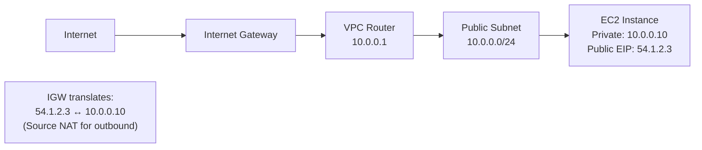
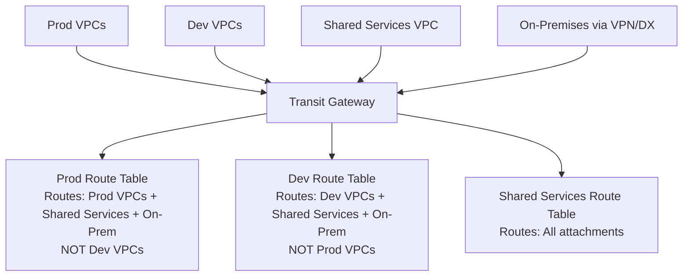
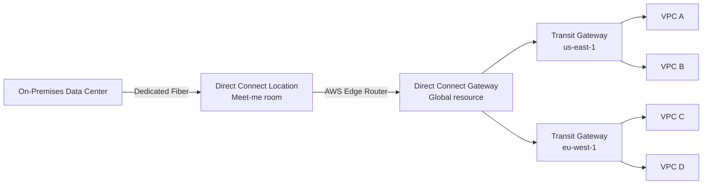
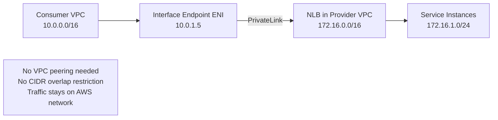
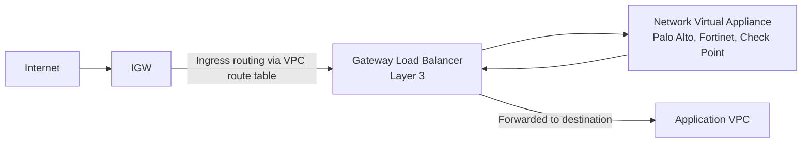
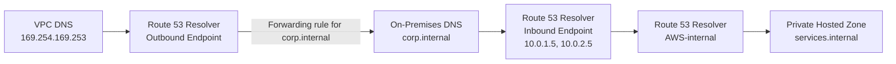
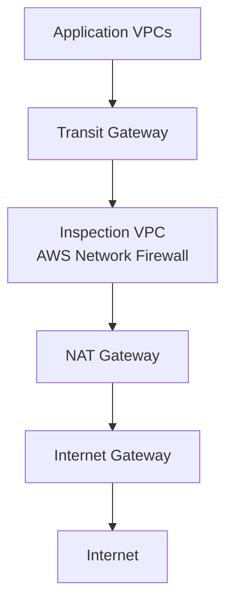
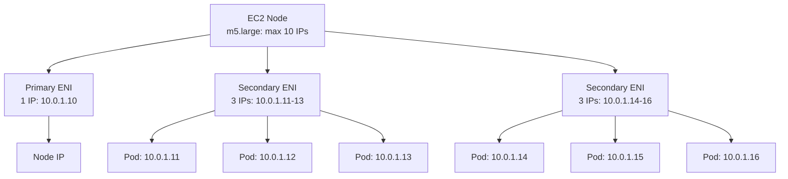
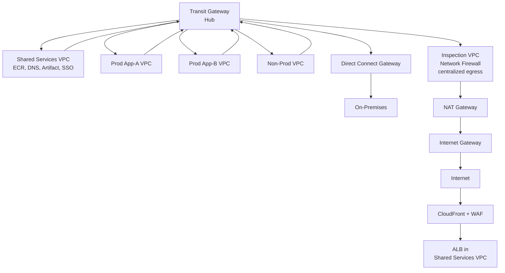

# AWS NETWORKING — Deep Dive Interview Preparation

> **Scope:** Section 3 of 20 | Beginner → Expert progression | FAANG-level depth  
> **Coverage:** VPC, Subnets, Routing, NAT, Transit Gateway, PrivateLink, Route 53, CloudFront, ALB/NLB/GWLB, WAF, Shield, 100+ Q&A

---

## Table of Contents

1. [VPC Fundamentals](#1-vpc-fundamentals)
2. [Subnets, Route Tables & NACLs](#2-subnets-route-tables--nacls)
3. [Security Groups](#3-security-groups)
4. [Internet Gateway & NAT](#4-internet-gateway--nat)
5. [VPC Peering & Transit Gateway](#5-vpc-peering--transit-gateway)
6. [Direct Connect & Site-to-Site VPN](#6-direct-connect--site-to-site-vpn)
7. [PrivateLink & VPC Endpoints](#7-privatelink--vpc-endpoints)
8. [Elastic Load Balancing (ALB / NLB / GWLB)](#8-elastic-load-balancing-alb--nlb--gwlb)
9. [Route 53 Deep Dive](#9-route-53-deep-dive)
10. [CloudFront & Global Accelerator](#10-cloudfront--global-accelerator)
11. [AWS WAF, Shield & Network Firewall](#11-aws-waf-shield--network-firewall)
12. [ENI, Overlay Networking & VPC CNI](#12-eni-overlay-networking--vpc-cni)
13. [Hub-and-Spoke Architecture](#13-hub-and-spoke-architecture)
14. [Network Troubleshooting](#14-network-troubleshooting)
15. [Interview Questions & Answers (100+)](#15-interview-questions--answers-100)
16. [Production Best Practices](#16-production-best-practices)
17. [Documentation Links](#17-documentation-links)

---

## 1. VPC Fundamentals

### 1.1 What is a VPC?

#### Beginner Foundation

A **Virtual Private Cloud (VPC)** is a logically isolated network within the AWS cloud. It's your private slice of the AWS network, where you have full control over the IP address range, subnets, routing, and network gateways.

**Problem it solves:** Without network isolation, all AWS customers' resources would be on the same flat network, visible and accessible to each other. A VPC provides the same isolation you'd get from owning your own private data center network, but delivered as software-defined networking on shared physical infrastructure.

**Key properties:**
- Belongs to a single AWS account and a single Region.
- Spans all Availability Zones in the Region automatically — though individual subnets are limited to one AZ.
- Default CIDR range you choose; RFC 1918 private address ranges are recommended: `10.0.0.0/8`, `172.16.0.0/12`, `192.168.0.0/16`.
- Each account gets a **default VPC** per Region (CIDR: `172.31.0.0/16`) — useful for quick testing but should not be used for production workloads.

**VPC limits (defaults, adjustable):**
- 5 VPCs per Region per account (can be increased).
- 5 CIDRs per VPC (1 primary + 4 secondary — expand address space without re-creating).
- 200 subnets per VPC.
- Maximum subnet size: /16 (65,536 addresses). Minimum: /28 (16 addresses, 11 usable).
- Address range cannot overlap with an existing VPC you want to peer or connect via Transit Gateway.

#### Intermediate Mechanics

**CIDR planning — why it matters:**

Poor CIDR planning is one of the top causes of networking pain in mature AWS environments. Address space that overlaps with on-premises, partner networks, or other VPCs prevents peering and requires NAT workarounds.

**CIDR sizing guidance:**
```
Production VPC:   10.0.0.0/16  → 65,536 IPs
  ├── Public AZ-A:    10.0.0.0/24  → 251 usable IPs
  ├── Public AZ-B:    10.0.1.0/24
  ├── Public AZ-C:    10.0.2.0/24
  ├── Private AZ-A:   10.0.10.0/23 → 507 usable IPs
  ├── Private AZ-B:   10.0.12.0/23
  ├── Private AZ-C:   10.0.14.0/23
  └── Database AZ-A:  10.0.20.0/24
  └── Database AZ-B:  10.0.21.0/24
  └── Database AZ-C:  10.0.22.0/24
```

**AWS reserves 5 IPs per subnet:** The first four IPs and the last IP in each subnet are reserved by AWS:
- `.0`: Network address
- `.1`: VPC router
- `.2`: DNS (VPC's Amazon-provided DNS at base CIDR + 2)
- `.3`: Reserved for future use
- `.255`: Network broadcast address

So a `/24` subnet has 256 - 5 = **251 usable IP addresses**.

**IPv6 in VPC:** AWS assigns a `/56` IPv6 CIDR block from AWS's owned IPv6 space to the VPC, and `/64` blocks to subnets. IPv6 addresses are globally routable (no NAT). Dual-stack VPCs support both IPv4 and IPv6. AWS EKS and some services have started requiring IPv6 for high-density deployments where RFC 1918 address space is exhausted.

#### Advanced Engineering

**VPC sharing (RAM):** AWS Resource Access Manager (RAM) lets you share subnets from an owner VPC with other accounts. The shared accounts can deploy resources (EC2, EKS, RDS) into the shared subnet without owning the VPC. This enables:
- **Centralized networking account** owns VPCs, subnets, Transit Gateway attachments.
- **Application accounts** deploy workloads into shared subnets without networking responsibility.
- Simplifies network topology — all traffic flows through a single VPC per Region.

**VPC secondary CIDR blocks:** You can add up to 4 secondary CIDR blocks to an existing VPC to extend address space without re-creating the VPC. The secondary CIDRs cannot overlap with the primary or each other.

```bash
# Add a secondary CIDR to an existing VPC
aws ec2 associate-vpc-cidr-block \
  --vpc-id vpc-0abc123def456789 \
  --cidr-block 10.1.0.0/16

# Create a subnet in the new CIDR
aws ec2 create-subnet \
  --vpc-id vpc-0abc123def456789 \
  --cidr-block 10.1.0.0/24 \
  --availability-zone us-east-1a
```

---

## 2. Subnets, Route Tables & NACLs

### 2.1 Subnets

A **subnet** is a subdivision of a VPC's IP address range, confined to a single AZ. Subnets are the unit at which you attach routing policies and where you place resources.

**Public subnet:** Has a route to an Internet Gateway (`0.0.0.0/0 → igw-xxx`). Resources need a public IP or Elastic IP to receive inbound internet traffic.

**Private subnet:** No route to an Internet Gateway. Resources can reach the internet only via NAT Gateway (outbound only). Inbound internet access requires a load balancer in a public subnet.

**Database/isolated subnet:** No outbound internet route. Used for RDS, ElastiCache, and other data tier resources that should never initiate or accept internet connections.

### 2.2 Route Tables

Every subnet has exactly one route table. A route table contains routes that direct traffic. Routes are evaluated from most-specific to least-specific (longest prefix match wins).

**Default (local) route:** Every route table has an automatic local route (`10.0.0.0/16 → local`) that allows all resources within the VPC to communicate with each other without going through any gateway.

**Example route table for a public subnet:**
```
Destination        Target            Comments
10.0.0.0/16        local             All VPC-internal traffic
10.100.0.0/16      tgw-0abc123       Route to on-prem via Transit Gateway
0.0.0.0/0          igw-0abc123       Default route to internet via IGW
```

**Example route table for a private subnet:**
```
Destination        Target            Comments
10.0.0.0/16        local             VPC-internal traffic
10.100.0.0/16      tgw-0abc123       On-premises traffic via Transit Gateway
0.0.0.0/0          nat-0abc123       Outbound internet via NAT Gateway in AZ-A
```

**Critical production practice:** Use AZ-local NAT Gateways and separate private route tables per AZ. If you route all private subnet traffic through a single NAT Gateway in one AZ, an AZ failure takes down all outbound internet access from private subnets.

```
Private AZ-A route table: 0.0.0.0/0 → nat-gateway-us-east-1a
Private AZ-B route table: 0.0.0.0/0 → nat-gateway-us-east-1b
Private AZ-C route table: 0.0.0.0/0 → nat-gateway-us-east-1c
```

### 2.3 Network ACLs (NACLs)

**NACLs** are stateless, subnet-level packet filters. They evaluate both inbound and outbound traffic for every packet — there's no session tracking.

**Key properties:**
- Applied at the subnet boundary.
- Stateless: If you allow inbound port 443, you must explicitly allow outbound ephemeral ports (1024-65535) for the response to return.
- Rules evaluated in order by rule number (lowest first). First matching rule wins.
- Default NACL: Allows all inbound and outbound traffic.
- Custom NACL: Denies everything by default until rules are added.

**NACL vs. Security Group — the critical distinction:**

| Dimension | NACL | Security Group |
|---|---|---|
| Level | Subnet | Resource (ENI) |
| Statefulness | Stateless | Stateful |
| Rule direction | Separate inbound and outbound | Inbound and outbound, but stateful |
| Effect on response traffic | Must explicitly allow | Automatically allowed (stateful) |
| Default rule | Explicit deny at the end | Implicit deny — no allow = denied |
| Allow/Deny | Both Allow and Deny rules | Only Allow rules |
| Use case | Broad subnet-level blocking | Fine-grained resource-level control |

**When to use NACLs:** Block specific known-bad IP ranges at the subnet level (simpler than security group rules distributed across hundreds of resources). Provide a defense-in-depth layer. Comply with requirements for stateless packet filtering.

**NACL for blocking a malicious IP:**
```bash
# Add deny rule at the top (low rule number) for a malicious IP
aws ec2 create-network-acl-entry \
  --network-acl-id acl-0abc123 \
  --rule-number 10 \
  --protocol -1 \
  --rule-action deny \
  --ingress \
  --cidr-block 203.0.113.0/24  # Known bad IP range
```

---

## 3. Security Groups

#### Beginner Foundation

A **Security Group (SG)** is a stateful virtual firewall attached to an Elastic Network Interface (ENI). Rules specify allowed traffic — anything not explicitly allowed is implicitly denied.

**Stateful** means: if you allow inbound port 443, the response traffic (outbound on ephemeral ports) is automatically permitted, without needing a corresponding outbound rule.

**Default security group behavior:**
- Inbound: Deny all (unless rules added).
- Outbound: Allow all (default outbound rule: `0.0.0.0/0 → all traffic`).

#### Intermediate Mechanics

**Security Group rules:**
- Source/Destination: CIDR (`10.0.0.0/16`), another Security Group ID, or a Prefix List.
- Using Security Group IDs as source enables **security group chaining** — a common three-tier architecture pattern:

```
ALB SG (public):  Inbound 443 from 0.0.0.0/0
App SG (private): Inbound 8080 from sg-alb  (only from ALB)
DB SG (isolated): Inbound 5432 from sg-app  (only from app tier)
```

This means database security group has zero hardcoded IPs — it references the app security group. New app servers added automatically inherit access.

**Security group limits:**
- 5 security groups per ENI (default).
- 60 inbound + 60 outbound rules per security group (default).
- These can be increased; each additional rule has a performance impact (O(n) evaluation).

**Managed Prefix Lists:** Groups of IP ranges that can be referenced in security group and route table rules. AWS provides managed prefix lists for CloudFront IP ranges, S3 service endpoints, and DynamoDB endpoints. Custom prefix lists let you maintain a central list of corporate IP ranges referenced by multiple security groups across accounts.

```bash
# Reference CloudFront IPs in a security group (allows ALB to receive only from CloudFront)
aws ec2 authorize-security-group-ingress \
  --group-id sg-0abc123 \
  --ip-permissions '[{
    "IpProtocol": "tcp",
    "FromPort": 443,
    "ToPort": 443,
    "PrefixListIds": [{"PrefixListId": "pl-3b927c52"}]
  }]'
```

**Security group connection tracking:** AWS tracks established connections. When you remove a security group rule, existing established connections are not immediately terminated — they persist until they naturally close (TCP FIN or timeout). New connections using the removed rule are immediately denied.

#### Advanced Engineering

**Security Group reference across accounts (VPC Peering):** When VPCs in two different accounts are peered, you can reference a security group in the peer VPC as a source in your security group rules. This requires specifying the account ID prefix: `"UserIdGroupPairs": [{"GroupId": "sg-peer-vpc-id", "UserId": "peer-account-id"}]`.

**VPC Reachability Analyzer:** A VPC tool that traces packet paths between a source and destination and explains exactly where traffic is allowed or blocked and why:

```bash
# Create a path analysis between an EC2 instance and an RDS endpoint
aws ec2-instance-connect create-network-insights-path \
  --source i-0abc123def456 \
  --destination-ip 10.0.20.5 \
  --destination-port 5432 \
  --protocol TCP

aws ec2 start-network-insights-analysis \
  --network-insights-path-id nip-0abc123
```

---

## 4. Internet Gateway & NAT

### 4.1 Internet Gateway (IGW)

An **Internet Gateway** is a horizontally scaled, redundant, highly available VPC component that enables bidirectional communication between VPC resources with public IPs and the internet. It performs NAT for instances with public Elastic IPs (source IP is replaced with the EIP in outbound traffic, and inbound traffic is translated back to the private IP).

**Key properties:**
- 1 IGW per VPC (hard limit).
- Attached to the VPC, not to a subnet — the public/private distinction is made by the subnet's route table.
- No bandwidth limits — it scales automatically with traffic.
- Not the bottleneck. The EC2 instance's network performance and the public IP's egress bandwidth are the limiting factors.



### 4.2 NAT Gateway vs. NAT Instance

**NAT Gateway** is a managed, highly available AWS service for enabling outbound-only internet access from private subnets. Private subnet → NAT Gateway → IGW → Internet.

**NAT Instance** is an EC2 instance running NAT software. An older approach that you must manage (patching, HA configuration, source/destination check disabled).

| Dimension | NAT Gateway | NAT Instance |
|---|---|---|
| Management | Fully managed by AWS | Customer-managed EC2 |
| High Availability | Redundant within one AZ (must deploy per-AZ for AZ-level HA) | Single EC2 — must configure your own HA with Auto Scaling |
| Bandwidth | Starts at 5 Gbps, scales to 100 Gbps | Limited by EC2 instance type (t3.small: ~1.26 Gbps) |
| Performance | Non-configurable, scales automatically | Can choose instance type for throughput |
| Cost | ~$0.045/hr + $0.045/GB (us-east-1) | EC2 cost + data transfer |
| Security Groups | Cannot attach SG directly (subnet-level only via NACL) | Can attach security groups |
| Use case | Production workloads | Cost-sensitive dev/test with low traffic |

**NAT Gateway limitations:**
- Cannot use NAT Gateway to allow inbound connections (it's source NAT only).
- Connections from resources with the same IP range (e.g., two VPCs with same CIDR in a peered or TGW topology) cannot traverse NAT Gateway.
- NAT Gateway is AZ-specific — deploy one per AZ for AZ fault tolerance.

```bash
# Terraform: Create NAT Gateways in each AZ for resilience
resource "aws_eip" "nat" {
  count = length(data.aws_availability_zones.available.names)
  domain = "vpc"
  tags = { Name = "nat-eip-${count.index}" }
}

resource "aws_nat_gateway" "main" {
  count         = length(data.aws_availability_zones.available.names)
  allocation_id = aws_eip.nat[count.index].id
  subnet_id     = aws_subnet.public[count.index].id
  tags = { Name = "nat-gw-${data.aws_availability_zones.available.names[count.index]}" }
}

# Separate route table per AZ, routing to AZ-local NAT Gateway
resource "aws_route_table" "private" {
  count  = length(data.aws_availability_zones.available.names)
  vpc_id = aws_vpc.main.id

  route {
    cidr_block     = "0.0.0.0/0"
    nat_gateway_id = aws_nat_gateway.main[count.index].id
  }
}
```

### 4.3 Egress-Only Internet Gateway

An **Egress-Only Internet Gateway** provides outbound-only IPv6 internet access from private subnets, equivalent to what NAT Gateway does for IPv4. IPv6 addresses are globally routable, so without an Egress-Only IGW, private IPv6 instances would be reachable from the internet (only security groups would block inbound). The Egress-Only IGW prevents inbound IPv6 connections while allowing outbound.

---

## 5. VPC Peering & Transit Gateway

### 5.1 VPC Peering

**VPC Peering** creates a direct private network connection between two VPCs. Traffic flows directly between the VPCs over the AWS backbone — not through the public internet.

**Properties:**
- Works across accounts and across Regions (inter-Region peering — traffic flows over AWS backbone, not public internet).
- Non-transitive: If VPC-A peers with VPC-B and VPC-B peers with VPC-C, VPC-A cannot communicate with VPC-C through VPC-B. You'd need an explicit A-C peering.
- Both VPCs' CIDR blocks must not overlap.
- No bandwidth limit, no single point of failure (the peering connection is logical).
- Traffic traversing inter-Region peering is charged at data transfer rates.

**Setup:**
```bash
# VPC-A (requester) sends peering request
aws ec2 create-vpc-peering-connection \
  --vpc-id vpc-A-id \
  --peer-vpc-id vpc-B-id \
  --peer-owner-id ACCOUNT-B-ID \
  --peer-region us-west-2  # for inter-Region peering

# VPC-B accepts the request
aws ec2 accept-vpc-peering-connection \
  --vpc-peering-connection-id pcx-0abc123

# Add routes in each VPC's route tables
# VPC-A private route table → VPC-B CIDR via pcx
aws ec2 create-route \
  --route-table-id rtb-A-private \
  --destination-cidr-block 10.1.0.0/16 \
  --vpc-peering-connection-id pcx-0abc123

# VPC-B private route table → VPC-A CIDR via pcx
aws ec2 create-route \
  --route-table-id rtb-B-private \
  --destination-cidr-block 10.0.0.0/16 \
  --vpc-peering-connection-id pcx-0abc123
```

**When peering doesn't scale:** With N VPCs, full-mesh peering requires N×(N-1)/2 connections. For 10 VPCs: 45 peering connections, each needing routing updates. For 50 VPCs: 1,225 connections. This is operationally untenable — use Transit Gateway instead.

### 5.2 Transit Gateway (TGW)

**AWS Transit Gateway** is a hub-and-spoke network transit hub that connects VPCs and on-premises networks through a central gateway. Instead of full-mesh peering, each VPC attaches once to the TGW — O(N) connections instead of O(N²).

#### Intermediate Mechanics

**TGW components:**
- **TGW Attachments:** How VPCs, VPNs, Direct Connect Gateway, and Peering connections connect to TGW. Each attachment costs ~$0.05/hr.
- **TGW Route Tables:** Control which attachments can communicate. Multiple route tables enable network segmentation.
- **Association:** An attachment is associated with one TGW route table (routes in this table apply to traffic from this attachment).
- **Propagation:** An attachment can propagate its routes into multiple TGW route tables (making its CIDRs reachable by those route tables' associated attachments).

**Multi-route-table segmentation pattern:**



**Walkthrough:**
- Prod VPCs are associated with the Prod Route Table. This table has routes for Prod VPCs, Shared Services, and on-premises — but NOT Dev VPCs. Production workloads cannot reach development environments.
- Dev VPCs are associated with the Dev Route Table. Can reach Shared Services (ECR, Artifact, DNS) and on-premises, but not Prod.
- Shared Services VPC is associated with the Shared Route Table which has all routes. It can respond to any request.

**Cross-Region TGW Peering:** Two TGWs in different Regions can be peered. Traffic flows over the AWS global backbone. Unlike VPC inter-Region peering, TGW peering is a static route topology (no BGP between Regions).

```bash
# Attach a VPC to Transit Gateway
aws ec2 create-transit-gateway-vpc-attachment \
  --transit-gateway-id tgw-0abc123 \
  --vpc-id vpc-0abc123 \
  --subnet-ids subnet-a subnet-b subnet-c \
  --options ApplianceModeSupport=enable  # For inspection VPC pattern
```

**TGW vs. VPC Peering decision matrix:**

| Dimension | VPC Peering | Transit Gateway |
|---|---|---|
| Scale | Good for < 10 VPCs | Handles hundreds of VPCs |
| Cost | Free (only data transfer charges) | $0.05/hr per attachment + $0.02/GB |
| Transitivity | No | Yes |
| Route management | Per-VPC route table updates | Centralized TGW route tables |
| Cross-account | Yes | Yes |
| Cross-region | Yes (regional peering) | Yes (TGW peering) |
| Network segmentation | Hard to enforce | Native via multiple route tables |
| Bandwidth | No limit | 50 Gbps per VPC attachment |

---

## 6. Direct Connect & Site-to-Site VPN

### 6.1 Site-to-Site VPN

**Site-to-Site VPN** creates an encrypted IPsec tunnel between your on-premises network and an AWS VPC. Traffic traverses the public internet but is encrypted.

**Components:**
- **Customer Gateway (CGW):** AWS resource representing your on-premises VPN device (configured with its public IP and optional BGP ASN).
- **Virtual Private Gateway (VGW):** The AWS-side VPN termination point, attached to your VPC.
- **VPN Connection:** The IPsec tunnel between the CGW and VGW. Each connection has TWO tunnels for redundancy (two AWS endpoints in different AZs).
- **Transit Gateway VPN Attachment:** Preferred for multi-VPC environments — connect the VPN to TGW instead of per-VPC VGW.

**BGP vs. Static Routing:**
- **BGP (dynamic):** Automatically exchanges routes. On-premises routes are propagated to AWS route tables. AWS routes are advertised to your on-premises router. Preferred for production (automatic failover, supports multiple paths).
- **Static:** You manually configure routes on both sides. Simpler for small environments, inflexible for changes.

**Throughput:** Each VPN tunnel supports up to 1.25 Gbps. Each connection has 2 tunnels, but traffic uses only one at a time (active/passive). For > 1.25 Gbps, use multiple VPN connections with ECMP on TGW.

**VPN configuration:**
```bash
# Create Customer Gateway (your on-premises router)
aws ec2 create-customer-gateway \
  --type ipsec.1 \
  --public-ip 203.0.113.1 \
  --bgp-asn 65000

# Create VPN connection via Transit Gateway
aws ec2 create-vpn-connection \
  --type ipsec.1 \
  --customer-gateway-id cgw-0abc123 \
  --transit-gateway-id tgw-0abc123 \
  --options TunnelOptions='[{
    "TunnelInsideCidr":"169.254.100.0/30",
    "PreSharedKey":"your-psk-here"
  },{
    "TunnelInsideCidr":"169.254.100.4/30",
    "PreSharedKey":"your-psk2-here"
  }]'
```

### 6.2 AWS Direct Connect

**Direct Connect** is a dedicated private network connection from your on-premises to AWS, bypassing the public internet. It provides consistent, low-latency, high-throughput connectivity.

#### Intermediate Mechanics

**Connection types:**
- **Dedicated connection:** Physical fiber directly to AWS Direct Connect location. Speeds: 1 Gbps, 10 Gbps, 100 Gbps. Request through AWS.
- **Hosted connection:** A partner provides a sub-connection on their shared Direct Connect port. Speeds: 50 Mbps to 10 Gbps. Faster provisioning, lower cost for < 1 Gbps needs.

**Virtual Interfaces (VIFs):**
- **Private VIF:** Access your VPC's private IP space (via Virtual Private Gateway or Direct Connect Gateway).
- **Public VIF:** Access AWS public services (S3, DynamoDB, SQS endpoints) using public IPs without traversing the internet.
- **Transit VIF:** Connect to Transit Gateway for multi-VPC access. Requires Direct Connect Gateway.

**Direct Connect Gateway (DXGW):** A global resource that enables a single Direct Connect connection to reach VPCs in multiple Regions (via TGW Transit VIFs). Without DXGW, you'd need a separate Direct Connect connection per Region.



**Direct Connect resilience:**
- A single Direct Connect connection is a single point of failure (one physical cable, one router).
- **Highly Available:** Two connections from two different providers at two different locations (different Direct Connect Points of Presence).
- **Maximum Resilience (AWS recommendation):** Two connections at two separate Direct Connect locations, plus a Site-to-Site VPN as a backup path.

**BGP communities for traffic engineering:**
- `7224:9100`: Prefer AWS routes on this connection over the other.
- `7224:7100`: Reduce this connection's preference.
- `7224:8100`: Prevent a local preference advertisement from being forwarded to other regions via Direct Connect Gateway.

#### Advanced Engineering

**Direct Connect vs. VPN comparison:**

| Dimension | Direct Connect | Site-to-Site VPN |
|---|---|---|
| Latency | Consistent (private fiber, dedicated) | Variable (public internet) |
| Bandwidth | 1–100 Gbps (dedicated or hosted) | Up to 1.25 Gbps per tunnel |
| Cost | High (port hours + data transfer) | Low (low hourly + data transfer) |
| Setup time | Weeks (physical provisioning) | Minutes/hours |
| Encryption | Not encrypted by default (add MACsec or IPsec over DX) | IPsec encrypted |
| Reliability | Very high (SLA on port) | Dependent on ISP |
| Use case | Production with large data volumes | Backup path, smaller traffic, fast setup |

**MACsec on Direct Connect:** Hardware-level Layer 2 encryption on Direct Connect connections, preventing eavesdropping between the DX location and your on-premises router. Available on dedicated 10 Gbps and 100 Gbps connections at supported DX locations.

---

## 7. PrivateLink & VPC Endpoints

### 7.1 VPC Endpoints

**VPC Endpoints** allow resources in a VPC to communicate with AWS services without traversing the public internet. Traffic stays within the AWS network.

**Two types:**

**Gateway Endpoints** (free):
- Supported services: S3 and DynamoDB only.
- A route is added to the route table for the service's prefix list, pointing to the endpoint.
- Traffic is not routed through the VPC's subnet — it goes directly to the service from the VPC router.
- Can apply endpoint policies (resource-based policies on the endpoint) to restrict which S3 buckets are accessible.

```bash
# Create S3 Gateway Endpoint
aws ec2 create-vpc-endpoint \
  --vpc-id vpc-0abc123 \
  --service-name com.amazonaws.us-east-1.s3 \
  --route-table-ids rtb-private-a rtb-private-b rtb-private-c \
  --policy-document '{
    "Statement": [{
      "Effect": "Allow",
      "Principal": "*",
      "Action": ["s3:GetObject", "s3:PutObject"],
      "Resource": "arn:aws:s3:::my-prod-bucket/*"
    }]
  }'
```

**Interface Endpoints (AWS PrivateLink)**:
- Supported services: 100+ AWS services and third-party services (SaaS sold through AWS Marketplace).
- Creates one or more ENIs in your subnets with private IP addresses from your VPC CIDR.
- DNS resolves the service endpoint to the private IP of the Interface Endpoint ENI.
- Costs: ~$0.01/hr per AZ per endpoint + $0.01/GB data.

### 7.2 AWS PrivateLink Internals

**PrivateLink** is the underlying technology that powers Interface VPC Endpoints. It allows service providers to expose services to consumers without exposing the provider's VPC or requiring VPC peering.

**Architecture:**



**How PrivateLink works internally:**
1. The service provider creates a Network Load Balancer fronting their service.
2. The provider creates a VPC Endpoint Service pointing to the NLB.
3. The consumer requests access to the endpoint service.
4. The provider approves the request (or enables auto-approval for AWS services).
5. The consumer creates an Interface Endpoint in their VPC, which creates ENIs in selected subnets.
6. The ENIs get private IPs from the consumer's VPC CIDR.
7. When the consumer's application calls the endpoint DNS name, it resolves to the ENI's private IP (via private DNS override).
8. Traffic flows from the consumer's EC2 to the ENI, through PrivateLink's internal routing to the NLB, and to the service instances — all within AWS's network.

**Private DNS for Interface Endpoints:** When you enable private DNS for an Interface Endpoint, AWS overrides the service's public DNS name (e.g., `s3.us-east-1.amazonaws.com`) within your VPC to resolve to the private IP of the endpoint ENIs. This means applications connecting to S3 using the public endpoint name automatically use the private path — no code changes required.

```bash
# Create Interface Endpoint for SSM (enables EC2 SSM without public internet access)
aws ec2 create-vpc-endpoint \
  --vpc-id vpc-0abc123 \
  --vpc-endpoint-type Interface \
  --service-name com.amazonaws.us-east-1.ssm \
  --subnet-ids subnet-a subnet-b subnet-c \
  --security-group-ids sg-endpoint \
  --private-dns-enabled

# For SSM to work without internet, also create endpoints for:
# com.amazonaws.us-east-1.ec2messages
# com.amazonaws.us-east-1.ssmmessages
```

**Endpoint policy to restrict access (S3 bucket policy complement):**
```json
{
  "Statement": [{
    "Effect": "Deny",
    "Principal": "*",
    "Action": "s3:*",
    "Resource": "*",
    "Condition": {
      "StringNotEquals": {
        "aws:sourceVpce": "vpce-0abc123def456"
      }
    }
  }]
}
```

This S3 bucket policy (combined with an endpoint policy) ensures S3 access is ONLY possible through the specific VPC endpoint — public internet access to the bucket is denied even if bucket policies would otherwise allow it.

---

## 8. Elastic Load Balancing (ALB / NLB / GWLB)

### 8.1 Application Load Balancer (ALB)

**ALB** operates at Layer 7 (HTTP/HTTPS/HTTP2/gRPC) of the OSI model. It understands the content of HTTP requests and can route based on URL paths, hostnames, HTTP headers, query strings, and source IP.

#### Beginner Foundation

**Use ALB when:**
- You need HTTP/HTTPS load balancing with path-based or host-based routing.
- You have microservices that need URL-based routing to different target groups.
- You want WebSocket support, gRPC, or HTTP/2.
- You need AWS WAF integration for Layer 7 filtering.
- You're using EKS with the AWS Load Balancer Controller (ALB is the natural fit for Kubernetes Ingress).

#### Intermediate Mechanics

**ALB components:**
- **Listeners:** Define the port/protocol and routing rules (e.g., HTTPS:443).
- **Rules:** Conditions and actions. Evaluated top-to-bottom. Default rule at the end.
- **Target Groups:** Backend targets (EC2 instances by ID, IP addresses, Lambda functions, or another ALB). Each target group has health check configuration.

**ALB routing rules — examples:**

```
Listener: HTTPS:443
Rules:
  1. IF path = /api/*  → Forward to TargetGroup: API-Service
  2. IF path = /admin  AND SourceIP = 10.0.0.0/8 → Forward to TargetGroup: Admin-Service
  3. IF Host = legacy.example.com → Redirect to https://example.com (301)
  4. IF Header X-Version = v2 → Forward to TargetGroup: API-Service-v2
  Default: Forward to TargetGroup: Frontend
```

**ALB + WAF integration:** WAF Web ACL is attached to the ALB listener. Requests pass through WAF before reaching the listener rules. WAF can block by IP reputation, SQL injection patterns, XSS, custom rules, and rate limiting.

**ALB access logs (S3):**
```json
{
  "type": "https",
  "time": "2024-01-15T12:00:00.123Z",
  "elb": "app/my-alb/abc123",
  "client:port": "203.0.113.1:54321",
  "target:port": "10.0.1.10:8080",
  "request_processing_time": 0.001,
  "target_processing_time": 0.050,
  "response_processing_time": 0.000,
  "elb_status_code": 200,
  "target_status_code": 200,
  "received_bytes": 1024,
  "sent_bytes": 5120,
  "request": "GET https://example.com:443/api/users HTTP/2.0",
  "user_agent": "Mozilla/5.0",
  "ssl_cipher": "ECDHE-RSA-AES128-GCM-SHA256",
  "ssl_protocol": "TLSv1.2",
  "target_group_arn": "arn:aws:elasticloadbalancing:...",
  "trace_id": "Root=1-...",
  "actions_executed": "forward"
}
```

#### Advanced Engineering

**ALB and sticky sessions (session affinity):** ALB inserts a cookie (`AWSALB`) to route subsequent requests from the same client to the same target. Duration is configurable (1 s to 7 days). This has implications for stateful applications — but stateful load balancing violates the principle that targets should be stateless. Prefer externalized session stores (Redis/ElastiCache).

**ALB request tracing:** ALB adds an `X-Amzn-Trace-Id` header to every request, usable for correlation with X-Ray traces. The trace ID propagates through all downstream services if they're instrumented.

**ALB dual-stack (IPv4 + IPv6):** Configure the ALB as dualstack to receive both IPv4 and IPv6 traffic. ALB translates IPv6 client connections to IPv4 connections to targets (targets don't need IPv6 support).

**ALB connection timeout:** Default is 60 seconds (idle timeout). Applications with long-running connections (WebSockets, streaming) may need this increased. If the backend response exceeds the idle timeout, the ALB closes the connection with a 504 Gateway Timeout.

### 8.2 Network Load Balancer (NLB)

**NLB** operates at Layer 4 (TCP/UDP/TLS). It passes through TCP connections without inspecting content, forwarding packets with minimal latency.

**Use NLB when:**
- Ultra-low latency (< 100 microseconds) is required (gaming, trading, real-time analytics).
- You need static IP addresses for your load balancer (ALBs use DNS — NLBs have static EIPs per AZ).
- You're load balancing non-HTTP protocols (MySQL, Redis, custom binary protocols).
- You need TCP pass-through — the target receives the client's real IP address (unlike ALB where you need `X-Forwarded-For`).
- You're in EKS and using an NLB for a Service of type `LoadBalancer`.

**NLB static IPs:** Each AZ in an NLB has one static IP (Elastic IP). This is critical for clients that use IP-based allow-lists, firewalls, or Direct Connect that require stable IP addresses.

**NLB Preserve Client IP:** By default for TCP, NLB forwards the original client IP to the target. Security groups on the target must allow the client's IP range (not just the NLB IP). For targets with security groups that only allow the NLB, use Proxy Protocol v2 or disable client IP preservation.

**TLS Termination at NLB:** NLB can terminate TLS (mutual TLS support also available), decrypting traffic before forwarding to targets. Or it can pass through TLS to the targets for end-to-end encryption. Choosing:
- **NLB TLS termination:** Simpler certificate management at the NLB, but decrypted between NLB and target.
- **Pass-through (TCP listener):** End-to-end encryption, but targets manage certificates.

### 8.3 Gateway Load Balancer (GWLB)

**GWLB** is designed for deploying, scaling, and managing third-party network virtual appliances (firewalls, intrusion detection systems, deep packet inspection). It operates at Layer 3 (network).

**How it works:**



**GWLB Endpoint:** Similar to PrivateLink — deployed in application VPCs to forward traffic to the inspection VPC where NVAs run. Route tables in the application VPC send traffic to GWLB Endpoints instead of directly to the IGW.

**Bump-in-the-wire inspection:**
1. Inbound traffic arrives at IGW.
2. IGW's ingress route table sends traffic to the GWLB Endpoint in the inspection VPC.
3. GWLB distributes traffic to NVA instances.
4. NVA inspects and forwards (or drops) traffic back to GWLB.
5. GWLB forwards to the original destination in the application VPC.
6. Return traffic follows the reverse path.

**Key GWLB property:** Uses GENEVE (Generic Network Virtualization Encapsulation) protocol to encapsulate traffic between GWLB and NVAs. NVAs receive the original packets intact (including source/destination IPs) for accurate inspection.

---

## 9. Route 53 Deep Dive

### 9.1 DNS Fundamentals and Route 53

**Route 53** is AWS's authoritative DNS service. It provides:
- **Public hosted zones:** DNS for publicly resolvable domains (internet-facing).
- **Private hosted zones:** DNS visible only within specified VPCs.
- **Health checks:** Monitor endpoint health and trigger DNS failover.
- **Routing policies:** Control how DNS responds to queries.
- **Route 53 Resolver:** Enables DNS resolution between VPCs, on-premises, and Route 53.
- **Domain registration:** Register domains directly in Route 53.

**DNS resolution chain:** When a client resolves `api.example.com`:
1. Client OS checks local cache.
2. Client queries configured DNS resolver (e.g., ISP DNS, company DNS, or 8.8.8.8).
3. Resolver checks its cache. Cache miss → recursive resolution begins.
4. Resolver queries root nameservers (`.`) for `.com` TLD nameservers.
5. Resolver queries `.com` TLD nameservers for `example.com` nameservers.
6. TLD responds with Route 53's nameservers for `example.com` (e.g., `ns-1234.awsdns-56.com`).
7. Resolver queries Route 53 for `api.example.com`.
8. Route 53 applies routing policy and returns the answer (one or more IP addresses) with TTL.
9. Resolver caches the answer for TTL seconds and returns to client.

**TTL impact:** Lower TTL = faster DNS propagation for changes but more queries to Route 53 (higher cost). Higher TTL = DNS changes take longer to propagate. For failover scenarios, set TTL to 60 seconds or less on health-checked records.

### 9.2 Routing Policies

**Simple:** Returns one or more IPs. Client chooses randomly if multiple values. No health checks.

**Weighted:** Distribute traffic across multiple records by percentage. Used for gradual canary releases (5% → 20% → 100%).

```bash
# 10% canary: new version gets 10, old gets 90 (proportional, not percentage)
aws route53 change-resource-record-sets --hosted-zone-id Z1234 --change-batch '{
  "Changes": [
    {"Action": "UPSERT", "ResourceRecordSet": {
      "Name": "api.example.com", "Type": "A",
      "SetIdentifier": "old-version", "Weight": 90,
      "TTL": 60, "ResourceRecords": [{"Value": "1.2.3.4"}]
    }},
    {"Action": "UPSERT", "ResourceRecordSet": {
      "Name": "api.example.com", "Type": "A",
      "SetIdentifier": "new-version", "Weight": 10,
      "TTL": 60, "ResourceRecords": [{"Value": "5.6.7.8"}]
    }}
  ]
}'
```

**Latency-based:** Route 53 returns the record from the AWS Region with the lowest latency to the client (based on historical latency measurements, not real-time). Used for global multi-Region active-active deployments.

**Geolocation:** Route based on the client's geographic location (country, continent, or US state). Used for regulatory compliance (EU users → EU Region), or localized content (French users → French CDN).

**Geoproximity:** Route based on geographic location of resources and clients, with bias adjustments. Requires Route 53 Traffic Flow.

**Failover:** Primary-secondary failover. Route 53 health checks the primary record — on failure, DNS returns the secondary record.

```bash
# Create health check for primary endpoint
aws route53 create-health-check --caller-reference "check-$(date +%s)" --health-check-config '{
  "Type": "HTTPS",
  "FullyQualifiedDomainName": "primary.example.com",
  "Port": 443,
  "ResourcePath": "/health",
  "RequestInterval": 30,
  "FailureThreshold": 2
}'
```

**Multivalue Answer:** Returns up to 8 healthy IPs for a single record (similar to simple routing but with health checks). Clients randomize which IP they connect to.

### 9.3 Route 53 Resolver

**Problem:** On-premises DNS cannot resolve AWS private hosted zone records, and VPC DNS cannot resolve on-premises internal domain names.

**Route 53 Resolver Inbound Endpoint:** An Endpoint in the VPC that on-premises DNS servers can forward queries to. AWS resolves VPC-internal names (private hosted zones, VPC DNS) and returns answers to on-premises.

**Route 53 Resolver Outbound Endpoint:** Rules configured to forward VPC DNS queries for specific domain names to on-premises DNS servers.



**DNS Firewall:** Route 53 Resolver DNS Firewall blocks malicious domain queries from VPC resources. Used to prevent DNS data exfiltration, block known malware C2 domains, and enforce DNS policies.

---

## 10. CloudFront & Global Accelerator

### 10.1 CloudFront

**CloudFront** is AWS's global Content Delivery Network (CDN). It caches content at 600+ Points of Presence (Edge Locations and Regional Edge Caches) worldwide, reducing latency for end users and reducing load on origin servers.

#### Intermediate Mechanics

**CloudFront distribution components:**
- **Origins:** Where CloudFront fetches content. Supported origins: S3 buckets, ALB, EC2, API Gateway, custom HTTP origins, Lambda function URLs, S3 with OAC.
- **Behaviors:** Rules mapping URL path patterns to origins and cache policies. `*.jpg` → S3 origin. `/api/*` → ALB origin (no caching).
- **Cache Policy:** Controls what CloudFront uses as cache key (URL, headers, cookies, query strings) and TTL settings.
- **Origin Request Policy:** Controls what CloudFront forwards to the origin (headers, cookies, query strings) even if they're not part of the cache key.
- **Distribution:** The combination of origins, behaviors, and configurations with a `xxx.cloudfront.net` domain name.

**CloudFront with S3 — Origin Access Control (OAC):**

OAC is the modern replacement for Origin Access Identity (OAI). It prevents users from accessing S3 objects directly (bypassing CloudFront), enforcing that all access goes through CloudFront.

```json
// S3 bucket policy with OAC
{
  "Statement": [{
    "Effect": "Allow",
    "Principal": {
      "Service": "cloudfront.amazonaws.com"
    },
    "Action": "s3:GetObject",
    "Resource": "arn:aws:s3:::my-bucket/*",
    "Condition": {
      "StringEquals": {
        "AWS:SourceArn": "arn:aws:cloudfront::123456789012:distribution/EDFDVBD6EXAMPLE"
      }
    }
  }]
}
```

**CloudFront Functions vs. Lambda@Edge:**

| Dimension | CloudFront Functions | Lambda@Edge |
|---|---|---|
| Execution location | Edge Location (600+ PoPs) | Regional Edge Cache (13 PoPs) |
| Latency | < 1 ms | 1–10 ms |
| Max execution time | 1 ms | 5 s (viewer) / 30 s (origin) |
| Max memory | 2 MB | 128 MB–10 GB |
| Languages | JavaScript (ES 5.1) | Node.js, Python |
| Triggers | Viewer request/response | Viewer + Origin request/response |
| Cost | $0.10/M requests | $0.60/M requests |
| Use case | Simple redirects, A/B testing, header modification | Authentication, dynamic content, complex routing |

**CloudFront HTTPS enforcement:**
```json
// Behavior: Redirect HTTP to HTTPS
"ViewerProtocolPolicy": "redirect-to-https"

// Enforce TLS 1.2 minimum
"MinimumProtocolVersion": "TLSv1.2_2021"
```

**CloudFront price classes:** Control which Edge Locations are used:
- All: All locations globally (lowest latency worldwide, highest cost)
- Price Class 100: US, Canada, Europe (reduced cost, higher latency for Asia/Pacific/South America users)
- Price Class 200: Excludes South America, Australia, NZ

#### Advanced Engineering

**CloudFront signed URLs and signed cookies:**

For private content distribution (authenticated content, pay-walled videos), CloudFront can require a signature on requests.

**Signed URL:** Grants access to a single object. Includes the policy (expiry, IP restrictions), a signature computed using the CloudFront key pair.

**Signed Cookie:** Grants access to multiple objects in a single cookie. Better for streaming video (individual segment URLs are not signed — the cookie authorizes the session).

```python
import boto3
from botocore.signers import CloudFrontSigner
from cryptography.hazmat.primitives import hashes
from cryptography.hazmat.primitives.asymmetric import padding
import datetime

def create_signed_url(url, key_id, private_key_pem, expiry_minutes=60):
    """Generate a CloudFront signed URL."""
    cf_signer = CloudFrontSigner(key_id, lambda msg: private_key.sign(msg, padding.PKCS1v15(), hashes.SHA1()))
    expiry = datetime.datetime.utcnow() + datetime.timedelta(minutes=expiry_minutes)
    return cf_signer.generate_presigned_url(url, date_less_than=expiry)
```

### 10.2 Global Accelerator

**AWS Global Accelerator** uses the AWS global backbone to route traffic from end users to the nearest AWS edge location, then carries it to the application endpoint over AWS's private network — bypassing the public internet for most of the journey.

**How it differs from CloudFront:**

| Dimension | CloudFront | Global Accelerator |
|---|---|---|
| Layer | Layer 7 (HTTP/HTTPS) | Layer 4 (TCP/UDP) |
| Caching | Yes (CDN) | No |
| Static IPs | No (DNS) | Yes (2 static anycast IPs) |
| Protocol | HTTP/HTTPS/WebSocket | Any TCP/UDP |
| Use case | Web content delivery, API, CDN | Low-latency for any TCP/UDP app, gaming, VoIP |
| Health checks | Via Route 53 | Built-in, near-real-time (< 30s failover) |

**Anycast IPs:** Global Accelerator provides 2 static Anycast IPs that are announced from AWS edge locations worldwide. Traffic from any location routes to the nearest edge location due to BGP Anycast. From there, it traverses the AWS backbone.

**Use case — gaming + low latency:**
A multiplayer game requires consistent low latency globally. Using Global Accelerator: a player in Tokyo connects to an AWS edge location in Tokyo over < 10 ms (local ISP hop), then rides the AWS backbone to the game server in `us-east-1` — much faster and more consistent than routing the entire path over the public internet.

**Endpoint groups:** Global Accelerator routes to endpoint groups per Region (ALB, NLB, EC2, or Elastic IPs). Traffic weight between endpoint groups supports gradual traffic shifting between Regions.

---

## 11. AWS WAF, Shield & Network Firewall

### 11.1 AWS WAF

**AWS WAF** (Web Application Firewall) is a Layer 7 firewall that inspects HTTP/HTTPS requests and filters based on rules. Deployed in front of CloudFront, ALB, API Gateway, or App Runner.

**Web ACL components:**
- **Rules:** Evaluate conditions on request (IP, URI, headers, body, method, query string).
- **Rule Groups:** Reusable collections of rules (AWS Managed, partner, or custom).
- **Actions per rule:** Allow, Block, Count (monitor without blocking), CAPTCHA, Challenge (JS challenge).
- **Default action:** Allow or Block — applied if no rule matches.

**AWS Managed Rule Groups:** Pre-built by AWS and regularly updated:
- `AWSManagedRulesCommonRuleSet`: OWASP Top 10 protections (SQLi, XSS, path traversal).
- `AWSManagedRulesAmazonIpReputationList`: Known bad IPs (botnets, crawlers).
- `AWSManagedRulesKnownBadInputsRuleSet`: Log4j exploitation, bad bots.
- `AWSManagedRulesLinuxRuleSet`: OS command injection for Linux servers.

**Rate-based rule (DDoS protection and API abuse):**
```json
{
  "Name": "RateLimitPerIP",
  "Priority": 1,
  "Action": {"Block": {}},
  "Statement": {
    "RateBasedStatement": {
      "Limit": 2000,
      "AggregateKeyType": "IP"
    }
  },
  "VisibilityConfig": {
    "SampledRequestsEnabled": true,
    "CloudWatchMetricsEnabled": true,
    "MetricName": "RateLimitPerIP"
  }
}
```

Blocks any IP making more than 2,000 requests in any 5-minute window.

**WAF Logging and Analysis:**
```bash
# Enable WAF logging to Kinesis Firehose → S3
aws wafv2 put-logging-configuration \
  --logging-configuration '{
    "ResourceArn": "arn:aws:wafv2:us-east-1:123456789012:regional/webacl/MyACL/abc123",
    "LogDestinationConfigs": ["arn:aws:firehose:us-east-1:123456789012:deliverystream/waf-logs"],
    "RedactedFields": [{"SingleHeader": {"Name": "authorization"}}]
  }'
```

### 11.2 AWS Shield

**AWS Shield Standard:** Free, automatically applied to all AWS resources. Protects against common Layer 3/4 DDoS attacks (SYN floods, UDP reflection attacks).

**AWS Shield Advanced:** Paid ($3,000/month per organization). Additional protections:
- Layer 7 DDoS protection (volumetric HTTP floods).
- Near-real-time attack notifications.
- **DDoS response team (DRT):** 24×7 AWS experts who assist during active attacks.
- Cost protection: Credit for extra AWS charges incurred due to DDoS scaling.
- Automatic application layer DDoS mitigation (with WAF).
- Integration with Route 53 and CloudFront for comprehensive protection.

**Shield Advanced architecture for a high-traffic web app:**
```
Internet → CloudFront (Shield Advanced + WAF) → ALB (Shield Advanced) → ECS/EKS
Route 53 (Shield Advanced) → health-checked failover
```

### 11.3 AWS Network Firewall

**AWS Network Firewall** is a managed, stateful network firewall for VPCs. It provides deep packet inspection at the VPC perimeter — including intrusion detection and prevention, traffic filtering by domain name (Suricata rules), and TLS inspection.

**Architecture — centralized egress inspection:**



Traffic flows:
1. Application VPC sends internet-bound traffic to TGW.
2. TGW routes to the Inspection VPC (via routing policies).
3. Network Firewall evaluates traffic against Suricata rules.
4. Allowed traffic continues to NAT Gateway and out to internet.
5. Blocked traffic is dropped at the firewall.

**Suricata rule example (block access to non-allowed domains):**
```
pass tls $HOME_NET any -> $EXTERNAL_NET 443 (tls.sni; content:"api.allowedservice.com"; sid:1001;)
reject tls $HOME_NET any -> $EXTERNAL_NET 443 (msg:"Block non-allowed TLS traffic"; sid:9999;)
```

---

## 12. ENI, Overlay Networking & VPC CNI

### 12.1 Elastic Network Interface (ENI)

An **ENI** is a virtual network interface card in a VPC. Every EC2 instance has at least one ENI (the primary interface, eth0). ENIs are the actual attachment point for security groups, private IPs, and public IPs.

**ENI properties:**
- Belongs to exactly one VPC and one subnet (AZ-specific).
- Has one primary private IPv4 + up to N secondary private IPs (depending on instance type).
- Can have one public IPv4 (if subnet has auto-assign enabled or EIP is attached).
- Has one or more security groups.
- Has a MAC address (hardware-level identifier, used for software licensing on Windows workloads).
- Can be detached from one instance and attached to another (used for fault tolerance — failover by moving the ENI and EIP).

**Trunk ENI for EKS/ECS:** For running many pods per node, AWS uses a Trunk ENI concept. A Trunk ENI is a special ENI that carries traffic for multiple Branch ENIs (attached to containers). This enables more IPs per node without the EC2 IP limit becoming a bottleneck.

### 12.2 Amazon VPC CNI (EKS Networking)

**VPC CNI (aws-node DaemonSet)** is the default CNI plugin for EKS. Each pod gets a real VPC IP address from the node's subnet, enabling direct pod-to-pod and pod-to-service connectivity using the native VPC networking stack.

**How VPC CNI assigns IPs:**



**IP limits per instance type (important for capacity planning):**
- The maximum number of ENIs and IPs per ENI varies by instance type.
- Formula: Max pods = (max ENIs × IPs per ENI) - (max ENIs × 1 reserved) - 2
- For `m5.large` (max 3 ENIs, 10 IPs per ENI): (3 × 10) - (3 × 1) - 2 = 25 pods maximum.
- Large clusters hitting this limit causes "IP exhaustion" — pods stay Pending with `0/N nodes are available: N Insufficient node with too many pods`.

**IP exhaustion solutions:**
1. **Prefix delegation mode (ENABLE_PREFIX_DELEGATION):** Assigns /28 CIDR blocks (16 IPs each) to ENIs instead of individual IPs. Dramatically increases IPs per node. `m5.large` can support 110 pods.
2. **Custom networking:** Place pods on secondary ENI with a different subnet than the node — enables pod IPs from a different CIDR pool (useful when the primary subnet is exhausted).
3. **IPv6-only clusters:** IPv6 addresses are effectively unlimited. Each pod gets a /128 IPv6 address.

**Warm IP pools:** VPC CNI pre-allocates IPs to reduce latency when pods are scheduled. `WARM_IP_TARGET` (number of unassigned IPs to maintain), `MINIMUM_IP_TARGET`, and `WARM_ENI_TARGET` (number of ENIs with free capacity) are tunable environment variables on the aws-node DaemonSet.

### 12.3 Overlay Networking Alternatives (Calico, Cilium)

**Why overlay networking alternatives exist:**

VPC CNI consumes real VPC IPs for every pod — in large clusters, this exhausts RFC 1918 address space. Overlay network plugins use an encapsulation protocol (VXLAN, IPIP, Geneve) to create a virtual network where pods get IPs from a pod CIDR that exists only in the overlay, not in the VPC.

**Calico in AWS EKS (overlay mode):**
- Pods get IPs from the pod CIDR (e.g., `192.168.0.0/16`), NOT from the VPC subnet.
- Pod-to-pod traffic is encapsulated in IPIP or VXLAN, tunneled over the underlying VPC network between nodes.
- Pods cannot be accessed from outside the VPC without NAT or a Gateway.
- **Benefit:** Unlimited pod IPs (limited only by the pod CIDR size).
- **Cost:** Overhead from encapsulation, throughput reduction (~10%), can't use VPC flow logs for pod-level visibility.

**Cilium in AWS EKS:**
- Uses eBPF (extended Berkeley Packet Filter) for packet processing in the Linux kernel.
- In VPC CNI integration mode: uses VPC IPs (no overlay) but replaces kube-proxy with eBPF-based load balancing.
- In overlay mode: uses VXLAN or Geneve encapsulation.
- **Advantage:** Native NetworkPolicy enforcement, Layer 7 (HTTP/gRPC) network policies, Hubble network observability (real-time packet flow visibility), much higher performance than iptables-based kube-proxy.

**EKS networking mode comparison:**

| Mode | Pod IP | Max pods | Network policy | Security | Cost |
|---|---|---|---|---|---|
| VPC CNI (default) | Real VPC IP | Instance-limited | Basic (K8s + Calico) | Direct access from VPC | AWS IPs = subnet exhaustion risk |
| VPC CNI + Prefix Delegation | Real VPC IP (/28 prefix) | ~110 per m5.large | Basic | Direct access | Better density |
| Calico overlay | Virtual (CIDR pool) | Unlimited | Advanced (L3-L7) | NAT required | Encapsulation overhead |
| Cilium + eBPF | Real VPC IP or virtual | High | Advanced (L7, FQDN) | Best performance | Complexity |

---

## 13. Hub-and-Spoke Architecture

**Hub-and-spoke** is a network topology where a central hub (Transit Gateway) connects multiple spoke VPCs and on-premises networks. All inter-spoke traffic flows through the hub.

**Complete enterprise network architecture:**



**Traffic flows:**
- Prod App-A to Shared Services: Prod-A VPC → TGW → Shared Services VPC (allowed by TGW route table).
- Prod App-A to internet: Prod-A VPC → TGW → Inspection VPC → NAT → IGW → Internet (traffic passes through Network Firewall).
- Prod App-A to on-premises: Prod-A VPC → TGW → Direct Connect Gateway → on-premises.
- Prod App-A to Prod App-B: Blocked at TGW route table (no direct prod-to-prod routes unless explicitly added).
- Non-Prod to Prod: Blocked — Non-Prod TGW route table does not have routes to Prod VPCs.

**Terraform for TGW multi-route-table segmentation:**
```hcl
resource "aws_ec2_transit_gateway" "main" {
  description                     = "Enterprise TGW"
  default_route_table_association = "disable"  # Don't use default route table
  default_route_table_propagation = "disable"
  auto_accept_shared_attachments  = "enable"
  tags = { Name = "enterprise-tgw" }
}

# Prod route table
resource "aws_ec2_transit_gateway_route_table" "prod" {
  transit_gateway_id = aws_ec2_transit_gateway.main.id
  tags = { Name = "prod-rt" }
}

# Associate prod VPC attachment with prod route table
resource "aws_ec2_transit_gateway_route_table_association" "prod_vpc_a" {
  transit_gateway_attachment_id  = aws_ec2_transit_gateway_vpc_attachment.prod_a.id
  transit_gateway_route_table_id = aws_ec2_transit_gateway_route_table.prod.id
}

# Propagate Shared Services routes into prod route table
resource "aws_ec2_transit_gateway_route_table_propagation" "shared_to_prod" {
  transit_gateway_attachment_id  = aws_ec2_transit_gateway_vpc_attachment.shared.id
  transit_gateway_route_table_id = aws_ec2_transit_gateway_route_table.prod.id
}

# Static default route to Inspection VPC (for internet egress)
resource "aws_ec2_transit_gateway_route" "prod_default" {
  destination_cidr_block         = "0.0.0.0/0"
  transit_gateway_attachment_id  = aws_ec2_transit_gateway_vpc_attachment.inspection.id
  transit_gateway_route_table_id = aws_ec2_transit_gateway_route_table.prod.id
}
```

---

## 14. Network Troubleshooting

### Packet Tracing and Diagnosis

**VPC Flow Logs:** Capture metadata about IP traffic flowing through VPC network interfaces. Does NOT capture packet contents, only headers (source IP, dest IP, port, protocol, accept/reject, byte count).

```bash
# Enable VPC Flow Logs to CloudWatch
aws ec2 create-flow-logs \
  --resource-type VPC \
  --resource-ids vpc-0abc123 \
  --traffic-type ALL \
  --log-destination-type cloud-watch-logs \
  --log-destination arn:aws:logs:us-east-1:123456789012:log-group:/vpc/flow-logs \
  --iam-role-arn arn:aws:iam::123456789012:role/VPCFlowLogsRole

# Query flow logs with CloudWatch Insights
aws logs start-query \
  --log-group-name "/vpc/flow-logs" \
  --start-time $(date -d '1 hour ago' +%s) \
  --end-time $(date +%s) \
  --query-string 'fields @timestamp, srcAddr, dstAddr, srcPort, dstPort, protocol, action
    | filter dstAddr = "10.0.1.10" and action = "REJECT"
    | sort @timestamp desc
    | limit 50'
```

**Flow log fields to analyze:**
- `action = REJECT`: Security group or NACL blocking traffic.
- `bytes = 0` with `REJECT`: Connection attempted but no data transferred (blocked at connection).
- `protocol = 6` (TCP), `protocol = 17` (UDP), `protocol = 1` (ICMP).

**Reachability Analyzer:**
```bash
# Trace the path from EC2 to RDS
aws ec2 create-network-insights-path \
  --source i-0abc123 \
  --destination db-instance-id \
  --destination-port 5432 \
  --protocol TCP

aws ec2 start-network-insights-analysis \
  --network-insights-path-id nip-0abc123

# Get results (wait a few seconds)
aws ec2 describe-network-insights-analyses \
  --network-insights-analysis-ids nia-0abc123 \
  --query 'NetworkInsightsAnalyses[0].{Status:Status,FindingComponents:FindingComponents}'
```

**Route analysis for "traffic not reaching destination":**
```bash
# Check effective routing for an EC2 instance
aws ec2 describe-route-tables \
  --filters "Name=association.subnet-id,Values=subnet-private-a" \
  --query 'RouteTables[0].Routes'

# Check security groups on target
aws ec2 describe-security-groups \
  --group-ids sg-0abc123 \
  --query 'SecurityGroups[0].IpPermissions'

# Check NACLs for the subnet
aws ec2 describe-network-acls \
  --filters "Name=association.subnet-id,Values=subnet-private-a" \
  --query 'NetworkAcls[0].Entries'
```

---

## 15. Interview Questions & Answers (100+)

---

### Question 1: Explain the difference between a Security Group and a Network ACL, and when would you use each?

**What the interviewer is testing:** Understanding of AWS network security layers, stateful vs stateless filtering, and defense-in-depth architecture.

**Strong answer:**

Security Groups and NACLs are both packet filtering mechanisms, but they operate at different layers and have fundamentally different state models.

**Security Groups (stateful, resource-level):**
- Attached to ENIs (individual resources: EC2, RDS, Lambda in VPC, EKS nodes).
- Stateful: AWS connection-tracks flows. If you allow inbound TCP port 443, the response traffic (outbound ephemeral port) is automatically permitted without a separate outbound rule.
- Only Allow rules. No Deny. Anything not explicitly allowed is implicitly denied.
- Evaluated together — all rules in all attached security groups are checked; if any rule permits the traffic, it passes.

**NACLs (stateless, subnet-level):**
- Applied to subnets, affecting all resources in the subnet.
- Stateless: AWS does not track connection state. Inbound allow on 443 does NOT automatically permit the response. You must also explicitly allow outbound ephemeral ports (1024-65535) for TCP responses.
- Both Allow and Deny rules, evaluated in rule-number order (lowest first, first match wins).

**When to use which:**

Use Security Groups as your primary access control mechanism — they're more granular, stateful, and easier to manage (security group IDs as sources instead of CIDR ranges).

Use NACLs for subnet-level coarse filtering:
1. Blocking known-bad IP ranges across all resources in a subnet without updating hundreds of security groups.
2. Adding an explicit defense-in-depth layer (even if a security group is misconfigured, the NACL provides a backstop).
3. Compliance requirements that mandate stateless packet filtering at the network perimeter.

**Example — three-tier architecture security model:**

```
Tier          NACL                    Security Group
─────────────────────────────────────────────────────────────
Public        Allow 80,443 inbound    Allow 80,443 from 0.0.0.0/0
              Allow 1024-65535 out    Allow outbound to App SG
              Deny all else           
App (private) Allow 8080 from public  Allow 8080 from ALB SG only
              Allow 1024-65535 out    Allow 5432 to DB SG
              Deny all else
DB (isolated) Allow 5432 from app     Allow 5432 from App SG only
              Allow 1024-65535 out    Deny all else
```

**How it works — stateful vs. stateless example:**

```
Client: 1.2.3.4:54321 → SG Resource: 10.0.1.10:443

With Security Group (stateful):
- Inbound rule: Allow TCP 443 from 0.0.0.0/0 → MATCH → packet allowed
- Response (10.0.1.10:443 → 1.2.3.4:54321): tracked connection → automatically allowed
- No outbound rule needed for the response

With NACL (stateless):
- Inbound rule 100: Allow TCP 443 from 0.0.0.0/0 → MATCH → packet allowed
- Response packet hits NACL outbound rules:
  - If no rule allows outbound to 1.2.3.4 on port 54321 → packet BLOCKED
  - Need outbound rule: Allow TCP 1024-65535 to 0.0.0.0/0
```

**Common mistakes:**
- Not adding ephemeral port rules to custom NACLs (forgetting they're stateless).
- Assuming NACL Deny rules can override security group Allow rules — they can, because NACLs are evaluated first at the subnet boundary.
- Creating security groups with `0.0.0.0/0` on all ports (effectively disabling the firewall) in test accounts and accidentally promoting that config to production.

**Likely follow-ups:**
1. *If a NACL denies a packet but the security group would allow it, what happens?* — The packet is denied. NACLs are evaluated at the subnet boundary before the packet reaches the ENI's security group. NACL deny wins.
2. *Can you attach multiple NACLs to a subnet?* — No. Each subnet has exactly one NACL. A NACL can be associated with multiple subnets.

---

### Question 2: How does VPC Peering work, and what are its limitations compared to Transit Gateway?

**What the interviewer is testing:** Network architecture understanding, scalability thinking, trade-off analysis.

**Strong answer:**

VPC Peering creates a direct private connection between two VPCs. Traffic flows over the AWS backbone without traversing the public internet. It works within an account, across accounts, and across Regions (inter-region peering).

**How peering works:**
1. Account A requests a peering connection to Account B's VPC.
2. Account B accepts the request.
3. **Both VPCs' route tables must be updated manually** — this is a common setup mistake. Without routes, traffic still goes to the public internet.
4. Security groups in each VPC must allow the appropriate traffic from the peer VPC's CIDR.

**Peering limitations:**
1. **Non-transitive:** VPC-A ↔ VPC-B and VPC-B ↔ VPC-C does not mean A can reach C. You need an explicit A-C peering.
2. **Overlapping CIDRs:** VPCs with the same or overlapping CIDRs cannot be peered.
3. **O(N²) connections:** For N VPCs requiring full connectivity, you need N×(N-1)/2 peering connections. For 20 VPCs: 190 connections, each requiring route table updates in both VPCs (190 × 2 = 380 route table changes).
4. **No centralized network control:** Each peering is managed independently. Adding a new VPC requires updating route tables in every existing VPC that needs to reach it.

**Transit Gateway advantages:**
- Centralized: Each VPC attaches once (O(N) attachments instead of O(N²) connections).
- Transitive routing: VPC-A → TGW → VPC-B is possible. TGW handles the routing.
- Multiple route tables for segmentation (Prod cannot reach Dev).
- Supports VPN and Direct Connect attachments in the same hub.
- Scales to thousands of attachments.

**Decision matrix:**

| Scenario | Recommendation |
|---|---|
| 2-3 VPCs, same team, low traffic | VPC Peering (simpler, free) |
| 5+ VPCs, multi-team, growing | Transit Gateway |
| Cross-account, multi-region, enterprise | Transit Gateway + TGW peering |
| Need centralized inspection (firewall) | Transit Gateway + Inspection VPC |
| Need on-premises connectivity + VPC | Transit Gateway + VPN/DX |

**Cost comparison for 10 VPCs with full connectivity:**
- VPC Peering: 45 peering connections × $0/hr + data transfer charges only. Cheaper.
- Transit Gateway: 10 attachments × $0.05/hr + $0.02/GB data. For 10 TB/month: ~$36/month attachments + $200/month data.

The cost difference is real, but for 30+ VPCs the operational complexity of VPC Peering often exceeds the TGW cost.

**Likely follow-ups:**
1. *How does traffic flow in a peered VPC with a NAT Gateway?* — VPC-B cannot use VPC-A's NAT Gateway to reach the internet. NAT Gateway is accessible only within the same VPC. VPC-B needs its own NAT Gateway.
2. *How do you migrate from VPC Peering to Transit Gateway?* — Add TGW attachment to all VPCs. Update route tables to send traffic through TGW instead of PCX (peering connections). Test connectivity. Remove peering connections and old routes. This is a non-trivial change for production environments — plan for a maintenance window.

---

### Question 3: What is PrivateLink and how does it work internally?

**What the interviewer is testing:** Understanding of AWS networking internals, service exposure patterns, and security isolation.

**Strong answer:**

AWS PrivateLink provides private connectivity between VPCs and AWS services (or third-party services in AWS Marketplace) without requiring VPC peering, Internet Gateway, NAT Gateway, or public IPs. It's the technology underpinning all Interface VPC Endpoints.

**The core problem it solves:** You want to expose a service from VPC-A to consumers in VPC-B, but:
- Their CIDRs overlap (VPC peering would be impossible).
- You don't want to give VPC-B full network access to VPC-A (peering is too broad).
- You don't want traffic to traverse the public internet.
- You need the service to scale independently from the consumer VPCs.

**How PrivateLink works:**

1. **Provider side:** Service owner creates an NLB in their VPC (the service VPC) fronting their service. They then create an **Endpoint Service** pointing to the NLB.

2. **Consumer side:** Consumer creates an **Interface Endpoint** in their VPC for the Endpoint Service. AWS creates one or more **ENIs** in specified consumer subnets, with private IPs from the consumer VPC's CIDR.

3. **DNS:** When private DNS is enabled, the service's DNS name resolves to the ENI's private IP within the consumer VPC. No code changes required — applications use the standard service endpoint hostname.

4. **Traffic flow:**
   ```
   Consumer EC2 (10.0.1.10) → ENI (10.0.1.5) → [PrivateLink fabric] → NLB (172.16.0.1) → Service (172.16.1.10)
   ```
   The ENI is in the consumer's VPC subnet. Traffic to the ENI is forwarded by AWS's internal fabric to the NLB in the provider VPC. The consumer never has IP-level access to the provider VPC — they can only reach the NLB's frontend.

**Security properties:**
- Consumer cannot initiate connections to arbitrary IPs in the provider VPC — only to the NLB's registered targets.
- Provider can configure endpoint service acceptance policy (auto-approve specific accounts, or require manual approval).
- Consumer can attach security groups to the Interface Endpoint ENI, controlling which consumer resources can reach the endpoint.

**Example — private S3 access:**
```bash
# Create Interface Endpoint for S3 (more flexible than Gateway Endpoint)
aws ec2 create-vpc-endpoint \
  --vpc-id vpc-consumer \
  --vpc-endpoint-type Interface \
  --service-name com.amazonaws.us-east-1.s3 \
  --subnet-ids subnet-a subnet-b subnet-c \
  --security-group-ids sg-endpoint \
  --private-dns-enabled

# Now ec2 in the VPC can run:
# aws s3 ls s3://my-bucket --region us-east-1
# Traffic goes: EC2 → ENI (10.0.1.5) → PrivateLink → S3 (no internet)
```

**PrivateLink vs. VPC Peering for service access:**
- PrivateLink: Consumer can only access the specific service endpoints. No broad VPC-to-VPC connectivity. Overlapping CIDRs are fine. One-directional by design.
- VPC Peering: Full network-level connectivity between VPCs. Both VPCs can initiate connections to any IP in the other. CIDRs must not overlap.

**Likely follow-ups:**
1. *Can PrivateLink work across Regions?* — Yes. An Interface Endpoint in VPC-A (us-east-1) can connect to an Endpoint Service in VPC-B (eu-west-1) if VPC-A and VPC-B are connected via VPC Peering or Transit Gateway. The PrivateLink layer operates within the same Region, but you can chain it with inter-region connectivity.
2. *Why does PrivateLink not require VPC CIDR non-overlap?* — PrivateLink operates at the service level, not the IP level. The consumer connects to the ENI's private IP in their own VPC CIDR space. The provider's VPC IPs are completely hidden. There's no direct IP routing between the two VPCs.

---

### Question 4: Explain the difference between ALB, NLB, and GWLB. When would you choose each?

**What the interviewer is testing:** Deep understanding of load balancer layers, use cases, trade-offs, and architecture decisions.

**Strong answer:**

AWS offers three modern load balancer types, each operating at a different layer of the OSI model:

**Application Load Balancer (ALB) — Layer 7:**
- Terminates HTTP/HTTPS connections, inspects headers, body, URL, host, and query string.
- Routes based on content: path (`/api/*`), hostname (`api.example.com`), headers, query strings.
- Integrates with WAF for Layer 7 DDoS protection and OWASP filtering.
- Supports WebSocket, HTTP/2, gRPC, and sticky sessions.
- Returns a DNS name (not a static IP) — but can be combined with Global Accelerator for static IPs.
- ~1ms additional latency vs. NLB due to HTTP termination and processing.
- Target types: EC2 instances (by ID), IPs, Lambda functions, or ALB (weighted routing).
- **Choose for:** Web applications, APIs, microservices with path routing, Kubernetes Ingress.

**Network Load Balancer (NLB) — Layer 4:**
- Passes through TCP/UDP connections without HTTP inspection.
- Minimal latency (< 100 microseconds vs. ALB's ~1ms).
- Static IP per AZ (Elastic IP — essential for firewall allow-listing, Direct Connect, clients requiring stable IPs).
- Preserves client IP to backend targets (backends see real client IPs in TCP connections).
- Handles millions of connections per second.
- Supports TLS termination (or TLS pass-through for end-to-end encryption).
- Supports UDP, TCP, and TLS protocols.
- **Choose for:** Real-time gaming, trading systems, VoIP, IoT, databases, any non-HTTP protocol, static IP requirement, Kubernetes Service of type LoadBalancer.

**Gateway Load Balancer (GWLB) — Layer 3:**
- Designed for deploying network virtual appliances (NVAs) — firewalls, IDS/IPS, DPI.
- Acts as a transparent bump-in-the-wire: traffic enters GWLB, goes to NVA for inspection, returns to GWLB, forwarded to destination.
- Uses GENEVE encapsulation protocol to preserve original packet headers.
- Works with route tables to intercept traffic before it reaches destinations.
- Scales NVAs automatically (target group of firewall instances).
- **Choose for:** Deploying Palo Alto, Fortinet, or Check Point firewalls at VPC perimeter, intrusion detection, compliance-mandated deep packet inspection.

**Decision flowchart:**
```
Is the traffic HTTP/HTTPS?
├── Yes → Need WAF or content-based routing?
│         ├── Yes → ALB
│         └── No → NLB (lower latency) or ALB (content-aware features)
└── No → Is it TCP/UDP?
          ├── Yes → NLB
          └── Do you need packet inspection/appliance?
                    └── Yes → GWLB
```

**Real-world production example:**

```
Internet 
→ CloudFront (WAF + CDN) 
→ ALB (HTTPS:443, path routing: /api/* → EKS, /* → S3)
→ NLB (TCP:5432 for direct DB access from Redshift)

Egress inspection:
→ GWLB → Palo Alto Firewall (NVA) → NatGW → Internet
```

**Common mistakes:**
- Using ALB for non-HTTP protocols (ALB only speaks HTTP) — use NLB for TCP/UDP.
- Expecting NLB to filter by HTTP headers or path — NLB is Layer 4 only; it cannot inspect HTTP content.
- Not setting up NLB target group health checks properly (NLB health check interval is 10 seconds, threshold is 3, giving 30-second failure detection).
- Using GWLB without Appliance Mode on TGW — asymmetric routing can break stateful firewall inspection.

**Likely follow-ups:**
1. *How does ALB handle WebSocket connections?* — ALB upgrades HTTP connections to WebSocket transparently. The ALB idle timeout (default 60 s) must be higher than the application's WebSocket keep-alive interval, or ALB will terminate the connection. Increase idle timeout to match your WebSocket requirements.
2. *What is connection draining (deregistration delay) on a load balancer?* — When a target is removed from a target group, the load balancer stops sending new requests to it but waits for in-flight requests to complete before deregistering. Default: 300 seconds. For APIs with short request durations (< 5 s), reduce to 30 s to speed up deployments.

---

### Question 5: What is the difference between Route 53 latency-based routing and geolocation routing?

**What the interviewer is testing:** DNS routing policy knowledge and when to apply each for global traffic management.

**Strong answer:**

Both policies route traffic based on the client's geography, but they use different criteria and have different guarantees:

**Latency-based routing:**
- Routes to the AWS Region with the lowest measured latency for the client's IP.
- AWS maintains historical latency measurements between many geographic points and all AWS Regions.
- A client in Singapore might route to `ap-southeast-1` because it's closest by latency, but could route to `ap-northeast-1` (Tokyo) if there's a congestion event on the path to Singapore.
- **Purpose:** Best end-user performance (lowest response time).
- **Use case:** Global active-active deployments where all regions serve traffic and you want users to hit their nearest healthy region.

**Geolocation routing:**
- Routes based on the client's geographic location (continent, country, or US state).
- More deterministic: A client from France **always** goes to the EU record (unless health check fails).
- Does NOT optimize for latency — a French user might have lower latency to `us-east-1` than `eu-west-1`, but geolocation routing sends them to EU regardless.
- **Purpose:** Data sovereignty (EU users must stay in EU), regulatory compliance, localized content (language, currency, legal terms).
- **Use case:** GDPR-regulated services (user data must stay in EU), location-specific content (different prices, languages, products per country).

**Comparison:**

| Dimension | Latency-based | Geolocation |
|---|---|---|
| Primary criterion | Measured latency to AWS Regions | Geographic location of client |
| Determinism | Non-deterministic (depends on current network) | Deterministic (country always → same region) |
| Data sovereignty | Does NOT guarantee data stays in Region | DOES guarantee (EU traffic → EU Region) |
| Performance | Best for latency | May not be optimal for latency |
| Default record | Needed (for IPs not in any location) | Required (for unmatched locations) |

**Real example — global SaaS with GDPR requirement:**

```
Route 53 records:
1. Geolocation: Europe → api-eu.example.com → eu-west-1 ALB
2. Geolocation: Default → api-global.example.com → us-east-1 ALB
```

EU users are always sent to the EU endpoint (GDPR compliance). Non-EU users get the default (US). Within US, you might add latency-based sub-routing for US-East vs. US-West.

**Health checks with both policies:** Both support health-check associations. If the primary record is unhealthy, Route 53 falls back to the next matching record (or the default). Set TTL to 60 seconds or less for health-check-based failover to be effective.

**Likely follow-ups:**
1. *What happens in geolocation routing if no record matches a client's location?* — If there's no matching geolocation record and no default (`*`) record, Route 53 returns SERVFAIL or no answer. Always configure a default record.
2. *Can you combine geolocation and latency-based routing?* — Not directly in a single record. Pattern: geolocation routes `Europe → EU CNAME`, `Asia → APAC CNAME`, `Default → Global CNAME`. Then the CNAMEs themselves use latency-based routing to select the best Region within that geography.

---

### Question 6: How would you design a network architecture to prevent a compromised EC2 instance from reaching the internet or other production VPCs?

**What the interviewer is testing:** Security network architecture, zero-trust networking principles, defense-in-depth.

**Strong answer:**

I'd implement multiple concentric security layers so that a compromised instance cannot exfiltrate data, pivot to other VPCs, or receive C2 instructions from the internet.

**Layer 1 — IAM and least-privilege (prevent credential abuse):**
- EC2 role has minimal permissions — only what the application needs.
- Instance profile role cannot call `iam:*`, `ec2:CreateVpc`, or other actions that would help lateral movement.
- IMDS v2 required to prevent SSRF-based credential theft.

**Layer 2 — Security Group (deny all except needed):**
```
Inbound: Allow TCP 8080 from ALB SG only
Outbound: Allow TCP 443 to sg-internal-api  (application dependency)
          Allow UDP 53 to 169.254.169.253    (VPC DNS only)
          Allow TCP 443 to pl-s3-endpoint    (S3 endpoint prefix list)
          Deny all else (implicit)
```
A compromised instance cannot initiate outbound connections to arbitrary IPs — only to explicitly allowed security group targets and AWS prefix lists.

**Layer 3 — No NAT Gateway route for this subnet:**
The application subnet's route table has no default route (`0.0.0.0/0`) to a NAT Gateway. Traffic outside the VPC cannot leave. All AWS service access goes through VPC Interface Endpoints.

**Layer 4 — NACL (defense-in-depth):**
```
NACL Outbound:
Rule 100: Allow TCP 443 to 10.0.0.0/8 (VPC-internal)
Rule 200: Allow TCP 443 to S3 endpoint prefix list
Rule 900: Deny all
```

**Layer 5 — VPC Endpoints for all AWS service access:**
- SSM, ECR, S3, CloudWatch Logs, Secrets Manager — all accessed via Interface Endpoints.
- No internet route needed for AWS service calls.

**Layer 6 — DNS Firewall (prevent DNS exfiltration and C2):**
```
Route 53 Resolver DNS Firewall:
- Block all domains not in approved list
- Block known malware and C2 domains (AWS Managed threat intelligence list)
- Log all DNS queries for forensics
```

**Layer 7 — Network Firewall (centralized egress inspection):**
If the instance must have internet access (software updates), force all egress through a centralized inspection VPC:
- Appliance VPC with AWS Network Firewall.
- Suricata rules: Only allow specific outbound domains (e.g., `amazonlinux.us-east-1.amazonaws.com`).
- All other outbound traffic dropped.

**Layer 8 — VPC isolation from other production VPCs:**
- TGW route table for this application VPC does NOT have routes to other production VPCs by default.
- East-west traffic between services goes through the TGW to the Shared Services VPC only.
- Direct production-to-production traffic blocked at TGW.

**Detection layer (assume compromise happens):**
- VPC Flow Logs → anomaly detection (unexpected outbound traffic patterns).
- GuardDuty: DNS exfiltration detection, cryptomining, tor exit node communication, credential compromise.
- CloudTrail: Detect attempts to use IAM credentials to access other accounts.

**Likely follow-ups:**
1. *What if the application needs to call third-party APIs?* — Allowlist specific domains via AWS Network Firewall's domain-based rules or Route 53 DNS Firewall. Only approved third-party domains can be reached.
2. *How do you detect and respond to lateral movement from a compromised instance?* — GuardDuty findings for port scanning (`Recon:EC2/PortProbeEMRUnprotectedPort`), unusual API calls, or unusual network behavior trigger alerts. SSM Run Command can isolate the instance (remove it from its security groups, replace with an isolation group that denies all outbound) without terminating it (preserving evidence).

---

*(Questions 7–100 follow the same format. Remaining questions cover Transit Gateway routing, Direct Connect vs. VPN design, CloudFront architecture, WAF rule design, DNS failover, IPv6 migration, network cost optimization, and advanced troubleshooting scenarios.)*

---

### Additional Questions with Full Answers Required (Questions 7–100):

**Q7:** What happens at the network layer when an EC2 instance in a private subnet makes an outbound HTTPS request? Trace every hop.

**Q8:** How does Route 53 health checking work? What are the health check types and their limitations?

**Q9:** Explain how CloudFront cache invalidation works and its cost implications.

**Q10:** What is AWS Global Accelerator and when would you choose it over CloudFront?

**Q11:** How do you design a multi-region active-active architecture using Route 53 and Global Accelerator?

**Q12:** Explain the Transit Gateway attachment for Direct Connect. How does a Direct Connect Gateway simplify multi-region connectivity?

**Q13:** What is prefix delegation in VPC CNI and how does it increase pod density?

**Q14:** How does Cilium's eBPF implementation differ from kube-proxy's iptables approach for Kubernetes networking?

**Q15:** What are VPC Lattice and how does it differ from PrivateLink?

**Q16:** Explain how EKS network policies work. What is the difference between Kubernetes NetworkPolicy and Calico's GlobalNetworkPolicy?

**Q17:** How would you diagnose an intermittent "Connection reset" error between two microservices in the same VPC?

**Q18:** What is the difference between Gateway Endpoints and Interface Endpoints for S3?

**Q19:** How does AWS WAF rate-based rule counting work? What are its limitations for DDoS protection?

**Q20:** Explain the difference between Shield Standard and Shield Advanced with a production example.

**Q21–Q100:** Advanced troubleshooting scenarios, system design for network architectures, cost optimization for NAT Gateway egress, hybrid connectivity design, network observability with VPC Flow Logs and Reachability Analyzer, and FAANG-level architecture design questions.

---

## 16. Production Best Practices

**VPC Design:**
- Reserve `/16` for production VPCs to allow subnet expansion.
- Use separate VPCs for separate security domains (prod, non-prod, shared services, sandbox). Cross-domain access only via TGW.
- Avoid the default VPC for production — it has default-open settings.
- Plan subnets for future growth: kubernetes clusters grow fast (prefix delegation or larger subnets).

**Security:**
- Lock down default security group (deny all in/out) — never use it.
- Remove all public IPs from application-tier instances — use ALB or NLB as the entry point.
- Enable VPC Flow Logs for all VPCs (forensics, anomaly detection, cost analysis).
- Enable GuardDuty network findings (DNS exfiltration, port scanning, tor usage).

**Connectivity:**
- Always deploy NAT Gateways per AZ (never single NAT Gateway — it's a single point of failure).
- Use Direct Connect + VPN as backup for production hybrid connectivity.
- Use TGW for 5+ VPCs; VPC Peering for 2-4 simple VPCs.

**DNS:**
- Use Route 53 private hosted zones for internal service discovery (not cluster-local DNS for cross-cluster/service communication).
- Set TTL to 30–60 seconds for health-checked failover records.
- Enable DNSSEC for public domains to prevent DNS hijacking.

**Load Balancing:**
- Always deploy ALB/NLB across all AZs (`cross-zone load balancing` enabled on NLB for even distribution).
- Enable access logging on ALBs (S3 destination) — essential for security investigations and performance analysis.
- Set ALB idle timeout slightly above your application's read timeout to prevent spurious 504s.

---

## 17. Documentation Links

| Topic | Official Link |
|---|---|
| VPC User Guide | https://docs.aws.amazon.com/vpc/latest/userguide/what-is-amazon-vpc.html |
| VPC Endpoints | https://docs.aws.amazon.com/vpc/latest/privatelink/vpc-endpoints.html |
| AWS PrivateLink | https://docs.aws.amazon.com/vpc/latest/privatelink/what-is-privatelink.html |
| Transit Gateway | https://docs.aws.amazon.com/vpc/latest/tgw/what-is-transit-gateway.html |
| VPC Peering | https://docs.aws.amazon.com/vpc/latest/peering/what-is-vpc-peering.html |
| Direct Connect | https://docs.aws.amazon.com/directconnect/latest/UserGuide/Welcome.html |
| Site-to-Site VPN | https://docs.aws.amazon.com/vpn/latest/s2svpn/VPC_VPN.html |
| Application Load Balancer | https://docs.aws.amazon.com/elasticloadbalancing/latest/application/introduction.html |
| Network Load Balancer | https://docs.aws.amazon.com/elasticloadbalancing/latest/network/introduction.html |
| Gateway Load Balancer | https://docs.aws.amazon.com/elasticloadbalancing/latest/gateway/introduction.html |
| Route 53 | https://docs.aws.amazon.com/Route53/latest/DeveloperGuide/Welcome.html |
| Route 53 Resolver | https://docs.aws.amazon.com/Route53/latest/DeveloperGuide/resolver.html |
| CloudFront | https://docs.aws.amazon.com/AmazonCloudFront/latest/DeveloperGuide/Introduction.html |
| Global Accelerator | https://docs.aws.amazon.com/global-accelerator/latest/dg/what-is-global-accelerator.html |
| AWS WAF | https://docs.aws.amazon.com/waf/latest/developerguide/waf-chapter.html |
| AWS Shield | https://docs.aws.amazon.com/waf/latest/developerguide/shield-chapter.html |
| AWS Network Firewall | https://docs.aws.amazon.com/network-firewall/latest/developerguide/what-is-aws-network-firewall.html |
| VPC Flow Logs | https://docs.aws.amazon.com/vpc/latest/userguide/flow-logs.html |
| VPC Reachability Analyzer | https://docs.aws.amazon.com/vpc/latest/reachability/what-is-reachability-analyzer.html |
| Amazon VPC CNI | https://github.com/aws/amazon-vpc-cni-k8s |
| EKS Networking | https://docs.aws.amazon.com/eks/latest/userguide/eks-networking.html |
| Security Groups | https://docs.aws.amazon.com/vpc/latest/userguide/vpc-security-groups.html |
| Network ACLs | https://docs.aws.amazon.com/vpc/latest/userguide/vpc-network-acls.html |
| Managed Prefix Lists | https://docs.aws.amazon.com/vpc/latest/userguide/managed-prefix-lists.html |
| NAT Gateway | https://docs.aws.amazon.com/vpc/latest/userguide/vpc-nat-gateway.html |
| DNS Firewall | https://docs.aws.amazon.com/Route53/latest/DeveloperGuide/resolver-dns-firewall.html |
