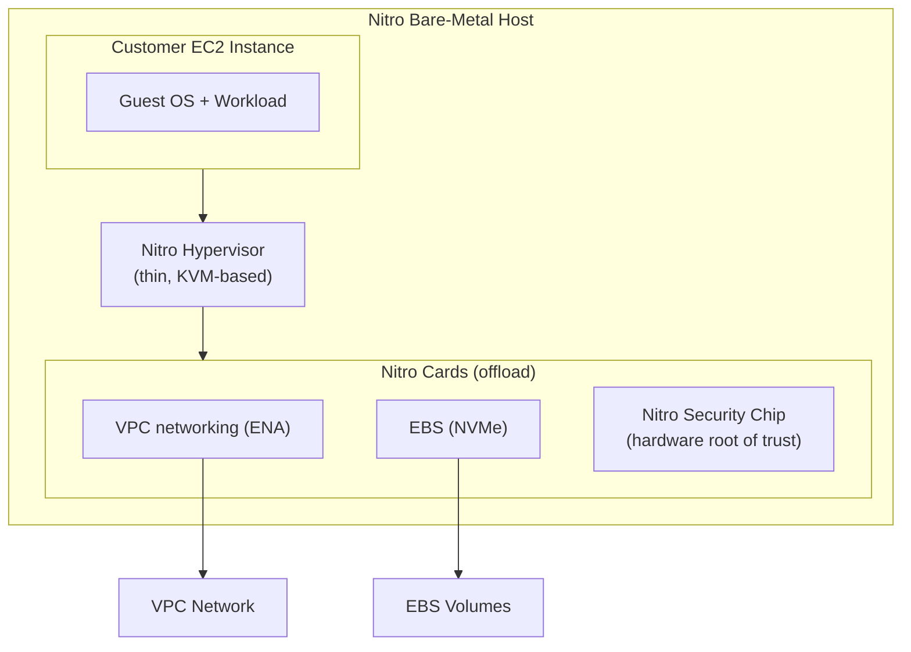
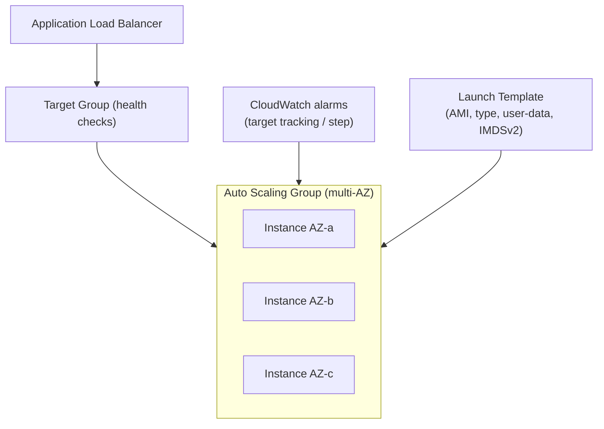
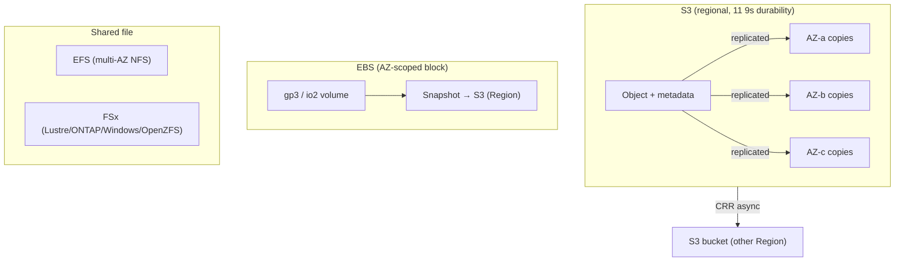

# Sections 4–5: AWS Compute & Storage

> Part of the [AWS Interview Preparation Roadmap](./README.md). Covers **Section 4: AWS Compute** and **Section 5: AWS Storage**.

---

# SECTION 4: AWS COMPUTE

## 4.1 Concept Overview

Compute is where you prove you understand the trade-off ladder: **EC2 (full control) → containers (ECS/EKS) → serverless (Lambda/Fargate)**. FAANG interviews probe *why* you'd pick each, how EC2 provisioning and the Nitro system actually work, and how autoscaling behaves under real load and failure.

**Beginner → Expert ladder:**
- **Beginner:** EC2 instance families, EBS, AMIs, security groups.
- **Intermediate:** Auto Scaling Groups, launch templates, Spot, RIs/Savings Plans, placement groups.
- **Advanced:** Nitro architecture, IMDSv2, warm pools, mixed-instances ASGs, lifecycle hooks.
- **Expert:** Static stability under AZ loss, capacity-optimized Spot with interruption handling, Graviton migration economics.

## 4.2 Architecture

### EC2 on the Nitro System

### Auto Scaling Group + ELB

## 4.3 Core Components

| Component | Purpose |
|-----------|---------|
| **Instance families** | `t`/`m` (general), `c` (compute), `r`/`x` (memory), `i`/`d` (storage), `p`/`g`/`inf` (GPU/ML), Graviton (`g` suffix, Arm) |
| **AMI** | Boot image (kernel, root FS, config) |
| **EBS** | Network-attached block storage (gp3, io2, st1, sc1) |
| **Instance Store** | Ephemeral local NVMe (lost on stop/terminate) |
| **Launch Template** | Versioned instance config for ASG |
| **Auto Scaling Group** | Maintains desired count across AZs |
| **Placement Group** | cluster (low latency), spread (HW isolation), partition (large distributed) |
| **Spot** | Spare capacity, up to ~90% off, 2-min interruption notice |
| **Reserved / Savings Plans** | 1–3yr commitment discounts |
| **Dedicated Host** | Physical server for licensing/compliance |
| **Lambda** | Event-driven FaaS, sub-second billing |
| **Fargate** | Serverless containers (ECS/EKS) |
| **App Runner / Beanstalk / Batch** | PaaS / managed batch |

## 4.4 Internal Working

**Nitro system:** AWS offloads networking (ENA), storage (NVMe/EBS), and security to dedicated **Nitro cards**, leaving a thin KVM-based hypervisor with near-bare-metal performance (<1% overhead). The **Nitro Security Chip** is a hardware root of trust that prevents firmware tampering and blocks operator access to customer data.

**EC2 provisioning workflow:** `RunInstances` → capacity allocation in the chosen AZ/subnet → ENI attached → EBS root volume created from AMI snapshot (lazily loaded blocks) → instance boots → user-data/cloud-init runs. `pending → running` state transitions; instance metadata available at `169.254.169.254`.

**IMDSv2:** Session-oriented metadata (PUT to get a token, then GET with token header) mitigates SSRF that plagued IMDSv1. Enforce `HttpTokens=required` and `HttpPutResponseHopLimit=1` so containers can't reach node creds through a proxy.

**Autoscaling internals:** ASG maintains desired capacity; CloudWatch alarms drive **target tracking** (keep CPU at 50%), **step**, or **scheduled** scaling. Lifecycle hooks pause launch/terminate for bootstrap/drain. Health checks (EC2 + ELB) replace unhealthy instances. Warm pools pre-initialize instances for faster scale-out.

**Spot mechanics:** Spot instances come from spare capacity; a 2-minute interruption notice arrives via IMDS/EventBridge when AWS reclaims. `capacity-optimized` allocation reduces interruptions; diversify across instance types/AZs.

## 4.5 Real-World Use Cases

- **Stateless web tier:** ASG + ALB + target tracking; Spot for cost with On-Demand baseline.
- **Batch/ML:** AWS Batch or EKS with Spot + checkpointing.
- **Event glue:** Lambda for S3/SQS/EventBridge-driven processing (no servers).

## 4.6 Important AWS Services

EC2, EBS, EFS, Auto Scaling, ELB, Launch Templates, Spot/Savings Plans, Nitro, Lambda, Fargate, App Runner, Elastic Beanstalk, AWS Batch, Compute Optimizer.

## 4.7 Common Interview Questions

1. **When EC2 vs Lambda vs Fargate?** EC2 for full control/long-running/special hardware; Fargate for containers without node management; Lambda for short, event-driven, spiky workloads.
2. **Spot vs On-Demand vs Reserved?** Spot = cheapest, interruptible; On-Demand = flexible, pay-as-you-go; Reserved/Savings Plans = discount for commitment.
3. **EBS vs Instance Store?** EBS persists and is network-attached; instance store is ephemeral local NVMe.
4. **gp3 vs gp2?** gp3 decouples IOPS/throughput from size and is ~20% cheaper.
5. **How does ASG decide to scale?** CloudWatch metrics + scaling policy (target tracking/step/scheduled).
6. **Placement groups?** Cluster (low latency, same rack), spread (isolate across HW), partition (distributed like HDFS/Cassandra).

## 4.8 Advanced Interview Questions

1. **How do you run Spot safely for production?** Diversified mixed-instances ASG, capacity-optimized allocation, interruption handler that drains/reschedules, On-Demand base capacity for the floor.
2. **Graviton migration trade-offs?** Arm64 gives ~40% better price/perf but requires multi-arch builds and dependency validation.
3. **Warm pools vs fast scaling?** Warm pools keep pre-initialized stopped instances to cut launch time for slow-booting apps.
4. **Lambda cold starts — mitigation?** Provisioned concurrency, smaller packages, keep-warm, SnapStart (Java), avoid VPC-attach latency where possible (now much improved with Hyperplane ENIs).

## 4.9 FAANG-Level Deep Dive Questions

1. **Design autoscaling for a 100x traffic spike (flash sale).** Pre-scale via scheduled scaling + predictive scaling, warm pools, ALB pre-warm (or use NLB), Spot+On-Demand mix, SQS buffering, and graceful degradation.
2. **Achieve static stability under AZ failure.** Provision N+1 capacity across 3 AZs so losing one AZ needs no new launches; don't depend on control-plane launches during the event.
3. **Explain how Nitro enables bare-metal and enclaves.** Offload cards + security chip allow `.metal` instances and Nitro Enclaves (isolated compute for secrets/PII with no operator access).

## 4.10 Troubleshooting Scenarios

- **Instances flapping in ASG:** Health check grace too short vs app boot time; or failing ELB health checks.
- **`InsufficientInstanceCapacity`:** AZ/type capacity shortage; diversify types/AZs, use capacity reservations.
- **Spot mass interruption:** Concentrated in one pool; diversify + capacity-optimized.
- **High cross-AZ cost:** Chatty instances split across AZs; co-locate or use topology-aware routing.

## 4.11 Production Best Practices

- Immutable AMIs (baked via Packer/EC2 Image Builder); no in-place patching.
- IMDSv2 required, hop limit 1; least-privilege instance roles.
- Multi-AZ ASGs, N+1 capacity, lifecycle hooks for graceful drain.
- Prefer managed compute (Fargate/Lambda) to reduce ops surface.

## 4.12 Security Considerations

- Instance roles (no static keys); IMDSv2; SSM Session Manager instead of SSH.
- Encrypt EBS by default (KMS); patch via SSM Patch Manager or immutable AMIs.
- Nitro Enclaves for sensitive data isolation.

## 4.13 Cost Optimization Strategies

- Right-size with Compute Optimizer; adopt Graviton; gp3 over gp2.
- Savings Plans for steady baseline; Spot for fault-tolerant/batch.
- Turn off non-prod off-hours; delete idle EIPs/unattached EBS.

## 4.14 Sample Answers

> **"How would you cut compute costs 40% without hurting reliability?"** *"First, Compute Optimizer to right-size and move to Graviton where compatible — often 20–40% on its own. Second, a Compute Savings Plan covering the steady baseline, with Spot (capacity-optimized, diversified) for stateless and batch tiers backed by an On-Demand floor. Third, gp3 volumes and off-hours schedules for non-prod. I'd validate reliability with N+1 multi-AZ capacity and Spot interruption handling so cost cuts never reduce availability."*

## 4.15 Follow-up Questions Interviewers Ask

- "How do you handle a Spot interruption mid-request?"
- "What breaks when you move from EC2 to Fargate?"
- "How do predictive and target-tracking scaling differ?"

## 4.16 AWS Documentation Links

- EC2: https://docs.aws.amazon.com/ec2/
- Nitro: https://aws.amazon.com/ec2/nitro/
- Auto Scaling: https://docs.aws.amazon.com/autoscaling/ec2/userguide/
- Lambda: https://docs.aws.amazon.com/lambda/latest/dg/
- Fargate: https://docs.aws.amazon.com/AmazonECS/latest/userguide/what-is-fargate.html

## 4.17 Hands-On Labs

1. Build a mixed-instances ASG (Spot+On-Demand) behind an ALB with target tracking; simulate Spot interruption.
2. Bake an AMI with EC2 Image Builder; roll it out via instance refresh.
3. Enforce IMDSv2 org-wide via SCP; verify credential access from a pod is blocked.

## 4.18 Comparison with Azure and GCP

| Concept | AWS | Azure | GCP |
|---------|-----|-------|-----|
| VM | EC2 | Virtual Machine | Compute Engine |
| Scale set | Auto Scaling Group | VM Scale Set | Managed Instance Group |
| Spot | Spot Instances | Spot VMs | Spot/Preemptible VMs |
| Serverless containers | Fargate | Container Apps / ACI | Cloud Run |
| FaaS | Lambda | Azure Functions | Cloud Functions |
| Arm chips | Graviton | Cobalt / Ampere | Tau T2A (Arm) |
| Commit discount | Savings Plans / RI | Reserved Instances / Savings Plans | CUDs |

**Key differences:** AWS's Nitro offload is the deepest hardware virtualization story; Graviton is the most mature cloud Arm option. Lambda's ecosystem and event-source integrations are broader than Functions/Cloud Functions.

---

# SECTION 5: AWS STORAGE

## 5.1 Concept Overview

Storage interviews test whether you can match a workload to the right primitive — **object (S3)**, **block (EBS)**, **file (EFS/FSx)** — and reason about durability, consistency, replication, and cost tiers. S3's 11-nines durability and lifecycle economics are perennial favorites.

**Beginner → Expert ladder:**
- **Beginner:** S3 buckets/objects, EBS volumes, storage classes.
- **Intermediate:** Versioning, lifecycle policies, encryption modes, EFS vs EBS.
- **Advanced:** CRR/SRR, Object Lock/WORM, multipart, S3 request-rate scaling, FSx variants.
- **Expert:** Durability math, DR patterns (RTO/RPO), petabyte data-lake tiering, strong-consistency implications.

## 5.2 Architecture

## 5.3 Core Components

| Service | Type | Durability/HA | Use |
|---------|------|---------------|-----|
| **S3** | Object | 11 9s, multi-AZ | Data lake, backups, static assets |
| **S3 classes** | Standard, IA, One Zone-IA, Glacier Instant/Flexible/Deep Archive, Intelligent-Tiering | varies | Cost tiering |
| **EBS** | Block | AZ-scoped, replicated in-AZ | Boot/data volumes |
| **Instance Store** | Block | Ephemeral | Scratch/cache |
| **EFS** | File (NFS) | Multi-AZ | Shared POSIX FS |
| **FSx** | File | varies | Windows/Lustre HPC/ONTAP/OpenZFS |
| **Storage Gateway** | Hybrid | — | On-prem ↔ AWS |

## 5.4 Internal Working

**S3 durability (11 nines):** Each object is redundantly stored across **≥3 AZs** (except One Zone-IA). AWS uses erasure coding and continuous integrity checks (checksums, background repair). 99.999999999% durability means for 10M objects you'd statistically lose one object every ~10,000 years.

**Strong consistency:** Since Dec 2020, S3 provides **read-after-write and list consistency** for all requests — no more stale-read caveats. Still, cross-Region replication (CRR) is **asynchronous** (eventual at the destination).

**Request-rate scaling:** S3 scales to **3,500 PUT/COPY/POST/DELETE and 5,500 GET/HEAD per second per prefix**. Parallelize across prefixes for higher throughput; key naming no longer needs random prefixes (auto-partitioning handles it).

**Multipart upload:** Files >100 MB should use multipart (required >5 GB). Parts upload in parallel, retried independently, then combined — improves throughput and resilience.

**EBS internals:** Volumes are replicated within an AZ; snapshots are incremental block-level backups stored in S3 (Region-durable). gp3 delivers a 3,000 IOPS / 125 MB/s baseline independent of size; io2 Block Express reaches 256k IOPS / sub-ms.

**Encryption modes:** SSE-S3 (AWS-managed keys), SSE-KMS (customer-managed CMK, auditable, key policies), SSE-C (customer-supplied keys). Default bucket encryption is now on by default (SSE-S3).

## 5.5 Real-World Use Cases

- **Data lake:** S3 + Intelligent-Tiering + lifecycle to Glacier; queried by Athena/Redshift Spectrum.
- **Backups/DR:** EBS snapshots + AMIs cross-Region copy; S3 CRR for object DR.
- **Shared config/ML:** EFS for POSIX sharing across pods; FSx for Lustre for HPC.

## 5.6 Important AWS Services

S3, S3 Glacier, EBS, EFS, FSx (Windows/Lustre/ONTAP/OpenZFS), Instance Store, Storage Gateway, AWS Backup, DataSync, Snowball.

## 5.7 Common Interview Questions

1. **S3 storage classes and when?** Standard (hot), IA (infrequent), One Zone-IA (recreatable), Glacier tiers (archive), Intelligent-Tiering (auto-move).
2. **Is S3 strongly consistent?** Yes, read-after-write and list, since 2020.
3. **EBS vs EFS vs S3?** Block vs shared file vs object; single-instance vs multi-instance POSIX vs internet-scale objects.
4. **How does lifecycle save cost?** Auto-transition to cheaper tiers and expire old versions/objects.
5. **Object Lock?** WORM compliance — prevents deletion for a retention period (governance/compliance mode).
6. **Cross-Region Replication use?** DR, latency, compliance — async, requires versioning.

## 5.8 Advanced Interview Questions

1. **Explain 11 nines durability.** Redundant multi-AZ erasure-coded storage with continuous integrity repair; math ≈ one object lost per ~10k years per 10M objects.
2. **How to hit very high S3 throughput?** Parallelize across prefixes and use multipart; each prefix scales independently.
3. **When One Zone-IA?** Easily recreatable data where single-AZ risk is acceptable (thumbnails, secondary copies) — cheaper.
4. **Encryption choice for audited PII?** SSE-KMS with a customer-managed CMK for key policies, rotation, and CloudTrail audit.

## 5.9 FAANG-Level Deep Dive Questions

1. **Design petabyte-scale cost-optimized storage.** Intelligent-Tiering for unknown access patterns, lifecycle to Glacier Deep Archive for cold, partition by date prefix, compress (Parquet), and query in place with Athena.
2. **DR with strict RPO/RTO.** S3 CRR (RPO≈minutes), cross-Region EBS snapshot copies + AMIs, AWS Backup vault lock, pre-created infra as code for fast RTO.
3. **Consistency implications for a read-heavy pipeline.** Rely on S3 strong consistency for same-Region reads but treat CRR destinations as eventually consistent; don't read-after-write across Regions.

## 5.10 Troubleshooting Scenarios

- **S3 503 SlowDown:** Request rate spikes on a prefix; spread keys/prefixes, add retries with backoff.
- **EBS volume slow:** Hitting IOPS/throughput ceiling; move to gp3/io2, or check burst-balance exhaustion.
- **CRR not replicating:** Versioning off, missing IAM role, or replication rule filter mismatch.
- **AccessDenied on encrypted object:** Missing KMS key permissions in addition to S3 permissions.

## 5.11 Production Best Practices

- Block Public Access on by default; bucket policies + VPC endpoints for private access.
- Versioning + lifecycle + MFA delete for critical buckets; Object Lock for compliance.
- Default encryption (SSE-KMS for sensitive); TLS in transit.
- AWS Backup with vault lock for centralized, immutable backups.

## 5.12 Security Considerations

- Enforce Block Public Access at account level via SCP.
- Use bucket policies with `aws:SecureTransport` and `aws:SourceVpce` conditions.
- S3 Access Points for scoped, per-app access; Access Analyzer for external-sharing findings.

## 5.13 Cost Optimization Strategies

- Intelligent-Tiering + lifecycle to Glacier; expire incomplete multipart uploads.
- Compress/columnar formats for analytics; S3 Storage Lens for visibility.
- Delete orphaned snapshots/volumes; use gp3.

## 5.14 Sample Answers

> **"A team stores 500 TB of logs in S3 Standard and the bill is huge — fix it."** *"Logs are write-once, read-rarely, so I'd add lifecycle rules: keep 30 days in Standard for active queries, transition to Standard-IA at 30 days, Glacier Flexible at 90, Deep Archive at 180, and expire at the retention limit. For unpredictable access I'd use Intelligent-Tiering. I'd also convert to compressed Parquet so Athena scans less data, and enable Storage Lens to catch regressions. That typically cuts 60–90% with no query-experience loss for recent data."*

## 5.15 Follow-up Questions Interviewers Ask

- "How do you make backups immutable against ransomware?" (Object Lock + Backup Vault Lock).
- "What's the durability difference of One Zone-IA?"
- "How do you get 20 GB/s out of S3 for a training job?" (parallel prefixes + FSx for Lustre link).

## 5.16 AWS Documentation Links

- S3: https://docs.aws.amazon.com/AmazonS3/latest/userguide/
- EBS: https://docs.aws.amazon.com/ebs/latest/userguide/
- EFS: https://docs.aws.amazon.com/efs/latest/ug/
- FSx: https://docs.aws.amazon.com/fsx/
- AWS Backup: https://docs.aws.amazon.com/aws-backup/latest/devguide/

## 5.17 Hands-On Labs

1. Configure lifecycle + Intelligent-Tiering and observe tier transitions/cost.
2. Enable versioning + Object Lock; attempt to delete a locked object.
3. Set up CRR between two Regions and verify async replication + KMS re-encryption.

## 5.18 Comparison with Azure and GCP

| Concept | AWS | Azure | GCP |
|---------|-----|-------|-----|
| Object | S3 | Blob Storage | Cloud Storage |
| Block | EBS | Managed Disks | Persistent Disk |
| File | EFS / FSx | Azure Files / NetApp Files | Filestore |
| Archive | Glacier tiers | Cool/Archive tiers | Nearline/Coldline/Archive |
| Object durability | 11 9s (multi-AZ) | LRS/ZRS/GRS options | 11 9s (multi-region option) |
| Immutability | Object Lock | Immutable blob policies | Bucket Lock / retention |

**Key differences:** Azure exposes replication as explicit SKUs (LRS/ZRS/GRS/RA-GRS); AWS bakes multi-AZ redundancy into S3 and offers CRR separately. GCP Cloud Storage can be multi-regional in a single bucket, unlike S3's per-Region buckets + CRR.

---

> Next: **[Section 6 — EKS Deep Dive](./06-EKS-DEEP-DIVE.md)**.
