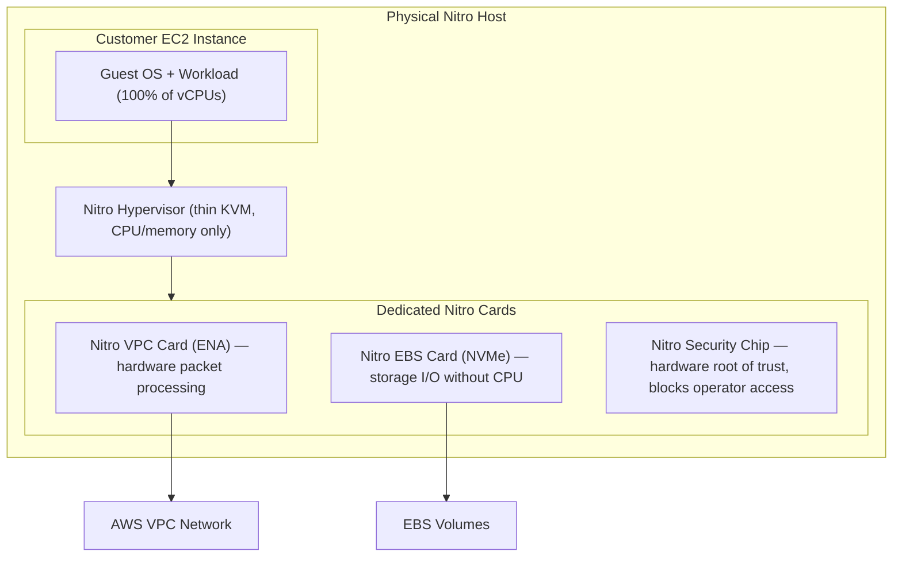

# AWS COMPUTE & STORAGE — Deep Dive Interview Preparation

> **Scope:** Sections 4–5 of 20 | Beginner → Expert progression | FAANG-level depth  
> **Coverage:** EC2 internals, Nitro, ASG, Spot, Lambda, Fargate, S3, EBS, EFS, FSx, 60+ Q&A

---

## Table of Contents

**Section 4: Compute**
1. [EC2 Instance Types & Families](#1-ec2-instance-types--families)
2. [Nitro System Architecture](#2-nitro-system-architecture)
3. [EC2 Provisioning & Boot Process](#3-ec2-provisioning--boot-process)
4. [Placement Groups](#4-placement-groups)
5. [Auto Scaling Groups & Launch Templates](#5-auto-scaling-groups--launch-templates)
6. [Spot Instances](#6-spot-instances)
7. [Reserved Instances & Savings Plans](#7-reserved-instances--savings-plans)
8. [AWS Lambda Deep Dive](#8-aws-lambda-deep-dive)
9. [AWS Fargate & App Runner](#9-aws-fargate--app-runner)

**Section 5: Storage**
10. [Amazon S3 Deep Dive](#10-amazon-s3-deep-dive)
11. [Amazon EBS Deep Dive](#11-amazon-ebs-deep-dive)
12. [Amazon EFS](#12-amazon-efs)
13. [Amazon FSx](#13-amazon-fsx)
14. [Storage Gateway](#14-storage-gateway)

**Common**
15. [Interview Questions & Answers](#15-interview-questions--answers)
16. [Troubleshooting Scenarios](#16-troubleshooting-scenarios)
17. [Production Best Practices](#17-production-best-practices)
18. [Documentation Links](#18-documentation-links)

---

## 1. EC2 Instance Types & Families

### Beginner Foundation

An **EC2 instance** is a virtual machine running in the AWS cloud. The instance type determines vCPU count, memory, storage, and network performance.

**Instance naming: `family + generation + [attribute] + size`**

Example: `m7g.4xlarge`
- `m` = General purpose family
- `7` = 7th generation
- `g` = Graviton (AWS ARM processor)
- `4xlarge` = 16 vCPU, 64 GiB RAM

### Intermediate Mechanics — Instance Families

| Family | Prefix | vCPU:RAM | Best for |
|---|---|---|---|
| General Purpose | m, t | 1:4 | Web servers, app servers, dev/test |
| Compute Optimized | c | 1:2 | Batch, HPC, gaming servers |
| Memory Optimized | r, x, z | 1:8 to 1:32 | In-memory databases, SAP HANA |
| Storage Optimized | i, d, h | High local NVMe | NoSQL, data warehouses, HDFS |
| Accelerated Computing | p, g, inf, trn | GPU | ML training, inference, video encoding |
| T-series (burstable) | t | Variable | Variable CPU workloads |

**T-series burstable deep dive:**

T-series instances earn CPU credits when running below baseline (e.g., `t3.medium` baseline = 20% of 2 vCPUs). When above baseline, credits are consumed. `t3` and newer are **unlimited** by default — burst indefinitely but surplus credits are charged. This surprises teams whose dev `t3.small` runs CPU-intensive jobs for days.

```bash
# Check CPU credit balance
aws cloudwatch get-metric-statistics \
  --namespace AWS/EC2 \
  --metric-name CPUCreditBalance \
  --dimensions Name=InstanceId,Value=i-0abc123 \
  --start-time $(date -d '1 hour ago' -u +%Y-%m-%dT%H:%M:%SZ) \
  --end-time $(date -u +%Y-%m-%dT%H:%M:%SZ) \
  --period 300 --statistics Average
```

**Graviton (ARM64) instances:**

`m7g`, `c7g`, `r7g` — AWS-designed ARM chips. 20–40% better price/performance than equivalent x86. Requires ARM64-compiled code. Most modern runtimes (Java, Go, Python, Node.js, .NET) support ARM64 natively. Docker images must be multi-arch.

```bash
# Build multi-arch container image
docker buildx build --platform linux/amd64,linux/arm64 -t my-app:latest --push .
```

### Advanced Engineering

**Network bandwidth is per-instance-type:** `m5.large` = 1.25 Gbps; `m5.24xlarge` = 25 Gbps. EBS bandwidth is separate from network bandwidth — heavy EBS I/O can saturate the EBS throughput cap without affecting network. Monitor both `NetworkIn/Out` and `EBSWriteBytes` metrics separately.

---

## 2. Nitro System Architecture

### Beginner Foundation

The **Nitro System** is AWS's custom hardware and software that offloads virtualization functions (networking, storage, security) to dedicated Nitro hardware cards, giving customer instances near bare-metal performance with < 1% overhead.

### Intermediate Mechanics



**Nitro Security Chip:** Enforces at hardware level that AWS operators cannot read customer instance memory, storage, or network traffic. This is a cryptographic hardware guarantee, not just a policy.

**Nitro Enclaves:** Isolated VMs within EC2 for processing sensitive data. No persistent storage, no network, no interactive access. AWS KMS releases keys only to verified Enclave attestation reports. Used for PII processing, HSM operations, ML inference on private data.

**Bare metal instances** (`m5.metal`, `c5.metal`): No hypervisor between OS and hardware. Used for VMware Cloud on AWS (nested virtualization), workloads requiring direct hardware access.

### Advanced Engineering

**EBS lazy loading from AMI snapshots:** When a volume is created from a snapshot, blocks are fetched from S3 on first access (150–200 ms vs < 1 ms for cached blocks). Pre-warm production volumes before traffic:

```bash
# Pre-warm all blocks on a newly created EBS volume
sudo fio --filename=/dev/xvda --rw=randread --bs=128k --iodepth=32 \
  --ioengine=libaio --direct=1 --name=pre-warm --runtime=600
```

AWS Fast Snapshot Restore (FSR) pre-initializes blocks — eliminates warm-up latency at extra cost (~$0.75/AZ/hour enabled).

---

## 3. EC2 Provisioning & Boot Process

### Intermediate Mechanics

**`RunInstances` control plane flow:**

1. **Capacity check:** Is the requested instance type available in the specified AZ? No → `InsufficientInstanceCapacity`.
2. **Scheduler:** Selects a Nitro host with capacity.
3. **ENI creation:** Private IP assigned from subnet CIDR; security groups attached.
4. **EBS root volume:** Created from AMI snapshot (lazy loading).
5. **Boot:** Nitro hypervisor starts the VM; UEFI/BIOS runs.
6. **IMDS available** at `169.254.169.254`.
7. **User data:** `cloud-init` / Windows EC2Launch executes user-data.
8. **Status checks:** System (host health) and instance (OS reachability) begin.

**Status checks:**

| Check | Monitors | If failing | Action |
|---|---|---|---|
| System status | Underlying Nitro host hardware | AWS host issue | Auto Recovery (moves to new host) |
| Instance status | OS reachability, IMDS health | OS crash, OOM, disk full | Your intervention (stop/start, SSM) |

```bash
# Configure auto-recovery on system check failure
aws cloudwatch put-metric-alarm \
  --alarm-name "AutoRecover-i-0abc123" \
  --metric-name StatusCheckFailed_System \
  --namespace AWS/EC2 \
  --dimensions Name=InstanceId,Value=i-0abc123 \
  --statistic Minimum --period 60 --evaluation-periods 2 --threshold 1 \
  --comparison-operator GreaterThanOrEqualToThreshold \
  --alarm-actions "arn:aws:automate:us-east-1:ec2:recover"
```

---

## 4. Placement Groups

**Three strategies:**

**Cluster:** All instances on the same rack (or adjacent racks), same AZ. Lowest inter-node latency (10 Gbps enhanced networking, < 1 ms). Required for HPC, MPI, distributed ML training.
- Limitation: Must use same instance family. Start all instances simultaneously for best placement. Cannot span AZs.

**Spread:** Each instance on a distinct hardware rack. Maximum 7 instances per AZ. Provides maximum fault isolation for small critical clusters (Kafka brokers, ZooKeeper, leader nodes).

**Partition:** Instances spread across logical partitions (each partition = distinct rack set). Up to 7 partitions per AZ, thousands of instances. Provides partition-ID metadata for HDFS rack-awareness:

```bash
# Get partition number from within instance
curl -s http://169.254.169.254/latest/meta-data/placement/partition-number
```

---

## 5. Auto Scaling Groups & Launch Templates

### Beginner Foundation

**ASG** maintains a desired number of EC2 instances, replaces unhealthy ones, and scales based on demand. **Launch Templates** are versioned configuration blueprints.

### Intermediate Mechanics

**Scaling policy types:**

| Policy | How it works | Best for |
|---|---|---|
| Target Tracking | Maintain metric at target (CPU = 50%) | Most workloads — simplest |
| Step Scaling | Scale by N when alarm crosses threshold | Known load patterns |
| Scheduled Scaling | Scale at specific times | Predictable cycles (business hours) |
| Predictive Scaling | ML forecast + proactive scaling | Predictable but variable patterns |

```hcl
# Target tracking example
resource "aws_autoscaling_policy" "cpu" {
  name                   = "cpu-target-tracking"
  autoscaling_group_name = aws_autoscaling_group.app.name
  policy_type            = "TargetTrackingScaling"

  target_tracking_configuration {
    predefined_metric_specification {
      predefined_metric_type = "ASGAverageCPUUtilization"
    }
    target_value     = 50.0
    disable_scale_in = false
  }
}
```

**Always use ELB health checks for web application ASGs:**
```hcl
resource "aws_autoscaling_group" "app" {
  health_check_type         = "ELB"  # Not default "EC2"
  health_check_grace_period = 300
  target_group_arns         = [aws_lb_target_group.app.arn]
}
```

**Lifecycle hooks (graceful shutdown):**
```bash
# User-data: signal completion after initialization
aws autoscaling complete-lifecycle-action \
  --lifecycle-hook-name warmup-hook \
  --auto-scaling-group-name my-asg \
  --lifecycle-action-result CONTINUE \
  --instance-id $(curl -s http://169.254.169.254/latest/meta-data/instance-id)
```

**Mixed Instance Policy + Spot:**
```hcl
resource "aws_autoscaling_group" "app" {
  mixed_instances_policy {
    instances_distribution {
      on_demand_base_capacity                  = 2
      on_demand_percentage_above_base_capacity = 20
      spot_allocation_strategy                 = "capacity-optimized"
    }
    launch_template {
      launch_template_specification {
        launch_template_id = aws_launch_template.app.id
        version            = "$Latest"
      }
      # Multiple instance types for Spot resilience
      override { instance_type = "m5.large" }
      override { instance_type = "m5a.large" }
      override { instance_type = "m6i.large" }
      override { instance_type = "c5.xlarge"; weighted_capacity = 2 }
    }
  }
}
```

### Advanced Engineering

**Static stability under AZ impairment:** If one of 3 AZs fails, 2/3 of instances remain. Set `min_size` so 2 AZs can handle 100% load:
- 3 AZs, 9 instances desired → 3 per AZ → need 6 minimum to serve full load → `min_size = 6`

**Warm pools:** Pre-initialize instances in stopped state for < 30-second scale-out (vs. 5–10 min cold boot). Cost: stopped instances cost only EBS. Benefit: eliminates scale-out latency for predictable burst events.

**Instance Refresh (rolling update):**
```bash
aws autoscaling start-instance-refresh \
  --auto-scaling-group-name my-asg \
  --preferences '{"MinHealthyPercentage": 90, "InstanceWarmup": 300}'
```

---

## 6. Spot Instances

### Beginner Foundation

**Spot Instances** = unused EC2 capacity at up to 90% discount. AWS reclaims with **2-minute notice**. Viable for production with stateless workloads, multiple instance types, and graceful interruption handling.

**Interruption rates:** Typically 1–5% of instance-hours. Varies by instance type, AZ, and time. Check Spot Interruption Advisor in the EC2 console.

### Intermediate Mechanics

**Handle interruptions via IMDS and EventBridge:**
```bash
# Poll for interruption notice from within instance (every 5 seconds)
while true; do
  TOKEN=$(curl -s -X PUT "http://169.254.169.254/latest/api/token" \
    -H "X-aws-ec2-metadata-token-ttl-seconds: 21600")
  NOTICE=$(curl -s -H "X-aws-ec2-metadata-token: $TOKEN" \
    http://169.254.169.254/latest/meta-data/spot/instance-action 2>&1)
  if echo "$NOTICE" | grep -q "terminate"; then
    echo "Spot interruption incoming! Graceful shutdown..."
    # Checkpoint state, drain connections, deregister from LB
    break
  fi
  sleep 5
done
```

**Spot allocation strategies:**
- `capacity-optimized`: Selects pools with most available capacity → lowest interruption risk. **Recommended for production.**
- `price-capacity-optimized`: Balance between price and capacity. AWS recommended default.
- `lowest-price`: Highest interruption risk (all customers compete for cheapest pool).

**Always diversify instance types:** Specify 5+ types with similar vCPU/memory profiles. If one pool is exhausted, ASG/EC2 Fleet uses another.

### Advanced Engineering

**Spot with Karpenter (EKS):** Karpenter automatically handles Spot interruptions by pre-provisioning replacement nodes and draining the interrupted node:

```yaml
apiVersion: karpenter.sh/v1
kind: NodePool
metadata:
  name: spot-workers
spec:
  template:
    spec:
      requirements:
        - key: karpenter.sh/capacity-type
          operator: In
          values: ["spot"]
        - key: kubernetes.io/arch
          operator: In
          values: ["amd64", "arm64"]
      nodeClassRef:
        name: default
  disruption:
    consolidationPolicy: WhenUnderutilized
    budgets:
      - nodes: "20%"  # Never disrupt more than 20% of nodes simultaneously
```

---

## 7. Reserved Instances & Savings Plans

### Intermediate Mechanics

**Savings Plans (preferred):**

| Plan Type | Commitment | Flexibility |
|---|---|---|
| Compute Savings Plans | $/hr of any EC2/Lambda/Fargate | Any family, region, OS — most flexible |
| EC2 Instance Savings Plans | $/hr of specific family in region | Any OS, size in that family |
| SageMaker Savings Plans | $/hr of SageMaker | Any SageMaker instance |

**Purchasing strategy:**
1. Use Cost Explorer → Savings Plans recommendations.
2. Cover 70–80% of stable baseline (not peak).
3. Use Spot for variable/bursty above baseline.
4. Purchase Compute Savings Plans (most flexible) over Reserved Instances (more restrictive).

```bash
# Get Compute SP recommendation
aws savingsplans get-savings-plans-purchase-recommendation \
  --savings-plans-type COMPUTE_SP \
  --term-in-years ONE_YEAR \
  --payment-option PARTIAL_UPFRONT \
  --lookback-period-in-days SIXTY_DAYS
```

**Organization sharing:** Savings Plans and RIs in any member account apply to usage across the entire Organization (consolidated billing). Cannot restrict sharing per-account without opting out of RI sharing.

---

## 8. AWS Lambda Deep Dive

### Beginner Foundation

**Lambda** = event-driven FaaS. Upload code → configure trigger → Lambda executes on-demand. Pay per millisecond of execution. No servers to manage.

**Key limits:** 15 min max duration, 10 GB memory, 10 GB container image, 6 MB sync payload, 256 KB async payload, 1,000 concurrent executions/Region (default).

### Intermediate Mechanics

**Cold start anatomy:**

```mermaid
sequenceDiagram
    participant Trigger as Event Source
    participant Lambda as Lambda Service
    participant VM as Firecracker microVM
    participant Code as Function Code

    Trigger->>Lambda: Invoke
    Lambda->>VM: Create new microVM (cold start only)
    VM->>VM: Download & unpack code package
    VM->>Code: Start runtime (JVM/Python/Node interpreter)
    Code->>Code: Run global initialization (SDK clients, DB pools)
    Code->>Code: Execute handler
    Code-->>Trigger: Response
    Note over VM: Warm for ~5-15 min; next invoke skips all above
```

**Cold start mitigation:**

| Cause | Solution |
|---|---|
| Java/Spring (3+ s) | Lambda SnapStart (snapshots init JVM) |
| Large package size | Reduce deps, use Lambda Layers |
| Slow global init | Move SDK clients to global scope |
| High p99 / spiky load | Provisioned Concurrency |

**Global scope optimization (critical):**
```python
import boto3

# Global scope: runs ONCE per execution environment
dynamodb = boto3.resource('dynamodb')  # SDK initialization ~50ms
table = dynamodb.Table('users')

def handler(event, context):
    # Per-invocation: reuses initialized client
    return table.get_item(Key={'user_id': event['user_id']})['Item']
```

**VPC Lambda considerations:** Lambda in VPC routes traffic via your NAT Gateway (for internet) or VPC Endpoints (for AWS services). Ensure Interface Endpoints for all accessed AWS services to avoid NAT Gateway egress costs and improve latency.

```hcl
resource "aws_lambda_function" "api" {
  function_name = "api-handler"
  runtime       = "python3.12"
  handler       = "handler.main"
  role          = aws_iam_role.lambda.arn
  filename      = "lambda.zip"

  vpc_config {
    subnet_ids         = [aws_subnet.private_a.id, aws_subnet.private_b.id]
    security_group_ids = [aws_security_group.lambda.id]
  }
}
```

### Advanced Engineering

**Provisioned Concurrency (eliminates cold starts):**
```hcl
resource "aws_lambda_provisioned_concurrency_config" "api" {
  function_name                  = aws_lambda_function.api.function_name
  qualifier                      = aws_lambda_alias.live.name
  provisioned_concurrent_executions = 10
}
```

**Lambda SnapStart (Java 11+):** Snapshots the initialized JVM state. Restores on cold start instead of re-running initialization. 3–5 s Java cold starts → < 200 ms.

**Lambda Power Tuning:** CPU scales linearly with memory. 512 MB at 1 s = same cost as 1,024 MB at 0.5 s. Always tune:
```bash
# Open-source Lambda Power Tuning tool
npx lambda-power-tuning --function-name my-function --payload '{}' --strategy cost
```

**Concurrency math:**
```
Concurrent executions = Requests/sec × Average duration (seconds)
Example: 500 req/sec × 0.2 s avg = 100 concurrent executions needed
At 1,000 account limit: leaves 900 for other functions
```

**Async invocations + destinations:**
```bash
# Route failed async invocations to SQS for inspection
aws lambda put-function-event-invoke-config \
  --function-name my-function \
  --destination-config '{"OnFailure":{"Destination":"arn:aws:sqs:us-east-1:123:failed-events"}}'
```

---

## 9. AWS Fargate & App Runner

**Fargate** = serverless compute for containers. Define CPU/memory per task/pod; AWS manages the underlying EC2 nodes.

**Fargate vs. EC2 Nodes for EKS:**

| Dimension | Fargate | EC2 Managed Nodes |
|---|---|---|
| Node management | None | Must update node groups |
| Scale speed | Instant (pod = VM) | 2–5 min node launch |
| Isolation | Per-pod microVM | Shared node kernel |
| DaemonSets | Not supported | Supported |
| GPU | Not supported | Supported |
| EBS volumes | Not supported | Supported |
| Best for | Stateless, security-sensitive, bursty | Stateful, DaemonSet-dependent, GPU |

**App Runner:** Zero-configuration managed service. Provide ECR image or GitHub repo → App Runner builds, deploys, scales, and terminates containers. No ALB, no ASG, no VPC config required. Best for small teams prioritizing speed over control.

---

# SECTION 5: STORAGE

## 10. Amazon S3 Deep Dive

### Beginner Foundation

**S3** = object storage. Flat key-value store: each object has a key (string path), value (bytes), and metadata. Not a filesystem — no hierarchy, no file locking, no random writes. Objects are read/written atomically.

**Key properties:**
- **Durability:** 99.999999999% (11 nines)
- **Availability:** 99.99% (Standard)
- **Object size:** 0 B to 5 TB; > 5 GB requires multipart upload; > 100 MB should use it
- **Bucket namespace:** Global (bucket names unique across all AWS accounts and regions)

### 10.1 Durability — 11 Nines Explained

**How achieved:**
1. Objects stored redundantly across ≥ 3 physically separate AZ facilities
2. Erasure coding (redundancy without 3× storage overhead)
3. Continuous integrity checksumming (CRC32C) — bit rot detected and repaired automatically
4. Independent failure domains (AZ isolation: separate power, networking)
5. Versioning protects against accidental deletion

**Availability vs. Durability (commonly confused):**
- **Durability** = probability data EXISTS = 11 nines = effectively zero data loss
- **Availability** = probability you can ACCESS data right now = 99.99% = ~52 min/year potential unavailability

During an S3 availability event, data is NOT lost — temporarily inaccessible.

**What 11 nines does NOT protect against:** Accidental deletion, ransomware, account compromise. Protect with: versioning, Object Lock, cross-account backup, Block Public Access.

### 10.2 S3 Storage Classes

| Class | Use case | Min duration | Availability |
|---|---|---|---|
| **Standard** | Frequently accessed | None | 99.99% |
| **Standard-IA** | Monthly access | 30 days | 99.9% |
| **One Zone-IA** | Reproducible data | 30 days | 99.5% |
| **Glacier Instant** | Archives, ms retrieval | 90 days | 99.9% |
| **Glacier Flexible** | Archives, 1-12 hr retrieval | 90 days | 99.99% |
| **Glacier Deep Archive** | Compliance, 12-48 hr | 180 days | 99.99% |
| **Intelligent-Tiering** | Unknown/changing access | None | 99.9%+ |

**Lifecycle policy:**
```json
{
  "Rules": [{
    "ID": "cost-optimization",
    "Status": "Enabled",
    "Filter": {"Prefix": "logs/"},
    "Transitions": [
      {"Days": 30, "StorageClass": "STANDARD_IA"},
      {"Days": 90, "StorageClass": "GLACIER_INSTANT_RETRIEVAL"},
      {"Days": 365, "StorageClass": "DEEP_ARCHIVE"}
    ],
    "Expiration": {"Days": 2555},
    "AbortIncompleteMultipartUpload": {"DaysAfterInitiation": 7}
  }]
}
```

### 10.3 S3 Consistency Model

**Strong read-after-write consistency for ALL operations since December 2020:**
- PUT then immediate GET → returns new version
- DELETE then immediate LIST → deleted object absent
- No caching, no eventual consistency window

This is a breaking change from the pre-2020 behavior where overwrite PUTs and DELETEs were eventually consistent and required workarounds.

### 10.4 S3 Encryption

| Type | Key management | KMS API overhead | Audit |
|---|---|---|---|
| SSE-S3 | AWS-managed | None | None |
| SSE-KMS | AWS KMS CMK | Per-request KMS call | CloudTrail logs every key use |
| SSE-C | Customer-provided | None | No KMS audit |
| DSSE-KMS | Dual-layer KMS | Higher | Full audit |

**Enforce SSE-KMS via bucket policy:**
```json
{
  "Statement": [{
    "Effect": "Deny",
    "Principal": "*",
    "Action": "s3:PutObject",
    "Resource": "arn:aws:s3:::my-bucket/*",
    "Condition": {
      "StringNotEquals": {
        "s3:x-amz-server-side-encryption": "aws:kms"
      }
    }
  }]
}
```

**S3 Bucket Keys:** Without it, each object PUT makes a separate `GenerateDataKey` KMS call. For 1M objects/day: 1M KMS calls/day (cost + throughput limits). Bucket Key creates a short-lived AES key at bucket level shared across multiple objects → 99% reduction in KMS API calls. Enable for all high-volume encrypted buckets.

### 10.5 Multipart Upload

Objects > 5 GB must use multipart. Objects > 100 MB should use it.

**Parts:** 1–10,000 parts; each ≥ 5 MB (except last). Parallel upload → maximum throughput. Failed parts retry independently.

**Always add AbortIncompleteMultipartUpload lifecycle rule** — incomplete multiparts are billed at Standard rate indefinitely without cleanup.

### 10.6 S3 Versioning & Object Lock

**Versioning:** Every write creates a new version ID. Delete adds a "delete marker" (doesn't remove bytes). Restore by specifying a version ID.

**Object Lock (WORM):**
- **Compliance mode:** No one (including root user) can delete/overwrite until retention expires. For SEC Rule 17a-4, HIPAA.
- **Governance mode:** Overrideable by users with `s3:BypassGovernanceRetention`. For operational flexibility.
- **Legal Hold:** Indefinite hold without expiry. Must be explicitly removed.

### 10.7 S3 Replication

**CRR (Cross-Region Replication):** DR, latency optimization, data residency compliance.
**SRR (Same-Region Replication):** Cross-account sharing, log aggregation, prod→test copy.

**Requirements:** Versioning on both buckets. IAM role with `s3:ReplicateObject` on destination. Existing objects NOT retroactively replicated (use S3 Batch Operations).

**RTC (Replication Time Control):** SLA: 99.99% of objects replicated in ≤ 15 min. Includes CloudWatch metrics for replication lag.

```hcl
resource "aws_s3_bucket_replication_configuration" "crr" {
  role   = aws_iam_role.replication.arn
  bucket = aws_s3_bucket.source.id

  rule {
    id = "replicate-all"
    status = "Enabled"
    destination {
      bucket        = aws_s3_bucket.destination.arn
      storage_class = "STANDARD_IA"
    }
  }
}
```

---

## 11. Amazon EBS Deep Dive

### Beginner Foundation

**EBS** = network-attached block storage. Appears as a block device to the OS (formatttable with any filesystem). Key properties:
- **AZ-specific:** Attach only to instances in the same AZ
- **Persistent:** Data survives instance stop (not instance termination if DeleteOnTermination=true)
- **Network-attached:** Low-latency via Nitro EBS card (NVMe-over-Nitro)
- **Elastic:** Resize, change type, increase IOPS on live volumes

### EBS Volume Types

**gp3 (General Purpose SSD — use this by default):**
- 3,000 IOPS baseline; up to 16,000 IOPS (independent of size)
- 125 MiB/s baseline; up to 1,000 MiB/s
- 20% cheaper than gp2 with more flexibility
- IOPS and throughput configurable independently

**io2 Block Express (highest performance):**
- Up to 256,000 IOPS, 4,000 MiB/s, sub-ms latency
- 99.999% durability (higher than gp3)
- Use for critical databases (Oracle, SQL Server, SAP HANA)

**st1 (Throughput-Optimized HDD):**
- Optimized for large sequential reads (500 MiB/s max)
- Cannot boot; use for data warehouses, big data, log files

**sc1 (Cold HDD):**
- Lowest cost ($0.015/GB-month)
- 250 MiB/s max; for infrequently accessed data

**gp2 vs. gp3 — the key difference:**
- gp2: IOPS = 3 × size GB (performance tied to size; 100 GiB gp2 = 300 IOPS baseline)
- gp3: IOPS independently configurable (100 GiB gp3 = 3,000 IOPS baseline at lower price)
- Migration: Always move gp2 to gp3 for cost savings with no downtime

```bash
# Live migration: gp2 → gp3 with increased IOPS
aws ec2 modify-volume \
  --volume-id vol-0abc123 \
  --volume-type gp3 \
  --iops 5000 \
  --throughput 500

# Monitor status
aws ec2 describe-volumes-modifications --volume-id vol-0abc123 \
  --query 'VolumesModifications[0].ModificationState'
# modifying → optimizing → completed

# Extend filesystem after size increase (no restart needed)
sudo resize2fs /dev/xvda1  # ext4
sudo xfs_growfs /           # xfs
```

**EBS snapshots:**
- Incremental: only changed blocks since last snapshot stored in S3.
- Cross-region, cross-account copy supported.
- Basis for AMIs and EBS Multi-Volume Crash-Consistent Snapshots.

```bash
# Create snapshot with resource tags
aws ec2 create-snapshot \
  --volume-id vol-0abc123 \
  --description "Pre-upgrade snapshot" \
  --tag-specifications 'ResourceType=snapshot,Tags=[{Key=Env,Value=Prod}]'
```

---

## 12. Amazon EFS

**EFS** = managed NFS for Linux. Thousands of instances can mount the same EFS simultaneously in the same Region (multi-AZ).

**Key differentiators from EBS:**
- Multi-mount (ReadWriteMany): EBS single-attach (except io2 Multi-Attach)
- Multi-AZ (redundant across 3+ AZs): EBS is AZ-local
- Elastic: No pre-provisioning; auto grows/shrinks
- NFS protocol: Linux only (Windows → FSx for Windows)

**Performance modes:**
- General Purpose: < 1 ms latency, for web serving, CMS, home directories
- Max I/O: Higher throughput, higher latency (> 1 ms), for big data analytics

**Throughput modes:**
- Elastic (recommended): Automatically scales; no pre-provisioning
- Provisioned: Pre-provision throughput independent of storage size
- Bursting: Scales with storage size + burst credits

**EFS for EKS (ReadWriteMany PV):**
```yaml
apiVersion: v1
kind: PersistentVolumeClaim
metadata:
  name: efs-claim
spec:
  accessModes:
    - ReadWriteMany   # Key: multiple pods can mount simultaneously
  storageClassName: efs-sc
  resources:
    requests:
      storage: 5Gi
```

---

## 13. Amazon FSx

**FSx for Windows File Server:**
- Full SMB protocol, Active Directory integration
- Multi-AZ HA option
- For Windows apps requiring native file shares (SQL Server FCI, user home dirs, `\\server\share`)

**FSx for Lustre:**
- High-performance parallel filesystem: up to 1 TB/s aggregate throughput
- Sub-millisecond latency; uses EC2 EFA (Enhanced Fabric Adapter) for HPC
- Native S3 integration: link to S3 bucket, data lazily loaded on first access
- Used for ML training datasets, HPC, video processing

**FSx for NetApp ONTAP:**
- Full NetApp feature set (NFS, SMB, iSCSI, SnapMirror, dedup, compression, FlexClone)
- Multi-protocol, multi-AZ
- Migration path from on-premises NetApp

**FSx for OpenZFS:**
- ZFS features: snapshots, copy-on-write, compression, instant clones
- NFS protocol, Linux/macOS
- Clone entire environments instantly for dev/test

---

## 14. Storage Gateway

Bridges on-premises environments to AWS storage. Runs as a VM appliance in your data center.

| Gateway Type | Protocol | Backend | Use Case |
|---|---|---|---|
| S3 File Gateway | NFS/SMB | Amazon S3 | Replace on-prem file servers |
| FSx File Gateway | SMB | FSx for Windows | Locally cached Windows shares |
| Tape Gateway | iSCSI VTL | S3 → Glacier | Replace physical tape libraries |
| Volume Gateway (stored) | iSCSI | S3 (async backup) | Full local storage + cloud backup |
| Volume Gateway (cached) | iSCSI | S3 (primary) | S3 primary with local cache |

---

## 15. Interview Questions & Answers

---

### Question 1: What happens during an ASG scale-out event and how do you ensure new instances serve traffic only when ready?

**What the interviewer is testing:** ASG mechanics, health check integration, graceful rollout.

**Strong answer:**

**Scale-out flow:**
1. CloudWatch alarm fires (CPU > 70% for 2 consecutive 5-minute periods).
2. ASG increases desired capacity by N instances.
3. ASG selects AZs (balancing toward AZs with fewest instances).
4. Calls `RunInstances` with the Launch Template.
5. Instance transitions: pending → running.
6. **Health check grace period starts** (default 300 s) — no health checks during this time. Allows OS boot + application start.
7. After grace period: ELB health checks begin (HTTP GET `/health` → must return 2xx).
8. Only after health check passes does the instance join the target group and receive traffic.

**Critical config choices:**

`health_check_type = "ELB"` (not default "EC2"): EC2 health checks only verify the OS is up. ELB health checks verify the application is responding. A crashed application that still has an OS running would pass EC2 checks and receive traffic.

**For complex initialization (DB migration, cache warming):** Use lifecycle hooks to pause instances in `Pending:Wait`. Your code runs initialization, then calls:
```bash
aws autoscaling complete-lifecycle-action \
  --lifecycle-hook-name warmup-hook \
  --auto-scaling-group-name my-asg \
  --lifecycle-action-result CONTINUE \
  --instance-id $(curl -s http://169.254.169.254/latest/meta-data/instance-id)
```

**Scale-in protection:** During scale-in, lifecycle hook pauses the instance in `Terminating:Wait`. Your code drains active connections (deregister from target group, wait for deregistration delay), flushes logs, then signals completion.

**Likely follow-ups:**
1. *What is the termination policy for ASG scale-in?* — Default: OldestLaunchTemplate → AZ imbalance correction → OldestInstance. You can customize: `ClosestToNextInstanceHour` saves RI cost by terminating instances near their billing hour. `NewestInstance` is useful for canary rollbacks.
2. *How does Instance Refresh work for rolling AMI updates?* — Sets a `MinHealthyPercentage` and `InstanceWarmup`. ASG terminates old instances in batches, waiting for new ones to pass health checks before continuing. Equivalent to a controlled rolling deployment with automatic rollback if health checks fail.

---

### Question 2: Explain S3 durability. A customer asks: "If I store 10 million files in S3, how many files can I expect to lose per year?" Answer with the calculation.

**What the interviewer is testing:** Understanding of probabilistic durability, real-world application.

**Strong answer:**

S3 Standard durability = 99.999999999% = 1 - 10^(-11) probability of losing a given object in a given year.

**Calculation:**
- P(lose one object in a year) = 1 - 0.99999999999 = 0.00000000001 = 10^(-11)
- Expected objects lost per year = total objects × P(lose) = 10,000,000 × 10^(-11) = 10^7 × 10^(-11) = **0.0001 objects per year**

So for 10 million objects, you'd expect to lose 0.0001 objects per year — effectively zero, or statistically: one lost object every 10,000 years for a set of 10 million objects.

**How AWS achieves this:**
1. Objects stored across ≥ 3 AZ facilities with erasure coding.
2. Continuous integrity scanning (CRC32C checksums on every block, background repair of detected corruption).
3. Independent failure domains (separate power, network, physical hardware per AZ).

**What this does NOT protect against:**

Customer-initiated data loss scenarios:
- Accidental deletion → versioning + Object Lock (compliance or governance mode)
- Overwriting objects → versioning (keeps all versions)
- Ransomware deleting all objects → S3 Block Public Access + cross-account immutable backup + Object Lock
- Account compromise → AWS Organizations SCP preventing `s3:DeleteBucket`, cross-account backup

**Likely follow-ups:**
1. *When would you choose S3 One Zone-IA?* — For reproducible/regeneratable data only (thumbnails from originals, computed reports from a database). Durability drops significantly (single AZ — AZ failure = data loss). Never for irreplaceable data.
2. *How does S3 Replication complement durability?* — Replication adds regional durability. Single Region durability is 11 nines, but the entire Region could be inaccessible during a major event. CRR ensures a complete copy exists in another Region for DR and compliance.

---

### Question 3: What is Lambda cold start and how would you fix it for a customer-facing API with p99 latency SLO of < 100ms?

**What the interviewer is testing:** Lambda performance internals, optimization strategies, trade-off analysis.

**Strong answer:**

A cold start occurs when Lambda creates a new execution environment — a Firecracker microVM is spun up, the function package is downloaded and unpacked, the language runtime is started, and global initialization code runs. This takes 100 ms to 3+ seconds depending on runtime and package size.

**Diagnosing cold starts:**
```bash
aws logs start-query \
  --log-group-name "/aws/lambda/my-api" \
  --query-string 'filter @type = "REPORT"
    | stats 
        count(@initDuration) as coldStartCount,
        avg(@initDuration) as avgInitMs,
        max(@initDuration) as maxInitMs,
        count(*) as totalRequests
      by bin(5m)'
```

**For a < 100ms p99 SLO:**

100 ms p99 is extremely aggressive for Lambda with cold starts. The approach depends on traffic patterns:

**Option A — Provisioned Concurrency (best for consistent < 100ms p99):**
Pre-warm N execution environments. Cold starts eliminated for those N instances. Cost: ~$0.015/hour per provisioned instance at 1 GB memory.

```hcl
resource "aws_lambda_provisioned_concurrency_config" "api" {
  function_name                  = aws_lambda_function.api.function_name
  qualifier                      = aws_lambda_alias.live.name
  provisioned_concurrent_executions = 20  # Size based on concurrent traffic
}
```

Use Application Auto Scaling to scale PC up during peak hours and down overnight:
```hcl
resource "aws_appautoscaling_scheduled_action" "scale_up" {
  name               = "scale-up-business-hours"
  service_namespace  = "lambda"
  resource_id        = "function:${aws_lambda_function.api.function_name}:live"
  scalable_dimension = "lambda:function:ProvisionedConcurrency"
  schedule           = "cron(0 8 * * ? *)"  # 8 AM UTC
  scalable_target_action {
    min_capacity = 50
    max_capacity = 50
  }
}
```

**Option B — Lambda SnapStart (Java only, free):**
For Java functions, SnapStart snapshots the initialized JVM. 3+ s cold starts → < 200 ms. Note: random data (UUID, timestamps) generated in global scope during snapshot restore will be the same unless explicitly refreshed.

**Option C — Architecture change (if < 100ms is truly critical for ALL requests):**
Move to ECS/Fargate or EKS with always-on pods. Zero cold starts, consistent latency, but always-on cost. Better for < 50 ms p99 requirements.

**Optimize regardless of above:**
- Move all SDK/DB client initialization to global scope.
- Reduce package size (Lambda Layers, tree-shaking, exclude test dependencies).
- Use Python or Node.js for lower base cold start than Java/.NET.
- Increase memory (reduces cold start duration by speeding up package load and initialization).

**Likely follow-ups:**
1. *What happens when Lambda has more concurrent requests than provisioned concurrency instances?* — Requests above the provisioned count are handled by on-demand instances with cold starts. Use Application Auto Scaling on provisioned concurrency with target tracking on `ProvisionedConcurrencyUtilization` metric.
2. *How do you size provisioned concurrency?* — Concurrent Lambda invocations = requests/sec × avg duration. If 500 req/s at 50 ms avg: 500 × 0.05 = 25 concurrent. Set PC to 30 (20% buffer). Monitor `ConcurrentExecutions` and `ProvisionedConcurrencyUtilization` and adjust.

---

### Question 4: When would you choose EFS over EBS, and what are the trade-offs?

**What the interviewer is testing:** Storage selection judgment, distributed systems understanding.

**Strong answer:**

**Choose EFS when:**
1. **Multiple instances need simultaneous read/write access to the same data** — EBS allows only one instance (except io2 Multi-Attach). EFS mounts on thousands of instances simultaneously.
2. **Kubernetes workloads needing ReadWriteMany PVC** — EKS pods across multiple AZs share an EFS volume. EBS supports ReadWriteOnce (single pod) only.
3. **No pre-provisioning needed** — EFS grows and shrinks automatically. EBS requires size pre-commitment.
4. **Multi-AZ redundancy** — EFS data is replicated across ≥ 3 AZs. An AZ failure doesn't lose or interrupt EFS access. An EBS volume failure in one AZ is unrecoverable without a snapshot.
5. **Home directories for thousands of users** — Each user gets a directory in a shared EFS filesystem. Scaling to 1,000 users doesn't require 1,000 EBS volumes.

**Choose EBS when:**
1. **Single-instance, high-performance I/O** — EBS (io2) provides < 1 ms latency, 256,000 IOPS. EFS latency is 1–10 ms (General Purpose) or higher.
2. **Databases** — Relational databases (PostgreSQL, MySQL, Oracle) on EC2 use EBS. The single-writer model, IOPS consistency, and low latency suit databases. EFS NFS latency is too high for database transaction logs.
3. **Windows workloads** — EFS is NFS (Linux only). Windows requires EBS (NTFS) or FSx for Windows.
4. **Boot volumes** — EC2 boot volumes must be EBS (EFS cannot be a boot device).
5. **Cost sensitivity at high IOPS** — EBS gp3 at 3,000 IOPS is $0.08/GB-month. EFS Standard is $0.30/GB-month. For high-I/O single-instance workloads, EBS is significantly cheaper.

**Performance comparison:**

| Metric | EBS gp3 | EBS io2 | EFS |
|---|---|---|---|
| Latency | < 1 ms | < 0.5 ms | 1–10 ms |
| IOPS | up to 16,000 | up to 256,000 | Scales with throughput mode |
| Throughput | up to 1,000 MiB/s | up to 4,000 MiB/s | Up to 10 GB/s (Elastic) |
| Multi-attach | io2 only (up to 16) | Yes (up to 16) | Yes (thousands) |
| AZ scope | Single AZ | Single AZ | Regional (multi-AZ) |

**Production example:** A content management system with 50 web servers serving shared media files. EFS mounts the same filesystem on all 50 servers — content editors upload once and all servers immediately see the new file. With EBS, you'd need a different architecture (S3 + CloudFront, or a manual sync mechanism).

**Likely follow-ups:**
1. *Can you use EFS with EKS Fargate?* — Yes. EFS is the only supported persistent volume type for EKS Fargate (EBS is not supported on Fargate). Use the EFS CSI driver with a static or dynamic PVC.
2. *What is EFS Intelligent-Tiering?* — Automatically moves files between Standard and IA tiers based on access frequency. Files not accessed for N days (configurable, default 30) move to IA (91% cheaper). On next access, they move back to Standard. No code changes needed — transparent to applications.

---

## 16. Troubleshooting Scenarios

### Scenario 1: "Lambda function suddenly 504 timeout errors from API Gateway. Function was working fine yesterday."

**Symptom:** API Gateway returns 504 Gateway Timeout. Lambda logs show no invocations after a certain time, or logs show execution exceeding 29 seconds (API Gateway's max integration timeout).

**Investigation:**

```bash
# Step 1: Check Lambda function timeout setting
aws lambda get-function-configuration --function-name my-api-function \
  --query '{Timeout:Timeout,MemorySize:MemorySize,VpcConfig:VpcConfig}'

# Step 2: Check recent Lambda errors and duration
aws cloudwatch get-metric-statistics \
  --namespace AWS/Lambda --metric-name Duration \
  --dimensions Name=FunctionName,Value=my-api-function \
  --start-time $(date -d '2 hours ago' -u +%Y-%m-%dT%H:%M:%SZ) \
  --end-time $(date -u +%Y-%m-%dT%H:%M:%SZ) \
  --period 300 --statistics Maximum,p99

# Step 3: Check Lambda throttle errors
aws cloudwatch get-metric-statistics \
  --namespace AWS/Lambda --metric-name Throttles \
  --dimensions Name=FunctionName,Value=my-api-function \
  --period 300 --statistics Sum

# Step 4: Check Lambda logs for errors
aws logs filter-log-events \
  --log-group-name "/aws/lambda/my-api-function" \
  --start-time $(date -d '2 hours ago' +%s000) \
  --filter-pattern "ERROR Task timed out"

# Step 5: If Lambda is in VPC, check VPC connectivity
aws ec2 describe-nat-gateways \
  --filter Name=state,Values=available Name=vpc-id,Values=vpc-0abc123
```

**Plausible cause 1:** Lambda timeout increased API calls from an external API that became slow/down. The Lambda function waits indefinitely for the external API response, consuming its 29-second (or configured) timeout.

**Plausible cause 2:** Lambda in VPC — NAT Gateway became unhealthy. Lambda can't reach external APIs or AWS services (if no VPC endpoints configured). Previous invocations used cached TCP connections; new connections fail.

**Plausible cause 3:** Database connection pool exhaustion. Lambda scaled to high concurrency, each instance holding a DB connection. DB max_connections exceeded → Lambda waits for available connection → timeout.

**Root cause identification:**

If NAT Gateway issue:
```bash
# Check NAT Gateway metrics
aws cloudwatch get-metric-statistics \
  --namespace AWS/NATGateway \
  --metric-name ErrorPortAllocation \
  --dimensions Name=NatGatewayId,Value=nat-0abc123 \
  --period 60 --statistics Sum

# Check ENI errors in VPC Flow Logs
aws logs start-query \
  --log-group-name /vpc/flow-logs \
  --query-string 'filter action = "REJECT" and srcAddr like "10.0." | sort @timestamp desc | limit 20'
```

**Fix for DB connection exhaustion:** Use RDS Proxy (connection pooler) between Lambda and RDS. RDS Proxy maintains a pool of DB connections and multiplexes Lambda's ephemeral connections through the pool. Reduces DB connections from `concurrency × 1` to a manageable pool size.

---

### Scenario 2: "EC2 instance becomes unreachable after gp2 → gp3 EBS volume migration."

**Symptom:** After volume modification, SSH connections to the instance time out. The AWS console shows the instance is running.

**Investigation:**

```bash
# Step 1: Check modification status
aws ec2 describe-volumes-modifications \
  --volume-id vol-0abc123

# Step 2: Check instance system logs (doesn't require SSH)
aws ec2 get-console-output --instance-id i-0abc123 --latest

# Step 3: Check instance status checks
aws ec2 describe-instance-status --instance-id i-0abc123

# Step 4: Try SSM Session Manager (doesn't use SSH)
aws ssm start-session --target i-0abc123
```

**Most likely cause:** Volume modification from gp2 to gp3 does NOT require restart, but if the volume type changes involve the root volume and the OS has an open filesystem journal, a brief I/O pause during the transition can cause the OS to detect filesystem corruption on resume. The OS may have mounted the filesystem read-only or triggered fsck.

**Resolution without SSH (via SSM):**
```bash
# Check filesystem status
dmesg | tail -50 | grep -E "EXT4-fs|XFS|error|I/O error"

# If filesystem mounted read-only
sudo mount -o remount,rw /

# If fsck needed (for ext4)
sudo fsck -y /dev/xvda1  # only when unmounted or in recovery mode
```

**Better approach for root volume modifications:** For root volume type changes, snapshot first, then schedule a maintenance window where you stop the instance, modify the volume type, and restart. This avoids any risk of I/O interruption affecting the OS.

---

## 17. Production Best Practices

**EC2:**
- Use Graviton (ARM64) instances as default for new workloads — 20–40% better price/performance.
- Require IMDSv2 via SCP: Deny `ec2:RunInstances` if `MetadataHttpTokens != required`.
- Always use Launch Templates (not Launch Configurations — deprecated).
- Enable EC2 Auto Recovery for stateful single-instance workloads.
- Use ASGs for all stateless workloads — even a "single-instance" stateless app benefits from auto-replacement.

**Auto Scaling:**
- `health_check_type = "ELB"` for all web ASGs.
- Set minimum capacity so remaining AZs handle full load after one AZ failure.
- Implement lifecycle hooks for all stateful lifecycle events (drain before termination, initialize before traffic).

**Lambda:**
- Initialize SDK clients and DB connections in global scope (runs once per execution environment).
- Use Provisioned Concurrency for customer-facing latency-sensitive functions.
- Run Lambda Power Tuning before going to production — often 2× memory = same cost with better performance.
- Always set DLQ or destination for async invocations.
- Use RDS Proxy to prevent DB connection exhaustion at high concurrency.

**S3:**
- Enable versioning + Object Lock for production data buckets.
- Enable Block Public Access at account level (prevents any bucket from being public).
- Use S3 Bucket Keys for all KMS-encrypted buckets receiving > 10K requests/day.
- Add `AbortIncompleteMultipartUpload` lifecycle rule to all buckets.
- Configure S3 access logging or S3 Server Access Logs for security forensics.

**EBS:**
- Migrate all gp2 volumes to gp3 (cheaper, more flexible, no downtime required).
- Enable EBS encryption by default at account level: `aws ec2 enable-ebs-encryption-by-default`.
- Automate EBS snapshots via AWS Backup with retention tiers (daily/weekly/monthly).
- Monitor `BurstBalance` for gp2 volumes (migrate to gp3 to eliminate burst concerns).

---

## 18. Documentation Links

| Topic | Official Link |
|---|---|
| EC2 Instance Types | https://aws.amazon.com/ec2/instance-types/ |
| Nitro System | https://aws.amazon.com/ec2/nitro/ |
| EC2 Auto Scaling | https://docs.aws.amazon.com/autoscaling/ec2/userguide/what-is-amazon-ec2-auto-scaling.html |
| Spot Instances | https://docs.aws.amazon.com/AWSEC2/latest/UserGuide/using-spot-instances.html |
| Lambda Developer Guide | https://docs.aws.amazon.com/lambda/latest/dg/welcome.html |
| Lambda SnapStart | https://docs.aws.amazon.com/lambda/latest/dg/snapstart.html |
| Lambda Power Tuning | https://github.com/alexcasalboni/aws-lambda-power-tuning |
| Amazon S3 | https://docs.aws.amazon.com/AmazonS3/latest/userguide/Welcome.html |
| S3 Storage Classes | https://docs.aws.amazon.com/AmazonS3/latest/userguide/storage-class-intro.html |
| S3 Object Lock | https://docs.aws.amazon.com/AmazonS3/latest/userguide/object-lock.html |
| EBS Volume Types | https://docs.aws.amazon.com/AWSEC2/latest/UserGuide/ebs-volume-types.html |
| EBS Encryption | https://docs.aws.amazon.com/AWSEC2/latest/UserGuide/EBSEncryption.html |
| Amazon EFS | https://docs.aws.amazon.com/efs/latest/ug/whatisefs.html |
| Amazon FSx | https://docs.aws.amazon.com/fsx/ |
| Storage Gateway | https://docs.aws.amazon.com/storagegateway/latest/userguide/WhatIsStorageGateway.html |
| AWS Backup | https://docs.aws.amazon.com/aws-backup/latest/devguide/whatisbackup.html |
| Savings Plans | https://docs.aws.amazon.com/savingsplans/latest/userguide/what-is-savings-plans.html |
| RDS Proxy | https://docs.aws.amazon.com/AmazonRDS/latest/UserGuide/rds-proxy.html |
