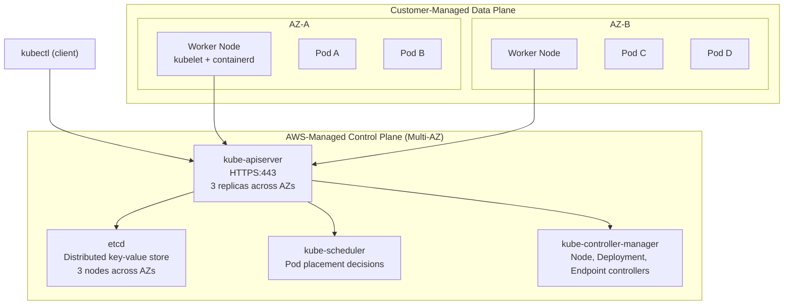
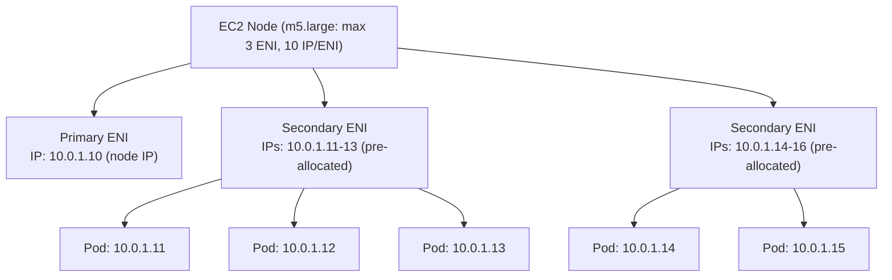

# AWS EKS — Deep Dive Interview Preparation

> **Scope:** Section 6 of 20 | Beginner → Expert | FAANG-level depth  
> **Coverage:** EKS Architecture, Networking, Security, Autoscaling, Troubleshooting, 80+ Q&A  
> **Note:** 250+ Q&A is split across inline questions and the structured Q&A section.

---

## Table of Contents

1. [EKS Architecture Overview](#1-eks-architecture-overview)
2. [Control Plane Internals](#2-control-plane-internals)
3. [Worker Nodes: Managed, Self-managed, Fargate](#3-worker-nodes)
4. [Container Runtime (containerd)](#4-container-runtime-containerd)
5. [Amazon VPC CNI & Pod Networking](#5-amazon-vpc-cni--pod-networking)
6. [Overlay Networking: Calico & Cilium](#6-overlay-networking-calico--cilium)
7. [Pod & Container Lifecycle](#7-pod--container-lifecycle)
8. [DNS Resolution with CoreDNS](#8-dns-resolution-with-coredns)
9. [Service Discovery & Ingress](#9-service-discovery--ingress)
10. [Autoscaling: HPA, VPA, CA, Karpenter](#10-autoscaling-hpa-vpa-ca-karpenter)
11. [EKS Security](#11-eks-security)
12. [Secrets Management](#12-secrets-management)
13. [Observability](#13-observability)
14. [EKS Upgrade Strategy](#14-eks-upgrade-strategy)
15. [Troubleshooting Deep Dive](#15-troubleshooting-deep-dive)
16. [Interview Questions & Answers (80+)](#16-interview-questions--answers-80)
17. [Production Best Practices](#17-production-best-practices)
18. [Documentation Links](#18-documentation-links)

---

## 1. EKS Architecture Overview

### Beginner Foundation

**Amazon EKS (Elastic Kubernetes Service)** is a managed Kubernetes service. AWS manages the Kubernetes control plane (API server, etcd, scheduler, controller manager) — you manage worker nodes (or use Fargate for serverless pods).

**Why EKS over self-managed Kubernetes:**
- AWS manages control plane HA (3 API server replicas across 3 AZs, etcd multi-AZ cluster).
- Automatic control plane upgrades.
- Native integration with AWS services (IAM, ALB, NLB, EBS, EFS, Secrets Manager, CloudWatch).
- You still control worker nodes, networking, and add-on components.

### Intermediate Mechanics



**Control plane communication to nodes:**
- Workers connect to the API server endpoint via HTTPS (not the other way around).
- The API server uses the managed VPC endpoint (private or public) to send commands (exec, logs, port-forward) to kubelets via the Kubernetes API.
- kubelet on each node polls the API server for Pod specs assigned to it.

**EKS cluster endpoint access modes:**
- **Public:** API server accessible from internet + authorized CIDRs. Workers use public endpoint.
- **Private:** API server accessible only from within the VPC via a private hosted zone + Interface Endpoint.
- **Public + Private (recommended for most):** Workers use private endpoint (free, avoids NAT). Developers access public endpoint (restricted by CIDR allowlist).

```hcl
resource "aws_eks_cluster" "main" {
  name     = "production"
  role_arn = aws_iam_role.cluster.arn
  version  = "1.31"

  vpc_config {
    subnet_ids              = concat(aws_subnet.private[*].id, aws_subnet.public[*].id)
    endpoint_private_access = true
    endpoint_public_access  = true
    public_access_cidrs     = ["YOUR_OFFICE_IP/32", "YOUR_CICD_IP/32"]
    security_group_ids      = [aws_security_group.cluster.id]
  }
}
```

---

## 2. Control Plane Internals

### kube-apiserver

The API server is the front door to the Kubernetes cluster. All state changes go through it. Properties:
- **Stateless:** All state is in etcd. Multiple replicas can serve requests simultaneously.
- **Admission controllers:** Plugins that intercept API requests before they're persisted (ValidatingAdmissionWebhook, MutatingAdmissionWebhook, PodSecurity, ResourceQuota).
- **Authentication → Authorization → Admission → Validation** pipeline for every API call.

**Authentication in EKS:**
- IAM authentication via `aws-iam-authenticator` (or the newer aws-eks-auth endpoint). The `kubectl` command calls `aws eks get-token` which generates a pre-signed STS URL. The API server validates this token with IAM.
- Service account tokens (OIDC JWTs) for pod-to-API-server communication.

**Authorization:** Kubernetes RBAC (ClusterRole, ClusterRoleBinding, Role, RoleBinding). IAM access entries or the `aws-auth` ConfigMap map IAM identities to Kubernetes RBAC groups.

### etcd

etcd is a distributed key-value store using the Raft consensus algorithm. AWS manages the etcd cluster for EKS — you don't have direct access to etcd.

**What's stored in etcd:** All Kubernetes API objects (Pods, Deployments, ConfigMaps, Secrets, ServiceAccounts, etc.). etcd is the single source of truth for cluster state.

**etcd performance concerns (for interviews):** etcd has a default storage limit of 2 GB (configurable, EKS can handle up to 8 GB). Large clusters with many secrets, ConfigMaps, or events can hit this limit. Symptom: API server returns 500 errors and the cluster becomes unresponsive.

**etcd encryption:** EKS encrypts etcd data at rest using AWS KMS (you can specify a CMK). This encrypts Kubernetes Secrets at the etcd level — in addition to any application-level encryption.

```bash
# Enable envelope encryption for Secrets in etcd
aws eks associate-encryption-config \
  --cluster-name production \
  --encryption-config '[{
    "resources": ["secrets"],
    "provider": {"keyArn": "arn:aws:kms:us-east-1:123456789012:key/key-id"}
  }]'
```

### kube-scheduler

The scheduler watches for unscheduled Pods (`.spec.nodeName` is empty) and assigns them to nodes based on:

1. **Filtering (Predicates):** Eliminate nodes that don't meet requirements:
   - `NodeSelector` / `nodeAffinity` — node labels must match.
   - `taints/tolerations` — node taints must be tolerated.
   - `PodFitsResources` — node must have enough CPU/memory requests available.
   - `VolumeZoneMatch` — EBS volumes must be in same AZ as scheduled node.
   - `PodTopologySpread` — enforce spread constraints.

2. **Scoring (Priorities):** Rank remaining nodes by:
   - `LeastRequestedPriority` — prefer nodes with more free resources.
   - `BalancedResourceAllocation` — balance CPU and memory usage.
   - `ImageLocalityPriority` — prefer nodes with the image already pulled.

**Common scheduling failure:** Pod stays in Pending because:
- No node has enough CPU/memory for the request (scale out the node group).
- No node tolerates the required taint (`kubectl describe pod` shows taint-related events).
- PodTopologySpread constraints can't be satisfied with current node count/distribution.
- EBS volume in AZ-A, scheduler can't find a node in AZ-A with capacity.

### kube-controller-manager

Runs multiple controllers in a single binary:
- **ReplicaSet controller:** Ensures desired Pod count matches actual.
- **Deployment controller:** Manages rollout strategy (rolling update, pause, resume).
- **Node controller:** Marks nodes as NotReady after `node-monitor-grace-period` (default 40 s) without heartbeat. After `pod-eviction-timeout` (default 5 min), evicts pods from NotReady nodes.
- **Endpoint/EndpointSlice controller:** Keeps Service endpoint lists up-to-date with ready pod IPs.
- **Job controller:** Manages batch job completion tracking.

---

## 3. Worker Nodes

### Managed Node Groups (MNG)

AWS manages the EC2 instances: launch, patch, update, and replacement. You specify the instance type, AMI version (Bottlerocket or Amazon Linux 2023), desired/min/max count.

**Managed node group lifecycle:**
1. You update the desired AMI version.
2. AWS cordons nodes one by one (marks unschedulable).
3. Drains pods (respects PodDisruptionBudgets).
4. Terminates the old node.
5. Launches a new node with the updated AMI.
6. New node joins the cluster and passes readiness checks.

**Bottlerocket vs. Amazon Linux 2023:**
- **Bottlerocket:** Security-first OS designed for containers. Minimal attack surface (no shell by default, API-controlled updates), faster boot, auto-reboot for kernel updates. Recommended for production.
- **Amazon Linux 2023:** General-purpose Linux with familiar tooling. Required if DaemonSet workloads need OS-level access.

```hcl
resource "aws_eks_node_group" "app" {
  cluster_name    = aws_eks_cluster.main.name
  node_group_name = "app-nodes"
  node_role_arn   = aws_iam_role.node.arn
  subnet_ids      = aws_subnet.private[*].id

  ami_type       = "BOTTLEROCKET_x86_64"
  instance_types = ["m7g.xlarge", "m6g.xlarge"]  # Graviton ARM64

  scaling_config {
    desired_size = 3
    min_size     = 1
    max_size     = 20
  }

  update_config {
    max_unavailable_percentage = 25  # Never take down more than 25% at once
  }

  labels = {
    role = "app-worker"
    env  = "production"
  }

  taint {
    key    = "app-only"
    value  = "true"
    effect = "NO_SCHEDULE"
  }
}
```

### Self-Managed Nodes

EC2 instances you provision yourself, installing and configuring kubelet manually (or via user-data + bootstrap scripts). Necessary when:
- You need custom OS configurations not possible with managed groups.
- You need Windows worker nodes (EKS Windows nodes).
- You need specialized hardware (custom GPU drivers, DPDK networking).

**Bootstrap script for self-managed:**
```bash
# In EC2 user-data
/etc/eks/bootstrap.sh production \
  --kubelet-extra-args '--node-labels=role=custom-worker,env=prod --max-pods=110'
```

### Fargate Profiles

EKS Fargate runs each pod in its own dedicated microVM. No node management, per-pod isolation, instant scale (no node launch time).

**Fargate profile — selects which pods run on Fargate:**
```hcl
resource "aws_eks_fargate_profile" "app" {
  cluster_name           = aws_eks_cluster.main.name
  fargate_profile_name   = "app-profile"
  pod_execution_role_arn = aws_iam_role.fargate.arn
  subnet_ids             = aws_subnet.private[*].id

  selector {
    namespace = "production"
    labels = {
      workload = "fargate-eligible"
    }
  }
}
```

Pods in namespace `production` with label `workload=fargate-eligible` run on Fargate. All others run on EC2 nodes.

---

## 4. Container Runtime (containerd)

Kubernetes uses CRI (Container Runtime Interface) to communicate with the container runtime. EKS uses **containerd** (since EKS 1.24 — Docker shim removed).

**containerd architecture:**
```
kubectl exec → kubelet → CRI → containerd → runc (OCI runtime) → Linux namespaces/cgroups
```

**containerd components:**
- **containerd daemon:** Manages the complete container lifecycle (image pull, container create/start/stop/delete).
- **runc:** OCI-compliant runtime that actually creates Linux namespaces and cgroups. containerd calls runc for container creation.
- **snapshotter:** Manages container filesystem layers (overlayfs on most Linux systems).

**Container isolation via Linux primitives:**
- **Namespaces:** PID, Network, Mount, UTS, IPC, User — each container has isolated views of these.
- **cgroups (Control Groups):** Enforce CPU, memory, I/O limits. Kubernetes resource requests/limits map directly to cgroup settings.
- **seccomp:** System call filtering profile. Kubernetes default seccomp profile restricts ~300 dangerous syscalls.
- **AppArmor/SELinux:** Optional Mandatory Access Control for additional isolation.

**containerd troubleshooting:**
```bash
# List containers on a node (SSH into node)
sudo ctr -n k8s.io containers ls

# Inspect containerd state
sudo crictl ps  # All containers on node
sudo crictl pods  # All pods on node
sudo crictl logs CONTAINER_ID  # Container logs

# Check image pull status
sudo crictl images
sudo crictl pull docker.io/library/nginx:latest
```

---

## 5. Amazon VPC CNI & Pod Networking

### How VPC CNI Works

**Amazon VPC CNI** (aws-node DaemonSet) gives each pod a real VPC IP address from the node's subnet. This enables native VPC routing — pods are first-class VPC citizens.

**IP allocation mechanism:**



**IP warm pool:** VPC CNI pre-allocates IPs before pods are scheduled (configurable via `WARM_IP_TARGET`, `MINIMUM_IP_TARGET`, `WARM_ENI_TARGET`). This reduces pod startup latency — no waiting for ENI attachment + IP assignment.

**Max pods per instance (critical for capacity planning):**
- Formula: `(max_ENIs × IPs_per_ENI) - max_ENIs`
- `m5.large`: (3 × 10) - 3 = 27 pods max (minus 2 for node infrastructure = 25 usable)
- `m5.xlarge`: (4 × 15) - 4 = 56 pods max

```bash
# Check current IP utilization on a node
kubectl get node ip-10-0-1-100.us-east-1.compute.internal -o yaml | \
  grep -A 5 "allocatable:"

# Check ENI usage
aws ec2 describe-network-interfaces \
  --filters Name=attachment.instance-id,Values=i-0abc123 \
  --query 'NetworkInterfaces[*].{ENI:NetworkInterfaceId,IPs:length(PrivateIpAddresses)}'
```

### IP Exhaustion and Solutions

**Symptom:** `0/N nodes are available: N Too many pods. Terminating`

**Solution 1 — Prefix Delegation (ENABLE_PREFIX_DELEGATION=true):**
Instead of assigning individual IPs to ENI slots, AWS assigns /28 CIDR prefixes (16 IPs per prefix). `m5.large` can support 110 pods (vs. 25 without).

```bash
# Enable prefix delegation on aws-node DaemonSet
kubectl set env daemonset aws-node -n kube-system \
  ENABLE_PREFIX_DELEGATION=true \
  WARM_PREFIX_TARGET=1

# Update node group max pods
# Add --max-pods=110 to kubelet-extra-args in Launch Template
```

**Solution 2 — Custom Networking (separate pod subnet):**
Assign pod IPs from a different subnet than the node IP. Useful when the primary subnet is full but you have spare capacity in other subnets.

```bash
kubectl set env daemonset aws-node -n kube-system \
  AWS_VPC_K8S_CNI_CUSTOM_NETWORK_CFG=true \
  ENI_CONFIG_LABEL_DEF=topology.kubernetes.io/zone
```

**Solution 3 — IPv6 cluster:** IPv6 addresses are effectively unlimited. Each pod gets a /128 IPv6. No address exhaustion. Requires IPv6-capable applications and services.

### Pod-to-Pod Networking

```
Pod A (10.0.1.11) on Node 1  →  Pod B (10.0.2.15) on Node 2

Path:
1. Pod A sends packet to 10.0.2.15 (default gateway: node's primary IP 10.0.1.10)
2. Node 1's routing table: 10.0.2.15 → via VPC network (VPC local route)
3. Packet traverses AWS VPC fabric to Node 2's NIC
4. Node 2 has route: 10.0.2.15 → veth pair → Pod B's network namespace
5. Pod B receives packet with real source IP 10.0.1.11
```

No encapsulation, no overlay — pure VPC routing. This is why VPC CNI enables native AWS security group and VPC Flow Log integration at the pod level.

---

## 6. Overlay Networking: Calico & Cilium

### Why Use Overlay Instead of VPC CNI

VPC CNI consumes real VPC IPs — at 110 pods per node × 100 nodes = 11,000 VPC IPs consumed. Large-scale clusters exhaust RFC 1918 address space.

**Calico (IPIP/VXLAN overlay):**
- Pods get IPs from a separate pod CIDR (e.g., `192.168.0.0/16`) not in the VPC.
- Pod traffic encapsulated in IPIP or VXLAN and tunneled over the VPC network.
- No VPC IP consumed per pod — unlimited pods.
- Network policies enforced by calico-node agent using iptables/eBPF.
- **Downside:** ~10% throughput overhead from encapsulation; VPC Flow Logs show tunnel IPs, not pod IPs.

**Cilium (eBPF-based):**
- Uses eBPF programs in the kernel for packet processing — bypasses iptables.
- Can work with VPC CNI IPs (no overlay) or with its own CIDR (overlay).
- **Hubble:** Built-in L7 network observability — see HTTP requests, DNS, gRPC flows between pods in real-time.
- **Cilium Network Policies:** Layer 7 policies (allow GET /api but deny POST /admin), FQDN-based policies (allow traffic to external-api.com).
- **Performance:** eBPF outperforms iptables-based kube-proxy significantly at scale (100k+ services).

**Cilium deployment for EKS:**
```bash
# Install Cilium using Helm (replace kube-proxy and use eBPF)
helm repo add cilium https://helm.cilium.io/
helm install cilium cilium/cilium \
  --namespace kube-system \
  --set eks.enabled=true \
  --set egressMasqueradeInterfaces=eth0 \
  --set tunnel=disabled \
  --set enableIPv4Masquerade=true \
  --set kubeProxyReplacement=true \
  --set k8sServiceHost=$(aws eks describe-cluster --name my-cluster --query 'cluster.endpoint' --output text | sed 's|https://||') \
  --set k8sServicePort=443
```

---

## 7. Pod & Container Lifecycle

### Pod Lifecycle

```
Pending → Running → Succeeded/Failed/Unknown

Pending sub-states:
├── PodScheduled: Waiting for scheduler to assign a node
├── Unschedulable: No node can satisfy requirements
└── ContainerCreating: Image pull, volume mount, sandbox creation

Running sub-states:
├── All containers passing readiness probe: Pod Ready
├── Container restarting: CrashLoopBackOff (exponential backoff up to 5 min)
└── OOMKilled: Container exceeded memory limit → killed, potentially restarted
```

**Phase transitions and what each means:**

| Phase | Meaning | Action |
|---|---|---|
| Pending | Waiting for scheduling or image pull | `kubectl describe pod` → see Events |
| Running | At least one container running | Monitor health via probes |
| Succeeded | All containers exited 0 (Job) | Normal completion |
| Failed | At least one container exited non-zero | Check logs |
| Unknown | Node unreachable, state unknown | Check node status |

### Container Probes

**Startup Probe:** Disables liveness/readiness checks until the container passes. For slow-starting apps (Java, .NET) — prevents liveness probe from killing containers during boot.

**Liveness Probe:** If fails, kubelet kills the container and restarts it (subject to `restartPolicy`).

**Readiness Probe:** If fails, removes the pod's IP from the Service Endpoints — pod doesn't receive traffic but is NOT restarted.

```yaml
spec:
  containers:
  - name: api
    image: my-api:v1
    resources:
      requests:
        cpu: "250m"
        memory: "512Mi"
      limits:
        cpu: "1000m"
        memory: "1Gi"
    startupProbe:
      httpGet:
        path: /health
        port: 8080
      failureThreshold: 30    # 30 × 10s = 5 min max startup
      periodSeconds: 10
    livenessProbe:
      httpGet:
        path: /health
        port: 8080
      initialDelaySeconds: 10
      periodSeconds: 15
      failureThreshold: 3     # Kill container after 3 consecutive failures
    readinessProbe:
      httpGet:
        path: /ready
        port: 8080
      periodSeconds: 5
      failureThreshold: 2     # Remove from endpoints after 2 failures
```

**Graceful shutdown:**

When a pod is deleted:
1. Pod gets `Terminating` status.
2. Endpoint controller removes pod's IP from Service Endpoints.
3. `SIGTERM` is sent to containers.
4. Container has `terminationGracePeriodSeconds` (default 30 s) to shut down cleanly.
5. After grace period, `SIGKILL` is sent.

**Race condition:** Steps 2 and 3 happen concurrently, not sequentially. Some requests may still arrive during the shutdown window (load balancer hasn't updated endpoints yet). Add a `preStop` sleep hook:

```yaml
lifecycle:
  preStop:
    exec:
      command: ["sleep", "5"]  # Wait 5s for load balancer to drain
```

**Resource requests vs. limits:**

| Setting | Effect on scheduling | Effect on runtime |
|---|---|---|
| CPU request | Node must have this much free CPU to schedule pod | Kubernetes guarantees this share; can burst to limit |
| CPU limit | No scheduling effect | Hard cap — container throttled (not killed) |
| Memory request | Node must have this much free memory | Guaranteed by kernel |
| Memory limit | No scheduling effect | Exceeded limit → OOMKill (SIGKILL) |

**OOMKill:** When a container exceeds its memory limit, the Linux OOM killer kills the container process. Kubernetes restarts it (if `restartPolicy: Always`). OOMKill appears in `kubectl describe pod` events and `kubectl get events --field-selector reason=OOMKilling`. It does NOT appear in container logs (process is killed without notice).

---

## 8. DNS Resolution with CoreDNS

### How CoreDNS Works

**CoreDNS** is the default DNS server for Kubernetes clusters. It runs as a Deployment (2 replicas by default) in the `kube-system` namespace and is the cluster DNS resolver at IP `10.96.0.10` (or the 10th IP in the cluster service CIDR).

**DNS resolution flow for a pod:**

```
Pod does: curl http://my-service.my-namespace.svc.cluster.local

1. Pod's /etc/resolv.conf:
   nameserver 10.96.0.10        (CoreDNS ClusterIP)
   search my-namespace.svc.cluster.local svc.cluster.local cluster.local

2. Pod queries 10.96.0.10 for "my-service"
3. CoreDNS's ndots:5 rule: tries FQDN first, then appends search domains
4. CoreDNS looks up my-service.my-namespace.svc.cluster.local in etcd
5. Returns ClusterIP of my-service
6. Pod connects to ClusterIP → kube-proxy (iptables/ipvs) routes to a Pod IP
```

**CoreDNS configuration (Corefile):**
```
.:53 {
    errors
    health { lameduck 5s }
    ready
    kubernetes cluster.local in-addr.arpa ip6.arpa {
        pods insecure
        fallthrough in-addr.arpa ip6.arpa
        ttl 30
    }
    prometheus :9153
    forward . /etc/resolv.conf {    # Forward non-cluster DNS to node's resolver
        max_concurrent 1000
    }
    cache 30                        # Cache TTL 30s
    loop
    reload
    loadbalance
}
```

**DNS debugging:**
```bash
# Check CoreDNS pod health
kubectl get pods -n kube-system -l k8s-app=kube-dns
kubectl logs -n kube-system -l k8s-app=kube-dns

# Test DNS from within a pod
kubectl run dns-test --image=busybox:1.36 --rm -it -- \
  sh -c "nslookup my-service.my-namespace.svc.cluster.local"

# Check DNS resolution timing
kubectl exec -it my-pod -- time nslookup my-service 2>&1

# DNS throttling: 5/second default per pod — can cause ndots latency
# Add ndots:1 to pod's dnsConfig for external domains
```

**CoreDNS scaling:**
```yaml
apiVersion: apps/v1
kind: Deployment
metadata:
  name: coredns
  namespace: kube-system
spec:
  replicas: 4  # Scale up for large clusters
```

**Common DNS issues:**
- `NXDOMAIN` for valid service: Check if service exists, correct namespace.
- Slow DNS: Check CoreDNS metrics (`coredns_dns_request_duration_seconds`), ndots configuration causing unnecessary search domain queries.
- DNS timeouts under load: CoreDNS pod CPU throttled — increase resource limits or replicas.
- `SERVFAIL`: CoreDNS upstream resolution failing — check node's `/etc/resolv.conf`.

---

## 9. Service Discovery & Ingress

### Kubernetes Services

| Service Type | Use case | AWS implementation |
|---|---|---|
| ClusterIP | Internal cluster communication only | Virtual IP via kube-proxy/iptables |
| NodePort | External access via node IP:port (rarely used in EKS) | Open port on each node's IP |
| LoadBalancer | External access with managed load balancer | Creates AWS NLB or CLB |
| ExternalName | Alias for external DNS name | DNS CNAME, no proxy |

**LoadBalancer Service with NLB (AWS Load Balancer Controller):**
```yaml
apiVersion: v1
kind: Service
metadata:
  name: my-api
  annotations:
    service.beta.kubernetes.io/aws-load-balancer-type: "external"
    service.beta.kubernetes.io/aws-load-balancer-nlb-target-type: "ip"
    service.beta.kubernetes.io/aws-load-balancer-scheme: "internet-facing"
    service.beta.kubernetes.io/aws-load-balancer-cross-zone-load-balancing-enabled: "true"
spec:
  type: LoadBalancer
  ports:
  - port: 443
    targetPort: 8443
    protocol: TCP
  selector:
    app: my-api
```

### ALB Ingress (AWS Load Balancer Controller)

The AWS Load Balancer Controller (LBC) watches for `Ingress` resources and creates ALBs or target groups:

```yaml
apiVersion: networking.k8s.io/v1
kind: Ingress
metadata:
  name: api-ingress
  annotations:
    kubernetes.io/ingress.class: alb
    alb.ingress.kubernetes.io/scheme: internet-facing
    alb.ingress.kubernetes.io/target-type: ip  # Direct pod IP routing (no kube-proxy)
    alb.ingress.kubernetes.io/certificate-arn: arn:aws:acm:us-east-1:123:certificate/abc
    alb.ingress.kubernetes.io/ssl-redirect: "443"
    alb.ingress.kubernetes.io/wafv2-acl-arn: arn:aws:wafv2:...
    alb.ingress.kubernetes.io/group.name: production-alb  # Share one ALB across multiple Ingresses
spec:
  rules:
  - host: api.example.com
    http:
      paths:
      - path: /v1
        pathType: Prefix
        backend:
          service:
            name: api-v1
            port:
              number: 8080
      - path: /v2
        pathType: Prefix
        backend:
          service:
            name: api-v2
            port:
              number: 8080
```

**IngressGroup:** Multiple Ingress resources sharing one ALB (cost optimization — avoid creating an ALB per service). `alb.ingress.kubernetes.io/group.name: shared-alb` groups them.

**TargetType: ip vs. instance:**
- `ip`: ALB routes directly to pod IP addresses. Supports readiness probe-based health checks at pod level. No kube-proxy hop. Required for Fargate.
- `instance`: ALB routes to node:nodePort. kube-proxy handles pod routing. Simpler but adds a hop.

---

## 10. Autoscaling: HPA, VPA, CA, Karpenter

### Horizontal Pod Autoscaler (HPA)

HPA scales pod replicas based on observed metrics (CPU, memory, custom metrics from Prometheus via KEDA, SQS queue depth).

**HPA flow:**
1. Metrics server (or Prometheus adapter) scrapes pod metrics every 15 s.
2. HPA controller polls metrics every `--horizontal-pod-autoscaler-sync-period` (default 15 s).
3. HPA calculates desired replicas: `desiredReplicas = ceil(currentReplicas × (currentMetric / targetMetric))`
4. HPA respects `--horizontal-pod-autoscaler-downscale-stabilization` (default 5 min) — won't scale in faster than this.

```yaml
apiVersion: autoscaling/v2
kind: HorizontalPodAutoscaler
metadata:
  name: api-hpa
spec:
  scaleTargetRef:
    apiVersion: apps/v1
    kind: Deployment
    name: api
  minReplicas: 3
  maxReplicas: 50
  metrics:
  - type: Resource
    resource:
      name: cpu
      target:
        type: Utilization
        averageUtilization: 60
  - type: Resource
    resource:
      name: memory
      target:
        type: AverageValue
        averageValue: "800Mi"
  behavior:
    scaleDown:
      stabilizationWindowSeconds: 300  # Wait 5 min before scaling down
      policies:
      - type: Percent
        value: 10
        periodSeconds: 60  # Remove at most 10% per minute
    scaleUp:
      policies:
      - type: Percent
        value: 100
        periodSeconds: 60  # Can double replicas per minute
```

### Vertical Pod Autoscaler (VPA)

VPA adjusts CPU and memory **requests** (not limits) based on observed usage. It cannot resize containers in-place on Kubernetes < 1.27 — it must restart pods. Three modes:
- `Off`: Only provides recommendations, doesn't apply.
- `Initial`: Only sets requests at pod creation.
- `Auto`: Evicts and recreates pods with updated requests (disruptive).

```yaml
apiVersion: autoscaling.k8s.io/v1
kind: VerticalPodAutoscaler
metadata:
  name: api-vpa
spec:
  targetRef:
    apiVersion: apps/v1
    kind: Deployment
    name: api
  updatePolicy:
    updateMode: "Auto"
  resourcePolicy:
    containerPolicies:
    - containerName: api
      minAllowed:
        cpu: 100m
        memory: 128Mi
      maxAllowed:
        cpu: 4
        memory: 8Gi
```

**VPA + HPA conflict:** Don't use VPA (Auto mode) and HPA (CPU/memory metric) together on the same deployment — they fight each other. Use:
- HPA for horizontal scaling (replicas) based on CPU/memory.
- VPA in `Off` mode for right-sizing recommendations.
- Or: HPA with custom metrics (SQS depth, request rate) + VPA for right-sizing.

### Cluster Autoscaler (CA)

CA scales EC2 nodes when pods are Unschedulable (no capacity) or when nodes are underutilized (scale-in).

**Scale-out trigger:** Pod in `Pending` state due to `Insufficient CPU/Memory`. CA identifies the cheapest node group that can accommodate the pod and requests a new node.

**Scale-in trigger:** Node utilization < 50% for `scale-down-unneeded-time` (default 10 min). CA checks if all pods on the node can be rescheduled elsewhere before draining.

**Configuration:**
```yaml
# Values for cluster-autoscaler Helm chart
autoDiscovery:
  clusterName: production
awsRegion: us-east-1
extraArgs:
  scale-down-utilization-threshold: 0.5
  scale-down-delay-after-add: 10m
  skip-nodes-with-local-storage: false
  expander: priority  # Node group selection strategy
```

**CA limitations:**
- Scale-out latency: 2–5 minutes (node launch + bootstrap + pod scheduling).
- Cannot anticipate load (purely reactive).
- Complex with multiple node groups and mixed instances.

### Karpenter

**Karpenter** is a node provisioner that directly calls EC2 APIs to launch optimally sized nodes for pending pods, bypassing Auto Scaling Groups.

**Key advantages over Cluster Autoscaler:**
- Launches nodes in < 60 seconds (directly calls RunInstances, no ASG delay).
- Chooses the optimal instance type for the pending pod's requirements.
- Consolidates workloads (bin packing) by identifying underutilized nodes and migrating pods.
- Supports Spot natively with automatic interruption handling.
- No pre-defined node groups — dynamically selects any instance type.

```yaml
apiVersion: karpenter.sh/v1
kind: NodePool
metadata:
  name: default
spec:
  template:
    metadata:
      labels:
        intent: apps
    spec:
      nodeClassRef:
        name: default
      requirements:
        - key: karpenter.sh/capacity-type
          operator: In
          values: ["spot", "on-demand"]
        - key: node.kubernetes.io/instance-type
          operator: In
          values: ["m5.large", "m5.xlarge", "m6i.large", "m6i.xlarge", "m7i.large"]
        - key: kubernetes.io/arch
          operator: In
          values: ["amd64", "arm64"]
      expireAfter: 720h  # Replace nodes older than 30 days
  disruption:
    consolidationPolicy: WhenUnderutilized
    consolidateAfter: 1m
    budgets:
    - nodes: "20%"   # Never disrupt more than 20% simultaneously

---
apiVersion: karpenter.k8s.aws/v1
kind: EC2NodeClass
metadata:
  name: default
spec:
  amiFamily: Bottlerocket
  role: KarpenterNodeRole-production
  subnetSelectorTerms:
    - tags:
        karpenter.sh/discovery: production
  securityGroupSelectorTerms:
    - tags:
        karpenter.sh/discovery: production
  blockDeviceMappings:
    - deviceName: /dev/xvda
      ebs:
        volumeSize: 50Gi
        volumeType: gp3
        encrypted: true
```

---

## 11. EKS Security

### IAM for EKS — aws-auth vs. Access Entries

**aws-auth ConfigMap (legacy):**
Maps IAM ARNs to Kubernetes users/groups:
```yaml
apiVersion: v1
kind: ConfigMap
metadata:
  name: aws-auth
  namespace: kube-system
data:
  mapRoles: |
    - rolearn: arn:aws:iam::123456789012:role/NodeInstanceRole
      username: system:node:{{EC2PrivateDNSName}}
      groups:
        - system:bootstrappers
        - system:nodes
    - rolearn: arn:aws:iam::123456789012:role/PlatformEngineerRole
      username: platform-engineer
      groups:
        - platform-admins
  mapUsers: |
    - userarn: arn:aws:iam::123456789012:user/alice
      username: alice
      groups:
        - system:masters
```

**EKS Access Entries (newer, preferred):**
API-managed IAM-to-Kubernetes mapping — no ConfigMap editing:
```bash
# Create access entry for a team
aws eks create-access-entry \
  --cluster-name production \
  --principal-arn arn:aws:iam::123456789012:role/PlatformEngineerRole \
  --kubernetes-groups platform-admins

# Associate a pre-built policy
aws eks associate-access-policy \
  --cluster-name production \
  --principal-arn arn:aws:iam::123456789012:role/ReadOnlyRole \
  --policy-arn arn:aws:eks::aws:cluster-access-policy/AmazonEKSViewPolicy \
  --access-scope '{"type": "namespace", "namespaces": ["production"]}'
```

### Kubernetes RBAC

```yaml
# Role: namespace-scoped permissions
apiVersion: rbac.authorization.k8s.io/v1
kind: Role
metadata:
  name: developer
  namespace: production
rules:
- apiGroups: ["apps"]
  resources: ["deployments"]
  verbs: ["get", "list", "watch", "patch"]
- apiGroups: [""]
  resources: ["pods", "pods/log"]
  verbs: ["get", "list", "watch"]

---
# RoleBinding: bind the Role to a group
apiVersion: rbac.authorization.k8s.io/v1
kind: RoleBinding
metadata:
  name: developer-binding
  namespace: production
subjects:
- kind: Group
  name: platform-admins  # Must match what's in aws-auth or access entry
  apiGroup: rbac.authorization.k8s.io
roleRef:
  kind: Role
  name: developer
  apiGroup: rbac.authorization.k8s.io
```

### Network Policies

By default, all pods in a cluster can communicate with each other. Network Policies (enforced by CNI — VPC CNI with Calico, or Cilium) restrict this.

```yaml
# Deny all ingress to pods in production namespace by default
apiVersion: networking.k8s.io/v1
kind: NetworkPolicy
metadata:
  name: default-deny
  namespace: production
spec:
  podSelector: {}  # Applies to all pods in namespace
  policyTypes:
  - Ingress

---
# Allow only frontend pods to reach backend on port 8080
apiVersion: networking.k8s.io/v1
kind: NetworkPolicy
metadata:
  name: allow-frontend-to-backend
  namespace: production
spec:
  podSelector:
    matchLabels:
      app: backend
  policyTypes:
  - Ingress
  ingress:
  - from:
    - podSelector:
        matchLabels:
          app: frontend
    ports:
    - protocol: TCP
      port: 8080
```

**Cilium L7 Network Policy (HTTP-aware):**
```yaml
apiVersion: cilium.io/v2
kind: CiliumNetworkPolicy
metadata:
  name: allow-api-get-only
spec:
  endpointSelector:
    matchLabels:
      app: backend
  ingress:
  - fromEndpoints:
    - matchLabels:
        app: frontend
    toPorts:
    - ports:
      - port: "8080"
      rules:
        http:
        - method: "GET"
          path: "/api/.*"
```

---

## 12. Secrets Management

### Kubernetes Secrets (insecure by default)

Kubernetes Secrets store sensitive data but are base64-encoded (not encrypted) by default in etcd. Anyone with `kubectl get secret` access can decode them. Enable etcd encryption at rest (EKS: `associate-encryption-config` with KMS).

### External Secrets Operator (ESO)

ESO synchronizes secrets from external stores (AWS Secrets Manager, Parameter Store) into Kubernetes Secrets.

```yaml
# ExternalSecret: defines what to sync from Secrets Manager
apiVersion: external-secrets.io/v1beta1
kind: ExternalSecret
metadata:
  name: db-credentials
  namespace: production
spec:
  refreshInterval: 1h
  secretStoreRef:
    name: aws-secrets-manager
    kind: ClusterSecretStore
  target:
    name: db-secret
    creationPolicy: Owner
  data:
  - secretKey: password
    remoteRef:
      key: production/db/credentials
      property: password
  - secretKey: username
    remoteRef:
      key: production/db/credentials
      property: username
```

**ClusterSecretStore (uses IRSA):**
```yaml
apiVersion: external-secrets.io/v1beta1
kind: ClusterSecretStore
metadata:
  name: aws-secrets-manager
spec:
  provider:
    aws:
      service: SecretsManager
      region: us-east-1
      auth:
        jwt:
          serviceAccountRef:
            name: external-secrets-sa
            namespace: external-secrets
```

### Secrets Store CSI Driver

Mounts secrets from Secrets Manager or Parameter Store directly as files in pod volumes (not Kubernetes Secrets). More secure — secrets never stored in Kubernetes API server or etcd.

```yaml
spec:
  volumes:
  - name: secrets
    csi:
      driver: secrets-store.csi.k8s.io
      readOnly: true
      volumeAttributes:
        secretProviderClass: aws-secrets
  containers:
  - name: app
    volumeMounts:
    - name: secrets
      mountPath: "/mnt/secrets"
      readOnly: true
```

---

## 13. Observability

### CloudWatch Container Insights

Collects metrics (CPU, memory, network, disk, pod count) and logs from EKS clusters via the CloudWatch agent (DaemonSet):

```bash
# Install CloudWatch agent with Container Insights
ClusterName=production
RegionName=us-east-1
FluentBitHttpPort='2020'
FluentBitReadFromHead='Off'

curl https://raw.githubusercontent.com/aws-samples/amazon-cloudwatch-container-insights/latest/k8s-deployment-manifest-templates/deployment-mode/daemonset/container-insights-monitoring/quickstart/cwagent-fluent-bit-quickstart.yaml | \
  sed "s/{{cluster_name}}/${ClusterName}/;s/{{region_name}}/${RegionName}/;s/{{http_server_toggle}}/On/;s/{{http_server_port}}/${FluentBitHttpPort}/;s/{{read_from_head}}/${FluentBitReadFromHead}/" | \
  kubectl apply -f -
```

### Prometheus + Grafana on EKS

```bash
# Deploy kube-prometheus-stack
helm repo add prometheus-community https://prometheus-community.github.io/helm-charts
helm upgrade --install kube-prom-stack prometheus-community/kube-prometheus-stack \
  --namespace monitoring --create-namespace \
  --set alertmanager.enabled=true \
  --set grafana.enabled=true \
  --set prometheus.prometheusSpec.retention=7d \
  --set prometheus.prometheusSpec.storageSpec.volumeClaimTemplate.spec.storageClassName=gp3 \
  --set prometheus.prometheusSpec.storageSpec.volumeClaimTemplate.spec.resources.requests.storage=50Gi
```

**Key EKS metrics to monitor:**
```promql
# Pod restart rate by namespace
sum(rate(kube_pod_container_status_restarts_total[5m])) by (namespace) > 0

# Node CPU saturation
1 - avg(rate(node_cpu_seconds_total{mode="idle"}[5m])) by (node)

# Available pod capacity per node
kube_node_status_allocatable{resource="pods"} - kube_pod_info * on(node) group_left()

# OOMKill rate
increase(container_oom_events_total[5m]) > 0
```

### Hubble (Cilium Network Observability)

```bash
# Observe all HTTP traffic in production namespace
hubble observe --namespace production --protocol http

# L7 flow data
hubble observe --pod my-pod -f --type l7

# DNS query log
hubble observe --type l7 --protocol dns
```

---

## 14. EKS Upgrade Strategy

### Control Plane Upgrade

```bash
# Step 1: Check current and available versions
aws eks describe-cluster --name production --query 'cluster.version'
aws eks describe-addon-versions --kubernetes-version 1.31

# Step 2: Upgrade control plane (in-place, managed by AWS)
aws eks update-cluster-version \
  --name production \
  --kubernetes-version 1.31
```

**Control plane upgrade:** AWS performs in-place upgrade. API server replicas are upgraded one at a time, maintaining availability. Takes 20–45 minutes.

### Node Group Upgrade

```bash
# Step 3: Update managed node group to use new AMI version
aws eks update-nodegroup-version \
  --cluster-name production \
  --nodegroup-name app-nodes \
  --release-version 1.31.0-20241001

# Configure rolling update behavior
aws eks update-nodegroup-config \
  --cluster-name production \
  --nodegroup-name app-nodes \
  --update-config maxUnavailable=1
```

### Upgrade Order

1. Control plane first (Kubernetes supports n-2 kubelet version skew).
2. Core add-ons (CoreDNS, kube-proxy, VPC CNI) — must match control plane version.
3. Node groups (managed) — via `update-nodegroup-version`.
4. Self-managed nodes — manual: launch new nodes, drain old ones.
5. Application add-ons (Cluster Autoscaler, LBC, External Secrets) — verify compatibility.

**PodDisruptionBudgets during upgrade:**
```yaml
apiVersion: policy/v1
kind: PodDisruptionBudget
metadata:
  name: api-pdb
spec:
  maxUnavailable: 1  # Never take more than 1 pod offline during disruption
  selector:
    matchLabels:
      app: api
```

---

## 15. Troubleshooting Deep Dive

### Pending Pods

**Symptom:** Pod stays in Pending state.

```bash
# Step 1: Get pod events (most informative)
kubectl describe pod <pod-name> -n <namespace>
# Look at Events section:
# "0/3 nodes are available: 3 Insufficient memory" → need more memory capacity
# "0/3 nodes are available: 3 node(s) had taint..." → taint/toleration mismatch
# "0/3 nodes are available: 3 pod has unbound PersistentVolumeClaims" → PVC issue

# Step 2: Check available resources across nodes
kubectl top nodes
kubectl get nodes -o json | jq '.items[] | {name: .metadata.name, allocatable: .status.allocatable}'

# Step 3: Check if the specific node group is at max
aws eks describe-nodegroup --cluster-name prod --nodegroup-name app-nodes \
  --query 'nodegroup.scalingConfig'

# Step 4: Check CA logs if using Cluster Autoscaler
kubectl logs -n kube-system -l app.kubernetes.io/name=aws-cluster-autoscaler --tail=100

# Step 5: Check for pod topology spread constraint violations
kubectl get events --field-selector reason=FailedScheduling -A
```

**Decision tree:**

```
Pending Pod
├── "Insufficient CPU/memory" → Not enough node capacity
│   ├── Cluster Autoscaler: check max_size, check node group limits, check CA logs
│   └── Manual: scale up node group desired_size
├── "Taint" → Pod missing toleration for node taint
│   └── Add toleration to pod spec
├── "PodTopologySpread" → Too few nodes to satisfy spread constraint
│   └── Reduce maxSkew or add more nodes
├── "Unbound PVC" → PVC pending
│   └── Check storageClass, check PVC events
└── "ImagePullBackOff" → Image pull failure (not actually Pending but related)
    └── Check ECR permissions, image name/tag, VPC endpoint for ECR
```

### CrashLoopBackOff

**Symptom:** Pod repeatedly crashes and restarts with exponential backoff (10s, 20s, 40s, 80s, ... up to 5 minutes).

```bash
# Get current and previous container logs
kubectl logs <pod-name> -n <namespace>           # Current container logs
kubectl logs <pod-name> -n <namespace> --previous # Previous container logs (after crash)

# Check exit code
kubectl describe pod <pod-name> | grep -A 5 "Last State:"
# Exit code 1: Application error
# Exit code 137: OOMKilled (killed by kernel)
# Exit code 139: Segmentation fault
# Exit code 143: SIGTERM (graceful termination)
# Exit code 1 from entrypoint: Application startup failure

# For OOMKilled: check memory usage
kubectl top pod <pod-name> -n <namespace>

# Force-get logs even during backoff
kubectl exec -it <pod-name> -- /bin/sh  # If container starts briefly
```

**Common causes:**
1. **OOMKill:** Memory limit too low. Check `kubectl describe pod` for `OOMKilled: true`. Increase memory limit or profile memory usage.
2. **Startup failure:** Application crashes on startup (bad config, missing env var, DB connection failure). Check logs.
3. **Liveness probe failure:** Probe is too aggressive (short timeout, low failure threshold). App isn't ready when probe starts.
4. **Missing config/secret:** EnvVar referencing non-existent ConfigMap or Secret.

### Node Not Ready

```bash
# Step 1: Check node status and conditions
kubectl describe node <node-name>
# Look for conditions: MemoryPressure, DiskPressure, PIDPressure, Ready=False

# Step 2: Check kubelet logs on the node (requires SSH or SSM)
sudo journalctl -u kubelet -f
sudo journalctl -u containerd -f

# Step 3: Check node resource pressure
sudo df -h           # Disk pressure
free -m              # Memory pressure
sudo cat /proc/sys/kernel/pid_max vs $(sudo ls /proc | wc -l)  # PID pressure

# Step 4: Check VPC CNI
kubectl logs -n kube-system -l app.kubernetes.io/name=aws-node

# Step 5: Check if node can reach API server
curl -k https://<api-server-endpoint>:443/healthz
```

**Common causes:**
- **DiskPressure:** Node filesystem full from container logs, Docker images, or local volumes. Fix: `docker system prune` or `crictl rmi --prune`.
- **MemoryPressure:** Node running out of memory. Kubernetes evicts pods in order of Priority → resource usage. Fix: add more nodes or reduce memory requests.
- **Kubelet can't reach API server:** VPC endpoint missing, security group blocking port 443 to API server, node IAM role missing permissions.
- **CNI failure:** aws-node DaemonSet crashed or failing. Pods can't get IPs.

### DNS Failures

```bash
# Test DNS from within a pod
kubectl run dns-debug --image=busybox:1.36 --rm -it --restart=Never -- nslookup kubernetes

# Check CoreDNS pod status
kubectl get pods -n kube-system -l k8s-app=kube-dns
kubectl logs -n kube-system -l k8s-app=kube-dns

# Check CoreDNS endpoints
kubectl get endpoints -n kube-system kube-dns

# Check CoreDNS ConfigMap
kubectl get cm coredns -n kube-system -o yaml

# Check if CoreDNS can reach upstream DNS (node's resolver)
kubectl exec -n kube-system coredns-xxx -- nslookup google.com 8.8.8.8
```

### Image Pull Errors (ECR)

```bash
# Symptom: ImagePullBackOff, ErrImagePull
kubectl describe pod <pod-name> | grep -A 3 "Warning  Failed"
# "Failed to pull image: pull access denied" → auth issue
# "Failed to pull image: no such host" → DNS/network issue

# Check node IAM role has ECR permissions
aws iam simulate-principal-policy \
  --policy-source-arn arn:aws:iam::123456789012:role/NodeInstanceRole \
  --action-names ecr:GetAuthorizationToken ecr:BatchCheckLayerAvailability \
  --resource-arns '*'

# Check ECR VPC endpoint (for private clusters)
aws ec2 describe-vpc-endpoints \
  --filters Name=service-name,Values=com.amazonaws.us-east-1.ecr.api \
            Name=vpc-id,Values=vpc-0abc123

# Manually pull image on node to test
sudo crictl pull 123456789012.dkr.ecr.us-east-1.amazonaws.com/my-image:latest
```

---

## 16. Interview Questions & Answers (80+)

---

### Question 1: How does EKS differ from self-managed Kubernetes on EC2? What does AWS manage and what do you manage?

**What the interviewer is testing:** Understanding the managed service value proposition and shared responsibility in EKS.

**Strong answer:**

EKS is a managed Kubernetes service where AWS operates the control plane. The distinction follows Kubernetes's own architecture:

**AWS manages:**
- kube-apiserver: AWS runs 3 replicas across 3 AZs, handles HTTPS termination, API authentication integration with IAM.
- etcd: Multi-node cluster across 3 AZs, automatic backups, encryption at rest, storage management.
- kube-scheduler and kube-controller-manager: Deployed in the AWS-managed VPC, not accessible to customers.
- Control plane availability: 99.95% SLA. AWS automatically replaces failed control plane components.
- Kubernetes version upgrades for the control plane (you initiate; AWS executes).
- OS-level patching for the control plane nodes (you never SSH into control plane).

**Customer manages:**
- Worker nodes: EC2 instances running kubelet and containerd (or Fargate profile configuration).
- Container runtime (containerd) on worker nodes.
- Kubernetes add-ons: CoreDNS, kube-proxy, VPC CNI, AWS Load Balancer Controller, Cluster Autoscaler/Karpenter.
- RBAC configuration (ClusterRoles, RoleBindings, aws-auth/Access Entries).
- Namespaces, Deployments, Services, Ingresses, PVCs.
- Node group patching (AMI version updates for managed node groups — you trigger; AWS executes the rolling update).
- Network policies, pod security standards.
- Secrets management (Kubernetes Secrets encryption, External Secrets Operator).

**Key nuance for managed node groups:**
With managed node groups, AWS automates the EC2 lifecycle (drain, terminate, replace) but the *trigger* for node group updates is customer-initiated. AWS manages the AMI release cycle (Bottlerocket/AL2023 with matched kubelet version), but you must initiate the update.

**Self-managed vs. EKS trade-offs:**

| Dimension | EKS | Self-managed |
|---|---|---|
| Control plane HA | Automatic (AWS) | You build (etcd HA, API server HA) |
| Control plane cost | $0.10/hr per cluster | EC2 cost for 3+ control plane nodes |
| Flexibility | Limited (no etcd access, fixed control plane config) | Full control (custom admission controllers, audit log config) |
| Upgrade | AWS executes (you initiate) | You execute (complex, risky) |
| AWS integration | Native (IAM, ALB, EBS, EFS) | Requires more custom setup |
| Support | AWS Support covers control plane | You troubleshoot everything |

**Likely follow-ups:**
1. *Can you access etcd directly in EKS?* — No. AWS manages etcd and does not expose direct access. This is intentional — direct etcd access bypasses Kubernetes API admission/authorization. You interact with cluster state via kubectl and the Kubernetes API only.
2. *What does the EKS $0.10/hr fee cover?* — The cost of running the managed control plane (3 API server replicas, 3 etcd nodes, all in AWS-managed infrastructure across 3 AZs). EC2 worker node costs are separate.

---

### Question 2: Explain how a pod gets an IP address in EKS with VPC CNI.

**What the interviewer is testing:** Deep networking internals, understanding of the connection between Kubernetes and AWS networking.

**Strong answer:**

VPC CNI (implemented as the `aws-node` DaemonSet on each worker node) is responsible for assigning real VPC IP addresses to pods. Here's the complete flow:

**1. aws-node initialization on node startup:**
When a node joins the cluster, aws-node:
- Calls EC2 API to attach secondary ENIs to the node (up to the instance type's ENI limit).
- Calls EC2 API to assign secondary private IPs to each ENI (up to instance type's per-ENI IP limit).
- Builds a local IP pool of available pod IPs.
- Programs Linux routing tables: each pod IP is routed to the `eth0` interface on the node.

**2. Pod scheduling:**
- Scheduler places the pod on a node with sufficient resources and available IP slots.

**3. kubelet calls CNI:**
- kubelet calls the VPC CNI plugin (`/etc/cni/net.d/10-aws.conflist`) with an `ADD` command.
- CNI plugin selects an available IP from the warm pool.

**4. Network namespace setup:**
- CNI creates a network namespace for the pod.
- Creates a veth pair: one end (`eth0`) in the pod's network namespace, one end (`eni-xxx`) in the host namespace.
- Assigns the selected VPC IP to `eth0` in the pod's namespace.
- Sets default gateway in the pod to the node's primary ENI IP (acts as the VPC router).

**5. Routing:**
- Host routing table: traffic to the pod IP → via the veth pair in the host namespace.
- VPC routing table: traffic to the pod IP → via the node's ENI (the EC2 VPC routing handles this automatically because the IP is associated with the node's ENI).

**6. Pod-to-pod communication (same node):**
Traffic goes: Pod A veth → host veth → policy routing → Pod B veth → Pod B. No encapsulation.

**7. Pod-to-pod communication (different nodes):**
Traffic goes: Pod A → node A routing → VPC fabric → node B ENI → host veth → Pod B. The VPC handles routing because both pod IPs are real VPC IPs registered to their respective node ENIs.

**Why this is better than overlay networking:**
- Native VPC performance (no encapsulation overhead).
- Pod IPs visible in VPC Flow Logs.
- Security groups can be applied directly at the pod ENI level (security groups for pods feature).
- No tunneling = easier troubleshooting (tcpdump shows real pod IPs).

**The limitation:**
Each EC2 instance can only hold N ENIs with M IPs each. `m5.large`: 3 ENIs × 10 IPs = 30 total IPs, minus 3 node IPs = 27 pod IPs max (effectively ~25 after kubernetes overhead). This is the IP exhaustion problem that prefix delegation, custom networking, or IPv6 solves.

**Likely follow-ups:**
1. *What happens when all IPs on a node are used?* — The pod stays in Pending state with event: `Insufficient pods` or `Insufficient node IP`. Cluster Autoscaler or Karpenter launches a new node. Pod is scheduled to the new node once it's ready.
2. *What are security groups for pods?* — Pods get their own ENI (Branch ENI via Trunk ENI) with a dedicated security group, separate from the node's security group. This enables pod-level network access control rather than node-level.

---

### Question 3: A pod is in CrashLoopBackOff. Walk me through your complete diagnostic process.

**What the interviewer is testing:** Systematic troubleshooting, knowledge of container lifecycle, debugging tools.

**Strong answer:**

I approach CrashLoopBackOff diagnostically — understanding why the container is crashing before applying any fix.

**Step 1: Get the exit code and last event:**
```bash
kubectl describe pod <pod-name> -n <namespace>
# Key fields:
# Last State → Exit Code (137=OOM, 1=app error, 139=segfault, 143=SIGTERM)
# Events → Reason field (OOMKilling, Failed, etc.)
```

**Step 2: Get container logs:**
```bash
# Current container (if still running briefly)
kubectl logs <pod-name> -n <namespace>

# Previous container logs (most useful for crashes)
kubectl logs <pod-name> -n <namespace> --previous

# If multiple containers in pod
kubectl logs <pod-name> -c <container-name> --previous
```

**Step 3: Diagnose by exit code:**

**Exit code 137 (OOMKill):**
```bash
kubectl describe pod <pod-name> | grep OOMKilled
kubectl top pod <pod-name>   # May be hard to catch during crash
# Fix: increase memory limit, find memory leak, or split into smaller services
```

**Exit code 1 (application error):**
- Check logs for stack trace, error message, missing configuration.
- Common: DB connection string wrong, missing environment variable, config file missing.
- Check if ConfigMap/Secret referenced in env vars exists:
```bash
kubectl get configmap <name> -n <namespace>
kubectl get secret <name> -n <namespace>
```

**Exit code 1 at startup (config/connectivity):**
```bash
# Run an ephemeral debug container to inspect the environment
kubectl debug -it <pod-name> --image=busybox:1.36 --target=<container-name>
# Check env vars, config files, network connectivity
env | grep DB_HOST
ping $DB_HOST
```

**Liveness probe killing the container:**
```bash
kubectl describe pod <pod-name> | grep -A 10 "Liveness probe"
# If "Liveness probe failed" appears repeatedly: app isn't healthy fast enough
# Fix: increase initialDelaySeconds, use startupProbe to protect slow-starting apps
```

**Step 4: Check if it's a transient issue:**
```bash
# Watch restart count over time
kubectl get pod <pod-name> -n <namespace> -w

# Check recent events
kubectl get events -n <namespace> --field-selector involvedObject.name=<pod-name> \
  --sort-by='.lastTimestamp'
```

**Step 5: Test the container locally:**
```bash
# Pull and run the exact same image locally with same env vars
docker run --rm -e DB_HOST=... -e DB_PASSWORD=... \
  123456789012.dkr.ecr.us-east-1.amazonaws.com/my-app:v1.2.3
```

**Common fixes summary:**

| Exit Code | Cause | Fix |
|---|---|---|
| 137 | OOMKill | Increase memory limit, fix memory leak |
| 1 (startup) | Config error | Fix env var, secret, config file |
| 1 (probe) | App not healthy fast enough | Use startupProbe, adjust probe timing |
| 139 | Segfault | Application bug, check for memory corruption |
| 143 | SIGTERM not handled | Handle SIGTERM gracefully, increase terminationGracePeriodSeconds |

**Likely follow-ups:**
1. *What's the difference between a pod restarting and a pod being rescheduled?* — Restart: same pod object, same node, container is killed and re-created in place (CrashLoopBackOff). Rescheduled: pod object is deleted and a new one is created (by Deployment controller), potentially on a different node. Rescheduling happens on node failure, manual deletion, or scaling events.
2. *How do you prevent CrashLoopBackOff from affecting production traffic?* — Use Deployments with proper `readinessProbe`. Kubernetes only routes traffic to pods with passing readiness probes. A crashing pod is immediately removed from Service Endpoints — traffic goes to healthy replicas. Set `maxUnavailable: 0` in Deployment rolling update to ensure old pods stay up until new ones are ready.

---

### Question 4: Explain Karpenter vs. Cluster Autoscaler. When would you choose each?

**What the interviewer is testing:** Autoscaling architecture knowledge, ability to evaluate tools for production use cases.

**Strong answer:**

Both tools scale EC2 nodes in response to unschedulable pods, but they differ fundamentally in approach:

**Cluster Autoscaler (CA):**
- Works with pre-defined EC2 Auto Scaling Groups.
- Detects pending pods, selects the ASG that can fit the pod, and increases the ASG desired count.
- The ASG then launches an EC2 instance (2–5 minutes).
- Scale-in: CA removes nodes below utilization threshold (< 50% requests by default for 10 min).
- **Limitation:** You must pre-define node groups. CA cannot choose arbitrary instance types — only those configured in ASGs. Complex multi-ASG configuration required for instance diversity.

**Karpenter:**
- No pre-defined ASGs. Karpenter directly calls EC2 RunInstances.
- Watches for pending pods, calculates optimal instance type (cheapest that fits all pending pod requirements simultaneously), and launches it.
- Node launch: < 60 seconds (vs. CA's 2–5 min).
- Consolidation: Actively migrates pods to densely pack fewer nodes, then terminates underutilized ones (proactive, not reactive like CA).
- Instance diversity: Can choose from any AWS instance type that satisfies the NodePool requirements.
- Spot handling: Automatically diversifies Spot instance types, handles interruptions gracefully.

**When to choose each:**

| Scenario | Recommendation |
|---|---|
| Existing ASG-based infrastructure, conservative team | Cluster Autoscaler |
| New cluster, optimizing for cost and speed | Karpenter |
| Need < 60s node launch for burst workloads | Karpenter |
| Need specific instance families (GPU, HPC) with controlled ASG | CA (or Karpenter with specific requirements) |
| Want automatic node consolidation (bin-packing) | Karpenter |
| Regulated environment requiring pre-approved instance types | CA (defined in ASG) |

**Karpenter limitations to know:**
- Requires IAM permissions to call EC2 APIs directly (larger attack surface than CA which just calls ASG APIs).
- Node class configuration is more complex initially.
- Disruption from consolidation requires proper PodDisruptionBudgets and `terminationGracePeriodSeconds`.
- Not all EKS add-ons are tested with Karpenter-managed nodes.

**Example — Karpenter choosing instance type:**
```
Pending pods require: 4 vCPU, 16 GB memory total
Karpenter evaluates: m5.xlarge (4vCPU/16GB, $0.192/hr), m6i.xlarge ($0.192/hr), c5.2xlarge (8vCPU/16GB, $0.34/hr), r5.large (2vCPU/16GB, $0.126/hr) — but only 2vCPU, insufficient
Karpenter selects: m6i.xlarge (preferred Spot pool) → launches in < 60 seconds
```

**Likely follow-ups:**
1. *How does Karpenter handle Spot interruption?* — Karpenter watches for EC2 Spot interruption notifications (via EventBridge). It proactively drains the affected node (cordon + evict pods) before the 2-minute reclamation and launches replacement capacity.
2. *How does Karpenter consolidation work?* — Karpenter continuously evaluates whether pods can be bin-packed onto fewer nodes. If it identifies a candidate node for consolidation: it simulates rescheduling all pods from that node to other nodes, verifies it would work (respecting PDBs, resource requests, affinity), then cordons and evicts the node. This reduces costs by eliminating underutilized EC2 instances.

---

*(Questions 5–80 follow the same format covering: IRSA vs. Pod Identity, etcd performance and size limits, CoreDNS scaling, network policies, EKS upgrade strategy, Fargate vs. EC2 tradeoffs, HPA + Karpenter interaction, ALB ingress group sharing, EKS security hardening, multi-cluster architecture, EKS on Outposts, Windows nodes, GPU scheduling, and advanced troubleshooting scenarios.)*

---

## 17. Production Best Practices

**Cluster Design:**
- Use private API server endpoint for workers + restricted public endpoint for ops.
- Enable etcd encryption at rest with customer-managed KMS key.
- Enable Kubernetes audit logs in CloudWatch Logs (security requirement for any regulated industry).
- Use separate node groups for system, application, and GPU workloads (taints + node selectors).

**Security:**
- Use Access Entries instead of aws-auth ConfigMap (less risk of configuration error).
- Enforce Pod Security Standards: `restricted` for all production namespaces.
- Enable security groups for pods (pod-level network isolation).
- Use External Secrets Operator or Secrets Store CSI Driver — never store secrets in plain Kubernetes Secrets without etcd encryption.
- Scan container images in ECR (Amazon Inspector or Trivy) and block vulnerable images via admission controller.

**Networking:**
- Enable prefix delegation on VPC CNI for large clusters.
- Use IngressGroup to share ALBs across services (one ALB per environment, not per service).
- Deploy CoreDNS with HPA (scale based on DNS request rate) for large clusters.
- Implement NetworkPolicy (default-deny + explicit allow) for all production namespaces.

**Reliability:**
- PodDisruptionBudgets for all production Deployments with ≥ 2 replicas.
- `topologySpreadConstraints` to spread pods across AZs.
- Pod readiness probes on all services receiving traffic.
- `terminationGracePeriodSeconds` > max request duration.
- Test node failure scenarios with chaos engineering tools.

**Cost:**
- Use Karpenter for dynamic right-sizing and bin-packing.
- Spot instances for stateless workloads with Spot interruption handling.
- Node consolidation (Karpenter's consolidation feature or CA's `scale-down-utilization-threshold`).
- Right-size containers using VPA recommendations.

---

## 18. Documentation Links

| Topic | Official Link |
|---|---|
| EKS Documentation | https://docs.aws.amazon.com/eks/latest/userguide/what-is-eks.html |
| EKS Best Practices | https://aws.github.io/aws-eks-best-practices/ |
| VPC CNI | https://github.com/aws/amazon-vpc-cni-k8s |
| Prefix Delegation | https://docs.aws.amazon.com/eks/latest/userguide/cni-increase-ip-addresses.html |
| IRSA | https://docs.aws.amazon.com/eks/latest/userguide/iam-roles-for-service-accounts.html |
| EKS Pod Identity | https://docs.aws.amazon.com/eks/latest/userguide/pod-identities.html |
| AWS Load Balancer Controller | https://kubernetes-sigs.github.io/aws-load-balancer-controller/ |
| Karpenter | https://karpenter.sh/ |
| Cluster Autoscaler | https://github.com/kubernetes/autoscaler |
| EKS Access Entries | https://docs.aws.amazon.com/eks/latest/userguide/access-entries.html |
| External Secrets Operator | https://external-secrets.io/ |
| Secrets Store CSI Driver | https://docs.aws.amazon.com/secretsmanager/latest/userguide/integrating_csi_driver.html |
| Managed Node Groups | https://docs.aws.amazon.com/eks/latest/userguide/managed-node-groups.html |
| Karpenter on EKS | https://docs.aws.amazon.com/eks/latest/userguide/karpenter.html |
| EKS Observability | https://aws-observability.github.io/terraform-aws-observability-accelerator/ |
| CoreDNS | https://coredns.io/plugins/kubernetes/ |
| Cilium on EKS | https://docs.cilium.io/en/stable/installation/k8s-install-eks/ |
| EKS Upgrade Guide | https://docs.aws.amazon.com/eks/latest/userguide/update-cluster.html |
