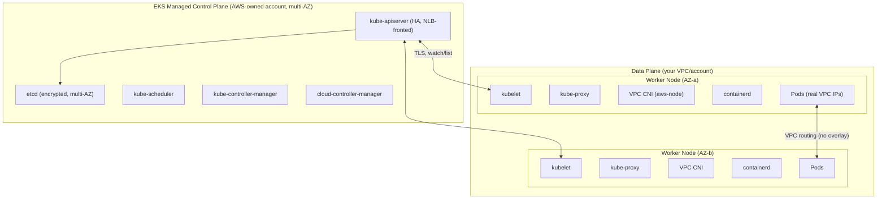
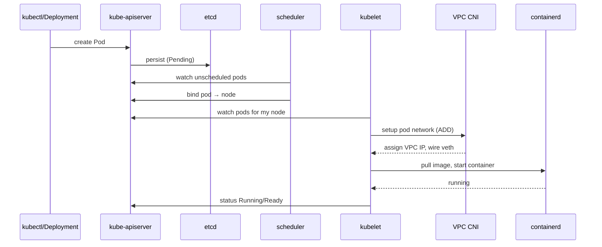
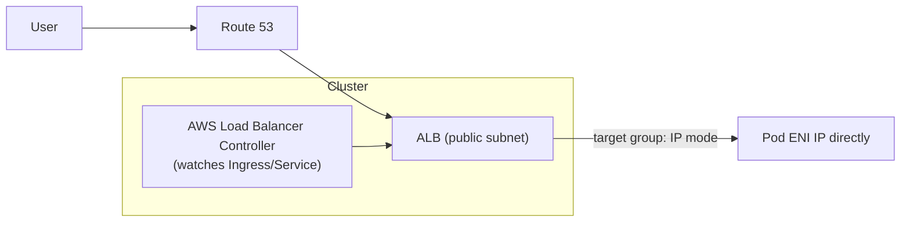

# Section 6: Amazon EKS — Extremely Detailed Deep Dive

> Part of the [AWS Interview Preparation Roadmap](./README.md). This is the **largest** section — EKS is the highest-signal topic for senior DevOps/SRE/Platform roles. Study it until you can whiteboard the full control-plane/data-plane and packet flow from memory.

---

## 6.1 Concept Overview

Amazon EKS is AWS's managed Kubernetes control plane. AWS runs and scales the API server and etcd across AZs; you own the data plane (nodes) and everything you deploy. The interview bar is high: you must explain **how a pod gets an IP, how a request reaches it, how identity flows to AWS APIs, and how you debug it at 2 a.m.**

**Beginner → Expert ladder:**
- **Beginner:** Clusters, node groups, Deployments/Services, kubectl.
- **Intermediate:** VPC CNI IP assignment, IRSA, HPA/Cluster Autoscaler, Ingress via ALB Controller.
- **Advanced:** Karpenter, Pod Identity, prefix delegation, topology-aware routing, PodDisruptionBudgets.
- **Expert:** Control-plane internals, etcd behavior, admission control, multi-cluster/multi-Region, IP exhaustion at scale, upgrade strategy.

## 6.2 Architecture



**Key point:** EKS pods get **real VPC IP addresses** via the Amazon VPC CNI — no overlay/encapsulation. This gives native VPC routing, Security Group support, and low latency, at the cost of VPC IP consumption.

## 6.3 Core Components

### Control Plane (AWS-managed)
| Component | Role |
|-----------|------|
| **kube-apiserver** | Front door for all cluster ops; validates/persists to etcd; fronted by an NLB with a public/private endpoint |
| **etcd** | Consistent key-value store of all cluster state; encrypted, multi-AZ, backed up by AWS |
| **kube-scheduler** | Binds pods to nodes based on resources, affinity, taints |
| **kube-controller-manager** | Runs core controllers (Deployment, ReplicaSet, Node, etc.) |
| **cloud-controller-manager** | Integrates AWS (ELB provisioning, node lifecycle, EBS) |

### Data Plane (customer-managed)
| Component | Role |
|-----------|------|
| **kubelet** | Node agent; talks to API server; manages pod lifecycle via CRI |
| **containerd** | Container runtime (Docker/dockershim removed since 1.24) |
| **kube-proxy** | Programs iptables/IPVS for Service ClusterIP routing |
| **VPC CNI (aws-node)** | Assigns VPC IPs to pods via ENIs/secondary IPs |
| **CoreDNS** | In-cluster DNS |

### Node options
- **Managed Node Groups:** AWS-managed EC2 lifecycle (AMIs, updates, drain).
- **Self-managed nodes:** Full control via your own ASGs.
- **Fargate profiles:** Serverless pods, one micro-VM per pod, no node management.
- **Karpenter:** Just-in-time node provisioning (see autoscaling).

## 6.4 Internal Working

### 6.4.1 Pod Lifecycle


### 6.4.2 VPC CNI Networking Flow
- `aws-node` DaemonSet + `ipamd` pre-allocates ENIs and secondary IPs (warm pool).
- Each pod gets a **secondary IP** from an ENI; a veth pair connects the pod netns to the host; host routing/policy routes steer traffic.
- **No NAT between pods** — pod-to-pod is direct VPC routing across nodes/AZs.
- **Max pods per node** ≈ (ENIs × IPs-per-ENI) − reserved, unless **prefix delegation** (assign /28 prefixes per ENI) is enabled to raise density dramatically.

### 6.4.3 Service Discovery & DNS
- **ClusterIP** Service → kube-proxy iptables/IPVS DNAT to a healthy pod IP.
- **CoreDNS** resolves `svc.namespace.svc.cluster.local`; pods point to the DNS Service IP via `/etc/resolv.conf`.
- **Headless Service** returns pod IPs directly (StatefulSets).

### 6.4.4 Ingress Flow (AWS Load Balancer Controller)

- An `Ingress` (or `Service type=LoadBalancer`) triggers the controller to provision an ALB/NLB.
- **IP target mode** registers pod IPs directly (bypasses node hop) — the modern default for EKS; **instance mode** targets NodePorts.

### 6.4.5 Identity (IRSA vs Pod Identity)
- **IRSA:** cluster OIDC provider + SA annotation → projected token → `AssumeRoleWithWebIdentity`. Trust policy pins the SA `sub`.
- **Pod Identity:** `eks-pod-identity-agent` DaemonSet vends creds from an association (SA→role); no per-cluster OIDC IdP; easier at fleet scale.

### 6.4.6 Certificate & Secrets Management
- kubelet/API TLS managed by EKS; workload TLS via cert-manager (ACM Private CA or Let's Encrypt).
- Secrets: External Secrets Operator or the Secrets Store CSI driver pulling from Secrets Manager/Parameter Store; envelope-encrypt etcd secrets with KMS.

## 6.5 Autoscaling

| Layer | Tool | Scales |
|-------|------|--------|
| Pods (horizontal) | **HPA** | Replica count on CPU/mem/custom metrics |
| Pods (vertical) | **VPA** | Requests/limits recommendations |
| Nodes (classic) | **Cluster Autoscaler** | ASG desired count to fit pending pods |
| Nodes (modern) | **Karpenter** | Provisions right-sized nodes JIT, consolidates, mixes Spot |

**Karpenter vs Cluster Autoscaler:** CA scales predefined node groups (ASGs) and is slower/less flexible; Karpenter looks at pending pod requirements and launches optimally-sized/priced nodes directly (bin-packing, consolidation, Spot diversification), reducing cost and scheduling latency.

## 6.6 Real-World Use Cases

- **Microservices platform:** EKS + ALB Controller + IRSA + Karpenter + Prometheus/Grafana + ArgoCD GitOps.
- **Batch/ML:** Spot node pools via Karpenter with checkpointing; GPU node pools.
- **Multi-tenant:** Namespaces + ResourceQuotas + NetworkPolicies + per-tenant IRSA roles.

## 6.7 Important AWS Services

EKS, EC2/Fargate, VPC CNI, ECR, ALB/NLB, IAM (IRSA/Pod Identity), KMS, CloudWatch Container Insights, AMP/AMG, Secrets Manager, Karpenter (OSS), AWS Load Balancer Controller.

## 6.8 Common Interview Questions (subset of the 250+ set)

1. **What does EKS manage vs you?** AWS: control plane (API server, etcd, upgrades of control plane). You: nodes, add-ons, workloads, networking config.
2. **How do pods get IPs?** VPC CNI assigns real VPC secondary IPs from ENIs — no overlay.
3. **IRSA vs node instance role?** IRSA scopes AWS perms to a pod's ServiceAccount; node role would give all pods the node's perms (bad).
4. **HPA vs VPA vs Cluster Autoscaler?** Pod count vs pod size vs node count.
5. **Managed node group vs Fargate?** MNG = EC2 you can tune; Fargate = serverless, one micro-VM per pod, no DaemonSets.
6. **What replaced Docker as runtime?** containerd (dockershim removed in 1.24).
7. **How does a Service route to pods?** kube-proxy programs iptables/IPVS to DNAT ClusterIP → pod IPs.
8. **What is a PodDisruptionBudget?** Limits voluntary disruptions to keep min availability during drains/upgrades.
9. **How do you expose an app externally?** Ingress + AWS Load Balancer Controller (ALB) or Service type=LoadBalancer (NLB).
10. **How do rolling updates work?** Deployment creates a new ReplicaSet, scales up new/scale down old per maxSurge/maxUnavailable.

## 6.9 Advanced Interview Questions

1. **Explain prefix delegation and why you'd enable it.** Assigns /28 IP prefixes per ENI, multiplying pods-per-node and mitigating VPC IP exhaustion and ENI limits.
2. **How does the scheduler place pods?** Filtering (predicates: resources, taints, affinity) then scoring (priorities: spread, least-allocated) then bind.
3. **Rolling upgrade of a cluster with zero downtime?** Upgrade control plane, then add-ons (CNI/CoreDNS/kube-proxy), then nodes via new AMIs (surge + cordon/drain honoring PDBs).
4. **Topology-aware routing?** Keeps Service traffic within the same AZ to cut cross-AZ cost/latency.
5. **How does etcd affect cluster limits?** etcd size/latency bounds object counts and API throughput; large clusters need object hygiene and request pacing.

## 6.10 FAANG-Level Deep Dive Questions

1. **Design a multi-tenant EKS platform for 500 engineers.** Namespaces + quotas + NetworkPolicies + per-team IRSA, Karpenter node pools with Spot, GitOps (ArgoCD) per tenant, OPA/Gatekeeper or Kyverno policies, centralized observability, and cost showback via tags/labels.
2. **Trace end-to-end request: user → pod, with identity.** Route 53 → ALB (WAF/TLS) → target group IP mode → pod ENI (SG) → app; app calls S3 using IRSA creds via `AssumeRoleWithWebIdentity`.
3. **VPC IP exhaustion at 10k pods — remediate.** Prefix delegation, custom networking with secondary CIDRs, larger subnets, or switch dataplane to Cilium overlay; monitor `awscni_total_ip_addresses`/`assigned`.
4. **Control-plane failure modes and static stability.** Running pods keep running if API server degrades (kubelet caches); you lose scheduling/scaling. Design for it (no control-plane calls in request path).
5. **Secure supply chain for images.** ECR scan on push, signed images (cosign), admission control to allow only signed images from trusted registries.

## 6.11 Troubleshooting Scenarios

### Pending Pods
```bash
kubectl describe pod <p>   # Events: Insufficient cpu/memory, no nodes match, taints
kubectl get nodes -o wide
kubectl get events --sort-by=.lastTimestamp
```
Causes: insufficient resources (scale nodes / Karpenter), unschedulable due to taints/affinity, no IPs (CNI), PVC unbound.

### CrashLoopBackOff
```bash
kubectl logs <p> --previous
kubectl describe pod <p>   # exit codes, liveness probe failures, OOM
```
Causes: app crash, bad config/secret, failing liveness probe, missing dependency.

### OOMKilled
```bash
kubectl describe pod <p> | grep -i oom
```
Fix: raise memory limits/requests, fix leak, set proper QoS; check node memory pressure.

### Node Not Ready
```bash
kubectl describe node <n>   # conditions: MemoryPressure, DiskPressure, PIDPressure
# On node: journalctl -u kubelet
```
Causes: kubelet down, disk full, CNI failing, network to API server lost.

### Image Pull Errors
```bash
kubectl describe pod <p>   # ErrImagePull / ImagePullBackOff
```
Causes: wrong tag, ECR auth (node role missing `ecr:GetAuthorizationToken`), private registry secret missing, rate limits.

### DNS Failures
```bash
kubectl run -it dns --image=busybox --restart=Never -- nslookup kubernetes.default
kubectl -n kube-system get pods -l k8s-app=kube-dns
```
Causes: CoreDNS crash/scaling, NodeLocal DNS issues, NetworkPolicy blocking, `ndots` misconfig.

### API Server Issues
```bash
kubectl get --raw='/readyz?verbose'
# Check EKS control plane logs in CloudWatch (api, audit, authenticator)
```

### IP Exhaustion (VPC CNI)
```bash
kubectl -n kube-system logs -l k8s-app=aws-node
# Metrics: awscni_total_ip_addresses vs awscni_assigned_ip_addresses
```
Fix: prefix delegation, more/larger subnets, custom networking.

## 6.12 Production Best Practices

- Private API endpoint (or restricted public CIDRs); control-plane logging to CloudWatch.
- IRSA/Pod Identity — never node-wide creds; least-privilege SAs.
- PodDisruptionBudgets + graceful termination + readiness/liveness/startup probes.
- Karpenter with Spot + consolidation; multi-AZ node spread; topology-aware routing.
- GitOps (ArgoCD/Flux); admission policy (Kyverno/Gatekeeper); ECR scan-on-push.
- Stay within N-2 of latest Kubernetes; test upgrades in staging.

## 6.13 Security Considerations

- Restrict the public API endpoint; use `aws-auth`/access entries with least privilege.
- Enable envelope encryption of secrets with KMS; use External Secrets/CSI, not plaintext.
- NetworkPolicies (Calico/Cilium) for east-west segmentation; SGs for pods where needed.
- IMDSv2 hop limit 1 so pods can't steal node creds; disable IMDS access from pods if unused.
- Runtime security (GuardDuty EKS Protection, Falco); scan images; sign & verify.

## 6.14 Cost Optimization Strategies

- Karpenter consolidation + Spot; right-size requests/limits (VPA recommendations).
- Bin-pack with proper requests; scale to zero non-prod (Karpenter/knative).
- Topology-aware routing + co-location to cut cross-AZ data transfer.
- Fargate only where node overhead isn't justified; Graviton nodes for price/perf.

## 6.15 Sample Answers

> **"How do you give a pod least-privilege AWS access on EKS?"** *"IRSA or Pod Identity. With IRSA I enable the cluster OIDC provider, create a scoped IAM role whose trust policy pins the ServiceAccount's subject and the `sts.amazonaws.com` audience, and annotate the SA. The pod gets a projected OIDC token and the SDK calls `AssumeRoleWithWebIdentity` for short-lived creds. The blast radius is a single ServiceAccount, no node-wide credentials, and everything is auditable in CloudTrail. At fleet scale I'd prefer Pod Identity to avoid managing a per-cluster OIDC provider."*

> **"Pods are Pending after a deploy — walk me through it."** *"`kubectl describe pod` for Events. If it's Insufficient cpu/memory, the cluster needs nodes — check Karpenter/Cluster Autoscaler logs; maybe pod requests are too large or a node pool is at limit. If it's taints/affinity, the pod can't match any node. If it's FailedScheduling with no IPs, the VPC CNI is out of addresses — check `ipamd` and consider prefix delegation. If a PVC is unbound, the EBS CSI driver or storage class is the issue. I fix the root cause rather than just bumping replicas."*

## 6.16 Follow-up Questions Interviewers Ask

- "Why do EKS pods consume VPC IPs and how do you scale past that?"
- "What exactly breaks when the control plane is unreachable?"
- "How do you roll a Kubernetes version upgrade with zero downtime?"
- "IRSA vs Pod Identity — pick one and defend it."

## 6.17 AWS Documentation Links

- EKS User Guide: https://docs.aws.amazon.com/eks/latest/userguide/
- VPC CNI: https://docs.aws.amazon.com/eks/latest/userguide/managing-vpc-cni.html
- IRSA: https://docs.aws.amazon.com/eks/latest/userguide/iam-roles-for-service-accounts.html
- Pod Identity: https://docs.aws.amazon.com/eks/latest/userguide/pod-identities.html
- AWS Load Balancer Controller: https://kubernetes-sigs.github.io/aws-load-balancer-controller/
- Karpenter: https://karpenter.sh/docs/
- EKS Best Practices Guide: https://aws.github.io/aws-eks-best-practices/

## 6.18 Hands-On Labs

1. Provision EKS with Terraform (`terraform-aws-modules/eks`); enable IRSA + OIDC.
2. Install AWS Load Balancer Controller; expose an app via ALB Ingress in IP target mode.
3. Install Karpenter; deploy a workload that triggers Spot node provisioning + consolidation.
4. Enable prefix delegation and measure max-pods increase.
5. Reproduce and fix each troubleshooting scenario (Pending, CrashLoop, OOM, DNS, IP exhaustion).
6. Wire IRSA so a pod reads a specific S3 bucket; verify with `aws sts get-caller-identity`.

## 6.19 Comparison with Azure and GCP

| Concept | AWS (EKS) | Azure (AKS) | GCP (GKE) |
|---------|-----------|-------------|-----------|
| Control plane cost | Hourly per cluster | Free tier / paid SLA tier | Autopilot/Standard mgmt fee |
| Pod networking | VPC CNI (real IPs) | Azure CNI / kubenet | VPC-native (alias IPs) |
| Workload identity | IRSA / Pod Identity | Entra Workload Identity | Workload Identity |
| Node autoscale (JIT) | Karpenter | Cluster Autoscaler / node auto-provision | Node auto-provisioning / Autopilot |
| Serverless pods | Fargate | Virtual nodes (ACI) | Autopilot |
| Managed add-ons | EKS add-ons | AKS add-ons | GKE add-ons |

**Key differences:** EKS pods get real VPC IPs by default (no overlay), which is powerful but causes IP-exhaustion concerns AKS/GKE mitigate differently (GKE alias IPs, AKS kubenet overlay option). GKE Autopilot is the most hands-off; EKS gives the most control and the richest JIT autoscaling via Karpenter.

---

> Next: **[Sections 7–8 — Containers & Terraform](./07-CONTAINERS-TERRAFORM.md)**.
