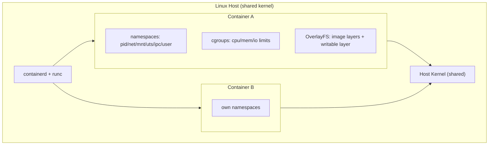
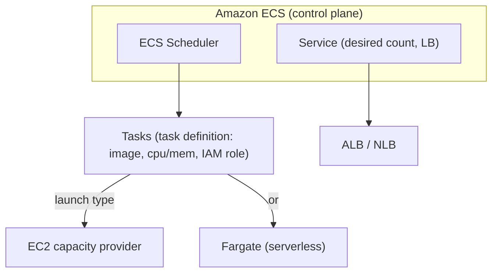
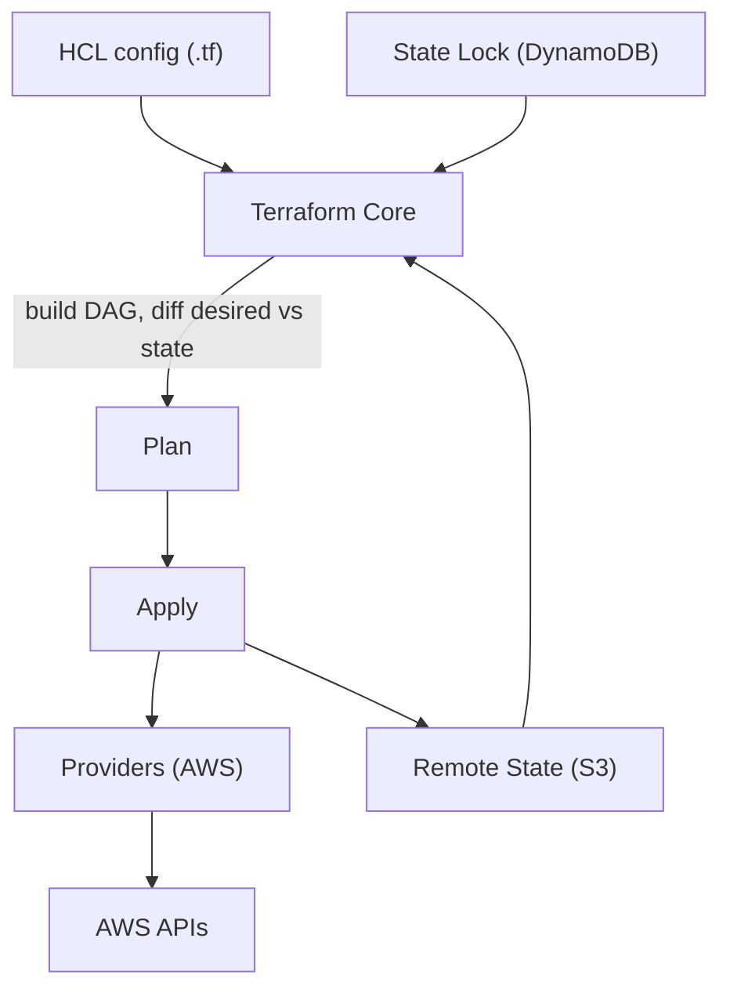

# Sections 7–8: Containers & Docker · Terraform for AWS

> Part of the [AWS Interview Preparation Roadmap](./README.md). Covers **Section 7: Containers & Docker** and **Section 8: Terraform for AWS**.

---

# SECTION 7: CONTAINERS & DOCKER

## 7.1 Concept Overview

Containers interviews test Linux-level understanding: what a container *actually is* (namespaces + cgroups + a layered filesystem), how images are built and stored, and how ECS/Fargate differ from EKS. A container is **not a VM** — it's a process isolated by kernel primitives sharing the host kernel.

**Beginner → Expert ladder:**
- **Beginner:** Images, containers, Dockerfile, registries.
- **Intermediate:** Layers/caching, multi-stage builds, ECR, ECS task definitions.
- **Advanced:** namespaces/cgroups/OverlayFS, OCI, rootless, capacity providers.
- **Expert:** runtime internals (containerd/runc), supply-chain security, ECS vs EKS trade-offs at scale.

## 7.2 Architecture

### ECS Architecture

## 7.3 Core Components

| Concept | Description |
|---------|-------------|
| **Namespaces** | Isolate what a process sees: PID, NET, MNT, UTS, IPC, USER, cgroup |
| **cgroups** | Limit/account resources: CPU, memory, blkio, pids |
| **OverlayFS** | Union filesystem: read-only image layers + a writable container layer (copy-on-write) |
| **Image layers** | Each Dockerfile instruction is a cached, content-addressed layer |
| **OCI** | Open Container Initiative — image & runtime specs (portable across runtimes) |
| **containerd/runc** | High-level runtime + low-level OCI runtime that spawns the process |
| **Registry (ECR)** | Stores/distributes images; scanning, lifecycle policies, cross-Region replication |
| **ECS Task/Service** | Task = running containers from a task def; Service maintains desired count behind an LB |
| **Capacity Provider** | Maps ECS to EC2 ASG or Fargate; enables cluster auto scaling |

## 7.4 Internal Working

**What happens on `docker run`:** the runtime creates new **namespaces** (isolated PID/net/mount/etc.), applies **cgroup** limits, mounts the **OverlayFS** rootfs (image layers + writable layer), then `runc` `exec`s the entrypoint as PID 1 inside that isolation. Networking is wired via a veth pair to a bridge (or the VPC CNI on EKS).

**Image layers & caching:** Each instruction adds a layer keyed by content hash; unchanged layers are reused, so ordering matters — put rarely-changing steps (dependency install) before frequently-changing steps (copy source) to maximize cache hits. Multi-stage builds keep build tools out of the final image (smaller, safer).

**ECS vs EKS:** ECS is AWS-proprietary, simpler, deeply integrated (no Kubernetes to operate) — great when you don't need the K8s ecosystem. EKS is standard Kubernetes — portable, huge ecosystem, more operational surface. Both run on EC2 or Fargate.

**Fargate:** Each task runs in its own micro-VM (Firecracker) for strong isolation; you pay per vCPU/GB-second, no nodes to manage, but no DaemonSets and fewer knobs.

## 7.5 Real-World Use Cases

- **Simple service platform:** ECS Fargate + ALB + CodePipeline — minimal ops.
- **Portable/multi-cloud or ecosystem-heavy:** EKS.
- **Build/CI images:** ECR with scan-on-push + lifecycle expiry of old tags.

## 7.6 Important AWS Services

ECR, ECS, Fargate, EKS, App Runner, CodeBuild (image builds), EC2 Image Builder.

## 7.7 Common Interview Questions

1. **Container vs VM?** Container shares the host kernel (namespaces+cgroups); VM virtualizes hardware with its own kernel. Containers are lighter/faster, VMs stronger-isolated.
2. **What provides isolation?** Namespaces (visibility) + cgroups (resources) + capabilities/seccomp (syscalls).
3. **Why multi-stage builds?** Smaller, more secure images (no compilers/secrets in final layer).
4. **ECS vs EKS?** Proprietary-simple vs standard-Kubernetes-portable.
5. **What is OverlayFS copy-on-write?** Writes to a read-only layer copy the file up to the writable layer.
6. **Fargate vs EC2 launch type?** Serverless per-task micro-VM vs managed EC2 fleet.

## 7.8 Advanced Interview Questions

1. **How does a layer cache bust?** Any changed instruction invalidates that layer and all subsequent layers.
2. **Rootless containers / user namespaces?** Map container root to an unprivileged host UID to reduce breakout impact.
3. **Why is PID 1 special?** It reaps zombies and receives signals; use a proper init (`tini`) or handle SIGTERM for graceful shutdown.
4. **ECS capacity providers & managed scaling?** Target a cluster utilization; ECS scales the backing ASG automatically.

## 7.9 FAANG-Level Deep Dive Questions

1. **Secure the image supply chain.** Minimal/distroless base, pin digests, scan (ECR/Trivy), sign (cosign), admission-verify signatures, SBOM generation, no secrets in layers.
2. **Reduce cold start & image size for fast autoscaling.** Distroless/static binaries, layer ordering, lazy-loading (SOCI for Fargate), regional ECR pull-through cache.
3. **ECS vs EKS decision at 1000 services.** Team K8s expertise, ecosystem needs (service mesh, operators), portability, and ops cost drive it; ECS lowers ops, EKS maximizes flexibility.

## 7.10 Troubleshooting Scenarios

- **Container exits immediately:** Bad entrypoint/PID-1 signal handling; check logs & exit code.
- **Image huge/slow pulls:** No multi-stage, fat base; use distroless + caching + ECR in-Region.
- **ECS task stuck PROVISIONING:** ENI/subnet IP exhaustion or capacity provider can't scale.
- **`CannotPullContainerError`:** ECR auth/permissions, wrong tag, or no route to ECR (add VPC endpoint).

## 7.11 Production Best Practices

- Distroless/minimal images; non-root user; read-only root FS; drop Linux capabilities.
- ECR scan-on-push + lifecycle policies; immutable tags (digests) in deploys.
- Health checks + graceful SIGTERM handling; resource requests/limits.

## 7.12 Security Considerations

- No secrets in images; use Secrets Manager/SSM at runtime.
- seccomp/AppArmor, drop capabilities, non-root, read-only FS.
- Sign and verify images; continuously scan for CVEs.

## 7.13 Cost Optimization Strategies

- Smaller images = cheaper storage/faster scaling; ECR lifecycle to expire old tags.
- Fargate for spiky/low-density; EC2/Spot for steady high-density bin-packing.
- Graviton (arm64) images for price/perf.

## 7.14 Sample Answers

> **"What actually is a container?"** *"It's a normal Linux process that the kernel isolates using namespaces — so it sees its own PID tree, network, and mounts — and constrains using cgroups for CPU/memory. Its filesystem is an OverlayFS union of read-only image layers plus a writable copy-on-write layer. There's no guest kernel like a VM; containerd and runc set up that isolation and exec the entrypoint as PID 1. That's why containers start in milliseconds but share the host kernel, which is also why kernel-level hardening (seccomp, non-root, capabilities) matters."*

## 7.15 Follow-up Questions Interviewers Ask

- "How would you cut a 1.2 GB image to 80 MB?"
- "Why might a container ignore SIGTERM and get SIGKILLed?"
- "When would you pick ECS over EKS?"

## 7.16 AWS Documentation Links

- ECS: https://docs.aws.amazon.com/AmazonECS/latest/developerguide/
- ECR: https://docs.aws.amazon.com/AmazonECR/latest/userguide/
- Fargate: https://docs.aws.amazon.com/AmazonECS/latest/userguide/what-is-fargate.html
- App Runner: https://docs.aws.amazon.com/apprunner/latest/dg/

## 7.17 Hands-On Labs

1. Write a multi-stage Dockerfile; compare image size vs single-stage.
2. Push to ECR with scan-on-push + a lifecycle policy; deploy on ECS Fargate behind an ALB.
3. Add an ECR VPC endpoint and pull without a NAT gateway.

## 7.18 Comparison with Azure and GCP

| Concept | AWS | Azure | GCP |
|---------|-----|-------|-----|
| Registry | ECR | ACR | Artifact Registry |
| Managed containers | ECS | Container Instances | Cloud Run |
| Serverless containers | Fargate | Container Apps / ACI | Cloud Run |
| Managed K8s | EKS | AKS | GKE |

**Key differences:** ECS has no direct Azure/GCP analog (both lean on Kubernetes or Cloud Run/Container Apps). Fargate ≈ Container Apps ≈ Cloud Run in "serverless containers," though pricing/scaling models differ.

---

# SECTION 8: TERRAFORM FOR AWS

## 8.1 Concept Overview

Terraform is the IaC lingua franca. Interviews probe **state**, **the dependency graph**, **plan/apply mechanics**, **module design**, and how you manage state safely across a team (remote backend + locking). You should also compare it with CloudFormation and CDK.

**Beginner → Expert ladder:**
- **Beginner:** providers, resources, variables, `plan`/`apply`.
- **Intermediate:** remote state (S3 + DynamoDB lock), modules, outputs, data sources.
- **Advanced:** workspaces vs directories, `for_each`/`count`, lifecycle blocks, `moved`/`import`.
- **Expert:** state surgery, drift, dependency graph internals, multi-account/multi-Region factory, policy-as-code (Sentinel/OPA).

## 8.2 Architecture

## 8.3 Core Components

| Component | Purpose |
|-----------|---------|
| **Provider** | Plugin translating HCL → cloud API (aws, kubernetes, helm) |
| **Resource** | A managed object (aws_instance, aws_s3_bucket) |
| **Data source** | Read-only lookup of existing infra |
| **State** | Source of truth mapping config → real resources |
| **Backend** | Where state lives (S3 + DynamoDB lock is standard) |
| **Module** | Reusable, parameterized group of resources |
| **Workspace** | Multiple states from one config (use cautiously) |
| **Lifecycle** | `create_before_destroy`, `prevent_destroy`, `ignore_changes` |

## 8.4 Internal Working

**Plan generation:** Terraform builds a **dependency graph (DAG)** from references between resources, refreshes state (reads real infra), diffs desired config vs state, and produces an ordered plan (create/update/replace/destroy). Apply walks the DAG, parallelizing independent nodes (default 10).

**State & locking:** State stores resource IDs and attributes. With the S3 backend, a **DynamoDB table** provides a lock so two engineers can't apply simultaneously (prevents corruption). State can contain secrets — encrypt the bucket (SSE-KMS), restrict access, enable versioning.

**Replace vs update:** Changing an immutable attribute forces **replace** (destroy+create); `create_before_destroy` avoids downtime. `ignore_changes` prevents drift-fighting on externally-managed fields. `moved`/`import` refactor without destroying.

**Drift:** Real infra changed outside Terraform. `terraform plan` shows drift; reconcile by updating code or `import`. Avoid manual console changes in prod.

## 8.5 Real-World Use Cases

- **Landing zone factory:** Modules for VPC, EKS, IAM; per-account/Region via directories + CI.
- **Immutable infra:** Terraform provisions, Packer/Image Builder bakes AMIs.
- **App + platform split:** Platform team owns network/EKS modules; app teams consume via remote state outputs.

## 8.6 Important AWS Services (integrations)

S3 (state), DynamoDB (lock), KMS (encrypt state), IAM (assume-role per account), CodeBuild/GitHub Actions (CI), Terraform Cloud/Enterprise (managed runs, Sentinel).

## 8.7 Common Interview Questions

1. **Why remote state?** Team collaboration, locking, durability, and secret encryption vs local `terraform.tfstate`.
2. **How does locking work with S3 backend?** DynamoDB item as a mutex per state file.
3. **`count` vs `for_each`?** `for_each` uses a map/set (stable keys, safer add/remove); `count` uses an index (reindex churn on removal).
4. **Module purpose?** Reuse, encapsulation, standardization.
5. **What causes a resource replacement?** Change to an immutable (ForceNew) attribute.
6. **Workspaces vs separate directories?** Workspaces share config/backend (risky for prod isolation); directories give stronger separation.

## 8.8 Advanced Interview Questions

1. **How do you refactor without destroying?** `moved` blocks or `terraform state mv`; `import` to adopt existing resources.
2. **Manage multi-account/Region safely?** Provider `assume_role` per account, separate state per account/Region, DRY via modules + CI matrix.
3. **Prevent secrets in state exposure?** Encrypt backend (KMS), restrict IAM, avoid outputs of secrets, use dynamic secrets where possible.
4. **`create_before_destroy` pitfalls?** Name collisions/quota during overlap; must handle unique names.

## 8.9 FAANG-Level Deep Dive Questions

1. **Design an IaC platform for 200 engineers/50 accounts.** Module registry (versioned), PR-based CI with `plan` gating + policy-as-code (Sentinel/OPA/checkov), per-account remote state with KMS, drift detection jobs, and least-privilege CI roles via OIDC.
2. **State corruption recovery.** Use state versioning (S3), `terraform force-unlock` carefully, restore prior version, or targeted `state` surgery; never hand-edit blindly.
3. **Terraform vs CloudFormation vs CDK — pick for a multi-cloud org.** Terraform (multi-cloud, huge provider ecosystem), CloudFormation (deep AWS-native, drift/rollback, no state to manage), CDK (imperative in real languages, synthesizes CFN). Choose Terraform for portability, CFN/CDK for AWS-only + native rollback.

## 8.10 Troubleshooting Scenarios

- **State lock stuck:** Crashed apply left a DynamoDB lock; `terraform force-unlock <id>` after confirming no active run.
- **Plan wants to destroy prod:** Likely a moved/renamed resource or provider default change; use `moved`/`import`, review diffs carefully.
- **Drift every plan:** External controller mutates a field; `ignore_changes` or bring it into Terraform.
- **Provider auth errors in CI:** Wrong assume-role/OIDC trust; verify role and session.

## 8.11 Production Best Practices

- Remote state (S3+DynamoDB+KMS), versioning on; one state per account/Region/domain.
- PR workflow: `fmt`/`validate`/`plan` in CI, human review, `apply` on merge.
- Pin provider/module versions; policy-as-code gate; no manual console changes.
- Small blast-radius states; avoid one giant monolith state.

## 8.12 Security Considerations

- Encrypt state; least-privilege CI roles via OIDC (no static keys).
- Scan with tfsec/checkov; secrets from a vault, not variables committed to VCS.
- `prevent_destroy` on critical resources.

## 8.13 Cost Optimization Strategies

- Codify tagging (cost allocation) in modules; detect orphaned resources via drift/Config.
- Use `terraform plan` in CI to catch expensive changes before apply.

## 8.14 Sample Answers

> **"How do you manage Terraform state for a team across many AWS accounts?"** *"Remote state in an S3 bucket with versioning and SSE-KMS, plus a DynamoDB table for locking so concurrent applies can't corrupt state. I split state by account/Region/domain to keep blast radius small rather than one monolith. Each account is targeted via a provider `assume_role`, and CI authenticates with GitHub OIDC to a least-privilege role — no static keys. PRs run fmt/validate/plan with a policy-as-code gate (checkov/OPA), a human reviews the plan, and apply runs on merge. Drift detection runs nightly and manual console changes in prod are disallowed."*

## 8.15 Follow-up Questions Interviewers Ask

- "How do you import 200 existing resources without downtime?"
- "How do you stop a plan from destroying a database?"
- "When would you choose CDK over Terraform?"

## 8.16 AWS/Terraform Documentation Links

- Terraform AWS provider: https://registry.terraform.io/providers/hashicorp/aws/latest/docs
- S3 backend: https://developer.hashicorp.com/terraform/language/settings/backends/s3
- EKS module: https://registry.terraform.io/modules/terraform-aws-modules/eks/aws/latest
- CloudFormation: https://docs.aws.amazon.com/AWSCloudFormation/latest/UserGuide/
- CDK: https://docs.aws.amazon.com/cdk/v2/guide/

## 8.17 Hands-On Labs

1. Stand up an S3+DynamoDB backend; migrate local state to it.
2. Build a reusable VPC module with `for_each` subnets; consume it in two environments.
3. Import an existing S3 bucket; refactor a resource with a `moved` block (no destroy).
4. Add checkov to CI and fail a PR on an insecure security group.

## 8.18 Comparison with Azure and GCP

| Aspect | Terraform (AWS) | Azure-native | GCP-native |
|--------|-----------------|--------------|------------|
| Native IaC | CloudFormation/CDK | ARM/Bicep | Deployment Manager / Config Controller |
| State | Self-managed (S3) | Managed by service | Managed by service |
| Multi-cloud | Yes (providers) | No | No |
| Policy-as-code | Sentinel/OPA/checkov | Azure Policy | Org Policy / OPA |

**Key differences:** Terraform is cloud-agnostic with explicit state you manage; CloudFormation/ARM/Bicep/Deployment Manager manage state for you but lock you to one cloud. Bicep (Azure) and CDK (AWS) both improve authoring ergonomics over raw JSON/YAML.

---

> Next: **[Sections 9–10 — CI/CD & GitHub Actions](./08-CICD-PLATFORMS.md)**.
