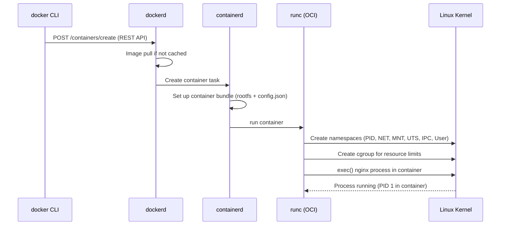

# CONTAINERS, DOCKER & TERRAFORM — Deep Dive Interview Preparation

> **Scope:** Sections 7–8 of 20 | Beginner → Expert | FAANG-level depth  
> **Coverage:** Docker internals, cgroups, namespaces, OCI, ECS, ECR, Terraform state, modules, lifecycle, 50+ Q&A

---

## Table of Contents

**Section 7: Containers & Docker**
1. [Docker Architecture](#1-docker-architecture)
2. [Linux Namespaces & cgroups](#2-linux-namespaces--cgroups)
3. [Container Filesystem: OverlayFS & Image Layers](#3-container-filesystem-overlayfs--image-layers)
4. [OCI & Container Standards](#4-oci--container-standards)
5. [Amazon ECR](#5-amazon-ecr)
6. [Docker Networking](#6-docker-networking)
7. [Amazon ECS Architecture](#7-amazon-ecs-architecture)
8. [ECS vs. EKS Decision Framework](#8-ecs-vs-eks-decision-framework)
9. [AWS Fargate (ECS)](#9-aws-fargate-ecs)
10. [ECS Troubleshooting](#10-ecs-troubleshooting)

**Section 8: Terraform for AWS**
11. [Terraform Architecture & State](#11-terraform-architecture--state)
12. [Backend: S3 + DynamoDB Locking](#12-backend-s3--dynamodb-locking)
13. [Modules](#13-modules)
14. [Workspaces](#14-workspaces)
15. [Lifecycle Blocks](#15-lifecycle-blocks)
16. [Terraform Internals: Plan & Apply](#16-terraform-internals-plan--apply)
17. [Terraform vs. CloudFormation vs. CDK](#17-terraform-vs-cloudformation-vs-cdk)
18. [Interview Questions & Answers](#18-interview-questions--answers)
19. [Troubleshooting Scenarios](#19-troubleshooting-scenarios)
20. [Documentation Links](#20-documentation-links)

---

## 1. Docker Architecture

### Beginner Foundation

**Docker** is a platform for building, distributing, and running containers. A container is a process (or group of processes) isolated using Linux namespaces and resource-limited by cgroups.

**Components:**
- **Docker daemon (`dockerd`):** The background process managing containers, images, networks, and volumes. Exposes a REST API.
- **Docker CLI (`docker`):** Client that sends commands to the daemon via the REST API (local socket or remote HTTPS).
- **containerd:** High-level container runtime that `dockerd` delegates container lifecycle management to.
- **runc:** OCI-compliant low-level runtime that creates and starts containers by configuring Linux namespaces and cgroups.

### Intermediate Mechanics

**Request flow: `docker run nginx`**



---

## 2. Linux Namespaces & cgroups

### Namespaces

Linux namespaces provide isolation — each container gets its own view of system resources.

| Namespace | Isolates | Effect |
|---|---|---|
| PID | Process IDs | Container processes see PID 1 (no host PIDs visible) |
| NET | Network stack | Separate network interfaces, routes, iptables |
| MNT | Filesystem mount points | Container has its own root filesystem |
| UTS | Hostname and domain name | Container can have different hostname |
| IPC | System V IPC, POSIX message queues | Isolated inter-process communication |
| USER | User and group IDs | Container root (UID 0) maps to unprivileged host UID |
| CGROUP | cgroup hierarchy | Container sees only its own resource limits |

**Namespace verification:**
```bash
# Show namespaces of a running container
docker inspect <container-id> --format '{{.State.Pid}}'
# then: ls -la /proc/<pid>/ns/
```

### Control Groups (cgroups)

cgroups limit, prioritize, and account for resource usage of groups of processes.

**Resource controllers:**
- `cpu`: Limits CPU shares and quota (`--cpus 0.5` = 50ms per 100ms period)
- `memory`: Sets memory limit and swap (`--memory 512m`)
- `blkio`: I/O bandwidth limits (read/write IOPS per device)
- `pids`: Maximum number of processes (`--pids-limit 1000`)
- `net_cls`: Network traffic classification (for tc-based bandwidth control)

**How Kubernetes resource limits map to cgroups:**
```
Pod limit: cpu 500m, memory 512Mi
→ cgroup: /sys/fs/cgroup/cpu/kubepods/pod-<uid>/container-<id>/
          cpu.cfs_quota_us = 50000 (50ms per 100ms period)
          memory.limit_in_bytes = 536870912 (512 MiB in bytes)
```

**cgroups v2 (unified hierarchy):** EKS nodes running Kubernetes 1.25+ with AL2023 use cgroups v2. This enables better memory accounting (includes kernel memory) and improved QoS enforcement. Some older monitoring tools may need updates for cgroups v2 compatibility.

---

## 3. Container Filesystem: OverlayFS & Image Layers

### Image Layers

A container image is a stack of read-only filesystem layers. Each Dockerfile instruction (RUN, COPY, ADD) that changes the filesystem creates a new layer. Layers are content-addressed (SHA256 hash of content).

```
nginx:1.25 image layers:
└── Base layer: debian:bookworm (100 MB)
└── Layer 2: apt-get install nginx (30 MB)
└── Layer 3: nginx.conf COPY (1 KB)
└── Layer 4: EXPOSE 80, CMD ["nginx"] (metadata only)
```

**Sharing layers:** If two images share the same base layer hash, the layer is stored once on disk. `nginx:1.25` and `nginx:1.26` share the Debian base layer — only the changed nginx binary layer differs. This reduces disk usage and pull time.

### OverlayFS

**OverlayFS** is the default storage driver that Docker and containerd use to create a writable container filesystem from read-only image layers.

**Layers in OverlayFS:**
- **Lower dirs:** Read-only image layers (stacked, lower-lower takes precedence on conflict).
- **Upper dir:** Read-write container layer (changes go here).
- **Work dir:** Temporary working directory for OverlayFS internals.
- **Merged dir:** The unified view exposed to the container.

**Copy-on-write (CoW):** When a container writes to a file that exists in a lower (read-only) layer, OverlayFS copies the file to the upper (writable) layer before modification. The original read-only layer is unchanged.

```bash
# Inspect OverlayFS mounts on a host
mount | grep overlay
# overlay on /var/lib/docker/overlay2/ABC123/merged type overlay
#   (ro,lowerdir=.../sha256:xxx/.../sha256:yyy,upperdir=.../upper,workdir=.../work)
```

**Layer optimization — Dockerfile best practices:**

```dockerfile
# BAD: apt cache left in layer, then deleted in next layer (still in image)
FROM ubuntu:22.04
RUN apt-get update
RUN apt-get install -y nginx
RUN rm -rf /var/lib/apt/lists/*  # This doesn't help — cache is in previous layer

# GOOD: single RUN command, cache cleaned in same layer
FROM ubuntu:22.04
RUN apt-get update && \
    apt-get install -y --no-install-recommends nginx && \
    rm -rf /var/lib/apt/lists/*

# BEST: copy dependencies first (leverage caching for slow install steps)
FROM python:3.12-slim
WORKDIR /app
COPY requirements.txt .          # Only changed if requirements change
RUN pip install -r requirements.txt  # Expensive: cached unless requirements change
COPY . .                         # Changed frequently: last layer
CMD ["python", "app.py"]
```

---

## 4. OCI & Container Standards

**OCI (Open Container Initiative)** defines:
- **Image spec:** How container images are stored and transferred.
- **Runtime spec:** How a compliant runtime should run a container (config.json format, lifecycle hooks).
- **Distribution spec:** How registries serve images (HTTP API).

**OCI compliance:** Docker images are OCI-compliant. You can run Docker images with `containerd`, `podman`, or `cri-o` without modification. Kubernetes mandates CRI (Container Runtime Interface) — any OCI-compliant runtime with a CRI shim works.

**Multi-arch images (OCI image index):**
```bash
# Inspect manifest list showing supported architectures
docker manifest inspect --verbose nginx:latest | jq '.manifests[].platform'
# {"architecture":"amd64","os":"linux"}
# {"architecture":"arm64","os":"linux","variant":"v8"}
# {"architecture":"arm","os":"linux","variant":"v7"}

# Build and push multi-arch image
docker buildx create --use
docker buildx build --platform linux/amd64,linux/arm64 \
  -t 123456789012.dkr.ecr.us-east-1.amazonaws.com/my-app:v1.0 \
  --push .
```

---

## 5. Amazon ECR

**Amazon ECR (Elastic Container Registry)** is a managed Docker/OCI-compatible image registry. Fully private by default, integrates with IAM for authentication, and supports image vulnerability scanning.

**Authentication (token-based, 12-hour expiry):**
```bash
# Authenticate Docker to ECR
aws ecr get-login-password --region us-east-1 | \
  docker login --username AWS --password-stdin \
  123456789012.dkr.ecr.us-east-1.amazonaws.com

# Pull/push images
docker tag my-app:latest 123456789012.dkr.ecr.us-east-1.amazonaws.com/my-app:latest
docker push 123456789012.dkr.ecr.us-east-1.amazonaws.com/my-app:latest
```

**ECR repository policy (cross-account access):**
```json
{
  "Statement": [{
    "Effect": "Allow",
    "Principal": {
      "AWS": "arn:aws:iam::ACCOUNT-B:role/EKSNodeRole"
    },
    "Action": [
      "ecr:GetDownloadUrlForLayer",
      "ecr:BatchGetImage",
      "ecr:BatchCheckLayerAvailability"
    ]
  }]
}
```

**Lifecycle policies (automatic image cleanup):**
```json
{
  "rules": [
    {
      "rulePriority": 1,
      "description": "Keep last 10 tagged releases",
      "selection": {
        "tagStatus": "tagged",
        "tagPrefixList": ["v"],
        "countType": "imageCountMoreThan",
        "countNumber": 10
      },
      "action": {"type": "expire"}
    },
    {
      "rulePriority": 2,
      "description": "Delete untagged images older than 7 days",
      "selection": {
        "tagStatus": "untagged",
        "countType": "sinceImagePushed",
        "countUnit": "days",
        "countNumber": 7
      },
      "action": {"type": "expire"}
    }
  ]
}
```

**ECR image scanning:** Amazon Inspector scans ECR images for OS package vulnerabilities (CVEs) automatically on push. Results available in ECR console and Inspector console. Block vulnerable images from deployment via admission controller (OPA Gatekeeper, Kyverno):

```yaml
# Kyverno policy: block images with critical vulnerabilities
apiVersion: kyverno.io/v1
kind: ClusterPolicy
metadata:
  name: block-critical-vulnerabilities
spec:
  validationFailureAction: enforce
  rules:
  - name: check-image-scan
    match:
      resources:
        kinds: [Pod]
    verifyImages:
    - imageReferences: ["*.dkr.ecr.*.amazonaws.com/*"]
      attestations:
      - type: https://cosign.sigstore.dev/attestation/vuln/v1
        conditions:
        - all:
          - key: "{{ critical }}"
            operator: Equals
            value: "0"
```

---

## 6. Docker Networking

**Docker network drivers:**

| Driver | Use case | How it works |
|---|---|---|
| bridge (default) | Single-host container communication | Virtual bridge `docker0`, NAT for external traffic |
| host | Eliminate network overhead | Container shares host network namespace |
| overlay | Multi-host (Docker Swarm) | VXLAN encapsulation across hosts |
| macvlan | Direct network access | Container gets its own MAC + IP on host network |
| none | No networking | Container has loopback only |

**Bridge networking internals:**
```bash
# When you run: docker run -p 8080:80 nginx
# Docker creates:
# 1. veth pair: one in container (eth0), one on host (vethXXX on docker0 bridge)
# 2. iptables DNAT rule: traffic on host:8080 → container:80
# 3. iptables MASQUERADE rule: container traffic appears as host IP outbound

# Verify:
sudo iptables -t nat -L DOCKER -n
# DNAT tcp -- anywhere anywhere tcp dpt:8080 to:172.17.0.2:80
```

---

## 7. Amazon ECS Architecture

**Amazon ECS (Elastic Container Service)** is AWS's native container orchestrator. It schedules containers (called "tasks") on EC2 instances or Fargate.

### Key ECS Components

**Task Definition:** Blueprint for one or more containers. Specifies:
- Container images (ECR URIs).
- CPU/memory requirements (task-level and container-level).
- Network mode (awsvpc, bridge, host).
- IAM task role and execution role.
- Log configuration (CloudWatch Logs).
- Secrets (SSM Parameter Store, Secrets Manager references).
- Port mappings, environment variables, volume mounts.

```json
{
  "family": "web-api",
  "networkMode": "awsvpc",
  "taskRoleArn": "arn:aws:iam::123:role/TaskRole",
  "executionRoleArn": "arn:aws:iam::123:role/ExecutionRole",
  "requiresCompatibilities": ["FARGATE"],
  "cpu": "512",
  "memory": "1024",
  "containerDefinitions": [{
    "name": "api",
    "image": "123.dkr.ecr.us-east-1.amazonaws.com/api:v1",
    "portMappings": [{"containerPort": 8080, "protocol": "tcp"}],
    "logConfiguration": {
      "logDriver": "awslogs",
      "options": {
        "awslogs-group": "/ecs/web-api",
        "awslogs-region": "us-east-1",
        "awslogs-stream-prefix": "ecs"
      }
    },
    "secrets": [
      {"name": "DB_PASSWORD", "valueFrom": "arn:aws:secretsmanager:..."}
    ],
    "healthCheck": {
      "command": ["CMD-SHELL", "curl -f http://localhost:8080/health || exit 1"],
      "interval": 30,
      "timeout": 5,
      "retries": 3
    }
  }]
}
```

**ECS Service:** Maintains a desired count of task instances. Integrates with ALB/NLB for load balancing. Supports rolling deployments, blue/green (via CodeDeploy), and circuit breaker.

**ECS Cluster:** Logical grouping of EC2 instances (EC2 launch type) or compute capacity (Fargate). The ECS agent on EC2 nodes registers them with the cluster.

**Capacity Providers:** Abstract the compute backend (EC2 Auto Scaling Group or Fargate). Services use capacity provider strategies to blend EC2 + Fargate, or On-Demand + Spot:

```json
{
  "capacityProviderStrategy": [
    {"capacityProvider": "FARGATE_SPOT", "weight": 4, "base": 0},
    {"capacityProvider": "FARGATE", "weight": 1, "base": 1}
  ]
}
```

---

## 8. ECS vs. EKS Decision Framework

| Dimension | ECS | EKS |
|---|---|---|
| Learning curve | Low (ECS-native concepts) | High (full Kubernetes learning) |
| AWS integration | Native, first-class | Requires more configuration |
| Ecosystem | AWS-only | Cloud-agnostic, large OSS ecosystem |
| Multi-cluster | Separate clusters per region | Kubernetes federation tools |
| Scheduling | ECS Scheduler (simpler) | Kubernetes Scheduler (advanced affinity, topology) |
| Service mesh | App Mesh (ECS-native), Envoy | Istio, Linkerd, Cilium (any) |
| Custom resource types | Not supported | CRDs enable extensibility |
| Portability | AWS-specific | Portable to any Kubernetes |
| Cost | No control plane cost | $0.10/hr per cluster |

**Choose ECS when:**
- Team has no Kubernetes experience; simple container workloads.
- Want maximum AWS integration with minimum complexity.
- Regulatory constraints preventing open-source tooling (ECS uses only AWS-maintained components).

**Choose EKS when:**
- Need Kubernetes ecosystem (Helm, Argo, Istio, custom operators).
- Multi-cloud or hybrid cloud portability required.
- Complex scheduling (GPU jobs, topology-aware, custom schedulers).
- Team already has Kubernetes expertise.

---

## 9. AWS Fargate (ECS)

**Fargate (ECS mode)** runs each task in an isolated microVM — no EC2 node management.

**Fargate task networking (awsvpc mode):** Each task gets its own ENI with a private IP from the VPC subnet. Task-level security groups, not shared with other tasks or EC2 nodes. ALB integrates directly with task IPs.

**Fargate task IAM roles:**
- **Task execution role:** Used by the ECS agent to pull ECR images, fetch secrets from Secrets Manager/SSM, write logs to CloudWatch.
- **Task role (application role):** Used by the application code inside the container to call AWS services.

**Fargate platform versions:**
- `LATEST` (1.4.0): Supports EFS volumes, secrets injection, ephemeral storage up to 200 GB.
- Always specify a specific platform version in production to avoid unintended changes.

---

## 10. ECS Troubleshooting

### Task failing to start

```bash
# Step 1: Check task stopped reason
aws ecs describe-tasks --cluster my-cluster --tasks task-id \
  --query 'tasks[0].{Status:lastStatus,StoppedReason:stoppedReason,ContainerReasons:containers[*].{Name:name,Reason:reason,ExitCode:exitCode}}'

# Common stop reasons:
# "CannotPullContainerError: ... unauthorized" → ECR auth issue (execution role missing ecr:GetAuthorizationToken)
# "Essential container exited" → Container process exited (check CloudWatch Logs)
# "ResourceInitializationError" → Secrets Manager/SSM fetch failed (execution role)

# Step 2: Check CloudWatch Logs
aws logs get-log-events \
  --log-group-name /ecs/my-task \
  --log-stream-name ecs/container/task-id

# Step 3: Check execution role permissions
aws iam simulate-principal-policy \
  --policy-source-arn arn:aws:iam::123:role/ExecutionRole \
  --action-names ecr:GetAuthorizationToken secretsmanager:GetSecretValue logs:PutLogEvents \
  --resource-arns '*'
```

---

# SECTION 8: TERRAFORM FOR AWS

## 11. Terraform Architecture & State

### Beginner Foundation

**Terraform** is an Infrastructure as Code (IaC) tool that provisions and manages cloud resources by comparing a desired state (HCL configuration files) against the actual state (tracked in a state file). Terraform interacts with provider APIs (AWS, Azure, GCP, Kubernetes) using provider plugins.

**Core workflow:**
1. `terraform init`: Download provider plugins, initialize backend.
2. `terraform plan`: Read current state, call provider APIs to check actual state, compute diff.
3. `terraform apply`: Execute the plan (create/update/delete resources via provider APIs).
4. `terraform destroy`: Delete all resources in state.

### Intermediate Mechanics

**State file:**

The `terraform.tfstate` file is a JSON file recording every managed resource's ID and attributes. It's Terraform's "source of truth" for what it manages.

```json
{
  "version": 4,
  "terraform_version": "1.9.0",
  "resources": [
    {
      "type": "aws_vpc",
      "name": "main",
      "instances": [
        {
          "attributes": {
            "id": "vpc-0abc123",
            "cidr_block": "10.0.0.0/16",
            "tags": {"Name": "main", "Environment": "production"}
          }
        }
      ]
    }
  ]
}
```

**Why state is critical:**
- Without state, Terraform can't track which resources it owns.
- State enables `plan` to show what changed (diff between config and state).
- State enables `destroy` to know what to delete.
- State stores sensitive values (database passwords, private keys) — **always use remote state with encryption**.

---

## 12. Backend: S3 + DynamoDB Locking

### Why Remote State

Local `terraform.tfstate` is dangerous:
- Lost if the developer's machine breaks.
- Can't be shared across a team.
- Race condition if two `terraform apply` run simultaneously.

**S3 + DynamoDB backend** is the standard AWS production pattern:

```hcl
terraform {
  backend "s3" {
    bucket         = "my-company-terraform-state"
    key            = "production/vpc/terraform.tfstate"
    region         = "us-east-1"
    encrypt        = true
    kms_key_id     = "arn:aws:kms:us-east-1:123456789012:key/key-id"
    dynamodb_table = "terraform-state-lock"
  }
}
```

**S3 bucket requirements:**
- Versioning enabled (recover from accidental state corruption).
- Server-side encryption (SSE-KMS for sensitive attributes).
- Block public access (state contains secrets).
- Object lock recommended for compliance environments.

**DynamoDB lock table:**
```hcl
resource "aws_dynamodb_table" "terraform_lock" {
  name         = "terraform-state-lock"
  billing_mode = "PAY_PER_REQUEST"
  hash_key     = "LockID"

  attribute {
    name = "LockID"
    type = "S"
  }
}
```

**Locking mechanism:** When `terraform apply` starts, it writes a lock record to DynamoDB with a UUID. If another process tries to apply concurrently, it reads the existing lock and fails with "Error acquiring state lock." The lock is released when apply completes or errors. If a process dies mid-apply, the lock must be manually released: `terraform force-unlock <lock-id>`.

### State Security

State files can contain sensitive data (private keys, database passwords, IAM access keys). Best practices:
1. Never commit state to git (add `*.tfstate` to `.gitignore`).
2. Use SSE-KMS on the S3 backend bucket.
3. Restrict S3 bucket access to CI/CD role and specific terraform admins.
4. Enable S3 access logging to audit who accessed state.
5. Use `sensitive = true` on output values containing secrets (Terraform redacts them from CLI output).

---

## 13. Modules

**Modules** are reusable packages of Terraform resources. Encapsulate a logical unit (VPC, EKS cluster, RDS instance) with a defined interface (input variables, output values).

**Module types:**
- **Root module:** Your main configuration (where you run terraform commands).
- **Child module:** Called from root or another module via `module` block.
- **Registry modules:** Published on Terraform Registry (e.g., `terraform-aws-modules/eks/aws`).

**Module structure:**
```
modules/
└── eks-cluster/
    ├── main.tf        # Resources
    ├── variables.tf   # Input variables (interface)
    ├── outputs.tf     # Output values
    ├── versions.tf    # Required providers and versions
    └── README.md
```

**Calling a module:**
```hcl
module "eks" {
  source  = "terraform-aws-modules/eks/aws"
  version = "~> 20.0"

  cluster_name    = "production"
  cluster_version = "1.31"

  vpc_id     = module.vpc.vpc_id
  subnet_ids = module.vpc.private_subnets

  # Managed node groups
  eks_managed_node_groups = {
    app = {
      instance_types = ["m7g.xlarge"]
      min_size       = 1
      max_size       = 10
      desired_size   = 3
      ami_type       = "BOTTLEROCKET_ARM_64"
    }
  }
}
```

**Module versioning:** Always pin module versions (`version = "~> 20.0"`) — unpinned modules can break silently when the registry publishes breaking changes. Use `~>` (pessimistic constraint) to allow patch updates but not major version changes.

---

## 14. Workspaces

**Workspaces** allow one Terraform configuration to manage multiple state files — commonly used for environment separation (dev, staging, prod).

```bash
# Create and switch to dev workspace
terraform workspace new dev
terraform workspace list
# * dev
#   default

# State file path with workspaces: s3://bucket/path/env:/dev/terraform.tfstate
```

**Workspace-conditional logic:**
```hcl
locals {
  env_config = {
    dev = {
      instance_type = "t3.small"
      min_size      = 1
    }
    prod = {
      instance_type = "m7g.xlarge"
      min_size      = 3
    }
  }
  config = local.env_config[terraform.workspace]
}

resource "aws_eks_node_group" "app" {
  instance_types = [local.config.instance_type]
  scaling_config {
    min_size     = local.config.min_size
    desired_size = local.config.min_size
    max_size     = 20
  }
}
```

**Workspace limitations:**
- All environments share the same code and provider version.
- Workspaces don't enforce access control (dev workspace can modify prod resources if credentials allow).
- For true environment isolation with separate IAM, accounts, and state, use separate Terraform root configurations (one per environment) with distinct S3 state paths and CI/CD pipelines per environment.

---

## 15. Lifecycle Blocks

**Lifecycle meta-arguments** control how Terraform handles resource changes:

```hcl
resource "aws_iam_role" "app" {
  name = "app-role"

  lifecycle {
    # Don't destroy and recreate — update in place when possible
    create_before_destroy = true

    # Prevent Terraform from destroying this resource even with "terraform destroy"
    prevent_destroy = true

    # Ignore changes to these attributes (externally managed)
    ignore_changes = [
      tags["LastModified"],
      assume_role_policy,  # Managed by another system
    ]

    # Custom replacement condition (Terraform 1.2+)
    replace_triggered_by = [
      aws_launch_template.app.id
    ]
  }
}
```

**`create_before_destroy`:** For stateful resources (RDS, IAM roles with circular dependencies), Terraform's default behavior (destroy old, create new) causes downtime. `create_before_destroy = true` creates the new resource first, updates references, then destroys the old one. Requires unique names (use `random_id` suffix).

**`prevent_destroy`:** Safeguard for critical resources. `terraform destroy` or any plan that would destroy the resource fails with an error. Must be explicitly removed before the resource can be deleted.

**`ignore_changes`:** When external systems modify attributes that Terraform also manages (e.g., Auto Scaling adjusts `desired_count`, security teams add tags), `ignore_changes` prevents Terraform from reverting those changes on next apply.

---

## 16. Terraform Internals: Plan & Apply

### Plan Generation

`terraform plan` does:
1. Reads all `.tf` files and builds an in-memory graph of all resources and data sources.
2. Reads the current state file.
3. For each data source, calls provider APIs to fetch current values.
4. For each resource in config, compares desired state (config) vs. known state (state file).
5. For resources where desired ≠ known: determines if it's an update-in-place or destroy+create (based on which attributes force replacement — marked with `~` vs. `-/+` in plan output).
6. Produces a plan (set of actions: create, update, delete, no-op).

### Dependency Graph

Terraform automatically builds a dependency graph from resource references:
```hcl
resource "aws_subnet" "private" { vpc_id = aws_vpc.main.id }
# Terraform knows: aws_vpc.main must exist before aws_subnet.private
```

Independent resources are provisioned in parallel (concurrent API calls). Dependent resources wait for their dependencies.

**Explicit dependencies:**
```hcl
resource "aws_iam_role_policy_attachment" "node_policy" {
  depends_on = [aws_iam_role.node]  # Even without reference, must wait for role
}
```

### State Locking During Apply

```bash
terraform apply -lock-timeout=30s  # Wait up to 30s for state lock
```

During `apply`:
1. Acquire DynamoDB lock.
2. Fetch current state from S3.
3. Execute plan.
4. After each resource operation: update state file, push to S3.
5. Release DynamoDB lock.

**If apply is interrupted:** State is updated mid-apply. Re-running `apply` reads the partially-updated state and continues from where it left off (idempotent for most providers). Some resources may be in an inconsistent state — use `terraform import` to reconcile.

---

## 17. Terraform vs. CloudFormation vs. CDK

| Dimension | Terraform (HashiCorp) | CloudFormation | AWS CDK |
|---|---|---|---|
| Language | HCL (domain-specific) | JSON/YAML | TypeScript, Python, Java, Go, .NET |
| Multi-cloud | Yes (300+ providers) | AWS only | AWS primarily (some providers) |
| State management | External (S3+DynamoDB) | Built-in (CloudFormation service) | CloudFormation under the hood |
| Drift detection | Manual (`terraform plan`) | Built-in (stack drift detection) | Via CloudFormation |
| Modularity | Modules (mature ecosystem) | Nested stacks, Stack Sets | Constructs (L1/L2/L3 abstractions) |
| Community | Huge (Terraform Registry) | AWS-maintained | Growing |
| AWS integration | Good (via provider) | Native (first-class) | Native (TypeScript constructs wrap CFN) |
| Refactoring | `terraform state mv` | Limited | CDK refactoring support |
| Speed | Fast (parallel, custom state) | Slower (CloudFormation service) | Same as CloudFormation |
| Import existing | `terraform import` | Supported | `cdk import` |

**When to choose each:**

| Scenario | Recommendation |
|---|---|
| Multi-cloud or on-prem | Terraform |
| AWS-only with engineering team | Terraform or CDK |
| AWS-only with ops team avoiding code | CloudFormation |
| Rapid prototyping with type safety | CDK (TypeScript) |
| Enterprise with existing Terraform expertise | Terraform |
| AWS Config/SSO/Organizations automation | CloudFormation (native integration) |
| AWS Service Catalog products | CloudFormation (required) |

---

## 18. Interview Questions & Answers

---

### Question 1: What is the difference between Docker's cgroups and namespaces? How do they work together to isolate containers?

**What the interviewer is testing:** Container internals depth, Linux primitives.

**Strong answer:**

They serve different isolation purposes and work together to create a container:

**Namespaces** provide **isolation** — each container has its own view of system resources. A process inside a container thinks it's the only process on the machine (PID namespace), has its own network interface (NET namespace), and its own filesystem (MNT namespace). Namespaces create the *illusion* of isolation.

**cgroups** provide **resource limits** — enforcing that a container can only use X amount of CPU, Y amount of memory, Z amount of I/O bandwidth. Without cgroups, a container could consume all host CPU/memory.

**How they work together to create a container:**

When `runc` creates a container, it:
1. Creates new namespaces (PID, NET, MNT, UTS, IPC, USER) via `clone()` system call with namespace flags.
2. Creates a cgroup hierarchy for the container under `/sys/fs/cgroup/` and writes the process PID into it.
3. Sets cgroup limits (cpu.cfs_quota, memory.limit_in_bytes, pids.max).
4. Mounts the container filesystem (OverlayFS merge) as the root filesystem in the MNT namespace.
5. Sets up veth pairs for network connectivity (NET namespace).
6. Exec()s the container process (nginx, python, etc.) — it starts with PID 1 in the container's PID namespace.

**Example — what the container process sees vs. what the host sees:**

```
Inside container (PID namespace):
  PID 1: /usr/sbin/nginx
  PID 2: /usr/sbin/nginx (worker)

On host (all processes):
  PID 1: systemd
  PID 1234: containerd
  PID 1250: /usr/sbin/nginx  (same process, visible with host PIDs)
  PID 1251: /usr/sbin/nginx (worker)
```

**Likely follow-ups:**
1. *What is seccomp and how does Kubernetes use it?* — seccomp (Secure Computing Mode) filters system calls the container is allowed to make. Kubernetes applies a default seccomp profile that blocks ~300 dangerous syscalls (ptrace, mount, etc.). Custom profiles can be more restrictive for high-security workloads.
2. *Can containers on the same host see each other's processes?* — By default no (PID namespace isolation). If you run `docker run --pid=host`, the container shares the host's PID namespace and can see all processes. Never use `--pid=host` in production.

---

### Question 2: What happens when you run `terraform apply`? Explain state locking, why it matters, and what happens if the lock is stuck.

**What the interviewer is testing:** Terraform internals, operational knowledge, incident handling.

**Strong answer:**

`terraform apply` follows this sequence:

1. **State lock acquisition:** Terraform writes a record to DynamoDB (`LockID=<state-file-path>`) with the operator identity, machine, and a UUID. If the record already exists, apply exits with "Error: Error acquiring the state lock." This prevents two applies from running simultaneously and corrupting state.

2. **State fetch:** Reads the current `terraform.tfstate` from S3.

3. **Plan generation:** Compares HCL config with state. Computes required creates/updates/deletes. Displays plan if not using `-auto-approve`.

4. **Execution:** For each operation in dependency order:
   - Calls provider API (e.g., `ec2:RunInstances` to create an EC2 instance).
   - On success: updates the state with the new resource's attributes (ID, ARN, etc.) and writes the updated state to S3.
   - On failure: stops execution, releases lock, reports error. State reflects partial progress.

5. **Lock release:** Deletes the DynamoDB lock record.

**Why locking matters:** Without locking, two engineers running apply simultaneously could:
- Both read the same state (showing no VPC exists).
- Both try to create the VPC.
- One succeeds; the other fails or creates a duplicate.
- State gets corrupted (only reflects one VPC, but two exist).

**Handling a stuck lock:**

A lock gets stuck when terraform dies mid-apply (network failure, process killed). The DynamoDB record remains. To recover:

```bash
# Step 1: Verify the lock is genuinely stuck (not an active apply)
aws dynamodb get-item \
  --table-name terraform-state-lock \
  --key '{"LockID": {"S": "my-bucket/path/terraform.tfstate"}}' \
  --output json | jq '.Item'
# Shows: who created the lock, when, from which machine

# Step 2: Force-unlock if confirmed abandoned
terraform force-unlock <lock-id>

# Step 3: Run terraform plan to verify state integrity
terraform plan

# Step 4: If plan shows incorrect state (incomplete apply), 
# use terraform import for resources that exist but aren't in state
terraform import aws_vpc.main vpc-0abc123
```

**Prevention:** Set a lock timeout on all automated applies: `terraform apply -lock-timeout=300s`. In CI/CD, add a step to detect and alert on stuck locks before applying.

**Likely follow-ups:**
1. *What happens to the S3 state file if apply fails mid-way?* — Terraform writes state after each successful resource operation. A mid-apply failure means state is partially updated (some resources are tracked, others aren't). `terraform plan` will show the current delta. Usually safe to re-apply (Terraform skips already-created resources and continues from where it left off).
2. *How do you move a resource between state files without destroying it?* — Use `terraform state mv` for same-backend moves. For cross-backend moves: use `terraform state pull` to export, manually edit, then `terraform state push`. Or use the newer `moved` block in HCL for module-level resource reorganization.

---

### Question 3: Explain `create_before_destroy` in Terraform. Give a real scenario where it's required.

**What the interviewer is testing:** Terraform lifecycle understanding and real production experience.

**Strong answer:**

By default, Terraform destroys the old resource before creating the new one when replacement is needed. This causes a window where the resource doesn't exist — unavailable to dependent services.

`create_before_destroy = true` reverses this: creates the replacement resource first, then destroys the old one. Dependent services can reference the new resource without a gap.

**Real scenario — IAM role with circular dependency:**

```hcl
# Problem: Renaming an IAM role (name change forces replacement)
resource "aws_iam_role" "app" {
  name = "app-role-v2"  # Changed from "app-role"
  
  lifecycle {
    create_before_destroy = true
  }
}

# EKS node group references the role
resource "aws_eks_node_group" "app" {
  node_role_arn = aws_iam_role.app.arn
  # Without create_before_destroy: Terraform destroys the role first,
  # then EKS node group has no role → node group fails to function
  
  # With create_before_destroy: New role created, node group updated to reference it,
  # then old role destroyed
}
```

**Real scenario — security group update requiring replacement:**

```hcl
resource "aws_security_group" "app" {
  name = "app-sg"
  vpc_id = aws_vpc.main.id
  
  lifecycle {
    create_before_destroy = true
    # Prevent destroy during replacement
  }
}

resource "aws_instance" "app" {
  vpc_security_group_ids = [aws_security_group.app.id]
  # Without create_before_destroy: SG destroyed → instance has no SG → network failure
  # With create_before_destroy: New SG created → instance SG updated → old SG destroyed
}
```

**Unique name requirement:** `create_before_destroy` requires that both old and new resource can exist simultaneously — they must have unique names. Use random suffix:

```hcl
resource "random_id" "suffix" {
  byte_length = 4
  keepers = {
    # Change this to force a new random suffix
    version = "1"
  }
}

resource "aws_iam_role" "app" {
  name = "app-role-${random_id.suffix.hex}"
  lifecycle {
    create_before_destroy = true
  }
}
```

**Likely follow-ups:**
1. *When does `create_before_destroy` NOT help?* — For resources with globally unique names (S3 buckets) or where the service doesn't support two resources with the same effective configuration (some AWS services). Also doesn't help if the new resource takes so long to provision that the old one times out a service expecting it to be available.
2. *What is `replace_triggered_by` and when would you use it?* — Forces replacement of a resource when a referenced attribute changes, even if the resource itself hasn't changed. Example: Replace EC2 instances when the AMI changes (Launch Template update), even though the EC2 resource's attributes haven't changed in HCL.

---

## 19. Troubleshooting Scenarios

### Scenario: "Terraform plan shows resources being replaced that haven't changed. How do you investigate?"

**Investigation:**
```bash
# Step 1: Get detailed plan output
terraform plan -out=plan.out 2>&1 | grep -A 5 "must be replaced\|forces replacement"

# Step 2: Check which attribute change is forcing replacement
# Look for lines with (forces replacement) in the plan output
# Example:
# ~ name  = "old-name" -> "new-name"  (forces replacement)

# Step 3: Import existing resources if state is out of sync
terraform import aws_vpc.main vpc-0abc123

# Step 4: Refresh state if AWS resources were changed externally
terraform apply -refresh-only  # Update state to match current AWS reality without changing resources

# Step 5: If specific attribute has drifted
terraform state show aws_instance.web  # Show state content
# Compare with: aws ec2 describe-instances --instance-ids i-0abc123
```

---

## 20. Documentation Links

| Topic | Official Link |
|---|---|
| Docker Documentation | https://docs.docker.com/ |
| OCI Specifications | https://opencontainers.org/ |
| Amazon ECR | https://docs.aws.amazon.com/ecr/ |
| Amazon ECS | https://docs.aws.amazon.com/ecs/latest/developerguide/Welcome.html |
| ECS Capacity Providers | https://docs.aws.amazon.com/AmazonECS/latest/developerguide/cluster-capacity-providers.html |
| Terraform Documentation | https://developer.hashicorp.com/terraform/docs |
| Terraform AWS Provider | https://registry.terraform.io/providers/hashicorp/aws/latest/docs |
| Terraform S3 Backend | https://developer.hashicorp.com/terraform/language/backend/s3 |
| Terraform Modules | https://developer.hashicorp.com/terraform/language/modules |
| Terraform Lifecycle | https://developer.hashicorp.com/terraform/language/meta-arguments/lifecycle |
| terraform-aws-modules/eks | https://registry.terraform.io/modules/terraform-aws-modules/eks/aws |
| terraform-aws-modules/vpc | https://registry.terraform.io/modules/terraform-aws-modules/vpc/aws |
| AWS CDK Documentation | https://docs.aws.amazon.com/cdk/v2/guide/home.html |
| AWS CloudFormation | https://docs.aws.amazon.com/cloudformation/index.html |
