# AWS CI/CD & GITHUB ACTIONS — Deep Dive Interview Preparation

> **Scope:** Sections 8–10 of 20 | Beginner → Expert | FAANG-level depth  
> **Coverage:** CodePipeline, CodeBuild, CodeDeploy, deployment strategies, GitHub Actions OIDC, reusable workflows, 40+ Q&A

---

## Table of Contents

1. [CI/CD Concepts & Pipeline Design](#1-cicd-concepts--pipeline-design)
2. [AWS CodeCommit](#2-aws-codecommit)
3. [AWS CodeBuild](#3-aws-codebuild)
4. [AWS CodeDeploy](#4-aws-codedeploycd)
5. [AWS CodePipeline](#5-aws-codepipeline)
6. [AWS CodeArtifact](#6-aws-codeartifact)
7. [Deployment Strategies](#7-deployment-strategies)
8. [GitHub Actions Deep Dive](#8-github-actions-deep-dive)
9. [OIDC Federation with AWS](#9-oidc-federation-with-aws)
10. [Reusable Workflows & Matrix Builds](#10-reusable-workflows--matrix-builds)
11. [Security Hardening CI/CD](#11-security-hardening-cicd)
12. [Enterprise CI/CD Architecture](#12-enterprise-cicd-architecture)
13. [Interview Questions & Answers](#13-interview-questions--answers)
14. [Documentation Links](#14-documentation-links)

---

## 1. CI/CD Concepts & Pipeline Design

### Beginner Foundation

**CI (Continuous Integration):** Every code commit triggers automated build, test, and static analysis. Goal: detect integration failures immediately rather than accumulating them over weeks.

**CD (Continuous Delivery):** Every successful CI build produces a deployable artifact. Deployment to production is a business decision — triggered manually or automatically. Goal: always be in a deployable state.

**CD (Continuous Deployment):** Every successful CI build is automatically deployed to production without human approval. Goal: minimize batch size and release risk through constant small deployments.

### Pipeline Stages

A mature CI/CD pipeline has these phases:

```mermaid
graph LR
    Source[Source<br/>git push / PR] --> Build[Build<br/>Compile, package, image]
    Build --> Test[Test<br/>Unit, integration, SAST]
    Test --> Scan[Scan<br/>Image scan, DAST, SCA]
    Scan --> Publish[Publish<br/>Push to ECR/artifact repo]
    Publish --> DeployDev[Deploy Dev<br/>Automated]
    DeployDev --> IntegTest[Integration Tests<br/>E2E, API tests]
    IntegTest --> DeployST[Deploy Staging<br/>Automated]
    DeployST --> Approve[Manual Approval<br/>Product/QA]
    Approve --> DeployProd[Deploy Production<br/>Canary → Full rollout]
```



### Pipeline Design Principles

1. **Fail fast:** Run fastest tests first (unit tests < 5 min before E2E tests > 30 min).
2. **Artifact immutability:** Build once, deploy the same artifact across all environments. Never rebuild for different environments.
3. **Parameterized environments:** The same deployment script runs in all environments — only configuration (environment variables, secrets) differs.
4. **Automated rollback:** Define rollback criteria (error rate > X%, latency > Y ms) and automate the rollback trigger.
5. **Pipeline as code:** Pipeline definition lives in the same repository as application code.

---

## 2. AWS CodeCommit

**CodeCommit** is AWS's managed Git service. Repositories are hosted in AWS, integrate with IAM for authentication, and support HTTPS and SSH.

**Authentication:** Unlike GitHub's token-based auth, CodeCommit uses Git credentials stored in IAM (for HTTPS) or SSH keys uploaded to IAM user profiles. For automated access, use Git credentials associated with an IAM user, or use the `git-remote-codecommit` helper that signs requests with SigV4 (no long-term credentials).

```bash
# Use git-remote-codecommit (SigV4-based, no stored credentials)
pip install git-remote-codecommit
git clone codecommit::us-east-1://my-repo

# OR use credential helper (generates temporary HTTPS credentials from STS)
git config --global credential.helper '!aws codecommit credential-helper $@'
git config --global credential.UseHttpPath true
```

**Note:** AWS announced CodeCommit is no longer accepting new customers (July 2024). Existing customers continue to be supported. For new projects, use GitHub, GitLab, or Bitbucket integrated with AWS CodePipeline.

---

## 3. AWS CodeBuild

**CodeBuild** is a fully managed build service that compiles source code, runs tests, and produces artifacts. No build servers to manage — CodeBuild provisions and terminates build environments per job.

### buildspec.yml

```yaml
version: 0.2

phases:
  install:
    runtime-versions:
      python: 3.12
    commands:
      - pip install -r requirements.txt

  pre_build:
    commands:
      - echo "Logging into ECR..."
      - aws ecr get-login-password --region $AWS_DEFAULT_REGION | \
          docker login --username AWS --password-stdin $ECR_REGISTRY
      - COMMIT_HASH=$(echo $CODEBUILD_RESOLVED_SOURCE_VERSION | cut -c 1-7)
      - IMAGE_TAG=${COMMIT_HASH:-latest}

  build:
    commands:
      - echo "Building Docker image..."
      - docker build -t $ECR_REGISTRY/$IMAGE_REPO_NAME:$IMAGE_TAG .
      - docker push $ECR_REGISTRY/$IMAGE_REPO_NAME:$IMAGE_TAG

  post_build:
    commands:
      - echo "Writing image definitions for CodeDeploy..."
      - printf '[{"name":"%s","imageUri":"%s"}]' \
          $CONTAINER_NAME \
          $ECR_REGISTRY/$IMAGE_REPO_NAME:$IMAGE_TAG \
          > imagedefinitions.json

artifacts:
  files:
    - imagedefinitions.json

cache:
  paths:
    - '/root/.cache/pip/**/*'  # Cache pip packages between builds
```

### Build Environment

- **Compute types:** `BUILD_GENERAL1_SMALL` (3 GB RAM, 2 vCPU) to `BUILD_GENERAL1_2XLARGE` (144 GB, 72 vCPU).
- **Managed images:** AWS-maintained Docker images for common runtimes (Python, Java, Node.js, Go). Use for standard builds.
- **Custom images:** Your own Docker image in ECR. Use for specialized build tools (custom compilers, specific tool versions).
- **VPC support:** Run CodeBuild inside your VPC to access private resources (RDS, internal services). Requires subnets + security group.
- **Build timeout:** Default 60 min, max 8 hours.

### CodeBuild IAM Role

```hcl
# Minimal CodeBuild role for EKS deployment pipeline
resource "aws_iam_role" "codebuild" {
  name = "codebuild-deploy-role"
  assume_role_policy = jsonencode({
    Version = "2012-10-17"
    Statement = [{
      Effect    = "Allow"
      Principal = { Service = "codebuild.amazonaws.com" }
      Action    = "sts:AssumeRole"
    }]
  })
}

resource "aws_iam_role_policy" "codebuild_policy" {
  name = "codebuild-policy"
  role = aws_iam_role.codebuild.id
  policy = jsonencode({
    Version = "2012-10-17"
    Statement = [
      # CloudWatch Logs
      { Effect = "Allow", Action = ["logs:CreateLogGroup", "logs:CreateLogStream", "logs:PutLogEvents"], Resource = "*" },
      # ECR - pull base images and push built images
      { Effect = "Allow", Action = ["ecr:GetAuthorizationToken"], Resource = "*" },
      { Effect = "Allow", Action = ["ecr:BatchCheckLayerAvailability", "ecr:GetDownloadUrlForLayer", "ecr:BatchGetImage", "ecr:PutImage", "ecr:InitiateLayerUpload", "ecr:UploadLayerPart", "ecr:CompleteLayerUpload"], Resource = "arn:aws:ecr:us-east-1:123:repository/my-app" },
      # Secrets (if build needs credentials)
      { Effect = "Allow", Action = ["secretsmanager:GetSecretValue"], Resource = "arn:aws:secretsmanager:us-east-1:123:secret:build/*" },
      # EKS update
      { Effect = "Allow", Action = ["eks:DescribeCluster"], Resource = "arn:aws:eks:us-east-1:123:cluster/production" }
    ]
  })
}
```

---

## 4. AWS CodeDeploy

**CodeDeploy** automates application deployments to EC2, ECS, Lambda, or on-premises instances. It handles the rolling update logic, health checks, and rollback.

### Deployment Configurations (predefined)

| Config | Behavior |
|---|---|
| `CodeDeployDefault.AllAtOnce` | Deploy to all instances simultaneously |
| `CodeDeployDefault.HalfAtATime` | Deploy to 50% of instances at a time |
| `CodeDeployDefault.OneAtATime` | Deploy to one instance at a time (safest, slowest) |
| `ECSCanary10Percent5Minutes` | 10% canary for 5 min, then 100% |
| `ECSLinear10PercentEvery1Minute` | Add 10% every minute |

### AppSpec File (ECS)

```yaml
version: 0.0
Resources:
  - TargetService:
      Type: AWS::ECS::Service
      Properties:
        TaskDefinition: <TASK_DEFINITION>
        LoadBalancerInfo:
          ContainerName: "api"
          ContainerPort: 8080
        PlatformVersion: "1.4.0"
Hooks:
  - BeforeInstall: "arn:aws:lambda:us-east-1:123:function:pre-deploy-check"
  - AfterInstall: "arn:aws:lambda:us-east-1:123:function:run-migrations"
  - AfterAllowTestTraffic: "arn:aws:lambda:us-east-1:123:function:smoke-test"
  - BeforeAllowTraffic: "arn:aws:lambda:us-east-1:123:function:integration-test"
  - AfterAllowTraffic: "arn:aws:lambda:us-east-1:123:function:post-deploy-verify"
```

---

## 5. AWS CodePipeline

**CodePipeline** is the orchestration layer — it sequences the CI/CD stages (source → build → test → deploy) and manages approvals.

### Pipeline Structure

```
Stage 1: Source
  Action: CodeCommit trigger / GitHub webhook / S3 bucket trigger
  Output: Source artifact (zip of code)

Stage 2: Build
  Action: CodeBuild project
  Input: Source artifact
  Output: Build artifact (imagedefinitions.json, CloudFormation template)

Stage 3: Deploy to Dev
  Action: CodeDeploy / ECS Deploy / CloudFormation
  Input: Build artifact
  No approval required

Stage 4: Test
  Action: CodeBuild (integration tests against dev)
  Input: Build artifact
  Gate: Any test failure fails the pipeline

Stage 5: Approve for Production
  Action: Manual approval
  Notifies: SNS → email to product manager/lead engineer

Stage 6: Deploy to Production
  Action: CodeDeploy (blue/green or canary)
  Input: Same build artifact as Stage 3 (artifact immutability)
```

**Terraform for CodePipeline:**
```hcl
resource "aws_codepipeline" "app" {
  name     = "app-pipeline"
  role_arn = aws_iam_role.codepipeline.arn

  artifact_store {
    location = aws_s3_bucket.artifacts.bucket
    type     = "S3"
    encryption_key {
      id   = aws_kms_key.pipeline.arn
      type = "KMS"
    }
  }

  stage {
    name = "Source"
    action {
      name             = "Source"
      category         = "Source"
      owner            = "ThirdParty"
      provider         = "GitHub"
      version          = "2"
      output_artifacts = ["source_output"]
      configuration = {
        Owner      = "myorg"
        Repo       = "my-app"
        Branch     = "main"
        ConnectionArn = aws_codestarconnections_connection.github.arn
      }
    }
  }

  stage {
    name = "Build"
    action {
      name             = "Build"
      category         = "Build"
      owner            = "AWS"
      provider         = "CodeBuild"
      input_artifacts  = ["source_output"]
      output_artifacts = ["build_output"]
      version          = "1"
      configuration = {
        ProjectName = aws_codebuild_project.app.name
      }
    }
  }
}
```

---

## 6. AWS CodeArtifact

**CodeArtifact** is a managed artifact repository for package managers (npm, pip, Maven, Gradle, NuGet). Proxies public registries (PyPI, npm, Maven Central) and caches packages — useful for:
- Eliminating external dependency on public package registries.
- Enforcing approved package versions (upstream filtering).
- Storing private internal packages.
- Audit trail of all packages used.

```bash
# Configure pip to use CodeArtifact
DOMAIN_OWNER=123456789012
DOMAIN=my-domain
REPOSITORY=my-repo
REGION=us-east-1

aws codeartifact login --tool pip \
  --domain $DOMAIN \
  --domain-owner $DOMAIN_OWNER \
  --repository $REPOSITORY \
  --region $REGION
# Sets pip.conf with the CodeArtifact URL and auth token
```

---

## 7. Deployment Strategies

### Blue/Green Deployment

Two identical environments run simultaneously. Traffic shifts from Blue (current version) to Green (new version) atomically.

```
Blue environment: v1.0 (serving 100% traffic via ALB)
Green environment: v1.1 (deployed, running tests, no production traffic)

→ Shift: ALB weighted routing 90% Blue / 10% Green (canary test)
→ Shift: ALB 0% Blue / 100% Green
→ Blue environment kept alive for rollback (30 min)
→ Blue environment terminated
```

**Implementation with ALB weighted target groups:**
```bash
# Shift 10% of traffic to new (green) target group
aws elbv2 modify-listener-rule \
  --rule-arn arn:aws:elasticloadbalancing:... \
  --actions '[{
    "Type": "forward",
    "ForwardConfig": {
      "TargetGroups": [
        {"TargetGroupArn": "arn:...blue-tg", "Weight": 90},
        {"TargetGroupArn": "arn:...green-tg", "Weight": 10}
      ]
    }
  }]'
```

**Rollback:** Point ALB back to Blue in seconds. No code change required.

**Cost:** Requires running two full environments simultaneously during the deployment window.

### Canary Deployment

Route a small percentage of traffic to the new version. Gradually increase as confidence grows. Monitor error rate and latency at each step.

```
0% → 5% → 10% → 25% → 50% → 100%

At each step:
- Monitor: p99 latency, error rate, business metrics
- Auto-rollback if: error rate > 1%, p99 > 500ms
- Advance if: all metrics healthy for 10 minutes
```

**Canary with Route 53 weighted routing:**
```bash
# 5% canary: new-version record weight=5, old-version weight=95
aws route53 change-resource-record-sets --hosted-zone-id Z1234 --change-batch '{
  "Changes": [
    {"Action": "UPSERT", "ResourceRecordSet": {
      "Name": "api.example.com", "Type": "A",
      "SetIdentifier": "v1", "Weight": 95, "TTL": 30,
      "ResourceRecords": [{"Value": "1.2.3.4"}]
    }},
    {"Action": "UPSERT", "ResourceRecordSet": {
      "Name": "api.example.com", "Type": "A",
      "SetIdentifier": "v2", "Weight": 5, "TTL": 30,
      "ResourceRecords": [{"Value": "5.6.7.8"}]
    }}
  ]
}'
```

### Rolling Deployment

Replace instances one at a time (or in batches), never taking more than N% down simultaneously.

```
3 instances: v1, v1, v1
→ Replace 1: v2, v1, v1 (wait for health check)
→ Replace 1: v2, v2, v1 (wait for health check)
→ Replace 1: v2, v2, v2 (complete)
```

**Rollback complexity:** Mid-deployment rollback requires deploying v1 as a new version through the rolling process — can take as long as the original deployment.

---

## 8. GitHub Actions Deep Dive

### Beginner Foundation

**GitHub Actions** is GitHub's CI/CD platform. Workflows are YAML files in `.github/workflows/`. They trigger on events (push, PR, schedule, release) and run jobs on **runners** (GitHub-hosted or self-hosted).

### Intermediate Mechanics

**Workflow anatomy:**
```yaml
name: Build and Deploy

on:
  push:
    branches: [main]
  pull_request:
    branches: [main]

env:
  ECR_REGISTRY: 123456789012.dkr.ecr.us-east-1.amazonaws.com
  IMAGE_NAME: my-app

jobs:
  test:
    runs-on: ubuntu-22.04
    steps:
    - uses: actions/checkout@v4
    
    - name: Set up Python
      uses: actions/setup-python@v5
      with:
        python-version: '3.12'
        cache: pip
    
    - name: Install dependencies
      run: pip install -r requirements-test.txt
    
    - name: Run tests
      run: pytest --cov=. --cov-report=xml
    
    - name: Upload coverage
      uses: codecov/codecov-action@v4

  build-push:
    needs: test
    runs-on: ubuntu-22.04
    permissions:
      id-token: write   # Required for OIDC
      contents: read
    
    steps:
    - uses: actions/checkout@v4
    
    - name: Configure AWS credentials (OIDC)
      uses: aws-actions/configure-aws-credentials@v4
      with:
        role-to-assume: arn:aws:iam::123456789012:role/GitHubActionsRole
        aws-region: us-east-1
    
    - name: Build and push to ECR
      id: build
      run: |
        IMAGE_TAG=${GITHUB_SHA::7}
        aws ecr get-login-password | docker login --username AWS --password-stdin $ECR_REGISTRY
        docker build -t $ECR_REGISTRY/$IMAGE_NAME:$IMAGE_TAG .
        docker push $ECR_REGISTRY/$IMAGE_NAME:$IMAGE_TAG
        echo "image-tag=$IMAGE_TAG" >> $GITHUB_OUTPUT
    
  deploy:
    needs: build-push
    runs-on: ubuntu-22.04
    environment: production  # Requires environment approval
    permissions:
      id-token: write
      contents: read
    
    steps:
    - name: Configure AWS credentials for prod
      uses: aws-actions/configure-aws-credentials@v4
      with:
        role-to-assume: arn:aws:iam::PROD-ACCOUNT:role/GitHubActionsDeployRole
        aws-region: us-east-1
    
    - name: Update EKS deployment
      run: |
        aws eks update-kubeconfig --name production --region us-east-1
        kubectl set image deployment/api \
          api=$ECR_REGISTRY/$IMAGE_NAME:${{ needs.build-push.outputs.image-tag }}
        kubectl rollout status deployment/api --timeout=5m
```

### GitHub-Hosted vs. Self-Hosted Runners

| Dimension | GitHub-Hosted | Self-Hosted |
|---|---|---|
| Management | None | You manage EC2/ECS/EKS runners |
| Cost | Included minutes (public), pay/min (private) | Only EC2/ECS costs |
| Network access | Public internet | Private VPC access |
| Performance | Standard (2 vCPU, 7 GB RAM free tier) | Custom (GPU, high-memory) |
| Security | Fresh environment per job | Persistent; must secure |
| AWS credentials | OIDC or stored secrets | OIDC (recommended), or instance role |
| Use case | Standard builds, public repos | Large build machines, private VPC resources |

**Self-hosted runner on EKS (Actions Runner Controller):**
```yaml
# ARC (Actions Runner Controller) deploys ephemeral runners as Kubernetes pods
apiVersion: actions.summerwind.dev/v1alpha1
kind: RunnerDeployment
metadata:
  name: github-runner
spec:
  replicas: 5
  template:
    spec:
      repository: myorg/myrepo
      labels:
        - self-hosted
        - eks
      resources:
        requests:
          cpu: "2"
          memory: "4Gi"
        limits:
          cpu: "4"
          memory: "8Gi"
```

---

## 9. OIDC Federation with AWS

**Why OIDC instead of stored secrets:**

Without OIDC, teams store long-lived AWS access keys in GitHub Secrets. These:
- Persist indefinitely until manually rotated.
- If leaked (in logs, artifacts, forks), are valid until manually revoked.
- Require manual rotation processes.

With OIDC, GitHub generates a short-lived JWT token for each workflow run. The workflow exchanges this token for temporary AWS credentials via STS. No long-term credentials stored anywhere.

**Setup:**

```bash
# Step 1: Create OIDC provider in IAM
aws iam create-open-id-connect-provider \
  --url https://token.actions.githubusercontent.com \
  --client-id-list sts.amazonaws.com \
  --thumbprint-list "6938fd4d98bab03faadb97b34396831e3780aea1"  # GitHub OIDC thumbprint
```

**Trust policy with repo and environment restrictions:**
```json
{
  "Version": "2012-10-17",
  "Statement": [{
    "Effect": "Allow",
    "Principal": {
      "Federated": "arn:aws:iam::123456789012:oidc-provider/token.actions.githubusercontent.com"
    },
    "Action": "sts:AssumeRoleWithWebIdentity",
    "Condition": {
      "StringEquals": {
        "token.actions.githubusercontent.com:aud": "sts.amazonaws.com"
      },
      "StringLike": {
        "token.actions.githubusercontent.com:sub": [
          "repo:myorg/myrepo:environment:production",
          "repo:myorg/myrepo:ref:refs/heads/main"
        ]
      }
    }
  }]
}
```

**Restrict by pull request (prevent PRs from accessing production):**
```json
"StringLike": {
  "token.actions.githubusercontent.com:sub": "repo:myorg/myrepo:ref:refs/heads/main"
}
```
This prevents fork PRs or feature branch PRs from assuming the production role.

---

## 10. Reusable Workflows & Matrix Builds

### Reusable Workflows

Define workflow logic once in `.github/workflows/deploy.yml` and call it from multiple workflows:

```yaml
# .github/workflows/deploy.yml (reusable)
on:
  workflow_call:
    inputs:
      environment:
        required: true
        type: string
      image-tag:
        required: true
        type: string
    secrets:
      aws-role-arn:
        required: true

jobs:
  deploy:
    runs-on: ubuntu-22.04
    environment: ${{ inputs.environment }}
    permissions:
      id-token: write
    steps:
    - name: Configure AWS
      uses: aws-actions/configure-aws-credentials@v4
      with:
        role-to-assume: ${{ secrets.aws-role-arn }}
        aws-region: us-east-1
    - name: Deploy
      run: |
        aws eks update-kubeconfig --name ${{ inputs.environment }}
        kubectl set image deployment/api api=$ECR_REGISTRY/app:${{ inputs.image-tag }}

---
# Caller workflow
jobs:
  deploy-staging:
    uses: ./.github/workflows/deploy.yml
    with:
      environment: staging
      image-tag: ${{ needs.build.outputs.tag }}
    secrets:
      aws-role-arn: ${{ secrets.STAGING_ROLE_ARN }}

  deploy-production:
    needs: deploy-staging
    uses: ./.github/workflows/deploy.yml
    with:
      environment: production
      image-tag: ${{ needs.build.outputs.tag }}
    secrets:
      aws-role-arn: ${{ secrets.PROD_ROLE_ARN }}
```

### Matrix Builds

Test across multiple combinations simultaneously:

```yaml
jobs:
  test:
    strategy:
      matrix:
        python-version: ['3.10', '3.11', '3.12']
        os: [ubuntu-22.04, ubuntu-24.04]
        exclude:
          - python-version: '3.10'
            os: ubuntu-24.04
      fail-fast: false  # Don't cancel other matrix jobs on failure
    runs-on: ${{ matrix.os }}
    steps:
    - uses: actions/setup-python@v5
      with:
        python-version: ${{ matrix.python-version }}
    - run: pytest
```

---

## 11. Security Hardening CI/CD

### GitHub Actions Security

```yaml
# Pin action versions by full SHA (not tag — tags can be moved)
- uses: actions/checkout@11bd71901bbe5b1630ceea73d27597364c9af683  # v4.2.2

# Minimal permissions per job (deny all by default)
permissions:
  contents: read        # Only what's needed
  id-token: write       # Only for OIDC jobs
  # No write permissions to issues, PRs, deployments unless explicitly needed

# Use environments for approval gates
environment: production  # Requires reviewer approval

# Restrict secrets to specific environments
# Production secrets only available in 'production' environment
```

### Supply Chain Security

**Dependency pinning:**
```yaml
# requirements.txt: pin exact versions
boto3==1.35.0
requests==2.32.3
cryptography==43.0.3

# Lock file (requirements.txt generated from pyproject.toml)
pip-compile --generate-hashes pyproject.toml > requirements.txt
```

**Image signing and verification (Cosign):**
```yaml
- name: Sign container image
  uses: sigstore/cosign-installer@v3
  
- name: Sign image with Cosign
  run: |
    cosign sign --yes $ECR_REGISTRY/$IMAGE_NAME:$IMAGE_TAG
```

**SBOM generation (Software Bill of Materials):**
```yaml
- name: Generate SBOM
  uses: anchore/sbom-action@v0
  with:
    image: $ECR_REGISTRY/$IMAGE_NAME:$IMAGE_TAG
    format: spdx-json
    output-file: sbom.json
```

---

## 12. Enterprise CI/CD Architecture

### Multi-Account CI/CD Pattern

```mermaid
graph TD
    Dev[Developer Push] --> GitHub[GitHub Repository]
    GitHub --> GHActions[GitHub Actions Runner]
    
    GHActions --> BuildAccount[CI Account<br/>CodeBuild / GitHub Actions]
    BuildAccount --> ECR[ECR Registry<br/>CI Account]
    
    ECR --> |Cross-account image pull| DevEnv[Dev AWS Account]
    ECR --> |Cross-account image pull| StagingEnv[Staging AWS Account]
    ECR --> |Cross-account image pull| ProdEnv[Production AWS Account]
    
    BuildAccount --> |AssumeRole (dev)| DevEnv
    BuildAccount --> |AssumeRole (staging)| StagingEnv
    
    StagingEnv --> IntegTests[Integration Tests<br/>Pass/Fail]
    IntegTests --> |Success + Approval| BuildAccount
    BuildAccount --> |AssumeRole (prod) - human approval required| ProdEnv
```

**Design principles:**
1. Build artifacts (Docker images) are created once in a dedicated CI account.
2. The same image artifact is promoted across environments — never rebuilt.
3. CI system assumes a different role in each environment account (least privilege per environment).
4. Production deployment requires human approval AND the image must exist in ECR (no direct code-to-production path).

---

## 13. Interview Questions & Answers

---

### Question 1: How does GitHub Actions OIDC federation with AWS work? Why is it better than storing access keys?

**What the interviewer is testing:** Security engineering mindset, CI/CD security.

**Strong answer:**

OIDC federation eliminates stored long-term credentials entirely. The security model is:

**Without OIDC (access keys in secrets):**
- Team stores `AWS_ACCESS_KEY_ID` and `AWS_SECRET_ACCESS_KEY` in GitHub Secrets.
- Keys are valid indefinitely until manually revoked.
- If a workflow logs the key accidentally (common in debug mode), it's exposed.
- Key rotation is a manual, error-prone process.
- Forks of the repository that use the secret (if not restricted to specific branches) could potentially access production.

**With OIDC:**
- GitHub generates a signed JWT for each workflow run, including claims about the repository, branch, environment, and workflow.
- The workflow requests temporary AWS credentials by presenting this JWT to STS via `AssumeRoleWithWebIdentity`.
- STS validates the JWT signature against GitHub's OIDC provider public keys.
- STS checks the IAM role trust policy conditions (repository name, branch, environment) against the JWT claims.
- STS issues temporary credentials (valid 1 hour by default).

**Technical flow:**
```
1. Workflow requests OIDC token from GitHub:
   Token contains: {
     "sub": "repo:myorg/myrepo:environment:production",
     "aud": "sts.amazonaws.com",
     "iss": "https://token.actions.githubusercontent.com",
     "ref": "refs/heads/main",
     "sha": "abc123"
   }
   Token is signed by GitHub's private key

2. aws-actions/configure-aws-credentials action calls:
   sts:AssumeRoleWithWebIdentity(
     RoleArn=arn:aws:iam::123:role/GitHubActions,
     WebIdentityToken=<JWT>,
     RoleSessionName=github-actions-run-12345
   )

3. STS validates JWT against GitHub's JWKS endpoint
4. STS checks trust policy conditions match JWT claims
5. STS returns temporary credentials (1-hour expiry)
```

**Key security properties:**
- Credentials expire in ≤ 1 hour — leaked credentials have minimal impact window.
- Trust policy conditions restrict access to specific repos, branches, and environments.
- Every assumption is logged in CloudTrail (`AssumeRoleWithWebIdentity` event with full JWT claims).
- No credentials to rotate — the OIDC provider's key rotation is handled by GitHub.

**Likely follow-ups:**
1. *How do you prevent a fork PR from accessing production AWS?* — Lock the trust policy to specific branches or environments: `"repo:myorg/myrepo:ref:refs/heads/main"` — only commits merged to main can assume the role. PRs from forks use the fork's repo name in the sub claim, which won't match.
2. *What is the OIDC thumbprint and how do you update it?* — The thumbprint is the SHA1 hash of the OIDC provider's root CA certificate. AWS uses it to validate the JWT signature. When GitHub rotates their signing CA, you must update the thumbprint or authentication fails. AWS announced in July 2023 that IAM no longer requires thumbprint verification for GitHub and select other providers (AWS fetches the JWKS directly).

---

### Question 2: Explain blue/green vs. canary deployment. When would you choose each?

**What the interviewer is testing:** Deployment strategy knowledge, risk management.

**Strong answer:**

Both strategies reduce deployment risk by gradually exposing new code to production traffic, but with different mechanisms and tradeoffs:

**Blue/Green:**
- Two complete environments run simultaneously.
- Traffic shifts atomically — users either see v1 or v2.
- Rollback is instant (shift traffic back to Blue).
- **Best for:** High-risk deployments requiring instant rollback capability. Database schema changes that must be deployed atomically with code. Compliance environments requiring non-disruptive deployments.
- **Cost:** Running two full environments during the deployment window (doubles infrastructure cost temporarily).
- **Limitation:** Can't gradually measure v2's performance with real traffic before full commitment.

**Canary:**
- New version receives a small fraction of production traffic (5–10%).
- Metrics are monitored at each traffic level before increasing.
- Problems are caught with limited blast radius (only 5% of users affected).
- Rollback is instant (shift canary traffic back to 0%).
- **Best for:** Performance-sensitive features where you want statistical validation before full rollout. User-visible features where you want real A/B data. Services with unpredictable load patterns.
- **Limitation:** Users might get inconsistent experiences (stateful session issues, A/B test contamination).
- **Complexity:** Requires metric-based progression gates (CloudWatch alarms, Datadog SLO checks) for automated advancement.

**Real production scenario:**

"Our e-commerce checkout page requires both: we deploy backend API with canary (5% → 25% → 100% over 2 hours, auto-rollback if payment error rate > 0.1%). The frontend UI change deploys blue/green (atomically, since we can't serve half the users the old checkout flow and half the new one — would confuse users in the same session)."

**Automated canary with CloudWatch:**
```yaml
# CodeDeploy canary with auto-rollback
deploymentConfig:
  name: ECSCanary10Percent5Minutes
hooks:
  afterAllowTestTraffic:
    - name: SmokeTesting
      lambdaFunction: run-smoke-test
```

**Likely follow-ups:**
1. *How do you handle database migrations with blue/green deployment?* — Deploy the migration separately before the code change, written as backward-compatible (add columns, don't remove). v1 code uses old schema, v2 code uses new schema. Both can run simultaneously. After v2 is fully rolled out, clean up old schema in a separate migration.
2. *How does canary work with Kubernetes rollouts?* — Kubernetes native rolling deployment is a form of canary. For explicit traffic-based canary (not just pod-count based), use: AWS Load Balancer Controller target group weights, Argo Rollouts (manages weighted Kubernetes services), or a service mesh (Istio VirtualService weights).

---

## 14. Documentation Links

| Topic | Official Link |
|---|---|
| AWS CodeBuild | https://docs.aws.amazon.com/codebuild/latest/userguide/welcome.html |
| AWS CodeDeploy | https://docs.aws.amazon.com/codedeploy/latest/userguide/welcome.html |
| AWS CodePipeline | https://docs.aws.amazon.com/codepipeline/latest/userguide/welcome.html |
| AWS CodeArtifact | https://docs.aws.amazon.com/codeartifact/latest/ug/welcome.html |
| GitHub Actions | https://docs.github.com/en/actions |
| GitHub OIDC with AWS | https://docs.github.com/en/actions/deployment/security-hardening-your-deployments/configuring-openid-connect-in-amazon-web-services |
| aws-actions/configure-aws-credentials | https://github.com/aws-actions/configure-aws-credentials |
| Actions Runner Controller | https://github.com/actions/actions-runner-controller |
| Argo Rollouts | https://argoproj.github.io/rollouts/ |
| AWS CodeStar Connections | https://docs.aws.amazon.com/codestar-connections/latest/APIReference/Welcome.html |
| ECS Blue/Green with CodeDeploy | https://docs.aws.amazon.com/AmazonECS/latest/developerguide/deployment-type-bluegreen.html |
