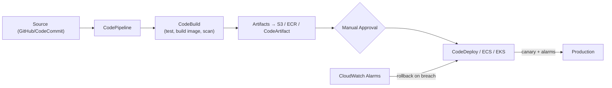
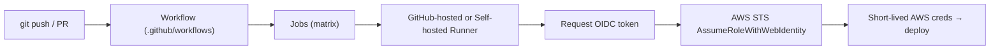

# Sections 9–10: AWS CI/CD · GitHub Actions

> Part of the [AWS Interview Preparation Roadmap](./README.md). Covers **Section 9: AWS CI/CD** and **Section 10: GitHub Actions**.

---

# SECTION 9: AWS CI/CD

## 9.1 Concept Overview

CI/CD interviews test how you ship safely and fast: pipeline design, artifact management, deployment strategies (blue/green, canary, rolling), rollbacks, and secure delivery (least-privilege, no long-lived keys). AWS's native suite is CodePipeline + CodeBuild + CodeDeploy + CodeArtifact (CodeCommit is legacy/closing to new customers — use GitHub/GitLab).

**Beginner → Expert ladder:**
- **Beginner:** CodeBuild builds, CodePipeline stages, artifacts.
- **Intermediate:** Multi-stage pipelines, approvals, CodeDeploy strategies.
- **Advanced:** Cross-account deploys, canary with CloudWatch alarms + auto-rollback, ECS/EKS deploys.
- **Expert:** Progressive delivery at fleet scale, supply-chain security, deployment safety (bake time, guardrails).

## 9.2 Architecture

## 9.3 Core Components

| Service | Role |
|---------|------|
| **CodePipeline** | Orchestrates stages (source→build→test→deploy) |
| **CodeBuild** | Managed build/test compute (buildspec.yml) |
| **CodeDeploy** | Deploys to EC2/ASG, ECS, Lambda with strategies |
| **CodeArtifact** | Private package registry (npm, pip, Maven) |
| **CodeCommit** | Managed Git (legacy; prefer GitHub) |
| **S3/ECR** | Artifact/image storage |

## 9.4 Internal Working

**Deployment strategies:**
- **Rolling:** Replace instances/tasks in batches; simple, some capacity churn.
- **Blue/Green:** Stand up a full new environment, shift traffic (ALB/Route 53), instant rollback by shifting back. Zero-downtime, higher cost during overlap.
- **Canary:** Send a small % to the new version, watch alarms/SLOs, then ramp. CodeDeploy supports `Canary10Percent5Minutes`, etc., with automatic rollback on CloudWatch alarm.

**CodeDeploy mechanics:** An `appspec` defines hooks (BeforeInstall, AfterInstall, ValidateService). For ECS/Lambda it manages traffic shifting via the load balancer/aliases; for EC2/ASG it uses the agent to orchestrate lifecycle + health checks, rolling back if the deployment fails or an alarm fires.

**Cross-account deploy:** Pipeline in a tooling account assumes a deploy role in each target account (KMS-encrypted artifacts shared via bucket/key policies).

## 9.5 Real-World Use Cases

- **Container delivery:** GitHub → CodeBuild (build+scan image → ECR) → CodeDeploy/ECS blue-green.
- **Serverless:** SAM/CDK pipeline with canary Lambda aliases + alarms.
- **Multi-account promotion:** dev→staging→prod with approvals and cross-account roles.

## 9.6 Important AWS Services

CodePipeline, CodeBuild, CodeDeploy, CodeArtifact, ECR, S3, CloudWatch (alarms/rollback), EventBridge (triggers), IAM (cross-account roles), SNS (approvals/notifications).

## 9.7 Common Interview Questions

1. **Blue/green vs canary vs rolling?** Full swap vs gradual % with monitoring vs batch replacement — trade cost vs risk vs speed.
2. **How does automatic rollback work?** CodeDeploy watches CloudWatch alarms; on breach it shifts traffic back / redeploys last good.
3. **Where do artifacts live?** S3 (files), ECR (images), CodeArtifact (packages).
4. **How to secure a pipeline?** Least-privilege stage roles, no static creds, artifact encryption (KMS), scan images, manual approval for prod.
5. **buildspec.yml phases?** install → pre_build → build → post_build, with artifacts/cache sections.

## 9.8 Advanced Interview Questions

1. **Design cross-account, multi-Region delivery.** Central pipeline, per-account deploy roles, KMS-shared artifacts, Region fan-out with independent approvals + bake times.
2. **How do you guarantee safe prod deploys?** Canary + SLO alarms + bake time + auto-rollback + feature flags + change freeze windows.
3. **Secrets in CI without leakage?** Secrets Manager/SSM at runtime, OIDC to short-lived roles, masked logs, no plaintext env in repo.

## 9.9 FAANG-Level Deep Dive Questions

1. **Progressive delivery for 1000 microservices.** Standardized pipeline template, GitOps for K8s (Argo Rollouts canaries), automated metric analysis (error rate/latency), automatic rollback, and per-service SLO gates.
2. **Deployment blast-radius control.** Cell-by-cell/Region-by-Region rollout, wave-based promotion, one-box (canary host) first, automated halt on regression.
3. **Supply-chain hardening end-to-end.** Signed commits, pinned deps (CodeArtifact), SBOM, image signing (cosign), admission verification, provenance (SLSA).

## 9.10 Troubleshooting Scenarios

- **Pipeline stuck in Source:** Webhook/connection broken or branch filter mismatch.
- **Build fails only in CI:** Missing env/cache, arch mismatch, or IAM permission for ECR/S3.
- **Deploy succeeds but app unhealthy:** Health-check/appspec validation gap; add ValidateService hook + alarms.
- **Rollback loops:** Alarm too sensitive or bad "last good"; fix thresholds and pin known-good.

## 9.11 Production Best Practices

- Immutable artifacts promoted across stages (build once, deploy many).
- Canary + alarms + auto-rollback; manual approval only where risk warrants.
- Least-privilege per-stage roles; encrypt artifacts; scan images/deps.
- Everything in code (pipeline as code via CDK/CFN/Terraform).

## 9.12 Security Considerations

- OIDC/short-lived roles; no long-lived keys in CI.
- KMS-encrypt artifacts; restrict cross-account bucket/key policies.
- Image/dependency scanning gates; signed images; least-privilege deploy roles.

## 9.13 Cost Optimization Strategies

- Cache dependencies/layers in CodeBuild; use ARM/Graviton build fleets.
- Right-size build compute; clean old artifacts (S3 lifecycle, ECR lifecycle).

## 9.14 Sample Answers

> **"How do you deploy to production safely?"** *"Build the artifact once and promote the same immutable image through environments. Prod uses a canary — CodeDeploy (or Argo Rollouts on EKS) shifts ~10% of traffic to the new version while CloudWatch alarms watch error rate and latency against SLOs. If an alarm breaches during the bake window, it auto-rolls back to the last known-good. High-risk changes get a manual approval and a change-freeze check. Pipeline roles are least-privilege and authenticate via OIDC, and artifacts are KMS-encrypted."*

## 9.15 Follow-up Questions Interviewers Ask

- "What metrics gate your canary?"
- "How do you roll back a database migration?" (expand/contract, backward-compatible migrations).
- "How do you deploy to 20 Regions without a bad global rollout?"

## 9.16 AWS Documentation Links

- CodePipeline: https://docs.aws.amazon.com/codepipeline/latest/userguide/
- CodeBuild: https://docs.aws.amazon.com/codebuild/latest/userguide/
- CodeDeploy: https://docs.aws.amazon.com/codedeploy/latest/userguide/
- CodeArtifact: https://docs.aws.amazon.com/codeartifact/latest/ug/

## 9.17 Hands-On Labs

1. Build a GitHub → CodeBuild → ECR → ECS blue/green pipeline with auto-rollback on a CloudWatch alarm.
2. Add a manual approval + SNS notification before prod.
3. Configure cross-account deploy with an assumed role and KMS-shared artifacts.

## 9.18 Comparison with Azure and GCP

| Concept | AWS | Azure | GCP |
|---------|-----|-------|-----|
| Pipeline orchestration | CodePipeline | Azure Pipelines | Cloud Build / Cloud Deploy |
| Build | CodeBuild | Azure Pipelines agents | Cloud Build |
| Deploy strategies | CodeDeploy | Azure DevOps / Deployment | Cloud Deploy |
| Package registry | CodeArtifact | Azure Artifacts | Artifact Registry |

**Key differences:** Azure DevOps Pipelines is a more mature, unified CI/CD product than AWS's modular Code* suite; many AWS shops actually use GitHub Actions or GitLab for CI and AWS only for deploy. GCP splits build (Cloud Build) and delivery (Cloud Deploy).

---

# SECTION 10: GITHUB ACTIONS

## 10.1 Concept Overview

GitHub Actions is the most common CI for AWS workloads today. The senior-level signal is **OIDC federation to AWS (no long-lived keys)**, reusable/composite workflows, matrix builds, runner security, and hardening against supply-chain attacks (pinned actions, least-privilege `GITHUB_TOKEN`).

**Beginner → Expert ladder:**
- **Beginner:** workflows, jobs, steps, triggers.
- **Intermediate:** matrix builds, caching, artifacts, environments/approvals.
- **Advanced:** OIDC to AWS, reusable workflows, self-hosted runners.
- **Expert:** runner isolation/ephemerality, supply-chain hardening, org-wide governance.

## 10.2 Architecture

## 10.3 Core Components

| Component | Purpose |
|-----------|---------|
| **Workflow** | YAML pipeline triggered by events |
| **Job** | Group of steps on one runner |
| **Step/Action** | Unit of work; reusable Action from marketplace/local |
| **Runner** | GitHub-hosted (ephemeral) or self-hosted (yours) |
| **Matrix** | Fan-out across versions/OSes/arches |
| **Reusable workflow** | `workflow_call` for DRY org standards |
| **OIDC** | Federated short-lived AWS creds |
| **Environments** | Protection rules, approvals, secrets scoping |

## 10.4 Internal Working

**OIDC to AWS (the key pattern):** GitHub issues a signed **OIDC JWT** for the workflow run (claims: `repo`, `ref`, `environment`, `sub`). The `aws-actions/configure-aws-credentials` action calls `sts:AssumeRoleWithWebIdentity`; the IAM role's trust policy pins the GitHub OIDC provider and conditions on `token.actions.githubusercontent.com:sub` (e.g., `repo:org/name:ref:refs/heads/main`). Result: short-lived creds, **no stored access keys**.

**Reusable & composite workflows:** `workflow_call` centralizes standard build/deploy logic; composite actions bundle steps. This enforces org-wide security/quality gates.

**Runner security:** GitHub-hosted runners are ephemeral (fresh VM per job). Self-hosted runners must be **ephemeral and isolated** (per-job, no persistent secrets, ideally in a locked-down account/VPC) — a persistent self-hosted runner on a public repo is a classic RCE vector.

## 10.5 Real-World Use Cases

- **Deploy to EKS/ECS:** OIDC → assume role → `kubectl`/`aws ecs update-service`.
- **Terraform CI:** plan on PR, apply on merge via OIDC role.
- **Multi-arch image build:** matrix (amd64/arm64) → ECR.

## 10.6 Important AWS Integrations

IAM OIDC provider, STS, ECR, EKS/ECS, S3, `aws-actions/configure-aws-credentials`, `amazon-ecr-login`.

## 10.7 Common Interview Questions

1. **How do you auth GitHub Actions to AWS without keys?** OIDC federation + `AssumeRoleWithWebIdentity`; trust policy scoped to repo/branch.
2. **Hosted vs self-hosted runners?** Hosted = ephemeral, managed; self-hosted = your compute (needed for VPC access/special hardware) but you own security.
3. **What is a matrix build?** Parallel fan-out across dimensions (versions/OS/arch).
4. **How to reuse pipeline logic?** Reusable (`workflow_call`) and composite actions.
5. **How do you scope secrets?** Environment-level secrets + required reviewers.

## 10.8 Advanced Interview Questions

1. **Lock OIDC trust down precisely.** Condition on `sub` = `repo:org/repo:ref:refs/heads/main` (or `environment:prod`), `aud` = `sts.amazonaws.com`; avoid wildcards that let forks/branches assume the role.
2. **Secure self-hosted runners.** Ephemeral per-job, isolated account/VPC, no privileged Docker, no secrets on disk, restrict to private repos.
3. **Prevent malicious third-party actions.** Pin to a commit SHA (not a moving tag), allow-list actions org-wide, review permissions.

## 10.9 FAANG-Level Deep Dive Questions

1. **Design org-wide CI governance for 500 repos.** Reusable workflows enforcing scan/sign/test, org allow-list of actions pinned by SHA, OIDC roles per environment with tight `sub` conditions, mandatory environments/approvals for prod, and centralized audit.
2. **Supply-chain hardening.** Least-privilege `GITHUB_TOKEN` (`permissions:` block), pinned actions, dependency review, SBOM, image signing, provenance (SLSA), secret scanning.
3. **Compare with AWS CodePipeline for an AWS-only shop.** Actions wins on developer ergonomics, ecosystem, and cross-cloud; CodePipeline wins on deep AWS-native integration, in-VPC execution without self-hosted runners, and IAM-native security boundaries.

## 10.10 Troubleshooting Scenarios

- **`Not authorized to perform sts:AssumeRoleWithWebIdentity`:** Trust policy `sub`/`aud` mismatch or missing OIDC provider thumbprint.
- **Secrets empty in PR from fork:** Secrets aren't exposed to fork PRs by design; use `pull_request_target` carefully or approvals.
- **Self-hosted runner offline/hijack risk:** Runner not ephemeral; rebuild as ephemeral, rotate registration tokens.
- **Cache miss every run:** Wrong cache key; include lockfile hash.

## 10.11 Production Best Practices

- OIDC everywhere; zero long-lived AWS keys.
- Pin actions by SHA; least-privilege `permissions:`; environment approvals for prod.
- Ephemeral isolated self-hosted runners only when necessary.
- Reusable workflows for standardized, auditable delivery.

## 10.12 Security Considerations

- Scope OIDC trust to exact repo/branch/environment.
- Mask secrets, avoid echoing; secret scanning + Dependabot.
- Restrict `GITHUB_TOKEN` permissions to minimum; disable auto-approve.

## 10.13 Cost Optimization Strategies

- Cache deps/layers; use larger runners only when they cut wall-clock cost; ARM runners.
- Self-hosted on Spot for heavy/long jobs; concurrency limits to avoid waste.

## 10.14 Sample Answers

> **"How do you deploy to AWS from GitHub Actions securely?"** *"I never store AWS access keys. I create an IAM OIDC identity provider for `token.actions.githubusercontent.com`, then a deploy role whose trust policy conditions on the exact `sub` — e.g., `repo:myorg/myapp:ref:refs/heads/main` and `aud` `sts.amazonaws.com`. The workflow requests an OIDC token, `configure-aws-credentials` calls `AssumeRoleWithWebIdentity`, and gets short-lived creds scoped by that role. Actions are pinned to commit SHAs, `GITHUB_TOKEN` permissions are minimized, and prod deploys require an environment approval."*

## 10.15 Follow-up Questions Interviewers Ask

- "How do you stop a feature branch from assuming the prod role?"
- "Why pin actions to a SHA instead of a tag?"
- "When is a self-hosted runner worth the risk?"

## 10.16 Documentation Links

- GitHub Actions OIDC with AWS: https://docs.github.com/actions/deployment/security-hardening-your-deployments/configuring-openid-connect-in-amazon-web-services
- configure-aws-credentials: https://github.com/aws-actions/configure-aws-credentials
- Reusable workflows: https://docs.github.com/actions/using-workflows/reusing-workflows
- Security hardening: https://docs.github.com/actions/security-guides/security-hardening-for-github-actions

## 10.17 Hands-On Labs

1. Set up an IAM OIDC provider + deploy role scoped to `main`; deploy to ECS from Actions with no static keys.
2. Convert a workflow into a reusable `workflow_call` and consume it from two repos.
3. Add a matrix build for amd64+arm64 images pushed to ECR; pin all actions by SHA.

## 10.18 Comparison with Azure and GCP

| Concept | GitHub Actions → AWS | Azure DevOps/GitHub → Azure | GCP |
|---------|----------------------|------------------------------|-----|
| Keyless auth | OIDC → STS AssumeRole | OIDC → Entra workload federation | OIDC → Workload Identity Federation |
| Native CI | (GH Actions) | Azure Pipelines | Cloud Build |
| Runners | GitHub-hosted/self-hosted | Microsoft-hosted/self-hosted | Cloud Build workers |

**Key differences:** All three clouds now support GitHub OIDC federation for keyless deploys; the trust-condition mechanics differ (`sub` claim on AWS, federated credential on Azure, attribute mapping on GCP). Azure DevOps remains a stronger first-party end-to-end CI/CD than AWS's native suite.

---

> Next: **[Sections 11–12 — Observability/SRE & Security](./09-OBSERVABILITY-SECURITY.md)**.
