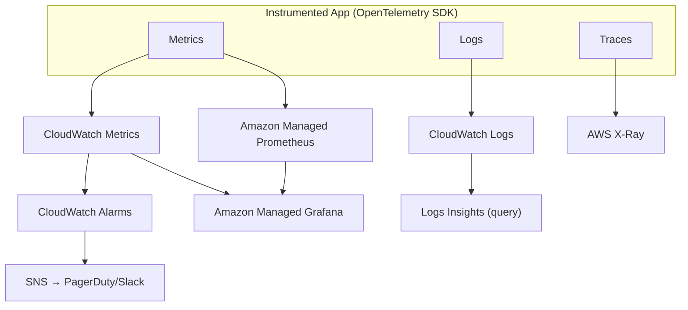
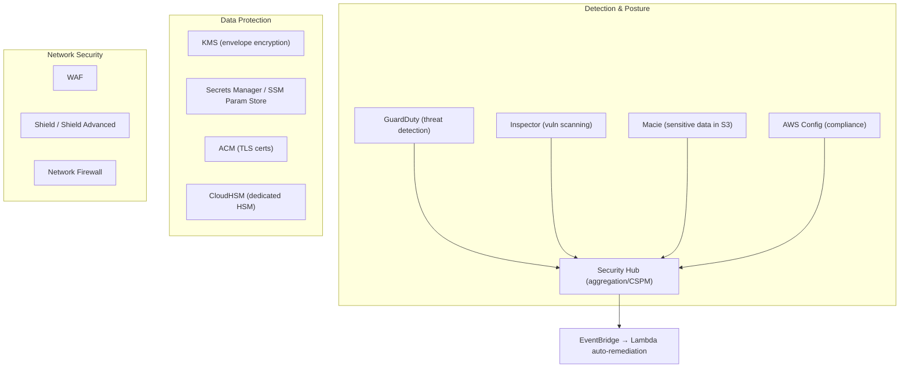

# Sections 11–12: Observability & SRE · AWS Security

> Part of the [AWS Interview Preparation Roadmap](./README.md). Covers **Section 11: Observability & SRE** and **Section 12: AWS Security**.

---

# SECTION 11: OBSERVABILITY & SRE

## 11.1 Concept Overview

Observability = the ability to ask arbitrary questions about your system's state from its outputs: **metrics, logs, traces** (the three pillars) plus events. SRE layers reliability engineering on top: **SLIs/SLOs/error budgets**, incident management, and blameless postmortems. Senior interviews want you to define good SLIs, reason about alerting on symptoms not causes, and debug distributed systems with traces.

**Beginner → Expert ladder:**
- **Beginner:** CloudWatch metrics/logs/alarms.
- **Intermediate:** dashboards, X-Ray tracing, structured logs, RED/USE methods.
- **Advanced:** SLO/error-budget policy, AMP/AMG (Prometheus/Grafana), OpenTelemetry.
- **Expert:** high-cardinality observability, alert fatigue reduction, incident command, capacity planning.

## 11.2 Architecture

## 11.3 Core Components

| Pillar | AWS service | Notes |
|--------|-------------|-------|
| Metrics | CloudWatch, AMP | Numeric time-series; alarms; Prometheus-compatible via AMP |
| Logs | CloudWatch Logs, Logs Insights | Structured JSON preferred; query with Insights |
| Traces | X-Ray, OTel | Distributed request tracing, service maps |
| Dashboards | CloudWatch Dashboards, AMG | AMG = managed Grafana |
| Audit/config | CloudTrail, AWS Config | API audit + resource compliance |
| Alerting | CloudWatch Alarms → SNS → PagerDuty | Alert on symptoms/SLOs |

## 11.4 Internal Working / SRE Concepts

**SLI / SLO / SLA:**
- **SLI** = a measured indicator (e.g., % of requests <300 ms and 2xx/3xx over 5 min).
- **SLO** = the target for an SLI (e.g., 99.9% success monthly).
- **SLA** = the contractual promise (usually looser than the SLO), with penalties.

**Error budget:** `1 − SLO`. A 99.9% SLO allows ~43 min/month of unavailability. When the budget is healthy, ship faster; when exhausted, freeze features and focus on reliability. This ties reliability to release velocity objectively.

**Alerting philosophy:** Alert on **symptoms** (user-facing SLO burn) not causes; use **multi-window burn-rate** alerts (fast burn = page now, slow burn = ticket) to cut false pages.

**RED vs USE:**
- **RED** (services): Rate, Errors, Duration.
- **USE** (resources): Utilization, Saturation, Errors.

**Incident management:** Detect → declare → assign Incident Commander → mitigate (restore service first) → communicate → resolve → blameless postmortem with action items. RCA uses techniques like 5 Whys / causal analysis; the goal is systemic fixes, not blame.

## 11.5 Real-World Use Cases

- **EKS observability stack:** OTel/Prometheus → AMP, dashboards in AMG, traces in X-Ray, Container Insights for pod/node metrics.
- **SLO program:** Define SLIs per service, error-budget policy gating releases, burn-rate alerts to PagerDuty.
- **Cost/perf triage:** Logs Insights + X-Ray service map to find the slow dependency.

## 11.6 Important AWS Services

CloudWatch (Metrics/Logs/Alarms/Insights/Container Insights/Synthetics/RUM), X-Ray, AMP, AMG, CloudTrail, AWS Config, OpenTelemetry (ADOT), DevOps Guru.

## 11.7 Common Interview Questions

1. **SLI vs SLO vs SLA?** Measured indicator vs internal target vs external contract.
2. **What is an error budget and how is it used?** `1−SLO`; governs release velocity vs reliability focus.
3. **Three pillars of observability?** Metrics, logs, traces (+ events).
4. **RED vs USE?** Service (Rate/Errors/Duration) vs resource (Utilization/Saturation/Errors).
5. **Why alert on symptoms?** Reduces noise; users care about outcomes, not causes.
6. **CloudWatch vs Prometheus?** CloudWatch native/managed; Prometheus (AMP) for K8s-native, high-cardinality, PromQL.

## 11.8 Advanced Interview Questions

1. **Design a burn-rate alerting scheme.** Multi-window (e.g., 5m & 1h for fast burn; 1h & 6h for slow burn) to page on real budget threats and ticket on slow leaks.
2. **How do you trace a request across 15 microservices?** Propagate trace context (W3C/OTel) end-to-end; X-Ray/Grafana Tempo service map; correlate with logs via trace ID.
3. **Reduce alert fatigue.** SLO-based alerts, deduplication, dependency-aware suppression, ownership routing, and regular alert reviews.
4. **High-cardinality metrics cost blowup — fix.** Limit labels, aggregate, use exemplars/traces for detail, sample, and set retention tiers.

## 11.9 FAANG-Level Deep Dive Questions

1. **Design observability for a global platform (millions RPS).** OTel instrumentation, regional AMP + central AMG, sampling for traces, log tiering to S3, SLO dashboards + burn-rate paging, and automated anomaly detection (DevOps Guru/ML).
2. **Define SLOs for a checkout service and defend them.** Availability (success ratio) + latency (p99) + correctness; targets from user impact + business tolerance; error budget policy for release gating.
3. **Postmortem for a cascading failure.** Timeline, contributing factors (retry storms, no circuit breakers, undersized DB pool), systemic fixes (backpressure, jittered retries, load shedding, capacity), and follow-up tracking.

## 11.10 Troubleshooting Scenarios (Production Incidents)

- **Latency spike, no errors:** Downstream saturation; check USE on DB/cache, X-Ray for the slow span.
- **Error budget burning fast:** Recent deploy; roll back, then RCA.
- **Missing metrics/logs:** Agent/OTel collector down, IAM perms, or log group misconfig.
- **Retry storm / cascading failure:** Add jittered exponential backoff, circuit breakers, load shedding, and concurrency limits.

## 11.11 Production Best Practices

- Instrument with OpenTelemetry (vendor-neutral); structured JSON logs with trace IDs.
- SLOs per service + error-budget policy; symptom-based, multi-window alerts.
- Dashboards as code; runbooks linked from alerts; on-call rotation + blameless postmortems.
- Retain hot logs short, archive to S3; sample traces.

## 11.12 Security Considerations

- CloudTrail org trail (immutable, log-archive account); GuardDuty + Security Hub findings into the same pipeline.
- Protect log integrity (KMS, Object Lock); least-privilege on dashboards/queries.

## 11.13 Cost Optimization Strategies

- Log retention tiers + S3 archive; drop noisy logs at source; metric filters instead of full-text.
- Trace sampling; limit metric cardinality; consolidate dashboards.

## 11.14 Sample Answers

> **"How do you set SLOs and use error budgets?"** *"I define SLIs from the user's perspective — for an API, the fraction of requests that return success within a latency threshold. The SLO is the target, say 99.9% monthly, which gives ~43 minutes of error budget. We alert on burn rate with multiple windows so a fast burn pages immediately and a slow burn opens a ticket. The error budget also governs delivery: while budget is healthy we ship features; if we exhaust it, we freeze feature work and invest in reliability until we're back on track. It makes the reliability-vs-velocity trade-off objective instead of political."*

## 11.15 Follow-up Questions Interviewers Ask

- "What makes a *good* SLI?"
- "How do you stop retry storms?"
- "Walk me through your last incident and postmortem."

## 11.16 AWS Documentation Links

- CloudWatch: https://docs.aws.amazon.com/AmazonCloudWatch/latest/monitoring/
- X-Ray: https://docs.aws.amazon.com/xray/latest/devguide/
- AMP: https://docs.aws.amazon.com/prometheus/latest/userguide/
- AMG: https://docs.aws.amazon.com/grafana/latest/userguide/
- Google SRE Book (SLOs): https://sre.google/books/

## 11.17 Hands-On Labs

1. Instrument an app with ADOT (OpenTelemetry) → traces to X-Ray, metrics to AMP, view in AMG.
2. Define an SLO + multi-window burn-rate alarms → SNS → Slack.
3. Use Logs Insights to find the slowest endpoint and correlate with a trace ID.

## 11.18 Comparison with Azure and GCP

| Concept | AWS | Azure | GCP |
|---------|-----|-------|-----|
| Metrics/logs | CloudWatch | Azure Monitor / Log Analytics | Cloud Monitoring / Logging |
| Tracing | X-Ray | Application Insights | Cloud Trace |
| Managed Prometheus | AMP | Azure Managed Prometheus | Managed Service for Prometheus |
| Managed Grafana | AMG | Azure Managed Grafana | (Grafana via Marketplace) |

**Key differences:** All three converge on OpenTelemetry + managed Prometheus/Grafana. Azure's Application Insights is a more integrated APM than X-Ray; GCP's operations suite (ex-Stackdriver) is tightly coupled to GKE.

---

# SECTION 12: AWS SECURITY

## 12.1 Concept Overview

Security is evaluated across identity (covered in Section 2), data protection (encryption/KMS), detection (GuardDuty/Security Hub), and network security (Section 3). Senior interviews expect **defense in depth**, **least privilege**, **encryption everywhere**, and the ability to **threat-model** and respond to incidents.

**Beginner → Expert ladder:**
- **Beginner:** KMS encryption, security groups, GuardDuty on.
- **Intermediate:** envelope encryption, Secrets Manager rotation, Security Hub/Config.
- **Advanced:** CMK key policies, multi-account security (delegated admin), threat modeling.
- **Expert:** incident response automation, detection engineering, data-perimeter design.

## 12.2 Architecture

## 12.3 Core Components

| Service | Purpose |
|---------|---------|
| **GuardDuty** | ML/threat-intel detection from CloudTrail/VPC/DNS/EKS logs |
| **Security Hub** | Aggregates findings, CSPM against standards (CIS, FSBP) |
| **Inspector** | Continuous CVE scanning of EC2/ECR/Lambda |
| **Macie** | Discovers sensitive data (PII) in S3 |
| **KMS** | Managed keys + envelope encryption |
| **CloudHSM** | Single-tenant FIPS 140-2 L3 HSM |
| **Secrets Manager** | Secret storage + automatic rotation |
| **Parameter Store** | Config/secret storage (cheaper, no auto-rotation) |
| **ACM** | Public/private TLS certificates |
| **WAF/Shield/Network Firewall** | L7 filtering / DDoS / L3-7 network filtering |

## 12.4 Internal Working

**Envelope encryption (KMS):** Data is encrypted with a **data key (DEK)**; the DEK is encrypted by a **CMK** in KMS and stored alongside the ciphertext. To decrypt, the service calls `kms:Decrypt` on the wrapped DEK (authorized by the key policy), then decrypts data locally. The CMK never leaves KMS. This scales (bulk data encrypted locally) and centralizes access control + audit (CloudTrail logs every key use).

**Key policies vs IAM:** A KMS key's **key policy** is the root of authority; IAM policies only work if the key policy delegates to IAM. Cross-account key use requires the key policy to allow the external principal. Automatic annual rotation re-keys the CMK's backing material transparently.

**Secrets rotation:** Secrets Manager invokes a rotation Lambda on a schedule (e.g., 30 days) that creates a new secret version, updates the resource (e.g., RDS password), and flips the `AWSCURRENT` label — zero-downtime if apps fetch on demand.

**Detection pipeline:** GuardDuty analyzes logs for anomalies (crypto-mining, credential exfiltration, recon); findings flow to Security Hub; EventBridge rules trigger auto-remediation Lambdas (e.g., isolate an instance, revoke keys).

## 12.5 Real-World Use Cases

- **Encrypt everything:** EBS/S3/RDS with SSE-KMS CMKs; TLS via ACM; secrets in Secrets Manager.
- **Multi-account security:** Delegated admin (security account) aggregating GuardDuty/Security Hub/Config org-wide.
- **Auto-remediation:** Security Hub finding → EventBridge → Lambda quarantines a compromised instance.

## 12.6 Important AWS Services

IAM/STS (Section 2), KMS, CloudHSM, Secrets Manager, SSM Parameter Store, ACM, GuardDuty, Security Hub, Inspector, Macie, Config, WAF, Shield, Network Firewall, CloudTrail, Detective.

## 12.7 Common Interview Questions

1. **What is envelope encryption?** Encrypt data with a DEK; encrypt the DEK with a KMS CMK; store the wrapped DEK with the data.
2. **KMS key policy vs IAM?** Key policy is authoritative; IAM only applies if the key policy allows it.
3. **Secrets Manager vs Parameter Store?** Secrets Manager auto-rotates and is purpose-built for secrets; Parameter Store is cheaper for config (SecureString via KMS, no auto-rotation).
4. **GuardDuty vs Inspector vs Macie?** Threat detection vs vulnerability scanning vs sensitive-data discovery.
5. **WAF vs Shield?** WAF = L7 rule filtering; Shield = DDoS protection (Advanced adds L3/4/7 + response team).
6. **How to encrypt data in transit?** TLS everywhere (ACM certs), enforce `aws:SecureTransport`.

## 12.8 Advanced Interview Questions

1. **Design cross-account encryption.** CMK in the owning account with a key policy granting the external principal `kms:Decrypt`/`GenerateDataKey`; grants or role-based access; audit via CloudTrail.
2. **Data perimeter.** SCPs + resource policies + VPC endpoint policies so only trusted identities from trusted networks access trusted resources (blocks data exfiltration).
3. **Rotate a leaked credential automatically.** GuardDuty finding → EventBridge → Lambda disables the key, rotates the secret, and alerts.
4. **When CloudHSM over KMS?** Regulatory need for single-tenant FIPS 140-2 L3, custom crypto, or key custody requirements.

## 12.9 FAANG-Level Deep Dive Questions

1. **Threat-model a public API on EKS.** Enumerate assets/entry points; controls: WAF+Shield, TLS/mTLS, IRSA least-privilege, NetworkPolicies, secrets in KMS, image signing/admission, GuardDuty EKS Protection, audit logging; STRIDE per component.
2. **Design incident response for account compromise.** Contain (revoke sessions/keys, isolate), eradicate (rotate secrets, rebuild), recover (from immutable backups), and post-incident (detections + guardrails). Automate with runbooks + EventBridge.
3. **Zero-trust on AWS.** Short-lived creds everywhere, identity-aware access, micro-segmentation, continuous verification, encryption, and data-perimeter guardrails.

## 12.10 Troubleshooting Scenarios

- **`AccessDenied` decrypting S3 object:** Missing `kms:Decrypt` on the CMK (need both S3 and KMS perms).
- **Cross-account KMS fails:** Key policy doesn't grant the external principal.
- **Secret rotation broke the app:** App caches old secret; fetch on demand / handle rotation.
- **GuardDuty flood of findings:** Tune suppression rules; triage by severity; auto-remediate known-benign.

## 12.11 Production Best Practices

- Encrypt at rest (KMS CMKs) and in transit (TLS) by default; rotate keys/secrets.
- GuardDuty + Security Hub + Config + CloudTrail enabled org-wide via delegated admin.
- Least privilege + permission boundaries + SCP guardrails; no long-lived keys.
- Auto-remediation for high-severity findings; immutable, tested backups.

## 12.12 Security Considerations (Defense in Depth)

- Identity (Section 2), network (Section 3), data (KMS), detection (GuardDuty/Security Hub), response automation — layered so one failure isn't catastrophic.
- Data perimeter to prevent exfiltration; Object Lock/Vault Lock against ransomware.

## 12.13 Cost Optimization Strategies

- Parameter Store for non-secret config (cheaper than Secrets Manager).
- Right-size GuardDuty/Inspector scope; consolidate findings; scope Macie scans to sensitive buckets.
- Reuse CMKs sensibly (balance blast radius vs key-count cost).

## 12.14 Sample Answers

> **"Explain envelope encryption and why AWS uses it."** *"Instead of sending all your data to KMS, the service generates a data key locally, uses it to encrypt the data, then asks KMS to encrypt that data key with your customer-managed CMK. It stores the encrypted data key next to the ciphertext. To read, it calls `kms:Decrypt` on the wrapped data key — authorized by the key policy and logged in CloudTrail — then decrypts locally. The CMK never leaves KMS, bulk crypto happens on the service side for performance, and you get centralized access control, rotation, and a full audit trail. That's why S3, EBS, and RDS all use it under the hood."*

## 12.15 Follow-up Questions Interviewers Ask

- "Why do you need both S3 and KMS permissions to read an encrypted object?"
- "How would you automatically contain a compromised EC2 instance?"
- "KMS vs CloudHSM — when is the extra cost justified?"

## 12.16 AWS Documentation Links

- KMS: https://docs.aws.amazon.com/kms/latest/developerguide/
- Secrets Manager: https://docs.aws.amazon.com/secretsmanager/latest/userguide/
- GuardDuty: https://docs.aws.amazon.com/guardduty/latest/ug/
- Security Hub: https://docs.aws.amazon.com/securityhub/latest/userguide/
- Well-Architected Security Pillar: https://docs.aws.amazon.com/wellarchitected/latest/security-pillar/welcome.html

## 12.17 Hands-On Labs

1. Create a CMK; encrypt an S3 bucket + EBS volume; test cross-account decrypt via key policy.
2. Store an RDS credential in Secrets Manager with 30-day rotation; verify zero-downtime rotation.
3. Enable GuardDuty + Security Hub; build an EventBridge→Lambda auto-remediation for a finding.

## 12.18 Comparison with Azure and GCP

| Concept | AWS | Azure | GCP |
|---------|-----|-------|-----|
| Key management | KMS / CloudHSM | Key Vault / Managed HSM | Cloud KMS / Cloud HSM |
| Secrets | Secrets Manager / SSM | Key Vault | Secret Manager |
| Threat detection | GuardDuty | Defender for Cloud | Security Command Center |
| SIEM | Security Lake + partners | Microsoft Sentinel | Chronicle |
| Vuln scanning | Inspector | Defender | Container/Artifact scanning |
| WAF/DDoS | WAF / Shield | WAF / DDoS Protection | Cloud Armor |

**Key differences:** Azure bundles detection + CSPM + workload protection under Defender for Cloud and has a first-party SIEM (Sentinel); AWS splits GuardDuty/Security Hub/Inspector/Macie and uses Security Lake + partners for SIEM. Envelope-encryption and key-policy concepts map closely across all three.

---

> Next: **[Sections 13–14 — Databases & Event-Driven](./10-DATABASES-EVENTDRIVEN.md)**.
