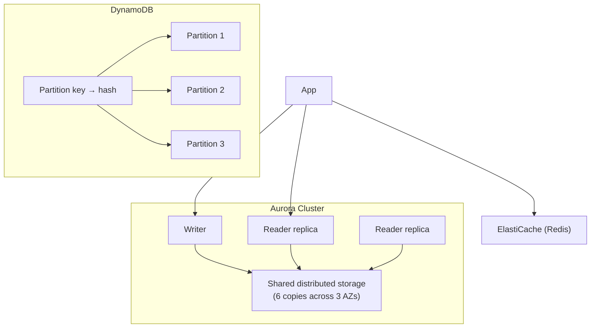
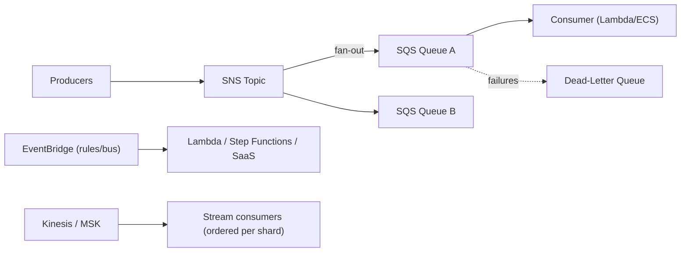

# Sections 13–14: AWS Databases · Event-Driven Architecture

> Part of the [AWS Interview Preparation Roadmap](./README.md). Covers **Section 13: AWS Databases** and **Section 14: Event-Driven Architecture**.

---

# SECTION 13: AWS DATABASES

## 13.1 Concept Overview

Database interviews test whether you can match a workload to the right engine and reason about **replication, consistency, partitioning/sharding, and the CAP/PACELC trade-offs**. The core skill: pick relational vs NoSQL vs cache vs warehouse for the access pattern, and defend it.

**Beginner → Expert ladder:**
- **Beginner:** RDS engines, Multi-AZ, read replicas, DynamoDB basics.
- **Intermediate:** Aurora architecture, DynamoDB partition keys/GSIs, ElastiCache patterns.
- **Advanced:** Aurora Global, DynamoDB adaptive capacity/hot partitions, consistency tuning.
- **Expert:** multi-Region active-active, sharding strategies, CAP/PACELC reasoning at scale.

## 13.2 Architecture

## 13.3 Core Components

| Service | Type | Best for |
|---------|------|----------|
| **RDS** | Managed relational (MySQL/PostgreSQL/MariaDB/Oracle/SQL Server) | OLTP, existing SQL apps |
| **Aurora** | Cloud-native MySQL/PostgreSQL | High-throughput OLTP, HA, read scaling |
| **DynamoDB** | Managed NoSQL key-value/document | Internet-scale, predictable low latency |
| **ElastiCache** | Redis/Memcached | Caching, sessions, leaderboards |
| **Redshift** | Columnar warehouse | Analytics/OLAP |
| **Neptune** | Graph | Relationships, fraud, social |
| **DocumentDB** | MongoDB-compatible | Document workloads |

## 13.4 Internal Working

**RDS Multi-AZ:** Synchronous standby in another AZ; failover (60–120 s) via DNS CNAME flip on primary failure. Read replicas are **asynchronous** and for scaling reads, not HA (though you can promote).

**Aurora storage:** Decouples compute from a **distributed, log-structured storage layer** replicating **6 copies across 3 AZs** (4/6 write quorum, 3/6 read quorum). Replicas share the same storage (no re-replication), so adding readers is cheap and failover is fast (~30 s). Aurora Global adds cross-Region replication with ~1 s lag and <1 min RPO for DR.

**DynamoDB partitioning:** Items are distributed by a hash of the **partition key**. Each partition holds ~10 GB and caps throughput (~3000 RCU/1000 WCU). A **hot partition** (skewed key) throttles even if total capacity is high. Fixes: high-cardinality keys, **write sharding** (suffix the key), or adaptive capacity (automatic, but design still matters). **GSIs** enable alternate query patterns (async-updated, eventually consistent).

**Consistency:** DynamoDB offers eventually consistent reads (default, cheaper) or strongly consistent reads (option, on the same partition). Global Tables are multi-Region, multi-active with **last-writer-wins** conflict resolution (eventually consistent across Regions).

**CAP/PACELC:** During a partition you trade Consistency vs Availability; **even without partitions** you trade Latency vs Consistency (PACELC). DynamoDB Global Tables favor availability/latency (AP/EL); a single-Region strongly-consistent read favors consistency.

## 13.5 Real-World Use Cases

- **OLTP with read scaling:** Aurora writer + readers behind a reader endpoint.
- **Internet-scale key-value:** DynamoDB with on-demand capacity + DAX cache.
- **Analytics:** Redshift + Spectrum querying S3 data lake.
- **Session/cache:** ElastiCache Redis in front of the DB to shed read load.

## 13.6 Important AWS Services

RDS, Aurora (+ Global), DynamoDB (+ DAX, Streams, Global Tables), ElastiCache, Redshift, Neptune, DocumentDB, DMS (migration), RDS Proxy (connection pooling).

## 13.7 Common Interview Questions

1. **SQL vs NoSQL — how do you choose?** Access patterns, consistency, scale, and query flexibility. Relational for complex joins/transactions; DynamoDB for known-pattern, internet-scale, low-latency.
2. **Multi-AZ vs read replica?** Multi-AZ = HA (sync standby, failover); read replica = read scaling (async).
3. **Why is Aurora faster/more available than RDS?** Distributed 6-way storage, shared-storage replicas, fast failover, log-based writes.
4. **What is a hot partition and how do you fix it?** Skewed partition key throttling; use high-cardinality keys or write sharding.
5. **DynamoDB consistency options?** Eventually vs strongly consistent reads; Global Tables are eventually consistent, last-writer-wins.
6. **When ElastiCache?** Offload reads, sub-ms latency, sessions/leaderboards; cache-aside pattern.

## 13.8 Advanced Interview Questions

1. **Design a DynamoDB table for a chat app.** PK = conversationId, SK = timestamp; GSI for user's conversations; on-demand capacity; TTL for ephemeral messages.
2. **Aurora vs DynamoDB for a high-write ledger?** Aurora for ACID transactions + SQL; DynamoDB for extreme scale with careful key design + transactions API (limited).
3. **Connection storm on RDS from Lambda — fix?** RDS Proxy for pooling/multiplexing; or move to Aurora Serverless/DynamoDB.
4. **Explain quorum writes in Aurora.** 4/6 copies must ack a write; tolerates losing an AZ (2 copies) and still serve reads (3/6).

## 13.9 FAANG-Level Deep Dive Questions

1. **Design multi-Region active-active data.** DynamoDB Global Tables (last-writer-wins) or Aurora Global (single writer, read locally, promote on DR); handle conflict semantics and idempotency at the app layer.
2. **Shard a relational DB past a single writer.** Functional partitioning, then key-based sharding (by tenant/user), a routing layer, and cross-shard query strategy; or move hot tables to DynamoDB.
3. **Guarantee exactly-once-ish writes at scale.** Idempotency keys, conditional writes (DynamoDB `ConditionExpression`), and dedup tables; accept at-least-once + idempotent consumers.

## 13.10 Troubleshooting Scenarios

- **DynamoDB throttling (ProvisionedThroughputExceeded):** Hot partition or under-provisioned; switch to on-demand, add write sharding, or raise capacity; check `ConsumedCapacity` per partition.
- **RDS connection exhaustion:** Too many short-lived connections (Lambda); add RDS Proxy; tune pool.
- **Replica lag:** Long transactions/write spikes; scale writer, batch writes, or read from writer for critical reads.
- **Aurora failover surprise:** App didn't use the cluster endpoint; ensure reader/writer endpoints + retry logic.

## 13.11 Production Best Practices

- Multi-AZ for prod; Aurora for demanding OLTP; automated backups + PITR; test restores.
- DynamoDB on-demand (or auto-scaling) + good key design + TTL; RDS Proxy for serverless.
- Encrypt at rest (KMS) + in transit (TLS); least-privilege DB access via IAM auth where possible.

## 13.12 Security Considerations

- IAM database authentication / Secrets Manager rotation; no hardcoded creds.
- Private subnets, SG least privilege, TLS enforced; encryption with CMKs.
- Audit with database activity streams / CloudTrail.

## 13.13 Cost Optimization Strategies

- Right-size instances; Aurora Serverless v2 for spiky workloads; Reserved for steady.
- DynamoDB on-demand vs provisioned based on pattern; TTL to expire data; use DAX to cut RCU.
- Redshift RA3 + pause; move cold analytics data to S3 + Spectrum.

## 13.14 Sample Answers

> **"A DynamoDB table throttles at 2 a.m. despite high provisioned capacity — why and fix?"** *"Almost always a hot partition: the total capacity is spread across partitions by a hash of the partition key, so if one key (say a single tenant or a 'GLOBAL' bucket) gets most traffic, that partition's ~1000 WCU cap is exceeded while others sit idle. I'd confirm with per-partition CloudWatch/contributor insights, then fix the data model — increase key cardinality or apply write sharding by appending a suffix (`GLOBAL#<0-9>`) and scatter-gather on read. I'd also switch to on-demand or enable auto-scaling so bursts don't throttle, and add idempotent retries with backoff. Adaptive capacity helps but doesn't excuse a skewed key design."*

## 13.15 Follow-up Questions Interviewers Ask

- "How does Aurora achieve fast failover?"
- "How would you do multi-Region writes and handle conflicts?"
- "When would you *not* use DynamoDB?"

## 13.16 AWS Documentation Links

- RDS: https://docs.aws.amazon.com/AmazonRDS/latest/UserGuide/
- Aurora: https://docs.aws.amazon.com/AmazonRDS/latest/AuroraUserGuide/
- DynamoDB: https://docs.aws.amazon.com/amazondynamodb/latest/developerguide/
- ElastiCache: https://docs.aws.amazon.com/AmazonElastiCache/latest/
- Redshift: https://docs.aws.amazon.com/redshift/latest/mgmt/

## 13.17 Hands-On Labs

1. Deploy Aurora with a writer + 2 readers; force a failover and measure recovery.
2. Model a DynamoDB single-table design with GSIs; reproduce and fix a hot partition.
3. Put ElastiCache in front of RDS with cache-aside; measure read offload.

## 13.18 Comparison with Azure and GCP

| Concept | AWS | Azure | GCP |
|---------|-----|-------|-----|
| Managed relational | RDS | Azure SQL / Flexible Server | Cloud SQL |
| Cloud-native relational | Aurora | Azure SQL Hyperscale | AlloyDB / Spanner |
| Global NoSQL | DynamoDB (Global Tables) | Cosmos DB | Firestore / Bigtable |
| Cache | ElastiCache | Azure Cache for Redis | Memorystore |
| Warehouse | Redshift | Synapse / Fabric | BigQuery |

**Key differences:** Cosmos DB exposes **tunable consistency (5 levels)** as a first-class knob, richer than DynamoDB's eventual/strong choice; GCP Spanner offers globally-consistent SQL (TrueTime) with no direct AWS equivalent; BigQuery is serverless analytics vs Redshift's provisioned (RA3/Serverless) model.

---

# SECTION 14: EVENT-DRIVEN ARCHITECTURE

## 14.1 Concept Overview

Event-driven architecture decouples producers from consumers via queues, topics, and streams — enabling scale, resilience, and async processing. Interviews test **SNS vs SQS vs EventBridge vs Kinesis vs MSK**, delivery semantics (at-least-once), ordering, idempotency, retries, and DLQs.

**Beginner → Expert ladder:**
- **Beginner:** SQS queues, SNS topics, basic Lambda triggers.
- **Intermediate:** fan-out (SNS→SQS), FIFO vs standard, DLQs, EventBridge rules.
- **Advanced:** Kinesis shards/ordering, MSK, idempotency, exactly-once semantics.
- **Expert:** high-throughput streaming, backpressure, replay, saga/orchestration patterns.

## 14.2 Architecture

## 14.3 Core Components

| Service | Model | Use |
|---------|-------|-----|
| **SQS** | Queue (point-to-point) | Decouple, buffer, retry; Standard (at-least-once) or FIFO (ordered, exactly-once processing) |
| **SNS** | Pub/sub topic | Fan-out to many subscribers (SQS, Lambda, HTTP) |
| **EventBridge** | Event bus + routing | Event-driven integration, SaaS events, scheduling, filtering |
| **Kinesis Data Streams** | Sharded log | Ordered, replayable streaming; multiple consumers |
| **Kinesis Firehose** | Delivery stream | Load streaming data to S3/Redshift/OpenSearch |
| **MSK** | Managed Kafka | High-throughput streaming, Kafka ecosystem |
| **Step Functions** | Orchestration | Stateful workflows, sagas |

## 14.4 Internal Working

**SQS:** Messages are stored redundantly; a consumer polls, gets a message with a **visibility timeout** (hidden while processed), then deletes it on success. If not deleted in time, it reappears (at-least-once → design idempotent consumers). After N failures it moves to a **DLQ**. **FIFO** queues add ordering (per message group) and dedup (exactly-once processing) at lower throughput (300–3000 msg/s with batching).

**SNS fan-out:** One publish → many subscribers. Classic pattern: SNS → multiple SQS queues so each consumer gets its own buffered copy and can fail independently.

**EventBridge:** Rules match event patterns and route to targets; supports schema registry, archive/replay, and scheduled events. Great for loosely-coupled, content-based routing across accounts/SaaS.

**Kinesis:** A stream has **shards**; records with the same partition key go to the same shard and are **ordered within that shard**. Throughput scales by adding shards (1 MB/s or 1000 records/s in, 2 MB/s out per shard). Consumers checkpoint their position; data is retained (up to 365 days) for **replay**. MSK is Kafka — partitions instead of shards, richer ecosystem, you manage more.

**Delivery semantics & idempotency:** Most systems are **at-least-once**, so consumers must be idempotent (dedup by message/idempotency key, conditional writes). DLQs capture poison messages; retries use exponential backoff + jitter.

## 14.5 Real-World Use Cases

- **Order processing:** API → SQS → workers (buffer spikes, retry, DLQ).
- **Fan-out notifications:** SNS → SQS per channel (email/SMS/push).
- **Clickstream analytics:** Kinesis → Firehose → S3/Redshift.
- **Workflow orchestration:** Step Functions coordinating a saga with compensation.

## 14.6 Important AWS Services

SQS, SNS, EventBridge, Kinesis Data Streams/Firehose, MSK, Step Functions, Lambda (consumers), DLQs.

## 14.7 Common Interview Questions

1. **SQS vs SNS?** Queue (one consumer group pulls) vs pub/sub (push to many). Combine for fan-out + buffering.
2. **Standard vs FIFO SQS?** Standard = high throughput, at-least-once, best-effort order; FIFO = ordered, exactly-once processing, lower throughput.
3. **When Kinesis vs SQS?** Kinesis for ordered, replayable, multi-consumer streaming/analytics; SQS for decoupled task processing.
4. **What is a DLQ?** Where messages go after max receive/failed processing for inspection.
5. **How do you ensure idempotency?** Idempotency keys + conditional writes + dedup tables.
6. **EventBridge vs SNS?** EventBridge adds content-based routing, schema registry, SaaS integrations, archive/replay; SNS is simpler high-throughput pub/sub.

## 14.8 Advanced Interview Questions

1. **Ordering with high throughput?** Kinesis per-shard ordering with a good partition key, or SQS FIFO message groups; balance ordering vs parallelism.
2. **Handle a poison message.** DLQ + alarm + redrive after fix; cap retries; make consumers defensive.
3. **Exactly-once end-to-end — realistic?** Usually at-least-once + idempotent consumers; FIFO/dedup helps but true exactly-once across systems needs idempotency.
4. **Backpressure in streaming?** Buffer (queue), scale consumers (shard/partition count), apply rate limits and load shedding.

## 14.9 FAANG-Level Deep Dive Questions

1. **Design a 1M events/sec ingestion pipeline.** Kinesis/MSK with sufficient shards/partitions, enhanced fan-out consumers, Firehose to S3 (Parquet), idempotent processors, and replay for reprocessing.
2. **Saga vs orchestration for distributed transactions.** Choreography (events) for loose coupling; orchestration (Step Functions) for visibility/compensation; pick by complexity and observability needs.
3. **Avoid duplicate side effects on retries.** Idempotency keys stored in DynamoDB with conditional writes; make external calls idempotent or wrap in dedup.

## 14.10 Troubleshooting Scenarios

- **Messages processed twice:** At-least-once delivery; add idempotency; check visibility timeout < processing time.
- **Queue backing up:** Slow/failing consumers; scale out, check DLQ, fix errors.
- **Kinesis `ProvisionedThroughputExceeded`:** Hot shard (bad partition key) or too few shards; reshard / fix key.
- **Lost ordering:** Wrong partition key or standard queue; use FIFO groups / consistent keys.

## 14.11 Production Best Practices

- Idempotent consumers everywhere; DLQs + alarms + redrive.
- Right delivery model per use case; visibility timeout > max processing time.
- Backpressure via queues; retries with exponential backoff + jitter.
- Schema governance (EventBridge registry) for evolving events.

## 14.12 Security Considerations

- Encrypt queues/topics/streams (KMS); resource policies for cross-account.
- Least-privilege producer/consumer roles; VPC endpoints for private access.
- Validate/according-to-schema events to prevent injection into consumers.

## 14.13 Cost Optimization Strategies

- Batch sends/reads (SQS batch, Kinesis PutRecords) to cut request costs.
- On-demand vs provisioned (Kinesis on-demand for spiky); Firehose to compress+Parquet.
- Right-size shards/partitions; delete idle streams.

## 14.14 Sample Answers

> **"How do you make sure retries don't double-charge a customer?"** *"I treat the pipeline as at-least-once and make the consumer idempotent. Each event carries an idempotency key (e.g., orderId+operation). Before charging, the consumer does a conditional write to a DynamoDB dedup table keyed by that idempotency key — if it already exists, it's a duplicate and we skip the charge. The payment call itself is made idempotent with the same key so even a partial failure + retry can't double-charge. Failed messages go to a DLQ with an alarm, and I set the SQS visibility timeout longer than the max processing time so a slow consumer doesn't cause a spurious redelivery."*

## 14.15 Follow-up Questions Interviewers Ask

- "Standard vs FIFO — what do you give up for ordering?"
- "How do you replay events after a bug corrupted data?"
- "SNS→SQS fan-out — why not just SNS→Lambda?"

## 14.16 AWS Documentation Links

- SQS: https://docs.aws.amazon.com/AWSSimpleQueueService/latest/SQSDeveloperGuide/
- SNS: https://docs.aws.amazon.com/sns/latest/dg/
- EventBridge: https://docs.aws.amazon.com/eventbridge/latest/userguide/
- Kinesis: https://docs.aws.amazon.com/streams/latest/dev/
- MSK: https://docs.aws.amazon.com/msk/latest/developerguide/
- Step Functions: https://docs.aws.amazon.com/step-functions/latest/dg/

## 14.17 Hands-On Labs

1. Build SNS→(2×SQS) fan-out with Lambda consumers + a DLQ; force a failure and redrive.
2. Stream data through Kinesis→Firehose→S3 as Parquet; add a second consumer.
3. Orchestrate a saga in Step Functions with compensation on failure.

## 14.18 Comparison with Azure and GCP

| Concept | AWS | Azure | GCP |
|---------|-----|-------|-----|
| Queue | SQS | Service Bus Queues / Storage Queues | Cloud Tasks / Pub/Sub |
| Pub/sub | SNS | Service Bus Topics / Event Grid | Pub/Sub |
| Event bus/routing | EventBridge | Event Grid | Eventarc |
| Streaming | Kinesis / MSK | Event Hubs / Kafka | Pub/Sub / Dataflow / Managed Kafka |
| Orchestration | Step Functions | Logic Apps / Durable Functions | Workflows |

**Key differences:** Azure splits enterprise messaging (Service Bus, with sessions/transactions) from eventing (Event Grid) and streaming (Event Hubs, Kafka-protocol compatible); GCP Pub/Sub is a single global service covering both queue and pub/sub semantics with auto-scaling, unlike AWS's separate SQS/SNS/Kinesis.

---

> Next: **[Section 15 — System Design Using AWS](./11-SYSTEM-DESIGN.md)**.
