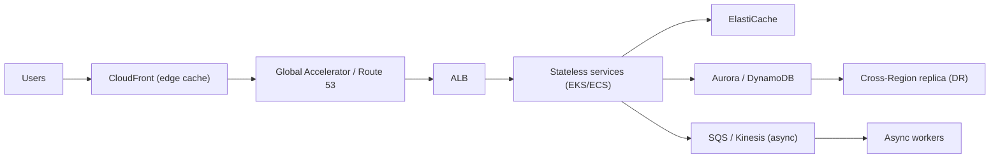

# Section 15: System Design Using AWS

> Part of the [AWS Interview Preparation Roadmap](./README.md). Ten end-to-end designs. For each: **Requirements → Capacity Estimation → Architecture → Scaling → Security → Cost → Failure Handling.** Practice each out loud, timed to ~40 minutes.

## The Design Framework (use every time)

1. **Clarify requirements** (functional + non-functional: scale, latency, availability, consistency).
2. **Capacity estimation** (QPS, storage, bandwidth, read/write ratio).
3. **High-level architecture** (draw the boxes + data flow).
4. **Deep dive** (data model, partitioning, caching, the hard component).
5. **Scaling** (stateless tier + autoscaling, DB sharding/replicas, CDN, async).
6. **Reliability** (multi-AZ/Region, failover, backpressure, idempotency).
7. **Security & cost** (encryption, least privilege; right-sizing, tiering, Spot/Savings Plans).

---

## 15.1 Design Netflix on AWS (Video Streaming)

**Requirements:** 200M+ users, upload/transcode, global low-latency playback, recommendations, 99.99% availability, mostly-read.

**Capacity (rough):** 200M users, ~1M concurrent streams peak; avg 5 Mbps → ~5 Tbps egress; petabytes of catalog; read:write ≫ 1000:1.

**Architecture:** Upload → S3 → transcoding pipeline (MediaConvert/EKS batch on Spot) produces multiple bitrates (ABR/HLS) → stored in S3 → **CloudFront** (and Open Connect-style edge) serves segments. Metadata/reco in DynamoDB + a data lake (S3 + Spark/EMR) feeding a recommendation service. Playback API on EKS behind ALB; ElastiCache for hot metadata.

**Scaling:** CDN absorbs read traffic; stateless APIs autoscale (Karpenter/Spot); DynamoDB on-demand; transcoding scales horizontally on Spot with checkpointing.

**Security:** DRM, signed CloudFront URLs/cookies, WAF, TLS, IRSA least privilege.

**Cost:** CDN offload (dominant), Spot for transcoding, S3 tiering (Glacier for cold catalog), Graviton compute, Savings Plans for baseline.

**Failure handling:** Multi-AZ everywhere; multi-Region for control services; graceful degradation (lower bitrate, cached reco); circuit breakers.

---

## 15.2 Design YouTube on AWS (UGC Video)

**Requirements:** Massive UGC upload, transcode, global playback, comments, search, view counts.

**Capacity:** 500 hours uploaded/min; billions of views/day; huge storage growth.

**Architecture:** Resumable multipart upload → S3 → SQS/Kinesis triggers transcoding fleet (EKS Spot / MediaConvert) → ABR renditions in S3 → CloudFront. Metadata in DynamoDB; search via OpenSearch; view counts via Kinesis → aggregation (approximate, then reconcile). Thumbnails in S3/One Zone-IA.

**Scaling:** CDN for playback; async transcoding queue smooths spikes; DynamoDB write sharding for hot videos (viral); OpenSearch scaled by shards.

**Security:** Upload validation/AV scan, content moderation pipeline, signed URLs, WAF.

**Cost:** Spot transcoding, S3 tiering, CDN offload, approximate counting to cut DB load.

**Failure handling:** Idempotent transcode jobs, DLQs, replay from S3; multi-AZ; degrade to cached metadata.

---

## 15.3 Design Uber on AWS (Ride-Hailing)

**Requirements:** Real-time location, matching riders↔drivers, low latency, surge pricing, payments, high availability.

**Capacity:** Millions of drivers emitting location every few seconds → high write throughput; geospatial queries.

**Architecture:** Mobile → API Gateway/ALB → EKS services. **Location ingestion** via Kinesis/MSK; driver location in an in-memory geospatial store (ElastiCache Redis with geohash) + DynamoDB for durability. **Matching service** queries nearby drivers by geohash. Trip state in DynamoDB; payments via async SQS + idempotent processing; notifications via SNS. Surge computed from supply/demand streams.

**Scaling:** Geo-sharding by city/region; Redis clusters per region; stateless matching autoscaled; Kinesis shards by geohash.

**Security:** PII encryption (KMS), tokenized payments (PCI scope isolation), least privilege, mTLS.

**Cost:** Redis for hot geo, DynamoDB on-demand, regional stacks to cut cross-Region cost.

**Failure handling:** Regional isolation (cell-based), idempotent trip/payment, DLQs, graceful degradation (cached surge, retry matching).

---

## 15.4 Design WhatsApp on AWS (Messaging)

**Requirements:** Billions of messages/day, 1:1 + groups, delivery/read receipts, E2E encryption, presence, ordering, low latency.

**Capacity:** 100B+ msgs/day (~1M+ msg/s peak); tiny messages; huge fan-out for groups.

**Architecture:** Persistent connections via a **WebSocket** tier (NLB → EKS/connection servers) with a connection registry (DynamoDB/Redis mapping user→server). Messages routed via a pub/sub/queue (per-user inbox in DynamoDB, or Kafka/MSK). Offline messages stored until delivered (then deleted). Presence in Redis with TTL. E2E encryption is client-side (server stores ciphertext only).

**Scaling:** Shard by userId; connection servers scale horizontally; consistent hashing for routing; per-conversation ordering via sequence numbers.

**Security:** E2E (server never sees plaintext), TLS transport, minimal metadata retention.

**Cost:** Store-and-forward then delete (small storage), efficient connection servers (Graviton), Redis for presence.

**Failure handling:** At-least-once delivery + client dedup by message ID, retries, multi-AZ connection tier, reconnection/backoff.

---

## 15.5 Design Twitter/X on AWS (Social Feed)

**Requirements:** Tweet, follow, home timeline, fan-out, trending, search; read-heavy; celebrity fan-out problem.

**Capacity:** 500M tweets/day; timeline reads ≫ writes; some accounts have 100M+ followers.

**Architecture:** Write path: tweet → DynamoDB (tweets) + **fan-out on write** to followers' timeline caches (Redis) via async workers (SQS/Kinesis). **Hybrid fan-out:** push for normal users, **pull (fan-out on read)** for celebrities to avoid write amplification. Search via OpenSearch; trending via Kinesis aggregation; media in S3+CloudFront.

**Scaling:** Redis timeline cache sharded by userId; DynamoDB for durable store; async fan-out workers autoscale; CDN for media.

**Security:** WAF, rate limiting, abuse detection, least privilege.

**Cost:** Hybrid fan-out cuts write cost; cache TTLs; S3 tiering for old media.

**Failure handling:** Rebuild timeline from source on cache loss, idempotent fan-out, DLQs, multi-AZ.

---

## 15.6 Design a Global E-Commerce Platform

**Requirements:** Catalog, search, cart, checkout, inventory, payments, orders; Black-Friday spikes; strong consistency for inventory/payments.

**Capacity:** 1M concurrent at peak; flash-sale bursts 100×.

**Architecture:** CloudFront + S3 for static; EKS/ECS services behind ALB. Catalog/search in OpenSearch + DynamoDB; cart in DynamoDB/Redis; **inventory** in a strongly-consistent store (Aurora or DynamoDB conditional writes) to prevent oversell; checkout → SQS → order workers; payments idempotent via a third-party gateway; orders in Aurora. Async email/notifications via SNS.

**Scaling:** Pre-scale + predictive scaling for sales; queue-based load leveling for checkout; DynamoDB on-demand; read replicas/caching for catalog.

**Security:** PCI isolation, tokenization, WAF/Shield, encryption, least privilege.

**Cost:** Spot for stateless, Savings Plans baseline, S3/CloudFront for static, scale-to-zero non-prod.

**Failure handling:** Reserve inventory with conditional writes (idempotent), saga for order/payment with compensation, DLQs, graceful degradation (queue orders, disable non-critical features).

---

## 15.7 Design a CI/CD Platform

**Requirements:** Multi-tenant builds/deploys, isolation, artifact storage, secrets, scale to thousands of concurrent jobs.

**Architecture:** API (EKS) → job queue (SQS) → ephemeral build runners (Fargate/EKS on Spot, one per job for isolation) → artifacts to S3/ECR/CodeArtifact. Secrets via Secrets Manager + OIDC short-lived roles. Deploy stage via CodeDeploy/Argo Rollouts with canary + auto-rollback. Metadata in DynamoDB; logs to CloudWatch/S3.

**Scaling:** Queue-driven runner autoscaling (Karpenter); per-tenant quotas; concurrency limits.

**Security:** Ephemeral isolated runners (no shared secrets), OIDC (no static keys), signed artifacts, tenant isolation via namespaces/accounts.

**Cost:** Spot runners, cache layers/deps, ARM builders, artifact lifecycle expiry.

**Failure handling:** Idempotent jobs, retries, DLQ for stuck jobs, multi-AZ.

---

## 15.8 Design an Observability Platform

**Requirements:** Ingest metrics/logs/traces at scale, query, alert, dashboards; high cardinality; retention tiers.

**Architecture:** Agents/OTel collectors → ingestion (Kinesis/MSK) → processing → storage: metrics in AMP/Prometheus (or Timestream), logs in OpenSearch/S3 (tiered), traces in X-Ray/Tempo. Query via AMG/Grafana; alerting via rules → SNS/PagerDuty. Downsampling + sampling to control cost.

**Scaling:** Shard ingestion by tenant/metric; separate hot (recent) vs cold (S3) storage; sample traces; cap label cardinality.

**Security:** Per-tenant isolation, encryption, RBAC on dashboards.

**Cost:** Tiered retention (hot→S3/Glacier), sampling, cardinality limits, compression (Parquet).

**Failure handling:** Buffer at ingestion (queue), backpressure, replay from S3, multi-AZ.

---

## 15.9 Design a Multi-Region EKS Platform

**Requirements:** Active-active or active-passive across Regions, global routing, data replication, DR, consistent deploys.

**Architecture:** Two+ regional EKS clusters (per-Region VPC, Karpenter, ALB). Global entry via **Route 53 latency/failover** or **Global Accelerator**. Data: DynamoDB Global Tables (multi-active) or Aurora Global (single writer + regional readers). GitOps (ArgoCD) deploys identically to each Region; images in ECR with cross-Region replication. Observability federated (regional AMP + central AMG).

**Scaling:** Independent per-Region autoscaling; cell/Region isolation; topology-aware routing intra-Region.

**Security:** Per-Region IRSA, KMS multi-Region keys, consistent SCP guardrails.

**Cost:** Right-size per Region, Spot, avoid unnecessary cross-Region data transfer.

**Failure handling:** Region evacuation via DNS/GA health checks, static stability (pre-provisioned standby capacity), replicated data with defined RPO/RTO, regular DR game days.

---

## 15.10 Design an AI/LLM Platform on AWS

**Requirements:** Serve LLM inference at scale, fine-tune/train, RAG, GPU cost control, low latency, guardrails.

**Architecture:** Inference on EKS with GPU/Inferentia node pools (Karpenter, Spot for batch), model artifacts in S3, served via a model server (vLLM/TGI) behind ALB with request queuing. **RAG:** embeddings in a vector store (OpenSearch/Aurora pgvector), documents in S3. Managed option: **Amazon Bedrock** for foundation models + Knowledge Bases + Guardrails. Training with SageMaker/EKS on GPU with checkpointing to S3. Async batch via SQS.

**Capacity:** GPU is the bottleneck — batch requests, use KV-cache, autoscale on queue depth + token throughput.

**Scaling:** Token-based autoscaling, request batching, model sharding for large models, caching frequent prompts/embeddings.

**Security:** Guardrails/prompt-injection filtering, PII redaction, tenant isolation, private endpoints, KMS encryption of data/embeddings.

**Cost:** Spot/Inferentia/Graviton, batch scheduling, right-size GPUs, cache embeddings, scale-to-zero idle models, Bedrock for spiky low-volume.

**Failure handling:** Queue + backpressure, GPU node interruption handling, fallback models, circuit breakers, timeouts.

---

## 15.11 Rapid-Fire Design Trade-offs (memorize)

| Problem | Go-to AWS answer |
|---------|------------------|
| Read-heavy global | CloudFront + cache + read replicas |
| Write spikes | SQS/Kinesis buffer + async workers |
| Hot key/partition | Write sharding + on-demand + cache |
| Oversell prevention | Conditional writes / transactions |
| Multi-Region data | DynamoDB Global Tables / Aurora Global |
| Fan-out at scale | Hybrid push/pull + async workers |
| Low-latency global entry | Global Accelerator / Route 53 latency |
| Cost of GPU/transcode | Spot + checkpointing + batching |
| Exactly-once feel | At-least-once + idempotency keys |
| Blast-radius control | Cell-based + account/Region isolation |

## 15.12 Documentation Links

- AWS Architecture Center: https://aws.amazon.com/architecture/
- Well-Architected Framework: https://docs.aws.amazon.com/wellarchitected/latest/framework/
- Builders' Library (static stability, retries, etc.): https://aws.amazon.com/builders-library/
- Bedrock: https://docs.aws.amazon.com/bedrock/latest/userguide/

---

> Next: **[Section 16 — Troubleshooting Masterclass](./12-TROUBLESHOOTING-MASTERCLASS.md)**.
