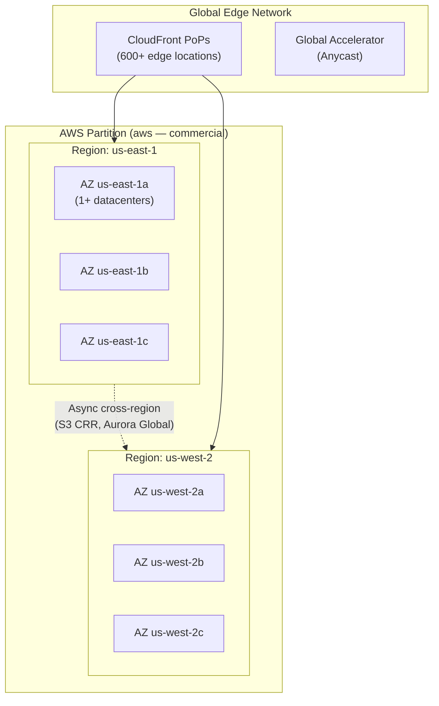
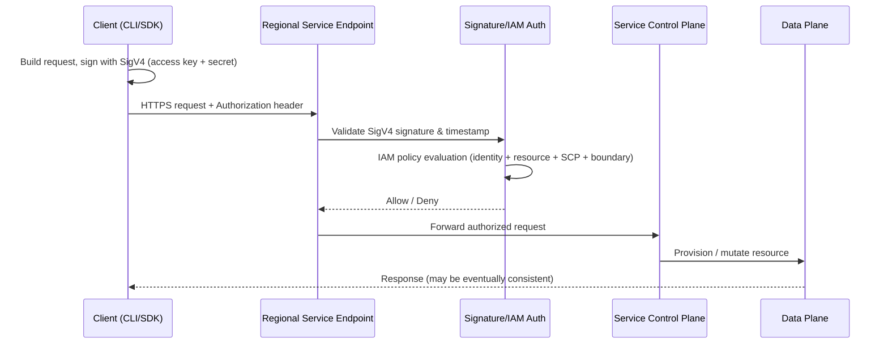
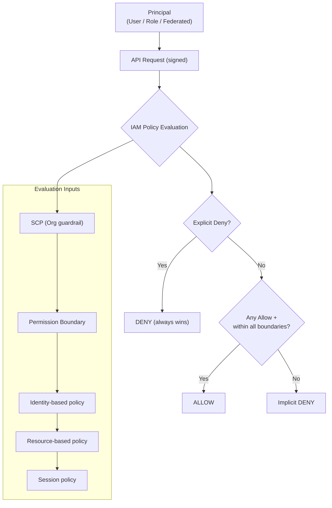
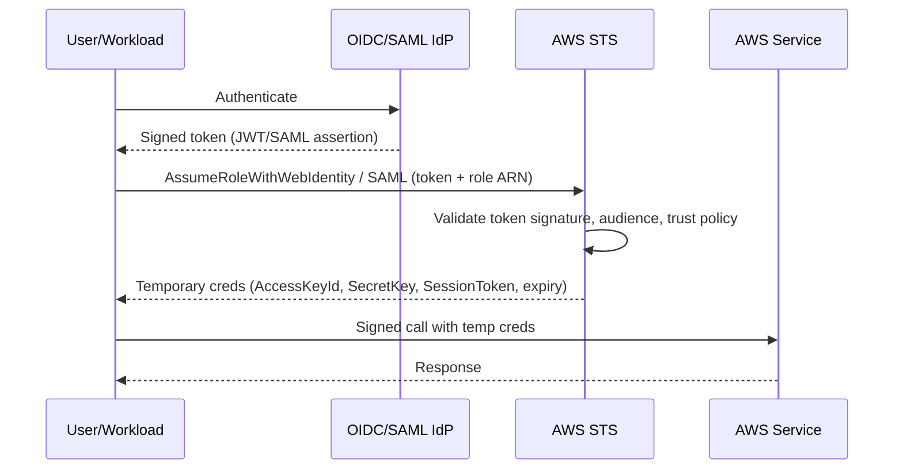
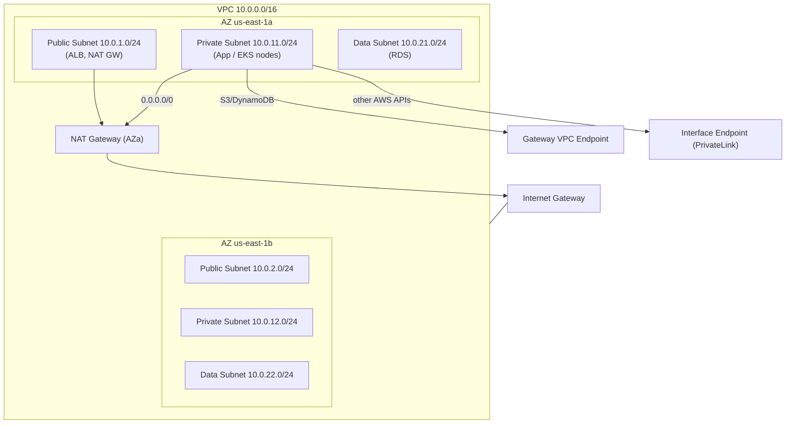
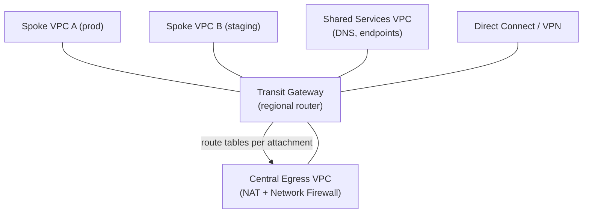

# AWS Interview Preparation Roadmap — FAANG/MANGA Edition

> **Target Audience:** Senior DevOps Engineers, Platform Engineers, Cloud Engineers, SREs, and Cloud Architects (5+ years) preparing for Google, Meta, Amazon, Netflix, Microsoft, Apple, Uber, Airbnb, LinkedIn, Databricks, Snowflake, and similar high-bar companies.
>
> **Scope:** A 3–6 month preparation guide. Every topic follows an 18-point framework: Concept Overview → Architecture → Core Components → Internal Working → Real-World Use Cases → Important AWS Services → Common/Advanced/FAANG-Level Questions → Troubleshooting → Production Best Practices → Security → Cost Optimization → Sample Answers → Interviewer Follow-ups → AWS Docs → Hands-On Labs → Azure/GCP Comparison.

---

## How to Use This Guide

This guide is split across multiple files due to its scope (20 major sections, thousands of Q&A). Sections 1–3 live in this README; Sections 4–20 live in dedicated numbered files (linked below), grouped by topic for manageability. Study in order, or jump to a weak area via the table of contents.

## Master Table of Contents

| # | Section | Status | File | Est. Study Time |
|---|---------|--------|------|------------------|
| 1 | AWS Fundamentals | ✅ Complete | [README.md](#section-1-aws-fundamentals) | 2 weeks |
| 2 | AWS Identity & Access Management | ✅ Complete | [README.md](#section-2-aws-identity--access-management) | 2 weeks |
| 3 | AWS Networking | ✅ Complete | [README.md](#section-3-aws-networking) | 3 weeks |
| 4 | AWS Compute | ✅ Complete | [04-COMPUTE-STORAGE.md](./04-COMPUTE-STORAGE.md) | 2 weeks |
| 5 | AWS Storage | ✅ Complete | [04-COMPUTE-STORAGE.md](./04-COMPUTE-STORAGE.md) | 1 week |
| 6 | EKS (Extremely Detailed) | ✅ Complete | [06-EKS-DEEP-DIVE.md](./06-EKS-DEEP-DIVE.md) | 4 weeks |
| 7 | Containers & Docker | ✅ Complete | [07-CONTAINERS-TERRAFORM.md](./07-CONTAINERS-TERRAFORM.md) | 1 week |
| 8 | Terraform for AWS | ✅ Complete | [07-CONTAINERS-TERRAFORM.md](./07-CONTAINERS-TERRAFORM.md) | 2 weeks |
| 9 | AWS CI/CD | ✅ Complete | [08-CICD-PLATFORMS.md](./08-CICD-PLATFORMS.md) | 1 week |
| 10 | GitHub Actions | ✅ Complete | [08-CICD-PLATFORMS.md](./08-CICD-PLATFORMS.md) | 1 week |
| 11 | Observability & SRE | ✅ Complete | [09-OBSERVABILITY-SECURITY.md](./09-OBSERVABILITY-SECURITY.md) | 2 weeks |
| 12 | AWS Security | ✅ Complete | [09-OBSERVABILITY-SECURITY.md](./09-OBSERVABILITY-SECURITY.md) | 2 weeks |
| 13 | AWS Databases | ✅ Complete | [10-DATABASES-EVENTDRIVEN.md](./10-DATABASES-EVENTDRIVEN.md) | 1 week |
| 14 | Event-Driven Architecture | ✅ Complete | [10-DATABASES-EVENTDRIVEN.md](./10-DATABASES-EVENTDRIVEN.md) | 1 week |
| 15 | System Design Using AWS | ✅ Complete | [11-SYSTEM-DESIGN.md](./11-SYSTEM-DESIGN.md) | 3 weeks |
| 16 | AWS Troubleshooting Masterclass | ✅ Complete | [12-TROUBLESHOOTING-MASTERCLASS.md](./12-TROUBLESHOOTING-MASTERCLASS.md) | 2 weeks |
| 17 | FAANG Interview Round Preparation | ✅ Complete | [13-FAANG-BEHAVIORAL.md](./13-FAANG-BEHAVIORAL.md) | 2 weeks |
| 18 | Behavioral & Leadership | ✅ Complete | [13-FAANG-BEHAVIORAL.md](./13-FAANG-BEHAVIORAL.md) | 1 week |
| 19 | Hands-On Labs | ✅ Complete | [14-HANDS-ON-LABS-DOCS.md](./14-HANDS-ON-LABS-DOCS.md) | Ongoing |
| 20 | Documentation Index | ✅ Complete | [14-HANDS-ON-LABS-DOCS.md](./14-HANDS-ON-LABS-DOCS.md) | Reference |

### Suggested Study Order (3–6 Month Plan)
- **Weeks 1–4:** Sections 1–3 (Fundamentals, Identity, Networking) — this README.
- **Weeks 5–10:** Sections 4–8 (Compute, Storage, EKS, Containers, Terraform).
- **Weeks 11–14:** Sections 9–14 (CI/CD, GitHub Actions, Observability, Security, Databases, Event-Driven).
- **Weeks 15–18:** Section 15 (System Design) — practice each design out loud, timed.
- **Weeks 19–22:** Section 16 (Troubleshooting) + mock interviews.
- **Weeks 23–24:** Sections 17–19 (FAANG rounds, Behavioral, Labs) + final review via Section 20.

---

# SECTION 1: AWS FUNDAMENTALS

## 1.1 Concept Overview

AWS Fundamentals is the bedrock every other topic (networking, EKS, identity, security) sits on. At a FAANG-level interview you are rarely asked "what is a Region" in isolation — you are expected to reason about **how the AWS control plane processes an API call**, **why a multi-account Organization with SCPs matters at 500+ account scale**, and **how AWS maintains availability across 30+ Regions and 100+ Availability Zones**.

The core mental model to internalize: **AWS is a distributed system where every operation (launch an EC2 instance, put an S3 object, assign an IAM role) is an authenticated, signed API call against a regional service endpoint.** Each service has an independent control plane (provisioning/management) and data plane (serving requests). Understanding this split is what separates candidates who memorize service names from those who can reason about failure modes, blast radius, and consistency guarantees.

**Beginner → Expert ladder:**
- **Beginner:** Regions, AZs, the Shared Responsibility Model, one account.
- **Intermediate:** Multi-AZ design, Organizations/OUs, tagging strategy, Service Quotas.
- **Advanced:** SCP inheritance, Control Tower landing zones, control-plane vs data-plane isolation.
- **Expert:** Static stability, cell-based architecture, blast-radius containment across accounts/Regions.

## 1.2 Architecture

### Global AWS Architecture

**Key facts interviewers probe:**
- A **Region** is a physical geographic area with (usually) 3+ **Availability Zones**. Regions are fully isolated for fault containment; most services are regional.
- An **AZ** is one or more discrete datacenters with independent power, cooling, and networking, interconnected with <1–2 ms latency. AZs in a Region are physically separated (typically 10s of km).
- **Edge Locations** (CloudFront/Route 53/Global Accelerator PoPs) are separate from Regions and serve caching, DNS, and Anycast entry.
- **Local Zones** extend a Region closer to metros for single-digit-ms latency; **Wavelength Zones** live inside telco 5G networks; **Outposts** put AWS hardware in your datacenter.

### AWS API Request Flow (Control Plane)

## 1.3 Core Components

| Component | What it is | Why it matters in interviews |
|-----------|-----------|------------------------------|
| **Region** | Isolated geographic area | Data residency, latency, DR pairing |
| **Availability Zone** | Isolated DC cluster in a Region | Multi-AZ HA is the default expectation |
| **Edge Location** | CDN/DNS PoP | CloudFront, Route 53, latency reduction |
| **Local/Wavelength Zone, Outposts** | Region extensions | Ultra-low latency / hybrid |
| **AWS Organizations** | Multi-account management | Consolidated billing, SCP guardrails |
| **OU** | Grouping of accounts | Policy inheritance boundary |
| **SCP** | Org-level permission guardrail | Max-permission ceiling (never grants) |
| **Control Tower** | Landing-zone automation | Governed multi-account baseline |
| **AWS Config** | Resource state & compliance | Drift detection, audit |
| **Service Quotas** | Soft/hard limits | Scaling limits, quota increase workflow |
| **Well-Architected Framework** | 6-pillar review model | Framework for design answers |
| **Tags** | Key-value metadata | Cost allocation, ABAC, automation |

**Well-Architected 6 pillars:** Operational Excellence, Security, Reliability, Performance Efficiency, Cost Optimization, Sustainability.

**Shared Responsibility Model:** AWS is responsible for security **of** the cloud (hardware, hypervisor, managed-service internals); the customer is responsible for security **in** the cloud (IAM, data, patching guest OS on EC2, network config). The line shifts with abstraction: on EC2 you patch the OS; on Fargate/Lambda AWS does.

## 1.4 Internal Working

**How the control plane works:** Every AWS service exposes a regional API endpoint (e.g., `ec2.us-east-1.amazonaws.com`). Requests are authenticated via **Signature Version 4 (SigV4)** — a client computes an HMAC-SHA256 signature over the canonical request using a signing key derived from the secret access key, date, Region, and service. The endpoint validates the signature (and a ±5-minute timestamp window to prevent replay), then IAM evaluates the request. The service's control plane persists desired state and the data plane converges to it.

**Eventual consistency:** Many AWS APIs are eventually consistent. Example: after `RunInstances`, a subsequent `DescribeInstances` may not immediately show the instance. S3 is now **strongly read-after-write consistent** for all operations (since Dec 2020), but IAM propagation, Route 53 changes, and many `Describe`/`List` calls remain eventually consistent. This is a favorite trap — always mention retry-with-backoff.

**Resource identification:** Everything is addressable by an **ARN** (`arn:partition:service:region:account-id:resource`). Global services (IAM, Route 53, CloudFront, WAF-classic) use `aws` partition with empty or `us-east-1` region fields.

**Static stability (Expert):** Well-designed AWS control planes are built so the **data plane keeps working even if the control plane is unavailable**. Example: a running EC2 instance keeps running and keeps its ENI/EBS attachments even if the EC2 control plane in the Region degrades — you just can't launch/terminate. Design your systems the same way (pre-provision capacity; don't depend on control-plane calls in the critical path).

## 1.5 Real-World Use Cases

- **Multi-account landing zone:** Separate accounts for prod/staging/dev/security/logging/network, governed by Control Tower + SCPs. Blast-radius isolation and clean billing.
- **Region selection:** Choose Region by latency, data-residency/compliance (GDPR), service availability, and price. Pair Regions for DR (e.g., us-east-1 ↔ us-west-2).
- **Tagging strategy:** Enforce `CostCenter`, `Environment`, `Owner`, `DataClassification` tags via SCP/Config rules; drive cost allocation and ABAC.

## 1.6 Important AWS Services

AWS Organizations, Control Tower, AWS Config, Service Quotas, Resource Access Manager (RAM), AWS Health, Trusted Advisor, Tag Editor, CloudFormation/CDK (for landing zones), IAM Identity Center.

## 1.7 Common Interview Questions

1. **What is the difference between a Region and an Availability Zone?** A Region is an isolated geographic area; an AZ is one or more isolated datacenters within a Region with independent power/cooling/network, connected by low-latency links. You deploy across AZs for HA and across Regions for DR/data residency.
2. **What is the Shared Responsibility Model?** AWS secures the cloud infrastructure; the customer secures what they put in it (IAM, data, OS patching on EC2, network rules). Responsibility shifts toward AWS with more managed services.
3. **Why use multiple accounts instead of one big account?** Blast-radius isolation, hard security boundaries, per-team billing, SCP guardrails, quota isolation.
4. **What is an SCP and does it grant permissions?** A Service Control Policy sets the *maximum* permissions for accounts in an OU. It never grants access; effective permissions = intersection of SCP and IAM policies.
5. **What are the Well-Architected pillars?** Operational Excellence, Security, Reliability, Performance Efficiency, Cost Optimization, Sustainability.

## 1.8 Advanced Interview Questions

1. **Explain SigV4 and why it exists.** Prevents credential exposure and replay: the secret key never travels; a per-request HMAC signature over a canonicalized request plus a timestamp window authenticates and integrity-protects the call.
2. **Control plane vs data plane — give an example of designing around it.** Pre-provision NAT/instances/IPs so a Region-level control-plane event doesn't stop request serving. Avoid runtime `Describe`/`RunInstances` in the hot path.
3. **How does SCP inheritance work across nested OUs?** An action must be allowed at *every* level from root to the account (they intersect). A deny anywhere wins.
4. **Which services are global vs regional?** Global: IAM, Route 53, CloudFront, WAF (classic), Organizations. Regional: almost everything else (EC2, S3 buckets are regional but namespaced globally, RDS, EKS).

## 1.9 FAANG-Level Deep Dive Questions

1. **Design a control-plane-independent failover.** Use health-check-based Route 53 or Global Accelerator with pre-provisioned standby capacity in a second Region; avoid depending on Auto Scaling launches during the event (static stability); replicate data async (S3 CRR/Aurora Global) and pre-warm.
2. **How would you contain blast radius for a global platform?** Cell-based architecture: partition users into cells (independent stacks), shuffle-sharding to limit correlated failures, per-cell deploys, and account/Region isolation.
3. **How does eventual consistency change your automation?** Idempotent operations, retry with exponential backoff + jitter, waiters, and reconciliation loops rather than assuming immediate visibility.

## 1.10 Troubleshooting Scenarios

- **`AccessDenied` despite an Allow policy:** Check for an explicit Deny, an SCP ceiling, a permission boundary, or a resource policy denial. Use IAM Policy Simulator and CloudTrail.
- **API intermittently returns stale data:** Eventual consistency — add retries/waiters; for S3 rely on strong consistency but remember IAM/Route 53 propagation.
- **`LimitExceeded` on scale-out:** Hit a Service Quota; request an increase via Service Quotas; pre-raise limits before launch events.

## 1.11 Production Best Practices

- Multi-account via Organizations + Control Tower; centralized logging & security accounts.
- Enforce tagging with SCP/Config; enable AWS Config org-wide.
- Design for multi-AZ by default; multi-Region for tier-1 workloads.
- Practice static stability; pre-provision and pre-raise quotas.
- Everything as code (CloudFormation/CDK/Terraform); no console mutations in prod.

## 1.12 Security Considerations

- Root account: enable MFA, no access keys, use only for break-glass.
- SCPs to deny risky actions (disable regions, delete CloudTrail, leave org).
- CloudTrail org trail to a locked logging account; AWS Config + GuardDuty enabled everywhere.
- Least privilege; short-lived credentials via IAM roles and Identity Center.

## 1.13 Cost Optimization Strategies

- Consolidated billing for volume discounts and shared Savings Plans/RIs.
- Cost allocation tags + Cost Explorer + Budgets alerts.
- Delete unused resources (idle EIPs, unattached EBS, old snapshots); Trusted Advisor & Compute Optimizer.

## 1.14 Sample Answers

> **"Walk me through your account structure."** *"We run AWS Organizations with a Control Tower landing zone. There's a management account (billing only), a dedicated security account (GuardDuty/Security Hub aggregation), a log-archive account (immutable CloudTrail + Config), a shared-services/network account (Transit Gateway, central egress), and per-team workload accounts split by environment. SCPs enforce guardrails — deny disabling CloudTrail, restrict Regions, require IMDSv2. This gives blast-radius isolation, clean cost allocation, and consistent guardrails."*

## 1.15 Follow-up Questions Interviewers Ask

- "How do you prevent a developer from disabling CloudTrail?" → SCP deny + Config rule + alert.
- "What happens to running workloads if the EC2 control plane degrades?" → They keep running (static stability); you just can't mutate.
- "How do you handle a Region that lacks a service you need?" → Choose a different Region, or design cross-Region calls with latency/cost trade-offs documented.

## 1.16 AWS Documentation Links

- AWS Global Infrastructure: https://aws.amazon.com/about-aws/global-infrastructure/
- Well-Architected Framework: https://docs.aws.amazon.com/wellarchitected/latest/framework/welcome.html
- Organizations: https://docs.aws.amazon.com/organizations/latest/userguide/
- Control Tower: https://docs.aws.amazon.com/controltower/latest/userguide/
- SigV4: https://docs.aws.amazon.com/IAM/latest/UserGuide/reference_aws-signing.html

## 1.17 Hands-On Labs

1. Create an Organization, an OU, and attach an SCP that denies `s3:DeleteBucket`; verify enforcement.
2. Deploy a Control Tower landing zone in a sandbox; inspect the guardrails.
3. Enable AWS Config with a rule requiring specific tags; remediate a non-compliant resource.

## 1.18 Comparison with Azure and GCP

| Concept | AWS | Azure | GCP |
|---------|-----|-------|-----|
| Isolation area | Region | Region | Region |
| Datacenter cluster | Availability Zone | Availability Zone | Zone |
| Multi-account mgmt | Organizations / OUs | Management Groups / Subscriptions | Organization / Folders / Projects |
| Guardrail policy | SCP | Azure Policy | Org Policy |
| Landing zone | Control Tower | Landing Zones (CAF) | Landing Zones |
| Resource address | ARN | Resource ID | Full resource name |
| Config/compliance | AWS Config | Azure Policy / Defender | Config Controller / SCC |

**Key differences to state:** AWS separates *accounts* as the primary isolation unit; Azure uses *subscriptions* under management groups; GCP uses *projects* under folders. AWS SCPs only restrict (never grant), whereas Azure Policy can also enforce/deploy, and GCP Org Policy constrains configurations.

---

# SECTION 2: AWS IDENTITY & ACCESS MANAGEMENT

## 2.1 Concept Overview

IAM is the single most tested AWS topic for DevOps/SRE roles because it's where security incidents originate and where least-privilege design is proven. You must reason about **who (principal)** can do **what (action)** to **which resource** under **what conditions**, and how that decision is computed when identity policies, resource policies, permission boundaries, SCPs, and session policies all apply at once.

**Beginner → Expert ladder:**
- **Beginner:** Users, groups, managed policies, MFA.
- **Intermediate:** Roles, trust policies, cross-account `AssumeRole`, resource policies.
- **Advanced:** Permission boundaries, SCP intersection, ABAC with tags, IAM Identity Center/SSO federation.
- **Expert:** STS token internals, IRSA/Pod Identity for EKS, OIDC/SAML federation, policy-evaluation edge cases.

## 2.2 Architecture — Authentication & Authorization Flow

### STS AssumeRole / Federation Flow

## 2.3 Core Components

| Component | Purpose |
|-----------|---------|
| **IAM User** | Long-lived identity for a human/app (avoid for apps) |
| **IAM Group** | Collection of users for policy attachment |
| **IAM Role** | Assumable identity with temporary creds; the preferred pattern |
| **Identity policy** | Attached to user/group/role — what they can do |
| **Resource policy** | Attached to a resource (S3 bucket, KMS key) — who can access it |
| **Trust policy** | The `AssumeRole` policy defining *who can assume* a role |
| **Permission boundary** | Max permissions an identity can have (a ceiling) |
| **SCP** | Org-level max permissions for an account |
| **Session policy** | Passed at `AssumeRole` to further scope down a session |
| **STS** | Issues temporary, short-lived credentials |
| **IAM Identity Center** | SSO, permission sets, federation to accounts |
| **Access Analyzer** | Finds resources shared externally; validates policies |

## 2.4 Internal Working

**Policy evaluation logic (memorize this order):**
1. **Explicit `Deny`** anywhere → **DENY** (short-circuits everything).
2. **SCP** must allow (for accounts in an Org).
3. **Permission boundary** must allow (if attached).
4. **Session policy** must allow (if present).
5. At least one **`Allow`** in an identity or resource policy → **ALLOW**.
6. Otherwise → **implicit DENY** (default deny).

For **cross-account** access, you need *both* an identity policy in the calling account **and** a resource/trust policy in the target account allowing it (two-sided handshake).

**STS token internals:** `AssumeRole` returns temporary credentials — an access key ID, secret access key, and a **session token** — valid for 15 min to 12 h (role max session duration). These are HMAC-signed like normal creds but carry a session token the service validates. `AssumeRoleWithWebIdentity` trades an OIDC **JWT** for creds; STS checks the token's signature (via the IdP's JWKS), `aud`/`sub` claims, and the role's trust policy conditions (`StringEquals` on `:sub`, `:aud`).

**Access tokens vs ID tokens (OIDC):** An **ID token** asserts *who the user is* (identity, consumed by the client); an **access token** grants *access to resources* (consumed by an API). In web-identity federation AWS validates the token's signature/claims to mint STS creds — it does not use the token directly to call AWS services.

**IRSA vs EKS Pod Identity (key EKS-IAM link):**
- **IRSA:** EKS runs an OIDC provider; a pod's ServiceAccount is annotated with a role ARN; the pod gets a projected OIDC token; the SDK calls `AssumeRoleWithWebIdentity`. Trust policy conditions on the SA's `sub`.
- **Pod Identity (newer):** An on-node agent (`eks-pod-identity-agent`) vends credentials via an association mapping SA→role; no OIDC provider per cluster, simpler cross-cluster reuse.

## 2.5 Real-World Use Cases

- **Cross-account CI/CD:** A pipeline role in the tooling account assumes a deploy role in each target account (trust policy + external ID).
- **Workload identity on EKS:** IRSA/Pod Identity gives pods scoped AWS access without node-wide credentials.
- **Federated SSO:** IAM Identity Center federates to Okta/Entra ID via SAML/OIDC; permission sets map to accounts/roles; SCIM provisions users/groups.

## 2.6 Important AWS Services

IAM, STS, IAM Identity Center (SSO), Access Analyzer, Organizations (SCPs), Cognito (app user identity), Secrets Manager/Parameter Store (secret storage), KMS (encryption authz via key policies).

## 2.7 Common Interview Questions (sample of 50+)

1. **User vs role?** Users are long-lived with static creds; roles are assumed for temporary creds — prefer roles for apps and humans (via SSO).
2. **How does cross-account access work?** Target account role's trust policy allows the source principal; source identity has `sts:AssumeRole`; often an `ExternalID` prevents the confused-deputy problem.
3. **What is a permission boundary?** A managed policy that caps the max permissions an identity can have; effective = intersection of boundary and identity policy.
4. **Managed vs inline policy?** Managed = reusable, versioned, attachable to many; inline = 1:1 embedded, deleted with the identity. Prefer managed.
5. **How do you grant an EC2 instance access to S3?** Instance profile → IAM role; the SDK reads temp creds from IMDS. Never embed keys.
6. **What is an instance profile?** A container for an IAM role that EC2 uses to deliver role creds to the instance via IMDS.
7. **Explain least privilege in practice.** Start from zero, grant specific actions/resources/conditions, use Access Analyzer to right-size, review with IAM Access Advisor (last-used).
8. **What is ABAC?** Attribute-based access control using tags in conditions (e.g., `aws:PrincipalTag/Team` == `aws:ResourceTag/Team`) — scales better than per-resource policies.
9. **MFA enforcement?** Condition `aws:MultiFactorAuthPresent: true`; deny sensitive actions without MFA.
10. **How do temporary credentials expire and rotate?** STS creds have an expiry; SDKs auto-refresh via the role/IMDS/OIDC token; no manual rotation.

*(The full file set continues this numbering to 50+ across the identity material; additional Q&A appear in Sections 6 and 12 for EKS-IAM and security specifics.)*

## 2.8 Advanced Interview Questions

1. **Explain the confused-deputy problem and the fix.** A third party could trick your role into acting on another customer's behalf; fix with an `ExternalId` condition (and `aws:SourceArn`/`aws:SourceAccount` for service principals).
2. **How does policy evaluation resolve identity + resource + SCP + boundary conflicts?** Any explicit Deny wins; then the request must be allowed by SCP ∩ boundary ∩ (identity or resource) ∩ session policy.
3. **When do you need a resource policy vs identity policy?** Cross-account and service-to-service (S3, KMS, SNS, SQS, Lambda) often require resource policies; same-account single-principal usually only identity policies.
4. **How does IRSA authenticate a pod with no static secret?** Projected OIDC token + `AssumeRoleWithWebIdentity`; trust policy pins the SA `sub` and audience `sts.amazonaws.com`.

## 2.9 FAANG-Level Deep Dive Questions

1. **Design least-privilege for a multi-tenant platform.** ABAC with tenant tags, per-tenant roles or session tagging via `sts:TagSession`, permission boundaries to cap delegated admin, SCPs for hard guardrails.
2. **How would you eliminate long-lived keys entirely?** IAM Identity Center for humans, IAM roles + IRSA/Pod Identity for workloads, OIDC federation for CI (GitHub Actions), Roles Anywhere for on-prem.
3. **Walk through the JWT validation STS performs for web identity.** Fetch IdP JWKS, verify RS256 signature, check `iss`, `aud`, `exp`, `nbf`, then match trust-policy conditions on `sub`/`aud`.

## 2.10 Troubleshooting Scenarios

- **Pod can't call AWS (`AccessDenied`/`no identity-based policy`):** Check SA annotation, trust policy `sub` match, OIDC provider association, and that the SDK supports web identity.
- **Cross-account `AssumeRole` fails:** Trust policy principal/ExternalID mismatch, missing `sts:AssumeRole` on source, or SCP denial.
- **Unexpected Deny:** Explicit deny, SCP, or boundary. Use IAM Policy Simulator + CloudTrail `errorCode`.

## 2.11 Production Best Practices

- No IAM users for workloads; roles + temporary creds everywhere.
- Enforce MFA; rotate any remaining keys; scan with Access Analyzer.
- Use permission boundaries for delegated admin; SCPs for org guardrails.
- Tag-based ABAC to reduce policy sprawl; review last-used access quarterly.

## 2.12 Security Considerations

- Protect the root user (MFA, no keys). Use break-glass roles with alerting.
- Deny IMDSv1; require IMDSv2 hop-limit 1 to mitigate SSRF credential theft.
- Encrypt secrets in Secrets Manager/KMS; never in env vars or code.

## 2.13 Cost Optimization Strategies

IAM itself is free; cost impact is indirect — Identity Center reduces key-management overhead; Access Analyzer prevents costly breaches; consolidating roles reduces operational toil.

## 2.14 Sample Answers

> **"How do you give a pod access to an S3 bucket securely?"** *"I use IRSA or EKS Pod Identity. With IRSA, the cluster has an OIDC provider; I annotate the pod's ServiceAccount with a scoped IAM role whose trust policy pins that SA's subject and the `sts.amazonaws.com` audience. The pod receives a projected OIDC token, the SDK calls `AssumeRoleWithWebIdentity`, and gets short-lived creds. No node-wide credentials, no static secrets, and the blast radius is a single ServiceAccount."*

## 2.15 Follow-up Questions Interviewers Ask

- "What's the difference between IRSA and Pod Identity, and when would you pick each?"
- "How do you stop one pod from stealing another's credentials?" (separate SAs, IMDS hop limit, network policy).
- "How do SCPs interact with IAM Identity Center permission sets?" (SCP still caps everything).

## 2.16 AWS Documentation Links

- IAM User Guide: https://docs.aws.amazon.com/IAM/latest/UserGuide/
- Policy evaluation logic: https://docs.aws.amazon.com/IAM/latest/UserGuide/reference_policies_evaluation-logic.html
- STS: https://docs.aws.amazon.com/STS/latest/APIReference/welcome.html
- IRSA: https://docs.aws.amazon.com/eks/latest/userguide/iam-roles-for-service-accounts.html
- EKS Pod Identity: https://docs.aws.amazon.com/eks/latest/userguide/pod-identities.html
- Identity Center: https://docs.aws.amazon.com/singlesignon/latest/userguide/

## 2.17 Hands-On Labs

1. Create a cross-account deploy role with `ExternalId`; assume it from another account via CLI.
2. Configure IRSA in an EKS cluster; give a pod read-only S3 access and verify with `aws sts get-caller-identity`.
3. Attach a permission boundary to a delegated-admin role and prove it caps escalation.

## 2.18 Comparison with Azure and GCP

| Concept | AWS | Azure | GCP |
|---------|-----|-------|-----|
| Identity provider | IAM + Identity Center | Microsoft Entra ID | Cloud IAM + Cloud Identity |
| Workload identity (K8s) | IRSA / Pod Identity | Entra Workload Identity | Workload Identity Federation |
| Temporary creds | STS | Entra tokens (OAuth2) | Short-lived tokens / service account impersonation |
| Guardrail | SCP | Azure Policy / PIM | Org Policy |
| Managed identity for VMs | Instance profile (role) | Managed Identity | Attached service account |
| Fine-grained model | Policies + conditions | RBAC roles + ABAC | IAM roles + conditions |

**Key differences:** Azure's Entra ID is a full directory (users, groups, apps, OAuth2/OIDC) tightly coupled to identity; AWS separates directory (Identity Center) from resource authorization (IAM). GCP leans on service-account impersonation and Workload Identity Federation; AWS's closest analog is IRSA/Roles Anywhere.

---

# SECTION 3: AWS NETWORKING

## 3.1 Concept Overview

Networking is ~40% of DevOps/SRE AWS interviews. You must reason about **packet flow** from client to pod, **routing precedence**, the difference between **stateful Security Groups** and **stateless NACLs**, and how to connect VPCs, on-prem, and the internet securely at scale (hub-and-spoke with Transit Gateway, PrivateLink for private SaaS).

**Beginner → Expert ladder:**
- **Beginner:** VPC, subnets, route tables, IGW, SG vs NACL.
- **Intermediate:** NAT Gateway, VPC peering, Route 53, ELB types, VPC endpoints.
- **Advanced:** Transit Gateway hub-and-spoke, PrivateLink, Direct Connect, hybrid DNS (Resolver).
- **Expert:** Overlay/ENI internals, ECMP, centralized egress inspection (Network Firewall/GWLB), multi-Region networking.

## 3.2 Architecture

### VPC Reference (Multi-AZ, Public/Private)

### Hub-and-Spoke with Transit Gateway

## 3.3 Core Components

| Component | Stateful? | Layer | Notes |
|-----------|-----------|-------|-------|
| **Security Group** | Stateful | Instance/ENI | Allow rules only; return traffic auto-allowed |
| **NACL** | Stateless | Subnet | Allow+Deny; must allow both directions & ephemeral ports |
| **Route Table** | — | Subnet | Longest-prefix match wins |
| **IGW** | — | VPC | Bidirectional internet for public subnets |
| **NAT Gateway** | Stateful | AZ | Egress-only for private subnets; per-AZ for HA |
| **VPC Peering** | — | VPC↔VPC | Non-transitive, no overlapping CIDRs |
| **Transit Gateway** | — | Regional hub | Transitive routing, scales to 1000s of VPCs |
| **PrivateLink / Interface Endpoint** | — | ENI | Private access to AWS/SaaS via private IP |
| **Gateway Endpoint** | — | Route table | S3 & DynamoDB only, free |
| **Direct Connect** | — | Hybrid | Dedicated private line |
| **Route 53** | — | DNS | Public/private zones, health checks, routing policies |

## 3.4 Internal Working

**Routing decision (longest-prefix match):** For a packet's destination, the most specific matching route wins (e.g., `10.0.0.0/16` local beats `0.0.0.0/0`). Local routes for the VPC CIDR are implicit and cannot be overridden.

**SG vs NACL packet flow:** Inbound packet hits the subnet **NACL** (stateless — evaluate ordered rules, must have explicit allow) → then the ENI **Security Group** (stateful — if allowed, return traffic is automatically permitted). Outbound reverses the order. A classic bug: NACL allows inbound but blocks the **ephemeral return port range** (1024–65535) outbound.

**NAT Gateway:** Performs source NAT for private-subnet egress; it's AZ-scoped, so deploy one per AZ and route each private subnet to its same-AZ NAT to avoid cross-AZ data charges and an AZ-failure SPOF.

**PrivateLink internals:** An **interface endpoint** creates an ENI with a private IP in your subnet; DNS resolves the service name to that ENI. Traffic to the service (AWS API or partner SaaS via an endpoint service backed by an NLB) never leaves the AWS network or your VPC boundary — no IGW/NAT needed.

**ENI & "overlay" for EKS:** The Amazon VPC CNI assigns **real VPC IPs** (secondary IPs on ENIs) to pods — no overlay/encapsulation — so pods are first-class VPC citizens (great for latency and native SG support, but consumes VPC IP space; watch for exhaustion). Alternatives like Calico/Cilium can do overlay or policy enforcement.

**Peering is non-transitive:** A↔B and B↔C does not give A↔C. Use Transit Gateway for transitive hub-and-spoke.

## 3.5 Real-World Use Cases

- **Three-tier VPC:** public (ALB/NAT), private app (EKS/EC2), isolated data (RDS) across 3 AZs.
- **Centralized egress inspection:** All spokes route `0.0.0.0/0` through a central egress VPC with AWS Network Firewall for URL/domain filtering and logging.
- **Private SaaS access:** Consume a partner service via PrivateLink so no traffic traverses the internet.

## 3.6 Important AWS Services

VPC, Subnets, Route Tables, Security Groups, NACLs, Internet/NAT Gateways, VPC Peering, Transit Gateway, PrivateLink/VPC Endpoints, Direct Connect, Site-to-Site VPN, Route 53 (+ Resolver), CloudFront, Global Accelerator, ELB (ALB/NLB/GWLB), AWS WAF, Shield, Network Firewall.

## 3.7 Common Interview Questions (sample of 100+)

1. **SG vs NACL?** SG stateful, ENI-level, allow-only; NACL stateless, subnet-level, allow+deny, needs ephemeral ports.
2. **Public vs private subnet?** Public has a route to an IGW; private routes egress via NAT.
3. **Why per-AZ NAT Gateways?** HA + avoid cross-AZ charges + remove SPOF.
4. **Is VPC peering transitive?** No — use Transit Gateway.
5. **Gateway vs interface endpoint?** Gateway (S3/DynamoDB, route-table based, free); interface (ENI/PrivateLink, hourly + data cost, most services).
6. **ALB vs NLB vs GWLB?** ALB L7 (HTTP/gRPC, routing, WAF); NLB L4 (TCP/UDP, ultra-low latency, static IP); GWLB for inline appliances.
7. **How does Route 53 failover work?** Health checks + failover routing policy switch DNS to a healthy endpoint.
8. **CloudFront vs Global Accelerator?** CloudFront caches HTTP at edge; GA is Anycast TCP/UDP acceleration to regional endpoints (no caching).
9. **What is an Elastic IP and when to avoid it?** Static public IPv4; avoid for scale (use ALB/NLB); IPv4 now has hourly charges.
10. **How do you connect on-prem privately?** Direct Connect (dedicated) or Site-to-Site VPN (over internet, IPsec), often via Transit Gateway.

## 3.8 Advanced Interview Questions

1. **Design centralized egress for 50 VPCs.** Transit Gateway hub, central egress VPC with per-AZ NAT + Network Firewall, TGW route tables to force `0.0.0.0/0` through inspection; return via appliance-mode TGW attachment for symmetry.
2. **Hybrid DNS resolution both ways?** Route 53 Resolver inbound endpoints (on-prem → AWS private zones) and outbound endpoints + forwarding rules (AWS → on-prem domains).
3. **Explain appliance mode on TGW.** Keeps flow symmetry so stateful firewalls see both directions of a flow on the same appliance/AZ.
4. **How do overlapping CIDRs get resolved between merged orgs?** Private NAT / TGW with NAT, or re-IP; PrivateLink to expose specific services without full routing.

## 3.9 FAANG-Level Deep Dive Questions

1. **Trace a packet from an internet user to an EKS pod behind an ALB.** DNS (Route 53) → CloudFront (optional) → ALB (public subnet, L7, TLS terminate, WAF) → target group (IP mode) → pod ENI IP (VPC CNI) → SG checks → pod. Return traffic is stateful on SGs.
2. **How would you achieve <10ms cross-Region user latency globally?** CloudFront for static/cacheable, Global Accelerator for dynamic TCP/UDP, Regional stacks with latency-based Route 53, data replication (DynamoDB Global Tables/Aurora Global).
3. **VPC IP exhaustion with VPC CNI at scale — mitigations?** Prefix delegation (/28 per ENI), custom networking with secondary CIDRs, larger subnets, or Cilium/overlay; monitor `ipamd` metrics.

## 3.10 Troubleshooting Scenarios

- **Instance can't reach internet:** No IGW route (public) / no NAT route (private), SG egress, NACL ephemeral ports, or public IP missing.
- **Intermittent cross-AZ latency/cost:** Private subnet routing to a NAT in another AZ.
- **Connection resets to a peered VPC:** Missing return route, NACL asymmetry, or overlapping CIDR.
- **DNS fails for private endpoints:** Private hosted zone not associated, or endpoint private DNS disabled.

## 3.11 Production Best Practices

- Plan CIDRs to avoid overlap; reserve room for growth and secondary CIDRs.
- Per-AZ NAT and per-AZ subnets; 3 AZs for tier-1.
- Least-privilege SGs (reference SG IDs, not CIDRs); NACLs as coarse guardrails only.
- Centralized egress + Network Firewall + flow logs to detect exfiltration.
- Use PrivateLink/Gateway endpoints to keep AWS API traffic off the internet.

## 3.12 Security Considerations

- VPC Flow Logs to CloudWatch/S3; alert on anomalies.
- WAF on ALB/CloudFront; Shield Advanced for tier-1 public endpoints.
- No 0.0.0.0/0 SSH/RDP; use SSM Session Manager instead of bastions.
- Encrypt in transit (TLS) end-to-end; mTLS for service mesh.

## 3.13 Cost Optimization Strategies

- Gateway endpoints for S3/DynamoDB (free, avoids NAT data charges).
- Consolidate NAT where AZ isolation isn't required; watch NAT data-processing costs.
- Minimize cross-AZ and inter-Region data transfer; keep chatty services co-located.
- IPv4 now costs per hour — release idle EIPs; adopt IPv6 where feasible.

## 3.14 Sample Answers

> **"Why one NAT Gateway per AZ?"** *"A NAT Gateway is AZ-scoped. If I put one NAT in AZ-a and route all private subnets to it, an AZ-a outage takes down egress for the whole VPC, and every packet from AZ-b/c crosses AZs, incurring cross-AZ data charges. So I deploy a NAT per AZ and point each private subnet's default route at its same-AZ NAT — that gives AZ-independent egress and avoids cross-AZ cost."*

## 3.15 Follow-up Questions Interviewers Ask

- "What's the ephemeral port pitfall with NACLs?"
- "How would you inspect all egress traffic centrally?"
- "How does the VPC CNI assign pod IPs and how do you avoid exhaustion?"

## 3.16 AWS Documentation Links

- VPC: https://docs.aws.amazon.com/vpc/latest/userguide/
- Transit Gateway: https://docs.aws.amazon.com/vpc/latest/tgw/
- PrivateLink: https://docs.aws.amazon.com/vpc/latest/privatelink/
- Route 53: https://docs.aws.amazon.com/Route53/latest/DeveloperGuide/
- ELB: https://docs.aws.amazon.com/elasticloadbalancing/latest/userguide/

## 3.17 Hands-On Labs

1. Build a 3-AZ VPC (public/private/data) with per-AZ NAT via Terraform; deploy an app behind an ALB.
2. Connect two VPCs with a Transit Gateway and force egress through a central Network Firewall.
3. Create an S3 gateway endpoint and prove traffic bypasses the NAT (Flow Logs).

## 3.18 Comparison with Azure and GCP

| Concept | AWS | Azure | GCP |
|---------|-----|-------|-----|
| Virtual network | VPC (regional) | VNet (regional) | VPC (global) |
| Subnet scope | AZ-scoped | Region-wide | Region-wide |
| Firewall (instance) | Security Group | NSG (ASG) | Firewall rules (tags) |
| Stateless subnet ACL | NACL | NSG (also stateful) | Hierarchical firewall |
| Hub-and-spoke | Transit Gateway | Virtual WAN / VNet peering | Network Connectivity Center |
| Private service access | PrivateLink | Private Link/Endpoint | Private Service Connect |
| Global L7 | CloudFront + ALB | Front Door | Cloud CDN + Global LB |
| Anycast L4 | Global Accelerator | Front Door / Anycast | Global LB (Anycast) |

**Key differences:** GCP VPCs are **global** with regional subnets (simpler cross-Region), whereas AWS/Azure VPC/VNets are **regional**. AWS subnets are **AZ-scoped**; Azure/GCP subnets span a Region. AWS splits stateful SGs and stateless NACLs; Azure NSGs are stateful and apply at subnet or NIC.

---

> **All 20 sections are complete.** This README covers Sections 1–3; Sections 4–20 live in the linked numbered files above. Study in order or jump to a weak area.
