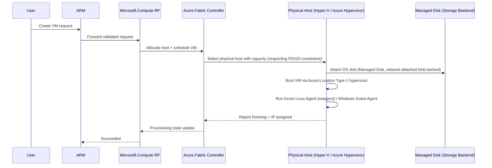
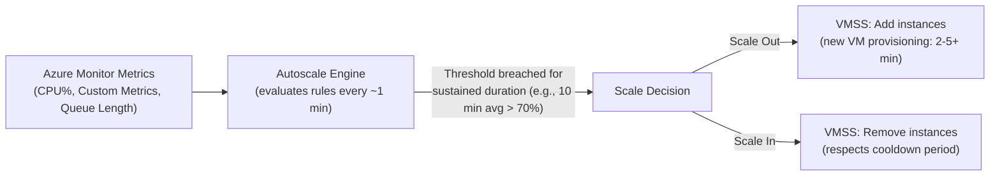
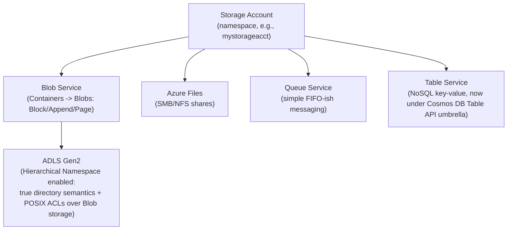

# SECTION 4: AZURE COMPUTE

## 4.1 Concept Overview

Compute is where Azure's shared responsibility model becomes concrete: below the hypervisor is Microsoft's problem, above it is yours. A FAANG interviewer probing this section wants to know whether you understand **why VMSS autoscaling reacts on a delay**, **what actually happens physically when you provision a VM**, and **when a PaaS compute option (App Service, Functions, Container Apps) is architecturally the right call vs. an anti-pattern**. The mental model: every Azure compute option is a different point on the spectrum between "full control, full operational burden" (IaaS VMs) and "zero infra, constrained runtime" (Functions Consumption plan) — interview questions test whether you can place a workload correctly on that spectrum and defend the tradeoff.

## 4.2 Architecture

### Hypervisor & VM Provisioning Flow

**Key internal facts:**
- Azure's hypervisor is a custom, heavily modified Hyper-V derivative (the "Azure Hypervisor"), further hardened on newer hardware via the **Azure Boost** (offloading network/storage virtualization to dedicated hardware/FPGA, analogous conceptually to AWS Nitro) — reducing "noisy neighbor" and virtualization tax.
- **Fault Domains (FD)** = groups of hardware sharing a common power/network source; **Update Domains (UD)** = groups that Microsoft patches/reboots together, never all at once. Availability Sets spread VMs across both; Availability Zones are a coarser-grained version spanning entire physically-separate datacenters.
- Managed Disks are network-attached (backed by Azure Storage blob infrastructure under the hood, abstracted away from the user) — this is why VM-to-disk latency, while low, is not truly "local" the way an on-prem direct-attached disk is (relevant for latency-sensitive database workloads, motivating options like Ultra Disk or Premium SSD v2 with configurable IOPS/throughput independent of disk size).

### VMSS Autoscaling Internals

**Why autoscaling reacts "late":** metrics are aggregated over a time grain (commonly 1-5 minutes) and a scale rule requires the *average over a sustained duration* to breach a threshold before triggering — this is deliberate, preventing flapping from short transient spikes, but means a sudden traffic surge (e.g., a flash sale) can outpace reactive autoscaling, motivating **predictive autoscaling** (Azure Monitor's forecast-based scaling) or pre-provisioned scale-out for known traffic patterns.

## 4.3 Core Components

### Virtual Machines & VMSS
VMs are the IaaS baseline. **VMSS (Virtual Machine Scale Sets)** manage a fleet of identical (or, with Flexible orchestration mode, heterogeneous) VM instances behind a Load Balancer, with built-in autoscaling. **Flexible orchestration mode** (current default/recommended) allows mixing VM sizes/Spot+Regular within one scale set and provides per-VM control closer to standalone VMs, vs. legacy **Uniform mode**.

### Availability Sets vs. Availability Zones vs. Regions
| | Availability Set | Availability Zone | Multi-Region |
|---|---|---|---|
| Granularity | Rack-level (FD/UD) within one datacenter | Entire separate datacenter within a region | Separate geography |
| SLA (VM, all instances Premium/Ultra disk) | 99.95% | 99.99% | Customer-architected |
| Latency between instances | Very low | Low (single-digit ms) | Higher (10s-100s ms) |
| Protects against | Rack/host failure | Datacenter-level failure (power, fire, flood) | Regional disaster |

### Spot VMs & Dedicated Hosts
- **Spot VMs:** up to ~90% discount, using Azure's unused capacity — can be evicted with as little as 30 seconds' notice (via Scheduled Events) when Azure needs the capacity back or the Spot price exceeds your max price. Ideal for stateless batch/CI workers, never for stateful/latency-sensitive production paths without robust eviction handling.
- **Dedicated Hosts:** a physical server allocated solely to your subscription — used for strict compliance (data residency/isolation at the hardware level) or licensing requirements (e.g., BYOL scenarios needing physical core visibility).

### App Services, Functions, Container Apps, Service Fabric, Batch
- **App Service:** managed PaaS for web apps/APIs (built-in deployment slots, auto-scale, no OS management) — best when you have a standard web workload without needing custom OS/kernel-level control.
- **Azure Functions:** event-driven, serverless compute. **Consumption plan** (true scale-to-zero, per-execution billing, cold start latency) vs. **Premium plan** (pre-warmed instances, VNet integration, no cold start) vs. **Dedicated/App Service plan** (runs on your own always-on App Service Plan).
- **Container Apps:** built on **KEDA** (event-driven autoscaling, including scale-to-zero) + **Dapr** (optional sidecar for service-to-service invocation, pub/sub, state management) + **Envoy**-based ingress, running on a managed Kubernetes/Service Fabric substrate you never directly manage — positioned as the "serverless containers, less complexity than AKS" middle ground.
- **Service Fabric:** Microsoft's original microservices orchestration platform (predates broad Kubernetes adoption) — still used for legacy stateful microservices (Reliable Actors/Reliable Collections) but AKS is the default recommendation for new workloads today.
- **Azure Batch:** large-scale parallel/HPC job scheduling (render farms, Monte Carlo simulations) — auto-provisions and tears down a pool of compute nodes per job.

## 4.4 Real-World Use Cases

1. A media company uses **Spot VMSS** for its video-transcoding fleet, saving ~80% on compute by designing the job queue (Service Bus) to redrive interrupted jobs to a new Spot instance after eviction.
2. A fintech firm uses **Dedicated Hosts** in a specific region to satisfy a regulator's "physical hardware isolation" requirement.
3. A SaaS company migrates a monolith's background-job processing from an always-on VM to **Azure Functions Premium plan**, cutting idle-time cost while retaining VNet integration for private database access.
4. A retailer uses **Container Apps with KEDA scale rules on Service Bus queue length** to handle Black Friday order-processing bursts without managing a full AKS cluster for a workload with predictable event-driven scaling needs.

## 4.5 Important Azure Services
`Virtual Machines` · `Virtual Machine Scale Sets` · `Availability Sets/Zones` · `Azure Spot VMs` · `Azure Dedicated Host` · `App Service` · `Azure Functions` · `Azure Container Apps` · `Service Fabric` · `Azure Batch` · `Azure Compute Gallery (Shared Image Gallery)`

## 4.6 Common / Advanced / FAANG-Level Interview Questions

1. **Q: What's the practical difference between an Availability Set and Availability Zones?**
   **A:** Availability Set spreads VMs across Fault/Update Domains *within a single datacenter* (protects against rack/host/power failure and correlated patching). Availability Zones spread VMs across *physically separate datacenters* within a region (protects against a full datacenter-level disaster) — a strictly stronger guarantee, at the cost of slightly higher inter-instance latency; zones also carry a higher SLA (99.99% vs 99.95%).

2. **Q: Why would VMSS Flexible orchestration mode be preferred over Uniform mode today?**
   **A:** Flexible mode allows heterogeneous VM sizes and mixing Spot + Regular instances in the same scale set, supports Availability Zone spreading with per-VM control similar to standalone VMs, and is Microsoft's current recommended default — Uniform mode is largely legacy for cases needing strict identical-instance semantics.

3. **Q: A Spot VM workload is failing unpredictably. What's your first troubleshooting step?**
   **A:** Check **Scheduled Events** (VM metadata endpoint `169.254.169.254/metadata/scheduledevents`) for eviction notices, and check `az vm list --query "[?priority=='Spot']"` eviction history/policy — Spot evictions are the most common root cause of "unpredictable" Spot workload failures, and the eviction policy (Deallocate vs Delete) determines recovery behavior.

4. **Q: Design a cost-optimal compute strategy for a workload with a predictable daily traffic pattern (high 9am-6pm, near-zero overnight).**
   **A:** Combine a small baseline of Reserved Instance-covered VMSS capacity for the always-on floor with autoscale rules scaling out via Spot instances during the predictable daytime peak (accepting eviction risk since the workload is stateless/queue-driven), and consider Azure Functions Premium/Container Apps with KEDA for any portion of the workload that's genuinely event-driven rather than constantly running — combined with a scheduled autoscale profile (time-based, not just metric-based) since the pattern is *known* in advance rather than purely reactive.

5. **Q: Why does Azure Boost (or AWS Nitro-equivalent hardware offload) matter for VM performance consistency?**
   **A:** Offloading network/storage virtualization from the hypervisor's software path to dedicated hardware (FPGA/ASIC) reduces "noisy neighbor" CPU steal time and gives more consistent, higher-throughput I/O — directly relevant when justifying a newer VM generation/series for latency-sensitive workloads during a technical deep-dive.

## 4.7 Troubleshooting Scenarios

**Scenario — VMSS fails to scale out during a traffic spike**
- *Symptom:* CPU alert fires, but new instances take 5+ minutes to become "Ready" and start serving traffic, causing a service degradation window.
- *Investigation:* Check VMSS scale-out activity log timestamps vs. actual instance "Running" + health-probe-passing timestamps; check custom extension/init script duration on new instances.
- *Root Cause:* Autoscale correctly triggered, but VM provisioning + boot + custom extension (app deployment, config pull) took several minutes — the metric-based reactive model has an inherent latency floor.
- *Fix:* Use a pre-baked (Azure Compute Gallery) image with the application pre-installed rather than post-boot configuration scripts, and tune scale-out threshold to trigger earlier (lower CPU% threshold, shorter sustained-duration window) to compensate for provisioning lead time.
- *Prevention:* Load-test scale-out latency ahead of known traffic events (product launches) and pre-scale via a scheduled autoscale profile rather than relying purely on reactive metrics.

## 4.8 Production Best Practices & Security
- Use Azure Compute Gallery (Shared Image Gallery) for golden/hardened images instead of post-boot configuration for faster, more consistent scale-out.
- Disable public IP on VM NICs by default; use Azure Bastion for management access.
- For Spot workloads, always implement idempotent, resumable job processing (queue-based) to handle evictions gracefully.

## 4.9 Cost Optimization
- Reserved Instances / Savings Plans for steady-state baseline compute (up to ~72% discount for 3-year commit).
- Spot VMs for interruption-tolerant batch/CI workloads.
- Right-size using Azure Advisor's VM right-sizing recommendations — a very common, low-effort cost win.

## 4.10 Microsoft Documentation Links
- [Virtual Machines overview](https://learn.microsoft.com/en-us/azure/virtual-machines/overview)
- [Virtual Machine Scale Sets overview](https://learn.microsoft.com/en-us/azure/virtual-machine-scale-sets/overview)
- [Availability options for VMs](https://learn.microsoft.com/en-us/azure/virtual-machines/availability)
- [Azure Spot Virtual Machines](https://learn.microsoft.com/en-us/azure/virtual-machines/spot-vms)
- [Azure Functions hosting options](https://learn.microsoft.com/en-us/azure/azure-functions/functions-scale)
- [Azure Container Apps overview](https://learn.microsoft.com/en-us/azure/container-apps/overview)

## 4.11 Comparison with AWS/GCP
| Concept | Azure | AWS | GCP |
|---|---|---|---|
| IaaS VM | Virtual Machines | EC2 | Compute Engine |
| Autoscaled VM fleet | VMSS | Auto Scaling Group | Managed Instance Group |
| Interruptible cheap compute | Spot VMs | Spot Instances | Spot VMs |
| Serverless functions | Azure Functions | Lambda | Cloud Functions / Cloud Run |
| Serverless containers | Container Apps | Fargate / App Runner | Cloud Run |
| PaaS web hosting | App Service | Elastic Beanstalk | App Engine |

---

# SECTION 5: AZURE STORAGE

## 5.1 Concept Overview

Storage interview questions probe two things: **durability math** (do you actually understand what "11 nines" or a replication tier guarantees, and its failure modes) and **the right service for the right data shape** (blob vs. file vs. queue vs. table vs. Data Lake). FAANG interviewers frequently ask you to justify a replication tier choice against an RTO/RPO requirement rather than just naming the tiers.

## 5.2 Architecture — Storage Account Object Model

**Key internal fact — ADLS Gen2:** it is NOT a separate storage system; it's Blob Storage with **Hierarchical Namespace (HNS)** enabled, which changes the underlying metadata layer from a flat blob-name-as-path illusion to actual directory objects supporting atomic rename/move and POSIX-style ACLs — critical for big-data/analytics engines (Spark/Databricks) that need efficient directory-level operations.

## 5.3 Core Components — Replication Models & Durability

| Tier | Copies | Scope | Durability | Use Case |
|---|---|---|---|---|
| **LRS** (Locally Redundant) | 3 copies | Single datacenter | 11 nines (99.999999999%) annual | Cheapest; no protection against datacenter loss |
| **ZRS** (Zone Redundant) | 3 copies | 3 Availability Zones in-region | 12 nines | Protects against datacenter failure, same region |
| **GRS** (Geo-Redundant) | 3 + 3 copies | Primary region (LRS) + async replicated to paired region (LRS) | 16 nines | DR against regional disaster; secondary NOT readable by default |
| **RA-GRS** (Read-Access GRS) | Same as GRS | Same as GRS | 16 nines | Adds a read-only endpoint on the secondary region for read availability during primary outage |
| **GZRS / RA-GZRS** | ZRS in primary + geo-replicated | Best of both | Highest | ZRS-level regional resilience + geo-DR |

**Durability vs. Availability — the distinction interviewers probe:** durability (11-16 nines) is about the probability data is *not lost*; availability (99.9-99.99% SLA depending on tier/access pattern) is about the probability the service *responds successfully to a request right now*. A GRS account can have "16 nines durability" while still experiencing an availability blip during regional failover, because **geo-failover to the secondary region is not automatic** for standard GRS (requires either a customer-initiated or Microsoft-initiated failover, introducing an RTO that is NOT zero) — a very common misconception to correct in an interview.

## 5.4 Real-World Use Cases
1. A media archive uses **LRS + Lifecycle Management** (auto-tier Hot→Cool→Archive after 30/90 days) to cut storage cost ~80% for rarely-accessed video assets.
2. A regulated bank uses **RA-GZRS** for transaction logs, giving both intra-region zone resilience and cross-region DR with a readable secondary for reporting workloads.
3. A data platform uses **ADLS Gen2 with HNS** as the backing store for a Databricks/Synapse lakehouse, relying on POSIX ACLs for fine-grained folder-level access control per business unit.
4. A lift-and-shift migration uses **Azure Files (SMB)** as a drop-in replacement for an on-prem file server, mounted via Azure File Sync for hybrid caching at branch offices.

## 5.5 Common / Advanced Interview Questions

1. **Q: Does GRS provide automatic failover?**
   **A:** No — standard GRS/RA-GRS failover to the secondary region is a manual (or Microsoft-initiated, in a true regional-loss disaster) operation, introducing a real RTO. If you need automatic failover, you must architect it at the application layer or use RA-GRS's read-only secondary endpoint proactively for read-path resilience, not blind assumption of instant write failover.

2. **Q: What's the actual technical difference between Blob Storage and ADLS Gen2?**
   **A:** ADLS Gen2 is Blob Storage with Hierarchical Namespace enabled — it adds true directory objects (atomic rename/delete of a "folder"), POSIX-compliant ACLs, and better performance characteristics for big-data analytics workloads that do heavy directory-listing/rename operations — it is not a separate storage engine.

3. **Q: When would you choose Table Storage over Cosmos DB's native API?**
   **A:** Table Storage (now largely superseded in messaging by "Cosmos DB for Table API") is appropriate for extremely simple, cost-sensitive key-value workloads without a need for guaranteed low-latency global distribution, multiple consistency levels, or secondary indexes — Cosmos DB is the answer whenever global distribution, tunable consistency, or richer querying is required.

4. **Q: How would you design lifecycle management for a workload where data is hot for 7 days, warm for 90 days, and then compliance-archived for 7 years?**
   **A:** A Lifecycle Management policy: Hot tier for 0-7 days, auto-transition to Cool at day 7, auto-transition to Archive at day 90, with a **immutability policy (WORM — Write Once Read Many)** applied for the compliance-archive period to satisfy regulatory retention requirements (preventing deletion/modification even by an Owner-role principal until the retention period expires).

## 5.6 Troubleshooting Scenarios

**Scenario — Unexpected storage costs after enabling lifecycle management**
- *Symptom:* Bill spikes after moving data to Archive tier.
- *Investigation:* Check for frequent **rehydration** operations (`az storage blob show` for `archiveStatus`) — Archive tier data must be rehydrated (hours-long operation) before it's readable, and rehydration + early-deletion penalties (minimum retention charges) are common surprise costs.
- *Root Cause:* Application/users were accessing "archived" data more often than the lifecycle design assumed, triggering costly rehydrations and early-deletion fees.
- *Fix:* Re-evaluate access patterns before setting the Archive transition threshold; consider Cool tier instead if access is infrequent-but-not-negligible.
- *Prevention:* Model actual access-pattern telemetry before committing to aggressive tiering policies.

## 5.7 Production Best Practices & Cost Optimization
- Enable Soft Delete + versioning on Blob containers holding critical data as protection against accidental/malicious deletion.
- Use Lifecycle Management policies driven by actual access telemetry, not guesses.
- For ADLS Gen2 analytics workloads, partition data thoughtfully (e.g., by date) to optimize query engine (Spark/Synapse) performance and cost.

## 5.8 Microsoft Documentation Links
- [Azure Storage redundancy](https://learn.microsoft.com/en-us/azure/storage/common/storage-redundancy)
- [Introduction to Azure Data Lake Storage Gen2](https://learn.microsoft.com/en-us/azure/storage/blobs/data-lake-storage-introduction)
- [Blob storage lifecycle management](https://learn.microsoft.com/en-us/azure/storage/blobs/lifecycle-management-overview)
- [Azure Files overview](https://learn.microsoft.com/en-us/azure/storage/files/storage-files-introduction)

## 5.9 Comparison with AWS/GCP
| Concept | Azure | AWS | GCP |
|---|---|---|---|
| Object storage | Blob Storage | S3 | Cloud Storage |
| Analytics-optimized object storage | ADLS Gen2 (HNS) | S3 + Lake Formation | Cloud Storage (flat, no native HNS equivalent) |
| Managed file shares | Azure Files | EFS / FSx | Filestore |
| Geo-redundant storage | GRS/RA-GRS/GZRS | S3 Cross-Region Replication | Multi-region buckets |

---

*Continue to [06-AKS-DEEP-DIVE.md](./06-AKS-DEEP-DIVE.md) for Section 6 (AKS — Extremely Detailed).*
