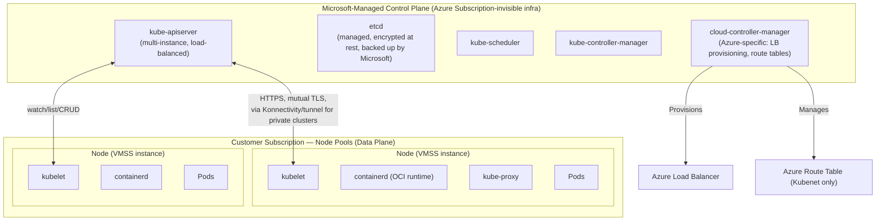
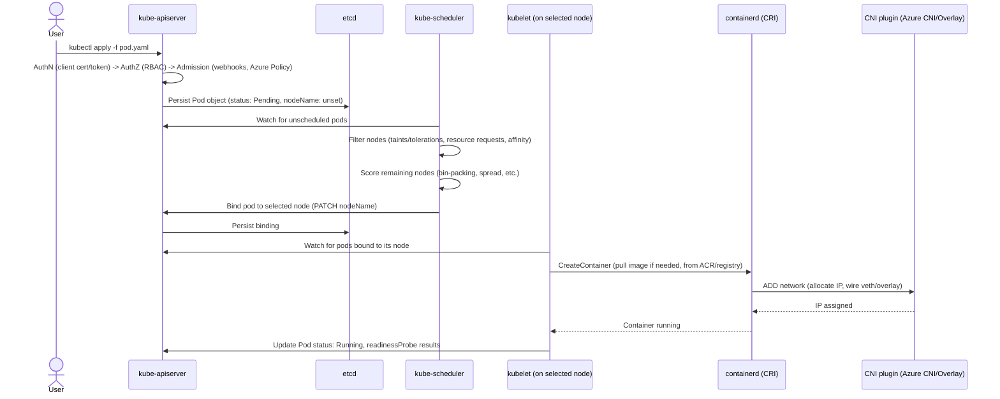
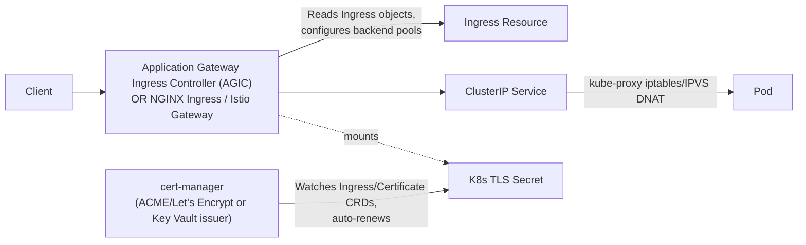
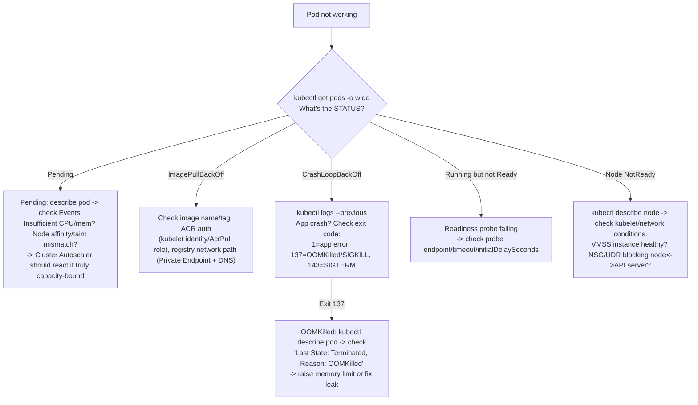

# SECTION 6: AZURE KUBERNETES SERVICE (AKS) — EXTREMELY DETAILED

> This is the largest section of the guide, as instructed. It covers AKS architecture, internals, networking, security, autoscaling, and troubleshooting in FAANG-interview depth, closing with a large curated Q&A bank.

## 6.1 Concept Overview

AKS is a **managed control plane** over vanilla upstream Kubernetes — Microsoft operates and pays for the API server, etcd, scheduler, and controller-manager (the "control plane" is free; you pay only for nodes, unless using the Uptime SLA / long-term-support tiers). The single most important mental model for a FAANG interview: **AKS does not change Kubernetes' architecture** — everything you know about vanilla K8s applies; what AKS adds is (1) Azure-specific integrations (Azure CNI, Azure AD/Entra integration, Azure Disk/File CSI drivers, Azure Policy add-on) and (2) operational conveniences (managed upgrades, cluster autoscaler integration, node image management). Interviewers use AKS to test whether you understand Kubernetes internals generally, with an Azure-specific lens on networking/identity/storage.

## 6.2 Architecture

### AKS Control Plane vs. Data Plane

**Critical facts:**
- The control plane runs in a Microsoft-managed tenant, invisible to `az resource list` in your subscription — you cannot SSH into it, and etcd backups/encryption/upgrades are entirely Microsoft's responsibility.
- Communication from the API server to kubelets (for `exec`/`logs`/`port-forward`) on **private clusters** traverses a reverse tunnel (Konnectivity, replacing the older `tunnelfront`) since the control plane has no direct network path into your private VNet otherwise.
- The **cloud-controller-manager** is the Azure-specific glue: it watches for `Service type=LoadBalancer` objects and provisions/updates the actual Azure Load Balancer resource, and (for Kubenet) manages the node-to-pod-CIDR route table entries.

### Pod Scheduling & Lifecycle (Internal Working)

## 6.3 Core Components — Deep Dive

### Networking Models: Azure CNI vs. Kubenet vs. Azure CNI Overlay
| | Azure CNI (classic) | Kubenet | Azure CNI Overlay |
|---|---|---|---|
| Pod IP source | VNet subnet (real, routable IP per pod) | Separate non-VNet CIDR, NAT'd at node | Overlay CIDR, not VNet-routable |
| VNet IP consumption | High (1 IP per pod, pre-provisioned per node by default) | Low | Low |
| Direct pod addressability from VNet/on-prem | Yes | No (NAT'd) | No (needs Overlay-aware routing) |
| Route table management | None needed (native VNet routing) | Azure manages UDRs mapping node->pod-CIDR (scales poorly past ~400 nodes due to UDR limits) | Managed by Azure's overlay control plane, no UDR limit issue |
| Recommended for new clusters | Only if direct pod VNet-IP addressability is required (e.g., certain NVA/firewall integrations) | Deprecated/legacy | **Yes — Microsoft's current default recommendation** |

### DNS Resolution & Service Discovery
CoreDNS (deployed as a Deployment in `kube-system`) serves cluster DNS. Every Service gets a DNS record (`<svc>.<namespace>.svc.cluster.local`) resolved via `kube-dns` Service ClusterIP injected into every pod's `/etc/resolv.conf` (via kubelet). **Common production tuning:** CoreDNS autoscaler (scales replica count with node/pod count) and `ndots:5` default search-path behavior causing extra DNS lookups for external FQDNs (a well-known latency/throughput gotcha — mitigated by fully-qualifying external hostnames with a trailing dot or tuning `ndots` in pod spec).

### Ingress Flow & Certificate Management

`cert-manager` (the de-facto standard) watches `Certificate` CRDs, requests/renews certs from an `Issuer`/`ClusterIssuer` (Let's Encrypt ACME HTTP-01/DNS-01, or Azure Key Vault via CSI), and writes the result as a Kubernetes `Secret` that the Ingress Controller mounts for TLS termination.

### Autoscaling — HPA vs VPA vs Cluster Autoscaler vs KEDA
- **HPA (Horizontal Pod Autoscaler):** scales replica *count* based on metrics (CPU/memory via metrics-server, or custom/external metrics). Polls every 15s by default; requires resource `requests` set on containers to compute CPU% meaningfully.
- **VPA (Vertical Pod Autoscaler):** adjusts container resource *requests/limits* over time based on observed usage — in AKS, commonly run in "recommendation-only" mode since applying VPA's `Auto` update mode requires evicting/recreating pods (disruptive), often paired with PodDisruptionBudgets.
- **Cluster Autoscaler (CA):** watches for **Pending** pods that can't be scheduled due to insufficient node capacity, and scales the underlying node pool's VMSS out; scales in when nodes are underutilized *and* all pods on that node can be safely rescheduled elsewhere (respects PodDisruptionBudgets, and won't remove a node hosting a pod with no other eligible node — a common "why won't cluster autoscaler scale down" root cause).
- **KEDA:** extends HPA with dozens of event-source scalers (Service Bus queue length, Kafka lag, Azure Monitor metrics) — the standard for scale-to-zero, event-driven workloads on AKS.

**Key interaction:** HPA decides "I need more replicas" → if no node has capacity, those pods go **Pending** → Cluster Autoscaler notices Pending pods and adds nodes → new pods schedule. This chain (and its inherent latency — VMSS scale-out taking minutes) is a frequent FAANG deep-dive topic.

### Security: Workload Identity, Azure RBAC, Network Policies, Secrets
- **AKS Workload Identity:** covered in depth in Section 2 — OIDC federation between AKS's own OIDC issuer and Entra ID, giving pods secret-less Azure resource access.
- **Azure RBAC for Kubernetes Authorization:** lets you manage Kubernetes RBAC (`Role`/`ClusterRole` bindings) via Azure RBAC role assignments instead of `kubectl`-applied K8s RBAC objects directly — unifying audit/assignment with the rest of Azure's control plane. (Distinct from Azure RBAC controlling the *ARM-level* `Microsoft.ContainerService/managedClusters` resource itself, e.g., who can run `az aks get-credentials`.)
- **Azure AD Pod Identity (legacy, deprecated):** the predecessor to Workload Identity, using a cluster-wide NMI/MIC component intercepting IMDS traffic — deprecated due to security/reliability issues (a shared cluster-wide component was itself an attack surface); Workload Identity (OIDC-federation-based, no cluster-wide interception component) is the only recommended approach today.
- **Network Policies:** Calico or Azure's native network policy engine enforce pod-to-pod L3/L4 segmentation *inside* the cluster (complementary to, not a replacement for, VNet-level NSGs which only see node-level traffic, not pod-to-pod east-west traffic when using an overlay).
- **Secrets Management:** native K8s `Secret` objects are only base64-encoded (not encrypted) at the API layer by default unless **encryption at rest with a customer-managed key (etcd encryption)** is configured; the recommended pattern is the **Azure Key Vault Provider for Secrets Store CSI Driver**, mounting Key Vault secrets as a volume (or syncing to a K8s Secret) without ever storing the actual secret value in etcd unencrypted.

## 6.4 Troubleshooting — The Core AKS Diagnostic Flowchart

**DNS Failure Debugging:** `kubectl exec -it <pod> -- nslookup kubernetes.default` to isolate cluster-internal DNS; check CoreDNS pod logs/health and the `ndots`-driven extra-lookup-count for external DNS latency complaints; verify NSG/Azure Firewall isn't blocking egress to `168.63.129.16` (Azure DNS) or upstream custom DNS servers configured on the VNet.

**API Server Issues:** for private clusters, "kubectl commands hang" is very commonly a **Konnectivity/tunnel** connectivity issue (network path from where `kubectl` runs to the private API server endpoint) rather than the API server itself — verify via `az aks show` private FQDN resolution and route/firewall rules to it first.

## 6.5 Real-World Use Cases
1. A fintech runs a **private AKS cluster** (no public API server IP) with Azure CNI Overlay, Workload Identity for all pod-to-Azure-service auth, and Azure Policy add-on enforcing Gatekeeper-style constraints (deny `:latest` image tags, require resource limits on every pod).
2. A retailer uses **KEDA scaling on Service Bus queue depth** to scale order-processing pods from 0 to 500 during a flash sale, and back to 0 overnight, on Spot-backed node pools for the burst capacity.
3. A media company diagnosed a mysterious **DNS latency issue** traced to default `ndots:5` causing 5 failed internal-search-path DNS queries before resolving each external CDN hostname — fixed by pod-level `dnsConfig` overriding `ndots` to 1 for services making heavy external calls.

## 6.6 Curated AKS Interview Question Bank (Representative Set — Common through FAANG-Level)

**Architecture & Internals**
1. What does AKS manage for you vs. what remains your responsibility? *(Control plane — API server, etcd, scheduler, controller-manager — is Microsoft's; nodes, node OS patching cadence approval, workloads, and node-level security are yours.)*
2. Why can't you SSH into the AKS control plane? *(It runs in a Microsoft-managed tenant/subscription, not yours — there's no VM to SSH into from your side.)*
3. What is the Konnectivity tunnel and why does it exist? *(Reverse tunnel allowing the control plane to reach kubelets in a private cluster's VNet, since the control plane has no other network path in; replaced the older `tunnelfront` add-on.)*
4. Explain the exact request path for `kubectl exec`. *(kubectl -> API server -> (if private cluster) Konnectivity tunnel -> kubelet's exec endpoint -> CRI attach to container.)*
5. What's the difference between the cloud-controller-manager and kube-controller-manager? *(kube-controller-manager runs cloud-agnostic controllers — e.g., Deployment/ReplicaSet controllers; cloud-controller-manager runs Azure-specific controllers — e.g., provisioning an Azure LB for a `type=LoadBalancer` Service, managing Kubenet route tables.)*

**Networking**
6. Why is Azure CNI Overlay now the default recommendation over classic Azure CNI? *(Avoids rapid VNet IP exhaustion at scale; classic CNI pre-allocates a routable VNet IP per max-pods-per-node, which burns subnet space fast.)*
7. Why does Kubenet scale poorly past a few hundred nodes? *(Azure must maintain a UDR route table entry per node mapping its pod-CIDR — subject to the platform's max-routes-per-route-table limit.)*
8. How would you expose a Service both internally (VNet-only) and externally? *(Two Services / one Service with annotations: `service.beta.kubernetes.io/azure-load-balancer-internal: "true"` for an internal LB, vs. a public LB Service or Ingress for external.)*
9. Explain how kube-proxy implements Service ClusterIPs. *(iptables — or IPVS mode for higher scale/performance — DNAT rules rewriting ClusterIP:port to a randomly-selected backend pod IP:port, updated as Endpoints change.)*
10. Why might two pods on the same node be unable to reach each other despite a permissive NetworkPolicy? *(Check if a *default-deny* NetworkPolicy exists in the destination namespace with no matching allow rule — NetworkPolicies are additive/allow-list once any policy selects a pod, and ordering/precedence confusion is common.)*

**Security**
11. Why was Azure AD Pod Identity deprecated in favor of Workload Identity? *(Pod Identity's NMI/MIC components intercepted IMDS traffic cluster-wide — a shared, cluster-scoped attack surface and a source of subtle reliability bugs; Workload Identity uses standard OIDC federation with no interception component.)*
12. How do you rotate a Key Vault-backed secret mounted via the CSI driver without restarting pods? *(The Secrets Store CSI driver supports a periodic rotation poll interval, refreshing the mounted volume content in place; whether the *application* picks up the change without a restart depends on whether it re-reads the file, which is an application-level concern, not the driver's.)*
13. What's the risk of using the legacy Key Vault Access Policy model vs. RBAC for AKS workload secret access? *(Access Policies are all-or-nothing per permission type and invisible to unified Azure RBAC auditing/PIM — RBAC mode is the current recommendation for finer-grained, auditable access.)*
14. How does Azure Policy's Gatekeeper-based add-on enforce cluster-wide guardrails? *(Deploys OPA Gatekeeper with constraint templates translated from Azure Policy definitions, enforced as validating admission webhooks — e.g., denying pods without resource limits or with disallowed image registries.)*
15. Why is etcd encryption at rest with a customer-managed key relevant even though Microsoft manages etcd? *(Compliance requirements sometimes mandate customer control over the encryption key material even for a fully-managed backing store — via Azure Disk Encryption Sets/CMK integration for the underlying managed disks.)*

**Troubleshooting**
16. A pod is stuck `Pending` — what commands and reasoning path? *(`kubectl describe pod` -> Events section -> check for `FailedScheduling` reason: insufficient CPU/memory, unsatisfied node affinity/taint-toleration, or a PVC not binding; if capacity-bound, confirm Cluster Autoscaler is enabled and its max node count isn't already reached.)*
17. `CrashLoopBackOff` — how do you distinguish an application bug from an infra issue? *(`kubectl logs --previous` for the actual crash output; check exit code via `kubectl describe pod` — 1 typically app-level error, 137 = SIGKILL usually OOMKilled, 143 = SIGTERM from a liveness probe failure/eviction.)*
18. `OOMKilled` — what's your remediation path? *(Confirm via `Last State: Terminated, Reason: OOMKilled`; either the memory `limit` is genuinely too low for real usage — raise it and validate with VPA recommendation data — or there's an actual memory leak needing an application fix; check if it's a limit issue vs. leak by observing memory growth trend over pod lifetime pre-kill.)*
19. Image pull errors — what's the full checklist? *(Image name/tag typo; ACR authentication — is the kubelet identity granted `AcrPull` on the target registry, `az aks update --attach-acr`; network path to the registry if using a Private Endpoint-only ACR — DNS resolution and NSG/Firewall egress rules; registry throttling/rate limits at high pull concurrency during a mass rollout.)*
20. Node shows `NotReady` — investigation order? *(`kubectl describe node` for Conditions — is it a kubelet heartbeat/network issue, or genuinely an underlying VMSS instance problem — check the instance's power/health state in the Azure Portal/CLI; check NSG/UDR changes that might have silently cut off node-to-API-server connectivity.)*

**FAANG-Level Deep Dive**
21. **Q: Design a multi-tenant AKS platform serving 50 internal teams, each needing namespace-level isolation, without giving any team cluster-admin.**
    **A:** Namespace-per-team with Azure RBAC for Kubernetes Authorization mapping each team's Entra ID group to a namespace-scoped `Role` (not `ClusterRole`), ResourceQuotas + LimitRanges per namespace to prevent noisy-neighbor resource starvation, default-deny NetworkPolicies per namespace with explicit allow rules only for required cross-namespace communication, Azure Policy/Gatekeeper enforcing baseline pod security standards (no privileged containers, mandatory resource limits, approved registries only) cluster-wide regardless of namespace, and per-team Workload Identity/Managed Identities scoped via least-privilege RBAC to only that team's Azure resources — no team ever receives `cluster-admin` or a shared/broad Managed Identity.

22. **Q: Explain precisely why Cluster Autoscaler might fail to scale down an underutilized node.**
    **A:** CA won't remove a node if: (a) any pod on it lacks a controller (bare pod, not managed by a Deployment/ReplicaSet/Job, since CA can't guarantee it'll be recreated elsewhere); (b) a pod has local storage (emptyDir with data) or is annotated `cluster-autoscaler.kubernetes.io/safe-to-evict: "false"`; (c) removing the node would violate a PodDisruptionBudget for a pod running on it; (d) the node has kube-system pods without a corresponding PDB permitting eviction (by default CA respects kube-system PDBs). Diagnosing this requires checking CA's own logs (`kubectl logs -n kube-system <ca-pod>` or Azure Monitor's cluster-autoscaler log category) for the specific "no scale down" reason attached to each node.

23. **Q: How would you achieve zero-downtime node image upgrades across a 200-node production AKS cluster with strict availability requirements?**
    **A:** Use **Surge upgrade settings** (`--max-surge`) to provision extra nodes *before* cordoning/draining old ones (rather than the default drain-first-then-replace, which temporarily reduces capacity), combined with PodDisruptionBudgets on every critical Deployment (ensuring the drain process respects minimum-available replica counts), spread across multiple node pools mapped to Availability Zones so an upgrade never drains an entire zone's capacity simultaneously, and a pre-upgrade validation step (upgrading a canary node pool first, running smoke tests) before rolling to the full fleet.

24. **Q: A customer's AKS cluster experiences API server throttling (`429`s from `kubectl`/controllers) only during their CI/CD deployment windows. Diagnose.**
    **A:** Likely excessive `LIST`/`WATCH` API calls from CI/CD tooling (e.g., naive polling loops instead of proper watch-based clients, or many parallel pipeline runs each doing full-cluster-state queries) hitting the API server's built-in priority-and-fairness (APF) rate limiting. Diagnosis: check API server audit logs / `apiserver_flowcontrol_rejected_requests_total` metric for the specific priority level being throttled, correlate with the CI/CD tool's identity (service account) issuing the requests. Fix: reduce polling frequency, use informers/watches instead of repeated LISTs, and if legitimate load genuinely requires it, consider AKS's Uptime SLA tier (dedicated, more resourced control plane) or a dedicated APF PriorityLevelConfiguration for the CI/CD service account to isolate it from user-facing traffic's fair share.

25. **Q: Why might enabling a NetworkPolicy break DNS resolution for pods in a namespace, and how do you fix it without disabling the policy?**
    **A:** A default-deny NetworkPolicy blocks ALL egress by default once any policy selects a pod, including the pod's egress to CoreDNS in `kube-system` on port 53 — a very common gotcha. Fix: add an explicit egress allow rule targeting the `kube-system` namespace (labeled appropriately) on UDP/TCP port 53, rather than disabling the NetworkPolicy entirely, preserving the intended segmentation for all other traffic.

## 6.7 Production Best Practices
- Use **private AKS clusters** with Azure CNI Overlay as the default posture for any production workload handling sensitive data.
- Enforce **Workload Identity only** — ban Pod Identity and static Service Principal secrets via Azure Policy.
- Set **PodDisruptionBudgets** and **resource requests/limits** on every Deployment as a mandatory admission-controlled baseline (Gatekeeper/Azure Policy).
- Use **surge upgrades** and multi-zone node pools for zero-downtime cluster upgrades.
- Separate system workloads onto a dedicated **system node pool** (tainted, only critical add-ons scheduled there) from application workloads.

## 6.8 Security Considerations
- Enable **Azure RBAC for Kubernetes Authorization** to unify audit trails with the rest of Azure IAM instead of separately-managed K8s RBAC YAML.
- Enable **etcd encryption with customer-managed keys** where compliance mandates it.
- Restrict `kubectl exec`/`attach`/port-forward via K8s RBAC to break-glass roles only in production namespaces.
- Scan images in ACR (Microsoft Defender for Containers) before deployment; enforce via Gatekeeper that only scanned, approved-registry images can run.

## 6.9 Cost Optimization
- Use **Cluster Autoscaler + Spot node pools** for interruption-tolerant batch workloads.
- Right-size node VM SKUs based on actual bin-packing efficiency (avoid over-provisioning large SKUs when workloads are memory- or CPU-bound specifically).
- Use **KEDA scale-to-zero** for genuinely bursty/event-driven workloads instead of always-on minimum replica counts.

## 6.10 Microsoft Documentation Links
- [AKS architecture overview](https://learn.microsoft.com/en-us/azure/architecture/reference-architectures/containers/aks-start-here)
- [AKS network concepts](https://learn.microsoft.com/en-us/azure/aks/concepts-network)
- [Azure CNI Overlay networking](https://learn.microsoft.com/en-us/azure/aks/azure-cni-overlay)
- [AKS Workload Identity](https://learn.microsoft.com/en-us/azure/aks/workload-identity-overview)
- [Cluster autoscaler on AKS](https://learn.microsoft.com/en-us/azure/aks/cluster-autoscaler)
- [KEDA on AKS](https://learn.microsoft.com/en-us/azure/aks/keda-about)
- [Best practices for cluster security and upgrades](https://learn.microsoft.com/en-us/azure/aks/operator-best-practices-cluster-security)
- [Troubleshoot AKS](https://learn.microsoft.com/en-us/troubleshoot/azure/azure-kubernetes/welcome-azure-kubernetes)

## 6.11 Hands-On Labs
**Beginner:** Deploy a public AKS cluster, expose a Deployment via a LoadBalancer Service, observe the cloud-controller-manager provisioning an Azure LB.
**Intermediate:** Convert to a private cluster with Azure CNI Overlay; configure Workload Identity for a pod to read a Key Vault secret with zero stored credentials.
**Advanced:** Configure KEDA to scale a Deployment based on Service Bus queue depth from 0 to N and back to 0; induce a Cluster Autoscaler scale-out by requesting more CPU than current nodes can provide, and observe the Pending -> Node provisioning -> Running lifecycle.
**Expert:** Build a multi-tenant namespace-isolated platform: per-namespace default-deny NetworkPolicies (with explicit DNS/API-server egress allowances), ResourceQuotas, Azure RBAC-mapped namespace Roles, and Gatekeeper constraints denying privileged pods and unapproved registries — validate isolation by attempting (and being denied) cross-namespace access.

## 6.12 Comparison with AWS (EKS) and GCP (GKE)
| Concept | AKS | EKS | GKE |
|---|---|---|---|
| Control plane cost | Free (Standard tier); paid Uptime SLA/Premium tiers for larger scale | Paid per cluster-hour | Free tier available (Autopilot/Standard have different pricing) |
| Native workload identity | Workload Identity (OIDC federation) | IRSA / EKS Pod Identity | GKE Workload Identity |
| Default recommended CNI | Azure CNI Overlay | Amazon VPC CNI | GKE Dataplane V2 (Cilium-based) |
| Managed node provisioning | Node pools (VMSS-backed) | Managed Node Groups / Fargate | Node pools / Autopilot (fully managed nodes) |
| "No node management" option | Container Apps (separate service, not AKS itself) | Fargate profiles | GKE Autopilot |

**Key distinction:** GKE Autopilot is the most "hands-off" of the three (Google manages node provisioning/sizing entirely, billing per-pod-resource rather than per-node) — AKS and EKS both still fundamentally require you to manage node pools/groups yourself, with Container Apps/Fargate as the respective "escape hatch" for teams wanting zero node management outside the core managed-Kubernetes product.

---

*Continue to [07-CONTAINERS-TERRAFORM.md](./07-CONTAINERS-TERRAFORM.md) for Sections 7-8 (Containers & Docker, Terraform for Azure).*
