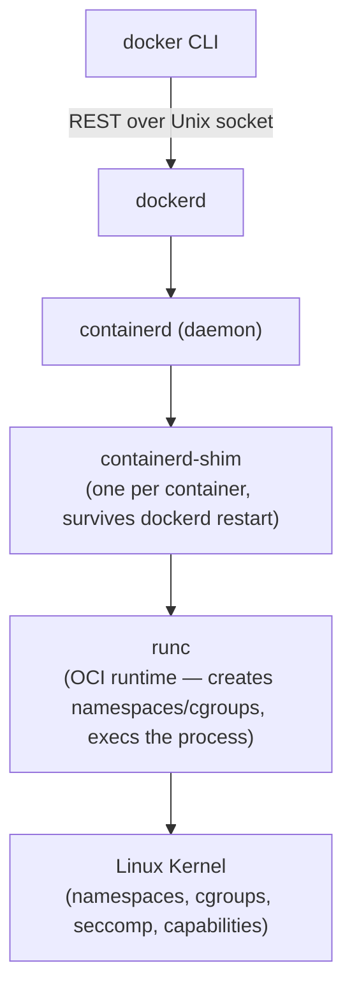
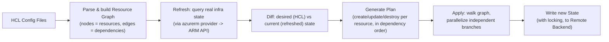

# SECTION 7: CONTAINERS & DOCKER

## 7.1 Concept Overview

Even in a Kubernetes-centric interview, expect at least one question probing whether you understand containers **below** the orchestration layer — namespaces, cgroups, and the OCI spec — because Kubernetes is "just" a scheduler for these primitives. FAANG interviewers use this to catch candidates who can operate `kubectl` but can't explain why a container is isolated, or what "layer caching" actually means at the filesystem level.

## 7.2 Architecture — Docker Engine Internals

**Why the shim matters:** `containerd-shim` decouples the container process's lifecycle from `dockerd`/`containerd` itself — if the daemon restarts (upgrade, crash), running containers are NOT killed, because the shim (a lightweight, long-lived process per container) retains the parent relationship to the container's process, and `containerd` simply re-attaches to existing shims on restart.

## 7.3 Core Components

### Namespaces (Isolation) vs. cgroups (Resource Limiting)
- **Namespaces** (`pid`, `net`, `mnt`, `uts`, `ipc`, `user`) give a process an isolated *view* of the system — its own PID tree, its own network stack/interfaces, its own filesystem mount tree, etc. This is "isolation," not "limiting."
- **cgroups (control groups)** limit and account for *resource consumption* (CPU shares/quota, memory limit, block I/O) for a group of processes — this is what backs Kubernetes' `resources.limits`/`requests`. **cgroups v2** (unified hierarchy, now default on modern kernels/AKS node images) simplified the older v1 per-controller-hierarchy model.

### OverlayFS & Image Layers
Docker images are a stack of read-only layers (each a diff from the previous) plus a thin writable layer at the top for the running container. **OverlayFS** merges these into a single unified view: `lowerdir` (image layers, read-only, shared across containers using the same base image — this is the actual mechanism behind fast, storage-efficient image reuse) + `upperdir` (container's writable layer) + `merged` (the view the container process sees).

### OCI (Open Container Initiative)
A set of vendor-neutral specs (Image Spec, Runtime Spec, Distribution Spec) that decoupled "building/running containers" from Docker specifically — this is *why* containerd, CRI-O, Podman, and Kubernetes' CRI can all interoperate: they all target the same OCI image format and runtime contract rather than a Docker-proprietary format.

### Docker Networking Modes
`bridge` (default, NAT'd via a virtual bridge + iptables, single-host) · `host` (no network namespace isolation — container shares the host's network stack directly, lowest latency, no port mapping needed, but no isolation) · `none` (no networking) · `overlay` (multi-host, Swarm-specific, VXLAN-encapsulated — largely superseded by Kubernetes CNI plugins in production).

## 7.4 Real-World Use Cases
1. Debugging a "works on my machine" issue by comparing `docker history` layer-by-layer between a locally-built and CI-built image, uncovering a base image tag drift (`:latest` resolving to a different digest at build time vs. later).
2. Reducing image size/attack surface by moving from a full Debian-based image to a distroless or Alpine-based multi-stage build, cutting a 900MB image to 40MB.
3. Diagnosing a container hitting its memory cgroup limit and being OOM-killed by the kernel (visible via `dmesg`/kernel cgroup OOM events) distinct from an application-level crash.

## 7.5 Interview Questions

1. **Q: What's the difference between a container and a VM at the architecture level?**
   **A:** A VM virtualizes hardware (each VM runs its own full kernel via a hypervisor); a container shares the host kernel and is isolated via namespaces + resource-limited via cgroups — this is why containers start in milliseconds/seconds (no kernel boot) and have lower overhead, but also why kernel-level vulnerabilities/kernel version differences matter more for containers (shared kernel = shared blast radius for kernel-level exploits) than for VMs.

2. **Q: Why doesn't stopping the Docker daemon kill running containers (with containerd-shim in the picture)?**
   **A:** Each container's actual process lifecycle is owned by its `containerd-shim`, a separate lightweight process that persists independently of `dockerd`/`containerd` — the daemon simply re-attaches to existing shims on restart rather than the shim depending on the daemon staying alive.

3. **Q: Explain exactly how OverlayFS enables efficient image layer reuse across containers.**
   **A:** Each image layer is an immutable, content-addressed read-only directory; OverlayFS mounts multiple such `lowerdir`s plus a per-container `upperdir` (writable) into one `merged` view — because the `lowerdir`s are read-only and shared, ten containers from the same base image share the same on-disk layer data, only the small `upperdir` diff is unique per container.

4. **Q: A container's memory usage is climbing; how do you determine if it's an app-level leak or a cgroup limit misconfiguration before it's OOM-killed?**
   **A:** Compare the container's actual RSS growth trend (`docker stats` / `kubectl top pod` over time) against the configured cgroup memory limit — a steadily climbing RSS with no plateau suggests an application-level leak (fix the app); a limit set far below the application's legitimate working-set size (plateauing near the limit, being killed at steady-state normal load) suggests a limit-sizing issue (raise the limit based on observed steady-state usage with headroom).

5. **Q: Why is `host` network mode generally discouraged in a Kubernetes context?**
   **A:** It removes network namespace isolation entirely — the container binds directly to the host's network interfaces/ports, breaking Kubernetes' per-pod-IP model, creating port conflicts across pods on the same node, and expanding the container's ability to interact with (or attack) the host's network stack directly; it's reserved for narrow cases like specific CNI/monitoring daemons that genuinely need host-network visibility.

## 7.6 Troubleshooting Scenarios
**Scenario — Container works locally but fails to start in production with a different kernel/OS**
- *Symptom:* `exec format error` or a seccomp-related failure in prod, not locally.
- *Investigation:* Compare host kernel versions and architecture (`uname -a`) between environments; check if the image was built for a different CPU architecture (e.g., arm64 image run on an amd64 node) or requires a syscall blocked by a stricter seccomp profile in prod.
- *Root Cause:* Architecture mismatch or a hardened production seccomp/AppArmor profile blocking a syscall the app needs.
- *Fix:* Build multi-arch images (`docker buildx`) or adjust the seccomp profile to explicitly allow the required syscall after security review.
- *Prevention:* Test images in a production-representative hardened environment (same seccomp/AppArmor profile) as part of CI, not just a permissive local Docker Desktop environment.

## 7.7 Production Best Practices & Documentation
- Use multi-stage builds and minimal base images (distroless/Alpine) to reduce attack surface and image size.
- Pin base image digests (not just tags) in production Dockerfiles to prevent silent upstream drift.
- Run containers as non-root with a read-only root filesystem where possible; enforce via Kubernetes Pod Security Standards/Gatekeeper.
- [Docker overview](https://docs.docker.com/get-started/overview/) · [OCI Specifications](https://opencontainers.org/) · [containerd architecture](https://containerd.io/)

---

# SECTION 8: TERRAFORM FOR AZURE

## 8.1 Concept Overview

Terraform interview questions at the FAANG level rarely test HCL syntax — they test whether you understand **state as a distributed-systems problem** (locking, drift, consistency) and can reason about the **dependency graph** Terraform builds internally. The `azurerm` provider is ultimately just another ARM REST API client (see Section 1), so everything about ARM's idempotency/throttling applies underneath Terraform too.

## 8.2 Architecture — Terraform Internals

**Dependency Graph:** Terraform builds a DAG from explicit references (`resource_a.id` used inside `resource_b`) and explicit `depends_on`. Resources with no interdependency are applied **in parallel** (default `-parallelism=10`) — this is why a plan with 50 independent resources is much faster than a naive sequential apply, and why a missing implicit dependency (e.g., relying on an out-of-band ordering assumption not expressed in HCL) can cause race-condition failures that only appear intermittently.

## 8.3 Core Components

### State Management & Remote Backends
Terraform state is a JSON file mapping HCL resource addresses to real-world resource IDs/attributes — it is the **only** way Terraform knows what it manages (Terraform does NOT discover pre-existing resources by scanning the subscription). For Azure, the standard remote backend is an **Azure Storage Account blob container**, which provides:
- **State locking:** via blob **lease** (a native Azure Storage primitive) — when `terraform apply` starts, it acquires a lease on the state blob; a concurrent `apply` attempting to acquire the same lease fails fast with a clear "state locked" error instead of both processes corrupting the state file with a race condition.
- **Versioning:** enabling blob versioning on the backend container gives you state history/rollback capability if a bad apply corrupts state.

### Modules & Workspaces
- **Modules:** reusable, parameterized HCL bundles (analogous to functions) — the standard way to encode "our approved VNet pattern" or "our approved AKS cluster baseline" as a single callable unit across many environments/teams.
- **Workspaces:** a *lightweight* mechanism for maintaining multiple state files from the same configuration (e.g., `dev`/`staging`/`prod`) — commonly misused for full environment isolation when separate **state files with separate backend configs** (or fully separate root modules) provide clearer blast-radius isolation for genuinely distinct environments; workspaces are better suited to short-lived, structurally-identical parallel instances (e.g., per-PR ephemeral environments) than to prod-vs-nonprod separation.

### Lifecycle Blocks
`create_before_destroy` (provision the replacement before destroying the original — critical for zero-downtime replacement of resources requiring recreation, e.g., certain immutable-attribute changes), `prevent_destroy` (hard-fail any plan that would destroy a specific resource — a guardrail for stateful resources like production databases), `ignore_changes` (tell Terraform to stop reconciling drift on specific attributes, often used for attributes modified by another system, like AKS's own auto-scaler adjusting node count out-of-band).

## 8.4 Real-World Use Cases
1. A platform team encodes their entire Landing Zone (Section 1) as a versioned Terraform module, parameterized per onboarding team, using a remote Azure Storage backend per environment with strict RBAC on who can write to the state container.
2. A team uses `prevent_destroy` on their production Cosmos DB and Key Vault resources as a last-line-of-defense guardrail against an accidental `terraform destroy` in CI.
3. An AKS platform team uses `ignore_changes = [default_node_pool[0].node_count]` because Cluster Autoscaler manages node count dynamically, and without this, every `plan` would show a spurious diff fighting the autoscaler's own decisions.

## 8.5 Interview Questions

1. **Q: Why is state locking necessary, and what specifically does an Azure Storage-backed lease provide?**
   **A:** Without locking, two engineers (or two CI runs) running `apply` simultaneously could both read the same "current" state, compute divergent plans, and write conflicting results back — corrupting the state file's consistency with real infrastructure. An Azure Storage blob lease is a built-in exclusive-lock primitive Terraform's `azurerm` backend uses to serialize `apply`/`plan -lock` operations against the same state blob.

2. **Q: What's the practical risk of using Terraform Workspaces to separate dev/staging/prod instead of separate state files?**
   **A:** All workspaces for a configuration share the same backend configuration and the same HCL code path — a bug in the shared configuration (or a wrong `terraform workspace select` before an `apply`) risks accidentally applying a change intended for dev against the prod workspace's state, since the blast-radius isolation is weaker than fully separate backends/state files with separate access control.

3. **Q: How does Terraform decide the order to create/destroy resources during an apply?**
   **A:** It walks the dependency graph (built from explicit references and `depends_on`) — dependent resources wait for their dependencies to complete; independent resources apply in parallel up to the configured parallelism limit; for a resource *replacement* (destroy+create), the default order is destroy-then-create unless `create_before_destroy` is set.

4. **Q: A `terraform plan` shows unexpected changes to a resource nobody touched via Terraform. What's your diagnostic approach?**
   **A:** This is drift — someone/something modified the resource out-of-band (Portal, CLI, another automation tool, or the resource's own control plane like Cluster Autoscaler adjusting node count). Diagnose via Azure Activity Log for the resource (`az monitor activity-log list --resource-id <id>`) to identify the actual out-of-band change and its source, then decide whether to import the new reality into Terraform's expected state, adjust the HCL to match intentionally, or add `ignore_changes` for attributes legitimately managed by another system.

5. **Q: Explain Terraform's plan generation and why it sometimes shows "known after apply" for a value.**
   **A:** During plan, Terraform can't know values that only get assigned by the Azure provider at actual resource-creation time (e.g., a resource's generated ID, or a computed attribute depending on server-side logic) — it marks these as "known after apply" rather than guessing, and any downstream resource depending on such a value can only be *planned* structurally, not fully diffed, until the actual apply resolves it.

## 8.6 Troubleshooting Scenarios
**Scenario — `Error: A resource with the ID already exists` on `terraform apply`**
- *Symptom:* Apply fails because the target Azure resource already exists (created manually, or by a previous partially-failed apply).
- *Investigation:* `az resource show --ids <id>` to confirm the resource's actual existence and current config.
- *Root Cause:* The resource was created outside Terraform's state tracking (manual creation, or state file loss/corruption after a prior successful apply).
- *Fix:* `terraform import <resource_address> <azure_resource_id>` to bring it under management without recreating it, then run `plan` to reconcile any config drift.
- *Prevention:* Enforce that ALL production resource creation goes through the IaC pipeline (via Azure Policy `deny` on manual creation paths where feasible, or strict RBAC limiting Portal/CLI write access to a break-glass role only).

## 8.7 Production Best Practices, Security & Documentation
- Store state in an Azure Storage backend with versioning + soft-delete enabled, and RBAC-restrict write access to the CI/CD service principal only.
- Never commit `.tfstate` or `.tfvars` files containing secrets to source control; use Key Vault data sources or a secrets-injection pipeline step instead.
- Pin `required_providers` versions explicitly; review provider changelogs before upgrading in production.
- [Terraform azurerm provider docs](https://registry.terraform.io/providers/hashicorp/azurerm/latest/docs) · [Terraform state documentation](https://developer.hashicorp.com/terraform/language/state) · [Backend configuration: azurerm](https://developer.hashicorp.com/terraform/language/settings/backends/azurerm)

## 8.8 Comparison with AWS/GCP Native IaC
| Concept | Terraform (Azure) | AWS CloudFormation/CDK | GCP Deployment Manager/Config Connector |
|---|---|---|---|
| State tracking | Explicit state file (backend) | Implicit (CFN Stack IS the state) | Varies (DM has state; Config Connector uses K8s CRDs as state) |
| Multi-cloud | Yes (single tool, many providers) | AWS-only | GCP-only |
| Native vendor support/turnaround for new features | Slight lag behind native tools for brand-new service features | Immediate (native) | Immediate (native) |

---

*Continue to [08-CICD-PLATFORMS.md](./08-CICD-PLATFORMS.md) for Sections 9-10 (Azure DevOps & GitHub Actions).*
