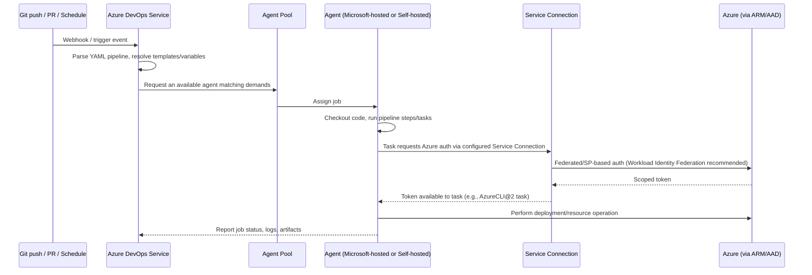
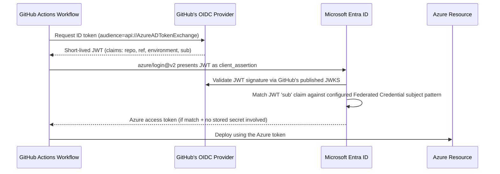

# SECTION 9: AZURE DEVOPS

## 9.1 Concept Overview

Azure DevOps interview questions test enterprise CI/CD design maturity: multi-stage YAML pipelines, agent pool architecture, and — critically for a security-minded FAANG interview — **service connection trust models** (the exact mechanism by which a pipeline gets Azure access, and its blast radius if compromised).

## 9.2 Architecture — Pipeline Execution Flow

## 9.3 Core Components

### Agents: Microsoft-Hosted vs. Self-Hosted
**Microsoft-hosted agents** are ephemeral VMs (fresh per job, no persistent state, no network path into your private VNet without additional peering/tunnel setup). **Self-hosted agents** run on infrastructure you manage (VM, VMSS, or containerized) — required when a job needs direct network access to private resources (a private AKS API server, an on-prem database) or specific pre-installed tooling/licenses. **Self-hosted agent security tradeoff:** the agent process runs with whatever credentials/network access you grant it — a compromised self-hosted agent (e.g., via a malicious PR pipeline run) is a much larger blast radius than an ephemeral Microsoft-hosted agent that's destroyed after the job.

### Service Connections
The trust bridge from Azure DevOps to Azure — historically backed by a Service Principal with a stored secret; the modern, recommended pattern is a **Workload Identity Federation-based Service Connection** (Azure DevOps itself acts as the OIDC issuer, federating trust to an Entra ID App Registration with zero stored secret), eliminating the "leaked ADO service connection secret" risk class entirely — directly analogous to the AKS Workload Identity pattern from Section 2.

### Multi-Stage YAML Pipelines
Pipelines define `stages` → `jobs` → `steps`, with **environment-scoped approvals/checks** (e.g., a manual approval gate before the `Production` stage, or automated checks like "require a passing security scan") configured on the **Environment** resource itself (not just in YAML), providing an auditable, centrally-governed gate independent of what any individual pipeline author writes.

### Artifacts & Release Pipelines
**Azure Artifacts** hosts package feeds (npm/NuGet/Maven/pip) with upstream-source proxying (caching public registry packages, reducing external dependency risk and improving build speed/resilience to upstream outages). Classic **Release Pipelines** (UI-designer based, separate from Build pipelines) are largely superseded by unified **multi-stage YAML pipelines** (build + deploy stages in one version-controlled file) — a candidate should know Release Pipelines still exist in legacy environments but YAML is the current recommended model for full pipeline-as-code auditability.

## 9.4 Real-World Use Cases
1. A platform team migrates 200 Service Connections from Service Principal secrets to Workload Identity Federation, tracked via a Resource Graph-style audit query against Entra ID App Registration credential types.
2. An enterprise configures **Environment-level approval checks** requiring a security team sign-off before any pipeline can deploy to the `Production` environment, fully audited independent of individual pipeline YAML trustworthiness.
3. A regulated company uses **self-hosted agents in a locked-down VNet** (no internet egress except explicitly allow-listed package feeds) for pipelines handling PCI-scoped deployments, while using Microsoft-hosted agents for all non-sensitive workloads.

## 9.5 Interview Questions

1. **Q: When must you use a self-hosted agent instead of a Microsoft-hosted one?**
   **A:** When the job needs direct network access to private resources unreachable from Microsoft's shared agent pool (private AKS API server, on-prem systems), needs specific licensed tooling not available in the hosted image, or requires longer-than-hosted-agent job time limits.

2. **Q: What's the security risk of a classic (secret-based) Service Connection versus a Workload Identity Federation-based one?**
   **A:** A secret-based connection stores a long-lived client secret (or certificate) that, if leaked (misconfigured log output, compromised agent), grants an attacker standing access until manually rotated/revoked. A federation-based connection has no stored secret at all — trust is established via OIDC federation and every token exchange is a fresh, short-lived, cryptographically verified proof scoped to the specific pipeline/environment context.

3. **Q: How do Environment-level approval checks provide a stronger guarantee than a manual approval step written inside pipeline YAML?**
   **A:** YAML-embedded approval logic can be edited by anyone with pipeline-edit permission (weakening the gate); Environment-level checks are configured on the Environment resource itself, governed by separate, typically more restrictive RBAC (who can modify the Environment's checks), providing a control that isn't merely "self-service" removable by the same people the gate is meant to constrain.

4. **Q: Design a secure multi-stage pipeline for deploying to Dev, Staging, and Production AKS clusters with strict separation of duties.**
   **A:** Separate Environments per stage, each with its own scoped Service Connection (least-privilege, no single identity spanning all three), Production Environment configured with mandatory manual approval from a specific security/lead group plus automated checks (passing security scan, successful Staging soak-test result), and pipeline YAML templates centrally maintained in a shared repository (referenced, not copy-pasted per team) to ensure consistent security posture across all pipelines rather than per-team drift.

## 9.6 Production Best Practices, Security & Documentation
- Migrate all Service Connections to Workload Identity Federation; audit remaining secret-based connections continuously.
- Use Environment-level approvals/checks for any production deployment gate, not YAML-embedded logic.
- Restrict self-hosted agent pools' network egress to only required destinations; treat agent compromise as a realistic threat model.
- [Azure Pipelines documentation](https://learn.microsoft.com/en-us/azure/devops/pipelines/) · [Service connections for Azure DevOps](https://learn.microsoft.com/en-us/azure/devops/pipelines/library/service-endpoints) · [Workload identity federation for Azure DevOps](https://learn.microsoft.com/en-us/azure/devops/pipelines/release/configure-workload-identity)

---

# SECTION 10: GITHUB ACTIONS

## 10.1 Concept Overview

GitHub Actions questions in a FAANG interview focus heavily on **OIDC federation for cloud deployments** (the same secret-less pattern as Sections 2 and 9, now from GitHub's side) and **runner security hardening** — GitHub Actions' broader ecosystem (public marketplace actions, fork-triggered workflows) introduces supply-chain risks that a security-conscious candidate should proactively raise.

## 10.2 Architecture — OIDC Federation Flow

## 10.3 Core Components

### Runners: GitHub-Hosted vs. Self-Hosted
Identical tradeoff to Azure DevOps agents: GitHub-hosted runners are ephemeral, isolated per-job VMs with no persistent state; self-hosted runners are required for private network access or custom tooling, but carry materially higher risk — **a self-hosted runner attached to a public repository is a well-known attack vector** (a malicious PR can trigger a workflow executing arbitrary code on your runner if the workflow is misconfigured to run on `pull_request_target` with untrusted checkout) — GitHub explicitly warns against self-hosted runners on public repos for this reason.

### OIDC Federation (Detailed)
The Federated Credential's subject pattern can scope trust extremely precisely: `repo:org/repo:ref:refs/heads/main` (main branch only), `repo:org/repo:environment:production` (only workflows deploying via a specific GitHub Environment), or `repo:org/repo:pull_request` (PR-triggered workflows, generally scoped to read-only/lower-privilege operations, never production deploys). Getting the subject pattern too broad (e.g., matching any branch/any ref) is the most common OIDC federation misconfiguration, effectively granting any contributor who can open a branch the same Azure access as the main deployment pipeline.

### Reusable Workflows
Centrally-maintained workflow definitions (`workflow_call` trigger) that other repositories' workflows invoke — the GitHub Actions equivalent of Azure DevOps YAML templates, letting a platform team enforce a single, security-reviewed deployment workflow across hundreds of application repos instead of each team hand-writing (and potentially misconfiguring) their own.

### Matrix Builds
Declaratively fan out a job across a combinatorial set of variables (OS x language-version x architecture) — GitHub Actions runs each combination as a parallel job, useful for cross-platform testing but a common cost/quota-exhaustion surprise if the matrix size isn't bounded thoughtfully (e.g., an unbounded `strategy.matrix` sourced from dynamic input).

### Security Hardening Checklist
- Pin third-party Actions to a **full commit SHA**, not a mutable tag (`uses: actions/checkout@<sha>` not `@v4`) — tags can be moved/compromised (a real supply-chain attack vector demonstrated in practice).
- Set default `GITHUB_TOKEN` permissions to `read-only` at the repo/org level, elevating only specific jobs that genuinely need write access.
- Never use `pull_request_target` with a checkout of the PR's own (untrusted) code combined with secrets exposure — this combination is the canonical GitHub Actions privilege-escalation pattern (untrusted code + trusted secrets in the same execution context).
- Require review/approval for workflow runs from first-time contributors (a built-in GitHub setting) to prevent immediate malicious-PR workflow execution.

## 10.4 Real-World Use Cases
1. A platform team publishes a single **reusable workflow** for "deploy to AKS via Workload Identity Federation," consumed by 150 application repos, ensuring a consistent, centrally-patchable security posture instead of 150 hand-rolled deployment scripts.
2. A security team runs an org-wide audit (via the GitHub API) for any workflow still using `pull_request_target` combined with an explicit untrusted-ref checkout step, remediating the highest-risk supply-chain misconfiguration first.
3. A company migrates from long-lived `AZURE_CLIENT_SECRET` GitHub secrets to OIDC federation scoped precisely to `environment:production`, closing off any non-production branch from ever obtaining production Azure credentials.

## 10.5 Interview Questions

1. **Q: Why is `pull_request_target` considered dangerous, and when is it still safely usable?**
   **A:** `pull_request_target` runs with the *base* repository's secrets/permissions (unlike `pull_request`, which runs in a restricted context) but is often paired with an explicit checkout of the PR's *head* (untrusted, attacker-controlled) code — combining trusted secrets with untrusted code execution is a direct privilege-escalation path. It's safely usable only when the workflow does NOT execute any code from the PR's head ref (e.g., purely labeling/commenting workflows based on PR metadata).

2. **Q: How would you scope an OIDC Federated Credential to ensure only your production deployment workflow — not any arbitrary branch — can obtain production Azure credentials?**
   **A:** Configure the Federated Credential's subject to `repo:org/repo:environment:production` (tied to a GitHub Environment, which itself can require manual approval/specific branch restrictions), rather than a broad `ref:refs/heads/*` pattern — combining GitHub's Environment protection rules with Azure's federated credential subject matching for defense in depth.

3. **Q: What's the risk of pinning a third-party Action by tag (`@v4`) instead of a commit SHA?**
   **A:** Tags are mutable references an attacker (if they compromise the Action's repository/maintainer account) can repoint to malicious code without changing the version string your workflow references — pinning to an immutable commit SHA ensures the exact reviewed code always runs, regardless of what happens to the tag later.

4. **Q: Design a GitHub Actions CI/CD security architecture for an organization with 500 repositories, comparing it to what you'd do in Azure DevOps.**
   **A:** Reusable workflows (analogous to ADO YAML templates) centrally maintained by a platform team, org-wide default `GITHUB_TOKEN` permissions set to read-only, OIDC federation exclusively (no stored cloud secrets) scoped per-Environment with GitHub Environment protection rules requiring approval for production, mandatory commit-SHA pinning for third-party Actions enforced via a policy-as-code check (e.g., a required status check scanning workflow files), and self-hosted runners (if needed for private network access) isolated to private repositories only, never attached to public repos. The core parallel to Azure DevOps: both platforms converge on "OIDC federation + environment-scoped approval gates + centrally-templated pipelines," differing mainly in marketplace-driven supply-chain risk being a bigger concern in the GitHub Actions ecosystem due to the sheer volume of third-party community Actions.

## 10.6 Comparison: Azure DevOps vs. GitHub Actions
| Concept | Azure DevOps | GitHub Actions |
|---|---|---|
| Pipeline-as-code format | YAML (Azure Pipelines schema) | YAML (Actions workflow schema) |
| Reusable pipeline logic | Templates (`extends`/`template` includes) | Reusable workflows (`workflow_call`) |
| Secret-less cloud auth | Workload Identity Federation Service Connection | OIDC federation (`id-token: write` permission) |
| Approval gates | Environment-level approvals & checks | Environment protection rules |
| Marketplace/third-party ecosystem risk | Lower (smaller, more curated extension marketplace) | Higher (huge community Action ecosystem — commit-SHA pinning is essential) |
| Built-in package registry | Azure Artifacts | GitHub Packages |

## 10.7 Documentation
- [GitHub Actions security hardening guide](https://docs.github.com/en/actions/security-guides/security-hardening-for-github-actions)
- [Configuring OpenID Connect in Azure](https://docs.github.com/en/actions/deployment/security-hardening-your-deployments/configuring-openid-connect-in-azure)
- [About service accounts and self-hosted runner security](https://docs.github.com/en/actions/hosting-your-own-runners/managing-self-hosted-runners/about-self-hosted-runners#self-hosted-runner-security)
- [Reusing workflows](https://docs.github.com/en/actions/using-workflows/reusing-workflows)

---

*Continue to [09-OBSERVABILITY-SECURITY.md](./09-OBSERVABILITY-SECURITY.md) for Sections 11-12 (Observability & SRE, Azure Security).*
