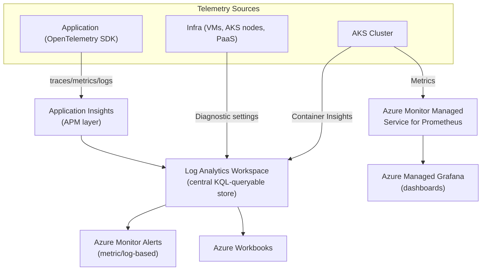
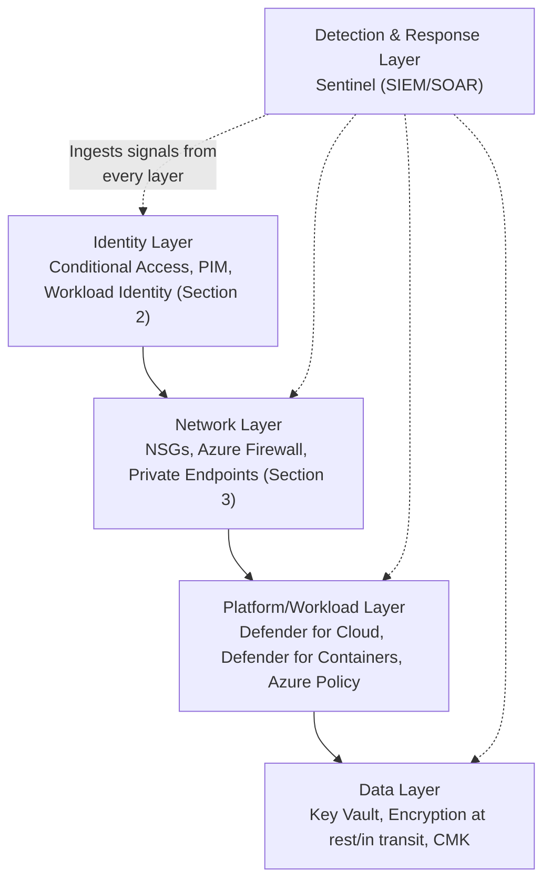

# SECTION 11: OBSERVABILITY & SRE

## 11.1 Concept Overview

Observability questions probe whether you can design a monitoring stack that answers "why" not just "what," and SRE questions probe whether you think in terms of **error budgets and reliability engineering trade-offs** rather than "just fix everything." A strong candidate treats SLOs as a business/engineering negotiation tool, not a purely technical metric.

## 11.2 Architecture — Azure Observability Stack

## 11.3 Core Components

### Azure Monitor, Log Analytics, Application Insights
**Azure Monitor** is the umbrella platform; **Log Analytics Workspace** is its KQL-queryable log/metric data store; **Application Insights** is the APM layer built on top (distributed tracing, dependency maps, live metrics) — architecturally, Application Insights telemetry is *stored in* a Log Analytics workspace (in the "workspace-based" mode, current default), meaning `AppTraces`/`AppRequests`/`AppDependencies` tables are queryable with the same KQL alongside infrastructure logs — a key point for explaining why cross-correlating app and infra telemetry in one query is possible.

### Managed Prometheus & Managed Grafana
**Azure Monitor Managed Service for Prometheus** ingests Prometheus-format metrics (via a managed remote-write agent on AKS) without you operating a Prometheus server/storage yourself, storing them in an Azure Monitor Workspace (a separate metrics-optimized store from Log Analytics). **Azure Managed Grafana** is a fully-managed Grafana instance pre-wired to query both Managed Prometheus and Azure Monitor metrics — the standard modern replacement for self-hosted Prometheus+Grafana on AKS, removing the operational burden of scaling/patching that stack yourself.

### OpenTelemetry
The vendor-neutral instrumentation standard (traces, metrics, logs) — Azure Monitor's OpenTelemetry-based SDKs let an application emit telemetry that could, in principle, be routed to any OTel-compatible backend, avoiding vendor lock-in at the instrumentation layer even if you're currently exporting to Application Insights.

## 11.4 SRE Fundamentals

### SLI, SLO, SLA, Error Budgets
- **SLI (Service Level Indicator):** a directly-measured metric (e.g., "fraction of requests served in <300ms," "fraction of requests returning non-5xx").
- **SLO (Service Level Objective):** an internal target for an SLI over a window (e.g., "99.9% of requests succeed over a rolling 30 days").
- **SLA (Service Level Agreement):** an externally-facing, often contractual commitment (usually looser than the internal SLO, providing headroom before a customer-facing breach) with consequences (credits/penalties) if violated.
- **Error Budget:** `1 - SLO` — the acceptable amount of "unreliability" over the window (e.g., a 99.9% SLO gives a 0.1% error budget, ≈43 minutes of full downtime-equivalent per 30 days). **The core SRE practice:** once the error budget is exhausted, feature velocity is deliberately throttled in favor of reliability work — this is the mechanism that operationalizes the classic "move fast" vs. "keep it stable" tension as a data-driven policy rather than a political argument.

### Incident Management & RCA
A mature incident process: **Detect** (alerting on SLO burn-rate, not just raw thresholds) → **Triage** (assign an Incident Commander, establish a communication channel) → **Mitigate** (stop the bleeding — rollback/feature-flag/scale — before root-causing) → **Resolve** → **RCA (blameless postmortem)** documenting timeline, contributing factors, and concrete follow-up action items with owners/deadlines. **Blameless** is emphasized because psychological safety is what makes engineers report/surface issues honestly rather than hiding near-misses.

## 11.5 Real-World Use Cases
1. A platform team defines a **multi-window, multi-burn-rate alert** (fast burn: 2% budget consumed in 1 hour triggers page; slow burn: 10% consumed in 6 hours triggers a ticket) instead of a single static threshold, reducing alert fatigue while still catching both sudden and slow-degradation incidents.
2. An SRE team migrates a self-hosted Prometheus/Grafana stack (with its own HA/storage scaling pain) to Azure Managed Prometheus/Grafana, eliminating a recurring on-call burden around Prometheus storage capacity planning.
3. A team correlates a spike in `AppRequests` failure rate in Application Insights with a concurrent `KubePodInventory`/Container Insights signal showing OOMKilled events on the same deployment, cutting RCA time from hours to minutes via a single cross-table KQL query.

## 11.6 Interview Questions

1. **Q: What's the practical difference between an SLO and an SLA?**
   **A:** SLO is an internal engineering target; SLA is an external, often contractual commitment — SLAs are typically set looser than the internal SLO specifically to provide a buffer, so that a genuine SLO miss doesn't automatically trigger a customer-facing contractual breach.

2. **Q: Why is a multi-burn-rate alerting strategy preferred over a single static threshold?**
   **A:** A single "alert if error rate > X%" threshold either fires too often on brief blips (alert fatigue) or misses slow, sustained degradations that never spike above the instantaneous threshold but still consume significant error budget over time — multi-window burn-rate alerting (short-window fast-burn for urgent paging, long-window slow-burn for ticket-level follow-up) catches both failure modes with appropriately different urgency.

3. **Q: How does Application Insights relate to Log Analytics architecturally?**
   **A:** In workspace-based mode (current default), Application Insights telemetry (requests, dependencies, traces, exceptions) is stored directly inside a Log Analytics workspace as standard tables, queryable via the same KQL alongside infrastructure/container logs — enabling single-query cross-correlation between app-level and infra-level signals.

4. **Q: Design an observability strategy for a 200-microservice AKS platform ensuring you can always answer "which service caused a customer-facing error" within minutes.**
   **A:** Mandate OpenTelemetry distributed tracing with **trace-context propagation** across every service boundary (so a single customer request's trace spans all involved services with one correlation ID), Container Insights for infra-level pod/node health, Managed Prometheus for custom business/application metrics, and a service-dependency map (built from trace data) so an on-call engineer can immediately see the fault's blast radius. Multi-burn-rate SLO alerting per service (not just a single platform-wide alert) ensures the specific failing service pages the right owning team directly, rather than a generic "something's wrong" alert requiring manual triage across 200 services.

## 11.7 Troubleshooting Scenarios
**Scenario — Alert fatigue causing on-call to ignore a real incident**
- *Symptom:* A genuine outage's alert was dismissed because on-call had become desensitized to frequent false-positive pages.
- *Investigation:* Review alert-firing history over the past quarter for the specific alert rule's true-positive vs. false-positive ratio.
- *Root Cause:* Alert threshold set too sensitively (or based on a raw metric rather than SLO burn-rate), causing frequent non-actionable pages.
- *Fix:* Redesign the alert as an SLO-burn-rate-based, multi-window alert; retire low-value alerts entirely rather than tuning thresholds indefinitely.
- *Prevention:* Track and review alert "actionability rate" as an ongoing SRE metric — any alert with a persistently low true-positive rate should be redesigned or removed.

## 11.8 Production Best Practices, Cost & Documentation
- Use workspace-based Application Insights and centralize all Log Analytics workspaces per environment (not per-resource) to enable cross-resource correlation.
- Set Log Analytics **data retention** and **daily cap** deliberately — uncontrolled verbose logging is a top, easily-overlooked Azure cost driver.
- Adopt error-budget policies formally (documented, agreed with product stakeholders) so reliability-vs-velocity tradeoffs are a shared decision, not solely an engineering call.
- [Azure Monitor overview](https://learn.microsoft.com/en-us/azure/azure-monitor/overview) · [Application Insights overview](https://learn.microsoft.com/en-us/azure/azure-monitor/app/app-insights-overview) · [Azure Monitor managed service for Prometheus](https://learn.microsoft.com/en-us/azure/azure-monitor/essentials/prometheus-metrics-overview) · [Azure Managed Grafana](https://learn.microsoft.com/en-us/azure/managed-grafana/overview) · [Google SRE Book: SLOs](https://sre.google/sre-book/service-level-objectives/)

---

# SECTION 12: AZURE SECURITY

## 12.1 Concept Overview

Security questions at the FAANG level expect **defense in depth** and **threat modeling** reasoning, not a list of product names. A strong answer connects a specific Azure security service to the specific threat/attack stage it mitigates (e.g., "Defender for Cloud's agentless scanning addresses the *detection* stage, Key Vault CMK addresses *data-at-rest confidentiality*, Conditional Access addresses *initial-access* prevention").

## 12.2 Architecture — Defense-in-Depth Layering

## 12.3 Core Components

### Microsoft Defender for Cloud
Cloud Security Posture Management (CSPM, continuous configuration/compliance scoring against benchmarks like CIS/NIST) + Cloud Workload Protection Platform (CWPP, threat detection for specific workload types — Defender for Servers, Defender for Containers, Defender for SQL, Defender for Key Vault, etc.). **Defender for Containers** specifically scans container images in ACR for vulnerabilities *before* deployment and monitors runtime threats (anomalous process execution, privilege escalation attempts) inside running AKS workloads.

### Microsoft Sentinel
A cloud-native SIEM + SOAR: ingests logs/alerts from Defender for Cloud, Entra ID sign-in logs, NSG flow logs, application logs, etc., correlates them via **analytics rules** (KQL-based detections) into unified **Incidents**, and can trigger automated **Playbooks** (Logic Apps) for response (e.g., auto-disable a compromised user account, auto-isolate a compromised VM's NSG).

### Key Vault, Encryption, and Customer-Managed Keys
Azure encrypts data at rest **by default** using Microsoft-managed keys for virtually every service (Storage, SQL, managed disks). **Customer-Managed Keys (CMK)** let you supply/control the actual encryption key (stored in Key Vault, or Key Vault Managed HSM for FIPS 140-2 Level 3 hardware-backed keys) — the differentiator is **control and revocability**: with CMK, you can revoke the key (disabling access to all data encrypted with it, even for Microsoft) independent of any other access control, a specific compliance requirement in regulated industries (a "right to be forgotten"-adjacent capability, and a common ransomware/insider-threat mitigation: revoke key access to instantly render data inaccessible).

### Disk Encryption & Network Security (Recap + Threat Modeling Lens)
Azure Disk Encryption (ADE, guest-OS-level, BitLocker/DM-Crypt) vs. Server-Side Encryption (SSE, platform-level, transparent, default-on) — SSE with CMK is generally preferred over ADE today for most scenarios since it doesn't require in-guest agent management, unless a specific compliance mandate requires guest-OS-level encryption specifically.

## 12.4 Threat Modeling Example — STRIDE Applied to an AKS Workload
| STRIDE Category | AKS-Specific Threat | Azure Mitigation |
|---|---|---|
| **S**poofing | Attacker impersonates a legitimate pod's identity | Workload Identity Federation (cryptographic, non-forgeable token binding) |
| **T**ampering | Malicious image injected into the deployment pipeline | ACR image scanning (Defender for Containers), signed images (Notary/cosign), admission control allow-listing registries |
| **R**epudiation | No audit trail of who deployed what | Azure Activity Log + Sentinel ingestion of AKS audit logs, immutable log retention |
| **I**nformation Disclosure | Secrets exposed via misconfigured volume/env var | Key Vault CSI driver (never stored in etcd plaintext), NetworkPolicies limiting lateral movement |
| **D**enial of Service | Resource-exhaustion attack against shared cluster | ResourceQuotas/LimitRanges, DDoS Protection Standard at the ingress edge |
| **E**levation of Privilege | Container escape to node/host | Pod Security Standards (non-root, no privileged containers), seccomp/AppArmor profiles, Defender for Containers runtime threat detection |

## 12.5 Interview Questions

1. **Q: What's the actual security benefit of Customer-Managed Keys if Microsoft already encrypts data by default?**
   **A:** Default (Microsoft-managed key) encryption protects against disk-level physical theft but Microsoft controls the key. CMK gives you independent, revocable control — you can disable/revoke the key at any time to instantly render data cryptographically inaccessible (a strong ransomware/insider-threat/offboarding control) without relying solely on RBAC/network controls, and many compliance frameworks specifically require this level of customer control.

2. **Q: How does Defender for Containers differ from a standard vulnerability scanner?**
   **A:** It covers both the "left" (pre-deployment image scanning in ACR/CI, catching known CVEs before they ever run) and the "right" (runtime threat detection inside the running cluster — anomalous process execution, suspicious kubectl exec activity, privilege escalation attempts) — a standard scanner typically covers only the pre-deployment scanning half.

3. **Q: Design a ransomware-resilience strategy using Azure-native primitives.**
   **A:** Immutable backups (Azure Backup with soft-delete + immutability/WORM policies preventing even a compromised Owner-role account from deleting backup data within the retention window), CMK for critical data stores with a documented, tested key-revocation runbook, network segmentation (Private Endpoints + NSGs limiting lateral movement), Sentinel analytics rules detecting mass-encryption-pattern file activity or anomalous authentication, and a tested, regularly-drilled recovery runbook (recovery time is only theoretical until it's been exercised).

4. **Q: Explain how you'd apply STRIDE threat modeling to a new Azure architecture during a design review.**
   **A:** For each trust boundary crossing in the architecture diagram (e.g., internet → Front Door, Front Door → App Gateway, App Gateway → AKS, AKS → database), systematically evaluate each STRIDE category — is spoofing possible at this boundary, could data be tampered with in transit, is there sufficient audit logging for repudiation, could sensitive information leak, could this boundary be a DoS target, could an attacker escalate privilege crossing it — and map each identified threat to a specific Azure control, producing a threat-model document as a design-review artifact.

## 12.6 Troubleshooting Scenarios
**Scenario — Sentinel generating a high volume of false-positive incidents from a legitimate automation service account**
- *Symptom:* An analytics rule repeatedly flags a CI/CD service principal's frequent, high-volume API calls as "anomalous."
- *Investigation:* Review the analytics rule's baseline/threshold logic and confirm the service account's activity pattern against its documented expected behavior.
- *Root Cause:* The detection rule's baseline wasn't tuned to account for legitimate high-frequency automation identities, treating them the same as human user behavior baselines.
- *Fix:* Add an explicit exclusion/allow-list entry for known automation identities in the analytics rule, or create a separate baseline/threshold tier for non-human identities.
- *Prevention:* Tag and separately baseline all service principal/managed identity activity from human user activity in detection engineering from the start.

## 12.7 Documentation
- [Microsoft Defender for Cloud overview](https://learn.microsoft.com/en-us/azure/defender-for-cloud/defender-for-cloud-introduction)
- [Microsoft Sentinel overview](https://learn.microsoft.com/en-us/azure/sentinel/overview)
- [Azure Key Vault overview](https://learn.microsoft.com/en-us/azure/key-vault/general/overview)
- [Use customer-managed keys](https://learn.microsoft.com/en-us/azure/security/fundamentals/encryption-customer-managed-keys)
- [Defender for Containers](https://learn.microsoft.com/en-us/azure/defender-for-cloud/defender-for-containers-introduction)
- [Microsoft STRIDE threat modeling](https://learn.microsoft.com/en-us/azure/security/develop/threat-modeling-tool-threats)

---

*Continue to [10-DATABASES-EVENTDRIVEN.md](./10-DATABASES-EVENTDRIVEN.md) for Sections 13-14 (Azure Databases, Event-Driven Architecture).*
