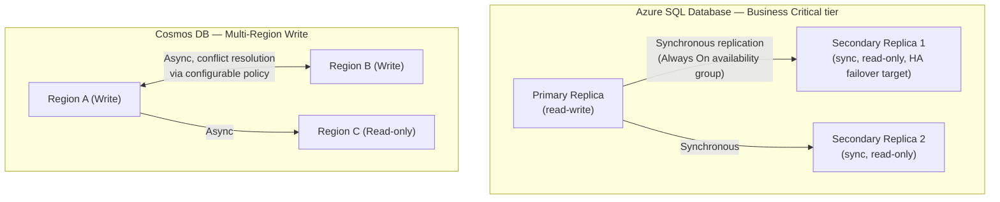
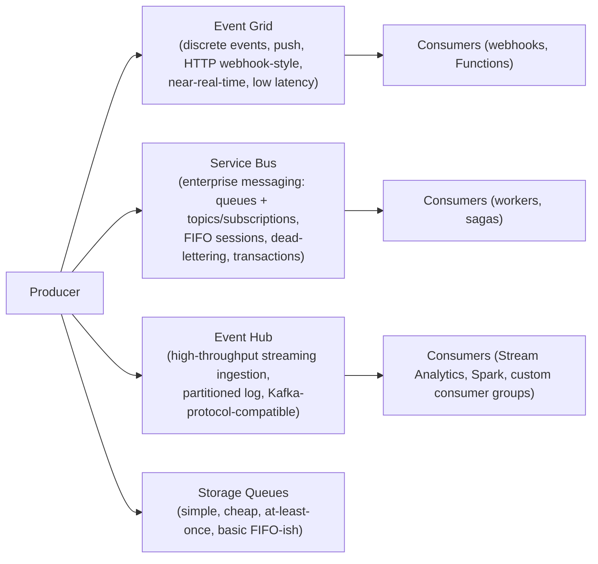

# SECTION 13: AZURE DATABASES

## 13.1 Concept Overview

Database questions test distributed-systems fundamentals — replication, consistency models, partitioning — applied to specific Azure services. The FAANG-level bar is explaining **why** a consistency level or partition key choice was made, tying back to CAP-theorem-style tradeoffs, not just naming the service.

## 13.2 Architecture — Azure SQL / Cosmos DB Replication

## 13.3 Core Components

### Azure SQL Database
PaaS relational DB (SQL Server engine, but Microsoft manages patching/HA). **Business Critical tier** uses synchronous Always On replicas for sub-30-second automatic failover; **General Purpose tier** uses remote storage (Azure Premium Storage) with a single compute node, cheaper but with higher failover time since a new compute node must attach to the remote storage on failure.

### Cosmos DB — Consistency Levels
Cosmos DB is the flagship example of **tunable consistency**, offering 5 levels on a spectrum:
| Level | Guarantee | Tradeoff |
|---|---|---|
| **Strong** | Linearizability — reads always see the latest committed write | Highest latency, lowest availability during partition (single-region write architecture effectively required) |
| **Bounded Staleness** | Reads lag writes by at most K versions or T time | Near-strong guarantees with better availability |
| **Session** (default) | Read-your-own-writes guaranteed *within a session* (client session token) | Good balance; most common production default |
| **Consistent Prefix** | Reads never see out-of-order writes (but may be stale) | Higher availability |
| **Eventual** | No ordering guarantee at all | Lowest latency, highest availability |

**Why Session is the default:** it gives the practically-most-relevant guarantee (a user always sees their own writes immediately) without paying the global-coordination cost of Strong consistency, which is the correct default for the vast majority of multi-region applications.

### Partitioning & Sharding
Cosmos DB's **partition key** determines physical distribution across "physical partitions" (each with its own throughput/storage budget) — a poorly chosen partition key (e.g., low-cardinality, like `country` for a US-heavy user base) creates a **hot partition** (one physical partition absorbing disproportionate load, throttled with `429`s, while others sit idle) — this is conceptually identical to the DynamoDB hot-partition problem and a very common system-design interview probe. The fix is choosing a high-cardinality key (e.g., `userId`) or a **synthetic composite key** (`userId_date`) when the natural key isn't selective enough.

### PostgreSQL, MySQL, Redis Cache
**Azure Database for PostgreSQL/MySQL Flexible Server** are the current-generation managed offerings (replacing older Single Server SKUs), supporting zone-redundant HA and read replicas. **Azure Cache for Redis** provides sub-millisecond in-memory caching — a standard architectural pattern for offloading read-heavy database load (cache-aside pattern) or session-state storage for stateless app tiers.

## 13.4 Real-World Use Cases
1. A gaming platform uses **Cosmos DB with multi-region write** and Session consistency for player-profile data, giving each region low-latency local writes while accepting eventual (bounded) cross-region convergence for non-critical fields, with last-write-wins conflict resolution.
2. A financial services app uses **Azure SQL Business Critical** with synchronous Always On replicas specifically because transactional consistency and sub-30s automatic failover are non-negotiable compliance/RTO requirements.
3. An e-commerce platform diagnosed a Cosmos DB hot-partition issue (partition key = `productCategory`, low cardinality) causing systematic `429`s during a flash sale, resolved by re-partitioning on `productId`.

## 13.5 Interview Questions

1. **Q: Why would you choose Session consistency over Strong consistency in Cosmos DB for most applications?**
   **A:** Session gives read-your-own-writes guarantees (the practically important case for most user-facing apps) at dramatically better latency/availability than Strong, which requires global coordination on every write — Strong is reserved for genuinely non-negotiable global-linearizability requirements (rare, and often re-architected around instead).

2. **Q: How do you diagnose and fix a Cosmos DB hot-partition problem?**
   **A:** Diagnose via the `NormalizedRUConsumption` metric per physical partition (Azure Monitor) showing one partition consistently near 100% while others are low, or via repeated `429` responses concentrated on requests with a specific partition-key value range; fix by choosing a higher-cardinality partition key or introducing a synthetic composite key to spread load more evenly.

3. **Q: Explain the failover time difference between Azure SQL General Purpose and Business Critical tiers.**
   **A:** General Purpose separates compute from storage (remote Azure Premium Storage) — failover requires a new compute node to attach to that remote storage, taking longer. Business Critical maintains synchronous local-SSD replicas via Always On availability groups — failover is just a role-switch to an already-current replica, completing in seconds rather than the longer General Purpose recovery window.

4. **Q: Design the database architecture for a global social media platform requiring low-latency reads/writes in 5 regions with eventual global consistency acceptable for likes/comments but requiring stronger consistency for account/auth data.**
   **A:** Split by data-consistency requirement: Cosmos DB with multi-region write + Session (or Bounded Staleness) consistency for likes/comments/feed data (optimizing for low-latency local writes, tolerating brief cross-region staleness), while account/auth data lives in a smaller, single-region (or Strong-consistency, carefully-scoped) store — potentially Azure SQL with geo-replication for DR but a single write region to avoid split-brain on security-critical data — explicitly acknowledging that not all data in one system needs the same consistency model, and mixing models per data class is a legitimate, common production pattern.

## 13.6 Troubleshooting Scenarios
**Scenario — Sudden spike in Cosmos DB 429 (Request Rate Too Large) errors**
- *Symptom:* Application throughput drops, client SDK retries visible in logs, `429`s in Cosmos DB metrics.
- *Investigation:* Check per-partition RU consumption in Azure Monitor; check if provisioned RU/s (or autoscale max RU/s) is simply undersized for current load, vs. a hot-partition skew.
- *Root Cause:* Either genuine under-provisioning (raise RU/s or switch to autoscale) or a hot-partition skew from a low-cardinality partition key (requires a data-model change, not just more RU/s).
- *Fix:* Short-term: raise provisioned/autoscale RU/s. Long-term (if hot-partition): redesign partition key.
- *Prevention:* Model expected partition-key cardinality and access patterns during initial data-model design, before production scale exposes a skew.

## 13.7 Production Best Practices, Cost & Documentation
- Use autoscale RU/s for unpredictable workloads, manual provisioned RU/s for steady, well-understood traffic (cost-optimal when utilization is consistently high).
- Choose partition keys for high cardinality and even access distribution, validated with realistic production-scale data before launch.
- Use Azure SQL's tier (General Purpose vs. Business Critical vs. Hyperscale) based on actual RTO/RPO and read-scale requirements, not by default.
- [Azure Cosmos DB consistency levels](https://learn.microsoft.com/en-us/azure/cosmos-db/consistency-levels) · [Partitioning in Cosmos DB](https://learn.microsoft.com/en-us/azure/cosmos-db/partitioning-overview) · [Azure SQL Database service tiers](https://learn.microsoft.com/en-us/azure/azure-sql/database/service-tiers-general-purpose-business-critical) · [Azure Cache for Redis overview](https://learn.microsoft.com/en-us/azure/azure-cache-for-redis/cache-overview)

---

# SECTION 14: EVENT-DRIVEN ARCHITECTURE

## 14.1 Concept Overview

Messaging/eventing questions test whether you can choose the right primitive for the right delivery/ordering/throughput guarantee — a very common FAANG trap question is "why not just use one queue service for everything," expecting you to articulate the distinct guarantees each service provides.

## 14.2 Architecture & Service Comparison

| Service | Model | Throughput | Ordering | Use Case |
|---|---|---|---|---|
| **Event Grid** | Push, pub/sub, discrete events | Low-latency, moderate volume | No ordering guarantee | Reactive automation ("resource created" -> trigger a Function), fan-out to many subscribers |
| **Service Bus** | Pull/push, queues + topics, enterprise messaging | Moderate | FIFO via Sessions | Order processing, financial transactions, workflows needing transactions/dead-lettering |
| **Event Hub** | Pull, partitioned log (append-only) | Very high (millions of events/sec) | Ordered *within a partition* | Telemetry/clickstream ingestion, IoT, feeding Stream Analytics/Spark |
| **Storage Queues** | Pull, simple queue | Low, cost-optimized | Best-effort | Simple decoupling in cost-sensitive scenarios without enterprise features |

## 14.3 Internals — Event Hub Partitioning & Throughput
Event Hub is a **partitioned, append-only log** (conceptually identical to Kafka topics/partitions — Event Hub even offers a **Kafka-protocol-compatible endpoint**, letting existing Kafka producers/consumers point at Event Hub with minimal code change). Throughput scales with **Throughput Units (TU)/Processing Units (PU)** and **partition count** — each partition can be consumed independently, and ordering is only guaranteed *within* a single partition, never globally across partitions (mirroring Kafka's exact model) — a common trap question: "does Event Hub guarantee global message order?" (No — only per-partition, by design, to enable horizontal scaling).

## 14.4 Real-World Use Cases
1. An IoT platform ingests 2M telemetry events/sec via **Event Hub**, partitioned by device ID, consumed by both a real-time Stream Analytics job (alerting) and a Spark batch job (analytics) via independent consumer groups reading the same partitions without interfering with each other.
2. An order-processing system uses **Service Bus with sessions** to guarantee strict per-customer-order FIFO processing while allowing parallelism across different customers' orders, plus dead-lettering for orders that fail processing repeatedly, enabling manual investigation without blocking the queue.
3. A platform team uses **Event Grid** to trigger an Azure Function automatically whenever a new blob lands in a Storage container (a "resource created" event), avoiding any polling-based ingestion pipeline.

## 14.5 Interview Questions

1. **Q: Why would you choose Service Bus over Event Hub for an order-processing workflow?**
   **A:** Order processing needs enterprise messaging guarantees — strict per-entity ordering (Sessions), transactional processing, dead-lettering for poison messages, and request-response patterns — which Service Bus provides natively; Event Hub is optimized for high-throughput streaming ingestion, not per-message enterprise workflow semantics.

2. **Q: Does Event Hub guarantee global message ordering?**
   **A:** No — ordering is guaranteed only *within* a partition; messages across different partitions have no relative ordering guarantee. Producers needing ordering for a specific entity (e.g., all events for one device) must use a consistent partition key so those events always land in the same partition.

3. **Q: When would Event Grid be the wrong choice, and Service Bus the right one instead?**
   **A:** If the workload needs guaranteed delivery ordering per entity, transactional multi-message operations, or dead-letter-queue-based retry/investigation workflows, Event Grid's simple discrete-event push model isn't sufficient — Service Bus's queue/topic model with sessions and dead-lettering is designed for exactly those enterprise-workflow guarantees.

4. **Q: Design an event-driven architecture for a ride-sharing platform's trip lifecycle (request -> match -> in-progress -> completed -> payment).**
   **A:** Service Bus Topics with Sessions keyed by `tripId` for the core state-transition workflow (guaranteeing strict per-trip event ordering across subscribers like matching, notifications, and billing services, each with its own Subscription filtering relevant event types), Event Hub for high-volume driver GPS location streaming (partitioned by driver ID, consumed by both a real-time ETA-calculation Stream Analytics job and a batch analytics pipeline), and Event Grid for lower-volume reactive automation (e.g., triggering a Function when a new driver document is uploaded to Blob Storage for verification) — illustrating that a single platform legitimately uses all three services for their distinct guarantee profiles rather than forcing one tool to do everything.

## 14.6 Troubleshooting Scenarios
**Scenario — Event Hub consumer falling behind (growing consumer lag)**
- *Symptom:* `Checkpoint lag` metric growing steadily; downstream processing delayed by hours.
- *Investigation:* Check consumer group's partition-to-consumer-instance ratio (are there enough consumer instances to parallelize across all partitions?) and per-partition processing time.
- *Root Cause:* Fewer consumer instances than partitions (leaving some partitions' backlogs unprocessed), or a slow downstream dependency (e.g., a database write) throttling the consumer's per-event processing time.
- *Fix:* Scale consumer instances up to (at most) the partition count (more consumers than partitions provides no additional parallelism benefit — a common misunderstanding), or optimize/batch the downstream write path.
- *Prevention:* Provision partition count with expected peak consumer parallelism in mind from the start (repartitioning after the fact requires a new Event Hub, not a live resize).

## 14.7 Production Best Practices, Cost & Documentation
- Choose partition/session keys for high cardinality and even distribution, mirroring the Cosmos DB partitioning lesson from Section 13.
- Use dead-letter queues on every Service Bus queue/subscription in production; never silently drop poison messages.
- Monitor Event Hub consumer lag as a first-class SLO-relevant metric, not an afterthought.
- [Choose between Azure messaging services](https://learn.microsoft.com/en-us/azure/event-grid/compare-messaging-services) · [Event Hubs partitions](https://learn.microsoft.com/en-us/azure/event-hubs/event-hubs-features#partitions) · [Service Bus sessions](https://learn.microsoft.com/en-us/azure/service-bus-messaging/message-sessions) · [Event Grid overview](https://learn.microsoft.com/en-us/azure/event-grid/overview)

---

*Continue to [11-SYSTEM-DESIGN.md](./11-SYSTEM-DESIGN.md) for Section 15 (System Design Using Azure).*
