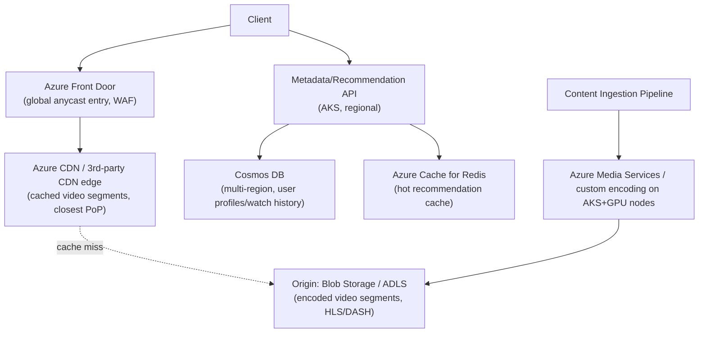
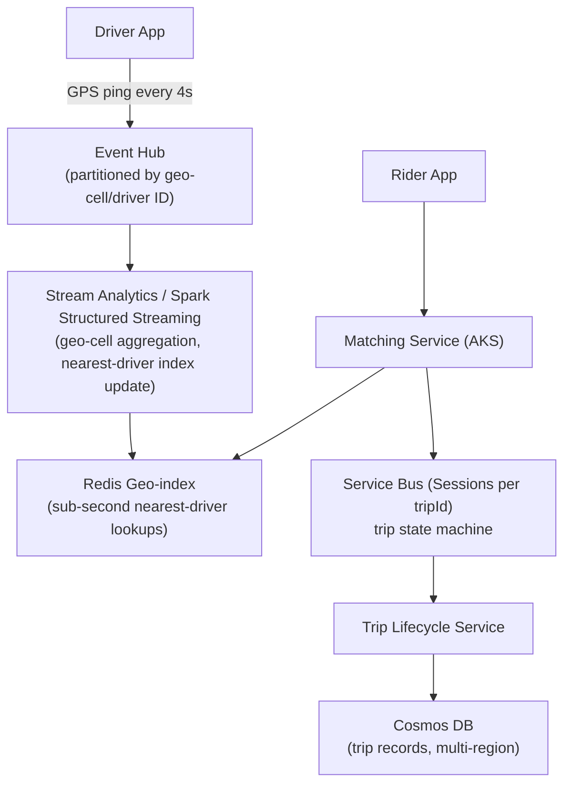
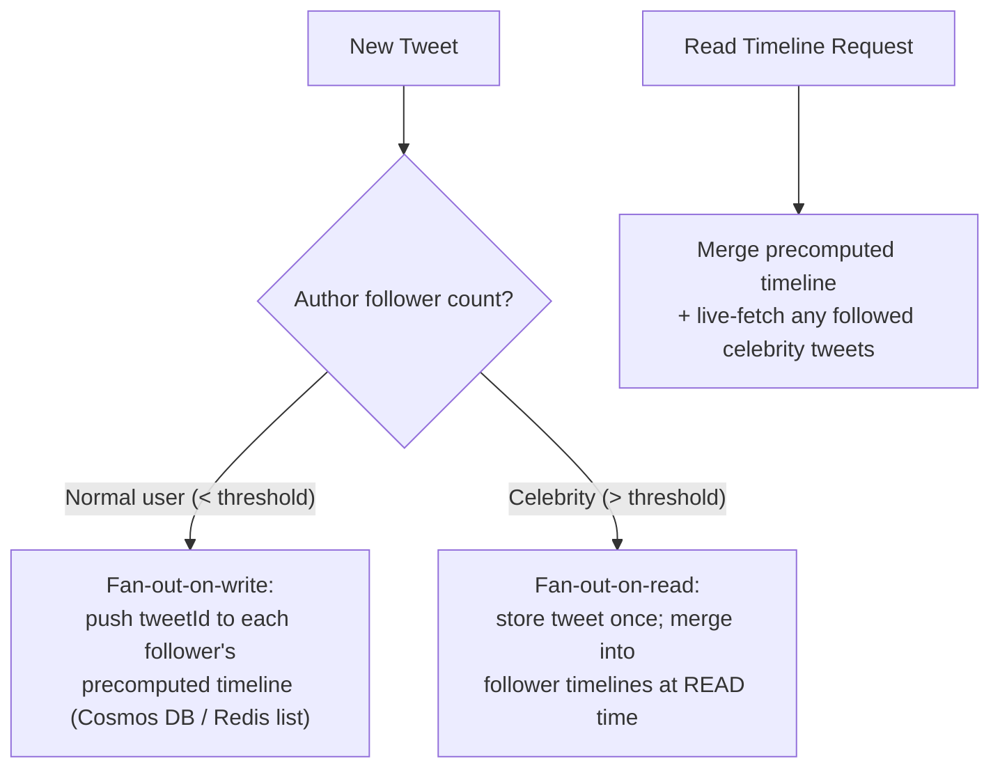

# SECTION 15: SYSTEM DESIGN USING AZURE

## 15.1 System Design Framework (Apply to Every Design Below)

1. **Clarify requirements** — functional (what must it do) and non-functional (scale, latency, consistency, availability targets).
2. **Capacity estimation** — back-of-envelope QPS, storage, bandwidth math.
3. **High-level architecture** — draw the boxes, identify data flow.
4. **Deep dive** — pick 1-2 components the interviewer cares most about and go deep.
5. **Scaling strategy** — how each tier scales as load grows 10x/100x.
6. **Failure handling** — what breaks, and how the system degrades gracefully.
7. **Security & cost** — always mention, even briefly, unless explicitly told to skip.

---

## 15.2 Design 1: Netflix on Azure (Global Video Streaming)

**Requirements:** 200M users, video-on-demand streaming, global low-latency playback, personalized recommendations.
**Capacity estimation:** ~50M daily active users, avg 2 hours watched/day, average bitrate 5 Mbps → sustained global egress in the multi-terabit/sec range at peak — this scale mandates a CDN-first architecture; origin storage must never serve playback traffic directly at this volume.
**Architecture:**

**Scaling:** CDN absorbs >95% of video-byte traffic; origin only serves cache misses (rare, mostly for long-tail content). Metadata/API tier scales horizontally on AKS with regional read replicas of Cosmos DB for low local-read latency.
**Security:** Signed CDN URLs with short expiry (prevent hotlinking/piracy), DRM (Widevine/PlayReady/FairPlay) integration at the player level, WAF at Front Door for the API tier.
**Cost optimization:** Tiered storage (Hot for new releases, Cool/Archive for long-tail catalog), encode once at multiple bitrates (ABR ladder) rather than per-request transcoding.
**Failure handling:** Regional Cosmos DB failover for metadata; CDN multi-provider fallback if one CDN vendor degrades; graceful bitrate downgrade (ABR) rather than playback failure under network degradation.

## 15.3 Design 2: YouTube on Azure (User-Generated Video Platform)

**Requirements:** Massive-scale upload + transcode pipeline, global playback, comments/likes at high write volume.
**Capacity estimation:** 500 hours of video uploaded/minute at global scale — transcoding pipeline must be async, horizontally scalable, and queue-driven (never synchronous with upload).
**Architecture:** Upload → Blob Storage (raw) → Event Grid triggers → Service Bus queue → AKS-based transcoding worker pool (autoscaled via KEDA on queue depth, GPU node pools for hardware-accelerated encoding) → multiple encoded renditions written to origin storage → CDN distribution (same pattern as Design 1). Comments/likes use Cosmos DB (high write throughput, partitioned by videoId) with eventual consistency acceptable for like-counts (approximate counters, periodically reconciled).
**Scaling:** KEDA scales transcoding workers directly against Service Bus queue depth — this is the textbook KEDA use case. Partition comments by `videoId` with a synthetic suffix for extremely viral videos to avoid hot partitions.
**Security:** Content moderation pipeline (async, ML-based scanning before public visibility) gating the "publish" state transition.
**Failure handling:** Failed transcode jobs go to a dead-letter queue for manual/automated retry; partial upload resumption via chunked/resumable upload APIs.

## 15.4 Design 3: Uber on Azure (Real-Time Location & Matching)

**Requirements:** Real-time driver location ingestion (millions of GPS pings/sec), rider-driver matching within seconds, trip lifecycle management.
**Capacity estimation:** 5M active drivers pinging every 4 seconds ≈ 1.25M events/sec sustained — this is squarely an **Event Hub** ingestion problem, not a database-write problem.
**Architecture:**

**Deep dive:** Geo-sharding (dividing the map into cells, e.g., via a geohash/H3 index) is the key scaling technique — the matching service only queries drivers within nearby cells via the Redis geo-index, avoiding a full-table nearest-neighbor scan at global scale.
**Scaling:** Event Hub partition count sized for peak driver-ping throughput; Stream Analytics/Spark jobs scale independently per geo-region shard.
**Failure handling:** If Stream Analytics falls behind (consumer lag), the Redis geo-index becomes stale — mitigate via lag-based alerting and a fallback to a slightly-larger search radius if index freshness degrades.

## 15.5 Design 4: WhatsApp on Azure (Real-Time Messaging at Scale)

**Requirements:** Billions of messages/day, end-to-end encryption, delivery/read receipts, offline delivery guarantee.
**Capacity estimation:** 100B messages/day ≈ ~1.2M messages/sec average, much higher at peak — requires a horizontally-scalable message-routing tier, not a single database bottleneck.
**Architecture:** WebSocket/persistent-connection gateway tier (AKS, one connection per active client) → message routing via Service Bus (per-conversation session for ordering) → Cosmos DB for message persistence (partitioned by conversationId) with TTL-based cleanup for ephemeral message caches → push notification fan-out (APNs/FCM) for offline recipients via a dedicated notification service.
**Deep dive — connection management:** a global user base with persistent WebSocket connections requires **sticky session routing** (a user's connection is pinned to a specific gateway instance) — typically solved with a connection-registry (Redis) mapping `userId -> gateway instance`, so message routing knows which specific gateway pod holds the recipient's live connection, with fallback to push-notification delivery if the registry shows no active connection.
**Security:** End-to-end encryption means the server-side architecture only ever handles ciphertext — key exchange (e.g., Signal Protocol-style) happens client-side; server responsibility is purely reliable, ordered, at-least-once ciphertext delivery.
**Failure handling:** Store-and-forward for offline recipients (message persisted in Cosmos DB, delivered on next connection or via push notification), idempotent delivery (client-generated message IDs) to handle at-least-once redelivery without duplicate display.

## 15.6 Design 5: Twitter/X on Azure (Feed Generation at Scale)

**Requirements:** Post/tweet creation, timeline generation for followers (including celebrity accounts with 100M+ followers — the classic "fan-out" problem), search.
**Capacity estimation:** The core scaling challenge is **fan-out on write vs. fan-out on read**: a celebrity tweeting to 100M followers cannot synchronously write to 100M timeline caches (fan-out-on-write) without a massive write amplification spike; conversely, computing a timeline live per read (fan-out-on-read) is too slow for a normal user with a large following graph.
**Architecture — hybrid fan-out:**

**Deep dive:** this hybrid model (used by the real systems it's modeled on) avoids both failure modes — most users get fast fan-out-on-write reads, while celebrity posts avoid a catastrophic write-amplification event, at the cost of slightly more complex read-time merge logic.
**Scaling:** Search uses a dedicated inverted-index service (e.g., Elasticsearch-pattern on AKS, or Azure Cognitive Search) fed asynchronously from the write path, decoupled from the timeline-serving path entirely.
**Failure handling:** Timeline cache (Redis) staleness is acceptable (eventual consistency) — a missing very-recent tweet in a cached timeline is a low-severity UX issue, not a correctness failure, which is why this domain tolerates aggressive caching/async fan-out.

## 15.7 Design 6: Global E-Commerce Platform

**Requirements:** Product catalog browsing, cart, checkout with strong consistency (no overselling), order fulfillment, multi-region.
**Capacity estimation:** Read-heavy (browsing) vastly outweighs write volume (checkout) — read:write ratio often 100:1+, motivating aggressive read-path caching and a much smaller, carefully-guarded write path for inventory/payment.
**Architecture:** Front Door + CDN for static catalog assets; Cosmos DB (Session consistency) for catalog/browsing data, heavily cached via Redis; **inventory/checkout** uses Azure SQL (or Cosmos DB with Strong consistency scoped only to the inventory-decrement operation) with **optimistic concurrency** (ETag/RowVersion-based conditional updates) to prevent overselling without a global lock; Service Bus for async order-fulfillment workflow (payment → inventory reservation → shipping) as a saga pattern with compensating transactions for failure rollback.
**Deep dive — preventing overselling:** a conditional write (`UPDATE inventory SET qty = qty - 1 WHERE productId = X AND qty > 0`) checked for affected-row-count = 0 (meaning sold out) is the standard optimistic-concurrency pattern avoiding both overselling and a global pessimistic lock's throughput ceiling.
**Failure handling:** Saga pattern with compensating transactions — if payment succeeds but inventory reservation fails, an automated compensating action refunds the payment; every step is idempotent (safe to retry) via idempotency keys.

## 15.8 Design 7: CI/CD Platform (Internal Developer Platform)

**Requirements:** Serve thousands of internal teams' build/deploy pipelines, multi-tenant isolation, secret management, artifact storage.
**Architecture:** Azure DevOps/GitHub Actions as the pipeline orchestration layer, self-hosted agent pools on AKS (scaled via KEDA on queue depth of pending jobs) for build execution, ACR (with geo-replication) for container artifacts, Key Vault per-team for secrets (least-privilege, Workload Identity Federation for pipeline access), and a centralized policy-as-code layer (OPA/Azure Policy) enforcing organization-wide guardrails (mandatory security scanning stage, approved base images) across every team's pipeline via shared templates.
**Scaling:** Ephemeral, per-job AKS pods for build agents (not long-lived VMs) for both cost efficiency and security (no persistent build-agent state to compromise across jobs).
**Security:** Strict per-team Key Vault/RBAC isolation prevents one team's compromised pipeline from accessing another team's secrets; mandatory commit-SHA pinning and approved-registry enforcement (Section 10) applied platform-wide.

## 15.9 Design 8: Observability Platform (Internal, Multi-Tenant)

**Requirements:** Ingest logs/metrics/traces from thousands of internal services, provide per-team dashboards/alerting, cost-attributed by team.
**Architecture:** OpenTelemetry Collector (deployed as an AKS DaemonSet/sidecar) standardizes ingestion → routed to per-environment Log Analytics workspaces (or a shared workspace with strict table-level RBAC) → Managed Prometheus for metrics → Managed Grafana for dashboards → Sentinel-style correlation for security-relevant signals. Cost-attribution achieved via mandatory resource tagging feeding a chargeback model per team, since Log Analytics ingestion volume is a direct, often-underestimated cost driver at platform scale.
**Deep dive — multi-tenancy isolation:** table-level RBAC in Log Analytics (or per-team workspaces if stronger isolation is required) prevents one team from querying another's potentially sensitive log data, while still allowing a platform team a cross-workspace view via Azure Resource Graph/cross-workspace KQL queries for platform-wide health monitoring.

## 15.10 Design 9: Multi-Region AKS Platform

**Requirements:** Active-active (or active-passive) multi-region Kubernetes platform for a global application requiring regional failover with RTO < 5 minutes.
**Architecture:** Independent AKS clusters per region (never a single cluster spanning regions — a hard Kubernetes/networking constraint), each region's cluster fronted by a regional entry point, globally load-balanced via Front Door (health-probe-based automatic failover) or Traffic Manager, with data-tier replication (Cosmos DB multi-region write, or Azure SQL geo-replication) providing the cross-region data consistency layer beneath the stateless AKS application tier. GitOps (Flux/Argo CD) deploys identical manifests to every regional cluster from a single source of truth, preventing configuration drift between regions being the actual root cause of most "failover didn't work" incidents.
**Deep dive — the real failure mode:** most multi-region failover failures are not infrastructure failures but **configuration drift** (the passive region's cluster silently fell out of sync with the active region's deployed version/config) — mitigated by continuously deploying to *all* regions simultaneously (both serve real traffic in active-active, or the passive region is kept warm and continuously updated in active-passive) rather than treating a "DR region" as a rarely-touched, rarely-validated environment.
**Failure handling:** Regular, automated failover drills (not just documented runbooks) are the only way to have confidence in the stated RTO — an untested failover procedure should be assumed broken.

## 15.11 Design 10: AI/LLM Platform on Azure

**Requirements:** Serve LLM inference at scale (e.g., internal copilot / customer-facing chat), with data governance (no customer prompts used for third-party model training), cost control on GPU compute.
**Architecture:** Azure OpenAI Service (or self-hosted models on AKS with GPU node pools) behind an API Management gateway (rate limiting per consuming team, request/response logging for audit, prompt-injection-aware content filtering), Cosmos DB for conversation history/context storage, Redis for caching frequent/repeated prompt-response pairs (semantic caching) to reduce redundant, costly model calls, and a RAG (Retrieval-Augmented Generation) layer using Azure AI Search (vector search) to ground responses in private/proprietary data without fine-tuning the base model.
**Deep dive — cost control:** GPU inference is the dominant cost driver; mitigations include semantic response caching, token-budget enforcement per request via API Management policies, model-tiering (route simple queries to a smaller/cheaper model, complex queries to a larger one), and KEDA-based autoscaling of any self-hosted inference pods based on queue depth rather than static always-on GPU capacity.
**Security:** Azure OpenAI's data-processing terms (prompts not used to train the base model) must be explicitly validated/documented for compliance; Private Endpoints for the Azure OpenAI resource to keep prompt/response traffic off the public internet entirely.

---

*Continue to [12-TROUBLESHOOTING-MASTERCLASS.md](./12-TROUBLESHOOTING-MASTERCLASS.md) for Section 16 (Azure Troubleshooting Masterclass).*
