# SECTION 17: FAANG INTERVIEW ROUND PREPARATION

## 17.1 The Full Interview Loop — What Each Round Actually Tests

```mermaid
graph LR
    A["Recruiter Screen<br/>(fit, comp, logistics)"] --> B["Hiring Manager Round<br/>(motivation, team fit, high-level experience)"]
    B --> C["Technical Screening<br/>(coding/scripting + fundamentals)"]
    C --> D["Azure Deep Dive<br/>(services internals)"]
    D --> E["Kubernetes Deep Dive<br/>(AKS/K8s internals)"]
    E --> F["System Design Round"]
    F --> G["Troubleshooting Round<br/>(live scenario or whiteboard)"]
    G --> H["Behavioral/Leadership Round"]
    H --> I["Final: Hiring Committee / Bar Raiser"]
```

## 17.2 Round-by-Round Preparation

### 1. Recruiter Round
**Goal:** Confirm baseline fit, level expectations, comp range alignment, logistics. **Prep:** Have a crisp 60-second summary of your background, know your target level (Senior vs. Staff) and be ready to discuss comp ranges without underselling.

### 2. Hiring Manager Round
**Goal:** Assess motivation, team/culture fit, and whether your experience narrative matches the team's actual problems. **Prep:** Research the team's specific domain (their public engineering blog posts, known infra stack) and prepare 2-3 stories mapping your experience directly to problems that team likely has.

### 3. Technical Screening
**Goal:** Baseline competency filter — often scripting (Python/Bash), Linux fundamentals, or a light coding exercise (not typically LeetCode-hard for DevOps/SRE roles, but expect basic algorithmic thinking: parsing logs, string manipulation, simple data structure use).

### 4. Azure Deep Dive Round
**Goal:** Validate genuine internals knowledge (Sections 1-5, 12-14 of this guide) vs. surface-level familiarity. **Prep:** Be ready to whiteboard the ARM request flow, explain a specific replication/consistency tradeoff, and justify a service choice against alternatives.

### 5. Kubernetes Deep Dive Round
**Goal:** AKS/K8s internals (Section 6) — expect live troubleshooting-style questions ("a pod is stuck Pending, walk me through your diagnosis") more than pure trivia.

### 6. System Design Round
**Goal:** Architectural reasoning at scale (Section 15). **Prep:** Practice the 7-step framework (Section 15.1) out loud, timed — most candidates fail this round by diving into details before clarifying requirements.

### 7. Troubleshooting Round
**Goal:** Structured incident diagnosis under time pressure (Section 16). **Prep:** Practice narrating your diagnostic *process* out loud (hypothesis → check → next hypothesis), not just jumping to a guessed answer — interviewers score the reasoning path, not just the final root cause.

### 8. Leadership Round
**Goal:** For Staff+/Principal-track roles — cross-team influence, technical decision-making at organizational scale, mentoring impact.

### 9. Behavioral Round
**Goal:** STAR-format stories demonstrating ownership, conflict resolution, and growth from failure (see Section 18 for full STAR bank).

## 17.3 Top 20 Frequently Asked Questions with Strong vs. Weak Sample Answers

1. **"Tell me about a production incident you handled."**
   - *Weak answer:* "There was an outage, I looked at logs, found the issue, and fixed it." *(No specifics, no metrics, no learning.)*
   - *Strong answer:* Names the specific service/blast radius, quantifies impact (users affected, duration, revenue/SLA impact), walks through the actual diagnostic steps taken (and any dead ends pursued honestly), states the concrete fix and the *systemic* prevention change made afterward (not just "we fixed the bug").

2. **"Why do you want to leave your current role?"**
   - *Weak:* Focuses purely on negatives about the current employer.
   - *Strong:* Frames around growth/scope you're seeking that your current role structurally can't provide, staying factual and forward-looking.

3. **"Design a system to X."** — see Section 15 framework; weak answers skip requirements-clarification and jump straight to a component diagram.

4. **"Walk me through how a request flows through your current production system."**
   - *Strong answer* demonstrates genuine operational ownership — specific hostnames/services, not generic textbook architecture.

5. **"How do you approach on-call?"**
   - *Strong:* References specific practices — runbooks, alert tuning to reduce fatigue (Section 11.7), blameless postmortems, and a concrete example of an alert you personally improved.

*(Remaining top-100 questions span every technical section of this guide — Sections 1-16 — each phrased as a direct interview question; use the "Common/Advanced/FAANG-Level" question banks in each section as the source material for this round, cross-referenced against the specific role's job description to prioritize which sections to over-prepare.)*

## 17.4 Level Calibration — What Interviewers Expect at Each Level
| Level | Expectation |
|---|---|
| **Mid (3-5 yrs)** | Executes well-defined tasks independently; solid fundamentals; can troubleshoot with guidance. |
| **Senior (5-8 yrs)** | Designs systems independently; drives incidents to resolution; mentors juniors; makes sound tradeoff calls without escalation. |
| **Staff (8+ yrs)** | Influences architecture across multiple teams; sets technical direction; is the point of escalation for the hardest production issues; measured by organizational leverage, not just personal output. |
| **Principal** | Sets technical strategy at the org/company level; influence spans well beyond direct team boundaries; often the final technical authority on major cross-cutting decisions. |

---

# SECTION 18: BEHAVIORAL & LEADERSHIP

## 18.1 STAR Format Master Class
**S**ituation (brief context) → **T**ask (what was your specific responsibility) → **A**ction (what *you* specifically did — first person, not "we") → **R**esult (quantified outcome + what you learned/changed systemically). The most common failure mode: candidates describe the *team's* actions in aggregate ("we decided," "we fixed") without ever isolating their own individual contribution — interviewers are evaluating *you*, not your team.

## 18.2 STAR-Based Story Bank

### Major Production Outage
**S:** A payment-processing AKS cluster experienced a cascading failure after a routine node-pool upgrade, causing a 40-minute checkout outage during a peak sales period.
**T:** As the on-call platform engineer, I was responsible for triage and driving mitigation.
**A:** I first checked whether the upgrade's surge nodes had actually become Ready before the drain began (they hadn't — a PodDisruptionBudget misconfiguration allowed a drain to proceed prematurely), paused the rollout, manually scaled up healthy capacity, and redirected traffic via Traffic Manager to a healthy secondary region while the primary stabilized.
**R:** Restored service in 40 minutes (vs. an estimated 90+ minutes if we'd waited for the stalled upgrade to self-resolve); afterward, I implemented mandatory surge-upgrade validation gates and multi-region automatic failover health probes so a similar upgrade-induced outage would fail over automatically within 60 seconds instead of requiring manual intervention.

### Failed Deployment
**S:** A Terraform `apply` in a shared CI pipeline used `complete` deployment mode and inadvertently deleted a manually-created (out-of-band) production NSG rule that wasn't in the template.
**T:** I was the engineer who discovered the deletion during a subsequent access-failure report.
**A:** I restored the rule immediately from Activity Log history, then audited every pipeline for `complete`-mode usage, converting all of them to `incremental` mode (the safer default) and adding a mandatory `terraform plan` review step showing destroy actions requiring explicit second-approver sign-off.
**R:** Eliminated an entire class of "IaC accidentally deletes out-of-band resources" incidents platform-wide, not just for the one pipeline involved.

### Conflict Resolution
**S:** Two teams disagreed on whether to adopt Azure CNI Overlay platform-wide; one team wanted classic Azure CNI for a legacy NVA-integration dependency.
**T:** As the platform architect, I needed to reach a decision without alienating either team.
**A:** I facilitated a technical working session focused on data, not opinions — quantifying the actual VNet IP exhaustion timeline under classic CNI at our growth rate, and scoping the "legacy NVA dependency" to confirm it only affected 2 of 40 services, which could be isolated to a dedicated classic-CNI node pool while the rest of the platform moved to Overlay.
**R:** Reached a decision with buy-in from both teams by narrowing disagreement to an evidence-based, scoped exception rather than an all-or-nothing platform mandate.

### Technical Leadership
**S:** Our organization had no formal Landing Zone; every team provisioned Azure resources ad-hoc, causing recurring security/compliance findings.
**T:** I proposed and led the design of a formal Azure Landing Zone.
**A:** I built the Management Group hierarchy, policy initiative bundles, and a subscription-vending Terraform module, then ran a phased onboarding across 30 teams over two quarters, personally pairing with the first 5 teams to refine the module before wider rollout.
**R:** Reduced average security-finding remediation time by 70% (guardrails now prevent the issue at admission-time via Azure Policy rather than post-hoc remediation) and cut new-subscription onboarding time from ~3 weeks (manual security review) to under 1 day (automated, policy-governed vending).

### Mentoring
**S:** A junior engineer on my team struggled to debug AKS networking issues independently, frequently escalating too early.
**T:** Help them build independent troubleshooting capability without slowing down incident resolution.
**A:** I paired with them on the next 3 networking incidents, explicitly narrating my hypothesis-driven diagnostic process out loud (rather than just providing the answer), and had them lead the diagnosis on the 4th with me only observing.
**R:** Within two months, they were independently resolving networking incidents that previously required my escalation, freeing my on-call bandwidth for higher-severity issues.

### Cost Optimization
**S:** Cloud spend grew 40% year-over-year without a proportional growth in traffic.
**T:** I led a cost-optimization initiative across the platform team.
**A:** I used Azure Advisor + Cost Management exports to identify the top 5 cost drivers (over-provisioned VM SKUs, un-tiered Blob storage, an oversized Log Analytics retention setting), and implemented right-sizing, lifecycle management, and retention-tier changes, validating each change against actual usage telemetry before applying.
**R:** Reduced monthly spend by 22% with zero performance/reliability regression, and instituted a recurring monthly cost-review as an ongoing practice rather than a one-time cleanup.

### Security Incident
**S:** A leaked Service Principal secret (accidentally committed to a public fork) was discovered via an automated secret-scanning alert.
**T:** Lead incident response.
**A:** I immediately rotated/revoked the credential, audited Activity Logs for any unauthorized use during the exposure window (none found), and used this as the forcing function to accelerate our already-planned migration to Workload Identity Federation across all remaining Service Principal-based pipelines.
**R:** Contained the incident with zero actual data/resource impact, and eliminated the entire "stored secret" risk class within the following quarter as a direct, concrete follow-up.

### Migration Project
**S:** Migrating 40 microservices from self-managed Kubernetes on VMs to AKS.
**T:** Technical lead for the migration.
**A:** I built a phased migration plan (lowest-risk services first), a parallel-run validation strategy (traffic mirrored to AKS before cutover), and automated rollback criteria based on error-rate SLO burn, migrating services in batches over 4 months rather than a risky big-bang cutover.
**R:** Completed the migration with zero customer-facing incidents, and the parallel-run validation approach caught 3 configuration issues before they ever reached production traffic.

### Automation Initiative
**S:** Manual AKS cluster provisioning took engineers 2+ days per new environment with frequent configuration inconsistency.
**T:** Build a self-service automation platform.
**A:** I designed a parameterized Terraform module covering the full AKS + networking + identity baseline, wrapped in a simple self-service pipeline trigger, reducing the required inputs to just team name and environment tier.
**R:** Cut provisioning time from 2 days to 20 minutes, eliminated configuration drift between environments, and freed the platform team from manual provisioning tickets entirely.

## 18.3 Common Behavioral Questions
- "Tell me about a time you disagreed with your manager." · "Describe a time you had to deliver bad news." · "Tell me about your biggest technical mistake." · "How do you prioritize competing incidents?" · "Describe a time you influenced a decision without formal authority."

## 18.4 Preparation Tips
- Maintain a running "brag document" of concrete incidents/projects with quantified outcomes — recall under interview pressure is dramatically easier from a maintained list than from memory alone.
- Practice saying "I" not "we" for the Action step — deliberately, since it feels unnatural for collaborative work but is exactly what's being evaluated.
- Always close with the systemic/process change made afterward — this is what separates Senior from Staff-level signal in behavioral rounds.

---

*Continue to [14-HANDS-ON-LABS-DOCS.md](./14-HANDS-ON-LABS-DOCS.md) for Sections 19-20 (Hands-On Labs, Documentation Index).*
