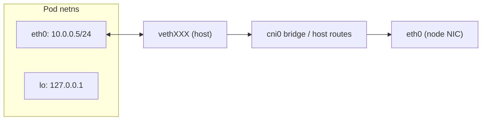
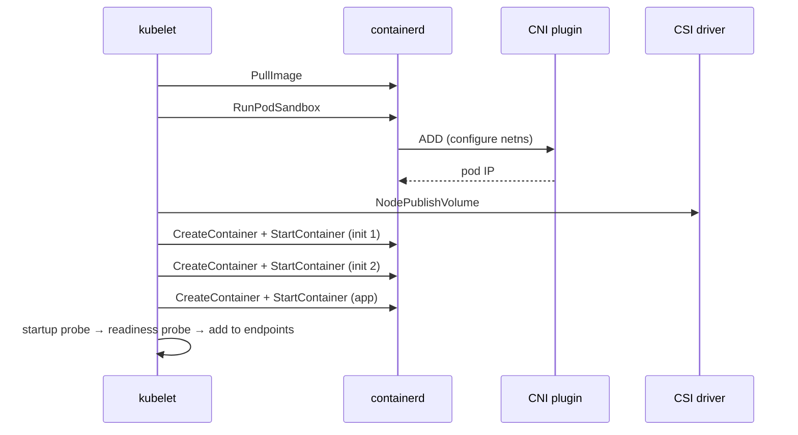

# Section 1: Container Fundamentals

This section builds the foundation required for every subsequent Kubernetes topic. Kubernetes ultimately asks a container runtime to start a Linux process inside a precisely composed set of kernel isolation primitives. You cannot reason deeply about pods, node pressure, security contexts, or runtime failures without understanding how Linux namespaces, cgroups, and layered filesystems actually work — at the syscall level. This section covers virtual machines and containers as isolation models, every relevant Linux namespace, cgroup accounting and enforcement, OverlayFS, and the full runtime stack from OCI through containerd and runc to the running process.

## Subtopic Index

- [Virtual Machines](#virtual-machines)
- [Containers](#containers)
- [Linux Namespaces](#linux-namespaces)
- [PID Namespace](#pid-namespace)
- [Network Namespace](#network-namespace)
- [Mount Namespace](#mount-namespace)
- [UTS Namespace](#uts-namespace)
- [IPC Namespace](#ipc-namespace)
- [User Namespace](#user-namespace)
- [cgroups v1 and v2](#cgroups-v1-and-v2)
- [OverlayFS](#overlayfs)
- [containerd](#containerd)
- [runc](#runc)
- [CRI — Container Runtime Interface](#cri--container-runtime-interface)
- [OCI — Open Container Initiative](#oci--open-container-initiative)
- [Docker Architecture](#docker-architecture)
- [Container Lifecycle](#container-lifecycle)
- [Container Startup Process](#container-startup-process)
- [Container Runtime Internals](#container-runtime-internals)

---

## Virtual Machines

A virtual machine provides a complete guest operating system running on emulated or paravirtualized hardware managed by a hypervisor. The hypervisor — whether a Type 1 bare-metal hypervisor like KVM or Hyper-V or a Type 2 hosted hypervisor like VirtualBox — intercepts privileged guest instructions, multiplexes physical CPU execution using hardware virtualization extensions (Intel VT-x, AMD-V), and presents virtual devices (vNIC, vDisk, virtual BIOS) to each guest. Each guest boots its own kernel, runs its own init system, and believes it owns dedicated hardware.

The performance model matters: modern hypervisors use hardware-assisted virtualization to let most guest instructions run at near-native speed in a guest ring 0 (VMX non-root mode), trapping only privileged operations to the hypervisor (VMX root mode). Memory management uses Extended Page Tables (EPT/NPT) so guest virtual-to-physical and host physical-to-machine translations happen in a single MMU walk without hypervisor intervention. I/O is more expensive: virtio paravirtualized drivers and SR-IOV device passthrough reduce overhead compared with full emulation, but network and storage I/O still involve more software layers than a native process.

The security model gives VMs a kernel isolation boundary. A kernel exploit in one guest does not automatically compromise the hypervisor or a sibling guest because the hypervisor enforces CPU privilege rings and memory translations. This is why Kubernetes itself commonly runs its worker nodes inside VMs on cloud providers — the VM boundary protects the hypervisor (and therefore other tenants' nodes) if a container escape occurs within the VM. It also means that Kubernetes node isolation is the VM boundary, not the container namespace boundary.

The cost of a VM is higher memory overhead (a guest kernel, systemd, libraries), longer startup (bootloader → kernel initialization → userspace init), and slower launch than a container because the kernel boot path cannot be skipped.

```
Physical Hardware
      │
  Hypervisor (KVM/Hyper-V/VMware)
  ┌───────────┐   ┌───────────┐
  │  VM 1     │   │  VM 2     │
  │  kernel   │   │  kernel   │
  │  systemd  │   │  systemd  │
  │  kubelet  │   │  app      │
  └───────────┘   └───────────┘
```

### Key commands
```bash
# Check hypervisor on a cloud node
systemd-detect-virt
cat /sys/hypervisor/type 2>/dev/null || echo "none"

# Inspect hardware-assisted virtualization support
grep -m1 -E 'vmx|svm' /proc/cpuinfo    # vmx=Intel VT-x, svm=AMD-V

# On GCP/AWS/Azure: see VM metadata to confirm virtualization type
curl -s http://169.254.169.254/latest/meta-data/instance-type 2>/dev/null
```

---

## Containers

A container is an ordinary Linux process (or a small group of processes) that has been given an isolated view of the system through kernel namespaces and constrained in its resource consumption through cgroups. There is no separate kernel, no bootloader, and no guest firmware — the process runs directly in the host kernel. This is the crucial distinction: a container provides isolation at the process level, a VM provides isolation at the hardware and kernel level.

When a container runtime creates a container, it calls `clone(2)` or a sequence of `unshare(2)` + `setns(2)` syscalls to create or join specific namespaces, calls kernel cgroup APIs to place the process in a cgroup hierarchy with resource limits, mounts a filesystem tree assembled from image layers, and then `execve(2)` to replace itself with the container entrypoint. The host kernel handles all system calls; there is no instruction translation or VMM trap.

The performance benefit is near-native: a containerized process consumes CPU, memory, and I/O with no hypervisor overhead beyond the marginal cost of namespace and cgroup accounting. Container startup is measured in milliseconds because the host kernel is already running — there is no boot sequence. Image distribution is efficient because OCI images are content-addressed, deduplicated layers stored in a registry.

The security model is weaker than a VM by default: a kernel vulnerability exposed via a container syscall affects the shared kernel and therefore all containers and the host. This is why Kubernetes security design emphasizes multiple defense layers — seccomp filters to limit syscall surface, AppArmor/SELinux for MAC, non-root UIDs, read-only root filesystems, capability dropping, network policies, and admission policies — in addition to the namespace isolation that containers provide.

```
Host Kernel
  │
  ├─ namespace(pid) → container sees only its own PID tree
  ├─ namespace(net) → container sees only its own network stack
  ├─ namespace(mnt) → container sees only its own filesystem
  ├─ cgroup         → CPU, memory, I/O limited to quota
  └─ execve(entrypoint)  ← process running in the container
```

### Key commands
```bash
# See the actual process tree as the host sees it
ps auxf | grep containerd-shim

# Inspect container process namespaces from the host
ls -la /proc/$(crictl inspect --output go-template \
  --template '{{.info.pid}}' <container-id>)/ns/

# Confirm a container is just a process on the host
pstree -p $(pgrep kubelet) | head -30
```

---

## Linux Namespaces

Linux namespaces are kernel structures that partition global kernel resources so that each partition appears to its member processes as an independent instance. A namespace wraps one dimension of the OS — processes, network, filesystems, hostname, IPC, or user IDs — and every process in a namespace sees only the resources within that namespace.

The kernel tracks namespaces through reference counts and through entries in `/proc/<pid>/ns/`. When a process creates a new namespace via `clone(CLONE_NEW*)` or `unshare(CLONE_NEW*)`, the kernel allocates a new namespace struct for that dimension and enters the calling process into it. Child processes inherit their parent's namespace membership unless they are explicitly placed into different namespaces at creation or via `setns(2)`. Namespaces can also be preserved by bind-mounting their `/proc/<pid>/ns/<type>` file to a path, keeping the namespace alive even after all member processes exit — this is how CNI plugins preserve network namespaces after the original process creates them.

Namespace types as of Linux 5.x: `pid`, `net`, `mnt`, `uts`, `ipc`, `user`, `cgroup`, `time`. Kubernetes uses primarily `pid`, `net`, `mnt`, `uts`, and `ipc`. The container runtime creates these namespaces for each pod sandbox.

### Key commands
```bash
# List namespaces of a running container
CPID=$(crictl inspect --output go-template \
  --template '{{.info.pid}}' <container-id>)
ls -la /proc/$CPID/ns/

# Enter a container's namespace for debugging
nsenter --target $CPID --net --mount --pid -- sh

# See all network namespaces on the node
ip netns list      # shows named namespaces; pod netns are usually unnamed/anonymous
```

---

## PID Namespace

The PID namespace virtualizes the process ID number space. Inside a PID namespace, the first process started is PID 1 regardless of what PID the host kernel has assigned it. Processes inside the namespace can only see and signal other processes within the same namespace and its descendants. From the host, the process has a different, globally unique PID.

This has a critical operational implication: PID 1 inside a container receives `SIGTERM` when the container is stopped. If PID 1 does not handle `SIGTERM` — which is true for many shell scripts and simple binaries that were not written as init systems — the kernel delivers it and the process may ignore it, forcing the container runtime to wait for `terminationGracePeriodSeconds` before sending `SIGKILL`. Applications that use a proper init process (tini, s6, or the Go `exec.Command` with `SysProcAttr.Pdeathsig`) handle this correctly.

Orphan process reaping is also PID-1-specific: when a process's parent exits, the child is reparented to PID 1 in its namespace. PID 1 is responsible for calling `wait()` to reap the zombie. If PID 1 does not do this, zombie processes accumulate and the PID namespace's PID table eventually fills, preventing new process creation. The `tini` init and the Kubernetes native sidecar mechanism both address this.

In Kubernetes, `shareProcessNamespace: true` in the Pod spec makes all containers in the pod share one PID namespace. This is used for debugging (an ephemeral container can see and signal application processes) and for sidecar patterns that need to inspect or manipulate sibling processes.

```bash
# Confirm PID 1 inside a running container
kubectl exec <pod> -- ps -o pid,ppid,stat,cmd --sort=pid | head -5

# Check if PID namespace is shared (all containers see same PID tree)
kubectl get pod <pod> -o jsonpath='{.spec.shareProcessNamespace}'
```

### Key commands
```bash
# List zombies in a container (Z state = zombie)
kubectl exec <pod> -- ps aux | grep ' Z '

# Force-send SIGTERM vs SIGKILL to container PID 1
# (from host, using the host PID)
kill -TERM <host-pid>
kill -KILL <host-pid>

# Trace what signals PID 1 receives
strace -e trace=signal -p <host-pid>
```

---

## Network Namespace

A network namespace is an isolated instance of the Linux networking stack: its own interfaces, IP addresses, routing table, iptables/nftables rules, sockets, conntrack table, and loopback device. Two processes in different network namespaces cannot communicate through loopback or see each other's sockets unless explicitly connected through a `veth` pair, a bridge, or similar cross-namespace plumbing.

This is the mechanism that gives each Kubernetes pod its own IP address. The container runtime creates a network namespace for the pod sandbox (the pause container), and the CNI plugin is called to configure it: it creates a `veth` pair, places one endpoint (`eth0`) inside the pod's network namespace, places the other endpoint on the host (usually named something like `veth1a2b3c`), assigns the pod IP to the in-pod interface, and installs routes that make the pod reachable from the rest of the cluster.

Every container in the pod subsequently joins this same network namespace — that is why containers in a pod share an IP address and communicate on `localhost`. The pause container's sole purpose is to hold the network namespace open: its PID keeps the namespace alive so other containers can start, stop, and restart without the network namespace being destroyed.

From a performance perspective, each network namespace adds overhead only in the data path through the veth pair and host bridge or routing. With Cilium's eBPF dataplane, kube-proxy is eliminated and packet processing happens at the TC layer directly on the veth, bypassing iptables for service routing. Network namespace creation itself is O(1) and very cheap.



### Key commands
```bash
# Get pod IP and confirm network namespace
kubectl get pod <pod> -o jsonpath='{.status.podIP}'

# From the node: enter the pod's network namespace
CPID=$(crictl inspect --output go-template \
  --template '{{.info.pid}}' <container-id>)
nsenter --target $CPID --net -- ip addr
nsenter --target $CPID --net -- ip route
nsenter --target $CPID --net -- ss -tlnp

# See the veth pair connecting pod to host
# On host:
ip link | grep veth
# Inside pod:
kubectl exec <pod> -- ip link
```

---

## Mount Namespace

A mount namespace provides an isolated filesystem mount table. Each process group in a mount namespace sees a different set of mounted filesystems, even though they all execute in the same host kernel. Creating a new mount namespace copies the parent's mount table, but subsequent mount and unmount operations are visible only within the new namespace (unless the propagation mode is shared).

The container runtime uses mount namespaces to give each container a root filesystem constructed from OCI image layers. Using `pivot_root(2)` (or `MS_MOVE + MS_MOVE` with bind mounts), runc changes the container's root to the prepared overlay filesystem, making the host filesystem tree invisible. Kubernetes additionally bind-mounts ConfigMaps, Secrets, projected tokens, and persistent volumes into the container's mount namespace, making them appear at their configured `mountPath`.

Mount propagation modes — `private`, `shared`, `slave`, `unbindable` — control whether mounts made inside the container's namespace propagate to the host and vice versa. The Kubernetes `mountPropagation: Bidirectional` field is dangerous because it allows a container to affect the host's mount table. Only privileged workloads with explicit operator intent should use it.

For performance: OverlayFS (covered below) is the dominant storage driver. Copy-on-write writes for heavy in-container workloads generate extra I/O through OverlayFS copy-up. Applications that write large amounts of data should use a mounted volume (`emptyDir`, PVC) rather than writing to the container's writable layer.

```bash
# List mounts visible inside a container
kubectl exec <pod> -- mount | grep overlay    # show OverlayFS root
kubectl exec <pod> -- mount | grep '/etc'     # projected ConfigMap/Secret mounts

# On the host: inspect the OverlayFS mount for a container
findmnt -t overlay
```

### Key commands
```bash
# Verify a volume is correctly bind-mounted
kubectl exec <pod> -- df -h /data             # confirm PVC mount
kubectl exec <pod> -- cat /var/run/secrets/kubernetes.io/serviceaccount/token

# Diagnose a read-only filesystem
kubectl exec <pod> -- touch /test 2>&1        # should fail if readOnlyRootFilesystem
kubectl get pod <pod> -o jsonpath='{.spec.containers[0].securityContext.readOnlyRootFilesystem}'
```

---

## UTS Namespace

The UTS (Unix Timesharing System) namespace isolates two system identifiers: the hostname (`uname -n`) and the NIS domain name. Processes in different UTS namespaces can have different hostnames without changing the host's hostname. Kubernetes uses this so each pod has a hostname equal to the pod name by default, which is important for StatefulSets where `pod-0.service.namespace.svc.cluster.local` is the stable DNS identity.

The `subdomain` field and `setHostnameAsFQDN: true` in the pod spec control whether the full FQDN is set as the hostname inside the container. This matters for applications that register themselves by hostname (e.g., Kafka brokers, Zookeeper nodes, Cassandra seeds). A pod with a wrong or unstable hostname will register incorrectly and cause split-brain or topology errors.

### Key commands
```bash
kubectl exec <pod> -- hostname
kubectl exec <pod> -- hostname -f    # FQDN if setHostnameAsFQDN=true
kubectl get pod <pod> -o jsonpath='{.spec.hostname} {.spec.subdomain}'
```

---

## IPC Namespace

The IPC namespace isolates System V IPC objects (message queues, semaphores, shared memory segments) and POSIX message queues. Processes in different IPC namespaces cannot communicate through these mechanisms. Within a pod, all containers share the same IPC namespace by default, allowing tightly coupled sidecar pairs to use shared memory for high-performance data exchange (a common pattern in trading systems and ML inference servers where the sidecar handles network serialization while the main container runs computation on shared memory).

Setting `hostIPC: true` places the pod in the host IPC namespace, which exposes all host IPC objects — a significant privilege escalation risk. Some legacy database installations require host IPC to access shared memory segments; the correct fix is to containerize the workload properly.

### Key commands
```bash
kubectl exec <pod> -- ipcs -a                 # list IPC objects visible in the container
kubectl exec <pod> -- df -h /dev/shm          # check tmpfs-backed shared memory
kubectl get pod <pod> -o jsonpath='{.spec.hostIPC}'
```

---

## User Namespace

The user namespace maps a range of user IDs and group IDs inside the namespace to a different range on the host. A process that appears as root (UID 0) inside a user namespace may be mapped to an unprivileged UID such as 65534 on the host. This is the foundation for rootless containers: a user without host root privileges can run a container runtime that creates namespaces and starts processes appearing as root inside the container, without that "root" being actual host root.

Without user namespaces, the common Kubernetes pattern is `runAsNonRoot: true` and an explicit `runAsUser`, which simply passes the UID to the kernel for the container process — the UID is real on the host, but it is not 0. This is not the same as a user namespace. User namespaces provide a stronger guarantee: even if the process breaks out of other namespaces, it still has no host privileges.

Kubernetes 1.25+ introduced user namespace support for pods (KEP-127) behind a feature gate. When enabled, the kubelet asks the runtime to create a user namespace mapping the container UID 0 to a high unprivileged UID on the host. This reduces the impact of container breakout vulnerabilities significantly.

The challenge with user namespaces is filesystem ownership: files mounted into the container from the host (volumes, ConfigMaps, Secrets) have host UIDs. The kernel applies ID mapping during filesystem access, so a file owned by host UID 100000 appears as root (UID 0) inside the container. This mapping must be consistent across mount propagation boundaries.

### Key commands
```bash
# Check if a running container process has host root (dangerous)
CPID=$(crictl inspect --output go-template --template '{{.info.pid}}' <container-id>)
cat /proc/$CPID/status | grep -E 'Uid|Gid'   # real UID on host

# If user namespaces are enabled, confirm mapping
cat /proc/$CPID/uid_map                        # col1=container UID, col2=host UID, col3=range
```

---

## cgroups v1 and v2

Control groups (cgroups) are a Linux kernel mechanism for organizing processes into hierarchical groups and applying resource accounting and enforcement to each group. Kubernetes uses cgroups to translate `resources.requests` and `resources.limits` in pod specs into kernel-enforced CPU, memory, and I/O constraints.

**cgroups v1** uses a parallel set of hierarchy trees, one per resource controller: `cpu`, `cpuacct`, `memory`, `blkio`, `pids`, `devices`, and others. Each controller is mounted at `/sys/fs/cgroup/<controller>/`. Processes can be in different groups in different hierarchies simultaneously, which creates complex interactions. The CPU controller in v1 exposes `cpu.cfs_quota_us` and `cpu.cfs_period_us` for hard throttling (Completely Fair Scheduler quota) and `cpu.shares` for relative weight in the scheduler. Memory uses `memory.limit_in_bytes` and `memory.memsw.limit_in_bytes`. When a container exceeds its memory limit, the kernel OOM killer first tries to reclaim memory within the cgroup, and if it cannot, selects a process to kill (OOMKilled in Kubernetes terms, exit code 137).

**cgroups v2** introduces a unified hierarchy where all controllers are present in a single tree rooted at `/sys/fs/cgroup/`. Process membership is tracked once, and the kernel enforces all resource types through files in one directory per group. The v2 memory controller adds `memory.events` (counts of OOM kills, limit hits, and swapin events), `memory.pressure` (PSI metrics for CPU, memory, and I/O), and `memory.oom.group` which kills all processes in the cgroup atomically on OOM rather than selecting one victim. PSI (Pressure Stall Information) gives operators early warning of resource pressure before OOM kills occur.

Kubernetes maps resource fields to cgroup settings as follows:
- `resources.requests.cpu` → scheduling weight (`cpu.shares` in v1, `cpu.weight` in v2), used by the scheduler for placement decisions and by the kernel for relative CPU time when the system is contended.
- `resources.limits.cpu` → hard throttle (`cpu.cfs_quota_us` / `cpu.cfs_period_us` in v1, `cpu.max` in v2). When a container exceeds its CPU quota in a 100ms period, the kernel throttles it until the next period. This causes latency spikes in CPU-sensitive applications.
- `resources.requests.memory` → advisory only for the scheduler; it does not create a kernel enforcement boundary.
- `resources.limits.memory` → hard limit (`memory.limit_in_bytes` in v1, `memory.max` in v2). Exceeding this causes OOM.

The QoS class is derived from these fields. `Guaranteed` (requests == limits for all containers) gets the highest kubelet eviction protection. `Burstable` has some limits/requests. `BestEffort` has no limits/requests and is evicted first under node pressure.

Kubelet creates a three-level cgroup hierarchy: `/kubepods/` → `/kubepods/burstable/pod<uid>/` → `/kubepods/burstable/pod<uid>/<container-id>/`. The kubelet also creates system-level cgroups for kube-reserved and system-reserved resources, carving them out of the node's allocatable capacity before scheduling.

```
/sys/fs/cgroup/
└─ kubepods/
   ├─ guaranteed/
   │  └─ pod<uid>/
   │     └─ <container-id>/
   │        ├─ cpu.max         (v2: "10000 100000" = 10% CPU)
   │        └─ memory.max      (v2: "536870912" = 512Mi)
   └─ burstable/
      └─ pod<uid>/
```

### Key commands
```bash
# Check which cgroup version the node uses
stat -f --format=%T /sys/fs/cgroup   # "cgroup2fs" = v2, "tmpfs" = v1

# Find a pod's cgroup path
systemd-cgls | grep -A5 'kubepods'
kubectl get pod <pod> -o jsonpath='{.metadata.uid}'
# Then: ls /sys/fs/cgroup/kubepods/burstable/pod<uid>/

# Read memory limit and current usage (cgroup v2)
cat /sys/fs/cgroup/kubepods/burstable/pod<uid>/<container>/memory.max
cat /sys/fs/cgroup/kubepods/burstable/pod<uid>/<container>/memory.current
cat /sys/fs/cgroup/kubepods/burstable/pod<uid>/<container>/memory.events

# Read CPU throttling stats (v2)
cat /sys/fs/cgroup/kubepods/burstable/pod<uid>/<container>/cpu.stat
# Look for: nr_throttled, throttled_usec

# Node-level cgroup summary
kubectl top node
kubectl describe node <node> | grep -A10 'Allocated resources'
```

---

## OverlayFS

OverlayFS (overlay filesystem) is a union mount filesystem in the Linux kernel that presents multiple directory trees as a single merged filesystem. It is the dominant storage driver for container runtimes because it makes image layer sharing and copy-on-write semantics efficient on a standard Linux filesystem.

An OverlayFS mount requires three directory components: `lowerdir` (read-only, often multiple layers stacked with `:` separation), `upperdir` (writable, where all modifications go), and `workdir` (a scratch directory for atomic operations). The kernel merges these into a `merged` directory visible to processes. A file lookup checks `upperdir` first, then `lowerdir` layers in order — the first match wins. A directory is merged from all layers where it exists.

When a container writes to a file that exists only in `lowerdir`, the kernel performs a **copy-up**: it copies the entire file from `lowerdir` to `upperdir`, then the write proceeds on the `upperdir` copy. This means the first write to any file from a base image layer is disproportionately expensive (especially for large files) because the full original must be copied before the write. This is important for database container images, where any write to a data file triggers full copy-up of that potentially large file.

Whiteout files implement deletion: deleting a file in the overlay creates a character device with major:minor `0:0` in `upperdir` at the file's path. The overlay driver uses this marker to hide the underlying `lowerdir` file from the merged view.

containerd uses a **snapshotter** abstraction over OverlayFS. Each image layer is an "overlay snapshot," and the container gets an "active snapshot" whose `upperdir` is its writable layer. On container deletion, the active snapshot and its `upperdir` are removed, but the read-only image snapshots remain for reuse by other containers pulling the same image.

Inode exhaustion is a real failure mode: OverlayFS creates an inode in the underlying filesystem for each copied-up file. On nodes with many containers and large image layers, the inode count can hit the filesystem limit even when disk space is available. Nodes should be provisioned with inode-aware filesystem options (`-N` in mkfs.ext4 or use xfs which doesn't have a fixed inode table).

```
Image layers (lowerdir, read-only):
  layer3: /app/bin/server   (300MB binary)
  layer2: /etc/config.yaml  (from base image)
  layer1: /bin, /lib, /usr  (OS base)

Container writable layer (upperdir):
  (empty at start)

Merged view (what process sees):
  /                          ← from layer1
  /etc/config.yaml           ← from layer2
  /app/bin/server            ← from layer3
  -- on first write to /etc/config.yaml: copy-up → upperdir
```

### Key commands
```bash
# Inspect OverlayFS mounts for all containers on a node
findmnt -t overlay -o TARGET,SOURCE,OPTIONS

# Check disk and inode usage for containerd image store
df -h /var/lib/containerd
df -i /var/lib/containerd       # inodes remaining — critical

# List containerd snapshots (each is an image layer or container layer)
ctr -n k8s.io snapshots ls | head -20

# Find large image layers contributing to disk pressure
du -sh /var/lib/containerd/io.containerd.snapshotter.v1.overlayfs/snapshots/*/fs \
  | sort -rh | head -10

# Trigger image garbage collection via crictl (safe, honors GC policy)
crictl rmi --prune
```

---

## containerd

containerd is a high-level container runtime daemon that manages the full container lifecycle: image pull and storage, snapshot management, container creation, execution delegation to an OCI runtime, log streaming, and lifecycle event reporting. It exposes a gRPC API and a CRI (Container Runtime Interface) plugin that Kubernetes kubelets use directly.

containerd's architecture separates concerns into services. The **image service** handles OCI distribution: pulling manifests, verifying content digests, unpacking layer blobs into the snapshotter. The **snapshot service** manages the OverlayFS (or other driver) layer hierarchy, providing `prepare`, `commit`, `view`, `mounts`, and `remove` operations. The **task service** creates and manages container processes by invoking runtime shims. The **content store** is a content-addressed blob store on disk at `/var/lib/containerd/io.containerd.content.v1.content/`.

The runtime shim is the piece that decouples containerd from the container process lifecycle. When containerd asks a shim (e.g., `containerd-shim-runc-v2`) to start a container, the shim forks off as a separate process that directly supervises the container. If containerd itself restarts, the shim and its container continue running. The shim monitors the container's exit and reports the exit code back to containerd through a pipe. This design ensures that a containerd daemon restart (e.g., during an OS package upgrade) does not kill all running containers.

containerd operates in namespaces (not Linux namespaces — containerd's own multi-tenancy namespace concept). Kubernetes uses the `k8s.io` containerd namespace. Docker uses the `moby` namespace. This allows both to coexist on the same node. The `ctr` CLI and `crictl` must target the correct namespace.

From a Kubernetes perspective, kubelet calls containerd's CRI plugin to:
1. `RunPodSandbox` — creates the pause container, sets up the network namespace (by calling the CNI plugin), and creates the pod's cgroup hierarchy.
2. `CreateContainer` — prepares the container image snapshot and container metadata.
3. `StartContainer` — invokes the shim which invokes runc, which actually starts the process.
4. `StopContainer` / `RemoveContainer` — sends SIGTERM, waits, sends SIGKILL, then removes the container and its snapshot.

### Key commands
```bash
# List pods and containers as containerd sees them
crictl pods                                    # pod sandboxes
crictl ps -a                                   # all containers including stopped

# Pull an image in the k8s.io namespace
ctr -n k8s.io images pull docker.io/library/nginx:latest

# Inspect containerd content store
ctr -n k8s.io content ls | grep sha256 | head -5

# Check containerd and shim processes
ps aux | grep -E 'containerd|shim'

# View containerd service status and logs
systemctl status containerd
journalctl -u containerd --since "5m ago" | tail -50
```

---

## runc

runc is the low-level OCI runtime that actually creates Linux namespaces, cgroups, and mounts, and then executes the container process. It is a stateless binary: it reads an OCI runtime bundle (a directory containing a root filesystem and a `config.json`), performs the kernel operations specified in the bundle, and exits. It does not run as a daemon.

The `config.json` in an OCI bundle specifies: which namespaces to create (and which to join from the host), the cgroup configuration, the list of mounts and their propagation modes, the process to execute (command, args, environment, working directory), the Linux user and group, Linux capabilities to grant or drop, seccomp profile (a BPF filter), AppArmor profile, and lifecycle hooks.

When runc receives a `run` command, it forks into a parent process and a child process. The parent sets up the cgroup and namespace configuration, then signal-synchronizes with the child. The child calls `clone(2)` with the namespace flags, joins the new namespaces, sets up the mount namespace (including `pivot_root`), drops privileges, applies seccomp, and finally calls `execve(2)` to replace itself with the container entrypoint. runc then exits, leaving the container process running under the shim.

runc's security surface is large: it runs as root, it creates namespaces that have historically contained vulnerabilities (runc CVE-2019-5736 allowed container root to overwrite the host runc binary), and it applies but does not itself implement seccomp, AppArmor, or capabilities (those are kernel mechanisms). Alternative runtimes like gVisor (runsc) and Kata Containers replace runc with a different isolation model.

### Key commands
```bash
runc --version
runc state <container-id>                    # view running container state
runc list                                    # list all containers managed by this runc instance

# Inspect the OCI spec for a running container (via containerd)
crictl inspect <container-id> | jq '.info.runtimeSpec'

# View seccomp profile applied
crictl inspect <container-id> | jq '.info.runtimeSpec.linux.seccomp' | head -20
```

---

## CRI — Container Runtime Interface

The Container Runtime Interface (CRI) is a gRPC API that Kubernetes kubelets use to communicate with container runtimes. It was introduced in Kubernetes 1.5 to decouple kubelet from Docker-specific code, allowing containerd, CRI-O, and other runtimes to be used without modifying the kubelet binary.

The CRI proto file defines two services: `RuntimeService` and `ImageService`. `RuntimeService` provides `RunPodSandbox`, `StopPodSandbox`, `RemovePodSandbox`, `CreateContainer`, `StartContainer`, `StopContainer`, `RemoveContainer`, `ListContainers`, `ContainerStatus`, `UpdateContainerResources`, `ExecSync`, `Exec`, `Attach`, `PortForward`, and several more methods. `ImageService` provides `PullImage`, `ListImages`, `ImageStatus`, `RemoveImage`, and `ImageFsInfo`.

The kubelet calls CRI over a Unix domain socket at a path configured by `--container-runtime-endpoint`. For containerd this is `/run/containerd/containerd.sock`; for CRI-O it is `/var/run/crio/crio.sock`. The kubelet serializes CRI calls as protobuf over gRPC.

A critical design detail: CRI calls are synchronous from the kubelet's perspective but the kubelet uses concurrent goroutines for different operations. `RunPodSandbox` is the first call for any pod and must complete (including CNI network setup) before containers can be created. If a CNI plugin is slow or failing, `RunPodSandbox` times out, and the pod stays in `ContainerCreating`.

### Key commands
```bash
# Verify CRI socket kubelet is using
ps aux | grep kubelet | grep -o 'container-runtime-endpoint=[^ ]*'
# or:
cat /var/lib/kubelet/config.yaml | grep containerRuntime

# Make raw CRI calls for debugging
crictl --runtime-endpoint unix:///run/containerd/containerd.sock pods
crictl info                                   # runtime info including OS, kernel version

# Watch CRI calls in real time (requires strace or eBPF)
strace -f -e trace=socket,connect -p $(pgrep kubelet) 2>&1 | grep containerd.sock
```

---

## OCI — Open Container Initiative

The Open Container Initiative is a Linux Foundation project that defines two standards: the Image Specification (how container images are structured and identified) and the Runtime Specification (what a container runtime must do to run an OCI image bundle). A third specification, the Distribution Specification, standardizes registry API behavior for image push and pull.

The **OCI Image Spec** defines that an image is a manifest referencing a configuration object and a list of content-addressed layer blobs. The manifest has a `mediaType`, a `config` digest, and a `layers` array. The config contains the entrypoint, environment variables, labels, and a diff ID list for each layer. Each layer blob is a gzipped tar archive of filesystem changes (a diff from the previous layer). The content-addressed digest (SHA256 by default) of each blob ensures immutability and enables deduplication.

The **OCI Runtime Spec** defines what a runtime receives (an OCI bundle: a root filesystem directory plus `config.json`) and what it must do: create the specified namespaces, mount the specified filesystems, apply the specified security settings, and execute the specified process. This is exactly what runc implements.

These specifications matter to Kubernetes practitioners because: any OCI-compatible image works with any OCI-compatible runtime; image signing (cosign/Sigstore) and verification work at the manifest/digest level; multi-architecture images use an image index (OCI manifest list) to select the right image for the node's architecture; and image garbage collection works on content-addressed blobs so sharing between containers is handled naturally.

### Key commands
```bash
# Inspect an OCI image manifest (requires crane or skopeo)
crane manifest <registry>/<image>@sha256:<digest>
skopeo inspect docker://<image>:<tag>

# Verify image digest matches what is running
kubectl get pod <pod> -o jsonpath='{.status.containerStatuses[0].imageID}'
# Compare to: docker manifest inspect <image>

# Check OCI runtime compliance
runc --version | grep spec      # shows OCI spec version implemented
```

---

## Docker Architecture

Docker is a developer-oriented tool composed of: the Docker CLI, the Docker Engine API (HTTP REST), the Docker daemon (`dockerd`), and a dependency on containerd for container execution. Understanding Docker's architecture clarifies why Kubernetes removed the Docker Engine from its runtime path (dockershim removal in Kubernetes 1.24) while remaining fully compatible with Docker-built OCI images.

When a user runs `docker run`, the CLI sends an HTTP request to `dockerd`. The daemon orchestrates: it calls the containerd API (via a containerd client library) to pull the image and create a container, containerd delegates execution to runc via a shim, runc creates namespaces and starts the process, and the container is running. Docker adds a networking layer (`docker0` bridge, `iptables` NAT rules, user-defined networks) on top of containerd's network namespace management. Docker also adds volume management, build tooling (`docker build` invokes BuildKit), and Compose orchestration.

Kubernetes historically used a shim called `dockershim` built into the kubelet to translate CRI calls into Docker Engine API calls, which then forwarded them to containerd. This double-translation added latency, required maintaining a shim for every Docker version, and meant Kubernetes was tied to Docker's release cadence. The removal of dockershim (k8s 1.24) eliminated this indirection: kubelet now calls containerd directly via CRI. Docker-built images are OCI-compliant and work unchanged; only the `docker` daemon runtime on nodes is no longer required.

### Key commands
```bash
docker system df                               # disk usage by images, containers, volumes
docker system prune --volumes                  # reclaim space (CAUTION on shared systems)
docker inspect <container>                     # full container config as JSON
docker history <image>                         # image layers and sizes
docker manifest inspect <image>:<tag>          # OCI manifest for multi-arch images
```

---

## Container Lifecycle

A container's lifecycle spans creation, running, pausing, stopping, and removal. In Kubernetes, the kubelet manages this lifecycle for every container in every pod assigned to the node, and the lifecycle is tied to the pod's `restartPolicy` and the workload controller's desired state.

The states a container moves through (from the Kubernetes perspective, as seen in `containerStatuses`): `Waiting` (not yet started; reason may be `ContainerCreating`, `PodInitializing`, `CrashLoopBackOff`, `ErrImagePull`, `ImagePullBackOff`), `Running` (process is executing), and `Terminated` (process has exited; includes exit code and reason).

`CrashLoopBackOff` is not a container state but a kubelet behavior: after each crash the kubelet waits an exponentially increasing time (10s, 20s, 40s, 80s, up to 5 minutes) before restarting. This prevents a rapidly crashing container from overwhelming the node with fork/exec cycles. The reason is always visible in `lastState.terminated`.

PreStop hooks run synchronously before the container is sent SIGTERM. The container receives SIGTERM after the hook completes. If the process does not exit within `terminationGracePeriodSeconds` (default 30), the kubelet sends SIGKILL. There is also an endpoint deregistration race: Kubernetes removes the pod from Service endpoints asynchronously when the pod is terminating. A preStop sleep of a few seconds (e.g., `exec: command: [sleep, "5"]`) is a common workaround to ensure the endpoint removal propagates to all kube-proxy instances before the container stops accepting connections.

### Key commands
```bash
kubectl get pod <pod> -o jsonpath='{range .status.containerStatuses[*]}{.name} state={.state} lastState={.lastState}{"\n"}{end}'
kubectl describe pod <pod> | grep -A20 "Last State:"
kubectl logs <pod> --previous                  # logs from last crashed container
kubectl get events --field-selector involvedObject.name=<pod> --sort-by=.lastTimestamp
```

---

## Container Startup Process

The container startup process in Kubernetes is a multi-step sequence coordinated between the API server, scheduler, kubelet, CRI runtime, CNI, and CSI. Understanding the full sequence is essential for diagnosing `ContainerCreating`, `Init:0/1`, and startup latency issues.

1. **API admission and scheduling**: the pod object is created and persisted in etcd, then the scheduler assigns it to a node by writing `spec.nodeName`.
2. **Kubelet detection**: the kubelet's watch sees the pod assignment and adds it to its pod manager queue.
3. **Image pull**: kubelet calls `ImageService.PullImage` via CRI if the image is not present. Image pull happens in parallel across containers but respects `imagePullPolicy` (`Always`, `IfNotPresent`, `Never`).
4. **Sandbox creation**: kubelet calls `RuntimeService.RunPodSandbox`. The runtime creates the pod's cgroup hierarchy, creates and joins the pod's Linux namespaces, starts the pause container, and calls the CNI plugin with the network namespace path. The CNI plugin configures the network namespace (assigns IP, creates veth pair, installs routes). This is where `ContainerCreating` is often stuck: CNI failure or IP pool exhaustion.
5. **Init container sequence**: init containers run one at a time to completion before app containers start. Each init container goes through `CreateContainer` → `StartContainer` → wait for exit 0.
6. **App container creation**: `CreateContainer` is called for each app container, preparing its snapshot (OverlayFS upper layer).
7. **Volume mount**: CSI `NodePublishVolume` is called for any PVCs. The kubelet bind-mounts secrets, configmaps, and projected tokens from host paths into the container's mount namespace.
8. **Container start**: `StartContainer` → shim → runc → execve. The entrypoint process begins.
9. **PostStart hook**: if defined, runs asynchronously. The container is Running before the PostStart hook completes, but Kubernetes does not guarantee the hook completes before the next step.
10. **Probes**: startup probe (if defined) must pass before liveness and readiness probes begin. Readiness must pass before the pod is added to Service endpoints.



### Key commands
```bash
# Trace pod startup events in order
kubectl describe pod <pod> | grep -A50 "Events:"

# Check which step is hanging in ContainerCreating
kubectl get events --field-selector involvedObject.name=<pod>

# Check CNI plugin logs (path varies by CNI)
journalctl -u kubelet | grep -i "cni\|sandbox\|network" | tail -30

# Check CSI attach/mount if PVC-related
kubectl get volumeattachment | grep <pod-node>
kubectl describe volumeattachment <name>
```

---

## Container Runtime Internals

The runtime stack from kubelet to running process is layered: kubelet → CRI (gRPC) → containerd → containerd-shim → runc → Linux kernel. Each layer has a distinct responsibility and can fail independently.

**containerd** is long-lived and manages the global state: image store, snapshot store, container metadata. It uses a plugin architecture where the CRI plugin translates Kubernetes semantics into containerd internal API calls. Containerd stores metadata in a BoltDB database at `/var/lib/containerd/io.containerd.metadata.v1.bolt/meta.db`.

**The containerd shim** (`containerd-shim-runc-v2`) is a small, per-container process that sits between containerd and runc. Its jobs: (1) call runc to create the container, (2) serve as the container's PID 1 parent to reap zombies, (3) forward exit codes and OOM events to containerd, (4) manage stdio streaming (logs are written by the shim to `/var/log/pods/`). The shim persists even if containerd restarts, keeping containers alive during daemon upgrades. When the container exits, the shim exits, containerd records the exit, and kubelet is notified.

**Log management**: container stdout/stderr is captured by the shim and written to files following the CRI log format at `/var/log/pods/<namespace>_<pod-name>_<uid>/<container-name>/<restart-count>.log`. Kubelet rotates these logs when they exceed configured size limits. `kubectl logs` reads these files directly from the node via the kubelet API. Log agents (Fluent Bit, Fluentd) typically watch `/var/log/pods/` or `/var/log/containers/` (symlinks) to ship logs to a central store.

**OOM events**: when the kernel OOM-kills a container process, the event is visible in kernel logs (`dmesg`), the cgroup memory events file, and containerd/shim logs. Kubelet detects the exit code (137 = killed by signal 9 = SIGKILL from OOM killer) and sets the container's `lastState.terminated.reason` to `OOMKilled`. Not all 137 exits are OOM; deliberate SIGKILL also produces exit code 137.

### Key commands
```bash
# Full shim process tree for running pods
ps auxf | grep shim

# Read container logs directly from the node filesystem
tail -f /var/log/pods/<ns>_<pod>_<uid>/<container>/0.log

# Check for OOM kills in kernel messages
dmesg -T | grep -i 'oom\|killed process' | tail -20

# Read containerd metadata
ctr -n k8s.io containers ls
ctr -n k8s.io tasks ls         # running container tasks

# Force-remove a stuck container (CAUTION: data loss)
ctr -n k8s.io tasks kill --signal SIGKILL <container-id>
ctr -n k8s.io containers delete <container-id>
```

---

## Interview Questions

### Conceptual / Internals (8 questions)

**1. What is the difference between a VM and a container at the kernel level, and why does that matter for Kubernetes security architecture?**

A VM runs a complete guest kernel through a hypervisor using CPU virtualization extensions (VT-x/AMD-V); a container is a process running in the host kernel with namespaces providing isolated views and cgroups enforcing limits. A VM escape requires defeating the hypervisor (very hard); a container escape requires exploiting a kernel vulnerability exposed through the shared syscall surface (less hard — see runc CVE-2019-5736, runC CVE-2024-21626). Kubernetes runs worker nodes inside VMs precisely so that the VM boundary contains container escapes. Defense-in-depth inside the container (seccomp, AppArmor, non-root, dropped capabilities, read-only rootfs) further narrows the kernel attack surface.

**2. Trace the exact sequence of Linux syscalls made when runc starts a container process.**

runc forks into a parent and child. The child calls `clone(CLONE_NEWPID | CLONE_NEWNET | CLONE_NEWNS | CLONE_NEWUTS | CLONE_NEWIPC | CLONE_NEWUSER)` (depending on config). Inside the new namespaces, the child calls `unshare(CLONE_NEWNS)` to private-mount the mount namespace, performs OverlayFS mounts, calls `pivot_root(new_root, put_old)` to change the root filesystem, unmounts `put_old`, applies capability set via `prctl(PR_SET_SECUREBITS)` and `setuid/setgid`, loads the seccomp BPF filter via `prctl(PR_SET_SECCOMP, SECCOMP_MODE_FILTER, ...)`, then calls `execve(entrypoint, args, env)`. The parent waits for the child and writes the container PID to the state file.

**3. How does OverlayFS implement a file deletion from a container, and what is a whiteout file?**

When a container deletes a file that exists in a lower read-only layer, OverlayFS cannot remove it from `lowerdir`. Instead, the kernel creates a character device file with major:minor `0:0` at the file's path in `upperdir`. This "whiteout" marker causes the overlay driver to hide the corresponding lower-layer path from the merged view. Listing the merged directory shows the file as absent. Directory deletion creates an "opaque whiteout" (`trusted.overlay.opaque` xattr on an empty directory in `upperdir`).

**4. Explain the containerd shim architecture and why it exists.**

The shim is a small per-container process forked by containerd that directly supervises the container process via `wait4(2)`. Because the shim is a separate process independent of the containerd daemon, a containerd restart (e.g., for a daemon upgrade) does not kill running containers — the shim and container continue. The shim also provides stdio streaming (writing container logs to `/var/log/pods/`) and forwards exit codes and OOM notifications back to containerd via a ttrpc socket. Without the shim, containerd would be PID parent of every container, and a daemon crash or restart would orphan or kill all containers.

**5. How does Kubernetes map `resources.limits.cpu: "500m"` to a kernel cgroup setting?**

500m milliCPU = 0.5 CPU cores. In cgroups v2, the kubelet (via the container runtime) writes `50000 100000` to `cpu.max` in the container's cgroup — meaning the process may use at most 50,000 microseconds of CPU time in every 100,000-microsecond period. The kernel's CFS scheduler enforces this by tracking CPU time used in the period and suspending (throttling) the cgroup when the quota is exhausted. In v1, the equivalent is `cpu.cfs_quota_us=50000` and `cpu.cfs_period_us=100000`. Throttling causes latency spikes because the process is suspended even if the node has idle CPU cores.

**6. Why does PID 1 have special signal handling behavior, and how should a container application handle this correctly?**

SIGTERM sent to PID 1 in a Linux process is ignored by default if the process has not installed a handler — this is a kernel behavior to prevent init systems from accidentally killing themselves. A container's PID 1 that doesn't explicitly handle SIGTERM will never exit cleanly; Kubernetes will wait `terminationGracePeriodSeconds` before sending SIGKILL. The correct solution is: (a) use a proper init like `tini` as PID 1, which handles SIGTERM and forwards to child processes; or (b) write the entrypoint to explicitly trap SIGTERM in its signal handler. Kubernetes 1.29+ native sidecar containers with `restartPolicy: Always` in initContainers also improve lifecycle management.

**7. What is the difference between cgroups v1 and v2, and what specific capabilities does v2 add that benefit Kubernetes?**

v1 uses separate hierarchies per resource controller, each mounted independently under `/sys/fs/cgroup/<controller>/`. v2 uses a unified hierarchy where all controllers live under `/sys/fs/cgroup/` and process membership is tracked once. Key v2 additions: (a) `memory.oom.group` — kills all processes in a cgroup atomically on OOM rather than selecting one victim, avoiding partial kills; (b) PSI (Pressure Stall Information) files (`cpu.pressure`, `memory.pressure`, `io.pressure`) expose real-time resource contention, enabling the kubelet to act on memory pressure before OOM occurs; (c) `memory.events` provides per-cgroup OOM statistics; (d) the unified hierarchy simplifies resource accounting and avoids inconsistencies between v1 controllers.

**8. Explain the OCI image specification, how layers are identified and deduplicated, and what happens when two containers use the same image.**

An OCI image consists of an image index (optional, for multi-arch), a manifest, a config, and one or more content-addressed layer blobs. Each layer blob is a gzipped tar archive identified by its SHA256 digest. The manifest lists layers by digest; the config lists "DiffIDs" (uncompressed layer digests). When containerd pulls an image, it verifies each blob's digest, stores blobs by digest in the content store, and creates snapshots for each layer. Two containers using the same image share all `lowerdir` layers (read-only snapshots) in their OverlayFS mounts — the layers are not copied. Each container gets its own writable `upperdir` snapshot. Storage for shared layers is allocated only once regardless of how many containers use them.

---

### Scenario / Troubleshooting (6 questions)

**9. A pod is stuck in `ContainerCreating` for 10 minutes. Walk through your diagnostic process.**

First, `kubectl describe pod <pod>` — read Events. The event message identifies the failure stage. If the event mentions "network plugin is not ready" or a CNI error, the CNI plugin is failing: check the DaemonSet for the CNI on the scheduled node, read the kubelet log for CNI errors. If the event mentions "failed to create pod sandbox" with a timeout, `RunPodSandbox` is timing out — could be slow CNI, IP pool exhausted (check `kubectl get nodes -o json | jq '.items[].status.capacity."pods"'` vs actual pods), or the container runtime is unhealthy. If the event mentions "AttachVolume.Attach failed," a PVC is the issue — check `kubectl get volumeattachment` and CSI driver pod health. If images are being pulled, check registry reachability from the node. If stuck after images are ready, read containerd logs on the node.

**10. A Java application in a container is OOMKilled repeatedly but the heap dump shows it is well within its `Xmx`. Why might this happen?**

The JVM uses memory beyond the heap: metaspace (class metadata), direct ByteBuffer (off-heap allocations), native threads (each thread stack is typically 512K-1M), JIT-compiled code cache, and GC overhead. If `resources.limits.memory` accounts only for the expected heap size (`-Xmx`) and not these other consumers, the kernel OOM-kills the container when total RSS exceeds the cgroup memory limit even though the heap alone is fine. Use JVM flags `-XX:MaxMetaspaceSize`, `-XX:ReservedCodeCacheSize`, and limit thread count. Container-aware JVM options like `-XX:+UseContainerSupport` (Java 10+, backported to 8u191) make the JVM read its memory limits from the cgroup instead of `/proc/meminfo`.

**11. `kubectl logs` shows old logs even after a container restart. How does Kubernetes log management work and why does this happen?**

Container logs are written by the containerd shim to `/var/log/pods/<ns>_<pod>_<uid>/<container>/<restart-count>.log`. When a container restarts, the new shim writes to `1.log` (second restart: `2.log`). `kubectl logs` without `--previous` reads the current restart's log file. Kubelet rotates log files based on size (`containerLogMaxSize`, default 10Mi) and keeps a limited number of old logs (`containerLogMaxFiles`, default 5). After 5 restarts and 5 log files, older files are deleted. To see the previous crash log: `kubectl logs <pod> --previous`.

**12. A node shows `DiskPressure` but `df -h` shows 40% disk free. What are you checking?**

`DiskPressure` can be triggered by inode exhaustion, not just disk space. Run `df -i /var/lib/containerd` to check inodes. OverlayFS generates many inodes from copy-up and image layers. Check `/var/log/pods/` for large log accumulations from misbehaving containers. Check for leaked /tmp data or large files in container writable layers: `du -sh /var/lib/containerd/io.containerd.snapshotter.v1.overlayfs/snapshots/*/fs | sort -rh | head`. Run `crictl rmi --prune` to remove unused images. The kubelet eviction manager checks `imagefs.available`, `nodefs.available`, and `nodefs.inodesFree` against configured thresholds.

**13. A security team reports a container is accessing the host network. How do you confirm and prevent this?**

Check `kubectl get pod <pod> -o jsonpath='{.spec.hostNetwork}'` — if `true`, the container is in the host network namespace and can bind any port and access any service on the host NIC. Use a ValidatingAdmissionPolicy or OPA/Kyverno policy to deny pods with `hostNetwork: true` outside explicitly approved namespaces. To audit: `kubectl get pods -A -o json | jq '[.items[] | select(.spec.hostNetwork==true) | {ns:.metadata.namespace,name:.metadata.name}]'`. From a network perspective, a hostNetwork pod's IP is the node IP; `kubectl get pod -o wide` shows no distinct pod IP.

**14. You need to debug a running container that has no shell. How do you access it without rebuilding the image?**

Use `kubectl debug -it <pod> --image=busybox --target=<container> --share-processes` which creates an ephemeral container sharing the pod's namespaces, including the PID namespace (so you can see and signal the target container's processes). Alternatively, `kubectl debug node/<node> -it --image=busybox` creates a pod on the node with the host PID/network/IPC namespace, allowing you to `nsenter --target <container-pid> --all` to enter the container's namespaces. For read-only inspection, `kubectl cp` can extract files from a running container without a shell.

---

### FAANG-Level Deep Dive (6 questions)

**15. At the kernel source level, how does `pivot_root` work in runc to set up the container filesystem, and what is the difference from `chroot`?**

`chroot(2)` changes the root directory for the calling process but does not change the mount namespace or prevent escape via `chdir("..")` after `chroot`. `pivot_root(new_root, put_old)` atomically swaps the root mount of the calling process's mount namespace: `new_root` becomes the new `/`, and the old root is moved to `put_old` (a directory under `new_root`). After `pivot_root`, runc unmounts `put_old` to remove visibility of the old root. This works correctly with the mount namespace: the process is now truly isolated — it cannot follow `..` past the new root to reach host paths, because the mount namespace itself has a different root mount. `chroot` without a private mount namespace can be escaped by a process with `CAP_SYS_ADMIN` that remounts `/`.

**16. Explain how the kernel CFS scheduler implements CPU throttling for cgroup quota, including what happens when the quota is exhausted mid-task.**

The Completely Fair Scheduler (CFS) handles cgroup quotas through a per-CPU "bandwidth pool" mechanism. Each cgroup has a `runtime` (quota per period) shared across all CPUs. When a task in the cgroup is scheduled, CFS deducts its run time from the `runtime` pool. When the pool reaches zero, the cgroup is `throttled`: all tasks are dequeued from runqueues and placed in a throttled list. A timer fires at the end of the `period` (cpu.cfs_period_us) and refills the `runtime` pool, after which tasks are re-enqueued. This causes "burst then pause" behavior: a CPU-intensive task may run at full speed until the quota is consumed, then wait for the period reset. The effect on latency-sensitive applications is p99 latency spikes correlated with the period reset interval (default 100ms). Reducing `cpu.cfs_period_us` (e.g., to 10ms) reduces maximum throttle duration but increases scheduling overhead.

**17. How does the containerd content store deduplication work at the filesystem level, and what happens when two nodes pull the same image layer simultaneously?**

The content store at `/var/lib/containerd/io.containerd.content.v1.content/blobs/sha256/` stores layer blobs by their SHA256 digest (the compressed blob digest from the OCI manifest). When pulling a layer, containerd writes to a temporary `ingest` directory (`/var/lib/containerd/io.containerd.content.v1.content/ingest/<random>/`), verifies the digest, then atomically renames it to the final path. If two goroutines (concurrent image pulls) attempt to ingest the same blob, containerd's ingestion lock prevents duplicate work — the second request waits for the first. Across nodes, there is no cross-node coordination; each node independently downloads and stores blobs. Deduplication is only within a node's content store. Image distribution efficiency at the cluster level is improved by registry mirror/pull-through caches deployed close to nodes.

**18. Describe the full path a `SIGTERM` takes from `kubectl delete pod` to the container process, including all kernel and Kubernetes components involved.**

`kubectl delete pod` sends `DELETE /api/v1/namespaces/<ns>/pods/<pod>` to the apiserver, which sets `metadata.deletionTimestamp` and writes the object to etcd. The kubelet watching for pod updates receives the MODIFIED event. It checks `deletionTimestamp` and begins termination. It calls `StopContainer` via CRI with a timeout derived from `terminationGracePeriodSeconds`. Inside containerd, `StopContainer` calls the shim via ttrpc with a `Kill` request. The shim calls `runc kill <container-id> SIGTERM` which uses `kill(container-pid, SIGTERM)` — a standard POSIX signal delivery. The kernel delivers SIGTERM to PID 1 of the container's PID namespace. If the process has a handler, it runs cleanup. After the grace period, the kubelet calls `StopContainer` again with signal SIGKILL. After all containers are terminated, kubelet calls `StopPodSandbox` and `RemovePodSandbox`, which calls `CNI DEL` to remove network configuration and deletes the pause container. The kubelet then updates pod status, and the apiserver removes the pod object.

**19. How does the OOM killer in the Linux kernel select its victim when a container's memory cgroup limit is exceeded, and how does cgroups v2 `memory.oom.group` change this behavior?**

When a cgroup's memory usage reaches its limit and reclaim (swapping/page eviction) fails, the kernel invokes the OOM killer. In cgroups v1, the kernel selects the process with the highest `oom_score` — a value derived from `oom_score_adj` (process-level tunable), the process's RSS relative to total memory, and other heuristics — and kills it. This can kill an arbitrary process in the cgroup, even if it's not the one consuming the most memory. In cgroups v2, setting `memory.oom.group = 1` changes the behavior: when the OOM killer selects any task in the cgroup for killing, it kills all tasks in the cgroup atomically (using SIGKILL sent to the entire cgroup task list). This is equivalent to a clean container kill rather than a partial kill that might leave the remaining processes in a broken state. Kubernetes 1.28+ enables this by default for containers using cgroups v2.

**20. Explain how `nsenter` works to enter a container's namespace and why it requires the container's host PID, not the container PID.**

`nsenter(1)` calls `setns(2)` to join existing namespaces referenced by `/proc/<pid>/ns/<type>` file descriptors. The `/proc` filesystem exposes namespace handles only for processes the caller can trace (governed by `PTRACE_MODE_READ` permissions, typically requiring the same UID or `CAP_SYS_PTRACE`). The container PID (e.g., PID 1 inside the container's PID namespace) only exists in that namespace's PID number space — the host's `/proc` filesystem does not have an entry for it. The host PID is the globally unique process identifier that the host kernel assigns. From the host, `/proc/<host-pid>/ns/` contains symlinks to the container's namespace inodes. `nsenter --target <host-pid> --net --mount --pid --uts` opens those file descriptors and calls `setns` for each, placing the `nsenter` process into those namespaces. After joining, the process calls `execve` to start the shell or command, which then runs inside the container's namespaces with the container's filesystem view.

---

## Hands-On Labs

### Lab 1: Namespace Isolation Exploration

**Objective:** Understand what Linux namespaces isolate by directly creating them.

**Setup:** A Linux machine or VM with root access (or kind/k3d node accessible via `docker exec`).

**Tasks:**
1. Create a new network namespace: `ip netns add testns`. Confirm isolation: `ip netns exec testns ip addr` — only loopback visible.
2. Create a veth pair and connect it: `ip link add veth0 type veth peer name veth1; ip link set veth1 netns testns; ip addr add 192.168.99.1/24 dev veth0; ip netns exec testns ip addr add 192.168.99.2/24 dev veth1; ip link set veth0 up; ip netns exec testns ip link set veth1 up`. Ping between host and namespace.
3. Create a PID namespace with `unshare --pid --fork --mount-proc bash`. Run `ps aux` inside — only the shell is visible.
4. Explore how Kubernetes implements this: find the pause container PID on a kind node and run `nsenter --target <pid> --net ip addr`.

**Expected outcome:** You can see exactly which kernel primitives map to which container isolation features.

### Lab 2: cgroup Resource Enforcement

**Objective:** Observe CPU throttling and OOM kill in action.

**Setup:** A Kubernetes cluster (kind is fine).

**Tasks:**
1. Deploy a pod with `resources.limits.cpu: "100m"` and `limits.memory: "50Mi"`. Run `stress-ng --cpu 2` inside it.
2. On the node, find the pod's cgroup path and read `cpu.stat` (v2) or `cpu.stat` (v1) to observe `nr_throttled` increasing.
3. Run a memory stress inside the same or a new pod with `limits.memory: "64Mi"`: `stress-ng --vm 1 --vm-bytes 128M`. Observe OOMKilled: `kubectl describe pod <pod> | grep OOMKilled`.
4. Read `memory.events` from the cgroup to confirm: `cat /sys/fs/cgroup/.../memory.events | grep oom`.

**Expected outcome:** Concrete evidence of how limits become kernel cgroup settings and what OOM kill looks like from host and Kubernetes perspectives.

### Lab 3: OverlayFS and Image Layer Exploration

**Objective:** See how image layers and container writable layers are organized.

**Setup:** A node or local machine with containerd and a pulled image.

**Tasks:**
1. Pull an image: `ctr -n k8s.io images pull docker.io/library/nginx:latest`.
2. List snapshots: `ctr -n k8s.io snapshots ls`. Identify layer snapshots (lower layers) vs container snapshots.
3. Find the OverlayFS mounts for a running container: `findmnt -t overlay | grep <container-id>`.
4. From the mount options, identify `lowerdir`, `upperdir`, and `workdir`.
5. Write a file inside the running container and confirm it appears in `upperdir` on the host.
6. Delete a file from the original image inside the container and confirm the whiteout file appears in `upperdir`.

**Expected outcome:** Direct understanding of how OverlayFS copy-up and whiteouts work, and why writing databases to the container layer is wrong.

---

## Production Incidents

### Incident 1: Node Disk Pressure from Inode Exhaustion

**Symptom:** Nodes across a cluster enter `DiskPressure` condition. `kubectl get nodes` shows multiple nodes as `NotReady` or with pressure taints. New pods cannot be scheduled. `df -h` on nodes shows only 35% disk used.

**Investigation:** Run `df -i /var/lib/containerd`. Inodes show 99% usage. `find /var/lib/containerd/io.containerd.snapshotter.v1.overlayfs/snapshots -type f | wc -l` returns 4 million files. Investigation of logs finds a CI workload that builds Docker images inside a Kubernetes job, pulling a new image tag per build and not cleaning up. Thousands of unused image snapshots with millions of small files have consumed all inodes.

**Root cause:** Large number of small files per image layer (many config files in a CMS image) combined with no image GC policy and a CI pattern that tags each build uniquely.

**Recovery:** `crictl rmi --prune` on affected nodes to remove unused images. Re-enable scheduling after pressure clears. This recovers inodes but not the capacity fragmentation.

**Prevention:** Set `imageGCHighThresholdPercent` and `imageGCLowThresholdPercent` in kubelet config. Use OCI image lifecycle policies to remove untagged images from the registry. Enforce image GC at the registry level. For CI, use ephemeral nodes or separate image-build infrastructure. Monitor `node_filesystem_files_free` and alert before exhaustion.

---

### Incident 2: Cascading OOMKilled in Batch Workload

**Symptom:** A nightly batch job processes 2TB of data. After a code change, pods in the Job start OOMKilling after 20 minutes. The team sets `limits.memory: "8Gi"` based on heap profiling (`-Xmx6g`). OOM kills match heap profile within expected range.

**Investigation:** `kubectl describe pod <pod> | grep -A5 "OOMKilled"` shows exit code 137. `kubectl top pod` shows memory approaching 8Gi shortly before kill. Java heap dumps (taken before kill via a sidecar) show only 5.5Gi heap used. Running `jcmd <pid> VM.native_memory` (Java 11+) shows: heap 5.5Gi, metaspace 800Mi, direct ByteBuffers 1.2Gi (from new Arrow-based serialization library added in the code change), thread stacks 400Mi. Total: ~8Gi — exactly at the limit.

**Root cause:** The new serialization library uses off-heap direct ByteBuffers for zero-copy I/O. These are not counted in `-Xmx` but are counted in the cgroup's `memory.current`.

**Recovery:** Increase `limits.memory` to `12Gi` and add `-XX:MaxDirectMemorySize=2g` to cap direct buffer growth. Add container startup JVM flag `-XX:+UseContainerSupport`.

**Prevention:** Profile total RSS (not just heap) before setting memory limits. Use `kubectl top pod` and `container_memory_rss` metric alongside heap metrics. For Java workloads, budget: heap + metaspace + code cache + direct memory + thread stacks + 500Mi headroom.
