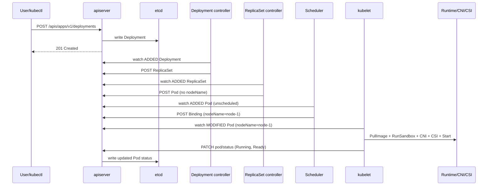

# Section 2: Kubernetes Architecture

This section explains Kubernetes as a distributed, declarative control system. Every design choice — from the centralized API server to the level-triggered reconciliation loops and the watch-based informer pattern — exists to handle the unavoidable reality that distributed systems fail partially, frequently, and in unexpected orders. Understanding these design principles is what separates a candidate who can use Kubernetes from one who can operate, extend, and debug it at scale.

## Subtopic Index

- [History and Evolution](#history-and-evolution)
- [Design Principles](#design-principles)
- [Declarative Architecture](#declarative-architecture)
- [Desired State Model](#desired-state-model)
- [Control Loops](#control-loops)
- [Reconciliation](#reconciliation)
- [Control Plane](#control-plane)
- [Data Plane](#data-plane)
- [Worker Nodes](#worker-nodes)
- [Request Lifecycle](#request-lifecycle)
- [Cluster Startup Sequence](#cluster-startup-sequence)
- [Component Interactions](#component-interactions)

---

## History and Evolution

Kubernetes was open-sourced by Google in June 2014 and announced at DockerCon. It draws directly from Google's internal systems: Borg (production orchestration for nearly everything at Google) and Omega (a research redesign that introduced shared-state scheduling). The key lesson from Borg that shaped Kubernetes most deeply: running arbitrary workloads on shared infrastructure at scale requires treating the cluster as a unified resource pool managed by automation, not a collection of individually administered machines.

The original Kubernetes design team carried over several Borg insights: labels and selectors as a flexible grouping mechanism (Borg used tasks and jobs with labels), health checking and replacement as a first-class operation, resource classes (requests and limits), and the alloc concept (Borg's analog to a pod). What Kubernetes added was a clean versioned API exposed over REST/HTTP, a pluggable extensibility model (CRDs, admission webhooks, custom controllers), and from the beginning a focus on portability across cloud providers — a direct response to the vendor lock-in concerns of the Docker ecosystem era.

The CNCF (Cloud Native Computing Foundation) accepted Kubernetes as a founding project in 2016. The 1.0 release (July 2015) established the basic architecture that persists today: kube-apiserver, etcd, kube-scheduler, kube-controller-manager, and kubelet. Subsequent versions added CRDs (1.7), admission webhooks (1.9), RBAC (1.6, stabilized 1.8), server-side apply (1.16), and containerized control-plane management tooling. The removal of dockershim (1.24) completed the CRI standardization effort.

---

## Design Principles

The three principles that explain every non-obvious Kubernetes design decision are: **declarative desired state**, **level-triggered reconciliation**, and **API-first loose coupling**.

**Declarative desired state** means users express what they want to be true (six replicas of this application), not how to achieve it. This separates the description of intent from the implementation of intent. The user's manifest becomes an API object stored durably in etcd. Controllers convert that declaration into real-world actions.

**Level-triggered reconciliation** means every controller periodically compares the current state of the world against the desired state and takes actions to close any gap — regardless of how many events triggered the loop or whether some events were lost. This is in contrast to edge-triggered systems (like simple webhook systems or imperative scripts) which respond to transitions. An edge-triggered system that misses an event (due to a crash, network partition, or queue overflow) never recovers from that gap. A level-triggered system is inherently self-healing: even after a controller restart, it re-reads all objects and reconciles from scratch.

**API-first loose coupling** means every component communicates through the versioned API server, never directly to another component. The scheduler does not call kubelet; it writes a binding to the API server. The controller does not call the runtime; it creates Pod objects. This means every component can be restarted, scaled, or replaced independently. The API server is the synchronization boundary.

These three principles together explain phenomena that confuse users: why a successful `kubectl apply` does not mean the workload is running (you stored desired state, not achieved it); why Kubernetes is eventually consistent (controllers run asynchronously); and why Kubernetes is resilient to component failures (the control loop re-reconciles from durable state).

---

## Declarative Architecture

In an imperative architecture, you tell the system what to do step by step: create VM, configure network, install package, start service. If any step fails, you must know the current state to resume. In a declarative architecture, you describe the target state, and the system figures out how to reach it from wherever it currently is.

Kubernetes represents desired state as typed API objects with a `spec` field (what you want) and a `status` field (what the system observed). The `spec` is written by users and operators. The `status` is written by controllers and the kubelet, describing what actually exists. A controller reads both, computes the difference (diff), and takes actions to close it. Because controllers are idempotent — running them again when the system is already converged does nothing harmful — the architecture tolerates retries, duplicate events, and concurrent reconciliation.

The practical consequence for operations: a resource in etcd with a valid spec does not imply the application is running. A Deployment with `spec.replicas: 6` is a desire, not a fact. `status.readyReplicas` is the fact. Production monitoring should alert on `status.readyReplicas < spec.replicas` for extended periods, not just on API call failures.

```yaml
# Example: desired vs observed separation
apiVersion: apps/v1
kind: Deployment
metadata:
  name: payments
  generation: 3              # incremented on spec change
spec:
  replicas: 6                # DESIRED STATE — user writes this
  template:
    spec:
      containers:
      - name: app
        image: payments:v3
status:
  observedGeneration: 3      # controller has processed this generation
  replicas: 6                # total pod count
  readyReplicas: 4           # pods passing readiness probe ← actual state
  updatedReplicas: 6
  conditions:
  - type: Available
    status: "True"
```

---

## Desired State Model

The desired state model is not just a naming convention. It is a contract with specific guarantees: a Kubernetes controller that is built correctly will eventually converge the cluster to the desired state after any single failure, including its own crash. The word "eventually" is critical — convergence is not instantaneous. A controller restart, a slow etcd write, a slow CNI plugin, or a node restart all delay convergence. The system is always making progress toward desired state, but it may not be there yet at any given instant.

`generation` and `observedGeneration` track this progress. Each spec change increments `metadata.generation`. When the controller processes that version of the spec, it sets `status.observedGeneration` to match. If `observedGeneration < generation`, the controller has not yet acted on the latest spec. This is the correct way to poll for rollout progress: not time-based delays, but condition checks.

OwnerReferences implement the object ownership hierarchy: a Deployment owns its ReplicaSets (both have `ownerReference` pointing to the Deployment), and a ReplicaSet owns its Pods. Garbage collection is built on this: when you delete a Deployment, the garbage collector cascades the deletion to owned ReplicaSets and then to owned Pods, in foreground or background cascade mode. Finalizers can block deletion until pre-deletion cleanup completes.

---

## Control Loops

A control loop is a feedback mechanism: measure current state, compare with desired state, take action to reduce the difference, repeat. Every Kubernetes controller implements a control loop. The Deployment controller's loop: list ReplicaSets owned by this Deployment, compare their total pods to desired replicas, create/scale/delete ReplicaSets to converge, update status. The kubelet's loop: list pods assigned to this node, compare with containers running in the runtime, start/stop/restart containers to converge, update pod status.

The work queue is central to every controller's loop implementation. When an informer event fires (a pod was created), the event handler does not immediately act on it. Instead, it enqueues a key (usually `namespace/name`) into a rate-limited work queue. Worker goroutines dequeue keys and call `Reconcile(key)`. The queue provides deduplication (multiple rapid events for the same object enqueue only once, so the reconciler sees the latest state) and rate limiting (prevents a thrashing controller from overwhelming the API server). If reconcile fails, the key is requeued with exponential backoff.

```
     Informer (watches API server)
          │
          ▼ AddFunc / UpdateFunc / DeleteFunc
     Work Queue  ←───── deduplication, rate-limit
          │
          ▼ worker goroutine dequeues key
     Reconcile(namespace/name)
       ├─ read object from lister (cache)
       ├─ compute desired children
       ├─ create / update / delete via API
       └─ update status
```

---

## Reconciliation

Reconciliation is the act of computing and applying the diff between actual state and desired state. A well-written reconciler is idempotent: calling it multiple times with the same actual and desired state produces the same result and no additional side effects. This is required because Kubernetes guarantees at-least-once event delivery, not exactly-once.

The standard pattern for a controller's reconcile function:

1. Read the owner object (e.g., Deployment) from the lister cache.
2. If the object has a `DeletionTimestamp`, perform cleanup (e.g., remove external resources) and remove the finalizer. Return.
3. Add a finalizer if not present (for cleanup on deletion).
4. List all child objects (e.g., ReplicaSets) with owner references pointing to this object.
5. Compute the desired child state.
6. For each child: if it should exist and doesn't, create it. If it exists but needs updating, patch it. If it shouldn't exist, delete it.
7. Update the parent object's status based on observed children.

Using `resourceVersion` in updates ensures that if two controller replicas (or a controller restart) both try to update the same object, only one wins — the other gets a `409 Conflict` and requeues. This optimistic concurrency control prevents split-brain updates.

---

## Control Plane

The control plane is the set of processes that collectively implement the Kubernetes control layer: making scheduling decisions, running reconciliation loops, serving the API, and persisting state. On a self-managed cluster, these run as static Pods on control-plane nodes, managed by the kubelet reading manifests from `/etc/kubernetes/manifests/`. On managed clusters (EKS, AKS, GKE), the cloud provider runs and manages the control plane, and users have no direct node access to it.

**kube-apiserver** is the only component that directly reads and writes etcd. It is stateless: any request can go to any apiserver replica. Multiple replicas improve throughput and availability; all state is in etcd. The apiserver processes REST and gRPC calls, enforces authentication/authorization/admission, converts between API versions, and delivers watch events to clients.

**etcd** is the durable, consistent key-value store for all cluster state. It uses the Raft consensus protocol to maintain consistency across replicas. The apiserver is the only client; all other components go through the apiserver.

**kube-scheduler** watches for pods with no `spec.nodeName` set, selects the best node for each pod using filtering and scoring, and writes a Binding object (which sets `spec.nodeName`). It runs as a single active leader with standby replicas.

**kube-controller-manager** is a single binary running ~30 built-in controllers: Deployment, ReplicaSet, StatefulSet, DaemonSet, Job, CronJob, Service, Endpoint, Node, Namespace, PersistentVolume, and more. It also runs as a single active leader.

**cloud-controller-manager** (on cloud environments) handles cloud-specific operations that core controllers should not depend on: provisioning cloud load balancers for `Service type=LoadBalancer`, managing cloud routes for pod IPs, and handling node lifecycle events from the cloud provider.

```
Control Plane Node
┌─────────────────────────────────────────────────────────┐
│  kube-apiserver  (port 6443, HTTPS)                     │
│  ↕ only component touching etcd                         │
│  etcd  (port 2379/2380)                                 │
│  kube-scheduler  (leader-elected)                       │
│  kube-controller-manager  (leader-elected, ~30 loops)   │
│  cloud-controller-manager  (cloud-specific)             │
└─────────────────────────────────────────────────────────┘
```

---

## Data Plane

The data plane consists of everything that actually runs workloads and carries their traffic: worker nodes, container runtimes, network plugins, and storage plugins. The data plane is designed for static stability — it should continue serving traffic even if the control plane is entirely unavailable.

A running pod's containers continue executing after the control plane becomes unavailable. kube-proxy's iptables/IPVS rules remain in place, so Service traffic continues routing. The CNI plugin's routing tables and eBPF maps remain installed. CSI-mounted volumes remain accessible. The only things that stop during a control plane outage are: new pod scheduling, pod restarts after crash (kubelet cannot fetch new spec), status updates, secret/configmap rolling updates, and HPA/autoscaler responses.

This static stability property is critical for designing control-plane upgrade procedures and for reasoning about blast radius. A cluster running 10,000 pods is not immediately affected by a 30-minute apiserver outage; the running workloads are fine. But: any pod that crashes during the outage cannot restart (kubelet can't fetch instructions), any certificate that expires during the outage may prevent pods from calling the apiserver if they use short-lived tokens, and the HPA cannot scale down a traffic spike.

---

## Worker Nodes

A worker node is a compute host (VM or physical machine) registered with the cluster. It runs the kubelet, a container runtime (containerd), kube-proxy (or an eBPF dataplane equivalent), and whatever CNI/CSI plugins are configured. The node advertises its capacity and conditions to the apiserver, and the scheduler uses this information to place pods.

A node registers itself by calling the apiserver's `POST /api/v1/nodes` endpoint. The request body contains the node's name, labels (including `kubernetes.io/hostname`, `topology.kubernetes.io/zone`, `topology.kubernetes.io/region`, instance type, OS/arch), and capacity (`cpu`, `memory`, `pods`, `ephemeral-storage`). The cloud-controller-manager adds further labels and taints for cloud-specific properties. The `allocatable` capacity is derived from `capacity` minus kubelet-reserved and system-reserved amounts.

Node health is signaled through: (1) a `Lease` object in `kube-node-lease` namespace that the kubelet updates every 10 seconds (loss means the node has not communicated for 40 seconds, triggering NodeNotReady condition); (2) `NodeConditions` in the node's status (`MemoryPressure`, `DiskPressure`, `PIDPressure`, `NetworkUnavailable`, `Ready`); and (3) node-level taints applied automatically by the node lifecycle controller for conditions like `node.kubernetes.io/not-ready:NoExecute` and `node.kubernetes.io/unreachable:NoExecute`.

```bash
kubectl get nodes -o custom-columns=\
NAME:.metadata.name,\
STATUS:.status.conditions[-1].type,\
READY:.status.conditions[-1].status,\
CPU:.status.capacity.cpu,\
MEM:.status.capacity.memory

kubectl describe node <name>  # shows allocatable, conditions, taints, and running pods
```

---

## Request Lifecycle

The lifecycle of an API request traverses: TLS termination → authentication → authorization → API Priority and Fairness (APF) → admission → object conversion + defaulting + validation → etcd write → watch event delivery → HTTP response. Each phase can fail distinctly, and each failure produces a different HTTP status code.

**Authentication** identifies who is making the request. Multiple authenticators run in order: client certificate, static bearer token, bootstrap token, ServiceAccount JWT, OIDC, or webhook. The first authenticator to succeed wins. Failure of all authenticators returns HTTP 401.

**Authorization** checks whether the authenticated identity is allowed to perform the requested operation (verb × API group × resource × subresource × namespace). RBAC is the standard mode; it checks RoleBindings and ClusterRoleBindings against the subject. Node authorization is a specialized authorizer that limits what kubelets can access to only their own node's pods, secrets, and configmaps. A 403 indicates successful authentication but failed authorization.

**API Priority and Fairness (APF)** queues requests when the apiserver is handling its maximum in-flight requests. Requests are classified by FlowSchema into priority levels with assured concurrency shares. This prevents a single client (e.g., a runaway controller) from starving system-critical operations like leader election renewals. A 429 (Too Many Requests) indicates APF throttling.

**Admission** runs after APF. First, all MutatingAdmissionWebhooks run in alphabetical order. Then validation (schema, field rules). Then all ValidatingAdmissionWebhooks run. A webhook returning `allowed: false` results in a 400 or 403 with the webhook's reason.

**etcd write**: for mutating requests, the apiserver writes the serialized object to etcd with a compare-and-swap on the resourceVersion, detecting concurrent modifications (returning 409). Success produces a new resourceVersion. The apiserver then emits a watch event to all relevant watchers (other controller informers, kubectl --watch sessions) before returning the HTTP response.

```
client HTTPS request
  │
  ├─ TLS (mutual or one-way)
  ├─ Authentication → 401 if none match
  ├─ Authorization → 403 if denied
  ├─ APF queue → 429 if overloaded
  ├─ Mutating Admission Webhooks → 400/403 if rejected
  ├─ Object defaulting + validation → 422 if invalid
  ├─ Validating Admission Webhooks → 400/403 if rejected
  ├─ etcd write (CAS on resourceVersion) → 409 if conflict
  └─ response (201 Created / 200 OK / error)
          │
          └─ watch event → all informers watching this resource
```

---

## Cluster Startup Sequence

On a self-managed cluster, the startup sequence follows strict dependency ordering. Understanding it helps diagnose startup failures and bootstrapping issues (common in kubeadm-based clusters and Kubernetes operators that manage their own clusters).

1. **etcd starts first.** The etcd cluster forms quorum and begins accepting reads and writes. On a fresh cluster, the schema is empty. On restart, etcd reads its WAL and snapshot to restore state.

2. **kube-apiserver starts.** It connects to etcd. It serves health endpoints. Other components are not yet connected. On startup, the apiserver applies CRD schemas and bootstrap configurations.

3. **kube-controller-manager starts.** It connects to the apiserver, acquires the leader election Lease, and starts reconciliation loops. On a fresh cluster it sets up default ClusterRoles, Namespaces, and default ServiceAccount tokens.

4. **kube-scheduler starts.** It connects to the apiserver, acquires its Lease, and begins watching for unscheduled pods.

5. **kubelet starts on each node.** It registers the node, starts pulling pod specs for any static Pods (from `/etc/kubernetes/manifests/`), then watches for dynamically assigned pods.

6. **CNI plugin DaemonSet starts.** Kubelet cannot mark the node Ready until the network plugin reports readiness. CoreDNS pods cannot start until the node is Ready.

7. **CoreDNS starts.** After CoreDNS is ready, cluster DNS works and pods can resolve service names.

8. **kube-proxy or eBPF dataplane starts** (often as a DaemonSet). Service routing becomes active once kube-proxy has programmed iptables/IPVS rules.

During the bootstrapping phase (kubeadm init / managed cluster creation), control-plane components start as static Pods managed by the kubelet reading local manifest files — no apiserver is required to tell the kubelet to start them. This chicken-and-egg problem is resolved by the static Pod mechanism.

---

## Component Interactions

The key insight about Kubernetes component interactions is that **all coordination happens through the API server as the single shared state store**. No component calls another component directly. The scheduler does not RPC the kubelet; it writes to etcd via the apiserver. The Deployment controller does not call the scheduler; it creates Pod objects in the apiserver. The kubelet does not tell the apiserver "here's what I'm running"; the apiserver tells the kubelet "here's what you should run," and the kubelet reports status back.

This interaction model has strong resilience properties: any component can restart without affecting others' ability to read and act on objects. The apiserver itself being unavailable is the one single point of failure — but even that only stops new scheduling and mutations, not running workloads.



### Key commands
```bash
# Observe component leader election
kubectl -n kube-system get lease kube-controller-manager -o yaml
kubectl -n kube-system get lease kube-scheduler -o yaml

# See all component versions and health
kubectl version
kubectl get componentstatuses  # deprecated but still useful on some clusters

# Check control plane pod health on self-managed clusters
kubectl -n kube-system get pods -l tier=control-plane

# Observe the full lifecycle of a Deployment
kubectl apply -f deployment.yaml
kubectl get deploy,rs,pod -w   # watch the creation cascade in real time
kubectl rollout status deployment/payments

# Node registration and lease
kubectl get nodes
kubectl -n kube-node-lease get leases | head -10
kubectl describe node <node> | grep -A30 "Conditions:"
```

---

## Interview Questions

### Conceptual / Internals (8 questions)

**1. Why does Kubernetes use level-triggered reconciliation instead of event-triggered mutation, and what are the failure resilience implications?**

Level-triggered means the controller observes current state and desired state and converges from wherever things are, not by replaying a specific event. If the controller crashes after seeing "pod A was deleted" but before acting on it, an event-triggered system never re-runs that deletion reaction. A level-triggered system restarts, reads all objects, finds that Pod A should not exist but a ReplicaSet says it should have 3 replicas, and creates a replacement. The reconciliation loop is self-healing by nature: missed events become visible as drift between actual and desired on the next loop iteration. The cost is that the controller must re-read the full object state on every reconcile, which is why informers and listers (local cache) are critical for performance — without them, every reconcile would hit the apiserver.

**2. What is the role of `generation` and `observedGeneration` in a Kubernetes resource, and how should they be used in automation?**

`metadata.generation` is incremented by the apiserver every time the `spec` of an object changes (not metadata, not status). It is monotonically increasing. `status.observedGeneration` is set by the controller to the generation it last reconciled. If `observedGeneration < generation`, the controller has not yet processed the latest spec. Automation that polls for rollout completion should check that `status.observedGeneration == metadata.generation` AND `status.conditions[?(@.type=="Available")].status == "True"` AND `status.readyReplicas == spec.replicas`, rather than just checking `readyReplicas`. A Deployment rollout script that only checks `readyReplicas` may declare success when an old generation's pods are ready but the new template hasn't been applied yet.

**3. Explain how static Pods solve the chicken-and-egg problem of Kubernetes bootstrapping.**

The kubelet can start pods from manifest files in a local directory (default `/etc/kubernetes/manifests/`) without the apiserver being available. These are static Pods: the kubelet reads the manifest, creates the pod using the runtime directly, and creates a mirror pod object in the apiserver (once the apiserver is available) to make it visible. On a new cluster, kubeadm writes control-plane manifests to this directory before starting anything. The kubelet starts etcd, then apiserver, then controller-manager and scheduler — all as static Pods — without any Kubernetes control plane involvement. This solves the bootstrapping problem: you need Kubernetes to start Kubernetes, but you can start the pieces by hand via manifest files.

**4. How does a Kubernetes controller handle a `409 Conflict` from the apiserver, and what is the underlying mechanism that produces it?**

A `409 Conflict` on an update or patch means the object's `resourceVersion` in the request does not match the current `resourceVersion` in etcd. The apiserver performs a compare-and-swap (CAS) when writing: it reads the current resource version, checks it matches the version in the request, and only then writes. If another writer modified the object between the controller's read and write, the CAS fails with 409. The controller should handle 409 by re-reading the object from the lister (getting the current version), recomputing the desired state, and retrying the write. client-go's retry utilities handle this automatically for most operations. This optimistic concurrency is how Kubernetes prevents lost updates without distributed locking.

**5. What happens to running pods when the control plane is completely unavailable for 30 minutes?**

Already-running containers continue executing uninterrupted — the control plane does not participate in container I/O, memory access, or CPU scheduling. iptables/IPVS rules for Services remain in place because kube-proxy installed them in the kernel on its last run. CNI routes remain active. CSI-mounted volumes remain accessible because the mount was done at pod start time and is maintained by the kernel, not the control plane. What stops: (1) new pod scheduling (scheduler cannot write bindings); (2) pod replacements for crashed pods (kubelet cannot fetch pod specs for new pods, though it can restart containers per the restart policy using the cached spec if the pod already existed on the node); (3) secret/configmap volume updates (projected volumes served from kubelet cache, which may be stale); (4) HPA/CA scaling decisions. The critical concern is certificate expiration: short-lived service account tokens will expire and pods that need to call the apiserver will fail.

**6. How does the Kubernetes watch mechanism work, and what causes a watch to receive a 410 Gone response?**

A client (e.g., a controller informer) first does a LIST request with `resourceVersion=""` (or a specific version) to get the current state of objects. The apiserver responds with a list that includes the current `resourceVersion`. The client then opens a WATCH request starting at that resourceVersion: `GET /api/v1/pods?watch=1&resourceVersion=1234`. The apiserver maintains a watch cache (an in-memory ring buffer of recent events per resource type). As long as the client's requested resource version falls within the cache window, events are streamed. If the client's resource version has been compacted out of the cache (the watch cache ring buffer has overflowed, or the client reconnected after a long pause), the apiserver returns `410 Gone`. The client's informer then performs a full relist (LIST with `resourceVersion=""`) to get fresh state, then restarts the watch. This is why thundering herd after a mass reconnect (e.g., apiserver restart) creates heavy LIST load on etcd.

**7. Explain the difference between foreground and background cascading deletion in Kubernetes.**

When you delete an owner object (e.g., a Deployment), the garbage collector must also delete owned objects (ReplicaSets → Pods). In **background deletion** (default), the owner is immediately deleted from etcd. The garbage collector runs asynchronously and deletes orphaned children. The owner disappears from `kubectl get` immediately, but pods may persist briefly. In **foreground deletion**, the owner gets a `DeletionTimestamp` but is NOT removed yet; it also gets the `foregroundDeletion` finalizer. The garbage collector first deletes all children. When all children are gone, it removes the `foregroundDeletion` finalizer, and the owner is finally deleted. Foreground ensures all children are cleaned up before the parent disappears — important for resources with external cleanup hooks (CSI volumes, load balancers). The `--cascade=foreground` flag on `kubectl delete` controls this.

**8. Why does Kubernetes have separate `kube-controller-manager` and `cloud-controller-manager` binaries, and what would happen if cloud-specific code were in the core controller-manager?**

The original `kube-controller-manager` included cloud-provider logic (for AWS, GCP, Azure, etc.) compiled directly into the binary. This meant Kubernetes releases were coupled to cloud-provider API updates, and adding a new cloud provider required changes to the core Kubernetes binary. The cloud-controller-manager (CCM) extracts cloud-specific controllers (Node lifecycle, Route management, Service LoadBalancer provisioning) into a separate binary that cloud providers can release independently of core Kubernetes. This is the "out-of-tree cloud provider" model. It also means the apiserver and core controllers are not dependent on any cloud provider SDK, reducing the attack surface and simplifying auditing of the core. If cloud code were in the core, a vulnerability in an AWS SDK would affect all clusters regardless of which cloud they run on.

---

### Scenario / Troubleshooting (6 questions)

**9. You apply a Deployment with `replicas: 10` but only 3 pods are running after 10 minutes. How do you diagnose?**

`kubectl describe deployment <name>` — check `Conditions` and `Events`. Then `kubectl get rs` — find the ReplicaSet owned by the Deployment and check its `Events`. Then `kubectl get pods -l app=<label>` and look at status columns for pending/failing pods. For pending pods, `kubectl describe pod <pending-pod>` — read the `Events` section. Common causes: resource limits exceeded on all nodes (events say "Insufficient cpu/memory"), taints blocking pods (events say "didn't match node selector taint"), quota exceeded on the namespace (events say "exceeded quota"), PVC not binding (events say "persistentvolumeclaim not found"), or image pull failures (events say "ImagePullBackOff"). Each event gives a distinct diagnosis path.

**10. After a control-plane node fails, you notice etcd is refusing writes with "leader not found." What has happened and what are your recovery steps?**

A 3-node etcd cluster requires 2 nodes for a write quorum. With one node down, 2 remain — still a quorum — so this symptom usually means 2 nodes failed, or the remaining nodes cannot reach each other. Check `etcdctl endpoint health --cluster` from a surviving node. If the cluster has lost quorum, etcd enters read-only mode. Recovery options: (1) if the failed node is recoverable, restore it and let it rejoin by restarting etcd with the same cluster config — it will pull the delta from the leader; (2) if data is lost, restore from an etcd snapshot: `etcdctl snapshot restore`, then start etcd with `--force-new-cluster` on one node to bootstrap a single-node cluster, restore the snapshot, then add back members; (3) in managed Kubernetes (EKS/AKS/GKE), the control plane including etcd is managed by the provider — contact support and show them the timeline.

**11. A Deployment rollout is stuck at 50% because new pods are not becoming Ready. How do you investigate?**

A rolling update with `maxUnavailable: 1` and `maxSurge: 1` will not proceed past a certain point if new pods are not Ready — because the controller won't scale down old pods until new ones are Ready. `kubectl rollout status deployment/<name>` will show it waiting. `kubectl describe pod <new-pod>` — check readiness probe failures in Events (e.g., "Readiness probe failed: HTTP probe failed with statuscode 500"). Use `kubectl logs <new-pod>` and `kubectl exec <new-pod> -- curl localhost:8080/healthz` to see whether the application itself is unhealthy. The issue could be a misconfigured probe, a startup latency not covered by `initialDelaySeconds`, a broken environment variable for a new config key, or a dependency (database, cache) that isn't reachable from the new pod version. Fix the root cause, not the probe timeout.

**12. A node is in `NotReady` state. What are the first five commands you run and why?**

1. `kubectl describe node <node>` — shows Conditions (what pressure is active), Events (what happened and when), and the last resource version. Condition `Ready: False` with message "node was unable to contact API server" indicates a network or kubelet issue.
2. `kubectl -n kube-node-lease get lease <node> -o yaml` — check `renewTime`. If it's old, the kubelet has not renewed its heartbeat. If it's current, the node is still alive but conditions are wrong.
3. On the node: `systemctl status kubelet` — is kubelet running? What error?
4. `journalctl -u kubelet --since "10m ago" | tail -100` — read kubelet logs for the failure cause: network plugin not ready, certificate error, runtime unavailable.
5. `systemctl status containerd` + `crictl info` — is the container runtime healthy? A runtime crash causes kubelet to fail pod sync and eventually mark itself NotReady.

**13. After deploying a new version of a StatefulSet, pods are not rolling: all old pods remain. Why?**

StatefulSets default to `updateStrategy: RollingUpdate`, which rolls pods from highest ordinal to lowest. But the roll only proceeds if each pod passes its readiness check before the next pod is updated. If the highest-ordinal pod (e.g., `pod-2`) fails readiness after its container is updated, the rollout stalls. Check `kubectl describe pod <statefulset-2>` for probe failures. Also check that `updateStrategy.rollingUpdate.partition` is not set to a value higher than 0 — a partition tells the StatefulSet controller to only update pods with an ordinal >= the partition value, keeping lower ordinals on the old version intentionally (used for manual canary on StatefulSets). Run `kubectl get statefulset <name> -o yaml | grep partition`.

**14. A cluster-wide admission webhook is causing all pod creates to fail with "connection refused." How do you recover?**

If `failurePolicy: Fail`, the webhook being unavailable causes all matching pod creates to fail — including Deployments, DaemonSets, and jobs. Immediate recovery: patch the webhook to `failurePolicy: Ignore` to make it non-blocking: `kubectl patch mutatingwebhookconfiguration <name> --type=json -p='[{"op":"replace","path":"/webhooks/0/failurePolicy","value":"Ignore"}]'`. If even that requires a pod to start (which fails), use `kubectl delete mutatingwebhookconfiguration <name>` to remove it entirely — this requires only a control-plane API call, no pod creation. Then fix the webhook service/deployment and re-add the configuration. Prevention: narrow `namespaceSelector` to exclude system namespaces, use `failurePolicy: Ignore` for non-critical webhooks, maintain multiple replicas with a PDB for critical webhooks, and test webhook unavailability as part of runbooks.

---

### FAANG-Level Deep Dive (6 questions)

**15. How does the kube-apiserver implement multi-version APIs, and how does etcd store objects that are served in multiple versions simultaneously?**

The apiserver maintains an "internal" (hub) type for each API group plus all versioned types. When a v1beta1 object is submitted, the apiserver converts it to the internal type for processing, then converts it to the configured storage version (often v1) before writing to etcd. When a client requests a v1beta1 object that was stored as v1, the apiserver reads v1 from etcd and converts to v1beta1 before responding. Conversion functions (generated by code-gen or written manually) handle each version pair. For CRDs, conversion webhooks handle multi-version conversion without changing the main apiserver binary. etcd stores only one version of each object (the storage version). The `status.storedVersions` field on a CRD tracks all versions ever stored, which must remain served until migrated.

**16. Explain the Raft leader election algorithm as used in etcd, including what happens during a network partition where neither partition has a majority.**

In Raft, a node starts as a Follower and transitions to Candidate if it doesn't receive a heartbeat from a leader within the election timeout (150-300ms random). As a Candidate, it increments its term and sends RequestVote RPCs to all peers. A node grants a vote to a candidate if: it hasn't voted in the current term, and the candidate's log is at least as up-to-date as the voter's. If the candidate receives votes from a majority (⌊n/2⌋ + 1), it becomes Leader and begins sending AppendEntries heartbeats. In a 3-node cluster partitioned 1|2: the partition with 2 nodes has a majority, elects a leader, and continues accepting writes. The 1-node partition cannot elect a leader (it needs 2 votes, can only get 1), so it remains in Candidate/Follower state in an election loop. When the partition heals, the 1-node partition sees the leader's higher term via heartbeats, reverts to Follower, and catches up via log replication. Importantly: during the partition, the 1-node side makes no progress (no writes accepted), but the 2-node side can continue accepting writes. etcd does not split-brain because it always requires a quorum write.

**17. Walk through the source code path in client-go from a watch event arriving over the HTTP response body to a controller's Reconcile function being called.**

`Reflector.ListAndWatch()` opens the HTTP watch stream. Responses are decoded by `WatchDecoder.Decode()` using the registered codec for the resource. Decoded events are pushed into `DeltaFIFO` (a FIFO queue with deduplication, implemented in `cache/delta_fifo.go`). The `Informer`'s `processLoop` goroutine calls `DeltaFIFO.Pop()` in a loop. Each popped delta is processed: the store (a thread-safe `cache.Store`) is updated (Add/Update/Delete), and registered EventHandlers (`ResourceEventHandlerFuncs`) are called. The `AddFunc`/`UpdateFunc`/`DeleteFunc` handlers (registered by the controller) typically call `queue.Add(key)` where `key = namespace/name`. The work queue (`workqueue.RateLimitingInterface`) receives the key. Worker goroutines (`controller.worker()`) call `queue.Get()`, look up the object via the lister (which reads the cache), and call `Reconcile(ctx, request)`. After reconcile returns, `queue.Done(key)` is called; if reconcile failed, `queue.AddRateLimited(key)` requeues with backoff.

**18. How would you design a Kubernetes controller that manages 100,000 custom resources (CRs) at extremely low latency without overwhelming the apiserver?**

Key design decisions: (1) Use `SharedIndexInformer` with label/field selector filtering to limit the watch scope — avoid a cluster-wide informer if the CRs are namespaced. (2) Use `MetadataInformer` (metadata-only watch) if the controller only needs to react to creation/deletion without reading the full spec until reconcile time. (3) Use multiple work-queue worker goroutines (50-200) to parallelize reconciliation; use `workqueue.NewRateLimitingQueue` with a `ItemExponentialFailureRateLimiter` to avoid thundering herds on errors. (4) Batch status updates with a dedicated status updater goroutine and aggregation window to avoid per-reconcile status PATCH calls. (5) Set a leader election lock with a short renew interval so failover is fast. (6) Use server-side apply with field manager for idempotent updates — no need for a read-modify-write cycle in the controller. (7) Implement a resync period greater than the expected reconcile time to avoid overwhelming the queue with periodic re-syncs.

**19. How does the Kubernetes scheduler achieve parallelism during filtering and scoring while preventing race conditions on node state?**

The scheduler takes a snapshot of node state at the start of each scheduling cycle (via `snapshot()` on the node cache). This snapshot is immutable for the duration of the cycle. The snapshot includes node capacity, existing pod requests, and conditions. Filter plugins run in parallel (one goroutine per node) against this snapshot — since the snapshot is read-only, no locking is needed during filtering. Score plugins also run in parallel per node against the same snapshot. After scoring, the scheduler selects the winner, then executes the `Reserve` phase (which tentatively "reserves" the resources in the live cache, not the snapshot, under a mutex), then issues the binding. The Reserve step is what prevents two pods from being simultaneously scheduled to the same node in concurrent scheduling cycles — the live cache is updated under lock before the bind is confirmed, so the next cycle's snapshot includes the reserved resources.

**20. Explain the OwnerReference garbage collection mechanism in detail, including the difference between orphan deletion, foreground deletion, and background deletion, and how the garbage collector resolves circular references.**

`OwnerReferences` form a DAG (not necessarily a tree; multiple owners are allowed). The garbage collector (GC) runs in the controller-manager. It maintains a directed graph of all objects and their owner references. When an object is deleted and has `OwnerReferences`, the GC processes them. In **orphan mode** (`--cascade=orphan`), the owner is deleted but children lose their owner reference and continue existing as orphans. In **background mode** (default), the owner is immediately deleted, and the GC asynchronously identifies and deletes children by scanning all objects for matching owner UID + namespace. In **foreground mode**, the owner gets a `DeletionTimestamp` and the `foregroundDeletion` finalizer; the GC deletes all children (in dependency order, respecting their own finalizers) and removes the finalizer only when the owner's `blockOwnerDeletion`-referencing children are all gone. Circular references are pathological and not supported — the GC assumes a DAG. If you create circular owner references, deletion will never complete (each object is blocked by the other). Kubernetes admission prevents obvious cycles for built-in resources but cannot prevent them for CRDs.

---

## Hands-On Labs

### Lab 1: Observe the Deployment Reconciliation Cascade

**Objective:** Watch the entire object lifecycle from `kubectl apply` to Ready pods.

**Setup:** Any Kubernetes cluster with `kubectl`.

**Tasks:**
1. Open four terminals. In terminal 1: `kubectl get deploy,rs,pod -w`. In terminal 2: `kubectl get events -w --sort-by=.lastTimestamp`. In terminal 3: `kubectl -n kube-system logs -l component=kube-controller-manager --tail=0 -f 2>/dev/null`.
2. Apply a Deployment in terminal 4: `kubectl apply -f https://k8s.io/examples/application/deployment.yaml`.
3. Observe in real time: the Deployment is created, the Deployment controller creates a ReplicaSet, the ReplicaSet controller creates Pods, the scheduler binds Pods to nodes (visible in events), kubelet starts containers and updates pod status.
4. Pause and resume: `kubectl scale deployment nginx-deployment --replicas=0`, wait for pods to terminate, then `kubectl scale deployment nginx-deployment --replicas=5`. Observe the reconciliation cascade again.

**Expected outcome:** You observe that the cascade is asynchronous and each object creation triggers the next controller independently.

### Lab 2: Simulate Control Plane Failure

**Objective:** Prove that data-plane stability persists during control-plane unavailability.

**Setup:** A local kind cluster.

**Tasks:**
1. Deploy a web application and confirm it serves traffic: `kubectl port-forward svc/my-app 8080:80 &`.
2. Confirm the pod serves: `curl localhost:8080`.
3. Pause the kube-controller-manager: `docker pause <kind-control-plane-container>` then manually pause just the controller-manager: on the control-plane node, find the controller-manager pid and send SIGSTOP.
4. Confirm the pod still serves: `curl localhost:8080` should still succeed.
5. Attempt `kubectl scale deployment my-app --replicas=3` — it will hang (scheduler/controller are unavailable but apiserver is up) or fail.
6. Kill the application pod manually: `kubectl delete pod <pod>`. Observe that no replacement starts while the controller-manager is stopped.
7. Resume the controller-manager. Observe the replacement pod being created and starting.

**Expected outcome:** Confirms static stability: data plane continues serving while control plane is partially down.

### Lab 3: Explore Leader Election

**Objective:** Understand how Kubernetes components use Lease-based leader election.

**Setup:** A multi-replica control plane or a local cluster.

**Tasks:**
1. Inspect the scheduler lease: `kubectl -n kube-system get lease kube-scheduler -o yaml`. Note `holderIdentity`, `leaseDurationSeconds`, `acquireTime`, `renewTime`.
2. Write a script that monitors renewTime: `while true; do kubectl -n kube-system get lease kube-scheduler -o jsonpath='{.spec.renewTime}'; echo; sleep 2; done`.
3. If using a kind cluster with multiple nodes, stop the scheduler pod and observe: renewTime stops updating, then another scheduler pod (if available) acquires the lease.
4. Write a simple leader-election program using client-go's `leaderelection` package that acquires the lease and logs "I am the leader" every second.

**Expected outcome:** You understand that leader election is simply optimistic locking on a Kubernetes Lease object, not a network consensus protocol.

---

## Production Incidents

### Incident 1: Mass Eviction Storm After etcd Compaction

**Symptom:** 200 pods evicted simultaneously across the cluster during a low-traffic period. PagerDuty alert: "Too many pods not running." Recovery took 15 minutes as pods were rescheduled and restarted.

**Investigation:** `kubectl get events -A --sort-by=.lastTimestamp` shows mass eviction at 03:42 UTC. Control-plane logs from etcd show a compaction job completed at 03:41. Apiserver logs show a burst of 410 Gone responses from etcd watch cache around 03:42. Controller-manager logs show thousands of reconcile loop invocations starting at 03:42. All controllers triggered their reconciliation at once, flooding the API server with LIST calls, creating an API server overload (HTTP 429 responses). New pod creates were delayed, and existing pods that needed replacement were slow to restart. The scheduler queue backed up.

**Root cause:** etcd compaction (removing historical revisions below the threshold) caused the apiserver watch cache to serve 410 Gone responses to all open watches. Every informer in the controller-manager relisted from scratch simultaneously. The thundering herd of LIST requests overloaded the apiserver and etcd.

**Recovery:** The storm subsided after 8 minutes as controllers spread their retries. Manual scaling of the apiserver to 5 replicas absorbed the burst. Pods rescheduled within 15 minutes.

**Prevention:** Run etcd compaction during low-traffic windows. Stagger compaction intervals across etcd nodes. Consider increasing the apiserver watch cache size to absorb more revisions before 410 responses. Add `--etcd-compaction-interval` tuning. Implement circuit breakers in custom controllers to prevent API storms.

### Incident 2: Control Plane Certificate Expiration

**Symptom:** On a Monday morning, all API calls begin failing with "x509: certificate has expired or is not yet valid." Cluster is unreachable. `kubectl get nodes` returns "Unable to connect."

**Investigation:** The kube-apiserver serving certificate is valid for one year, and this cluster was set up 365 days ago by a former engineer. The certificate was generated by kubeadm but certificate rotation was never configured. The control-plane is running but TLS handshakes fail for all clients.

**Root cause:** Kubernetes API server serving certificate expired. kubeadm auto-rotates certificates only on upgrade; this cluster had not been upgraded in 12 months.

**Recovery:** On the control-plane node, run `kubeadm certs renew all`. Restart all control-plane components (as static Pods, this requires restarting kubelet). Distribute the new kubeconfig to users: `scp /etc/kubernetes/admin.conf <users>`.

**Prevention:** Set a calendar reminder and a Prometheus alert: `apiserver_certificate_expiration_seconds < (86400 * 30)`. Run `kubeadm certs check-expiration` as a CronJob from inside the cluster. Adopt managed Kubernetes (EKS, AKS, GKE) which manages certificate rotation automatically. If self-managed, upgrade clusters at least annually, which triggers kubeadm cert renewal.
