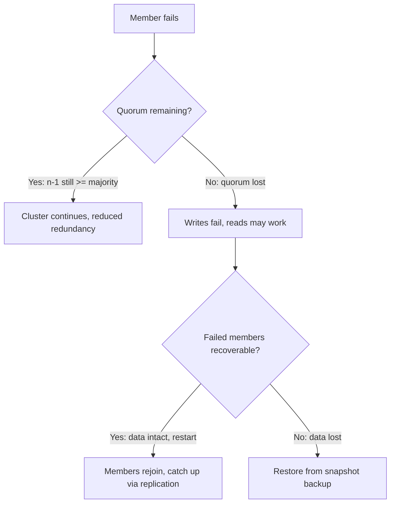

# Section 4: etcd

etcd is the only stateful component in the Kubernetes control plane. Everything else — the apiserver, scheduler, controller-manager, kubelet — is stateless and reconstructs its view from etcd on restart. If etcd is unavailable, Kubernetes cannot accept writes or schedule new work. If etcd data is corrupted or lost, cluster state is lost. Understanding etcd means understanding Raft consensus, WAL semantics, snapshot mechanics, compaction, and the specific read/write paths Kubernetes relies on — because etcd failures manifest as some of the most severe and hardest-to-diagnose Kubernetes outages.

## Subtopic Index

- [Architecture](#architecture)
- [Raft Algorithm](#raft-algorithm)
- [Leader Election](#leader-election)
- [Log Replication](#log-replication)
- [WAL — Write-Ahead Log](#wal--write-ahead-log)
- [Snapshots](#snapshots)
- [Quorum and Cluster Sizing](#quorum-and-cluster-sizing)
- [Consistency Models](#consistency-models)
- [Read Path](#read-path)
- [Write Path](#write-path)
- [Compaction](#compaction)
- [Defragmentation](#defragmentation)
- [Backup and Restore](#backup-and-restore)
- [Failure Handling](#failure-handling)

---

## Architecture

etcd is a distributed key-value store built on the Raft consensus protocol. It exposes a gRPC API (and an HTTP/JSON gateway) over which clients read, write, watch, and transact on keys. In a Kubernetes cluster, the kube-apiserver is the sole etcd client; it maps every Kubernetes API object to one or more etcd keys under `/registry/<group>/<resource>/<namespace>/<name>`.

A production etcd cluster runs as an odd number of members (3 or 5) to ensure a majority quorum can always be formed. Each member stores a complete copy of the data in an on-disk key-value store (`bbolt`, an embedded B-tree), a write-ahead log (WAL), and optionally periodic snapshots. Members communicate over a peer network (default port 2380) for Raft messages and serve client requests on a separate port (default 2379).

```
Client (kube-apiserver)
        │  gRPC :2379
        ▼
  ┌─────────────────┐    Raft :2380   ┌─────────────────┐
  │   etcd member 1 │ ◄─────────────► │   etcd member 2 │
  │   (leader)      │                 │   (follower)     │
  │   WAL + bbolt   │    Raft :2380   │   WAL + bbolt   │
  └─────────────────┘ ◄─────────────► └─────────────────┘
           ▲                                    │
           │          Raft :2380               ▼
           └──────────────────────── etcd member 3 (follower)
                                     WAL + bbolt
```

etcd is designed for control-plane coordination workloads: many small writes (typical Kubernetes write is < 1 KB), moderate reads, and strong consistency. It is **not** a data store for application state, cache storage, or high-throughput workloads. Kubernetes clusters that store large objects (giant ConfigMaps, CRD objects with embedded blobs) in etcd degrade its performance because etcd keeps all revisions in memory and disk.

### Key commands
```bash
# Set etcd client environment variables (self-managed cluster)
export ETCDCTL_API=3
export ETCDCTL_ENDPOINTS=https://127.0.0.1:2379
export ETCDCTL_CACERT=/etc/kubernetes/pki/etcd/ca.crt
export ETCDCTL_CERT=/etc/kubernetes/pki/etcd/server.crt
export ETCDCTL_KEY=/etc/kubernetes/pki/etcd/server.key

# Cluster health
etcdctl endpoint health --cluster --write-out=table
etcdctl endpoint status --cluster --write-out=table

# List Kubernetes API objects stored in etcd
etcdctl get /registry --prefix --keys-only | head -30
etcdctl get /registry/pods/default --prefix --keys-only

# Read a specific object (binary encoded, decode with auger)
etcdctl get /registry/pods/default/my-pod
```

---

## Raft Algorithm

Raft is a distributed consensus algorithm designed to be more understandable than Paxos while providing equivalent guarantees. etcd uses Raft to ensure that all members eventually agree on the same sequence of key-value operations, providing linearizable reads and writes across a cluster of machines where any minority may fail.

The Raft protocol divides time into **terms**, each uniquely numbered. A term begins with a leader election. There is at most one leader per term. Terms with no successful election (all candidates split the vote or time out simultaneously) result in the next term's election. The term number serves as a logical clock: a node that sees a higher term number knows something happened while it was unavailable and immediately steps down from any leadership role.

All reads and writes that require linearizable consistency go through the leader. The leader receives the client request, appends it to its log, sends `AppendEntries` RPCs to all followers, waits for a majority acknowledgment, commits the entry, applies it to the state machine (bbolt B-tree), and responds to the client. The state machine application produces the observable side effect: the key-value pair is written to bbolt, and watchers observing that key receive a notification.

### Key commands
```bash
# Check which member is the current leader
etcdctl endpoint status --cluster --write-out=table | grep true

# Check member list (IDs, peer URLs, client URLs)
etcdctl member list --write-out=table

# Inject artificial leader change (for testing — use with care)
etcdctl move-leader <target-member-id>
```

---

## Leader Election

A follower transitions to candidate when its election timeout fires without receiving a heartbeat from the current leader. The election timeout is randomized (150–300 ms in etcd's default) to stagger elections and reduce split votes. As a candidate, the node:
1. Increments its current term.
2. Votes for itself.
3. Sends `RequestVote` RPCs to all other members, including the candidate's current log index and term.

A voter grants the vote if: (a) it has not already voted in this term, and (b) the candidate's log is at least as up-to-date as the voter's (comparing last log term and last log index). A candidate that receives votes from a majority (⌊n/2⌋ + 1, including itself) wins and becomes leader. The new leader immediately sends `AppendEntries` heartbeats to assert leadership and suppress further elections.

If no candidate achieves majority (split vote), a new term begins after the election timeout fires again. The randomized timeout makes split votes rare. The term number monotonically increasing ensures that a leader that partitioned away and rejoins discovers it is stale (its term is lower than the current term on the surviving partition) and immediately steps down.

**Pre-vote phase** (used by etcd): before incrementing the term and sending `RequestVote`, a candidate first sends `PreVote` requests (which don't increment the term). If it can't get majority agreement on a pre-vote, it doesn't disrupt the cluster by incrementing the term. This prevents network-partitioned members from continually incrementing the term and forcing re-elections when they rejoin.

### Key commands
```bash
# Monitor leader changes (watch metrics)
watch -n2 "etcdctl endpoint status --cluster --write-out=table"

# Check current term (indicates election history)
etcdctl endpoint status --write-out=json | python3 -m json.tool | grep raftTerm

# Force-resign current leader (useful for maintenance of leader node)
etcdctl move-leader $(etcdctl endpoint status --cluster --write-out=json | \
  python3 -c "import json,sys; d=json.load(sys.stdin); \
  print([m['Status']['header']['member_id'] for m in d if not m['Status']['leader'] == 0][0])")
```

---

## Log Replication

The Raft log is a sequence of entries, each containing a term number, an index, and a command (the key-value operation). Once committed, entries are permanent — they will never be removed from a correct replica's log. This immutability is what gives Raft its safety property.

**AppendEntries** is the Raft RPC used both for heartbeats (empty entries) and log replication (entries with data). When the leader receives a client write, it:
1. Appends the entry to its own log and calls `fdatasync` to persist it to the WAL on disk.
2. Sends `AppendEntries` RPCs to all followers concurrently, including the new entry and a consistency check (previousLogIndex, previousLogTerm).
3. Waits for acknowledgments from a majority (including itself).
4. Marks the entry as committed. Updates `commitIndex`.
5. Applies the entry to the state machine (bbolt) and responds to the client.
6. On the next `AppendEntries` (or heartbeat), informs followers of the new commitIndex. Followers apply committed entries to their state machines asynchronously.

The consistency check ensures the log never diverges: a follower only appends an entry if its log matches the leader's log up to the previous entry. If there is a discrepancy (from a previous leader that had uncommitted entries), the follower's inconsistent suffix is overwritten with the leader's log. This is safe because uncommitted entries were never acknowledged to clients.

**Write amplification**: each write requires: (1) a leader WAL `fdatasync`, (2) network round-trip to followers, (3) follower WAL `fdatasync`, (4) follower acknowledgment, (5) leader state machine apply. The leader `fdatasync` is on the critical path of write latency. Slow disks directly increase client write latency.

### Key commands
```bash
# Check log index and commit index across all members
etcdctl endpoint status --cluster --write-out=json | \
  python3 -c "import json,sys; [print(m['Endpoint'], 'raftIndex:', m['Status']['raftIndex']) for m in json.load(sys.stdin)]"

# Check if any follower is significantly behind the leader
# Large difference between leader raftIndex and follower raftIndex indicates lag
```

---

## WAL — Write-Ahead Log

The Write-Ahead Log is etcd's durability mechanism. Before any state machine (bbolt) modification, the change is written to the WAL and `fdatasync`-ed to disk. If etcd crashes after the WAL write but before the bbolt update, the WAL can be replayed on restart to reconstruct the state.

etcd creates WAL files in the `--wal-dir` path (defaulting to the data directory). WAL files are sequentially named and append-only. Each WAL entry contains a Raft log entry record (the operation) or a state record (current term and vote). A WAL entry record structure: type, data (the Raft entry bytes), and a CRC32 checksum for integrity verification.

On startup, etcd replays the WAL from the last snapshot forward to reconstruct the committed log state. The state machine is rebuilt by applying all committed entries in order. This is why etcd startup time grows with WAL size when no snapshot is available — it must replay all entries since the last snapshot.

WAL `fdatasync` is the dominant latency component for writes. On HDDs, `fdatasync` can take 10–20ms. On consumer SSDs, 1–5ms. On high-performance NVMe in a data center, <1ms. etcd's election timeout (1s default) must be significantly larger than typical `fdatasync` latency — otherwise, disk hiccups cause spurious leader elections.

The `etcd_disk_wal_fsync_duration_seconds` Prometheus metric is the most important single etcd metric for diagnosing stability issues. P99 >10ms on etcd indicates disk pressure and impending instability.

### Key commands
```bash
# Check WAL fsync latency (the single most important etcd metric)
etcdctl endpoint status --write-out=table   # also shows db size
# Via Prometheus:
# etcd_disk_wal_fsync_duration_seconds_bucket
# etcd_disk_backend_commit_duration_seconds_bucket

# Find etcd's data directory
systemctl cat etcd | grep data-dir
ls -lh /var/lib/etcd/member/wal/

# Check WAL file sizes
du -sh /var/lib/etcd/member/wal/
```

---

## Snapshots

A snapshot is a complete serialized dump of the bbolt state machine at a specific Raft log index. Snapshots serve two purposes: (1) bootstrapping a lagging follower that has fallen too far behind to catch up via log replay alone; (2) bounding WAL size by allowing entries before the snapshot index to be discarded.

etcd takes snapshots automatically when the number of applied log entries since the last snapshot exceeds `--snapshot-count` (default 100,000). The snapshot includes all key-value pairs at the current revision plus metadata (term, index). The snapshot is written to `<data-dir>/member/snap/`. After the snapshot is committed, WAL entries before the snapshot index can be purged.

When a new follower joins (or a follower falls far behind), the leader sends it the snapshot instead of replaying thousands of log entries. The follower applies the snapshot directly to its bbolt (replacing its state), then continues from the snapshot index via normal log replication.

For Kubernetes backup purposes, `etcdctl snapshot save` creates an on-demand snapshot. This is the primary mechanism for disaster recovery.

### Key commands
```bash
# Create an on-demand snapshot (backup)
etcdctl snapshot save /backup/etcd-snapshot-$(date +%Y%m%d-%H%M%S).db

# Verify snapshot integrity
etcdctl snapshot status /backup/etcd-snapshot.db --write-out=table
# Shows: hash, revision, total keys, total size

# Check automatic snapshot files on disk
ls -lh /var/lib/etcd/member/snap/

# Snapshot size roughly correlates with cluster state size
du -sh /var/lib/etcd/
```

---

## Quorum and Cluster Sizing

Raft requires a majority quorum (⌊n/2⌋ + 1) for writes. A 3-member cluster can tolerate 1 failure; a 5-member cluster can tolerate 2. Adding a 4th member provides no additional fault tolerance (still only tolerates 1 failure: you need 3 of 4 to agree) and adds latency because the leader must wait for 2 of 3 followers instead of 1. This is why etcd clusters are always odd-numbered.

| Cluster size | Write quorum | Tolerated failures |
|---|---|---|
| 1 | 1 | 0 |
| 3 | 2 | 1 |
| 5 | 3 | 2 |
| 7 | 4 | 3 |

Larger clusters (7+) are rarely used for Kubernetes because: (1) write latency increases (more nodes to wait for), (2) leader election takes longer, (3) operational complexity grows, (4) 5-member clusters already tolerate 2 simultaneous failures which covers most datacenter scenarios. For large Kubernetes deployments, the answer is multiple smaller etcd clusters behind API partition, not a single large cluster.

etcd is sensitive to **network latency between members**. etcd's heartbeat interval (default 100ms) and election timeout (default 1s) are tuned for datacenter networks with <10ms RTT between members. Cross-datacenter etcd (>50ms RTT) requires tuning `--heartbeat-interval` and `--election-timeout` upward, and the resulting election timeout becomes the minimum time the cluster is unavailable during a leader failure — a significant trade-off for multi-region etcd.

### Key commands
```bash
# Add a new member (before starting the new etcd process)
etcdctl member add etcd4 --peer-urls=https://etcd4:2380

# Remove a failed member
etcdctl member remove <member-id>

# Check member health and round-trip times
etcdctl endpoint health --cluster --write-out=table --dial-timeout=5s
```

---

## Consistency Models

etcd supports two read consistency levels: **linearizable** (default) and **serializable**.

**Linearizable reads** provide the strongest guarantee: any read sees the most recently committed write. The leader, before serving a linearizable read, must confirm it is still the leader by sending a read-index heartbeat to a quorum of followers. Only after confirming it is current does it serve the read from its state machine. This prevents a stale leader (partitioned away, not yet deposed) from serving stale reads.

**Serializable reads** are served directly from the local state machine without a quorum check. They are faster but may return stale data — a follower might be one or more log entries behind the leader. Kubernetes uses serializable reads only in specific controlled circumstances; the default is linearizable.

Why this matters for Kubernetes: when the apiserver reads an object from etcd (e.g., to check if a pod already exists before creating it), it uses linearizable reads. A stale read that misses a recent write could cause the apiserver to create a duplicate pod or miss a deletion. The consistency guarantee is critical for correctness.

The apiserver's watch cache sits above etcd and serves most reads from memory (see Section 3). Linearizable reads from etcd are needed only for specific cases: `GET` requests with `resourceVersion=""` that opt out of the watch cache, or situations where the cache has expired. In practice, the watch cache absorbs the vast majority of read load.

### Key commands
```bash
# Linearizable read (default)
etcdctl get /registry/pods/default/my-pod

# Serializable read (faster, potentially stale)
etcdctl get /registry/pods/default/my-pod --consistency=s

# Check linearizable read latency
etcdctl endpoint status --write-out=table  # includes round-trip time to leader
```

---

## Read Path

For a linearizable read, the sequence is: client sends `Range` RPC to any member → if the member is the leader, it confirms leadership via read index heartbeat → it reads from bbolt B-tree → serializes value → returns to client. If the member is a follower, it forwards the request to the leader (or returns an error directing the client to retry via the leader).

The bbolt B-tree stores all key-value pairs at all revisions (MVCC — Multi-Version Concurrency Control). A read of `/registry/pods/default/my-pod` retrieves the current revision of that key. etcd stores each write as a new revision, not an overwrite. The `(key, revision)` pair uniquely identifies a value. The current revision of a key is the highest-revision write to that key that has not been deleted.

MVCC is what makes etcd's watch semantics work: a watcher asking for changes since revision N can be served by scanning all log entries with revision > N for the watched key prefix. The watch cache in the apiserver implements this at a higher level using Raft log entries directly.

Range queries (key prefix scans) are common in Kubernetes: listing all pods in a namespace is a range scan over `/registry/pods/<namespace>/`. bbolt handles range scans efficiently because keys are stored in sorted order by their byte representation.

### Key commands
```bash
# Range scan (list all pods in a namespace)
etcdctl get /registry/pods/default --prefix --keys-only

# Get a specific key with its revision
etcdctl get /registry/pods/default/my-pod -w json | python3 -m json.tool

# Watch for changes on a key (useful for debugging)
etcdctl watch /registry/pods/default --prefix

# Check etcd revision (monotonically increasing, unique per write)
etcdctl endpoint status --write-out=json | python3 -m json.tool | grep revision
```

---

## Write Path

A write to etcd follows the path: client sends `Put` or `Txn` RPC → leader appends entry to log (WAL fsync) → leader sends `AppendEntries` to followers → followers append to their WAL (fsync) and acknowledge → leader commits (applies to bbolt, updates revision) → leader responds to client → followers commit on next heartbeat.

The **Txn** (transaction) API is heavily used by the apiserver for optimistic concurrency. A typical apiserver write: `Txn({ If: [key.modRevision == expectedRevision], Then: [Put(key, newValue)], Else: [] })`. If the key's modification revision matches (i.e., no other writer changed it since the apiserver last read it), the write succeeds. If not, the transaction fails (analogous to CAS failure → apiserver returns 409 to the client).

Kubernetes objects in etcd are serialized as protobuf (since Kubernetes 1.6 for efficiency). The object encoding is: a magic byte sequence identifying it as proto, followed by the protobuf-encoded Kubernetes object. This binary encoding is not human-readable in etcd directly. Tools like `auger` or `etcdhelper` decode it.

The bbolt commit (`fdatasync` of the bbolt data file) is a second disk operation per write, separate from the WAL fsync. etcd batches bbolt commits at configurable intervals (`--backend-batch-interval`, default 100ms) to amortize the cost: multiple Raft log entries may be applied to bbolt before the next fsync. The WAL fsync is still per-entry on the critical path.

### Key commands
```bash
# Check bbolt database size and fragmentation
etcdctl endpoint status --write-out=table  # shows "DB SIZE"
# If DB size >> actual object count * avg object size, fragmentation is high

# Watch write rate
# etcd_mvcc_put_total, etcd_mvcc_delete_total in Prometheus

# Decode a protobuf-encoded Kubernetes object from etcd (requires auger)
etcdctl get /registry/pods/default/my-pod | auger decode

# Check current revision (write counter)
etcdctl get "" --from-key --rev=0 --limit=1 --keys-only  # get latest revision
```

---

## Compaction

etcd's MVCC model retains every historical revision of every key. Without compaction, etcd's memory and disk usage grows indefinitely. Compaction removes all revisions below a threshold, keeping only the history from the compaction point forward.

The apiserver triggers compaction automatically via `--etcd-compaction-interval` (default 5 minutes). It compacts to the latest revision minus a configurable history (`--etcd-servers-overrides` or direct etcd flag). After compaction, etcd clients that hold a watch or try to read with a revision older than the compaction point receive a **`CompactRevision` error** (surfaced by the apiserver as a 410 Gone watch expiration). This triggers the informer relist storm described in the production incident in Section 3.

Compaction does not immediately reclaim disk space — it marks old B-tree pages as free. The bbolt database file (`member/snap/db`) remains the same size. **Defragmentation** (covered next) is required to actually reclaim disk.

Compaction impacts etcd performance: during compaction, bbolt scans the entire B-tree to find and free old revisions. On a large cluster (2M+ keys and 10M+ revisions), compaction can take several seconds and increases latency for concurrent writes. The `etcd_debugging_mvcc_db_compaction_pause_duration_milliseconds` metric tracks this.

### Key commands
```bash
# Compact manually to the current revision (emergency disk recovery)
REV=$(etcdctl endpoint status --write-out=json | \
  python3 -c "import json,sys; print(json.load(sys.stdin)[0]['Status']['header']['revision'])")
etcdctl compact $REV

# Check compaction progress in metrics
# etcd_mvcc_db_compaction_keys_total
# etcd_mvcc_db_compaction_pause_duration_milliseconds

# View current revision and compaction point
etcdctl endpoint status --cluster --write-out=json | \
  python3 -m json.tool | grep -E 'revision|compactRevision'
```

---

## Defragmentation

After compaction, the bbolt database file still contains fragmentation: freed pages from deleted/compacted entries are marked as available but not returned to the OS. The on-disk database file remains at its peak size. Defragmentation rewrites the database file sequentially, reclaiming the freed pages and reducing file size.

`etcdctl defrag` performs online defragmentation by:
1. Creating a new empty bbolt database.
2. Walking the existing database and writing all live key-value pairs to the new database.
3. Atomically replacing the old database with the new one.

During defragmentation, the member holds an exclusive lock on the database, preventing reads and writes for the duration (seconds to minutes on a large database). **Defrag one member at a time** to avoid cluster-wide unavailability. Never defrag all members simultaneously.

In Kubernetes, etcd defragmentation should be scheduled as a maintenance operation during low-traffic windows. Many production clusters defragment weekly or when the database file exceeds a configured threshold (e.g., `etcd_mvcc_db_total_size_in_bytes > 4Gi`).

### Key commands
```bash
# Defragment a single member (causes brief lock)
etcdctl defrag --endpoints=https://etcd1:2379   # defrag only this member

# Defrag all members one at a time (automated, with health checks between)
for EP in $(etcdctl endpoint status --cluster --write-out=json | \
  python3 -c "import json,sys; [print(m['Endpoint']) for m in json.load(sys.stdin)]"); do
  echo "Defragging $EP"
  etcdctl defrag --endpoints=$EP
  sleep 5
  etcdctl endpoint health --endpoints=$EP
done

# Check database size before and after defrag
etcdctl endpoint status --cluster --write-out=table  # before
# ... defrag ...
etcdctl endpoint status --cluster --write-out=table  # after
```

---

## Backup and Restore

etcd backup in Kubernetes means taking a snapshot of the etcd database. This snapshot can be used to restore the cluster state after a catastrophic failure (corrupted data, lost quorum with no recovery path, accidental mass deletion).

**Backup procedure:**
```bash
ETCDCTL_API=3 etcdctl snapshot save \
  --endpoints=https://127.0.0.1:2379 \
  --cacert=/etc/kubernetes/pki/etcd/ca.crt \
  --cert=/etc/kubernetes/pki/etcd/server.crt \
  --key=/etc/kubernetes/pki/etcd/server.key \
  /backup/etcd-$(date +%Y%m%d-%H%M%S).db

# Verify
etcdctl snapshot status /backup/etcd-*.db --write-out=table
```

**Restore procedure** (after a complete etcd loss):
```bash
# Stop apiserver and etcd on all control-plane nodes
# On each node, restore from snapshot:
ETCDCTL_API=3 etcdctl snapshot restore /backup/etcd-backup.db \
  --name=etcd1 \
  --initial-cluster="etcd1=https://etcd1:2380,etcd2=https://etcd2:2380,etcd3=https://etcd3:2380" \
  --initial-cluster-token=etcd-cluster-1 \
  --initial-advertise-peer-urls=https://etcd1:2380 \
  --data-dir=/var/lib/etcd-restore

# Move restored data into place and restart etcd
mv /var/lib/etcd /var/lib/etcd-old
mv /var/lib/etcd-restore /var/lib/etcd
# Restart etcd (static pod: move manifest, wait, move back)
```

The snapshot contains: all key-value data at the snapshot revision, but **not** the WAL. Restoring from a snapshot means all progress after the snapshot is lost. This is why frequent automated snapshots (every 5–30 minutes in production) are critical. Kubernetes backup tools like Velero, in addition to snapshotting etcd, also capture PersistentVolume data — etcd contains only Kubernetes API objects, not the application data stored in volumes.

### Key commands
```bash
# Automated backup as a CronJob (conceptual — runs in a privileged pod on control plane)
# Store backups with rotation: keep last 24h hourly, last 7 days daily
# Use rclone/aws s3 cp to push to remote storage

# List available backups and check integrity
for SNAP in /backup/*.db; do
  echo -n "$SNAP: "
  etcdctl snapshot status $SNAP --write-out=table 2>/dev/null | grep -E 'Hash|Total|Size'
done
```

---

## Failure Handling

etcd failure scenarios in Kubernetes range from single-member loss (recoverable with no downtime) to quorum loss (cluster becomes read-only) to complete data loss (requires restore from backup).

**Single member failure (3-node cluster):** quorum is maintained with 2 members. etcd continues accepting reads and writes. The failed member misses log entries while down. On restart, it catches up via log replication from the leader (if it's within the snapshot window) or receives a full snapshot. No Kubernetes control-plane impact beyond reduced redundancy.

**Leader failure:** followers detect the missing heartbeat within the election timeout (default 1s). A new leader is elected. During the election period (up to 1–2 seconds), etcd rejects writes. The apiserver retries and the brief pause is usually invisible to users. All previously committed writes are preserved.

**Two-member failure (3-node cluster):** quorum is lost. The remaining member enters a read-only state — it can serve reads (with potentially stale data if using serializable consistency) but cannot commit writes. The apiserver's write calls start failing. Kubernetes cannot schedule new pods, create resources, or update status. Recovery requires restarting the failed members (if data is intact) or using `--force-new-cluster` to bootstrap a single-node cluster from the surviving member.

**Complete data loss:** requires restoring from a snapshot backup and rebuilding the cluster. All state created after the last snapshot is lost. In production, this means pods that were created after the last backup will not be in etcd; the kubelet will receive a "pod no longer exists" notification and stop those containers.

**Split brain in etcd is prevented by Raft:** the minority partition can never commit writes (it lacks quorum). Even if the minority had a stale leader, it cannot make progress. When the partition heals, the minority's leader discovers a higher term and immediately steps down.



### Key commands
```bash
# Check quorum status after a failure
etcdctl endpoint health --cluster --dial-timeout=5s

# Force a single member to become a new cluster (LAST RESORT after quorum loss)
# On the surviving member, after stopping all other etcd processes:
etcd --force-new-cluster --data-dir=/var/lib/etcd

# Check if apiserver is rejecting writes due to etcd unavailability
kubectl get nodes 2>&1    # will timeout or show error
journalctl -u kube-apiserver | grep -i 'etcd\|storage\|error' | tail -20

# Recovery: after restoring etcd, restart apiserver to reconnect
# On kubeadm: move and restore apiserver static pod manifest
```

---

## Interview Questions

### Conceptual / Internals (8 questions)

**1. Explain the Raft leader election algorithm. What happens in a 3-node cluster when the leader fails?**

When the leader fails, its followers stop receiving heartbeats. After a randomized election timeout (150–300ms), one follower transitions to candidate, increments its term, votes for itself, and sends `RequestVote` to the other member. If the remaining member grants the vote (hasn't voted in this term and the candidate's log is at least as up-to-date), the candidate wins with a 2-of-3 majority and becomes leader. It immediately sends heartbeats to suppress any other candidate. The new leader has all committed entries from the previous leader — Raft guarantees that no committed entry is ever lost because a majority had to acknowledge it. Uncommitted entries from the old leader (if any) may be overwritten by the new leader. From etcd's perspective, client writes fail for up to ~1 second during the election window, then resume with the new leader.

**2. Why does etcd require low-latency SSDs, and what is the specific failure mode when disk is slow?**

Every Raft log entry requires an `fdatasync` syscall to persist the WAL to disk before the leader can acknowledge the write. If `fdatasync` takes 20ms (typical HDD), the leader cannot ack the write in under 20ms. Under load with many concurrent writes, the disk becomes the bottleneck and write latency grows. More critically: the Raft heartbeat and election timeout depend on timing. If `fdatasync` is slow enough that the leader cannot send heartbeats on schedule, followers trigger spurious elections, causing disruption even with no actual failures. The `etcd_disk_wal_fsync_duration_seconds` p99 metric is the single most important etcd operational signal. Production recommendation: dedicated NVMe SSD for etcd data and WAL directories, separate from the OS disk.

**3. What is the difference between linearizable and serializable reads in etcd, and which does Kubernetes use by default?**

A linearizable read guarantees seeing the most recently committed write. Before serving the read, the leader confirms it is still the current leader by getting acknowledgment from a majority — preventing a partitioned stale leader from serving reads. A serializable read is served from the local state machine without a quorum check; a follower can serve it and may return data that is one or more commits behind the leader. Kubernetes (via the kube-apiserver) uses linearizable reads by default to ensure correctness — the apiserver must not return stale data when checking for resource conflicts or serving user queries. The watch cache overlays this: most Kubernetes reads are served from the apiserver's in-memory watch cache, not directly from etcd. Direct etcd reads happen primarily when the cache is cold or a client explicitly requests a current/uncached read.

**4. Explain etcd MVCC and how it enables the watch mechanism.**

MVCC (Multi-Version Concurrency Control) means etcd never overwrites a key's value — it appends a new revision. Every write creates a new `(key, revision)` pair. Reading a key returns the value at the latest revision for that key. This means etcd holds the complete history of all key mutations in the bbolt B-tree. The watch mechanism leverages this: a watcher registers for changes to a key or prefix since a given revision (`watchRevision`). etcd can serve watch events by scanning all entries with revision > watchRevision for matching keys. This is why the apiserver's watch cache can efficiently reconstruct recent history from etcd's data, and why etcd compaction (removing old revisions) can cause watchers to receive `CompactRevision` errors if they are too far behind.

**5. Why does compaction sometimes cause all Kubernetes controllers to relist simultaneously, and what are the cascading effects?**

Compaction removes revisions below a threshold. If any apiserver watch cache or informer watch is holding a revision older than the compaction point, the etcd watch returns a `CompactRevision` error. The apiserver translates this into a 410 Gone for its watchers (informers in the controller-manager, scheduler, kubelet). Every informer receiving 410 must perform a full LIST (relist) to establish fresh state. If the compaction point advances past all current watches simultaneously (common if compaction hasn't run in a long time and then runs aggressively), all informers in all controllers relist at once. Each relist is a range scan of all objects for that resource type. Thousands of concurrent LIST calls to the apiserver overflow the APF `workload-low` bucket, causing 429s. The controllers back off and retry, eventually converging, but reconciliation is delayed by several minutes.

**6. Explain the snapshot and WAL restore process on etcd startup.**

On startup, etcd checks for the latest snapshot in `<data-dir>/member/snap/`. It loads the snapshot into the bbolt state machine directly (no entry-by-entry replay needed). The snapshot includes a `term`, `index`, and a complete dump of all key-value pairs at that index. etcd then opens the WAL and scans for entries after the snapshot index. These entries are replayed in order: each entry is applied to the bbolt state machine until the WAL is exhausted. If the WAL has uncommitted entries (entries that were in the leader's log but not yet committed before a crash), they are truncated. The final state is a consistent committed view of the cluster. The startup time is proportional to: (1) the snapshot size (read from disk) + (2) the number of WAL entries after the last snapshot.

**7. How does the `etcdctl snapshot restore` command work and why must all members restore from the same snapshot file?**

`etcdctl snapshot restore` takes a snapshot file and creates a new etcd data directory with the snapshot data and a new WAL. The key point: it creates a **new cluster** with a new cluster ID and initial peer URLs. If different members restore from different snapshot files, they will have divergent histories — there is no mechanism to merge two different etcd state machines. All members must restore from the same snapshot to have the same base state. After restore, each member starts fresh from the snapshot revision, and new Raft log entries are appended as writes resume. The `--initial-cluster`, `--name`, and `--initial-advertise-peer-urls` flags must match the cluster's new topology exactly, or members won't be able to peer.

**8. What is the significance of the bbolt defragmentation operation, and what is the risk of running it during business hours?**

bbolt maintains an in-memory freelist of pages that have been released by MVCC compaction or key deletions. These pages are available for reuse but are not returned to the OS; the database file on disk stays at its peak historical size. Defragmentation rewrites the entire database file sequentially, eliminating fragmentation and shrinking the file. During defragmentation, bbolt holds an exclusive write lock — no reads or writes can be served from that member for the duration. On a 2 GB database, defrag may take 10–30 seconds. If run during business hours on a 3-member cluster, one member is offline for 30 seconds. Other members absorb the load. If run simultaneously on all members (a common mistake), the entire cluster is unavailable. The risk is compounded during high write periods: the post-defrag sync of the new database file to disk can spike I/O, competing with normal write traffic.

---

### Scenario / Troubleshooting (6 questions)

**9. etcd reports `mvcc: required revision has been compacted`. What caused this and how do you fix it?**

A client (the apiserver watch, or an informer) requested a watch or read at a revision that etcd has compacted away. This means the client was too far behind — it hasn't read from etcd for long enough that compaction has passed its revision. In the apiserver, this manifests as 410 Gone responses to watchers. The informer handles this by relisting. The fix for most cases is to do nothing — the system self-heals within minutes as informers relist. For persistent issues: (1) check if compaction is too aggressive; consider increasing `--etcd-compaction-interval` on the apiserver or the etcd `--auto-compaction-retention` value; (2) check if a specific informer is stuck and not relisting — look for controllers with old cache generations; (3) ensure watch cache memory is sufficient to hold recent history.

**10. A Kubernetes cluster loses 2 of 3 etcd members simultaneously. Walk through the exact failure progression and recovery steps.**

Immediately after the 2-member loss: the surviving member cannot achieve write quorum. etcd returns errors for all writes. The apiserver attempts to write (e.g., kubelet status patch) and gets errors; it retries with backoff. `kubectl apply`, `kubectl scale`, etc. fail. Reads from the apiserver watch cache continue (the cache is in-memory), so `kubectl get pods` may still work. Running pods continue running. After ~40 seconds without kubelet lease renewal, nodes start showing NotReady (the node lifecycle controller cannot write the NotReady taint because etcd is down — so even this is delayed until etcd comes back). Recovery: if both failed members have intact data, restart both etcd processes with their existing data directories — they will join the surviving member, replay log entries they missed, and the cluster will resume. If one member has intact data but one is corrupted, remove the corrupted member and add a new member. If both are corrupted: restore all three members from the last snapshot backup.

**11. `etcd_disk_wal_fsync_duration_seconds` p99 is 150ms. What are you doing?**

150ms WAL fsync is extremely high and indicates severe disk I/O problems. Immediate investigation: `iostat -xd 1 sda` (or the etcd disk device) to check `%util`, `await`, and `w_await`. If disk utilization is near 100%, something is contending for I/O: (1) check for other processes writing to the same disk (log rotation, system journal, application containers on the same node), (2) check for I/O intensive workloads on the same VM (cloud disk throttling), (3) check for a noisy neighbor on the hypervisor. If the disk is an HDD: migrate to SSD immediately. If NVMe is already in use: check for a firmware issue, RAID configuration, or hardware failure. Interim mitigation: set etcd's `--wal-dir` to a dedicated, faster disk. Reduce the `--election-timeout` concern — 150ms fsync means election timeout should be at minimum 1500ms (10x fsync). Alert: `etcd_disk_wal_fsync_duration_seconds_bucket` p99 > 25ms should trigger a warning.

**12. A developer accidentally runs `etcdctl del /registry --prefix` and wipes the entire Kubernetes cluster state. Describe the recovery.**

The entire etcd key space under `/registry/` is gone. Running pods are still alive (data plane continues), but etcd has no record of them. When the apiserver reconnects to etcd, watches return empty results. Controllers see no objects and begin deleting their notion of desired state. The kubelet, receiving a watch event that its pods no longer exist (from the apiserver, based on empty etcd), begins terminating containers. Depending on timing, this cascades into complete cluster loss. Recovery requires: (1) immediately stop all controllers to prevent reconciliation from acting on empty state (stop controller-manager); (2) restore etcd from the last snapshot backup using `etcdctl snapshot restore`; (3) restart all control-plane components; (4) assess what state was lost between the backup and the deletion. For any objects not in the backup, manually recreate them from your GitOps repository. This scenario underscores why etcd access must require strong authentication and RBAC, and ideally the etcd endpoints should not be accessible outside the control-plane network.

**13. etcd's database size is 8 GB but you only have ~10,000 Kubernetes objects. What happened and how do you fix it?**

High DB size relative to object count has two main causes: (1) **Revision accumulation**: high write rate (many controllers updating status frequently, HPA adjustments, event objects) generates millions of revisions without compaction. Run `etcdctl endpoint status` to check the current revision; if it's in the hundreds of millions, compaction is not keeping up. Fix: run `etcdctl compact $(etcdctl endpoint status --write-out=json | python3 -c "...")` to compact to the current revision, then defragment. (2) **Large objects**: something is storing large data in Kubernetes objects — giant ConfigMaps (>1MB each), CRD objects with embedded binary data, or event objects that haven't been purged. Check with `etcdctl get /registry --prefix -w json | python3 -m json.tool | grep -E '"key"|"value"' | head -50` and identify large entries by value size. Fix the application storing large objects and prune the oversized objects.

**14. You need to upgrade etcd from 3.4 to 3.5 with zero downtime. Describe the procedure.**

etcd supports rolling upgrades for minor/patch versions. Procedure: (1) Verify all 3 members are healthy: `etcdctl endpoint health --cluster`. (2) On member 1 (not the leader — check `etcdctl endpoint status`), stop etcd, update the binary, and restart with the same data directory. etcd 3.5 can join a 3.4 cluster in mixed-version mode. (3) Verify member 1 rejoined: `etcdctl endpoint health`. (4) Repeat for member 2. (5) Move the leader to a non-upgrading member: `etcdctl move-leader <member-2-or-3-id>`. (6) Upgrade the original leader last. (7) After all members run 3.5, verify cluster health. Always check the etcd release notes for migration requirements between specific versions. For major versions (3.x → 4.x), additional migration steps may apply. Take a snapshot backup before starting.

---

### FAANG-Level Deep Dive (6 questions)

**15. How does bbolt implement MVCC, and what is stored at the byte level for each key revision in etcd?**

bbolt is an append-friendly B-tree that does not overwrite existing pages — it allocates new pages for modifications (copy-on-write B-tree pages). etcd's MVCC layer builds on top of bbolt by using a compound key format: `(key-bytes)(8-byte-big-endian-revision-number)`. Every `Put` creates a new compound key with the new revision. A `Get` of the logical key `foo` finds the compound key `foo<max-revision>` — the B-tree scan lands at the lexicographically largest revision for that key. A `Range` watch from revision N scans all compound keys with revision number > N. The current value of a key is the compound key with the highest revision number. Deletion is represented as a tombstone entry (empty value with a `tombstone` flag). Compaction deletes compound keys below the compaction revision by B-tree range deletion, freeing their bbolt pages to the freelist.

**16. Explain the Raft log entry structure used by etcd and how Raft guarantees that no committed entry is ever lost after a leader change.**

An etcd Raft log entry has: `term` (the term when the entry was created by the leader), `index` (monotonically increasing position in the log), `type` (normal entry vs config change), and `data` (the serialized etcd operation — Put/Delete/Txn). The safety guarantee (Election Safety + Log Matching): a leader can only be elected if it has all committed entries. A committed entry required a majority quorum to acknowledge. That majority shares at least one member with any future election's majority. The `RequestVote` logic checks that the candidate's last log entry has a term >= the voter's and an index >= the voter's. Therefore, any future leader will have all entries that were acknowledged by a majority — those entries are committed. Uncommitted entries (in the leader's log but not yet on a majority) may be rolled back when a new leader takes over, but this is safe because they were never acknowledged to the client.

**17. How does etcd's watch resumption work after a network partition, and what revision-level mechanism ensures no watch events are missed?**

When a client's etcd connection is interrupted (network partition or timeout), the etcd gRPC stream closes. The client (inside the apiserver's watch loop) records the last received revision. On reconnect, it sends a new `Watch` RPC requesting events starting from `lastReceivedRevision + 1`. etcd checks whether its watch cache (or compacted history) contains events since that revision. If yes, it replays the missed events in order and then begins streaming new events. If the revision is below the compaction point, the server returns a `CompactRevision` error, and the client must relist. The revision counter itself is the sequence that guarantees no events are skipped: since etcd uses monotonically increasing revision numbers for every write, scanning from `lastRevision + 1` is a mathematically complete coverage of all intermediate writes, assuming they have not been compacted.

**18. What happens inside etcd when the cluster loses quorum but one member is still running — what operations succeed and fail, and at what layer?**

The surviving member's Raft state machine enters a state where it can receive `AppendEntries` from itself (as a follower that cannot find a leader) or from stale pre-failure messages, but it cannot commit new entries without a quorum. `Put` operations sent to the surviving member are rejected with `etcdserver: leader changed or not ready`. The member continues serving `Range` (read) requests, but only in serializable mode — linearizable reads fail because the member cannot confirm it is still the leader (there is no leader). The member's bbolt state remains readable. `Watch` streams continue to be served from the in-memory watch cache for as long as the member is running. No new watch events are emitted because no new entries are committed. From the apiserver's perspective, write RPCs begin failing and the apiserver starts returning 5xx errors to clients for write operations, while serving reads from its own watch cache (which stops updating).

**19. Describe how etcd's lease mechanism works and how Kubernetes uses leases both for node heartbeats and controller leader election.**

etcd leases are server-side TTL objects with unique IDs. A lease is created with a TTL; all keys attached to the lease expire together when the TTL elapses unless renewed. Kubernetes uses etcd leases internally via the `coordination.k8s.io/v1 Lease` Kubernetes API object (stored in etcd like any other object). Node heartbeats: the kubelet updates `spec.renewTime` in a `Lease` object in the `kube-node-lease` namespace every 10 seconds. The node lifecycle controller checks if `renewTime + leaseDurationSeconds` has elapsed without renewal; if so, it marks the node `NotReady` and applies `not-ready:NoExecute` taint. Controller leader election: the controller-manager and scheduler compete to hold a `Lease` object in `kube-system`. The holder updates `renewTime` on every reconcile cycle. If a holder crashes, its `renewTime` stops updating. After `leaseDurationSeconds` (default 15s), a standby acquires the Lease by performing a CAS write on the `holderIdentity` and `acquireTime` fields — using etcd's optimistic concurrency to ensure only one acquirer wins.

**20. How would you design an etcd cluster for a Kubernetes control plane that must tolerate a full availability zone failure with no downtime and minimal write latency increase?**

A 5-member cluster spanning 3 AZs (2+2+1 distribution) tolerates any single AZ failure while maintaining quorum (3 of 5 members remain). Write latency: the leader waits for 3 acknowledgments (majority of 5). If 2 of the 3 AZs contain 2 members each, 1 cross-AZ round trip is always needed for quorum — acceptable at <2ms intra-region latency but significant cross-region (50+ ms). Alternative: 3-member cluster with 1 member per AZ. Tolerates 1 AZ failure with write quorum from 2 remaining. Write latency: 1 cross-AZ round trip to any 1 follower. Simpler and faster than 5-member for single-AZ-failure tolerance. For the leader placement: don't pin the leader to a specific AZ; let Raft elect naturally. Use `--initial-cluster-state=existing` for maintenance. Disk: dedicated NVMe per member, separate from OS. Separate WAL disk if available (different I/O path reduces contention). Place etcd on dedicated nodes with CPU/memory isolation from workloads. Set `--quota-backend-bytes=8589934592` (8 GiB) and monitor `etcd_mvcc_db_total_size_in_bytes` with an alert at 80%.

---

## Hands-On Labs

### Lab 1: Observe etcd in a Running Cluster

**Objective:** Read Kubernetes objects directly from etcd and understand the storage format.

**Setup:** A kubeadm or kind cluster with etcd accessible.

**Tasks:**
1. Set up etcdctl with cluster TLS: `export ETCDCTL_API=3 ETCDCTL_ENDPOINTS=... ETCDCTL_CACERT=... ETCDCTL_CERT=... ETCDCTL_KEY=...`
2. List all keys: `etcdctl get /registry --prefix --keys-only | wc -l`.
3. Read a pod: `etcdctl get /registry/pods/default/$(kubectl get pod -o name | head -1 | cut -d/ -f2)`. Observe the protobuf binary.
4. Check cluster health and leader: `etcdctl endpoint status --cluster --write-out=table`.
5. Watch for changes while creating a pod in another terminal: `etcdctl watch /registry/pods/default --prefix`.

**Expected outcome:** Direct visibility into etcd's storage and the watch stream that feeds all Kubernetes control loops.

### Lab 2: Simulate etcd Failure and Recovery

**Objective:** Experience quorum loss and recovery in a safe environment.

**Setup:** A 3-member kind cluster or manual 3-node etcd setup.

**Tasks:**
1. Confirm 3-member health.
2. Stop one member: `docker stop <etcd-member-2-container>`.
3. Verify cluster still works: create a pod. Confirm quorum with 2 members.
4. Stop a second member: `docker stop <etcd-member-3-container>`.
5. Observe: `kubectl create pod` hangs (write quorum lost). `kubectl get pods` works (read from apiserver cache).
6. Restart both members. Observe cluster recovery.

**Expected outcome:** Visceral understanding of quorum — two failures cause a complete write outage while reads continue from memory.

### Lab 3: Backup and Restore

**Objective:** Practice the complete etcd disaster recovery workflow.

**Setup:** A kubeadm cluster with etcd on the control-plane node.

**Tasks:**
1. Create several test namespaces and deployments.
2. Take a snapshot: `etcdctl snapshot save /tmp/backup.db && etcdctl snapshot status /tmp/backup.db`.
3. Note current resource count: `kubectl get all -A | wc -l`.
4. Delete several namespaces: `kubectl delete ns test1 test2`.
5. Stop the apiserver (move static pod manifest): `mv /etc/kubernetes/manifests/kube-apiserver.yaml /tmp/`.
6. Stop etcd. Restore: `etcdctl snapshot restore /tmp/backup.db --data-dir=/var/lib/etcd-new`.
7. Swap data directories. Restart etcd. Restore apiserver manifest.
8. Verify: `kubectl get ns test1 test2` — they are back.

**Expected outcome:** Confidence in the backup/restore procedure and understanding of what a restore actually recovers.

---

## Production Incidents

### Incident 1: etcd Disk Saturation Causes Cascading Control-Plane Outage

**Symptom:** At 14:00 UTC, apiserver latency for write operations spikes from 50ms to 15s p99. New pods fail to schedule. At 14:07, the first etcd leader election occurs. At 14:09, a second election. By 14:12, the cluster is effectively unavailable for writes. `kubectl get pods` still works.

**Investigation:** `etcdctl endpoint status --cluster` shows split responses — one member unreachable, leader changing. `etcd_disk_wal_fsync_duration_seconds` p99 spiked to 800ms at 13:58. Node inspection: a backup job writing to the OS disk started at 13:55. The etcd data directory is on the OS disk. Backup I/O saturated the disk (100% util, 500ms await), causing WAL fsyncs to back up. The leader couldn't send heartbeats within the election timeout. Followers elected new leaders repeatedly.

**Root cause:** etcd data directory co-located on the same disk as the OS, application logs, and a backup agent. Heavy backup I/O caused disk saturation, WAL fsync starvation, and cascading leader elections.

**Recovery:** Stop the backup job, disk utilization drops, WAL fsyncs recover, leader stabilizes, cluster health restored in 3 minutes. Long-term: move etcd to a dedicated SSD with no other workloads.

**Prevention:** Dedicate a separate NVMe disk for etcd. Alert on `etcd_disk_wal_fsync_duration_seconds` p99 > 25ms. Add `vm.dirty_ratio` tuning to prevent OS page cache from competing with etcd. Schedule backup jobs in off-peak windows and use a dedicated backup disk.

### Incident 2: etcd DB Quota Exceeded, Cluster Frozen

**Symptom:** All write operations cluster-wide fail with "etcdserver: mvcc: database space exceeded." New pods cannot be created, existing workloads continue running.

**Investigation:** `etcdctl endpoint status --write-out=table` shows `IS ALARMED: true`, `ALARM: NOSPACE`. DB size: 8.1 GiB against the default `--quota-backend-bytes=8589934592` (8 GiB). etcd enters a read-only alarm state and rejects all writes. Investigation of DB size: high event object churn (Kubernetes Events have a 1-hour TTL, but a misconfigured HPA was generating 50 events/second for weeks, creating millions of event objects that filled the DB).

**Recovery:** 
1. Defragment immediately (reduces file size): `etcdctl defrag --endpoints=...` (one at a time). DB size drops from 8.1 GiB to 2.1 GiB (95% was fragmentation and old revisions).
2. Compact: `etcdctl compact $(etcdctl endpoint status --write-out=json | python3 -c "...")`.
3. Clear the alarm: `etcdctl alarm disarm`. Writes resume.
4. Fix the HPA configuration causing event storms.

**Prevention:** Set `--quota-backend-bytes` explicitly to a known limit (e.g., 4 GiB) to prevent silent growth. Alert on `etcd_mvcc_db_total_size_in_bytes > 3Gi` (75% of 4 GiB limit). Schedule regular compaction and defragmentation. Limit Events per object via `--event-ttl` and API Priority and Fairness limits on Event creates.
