# Section 5: Scheduler Internals

The kube-scheduler is the component that assigns Pods to Nodes. It receives unscheduled pods (pods with an empty `spec.nodeName`) and writes a Binding to select the destination node. Understanding the scheduler means understanding its two-phase cycle (filtering then scoring), the plugin framework that makes it extensible, the priority queues that manage pending pods, and the failure modes that leave pods `Pending` indefinitely — one of the most common production Kubernetes issues.

## Subtopic Index

- [Scheduling Cycle and Binding Cycle](#scheduling-cycle-and-binding-cycle)
- [Filtering — Predicates](#filtering--predicates)
- [Scoring — Priorities](#scoring--priorities)
- [Scheduling Framework and Plugins](#scheduling-framework-and-plugins)
- [Scheduler Queues](#scheduler-queues)
- [Scheduler Cache and Node Snapshot](#scheduler-cache-and-node-snapshot)
- [Node Affinity](#node-affinity)
- [Pod Affinity and Anti-Affinity](#pod-affinity-and-anti-affinity)
- [Taints and Tolerations](#taints-and-tolerations)
- [Topology Spread Constraints](#topology-spread-constraints)
- [Scheduler Extenders](#scheduler-extenders)
- [Multiple Schedulers](#multiple-schedulers)

---

## Scheduling Cycle and Binding Cycle

The scheduler runs a perpetual loop that pops one pod at a time from the scheduling queue, determines the best node, and commits the decision. This loop is split into two phases: the **scheduling cycle** (CPU-intensive, single-threaded per pod, runs the filtering and scoring logic) and the **binding cycle** (async, involves an API write, runs concurrently for multiple pods).

```mermaid
graph LR
    Q["activeQ — next pod"] --> SC["Scheduling Cycle\n(single-threaded)"]
    SC --> Filter["Filter plugins\n(reject infeasible nodes)"]
    Filter --> Score["Score plugins\n(rank feasible nodes)"]
    Score --> Reserve["Reserve\n(mark resources in cache)"]
    Reserve --> Permit["Permit\n(optional delay)"]
    Permit --> BC["Binding Cycle\n(async)"]
    BC --> PreBind["PreBind\n(side effects)"]
    PreBind --> Bind["Bind\n(POST /bindings API)"]
    Bind --> PostBind["PostBind"]
```



In the scheduling cycle, the scheduler takes a **snapshot** of the current cluster state (all nodes, their allocatable resources, and pods already assigned to them) at the start of each cycle. This snapshot is immutable for the cycle. Filter and Score plugins run against this snapshot — this is what allows parallelism: multiple goroutines can evaluate filter/score on different nodes simultaneously because they all read the same immutable snapshot.

After selecting a node, the scheduler enters the Reserve phase, which tentatively records the pod's resource consumption in the live scheduler cache (not the snapshot). This prevents two concurrent scheduling cycles from both scheduling to the same node and over-committing it — the Reserve step holds a mutex. The Permit phase can hold the pod in a "waiting" state (used for gang scheduling or custom quota checks).

The binding cycle is asynchronous and concurrent. The scheduler issues `POST /api/v1/namespaces/<ns>/pods/<name>/binding` to the apiserver with `{target: {name: nodeName}}`. The apiserver sets `spec.nodeName` on the pod and notifies the kubelet via watch. If the binding fails (e.g., the node became unavailable), the scheduler's Reserve is undone (Unreserve phase), and the pod returns to the active queue.

### Key commands
```bash
# Watch the scheduler logs to see scheduling decisions
kubectl -n kube-system logs -l component=kube-scheduler -f | grep -E 'Attempting|Successfully|Unable'

# See scheduler metrics (scheduling latency, queue depth)
kubectl get --raw='/metrics' | grep -E 'scheduler_scheduling_duration|scheduler_pending_pods'

# Check scheduling queue depths
kubectl get --raw='/metrics' | grep scheduler_pending_pods
# Output: scheduler_pending_pods{queue="active"} 3
#         scheduler_pending_pods{queue="backoff"} 0
#         scheduler_pending_pods{queue="unschedulable"} 15
```

---

## Filtering — Predicates

The filtering phase reduces the set of all nodes to only those that are **feasible** for the pod. A node is feasible if and only if it passes all Filter plugins. The filter runs in parallel across all feasible nodes (one goroutine per node), using the immutable node snapshot.

Built-in Filter plugins include:

- **NodeResourcesFit**: the node must have sufficient allocatable CPU, memory, and extended resources to satisfy the pod's `requests`. Uses the snapshot's accounting of already-allocated resources.
- **NodeAffinity**: the node must match the pod's `spec.affinity.nodeAffinity.requiredDuringSchedulingIgnoredDuringExecution` label selectors.
- **TaintToleration**: the pod must tolerate all `NoSchedule` and `PreferNoSchedule` taints on the node. `NoExecute` taints also affect running pods (eviction) but are evaluated here for new scheduling.
- **PodAffinity**: the node must satisfy any `requiredDuringSchedulingIgnoredDuringExecution` pod affinity/anti-affinity rules.
- **VolumeBinding**: the node must be compatible with the pod's PVCs — considering volume zone constraints (`WaitForFirstConsumer`), node-affinity on PVs, and resource quotas.
- **NodePorts**: if the pod requests hostPort, the port must be available on the node.
- **NodeUnschedulable**: a node with `spec.unschedulable: true` (cordoned) is filtered out.
- **NodeName**: if `spec.nodeName` is already set, only that node passes.

If **zero nodes pass filtering**, the scheduler invokes **PostFilter** plugins (default: preemption). Preemption finds lower-priority pods on feasible nodes that, if evicted, would make room for the current pod. The scheduler evicts those pods (sets `deletionTimestamp`) and requeues the pending pod. The pod remains Pending until the evicted pods terminate and free resources.

If zero nodes pass and preemption cannot help (no lower-priority pods, or the pod's resource request exceeds any single node), the pod is placed in the `unschedulableQ` and stays `Pending`. `kubectl describe pod` Events will show `FailedScheduling` with a reason.

### Key commands
```bash
# See exactly why a pod is Pending
kubectl describe pod <pod> | grep -A20 "Events:"
# Common messages:
#   "Insufficient cpu"
#   "node(s) had taint {node.kubernetes.io/not-ready: }"
#   "pod has unbound immediate PersistentVolumeClaims"
#   "node(s) didn't match node affinity/selector"

# Check node allocatable vs requested
kubectl describe node <node> | grep -A20 "Allocated resources:"

# See all pod resource requests on a node
kubectl get pods --all-namespaces --field-selector=spec.nodeName=<node> \
  -o custom-columns='NAME:.metadata.name,CPU:.spec.containers[*].resources.requests.cpu,MEM:.spec.containers[*].resources.requests.memory'
```

---

## Scoring — Priorities

After filtering, the remaining feasible nodes are ranked by Score plugins. Each plugin assigns a score of 0–100 to each node. Scores from all plugins are weighted and summed. The node with the highest total score wins.

Key built-in Score plugins:

- **LeastAllocated**: favors nodes with the lowest ratio of allocated resources to total capacity. Spreads pods across nodes, avoiding hot nodes. Default weight: 1 for CPU, 1 for memory.
- **MostAllocated**: the opposite — packs pods tightly. Used when you want to maximize utilization before adding nodes, reducing idle node cost.
- **BalancedResourceAllocation**: penalizes nodes where CPU and memory allocation are very imbalanced (avoids using all CPU but no memory or vice versa).
- **NodeAffinity**: gives preference scores for nodes matching `preferredDuringSchedulingIgnoredDuringExecution` node affinity.
- **PodTopologySpread**: scores nodes to achieve the topology spread distribution. Works with `TopologySpreadConstraints`.
- **InterPodAffinity**: scores nodes based on `preferredDuringSchedulingIgnoredDuringExecution` pod affinity.
- **NodeResourcesBalancedAllocation**: rewards nodes where adding this pod would keep resource usage balanced across CPU/memory/extended-resources.

In practice, the dominant scoring factor for most clusters is **LeastAllocated** — pods spread across nodes with available capacity. This is why Kubernetes does not tightly bin-pack by default (Karpenter and Cluster Autoscaler have their own bin-packing logic applied before/after scheduling).

### Key commands
```bash
# Enable scheduler verbose logging to see scores (not recommended in prod)
kubectl -n kube-system edit configmap kube-scheduler-config
# Add: profiles.plugins.score.enabled with verbose logging

# Check what weights are applied to score plugins (scheduler config)
kubectl -n kube-system get configmap kube-scheduler-config -o yaml
# or: kubectl -n kube-system get pod kube-scheduler-<node> -o yaml | grep config
```

---

## Scheduling Framework and Plugins

The scheduling framework (introduced in Kubernetes 1.15, GA in 1.19) is the extension model that makes the scheduler pluggable. Instead of a monolithic scheduling algorithm, the scheduler is a set of extension points, each represented by a plugin interface. Every built-in scheduling feature (NodeResourcesFit, TaintToleration, PodTopologySpread, etc.) is implemented as a plugin.

Extension points in order:
1. **PreEnqueue**: gates whether a pod enters the active queue (used for resource group quotas before scheduling begins)
2. **PreFilter**: precomputes data (like aggregated topology counts) that Filter plugins will use, avoiding recomputation per node
3. **Filter**: reject infeasible nodes
4. **PostFilter**: called only when no node passes Filter — used for preemption
5. **PreScore**: prepares state for Score plugins
6. **Score**: rank feasible nodes
7. **NormalizeScore**: normalize scores to 0–100 within a plugin
8. **Reserve**: tentatively commit resources in the cache
9. **Permit**: optionally delay binding (gang scheduling, quota checks)
10. **PreBind**: side effects before binding (e.g., dynamic volume provisioning)
11. **Bind**: write the binding to the apiserver
12. **PostBind**: notification after successful bind

Custom plugins are compiled as separate binaries or as part of a custom scheduler image. The `KubeSchedulerProfile` in `KubeSchedulerConfiguration` selects and configures plugins per scheduler profile. A cluster can run multiple profiles on the same scheduler binary, and pods select a profile via `spec.schedulerName`.

```yaml
apiVersion: kubescheduler.config.k8s.io/v1
kind: KubeSchedulerConfiguration
profiles:
- schedulerName: default-scheduler
  plugins:
    score:
      disabled:
      - name: LeastAllocated        # disable spreading
      enabled:
      - name: MostAllocated         # enable bin-packing instead
        weight: 1
```

### Key commands
```bash
# See scheduler config (profile, plugins, binding)
kubectl -n kube-system get cm kube-scheduler-config -o yaml 2>/dev/null || \
  kubectl -n kube-system get pod kube-scheduler-<node> -o yaml | grep '\-\-config'

# Check which scheduler a pod uses
kubectl get pod <pod> -o jsonpath='{.spec.schedulerName}'

# Scheduler plugin metrics
kubectl get --raw='/metrics' | grep scheduler_framework_extension_point_duration
```

---

## Scheduler Queues

The scheduler maintains three queues that manage pods waiting to be scheduled:

**activeQ** (heap ordered by priority + timestamp): the main scheduling queue. Pods ready to be scheduled are popped from here one at a time. Higher-priority pods (via `PriorityClass`) are popped first; equal-priority pods are ordered by timestamp (FIFO).

**backoffQ** (heap ordered by backoff expiry time): pods that failed scheduling (no feasible node) are moved here with an exponential backoff delay (initial 1s, doubling, max 10s). When the backoff expires, the pod moves back to activeQ. This prevents a single unschedulable pod from consuming all scheduling cycles.

**unschedulableQ**: pods that are currently unschedulable and not retrying. They stay here until a cluster event makes them potentially schedulable — a node being added or its resources changing, a new pod being scheduled or terminated, or a node's taint changing. The scheduler registers event handlers that move pods from `unschedulableQ` to `activeQ` or `backoffQ` when relevant events occur.

When a pod is in `unschedulableQ` for `podMaxInUnschedulablePodsDuration` (default 5 minutes), it is automatically flushed to `backoffQ` as a safety net against missed events.

The priority ordering means high-priority pods always schedule before low-priority ones (all else being equal). PriorityClasses let operators designate critical infrastructure pods as higher-priority, ensuring they preempt lower-priority workloads under resource pressure.

### Key commands
```bash
# Check all three queue depths
kubectl get --raw='/metrics' | grep scheduler_pending_pods
# scheduler_pending_pods{queue="active"} 2
# scheduler_pending_pods{queue="backoff"} 5
# scheduler_pending_pods{queue="unschedulable"} 43

# A large unschedulable queue means many pods have no feasible node
# Diagnose: kubectl describe pod <representative-pending-pod>

# Check PriorityClass of pending pods
kubectl get pods -A -o custom-columns=\
NS:.metadata.namespace,NAME:.metadata.name,PRIORITY:.spec.priority,PHASE:.status.phase \
| grep Pending
```

---

## Scheduler Cache and Node Snapshot

The scheduler maintains an in-memory cache that tracks: all nodes and their allocatable resources, the set of pods assigned to each node (and their resource requests), node conditions, and taints/labels. This cache is the scheduler's working model of the cluster.

At the start of each scheduling cycle, the cache creates a **snapshot** — a point-in-time copy of node state. The snapshot is used immutably throughout the cycle, allowing goroutines to read node states in parallel without locks. After the Reserve phase tentatively commits resources, the live cache (not the snapshot) is updated under a mutex, so subsequent scheduling cycles see the reserved resources.

The cache is populated from two sources: (1) an informer watching all nodes (updates labels, taints, conditions, allocatable resources) and (2) an informer watching all pods (when a pod is assigned a node, its requests are debited from that node's available capacity in the cache). The cache must accurately reflect the current state: if the cache drifts from reality (e.g., a pod is terminated but the cache still shows its resources as consumed), nodes may appear full when they have capacity, causing unnecessary `Pending` states.

Cache drift is detected and corrected by periodic cleanup: the scheduler periodically compares cache state with apiserver state and removes stale entries. This is particularly important after a kubelet or node restart that may change pod status without going through the normal watch update path.

### Key commands
```bash
# Inspect scheduler cache indirectly — scheduler metrics show node count
kubectl get --raw='/metrics' | grep scheduler_cache

# Check if scheduler has stale pod entries (causes apparent resource exhaustion)
# Compare: actual pod requests on node vs scheduler's view
ACTUAL=$(kubectl get pods --field-selector=spec.nodeName=<node>,status.phase=Running \
  -o json | python3 -c "import json,sys; pods=json.load(sys.stdin)['items']; print(sum(int(c.get('resources',{}).get('requests',{}).get('cpu','0').replace('m','')) for p in pods for c in p['spec']['containers']))")
echo "Actual CPU requests on node (millicores): $ACTUAL"
kubectl describe node <node> | grep 'Requests' -A2
```

---

## Node Affinity

Node affinity is a richer, more expressive replacement for `nodeSelector`. It allows rules that can be required (hard constraint, evaluated in Filter) or preferred (soft preference, evaluated in Score).

`requiredDuringSchedulingIgnoredDuringExecution` (required): the pod will not schedule to a node that doesn't match. If no node matches, the pod stays Pending. The `IgnoredDuringExecution` suffix means that if the node's labels change after the pod is scheduled, the running pod is not evicted.

`preferredDuringSchedulingIgnoredDuringExecution` (preferred): the scheduler tries to schedule the pod on a matching node, but if no matching node is available, it still schedules on a non-matching node. Each preference has a weight (1–100); the NodeAffinity score plugin sums weights for matching rules.

```yaml
affinity:
  nodeAffinity:
    requiredDuringSchedulingIgnoredDuringExecution:
      nodeSelectorTerms:
      - matchExpressions:
        - key: topology.kubernetes.io/zone
          operator: In
          values: [us-east-1a, us-east-1b]     # MUST be in these zones
    preferredDuringSchedulingIgnoredDuringExecution:
    - weight: 80
      preference:
        matchExpressions:
        - key: node.kubernetes.io/instance-type
          operator: In
          values: [m5.2xlarge]                   # prefer this type
```

Node affinity evaluates `nodeSelectorTerms` using OR logic between terms, and AND logic between `matchExpressions` within a term. This enables complex scheduling: "must be in zone A or zone B, and within those, prefer m5 instances."

`nodeSelector` is the simpler predecessor (key=value label equality only). Both can coexist on a pod; both must be satisfied.

### Key commands
```bash
# Test which nodes a pod's affinity would select
kubectl get nodes -l topology.kubernetes.io/zone=us-east-1a,node.kubernetes.io/instance-type=m5.2xlarge

# Check node labels for affinity design
kubectl get nodes --show-labels | grep topology

# See a pod's current affinity rules
kubectl get pod <pod> -o jsonpath='{.spec.affinity.nodeAffinity}' | python3 -m json.tool
```

---

## Pod Affinity and Anti-Affinity

Pod affinity and anti-affinity constrain where a pod can schedule relative to other pods, based on their labels. This is used for co-location (put these pods near each other for low latency) and separation (don't put multiple replicas on the same node for resilience).

Pod affinity `requiredDuringScheduling` says: only schedule on a node where there exists a pod matching `labelSelector`, within the same `topologyKey` domain. For example: "only schedule on a node that is in the same availability zone as at least one pod with label `app=cache`."

Pod anti-affinity `requiredDuringScheduling` says: only schedule on a node where there is **no** pod matching `labelSelector` within the `topologyKey` domain. The most common use: `topologyKey: kubernetes.io/hostname` with a self-referencing label — each replica of a Deployment must be on a different node.

```yaml
affinity:
  podAntiAffinity:
    requiredDuringSchedulingIgnoredDuringExecution:
    - labelSelector:
        matchLabels:
          app: payments
      topologyKey: kubernetes.io/hostname   # each payments pod on a different host
```

**Performance warning:** pod affinity/anti-affinity requires the scheduler to compare the pending pod's rules against all running pods in the cluster, for each candidate node. The complexity is O(pods × candidate_nodes). In a large cluster (10,000+ pods, 1,000 nodes), `required` pod affinity can make scheduling very slow (seconds per pod). Topology Spread Constraints are more efficient for spreading workloads.

### Key commands
```bash
# Check pod distribution (useful for verifying anti-affinity is working)
kubectl get pods -l app=payments -o wide | awk '{print $7}' | sort | uniq -c

# Verify anti-affinity rules
kubectl get pod <pod> -o jsonpath='{.spec.affinity.podAntiAffinity}' | python3 -m json.tool

# Check scheduler latency for pods with complex affinity
kubectl get --raw='/metrics' | grep scheduler_scheduling_duration_seconds | grep quantile
```

---

## Taints and Tolerations

Taints are applied to nodes and repel pods that don't explicitly tolerate them. Tolerations on pods express willingness to be scheduled on (or continue running on) tainted nodes. This is the primary mechanism for: node specialization (GPU nodes, high-memory nodes), graceful eviction, and system pod placement.

A taint has three fields: `key`, `value`, and `effect`:
- `NoSchedule`: pods without a matching toleration are not scheduled to this node. Already-running pods remain.
- `PreferNoSchedule`: soft version — the scheduler avoids placing pods here but will if no alternative exists.
- `NoExecute`: pods without a matching toleration are not scheduled AND running pods without a matching toleration are evicted. Eviction is delayed by `tolerationSeconds`.

System taints applied automatically:
- `node.kubernetes.io/not-ready:NoExecute` — applied when the node condition `Ready=False`. Pods tolerate this for 300s by default.
- `node.kubernetes.io/unreachable:NoExecute` — applied when the node can't be contacted. Same default tolerance.
- `node.kubernetes.io/memory-pressure:NoSchedule` — applied by the node lifecycle controller under memory pressure.
- `node.kubernetes.io/disk-pressure:NoSchedule` — applied under disk pressure.
- `node.kubernetes.io/unschedulable:NoSchedule` — applied when `kubectl cordon` marks a node unschedulable.

```yaml
# Taint a node for GPU workloads only
kubectl taint nodes gpu-node-1 dedicated=gpu:NoSchedule

# Tolerate it in a GPU pod
tolerations:
- key: dedicated
  operator: Equal
  value: gpu
  effect: NoSchedule
```

The TaintToleration filter plugin checks: for each `NoSchedule` taint on the node, is there a matching toleration? A toleration matches a taint if the key, effect, and (for `Equal` operator) value match, or if the operator is `Exists` (matches any value). A `key: ""` toleration with `operator: Exists` tolerates all taints — this is used by DaemonSet pods to run everywhere.

### Key commands
```bash
# List all tainted nodes and their taints
kubectl get nodes -o custom-columns=NAME:.metadata.name,TAINTS:.spec.taints

# Add a taint
kubectl taint node <node> key=value:NoSchedule

# Remove a taint (trailing minus)
kubectl taint node <node> key=value:NoSchedule-

# Check why a taint is evicting pods
kubectl describe node <node> | grep -A10 Taints
kubectl get events -A | grep -i taint
```

---

## Topology Spread Constraints

Topology Spread Constraints (TSC) are the modern, efficient replacement for complex pod affinity anti-affinity rules for workload distribution. They instruct the scheduler to spread a set of pods as evenly as possible across a topology domain (zone, region, node, rack, etc.) without requiring pod-by-pod comparisons.

A TSC says: "among all nodes within a topology domain, the maximum difference in the count of matching pods (`maxSkew`) between the most-loaded and least-loaded domain should not exceed `maxSkew`."

```yaml
topologySpreadConstraints:
- maxSkew: 1                            # max difference in pod count across zones
  topologyKey: topology.kubernetes.io/zone
  whenUnsatisfiable: DoNotSchedule      # hard constraint
  labelSelector:
    matchLabels:
      app: payments
- maxSkew: 2
  topologyKey: kubernetes.io/hostname
  whenUnsatisfiable: ScheduleAnyway     # soft constraint — still try to spread
  labelSelector:
    matchLabels:
      app: payments
```

The scheduler counts existing pods matching `labelSelector` in each topology domain. It selects nodes where placing the pod would not cause the skew to exceed `maxSkew`. If no such node exists and `whenUnsatisfiable: DoNotSchedule`, the pod is unschedulable. With `whenUnsatisfiable: ScheduleAnyway`, the PodTopologySpread score plugin still penalizes uneven nodes but allows scheduling.

TSC is far more efficient than pod anti-affinity because the scheduler precomputes per-domain counts at the PreFilter stage (avoiding O(pods × nodes) comparisons). In large clusters with hundreds of replicas, the difference in scheduling latency between anti-affinity and TSC can be tens of seconds vs milliseconds.

### Key commands
```bash
# Verify spread across zones
kubectl get pods -l app=payments -o wide | awk '{print $7}' | \
  xargs -I{} kubectl get node {} -o jsonpath='{.metadata.labels.topology\.kubernetes\.io/zone}' \
  | sort | uniq -c

# Check TSC in pod spec
kubectl get pod <pod> -o jsonpath='{.spec.topologySpreadConstraints}' | python3 -m json.tool

# Debug TSC violations
kubectl get events | grep "didn't match pod topology spread constraints"
```

---

## Scheduler Extenders

Scheduler extenders are external HTTP services that the scheduler calls to participate in filtering and scoring. They allow external logic to influence scheduling without recompiling the scheduler.

The scheduler sends a `ExtenderArgs` JSON payload to the extender's HTTP endpoint. For filter extenders, the extender returns a list of feasible nodes (from the candidates). For score extenders, it returns numeric scores. For bind extenders, the external system performs the binding.

Extenders add latency (HTTP round-trip per scheduling cycle), reduce reliability (if the extender is down, scheduling fails or falls back depending on `ignorable` flag), and are harder to debug. They were the pre-framework extensibility mechanism. Most new use cases should use the **scheduler framework** (compile-time plugin) instead.

Valid remaining use cases: external quota or licensing systems that must make scheduling decisions based on external state not visible in Kubernetes (e.g., "can this pod use a licensed GPU slot"), or integration with external schedulers in hybrid clusters.

### Key commands
```bash
# Check scheduler config for extenders
kubectl -n kube-system get cm kube-scheduler-config -o yaml | grep extender -A20

# Extender latency shows in scheduler metrics
kubectl get --raw='/metrics' | grep scheduler_extender_duration
```

---

## Multiple Schedulers

A Kubernetes cluster can run multiple schedulers simultaneously. Each pod selects its scheduler via `spec.schedulerName` (default: `default-scheduler`). Custom schedulers can implement entirely different scheduling algorithms, serve specific workloads (ML training jobs, real-time systems), or provide specialized features.

Each scheduler watches the apiserver for pods where `spec.schedulerName` matches its own name and `spec.nodeName` is empty. Multiple schedulers can conflict: if two schedulers try to bind the same pod concurrently (e.g., if a pod's schedulerName is incorrectly set), only one binding wins. If two schedulers independently decide to schedule pods to the same node and both exceed capacity, the resource over-commit is detected by the kubelet via pod admission, which will fail the second pod's QoS guarantee.

A common pattern: run the `default-scheduler` for general workloads and a custom scheduler (using the framework) for a specific workload type (e.g., ML jobs using gang scheduling via a `Permit` plugin that waits until all pods in a job have a feasible node before binding any of them).

### Key commands
```bash
# Check what schedulerName pods are using
kubectl get pods -A -o custom-columns=NS:.metadata.namespace,NAME:.metadata.name,SCHEDULER:.spec.schedulerName | grep -v default-scheduler

# Set a custom scheduler on a pod
# spec.schedulerName: custom-scheduler

# Check if a custom scheduler is running
kubectl -n kube-system get pods -l component=custom-scheduler
```

---

## Interview Questions

### Conceptual / Internals (8 questions)

**1. Walk through the entire path from a pod being created to it being bound to a node, naming every queue state, plugin, and API call.**

The pod is created in the apiserver (persisted in etcd with `spec.nodeName=""`). The scheduler's informer receives an ADDED watch event and calls the PreEnqueue plugins. If they pass, the pod is added to `activeQ`. The scheduling loop pops the pod. A cluster snapshot is taken. Filter plugins run in parallel goroutines on all nodes (NodeResourcesFit, NodeAffinity, TaintToleration, VolumeBinding, etc.). Nodes that fail any filter are removed. If zero nodes remain, PostFilter (preemption) runs. If preemption finds candidates, it evicts pods and requeues the current pod. If not, the pod moves to `unschedulableQ`. Assuming feasible nodes exist: PreScore runs (prepares data), then Score plugins rank nodes (LeastAllocated, PodTopologySpread, etc.). The highest-scoring node wins. Reserve tentatively claims resources in the live cache. Permit optionally delays binding. PreBind runs (e.g., volume binding). The scheduler issues `POST /api/v1/namespaces/<ns>/pods/<name>/binding` with `{target: {name: winning-node}}`. The apiserver writes `spec.nodeName` to etcd. PostBind runs. The kubelet watches and picks up the assignment.

**2. Why does the scheduler take a snapshot of cluster state at the start of each scheduling cycle rather than reading the live cache?**

Filter and Score plugins run in parallel goroutines across all nodes. If they read the live cache (which is being modified by concurrent scheduling cycles' Reserve phases), they would see inconsistent state — some goroutines might see reserved resources from a concurrent cycle, others might not. The snapshot, taken once at the start of the cycle under a brief lock, gives all goroutines in this cycle a consistent, immutable view. They can run without locks. The live cache is only modified under a mutex in the Reserve phase, after all parallelism for the current cycle has completed. This design achieves correctness (consistent view per cycle) and performance (lock-free parallel filtering/scoring) simultaneously.

**3. What is the difference between `requiredDuringSchedulingIgnoredDuringExecution` and `requiredDuringSchedulingRequiredDuringExecution`, and why does the latter not exist yet?**

`IgnoredDuringExecution` means the rule is only enforced at scheduling time — if a node's labels change after the pod is scheduled, the running pod is not evicted. `RequiredDuringExecution` would mean running pods are evicted if the node changes and they no longer satisfy the affinity. This is similar to `NoExecute` taints in behavior. The Kubernetes community has discussed `RequiredDuringExecution` for node affinity but hasn't shipped it due to the operational risk: a label change on a node could trigger a mass eviction of running pods, causing outages. Taints/Tolerations with `NoExecute` provide this behavior for specific use cases with explicit opt-in via tolerations.

**4. Explain how preemption works when no node has sufficient resources for a high-priority pod.**

Preemption is triggered by the PostFilter plugin (`DefaultPreemption`) when filtering finds zero feasible nodes. It simulates evicting lower-priority pods: for each candidate node, it computes which lower-priority pods could be evicted to free enough resources for the pending pod. It selects the node that minimizes disruption (fewest evictions, lowest priority victims). It then deletes those victim pods by setting their `deletionTimestamp` — this initiates graceful termination. The pending pod is NOT immediately placed on the node. Instead, it is requeued to `activeQ`. When the victim pods finish terminating and free their resources, the next scheduling cycle for the pending pod will find the node feasible. This two-phase approach avoids immediately binding the pod to a node before the resources are actually free.

**5. Why is pod affinity/anti-affinity expensive and when should you use TopologySpreadConstraints instead?**

Pod affinity/anti-affinity requires the scheduler to evaluate, for each candidate node, whether the topology domain containing that node has pods matching the selector. The computation is: for each candidate node, find all other nodes in the same domain, scan all pods on those nodes for label matches. At scale: 1000 nodes × 10,000 pods = 10M comparisons per scheduling cycle. This makes scheduling take seconds instead of milliseconds for pods with pod affinity. TopologySpreadConstraints precompute per-domain counts in the PreFilter phase (O(pods) once), then the Filter and Score phases just check array values (O(nodes)). Use anti-affinity only when you need "exactly not co-located with a specific pod"; use TSC for "spread evenly across topology domains."

**6. How does the scheduler handle a pod that needs a `WaitForFirstConsumer` PVC?**

The VolumeBinding plugin participates in scheduling. For PVCs with `WaitForFirstConsumer` StorageClasses, the PVC is not bound until a pod is scheduled. During filtering, the VolumeBinding plugin checks if each candidate node is compatible with the unbound PVC's requirements (correct zone for AZ-scoped volumes). It identifies which nodes are zone-compatible and filters the rest. During Reserve, it annotates the PVC with the selected node's topology (`topology.kubernetes.io/zone: us-east-1a`), signaling the storage provisioner to create the volume in that zone. The provisioner creates the PV, binds the PVC, and the pod proceeds. If Reserve fails (e.g., the PVC annotation can't be applied), the Reserve is undone (Unreserve) and the pod returns to the queue.

**7. What is gang scheduling and how would you implement it using the scheduler framework?**

Gang scheduling means a group of pods should only be scheduled if ALL of them can be scheduled simultaneously. This prevents partial gang deployment where some pods run and wait for the rest, potentially deadlocking with another gang competing for the same resources. The standard implementation uses the **Permit** extension point: a custom plugin intercepts each pod in the gang at Permit, checks if all gang members have reached Reserve (tentatively claiming resources), and if so, allows all of them to proceed to Bind simultaneously. If any pod can't be reserved within a timeout, all reserved resources are released (Unreserve) and all gang pods return to the queue. YuniKorn and Volcano implement gang scheduling in Kubernetes.

**8. Explain how the scheduler detects when to move pods from `unschedulableQ` to `activeQ`.**

The scheduler registers event handlers (via the scheduling queue's `clusterEventMap`) that match cluster events to the pod status conditions that might resolve scheduling failures. For example: a pod with "Insufficient cpu" is registered as interested in `UpdateNode` events (a node's allocatable resources changed) and `DeletePod` events (a pod on a potential node was deleted, freeing resources). When such an event occurs, the scheduler checks the `unschedulableQ` for pods that have matching interest in that event type. Matching pods are moved to `backoffQ` (if their backoff hasn't expired) or `activeQ`. This event-driven wakeup is critical for responsiveness: without it, unschedulable pods would have to wait for a full periodic flush (every 5 minutes) before retrying.

---

### Scenario / Troubleshooting (6 questions)

**9. 50 pods are `Pending` with the event `0/10 nodes are available: 10 Insufficient cpu`. However, `kubectl top nodes` shows most nodes at 30% CPU. What is the issue?**

`kubectl top nodes` shows actual CPU *usage*, but the scheduler uses CPU *requests* (resource reservations), not actual usage. A node at 30% actual usage may have 90% of its allocatable CPU reserved via requests. The scheduler's bin-packing uses requests because that is the contract — a pod's requested CPU is guaranteed headroom. The fix: (1) right-size requests to match actual usage using VPA recommendations; (2) check LimitRanger defaults — a namespace LimitRanger may be injecting request defaults that are too high; (3) check node allocatable: `kubectl describe node | grep -A5 "Allocatable"` — the scheduler uses `allocatable` (capacity minus kube-reserved and system-reserved), not raw capacity. A node with 4 CPUs may have only 3.7 allocatable after system/kube reservations.

**10. A pod has `spec.schedulerName: custom-scheduler` but the custom scheduler is not running. What happens?**

The pod is ignored by the default scheduler (it only processes pods with `spec.schedulerName: default-scheduler`). The custom scheduler, if not running, doesn't process it either. The pod stays `Pending` indefinitely with no Events — no scheduler has claimed it. `kubectl describe pod` will show no `FailedScheduling` events (since no scheduler even attempted). Diagnosis: check `kubectl get pod <pod> -o jsonpath='{.spec.schedulerName}'` and `kubectl -n kube-system get pods | grep custom-scheduler`. Fix: deploy the custom scheduler or change `schedulerName` back to `default-scheduler`.

**11. A deployment with 3 replicas uses `podAntiAffinity.requiredDuringScheduling` with `topologyKey: kubernetes.io/hostname`. The cluster has 2 nodes. Only 2 pods schedule; the third is Pending. Is this expected?**

Yes, this is expected and correct behavior. The anti-affinity rule requires each pod to be on a different node. With 3 replicas and 2 nodes, only 2 pods can be placed without violating the hard constraint. The third pod is Pending with: `0/2 nodes are available: 2 node(s) didn't match pod anti-affinity rules`. Options: (1) add a third node; (2) change `required` to `preferred` if resilience requirements allow co-location; (3) reduce replicas to 2; (4) use `TopologySpreadConstraints` with `whenUnsatisfiable: ScheduleAnyway` for a soft spread.

**12. The scheduler is processing pods slowly (20 seconds per pod in a 500-node cluster). What are the likely causes?**

Causes in order of likelihood: (1) **Pod affinity/anti-affinity**: `required` pod affinity rules cause O(pods × nodes) comparisons per scheduling cycle. Check pod specs for complex affinity. Migrate to TSC. (2) **Filter plugins**: a custom filter plugin is slow (making external calls, doing expensive computation). Check `scheduler_framework_extension_point_duration_seconds` metrics to find the slow plugin. (3) **Score plugins**: similarly slow. (4) **`percentageOfNodesToScore`**: by default the scheduler scores all feasible nodes. Setting `percentageOfNodesToScore` to 50% reduces scoring work at the cost of suboptimal placement. (5) **Scheduler cache sync delay**: the cache is not reflecting reality (pods removed but cache not updated), causing over-estimation of resource consumption. Check `scheduler_cache_*` metrics.

**13. A pod is evicted by preemption but the original high-priority pod doesn't schedule afterward. What happened?**

Preemption only evicts lower-priority pods; it doesn't guarantee the high-priority pod will schedule. Several things can go wrong: (1) The evicted pods haven't finished terminating yet when the high-priority pod's next scheduling cycle runs. Solution: wait — the pod should schedule once termination completes. (2) A different pod (also high priority) scheduled to the freed node in between preemption and the high-priority pod's retry. Solution: evaluate if both high-priority pods have matching priorities — Kubernetes doesn't reserve a node for a specific preemptor pod. (3) The node that was preempted now has a taint or condition that prevents scheduling. Check Events on the pod: `kubectl describe pod <pod> | grep -A10 Events`.

**14. A node has `node.kubernetes.io/not-ready:NoExecute` taint but pods are still running on it after 10 minutes. Why?**

Pods tolerate `not-ready:NoExecute` for 300 seconds (5 minutes) by default (via an automatically added toleration). After 300 seconds, the toleration expires and the node lifecycle controller should evict the pods. If pods are still running after 10 minutes: (1) **Custom toleration with infinite duration**: `kubectl get pod <pod> -o yaml | grep tolerationSeconds` — if `tolerationSeconds` is not set (or very large), the pod never expires. System pods like DaemonSets use tolerations without `tolerationSeconds`. (2) **Node lifecycle controller issue**: check controller-manager logs — the node lifecycle controller may be overwhelmed or disabled. (3) **APIserver issue**: the deletion of pods may be failing due to etcd or apiserver problems.

---

### FAANG-Level Deep Dive (6 questions)

**15. Explain the scheduler's node snapshot mechanism in detail. What data is captured, and how does Reserve maintain correctness across concurrent scheduling cycles?**

The snapshot captures: all node objects (labels, taints, conditions, allocatable CPU/memory/extended-resources), and for each node, the set of pods assigned to it along with their resource requests (derived from the scheduler's pod informer). Creating the snapshot takes a read lock on the scheduler cache, copies all node objects and pod assignments, then releases the lock. The snapshot is a separate data structure (not a pointer to the live cache) so no locking is needed during the cycle. The Reserve phase updates the **live cache** (not the snapshot) under a mutex: it adds the pod to the node's pod list and deducts its resources from the node's available capacity. Subsequent scheduling cycles' snapshots will include this reservation. If the binding fails (Unreserve), the live cache is modified back. The snapshot for the failed cycle will be stale (it saw the reserved resources) but that cycle has already completed — no inconsistency remains.

**16. How does the `PodTopologySpread` plugin work at the algorithm level to enforce `maxSkew`?**

In PreFilter, the plugin counts the current number of matching pods (by `labelSelector`) in each topology domain (e.g., zone) across all nodes. This creates a `domainCount` map. In Filter, for each candidate node, the plugin computes what the skew would be if the pod were placed there: `newCount = domainCount[node.zone] + 1`. It checks `newCount - min(domainCount) <= maxSkew`. If this is violated (placing on this node would exceed maxSkew), the node is filtered out. For `whenUnsatisfiable: ScheduleAnyway`, the PodTopologySpread Score plugin instead assigns a score inversely proportional to the resulting skew — nodes that would create less skew score higher, but the pod is never rejected. Multiple TSC rules are all evaluated and must all be satisfied simultaneously (ANDed).

**17. How would you implement gang scheduling using the scheduler framework's Permit extension point, handling the case where gang pods arrive over time?**

A gang is identified by a label (e.g., `gang-id: job-abc`). The plugin maintains a map from `gang-id` to a `GangState{totalRequired: int, reserved: []*Pod, waitingChs: []chan}`. When a pod's Permit phase is called: (1) reserve its node resources (already done in Reserve), (2) add it to `GangState.reserved`, (3) if `len(reserved) < totalRequired`, return `Wait` with a channel. If `len(reserved) == totalRequired`, signal all waiting goroutines (close their channels). If all reserved pods successfully reached Permit before a timeout, all proceed to Bind simultaneously. The timeout handler (called when a pod's wait times out) must call Unreserve on all reserved pods in the gang and re-enqueue them — otherwise resources are held indefinitely. This requires atomic cleanup across goroutines, typically using a mutex on the GangState and a `cancelled` flag.

**18. The scheduler's `percentageOfNodesToScore` defaults to 0 (all nodes) for small clusters and auto-adjusts for large ones. Explain the algorithm and its trade-offs.**

`percentageOfNodesToScore` controls how many feasible nodes the scheduler scores after filtering. By default, for clusters ≤ 100 nodes, all nodes are scored. For larger clusters, the percentage decreases (approximately 50% at 1000 nodes, converging to ~10% at 5000+ nodes). The scheduler doesn't score randomly — it uses a round-robin pointer that advances with each scheduling cycle, ensuring all nodes eventually get scored over multiple cycles. This prevents permanent bias toward nodes at the start of the list. Trade-off: fewer scored nodes means less optimal placement (the globally best node might not be considered) but dramatically reduces Score plugin CPU time. For a 5000-node cluster, scoring 500 nodes instead of 5000 cuts score computation by 10x. For most workloads, the quality difference is negligible — the difference between the globally best node and a locally best node is small, and the scheduler's Load Balancing Score function provides good enough distribution without exhaustive scoring.

**19. How does the scheduler avoid bind-time conflicts when two scheduling cycles could bind the same pod simultaneously?**

Each pod can only have one active scheduling cycle at a time. The scheduling queue tracks "in-flight" pods (pods currently being processed in a scheduling or binding cycle). A pod is added to the "assumed" set after Reserve. If a pod is in the assumed set, it is not eligible to be popped from the queue for a new cycle. The binding goroutine holds the pod in this state until the binding API call completes. If the binding fails, the Unreserve phase cleans up the assumed set and the pod is re-enqueued. Because the scheduler processes pods one at a time from `activeQ` (single scheduling cycle at a time), and concurrency is only in the binding phase (which has already committed to a specific node via Reserve), there is no scenario where two cycles race on the same pod.

**20. How would the scheduler need to change to support heterogeneous resource types (e.g., FPGA, network bandwidth, ML accelerators) and what existing mechanisms support this today?**

Today: extended resources (`kubectl describe node | grep Capacity`) allow arbitrary countable resources (e.g., `amd.com/gpu: 4`, `networking.example.com/bandwidth: 1000`). The pod requests them under `resources.requests["amd.com/gpu"]`. NodeResourcesFit filters on availability; LeastAllocated and scoring use them as additional resource dimensions. For complex resource topology (NUMA, PCI lanes, CPU pinning), the **Topology Manager** in the kubelet coordinates allocation across resource managers (CPU Manager, Memory Manager, Device Plugin Manager). For network bandwidth (a non-countable resource), current support is weak — bandwidth can be set via traffic shaping in CNI but is not a first-class scheduler resource. A future direction (proposed in several KEPs) is **Resource Claims** (DRA — Dynamic Resource Allocation): pods declare a `ResourceClaim` for a structured resource, drivers advertise available resources via a `ResourceSlice`, and the scheduler uses a new `DynamicResources` plugin to allocate claims while scheduling — giving arbitrary hardware access patterns without hardcoding them into the kubelet or scheduler.

---

## Hands-On Labs

### Lab 1: Observe Scheduling in Action

**Objective:** Understand how the scheduler makes decisions by watching its actions.

**Tasks:**
1. Enable scheduler verbose output (local kind cluster): edit the scheduler config to add `v: 5` log level.
2. Deploy 10 replicas of an application. Watch `kubectl get pods -o wide -w` in one terminal while reading scheduler logs in another.
3. Annotate one pod with `spec.priorityClassName: system-cluster-critical`. Delete it and observe it preempt a lower-priority pod on a full node.
4. Check `kubectl get --raw='/metrics' | grep scheduler_pending` queue depths during the deployment.

### Lab 2: Test Node Affinity and Taints

**Objective:** Experience how affinity and taints affect scheduling.

**Tasks:**
1. Taint a node: `kubectl taint node worker-1 type=database:NoSchedule`.
2. Deploy a pod without tolerations — confirm it schedules on other nodes.
3. Add toleration to the pod — confirm it now can schedule on worker-1.
4. Apply node affinity requiring zone `us-east-1a` to a pod. Deploy to a cluster with mixed zones. Observe it only schedules to matching nodes.
5. Cordon a node (`kubectl cordon worker-2`) and observe pods stop scheduling there. Drain it and watch pods evict.

### Lab 3: TopologySpreadConstraints vs Pod Anti-Affinity

**Objective:** Empirically compare TSC and anti-affinity for spreading 20 replicas across 5 nodes.

**Tasks:**
1. Deploy 20 replicas with `podAntiAffinity.preferredDuringScheduling` on hostname. Measure time to full scheduling.
2. Delete and redeploy with `topologySpreadConstraints maxSkew:2 topologyKey:kubernetes.io/hostname whenUnsatisfiable:DoNotSchedule`.
3. Compare scheduling duration from `kubectl get pod -w` timestamps.
4. Force 2 nodes to be full. Observe how TSC with `ScheduleAnyway` handles the imbalance vs anti-affinity.

---

## Production Incidents

### Incident 1: Scheduler Queue Backlog Causes 30-Minute Deployment Freeze

**Symptom:** A platform engineer deploys 500 pods for a batch job. After 10 minutes, only 120 pods are running. The rest are `Pending` with `FailedScheduling` events appearing intermittently. Existing deployments are also failing to scale.

**Investigation:** `kubectl get --raw='/metrics' | grep scheduler_pending_pods` shows: `unschedulable: 380`. `scheduler_scheduling_duration_seconds` shows p99 at 45 seconds per pod. The batch job pods use `requiredDuringScheduling podAffinity` with `topologyKey: kubernetes.io/hostname`, requiring each pod to be on a host running a specific sidecar. In a 50-node cluster, that sidecar only runs on 30 nodes. Each scheduling cycle scans all 10,000 pods in the cluster for affinity matches — 10,000 × 50 = 500,000 comparisons per pod × 500 pods = 250M comparison operations.

**Root cause:** Inefficient pod affinity use at scale. The batch job should have used node affinity (label the sidecar's nodes, schedule to those nodes) or Topology Spread Constraints.

**Recovery:** Change pod affinity to node affinity. Clear the unschedulable queue by patching pods or restarting the scheduler (which flushes queues). Deploy proceeds in under 2 minutes.

**Prevention:** Performance-test scheduling for large batch deployments before production. Profile with `scheduler_framework_extension_point_duration_seconds_bucket` to identify slow extension points. Avoid `required` pod affinity for large workloads; use TSC or node affinity.

### Incident 2: Silent Pods Pending Due to Wrong schedulerName

**Symptom:** A new service's pods are Pending for 2 hours with no Events. Engineers check RBAC, taints, resource limits — all look fine. Pods show no `FailedScheduling` events at all.

**Investigation:** `kubectl get pod <pod> -o yaml | grep schedulerName` returns `schedulerName: ml-scheduler`. A custom ML scheduler was configured in the Helm chart values for a different service and accidentally inherited by this service's Helm chart via a shared base template. The `ml-scheduler` is not deployed in this cluster.

**Root cause:** Incorrect `spec.schedulerName` set by a shared Helm template. The default scheduler ignores pods with non-matching `schedulerName`; no scheduler is processing these pods.

**Recovery:** Patch the deployment's pod template to use `schedulerName: default-scheduler`. Pods schedule immediately.

**Prevention:** Add a ValidatingAdmissionPolicy that checks: if `spec.schedulerName != "default-scheduler"`, verify the named scheduler exists as a running Deployment in `kube-system`. Add `schedulerName` to Helm chart documentation and code review checklist.
