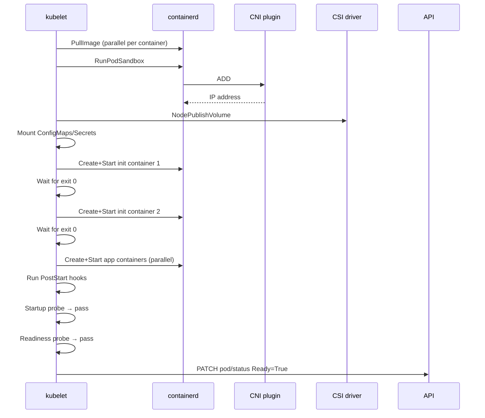

# Section 7: Kubelet Internals

The kubelet is the primary node agent. It registers the node with the apiserver, watches for pods assigned to its node, and drives the container runtime to realize those pods. The kubelet bridges Kubernetes's control plane (which deals in desired state — Pod objects) and the Linux runtime (which deals in processes, namespaces, cgroups, mounts). Every pod failure, OOM kill, probe failure, graceful shutdown problem, and node pressure situation flows through the kubelet. Understanding it in depth is essential for diagnosing the vast majority of node-level production incidents.

## Subtopic Index

- [Kubelet Architecture and Startup](#kubelet-architecture-and-startup)
- [Pod Sync Loop](#pod-sync-loop)
- [PLEG — Pod Lifecycle Event Generator](#pleg--pod-lifecycle-event-generator)
- [CRI Interaction](#cri-interaction)
- [Container Lifecycle Hooks](#container-lifecycle-hooks)
- [Liveness Probes](#liveness-probes)
- [Readiness Probes](#readiness-probes)
- [Startup Probes](#startup-probes)
- [Pod Startup Sequence](#pod-startup-sequence)
- [Graceful Termination](#graceful-termination)
- [Node Resource Management](#node-resource-management)
- [Eviction Manager](#eviction-manager)
- [Node Heartbeats and Conditions](#node-heartbeats-and-conditions)

---

## Kubelet Architecture and Startup

The kubelet is a long-running daemon on each node. It authenticates to the apiserver using a node client certificate (`system:node:<nodename>` identity, `system:nodes` group) and registers or updates the node object with the node's capacity, labels, and conditions.

On startup, the kubelet:
1. Loads its configuration (`/var/lib/kubelet/config.yaml`).
2. Registers plugins: device plugins, CNI, CSI node driver sockets.
3. Creates an informer for pods filtered to `spec.nodeName=<this-node>`, and a node informer for itself.
4. Starts the pod manager (which tracks desired pod specs from the apiserver).
5. Starts the PLEG (which tracks actual container runtime state).
6. Starts the probers, eviction manager, garbage collector, and image garbage collector.
7. Starts the main pod sync loop (`syncLoop`).

Static Pods — pod specs in `/etc/kubernetes/manifests/` — are read by a file watcher and processed alongside apiserver-sourced pods. Static pods are visible in the apiserver as "mirror pods" (read-only copies), but their actual lifecycle is managed entirely by the kubelet regardless of apiserver availability.

### Key commands
```bash
# Kubelet configuration
systemctl cat kubelet | grep ExecStart
cat /var/lib/kubelet/config.yaml

# Kubelet logs (the most important troubleshooting source for node issues)
journalctl -u kubelet --since "5m ago" | tail -100
journalctl -u kubelet | grep -E 'error|Error|PLEG|OOM' | tail -50

# Kubelet health endpoints
curl -sk https://localhost:10250/healthz     # requires client cert or --anonymous-auth
curl -sk https://localhost:10250/pods        # lists all pods kubelet knows about
```

---

## Pod Sync Loop

The kubelet's central function is `syncLoop`, which runs an infinite loop processing events from multiple sources: the pod informer (desired state from apiserver), PLEG events (actual state from runtime), the probers (probe results), and housekeeping timers.

For each pod, the kubelet calls `syncPod(pod, mirrorPod, podStatus)`. This function computes the delta between the desired spec and the actual runtime state and takes action:
- If the pod should be running but isn't started: pull images, create sandbox, create containers.
- If the pod should be terminated: send SIGTERM, wait, send SIGKILL.
- If a container has exited and the restart policy allows: restart it.
- If volumes need to be mounted/unmounted: call CSI.
- If probes have failed: trigger restarts or readiness changes.

`syncPod` is the single most important function in the kubelet source. Its full path in the source tree is `pkg/kubelet/kubelet.go`. The pod sync loop is designed to be idempotent: calling syncPod multiple times for the same pod state produces the same result.

The loop processes work items from a `podWorkers` map — one goroutine per pod. This provides per-pod concurrency: 100 pods on a node each have their own sync goroutine, so a slow pod (e.g., waiting for a volume mount) doesn't block other pods.

### Key commands
```bash
# Pod status as kubelet sees it (raw API on the node)
TOKEN=$(cat /var/run/secrets/kubernetes.io/serviceaccount/token)
curl -sk --cacert /var/run/secrets/kubernetes.io/serviceaccount/ca.crt \
  -H "Authorization: Bearer $TOKEN" \
  https://kubernetes.default.svc/api/v1/nodes/$(hostname)/proxy/pods | python3 -m json.tool | head -100

# Check kubelet's in-progress pod sync (goroutine view)
# requires pprof enabled: kubectl exec -it <kubelet-debug-pod> -- curl http://localhost:10248/debug/pprof/goroutine?debug=1
```

---

## PLEG — Pod Lifecycle Event Generator

PLEG (Pod Lifecycle Event Generator) is the kubelet's mechanism for detecting container state changes. It bridges the CRI runtime (which knows about container processes) and the kubelet's pod sync loop (which acts on those changes).

PLEG works by **polling the CRI runtime** every `relist-period` (default 1 second). On each relist, it calls `crictl ps -a` (via CRI's `ListContainers`) to get all containers. It compares the current container list with the previous relist's list. State changes (container started, stopped, OOMKilled) generate `PodLifecycleEvent` objects that are sent to a channel. The pod sync loop consumes these events and triggers pod sync for affected pods.

**PLEG unhealthy** is a critical node condition. If a PLEG relist takes longer than `pleg-relist-interval * 3 + pleg-relist-threshold` (default ~3 minutes), PLEG is marked unhealthy. This causes the kubelet to set the node condition `PLEG: not healthy` and eventually the node transitions to NotReady. 

PLEG relist can be slow when:
- The container runtime (containerd) is slow to respond (overloaded, disk I/O)
- Too many containers exist on the node (>200+ containers per node strain PLEG)
- A stuck container shim or zombie process delays CRI calls

PLEG was identified as a scalability bottleneck for large node container counts, leading to the development of **evented PLEG** (alpha in 1.26, beta in 1.27): instead of polling, the kubelet subscribes to CRI streaming events via `GetContainerEvents`. This eliminates the polling delay and the N² scaling problem, detecting container state changes within milliseconds.

### Key commands
```bash
# PLEG health in kubelet metrics
curl -sk https://localhost:10250/metrics | grep pleg
# pleg_relist_duration_seconds — time for each relist
# pleg_relist_interval_seconds — time since last successful relist (>3min = unhealthy)

# Check if PLEG is degraded (too many containers per node)
crictl ps -a | wc -l   # count all containers (running + stopped)

# PLEG events in kubelet logs
journalctl -u kubelet | grep -i pleg | tail -20
```

---

## CRI Interaction

The kubelet communicates with the container runtime through the CRI (Container Runtime Interface) gRPC API. For each pod lifecycle step, the kubelet makes specific CRI calls:

**Pod creation sequence (CRI calls):**
1. `RunPodSandbox` — creates the pod sandbox (pause container, network namespace). Returns a sandbox ID. The runtime calls the CNI plugin during this step.
2. `PullImage` — pulls each container's image if not cached (per container).
3. `CreateContainer` — prepares each container (OverlayFS snapshot, metadata). Returns a container ID.
4. `StartContainer` — starts each container via the runtime shim and runc.

**Pod termination sequence (CRI calls):**
1. `StopContainer(timeout)` — sends SIGTERM to the container, waits `timeout` seconds.
2. If timeout expires: `StopContainer(0)` — effectively SIGKILL.
3. `RemoveContainer` — cleans up the container's snapshot and metadata.
4. `StopPodSandbox` — removes the network namespace (calls CNI DEL).
5. `RemovePodSandbox` — cleans up the sandbox.

The kubelet uses a configurable timeout for each CRI call (`runtimeRequestTimeout`, default 2 minutes). If a CRI call exceeds this timeout, the kubelet logs an error and may retry or fail the operation. A stuck containerd process (e.g., a shim that can't communicate with runc) can cause CRI calls to time out and leave pods in `ContainerCreating` or `Terminating` indefinitely.

### Key commands
```bash
# Trace CRI calls in real time (use strace carefully in production)
strace -f -e trace=connect -p $(pgrep kubelet) 2>&1 | grep containerd.sock

# Direct CRI inspection with crictl (preferred for debugging)
crictl pods                          # pod sandboxes
crictl ps -a                         # all containers
crictl inspectp <sandbox-id>         # full sandbox config including netns
crictl inspect <container-id>        # full container config including cgroup path
crictl logs <container-id>           # direct container logs (not kubelet proxy)
crictl exec -it <container-id> sh    # exec into container directly (bypasses kubectl)

# Check CRI runtime version and endpoint
crictl version
crictl info
```

---

## Container Lifecycle Hooks

Container lifecycle hooks let a container execute user-defined code at specific lifecycle events.

**PostStart**: executed asynchronously immediately after the container starts, but before the container is marked Ready. It runs in parallel with the container's entrypoint. There is no guarantee about ordering — the main process may start before or after PostStart. If PostStart fails or takes too long, the container's readiness is affected. PostStart failure causes the container to be killed and restarted. Use case: registering with a service discovery system, pre-warming local caches.

**PreStop**: executed synchronously before SIGTERM is sent. The container is not killed until PreStop completes OR `terminationGracePeriodSeconds` is exhausted. If PreStop finishes before the grace period, SIGTERM is sent immediately afterward. If PreStop runs longer than the grace period, SIGKILL is sent regardless. Use case: graceful draining (sleep to allow endpoint removal propagation), deregistering from service discovery, flushing write-ahead logs.

```yaml
lifecycle:
  postStart:
    exec:
      command: ["/bin/sh", "-c", "echo started >> /var/log/startup.log"]
  preStop:
    exec:
      command: ["/bin/sh", "-c", "sleep 5"]   # wait for endpoint removal to propagate
```

The key production use of `preStop: sleep` is to work around the race between endpoint removal and SIGTERM. When a pod is deleted: (1) the EndpointSlice controller removes the pod from the service endpoint list, (2) kube-proxy propagates the change to iptables/IPVS (takes 1–5 seconds), (3) SIGTERM is sent to the pod. Without `preStop`, the pod stops accepting connections while kube-proxy is still routing traffic to it. The 5-second sleep ensures the pod accepts connections throughout the propagation window.

### Key commands
```bash
# Check if a container has lifecycle hooks defined
kubectl get pod <pod> -o jsonpath='{.spec.containers[*].lifecycle}'

# Debug PostStart failure (shows in Events as "FailedPostStartHook")
kubectl describe pod <pod> | grep -A5 "PostStart"

# Check hook exit code in container status
kubectl get pod <pod> -o jsonpath='{.status.containerStatuses[*].state}'
```

---

## Liveness Probes

A liveness probe detects when a container is running but in a broken state (deadlocked, hung, unable to make progress). When a liveness probe fails beyond its threshold, the kubelet kills and restarts the container. Kubernetes increments the container's restart count.

The kubelet runs a separate goroutine per probe per container. Probe types:
- **HTTP GET**: the kubelet (not the container) makes an HTTP GET to the container's IP and port. Success (2xx-3xx) means alive; failure (4xx-5xx or connection error) means failing.
- **TCP Socket**: attempts a TCP connection. If the socket accepts, the probe succeeds.
- **exec**: runs a command inside the container via CRI `ExecSync`. Exit code 0 = success; nonzero = failure.
- **gRPC**: calls the gRPC health checking protocol.

Probe timing parameters:
- `initialDelaySeconds`: wait this long before the first probe (allows slow-starting apps).
- `periodSeconds`: probe interval (default 10).
- `timeoutSeconds`: probe timeout (default 1 — often too short for remote backends).
- `failureThreshold`: consecutive failures before action (default 3).
- `successThreshold`: consecutive successes to consider recovered (default 1 for liveness, 1+ for readiness).

**Critical anti-pattern: liveness probe that checks external dependencies.** If your liveness probe calls a database, and the database is slow, the probe times out, the container is restarted... but the database is still slow, so the container restarts again, in a loop. The container appears healthy to external checks (it's running the HTTP server), but it's crash-looping because the database is slow. The correct pattern: liveness probes should only check the application's own internal health (is the HTTP server responsive? is the main processing goroutine alive?). Not external dependencies.

### Key commands
```bash
# Check liveness probe configuration
kubectl get pod <pod> -o jsonpath='{.spec.containers[*].livenessProbe}' | python3 -m json.tool

# Check restart count and last state (liveness probe failure shows as restart)
kubectl get pod <pod> -o jsonpath='{.status.containerStatuses[*].restartCount}'
kubectl get pod <pod> -o jsonpath='{.status.containerStatuses[*].lastState}'

# Events showing liveness probe failures
kubectl describe pod <pod> | grep -E "Liveness|probe failed"

# Check if a container is being killed by liveness (vs OOM vs exit code)
kubectl describe pod <pod> | grep -A5 "Last State:"
```

---

## Readiness Probes

A readiness probe determines whether a container is ready to serve traffic. When readiness fails, the kubelet marks the container's `Ready` condition as False, and the EndpointSlice controller removes the pod from Service endpoints. Traffic stops flowing to the pod, but the pod is not killed. When readiness recovers, the pod is re-added to endpoints.

Readiness is used for two scenarios:
1. **Startup readiness**: the application needs time to initialize (load models, warm caches, establish connections). The readiness probe keeps the pod out of rotation until initialization completes.
2. **Runtime readiness**: the application temporarily can't handle traffic (circuit breaker open, processing backlog, downstream dependency unavailable). The probe temporarily removes the pod from rotation without restarting it.

The readiness probe uses the same `exec/HTTP/TCP/gRPC` types. A critical operational pattern: use readiness to check that the application's dependencies are available and it can serve requests — but don't make it so aggressive that normal load spikes trip the probe. A readiness probe with `timeoutSeconds: 1` on an application that occasionally takes 1.2s per request will intermittently fail, causing unnecessary traffic draining.

`spec.readinessGates` extend the readiness concept: a pod is only ready when all standard container readiness AND all readiness gates are true. Readiness gates are `PodConditions` set by external controllers. AWS ALB Controller uses readiness gates to keep pods out of service until the ALB target group health check passes — a more accurate "actually receiving traffic" signal than just the container being ready.

### Key commands
```bash
# Check readiness probe and readiness gate status
kubectl get pod <pod> -o jsonpath='{.spec.readinessGates}'
kubectl get pod <pod> -o jsonpath='{.status.conditions}' | python3 -m json.tool

# See which pods in a deployment are ready vs not-ready
kubectl get pods -l app=my-app -o custom-columns=NAME:.metadata.name,READY:.status.containerStatuses[0].ready,PHASE:.status.phase

# Check EndpointSlice to confirm ready pods are in rotation
kubectl get endpointslice -l kubernetes.io/service-name=my-service \
  -o json | python3 -c "import json,sys; d=json.load(sys.stdin); [print(e['addresses'][0], 'ready:', e['conditions']['ready']) for es in d['items'] for e in es['endpoints']]"
```

---

## Startup Probes

Startup probes solve the problem of slow-starting applications that would fail liveness probes during initialization. Without a startup probe, you must set `initialDelaySeconds` large enough to cover the worst-case startup time — but this means liveness probes are delayed for that long after every restart, even when the app starts quickly.

With a startup probe: the kubelet disables liveness and readiness probes until the startup probe succeeds. The startup probe has its own `failureThreshold` and `periodSeconds`. `failureThreshold * periodSeconds` defines the maximum allowed startup time. Once startup succeeds, the startup probe runs no more, and liveness/readiness probes begin.

```yaml
startupProbe:
  httpGet:
    path: /healthz
    port: 8080
  failureThreshold: 30    # 30 * 10s = 300s maximum startup time
  periodSeconds: 10
livenessProbe:
  httpGet:
    path: /healthz
    port: 8080
  periodSeconds: 10
  failureThreshold: 3     # only 30s tolerance after startup succeeds
```

This pattern allows a Java application to take up to 5 minutes to start (JVM initialization, Spring context loading) while maintaining tight liveness checks (30 seconds) once running.

### Key commands
```bash
# Check startup probe configuration and status
kubectl get pod <pod> -o jsonpath='{.spec.containers[*].startupProbe}' | python3 -m json.tool

# Startup probe failure manifests as pod stuck in ContainerCreating or Starting
kubectl describe pod <pod> | grep "Startup probe"
kubectl get events --field-selector involvedObject.name=<pod> | grep startup
```

---

## Pod Startup Sequence

The complete kubelet pod startup sequence from the moment the scheduler writes the binding:

1. **Pod added to kubelet's pod manager**: the pod informer receives MODIFIED event (spec.nodeName set), kubelet enqueues a pod sync.

2. **Admit pod**: kubelet checks if the pod fits (topology manager, resource manager, cgroup capacity). A pod that exceeds node resources is rejected locally with an event.

3. **Image pull**: kubelet calls `ImageService.PullImage` for each container image. Pull happens in parallel. `imagePullPolicy: Always` pulls every time; `IfNotPresent` skips if cached.

4. **Create pod sandbox** (`RunPodSandbox`): kubelet calls the CRI, which creates the network namespace and calls the CNI plugin to assign an IP and configure routing.

5. **Prepare volumes**: kubelet calls CSI `NodePublishVolume` for PVCs, and mounts ConfigMaps, Secrets, projected tokens into the pod's volume directories.

6. **Start init containers** (sequential): each init container is created and started. The kubelet waits for each to exit with code 0 before starting the next. Failed init containers restart with backoff.

7. **Start sidecar init containers** (k8s 1.29+): native sidecar containers with `restartPolicy: Always` in `initContainers` start alongside regular init containers but stay running after init completes.

8. **Start regular containers** (parallel): all regular containers are created and started simultaneously.

9. **PostStart hooks** (async): if defined, run immediately after each container starts.

10. **Startup probes start**: if defined, probes begin. Liveness and readiness are blocked.

11. **Startup probe succeeds** → **Readiness probes start**: once startup succeeds, readiness begins. Container is not added to Service endpoints until readiness passes.

12. **Readiness succeeds** → **Pod marked Ready**: EndpointSlice controller adds the pod to Service endpoints.



---

## Graceful Termination

Pod termination is initiated when the pod gets a `deletionTimestamp` (from a user delete, rolling update, node drain, or eviction). The kubelet follows this sequence:

1. **PreStop hook runs** (if defined): the kubelet executes the PreStop command inside the container. The container is not sent SIGTERM until PreStop completes OR the grace period expires.

2. **SIGTERM sent**: after PreStop completes, the kubelet sends SIGTERM to PID 1 of each container.

3. **Grace period countdown**: `terminationGracePeriodSeconds` (default 30) starts when the pod was deleted (not when SIGTERM was sent). If PreStop runs for 10 seconds, only 20 seconds remain for the container to exit after SIGTERM.

4. **Containers exit**: well-behaved containers catch SIGTERM and exit cleanly (flush buffers, close connections, finish in-flight requests).

5. **SIGKILL**: if any container has not exited when `terminationGracePeriodSeconds` expires, the kubelet sends SIGKILL. This is unclean — no further signals, no cleanup.

6. **Sandbox removed**: the kubelet calls `StopPodSandbox` and `RemovePodSandbox`, which calls CNI DEL to deconfigure the network namespace.

7. **Volumes unmounted**: kubelet calls `NodeUnpublishVolume` for each PVC.

8. **Pod removed from apiserver**: the kubelet updates pod status to Succeeded/Failed, and the apiserver's garbage collector removes the pod object.

The most common graceful termination issue: the container catches SIGTERM but has in-flight requests that take longer than the grace period to complete. Solution: increase `terminationGracePeriodSeconds` to be longer than the longest expected request processing time. For HTTP servers, a common pattern is to stop accepting new connections on SIGTERM, drain the backlog of in-flight requests, then exit cleanly.

### Key commands
```bash
# Check a pod's grace period
kubectl get pod <pod> -o jsonpath='{.spec.terminationGracePeriodSeconds}'

# Force-delete a pod (immediately removes object without waiting for graceful shutdown)
# Use ONLY when the node is gone and the pod is stuck Terminating
kubectl delete pod <pod> --force --grace-period=0

# Watch termination in real time
kubectl delete pod <pod> & kubectl get pod <pod> -w

# Check if a container exited cleanly (0) or was SIGKILLed (137)
kubectl get pod <pod> -o jsonpath='{.status.containerStatuses[*].state.terminated.exitCode}'
# 0 = clean exit, 137 = SIGKILL (OOM or grace period exceeded)
```

---

## Node Resource Management

The kubelet manages node resources to ensure that Kubernetes workloads don't starve system processes and that the scheduler has accurate information about available resources.

`capacity` (what the node has) and `allocatable` (what Kubernetes can use) differ:
```
allocatable = capacity - system-reserved - kube-reserved - eviction-threshold
```

- `--system-reserved`: CPU/memory reserved for OS processes (kernel, systemd, other daemons).
- `--kube-reserved`: CPU/memory reserved for Kubernetes system components (kubelet, containerd, kube-proxy).
- `--eviction-threshold` (hard): memory/disk held back to trigger eviction before full exhaustion.

On a 4-CPU, 16GiB node with typical reservations:
```
capacity:      cpu=4, memory=16Gi
kube-reserved: cpu=100m, memory=1Gi
system-reserved: cpu=100m, memory=0.5Gi
eviction-hard: memory=500Mi
allocatable:   cpu=3.8, memory=14Gi
```

The kubelet enforces CPU and memory via cgroups. The pod cgroup hierarchy: `/kubepods/guaranteed/pod<uid>/container<id>/` (or `burstable/`, `besteffort/`). CPU requests become cgroup shares; CPU limits become CFS quotas. Memory limits become cgroup memory limits.

Extended resources (GPUs, FPGAs, NICs) are advertised via Device Plugin API. Device plugins register with the kubelet via a gRPC socket under `/var/lib/kubelet/device-plugins/`. The kubelet allocates device resources to pods requesting them.

### Key commands
```bash
# Check node capacity vs allocatable
kubectl describe node <node> | grep -A10 "Capacity:\|Allocatable:"

# Check kubelet resource reservations
systemctl cat kubelet | grep -E 'kube-reserved|system-reserved|eviction'
# or
cat /var/lib/kubelet/config.yaml | grep -E 'Reserved|eviction'

# Current resource usage vs requests on a node
kubectl describe node <node> | grep -A20 "Allocated resources:"

# Check device plugins registered with kubelet
ls /var/lib/kubelet/device-plugins/
kubectl get node <node> -o jsonpath='{.status.allocatable}' | python3 -m json.tool
```

---

## Eviction Manager

The eviction manager monitors node resource signals and evicts pods when the node is under pressure. It is the mechanism that prevents nodes from crashing due to memory or disk exhaustion.

**Eviction signals** monitored: `memory.available`, `nodefs.available`, `nodefs.inodesFree`, `imagefs.available`, `pid.available`. Each signal can have a soft or hard threshold.

**Soft eviction**: when a signal crosses a soft threshold, the kubelet waits for `eviction-soft-grace-period` (default 90 seconds for memory) before evicting. This tolerates transient spikes. If the signal recovers, no eviction occurs.

**Hard eviction**: when a signal crosses a hard threshold, the kubelet immediately evicts pods. Hard thresholds: `memory.available < 100Mi`, `nodefs.available < 10%`, `nodefs.inodesFree < 5%`.

**Eviction order** (from lowest to highest protection):
1. BestEffort pods (no requests/limits) — evicted first.
2. Burstable pods (some requests/limits) — ordered by how far above their request their usage is.
3. Guaranteed pods (requests == limits) — evicted last, only when no other option.

When the eviction manager evicts a pod, it deletes the pod object. The workload controller (Deployment, DaemonSet, etc.) recreates it. If the node remains under pressure, the new pod may also be evicted, creating a cycle. This is why resource reservations and limits are critical: proper limits prevent any single pod from exhausting the node.

### Key commands
```bash
# Check node pressure conditions
kubectl describe node <node> | grep -E "MemoryPressure|DiskPressure|PIDPressure"

# Check eviction thresholds configured on kubelet
cat /var/lib/kubelet/config.yaml | grep -A10 eviction

# See eviction events
kubectl get events -A --field-selector reason=Evicted --sort-by=.lastTimestamp | tail -20

# Current memory usage on node
kubectl get node <node> -o jsonpath='{.status.conditions[?(@.type=="MemoryPressure")].status}'

# Node-level memory stats
ssh <node> "free -h && cat /proc/meminfo | grep -E '^MemAvailable|^MemTotal'"
```

---

## Node Heartbeats and Conditions

The kubelet signals node health through two mechanisms: **Node Lease renewal** (lightweight, frequent) and **Node status updates** (heavier, less frequent).

**Node Lease**: the kubelet creates a `Lease` object in the `kube-node-lease` namespace and updates its `renewTime` every `nodeStatusUpdateFrequency` (default 10 seconds). The Lease update is a small API call — just a patch on a tiny object. The node lifecycle controller considers a node unreachable if the Lease hasn't been renewed within `nodeLeaseDurationSeconds` (default 40 seconds). This lightweight heartbeat replaced the heavier full node status update as the primary availability signal in Kubernetes 1.13.

**Node Status Update**: the kubelet patches the full Node object's `status` (conditions, capacity, allocated resources, addresses) every `nodeStatusReportFrequency` (default 5 minutes) or when conditions change. This is a larger write.

**Node Conditions** written by the kubelet:
- `Ready`: True if the kubelet is running properly, network plugin is ready, and no disk pressure exists.
- `MemoryPressure`: True if memory.available is below the eviction threshold.
- `DiskPressure`: True if nodefs or imagefs.available is below threshold.
- `PIDPressure`: True if pid.available is below threshold.
- `NetworkUnavailable`: True if the network plugin reports the node network is not properly configured (usually set by CNI DaemonSet, not kubelet).

### Key commands
```bash
# Check node lease (freshness = time since last kubelet heartbeat)
kubectl -n kube-node-lease get lease <node-name> -o yaml | grep renewTime

# Check all node conditions
kubectl get node <node> -o jsonpath='{.status.conditions}' | python3 -m json.tool

# Watch condition changes
kubectl get node <node> -w

# Check what kubelet reports as its own status
curl -sk https://localhost:10250/healthz
curl -sk https://localhost:10250/stats/summary | python3 -m json.tool | head -40
```

---

## Interview Questions

### Conceptual / Internals (8 questions)

**1. Explain how PLEG works and what happens when it becomes unhealthy.**

PLEG (Pod Lifecycle Event Generator) polls the CRI runtime every 1 second via `ListContainers`. It compares the current container list with the previous list and generates events for state changes (container started, stopped, OOMKilled). These events are fed to the pod sync loop. PLEG unhealthy means the relist took longer than the health threshold (~3 minutes). This usually happens when the container runtime is under load (too many containers, disk I/O saturation), causing CRI calls to be slow. When PLEG is unhealthy, the kubelet stops processing runtime state changes — container restarts, OOM kills, and state transitions are not processed. The kubelet logs "PLEG is not healthy" and eventually the node condition `Ready: False` is set. Diagnosis: check `pleg_relist_duration_seconds` metrics. Fix: reduce container count per node, fix disk I/O, restart containerd.

**2. What is the exact sequence of events between `kubectl delete pod` and the container process receiving SIGTERM?**

`kubectl delete pod` → apiserver sets `metadata.deletionTimestamp` on the pod object in etcd → apiserver emits a MODIFIED watch event → kubelet's pod informer receives the event and enqueues a pod sync → kubelet's pod worker runs `syncPod` and detects `deletionTimestamp` → kubelet runs the PreStop hook (if defined) synchronously → after PreStop completes OR grace period is running out, kubelet calls `CRI StopContainer(pod.terminationGracePeriodSeconds)` → containerd calls the shim via ttrpc → shim calls `runc kill <container-id> SIGTERM` → kernel delivers SIGTERM to the container's PID 1.

**3. Why does the kubelet's pod sync loop use one goroutine per pod rather than one shared goroutine?**

A single shared goroutine would mean a slow pod (e.g., a container waiting for a large image pull, a slow CSI volume mount, or a long PreStop hook) blocks all other pod syncs. Per-pod goroutines allow 100 pods to make progress concurrently. The goroutines synchronize through the shared work queue and the kubelet's internal state, but each pod's actual CRI/CNI/CSI operations run in isolation. This is essential for nodes with many pods: a node running 100 pods should not have all pod restarts/updates delayed because one pod's volume took 60 seconds to mount.

**4. Explain the race between endpoint removal and SIGTERM in pod termination and how to properly mitigate it.**

When a pod is deleted: the kubelet sends SIGTERM to the container and simultaneously (or slightly after) the EndpointSlice controller removes the pod from the service's EndpointSlice. kube-proxy on all nodes must then propagate this change to iptables/IPVS rules. This takes 1–5 seconds. If the pod stops listening (exits cleanly after receiving SIGTERM) before kube-proxy finishes updating, new connection attempts from clients routed to the pod's IP get RST. The mitigation: `preStop: exec: command: ["sleep", "5"]` (or more) delays the SIGTERM delivery while the pod continues accepting connections. The pod processes in-flight requests, and by the time SIGTERM arrives, the iptables updates have propagated. The sleep duration should be at least as long as the kube-proxy propagation time, which depends on cluster size.

**5. How does the kubelet prevent overcommitting node resources when both Guaranteed and Burstable pods exist?**

The kubelet's admission is request-based, not usage-based. It computes the sum of all assigned pods' `resources.requests` and checks against `node.allocatable`. If the sum would exceed allocatable, the pod admission is rejected. This is conservative: a pod requesting 2 CPUs "reserves" 2 CPUs from the allocatable budget even if it only uses 0.1 CPUs. The qos-reserved cgroup structure enforces this at the kernel level. Within the pod's limits, burst usage is allowed (up to `resources.limits`). The eviction manager independently monitors actual usage and evicts pods when real pressure emerges — but eviction is a backstop, not the primary resource control. The cgroup CPU throttle and OOM killer enforce limits per-container without kubelet involvement.

**6. Explain how a `readinessGate` works and give a use case where it provides better traffic control than a standard readiness probe.**

A readiness gate adds a custom condition to the pod's readiness evaluation. The pod is only Ready when all built-in container readiness probes pass AND all specified `PodConditions` (the gates) are True. External controllers can set these conditions on the pod. Use case: AWS Load Balancer Controller (ALBC). When a pod passes its container readiness probe, the pod is `Ready` in Kubernetes terms and gets added to the ClusterIP Service endpoints. But the ALB's target group health check may not have passed yet — the ALB might need 15–30 seconds to verify the target. With a readiness gate `target-health.alb.controller/alb-1: Ready`, the ALBC controller only sets the gate True once the ALB target group shows the pod as healthy. Until then, the pod is not Ready and receives no traffic through the ALB — even if it passes its own probe.

**7. What is the difference between hard and soft eviction, and when would you use each?**

Soft eviction applies a grace period before evicting: it waits `eviction-soft-grace-period` seconds for the pressure to resolve before acting. This tolerates transient memory spikes (e.g., a load burst that completes in 30 seconds). Hard eviction acts immediately, with no grace period, when the threshold is crossed. Use hard thresholds for signals that indicate imminent node failure: `memory.available < 100Mi` (nearly OOM — must act now) and `nodefs.available < 5%` (disk nearly full — further writes will fail). Use soft thresholds for signals that may be transient: `memory.available < 500Mi` (approaching pressure, but still 500Mi free — wait 90 seconds to see if it resolves). Setting hard thresholds too conservatively wastes node capacity; setting them too aggressively causes unnecessary pod disruption.

**8. A node shows `NetworkUnavailable: True`. What caused this, and how is it fixed?**

`NetworkUnavailable: True` is typically set by the CNI plugin's DaemonSet, not by the kubelet directly (some CNI plugins set it; kubelet also sets it if the network plugin fails to configure the node). Common causes: (1) CNI DaemonSet pod on the node is not running or is crash-looping — `kubectl get pod -n kube-system -l app=calico-node --field-selector=spec.nodeName=<node>`. (2) CNI plugin failed during node initialization — check CNI pod logs for configuration errors, missing CIDR allocation, or network plugin conflicts. (3) Network configuration (CIDR, routes) was corrupted on the node — check route tables. Fix: restart the CNI DaemonSet pod on that node. If the CNI plugin itself is broken, diagnose from the CNI pod logs. Until `NetworkUnavailable` is resolved, new pods on that node cannot receive CNI-allocated IPs and stay in `ContainerCreating`.

---

### Scenario / Troubleshooting (6 questions)

**9. A pod is stuck in `Terminating` for 45 minutes. What are the possible causes and how do you diagnose?**

A pod stuck in Terminating has a `deletionTimestamp` set but the kubelet hasn't fully terminated it. Causes: (1) **PreStop hook not completing**: if a preStop hook hangs indefinitely, the pod waits until `terminationGracePeriodSeconds + 30s`. Check `kubectl describe pod` for "Executing PreStop hook". (2) **Container not responding to SIGTERM**: PID 1 ignores SIGTERM; SIGKILL won't happen until grace period expires. Check if `terminationGracePeriodSeconds` is very long or if the container is in an uninterruptible sleep state (D state in `ps`). (3) **Volume unmount stuck**: CSI NodeUnpublishVolume is hanging (e.g., an NFS mount frozen waiting for a response). Check `kubectl describe pod` for "stopping container" events. Check node kubelet logs for CSI errors. (4) **Kubelet is unable to communicate with the apiserver** to acknowledge deletion. (5) **Node is gone**: kubelet can't clean up. Force-delete: `kubectl delete pod <pod> --force --grace-period=0` removes the object from etcd; the node will clean up locally when it reconnects.

**10. `kubectl logs <pod>` returns "Error from server: Get ... dial tcp: connection refused." How does kubectl get logs, and what could cause this?**

`kubectl logs` works by calling `GET /api/v1/namespaces/<ns>/pods/<name>/log` on the apiserver. The apiserver proxies this request to the kubelet's HTTPS port (10250) on the node where the pod runs. The kubelet reads the container log file from `/var/log/pods/<ns>_<pod>_<uid>/<container>/<restart-count>.log` and streams it. "Connection refused" on the kubelet port means: (1) the kubelet's HTTPS server is not running (kubelet is down), (2) a network policy or firewall blocks apiserver → node port 10250, or (3) the kubelet's TLS certificate is expired (causes TLS error, not connection refused). Fix: check kubelet status on the node, check network path from control plane to nodes on port 10250. An alternative that bypasses the apiserver proxy: `crictl logs <container-id>` directly on the node.

**11. A node's `allocatable.memory` is 14 GiB, but `kubectl top node` shows only 4 GiB memory usage and pods are being evicted. Why?**

`kubectl top node` shows actual memory usage, but eviction is based on `memory.available` — the kubelet checks the node's total usable memory (which includes OS cache and buffers) against its threshold. On Linux, `memory.available` from `/proc/meminfo` includes `MemFree + Buffers + Cached` (ReclaimablePages). If the OS has used 10 GiB for page cache (buffered file I/O from applications), `MemFree` is low even though reclaimable cache exists. In cgroups v1, `memory.available` calculation may undercount reclaimable memory, triggering eviction. In cgroups v2, this is improved. The fix: tune eviction thresholds appropriately for your workload's memory patterns, or check if an application is writing large files to disk causing OS page cache growth.

**12. An init container finishes successfully (exit code 0) but the main container never starts. What happened?**

Check `kubectl describe pod <pod>` Events — if the init container succeeded but the main container hasn't started, look for: (1) a readiness gate on the init phase — unlikely but possible with custom controllers. (2) a native sidecar init container with `restartPolicy: Always` that is crashing — it must be Ready before the main container starts (k8s 1.29+ behavior). (3) The pod spec has multiple init containers, and a subsequent init container (after the one you checked) is failing. `kubectl get pod <pod> -o yaml | grep -A20 initContainerStatuses`. (4) A PostStart hook on the init container (rare) is hanging. (5) The scheduler re-scheduled the pod to a different node during init (shouldn't happen, but check `spec.nodeName` vs `Events: Assigned`).

**13. A Java application is OOMKilled despite setting `-Xmx4g`. The memory limit is `6Gi`. Explain the memory consumption and find the root cause.**

`-Xmx4g` limits the heap. Total JVM memory usage = Heap (max 4g) + Metaspace (often 0.5–1g for large apps) + Code Cache (256m–512m) + Threads (each ~1m stack, 500 threads = 500m) + Direct Memory (ByteBuffers, off-heap) + JVM internal overhead (~100m). For a large app: 4g + 1g + 512m + 500m + 1g (direct) = ~7g total. Against a 6g limit: OOMKilled. Diagnosis: `kubectl exec <pod> -- jcmd <pid> VM.native_memory` gives the breakdown. Fix: increase the limit to 8–9g OR reduce off-heap allocations. In containers, use `-XX:+UseContainerSupport` (Java 10+, backported to 8u191) so the JVM reads its limit from the cgroup, not `/proc/meminfo`, and use `-XX:MaxRAMPercentage=75` instead of fixed `-Xmx` to leave 25% for non-heap.

**14. A node enters DiskPressure and begins evicting pods, but `df -h /` shows 30% used. What signals is the kubelet monitoring?**

The kubelet monitors multiple disk signals: (1) `nodefs.available` — the node's root filesystem (`/var/lib/kubelet`) usage. (2) `nodefs.inodesFree` — inode count free on the root filesystem. (3) `imagefs.available` — the container image filesystem (`/var/lib/containerd`) usage. These may be on different filesystems. The kubelet checks inodes separately from disk space — inode exhaustion triggers DiskPressure even at 30% disk space usage. Diagnosis: `df -i /var/lib/kubelet` and `df -i /var/lib/containerd`. Additionally, check `/var/log/pods/` for large log files from crashing containers, and `/tmp/` for application-generated temp data in container writable layers.

---

### FAANG-Level Deep Dive (6 questions)

**15. Describe PLEG's relist algorithm in detail. How does it detect container state changes, and why was it a scalability bottleneck leading to evented PLEG?**

PLEG's `relist()` function calls `ListContainers(all=true)` on the runtime and gets every container's state. It maintains a `podRecords` cache of the last observed container states. For each container, it compares current state to the previous state. If a container transitioned from Running→Exited, it generates a `ContainerDied` event. If Exited→Running, it generates `ContainerStarted`. These events are written to the `eventChannel`, which the kubelet's main loop consumes. The bottleneck: `ListContainers` calls the runtime which iterates over every container's filesystem and process state. At 200 containers per node, this takes 500ms+ on a busy node. The 1-second relist interval means each relist may overlap with the previous one, creating queuing. At 300+ containers, relists consistently exceed the 3-minute health threshold. Evented PLEG (KEP-3386) subscribes to streaming container events from the runtime instead of polling, eliminating the N-scale bottleneck. Container state changes are detected within milliseconds regardless of container count.

**16. How does the kubelet enforce CPU limits at the kernel level, and why can a CPU limit of 100m cause significant latency in a latency-sensitive application?**

CPU limits use the CFS (Completely Fair Scheduler) bandwidth controller in Linux cgroups. The kubelet sets `cpu.cfs_quota_us` (or `cpu.max` in v2) proportionally: `quota = limits.cpu_millicores / 1000 * period`. With the default period of 100ms: 100m limit = 10ms quota per 100ms period. The container can use 10ms of CPU every 100ms, then is throttled (dequeued from all run queues) for the remaining 90ms. For a request-response workload processing 1000 req/s: each request on average gets 0.01ms of CPU but must wait up to 90ms if the quota is exhausted. The p99 latency is dominated by the throttle wait, not the actual computation. This is why "CPU throttling" is a common cause of high latency with low CPU utilization. Detection: `container_cpu_cfs_throttled_seconds_total` metric. Fix: increase CPU limit, or reduce the CFS period (`cpuCFSQuotaPeriod` in kubelet config) from 100ms to 10ms — smaller periods mean smaller worst-case throttle waits but more scheduling overhead.

**17. Walk through the kubelet source code path from receiving a pod MODIFIED event (deletionTimestamp set) to calling CRI StopContainer.**

The pod informer's UpdateFunc calls `kl.podWorkers.UpdatePod(options)`. `podWorkers` has a goroutine per pod; it sends an `UpdatePodOptions{UpdateType: kubetypes.SyncPodKill}` to the pod's channel. The goroutine calls `kl.syncPod(ctx, syncType, pod, mirrorPod, podStatus)` (in `pkg/kubelet/kubelet.go`). `syncPod` calls `kl.killPod(pod, runningPod, statusFn)` (in `pkg/kubelet/pod_workers.go`). `killPod` calls `kl.containerRuntime.KillPod(pod, runningPod, gracePeriodOverride)` (in `pkg/kubelet/kuberuntime/`). This calls `kl.runner.RunInContainer` to execute the PreStop hook, then calls `kl.stopContainer(container, gracePeriod)`. `stopContainer` calls `kl.runtimeService.StopContainer(containerID, timeout)` (gRPC: `RuntimeService.StopContainer`). This gRPC call reaches containerd's CRI plugin, which tells the shim to stop the container.

**18. How does the kubelet's topology manager work to ensure that containers with NUMA-sensitive resources (CPU pinning + GPU on the same NUMA node) are co-located correctly?**

The Topology Manager (`pkg/kubelet/cm/topologymanager/`) runs a Hint Provider pipeline. Resource managers (CPU Manager, Memory Manager, Device Plugin Manager) each implement `GetTopologyHints()`. CPU Manager provides NUMA affinity hints for the requested CPU cores. Device Plugin provides NUMA affinity hints for the requested GPU (from device plugin topology data). Memory Manager provides hints for huge pages. The Topology Manager collects hints from all providers and computes the "best fit" NUMA node (or set of nodes) that satisfies all resource requirements. If a single NUMA node can provide all requested resources, the pod is admitted with that affinity. If not, the admission decision depends on the `topologyManagerPolicy`: `restricted` (must fit on single NUMA node), `single-numa-node` (strict single NUMA), `best-effort` (try but don't reject), `none` (no topology management). After admission, each manager allocates its resources from the agreed NUMA node.

**19. Describe the kubelet's image GC algorithm and when it runs.**

Image GC runs periodically (default every 5 minutes) when invoked by the GarbageCollect goroutine. It calculates current image filesystem usage: `imagesFsUsage = used / total`. If usage > `imageGCHighThresholdPercent` (default 85%), it triggers cleanup until usage < `imageGCLowThresholdPercent` (default 80%). The algorithm: list all images from the runtime with their last-use time (from a local record of when each image was last pulled or used to create a container). Sort by last-use time (least-recently-used first). Delete images from oldest to newest until disk usage is below the low threshold. Images in use by running containers are never deleted. The minimum-age-for-GC parameter (`imageMinimumGCAge`, default 2 minutes) prevents newly pulled images from being immediately GC'd. This algorithm is why a pull-heavy cluster (CI environment, frequent deployments) can accumulate disk pressure: high pull rate combined with low GC headroom causes rapid cycling.

**20. How would you design a custom probe type that checks a gRPC streaming endpoint rather than a unary health call?**

Kubernetes' built-in gRPC probe calls the gRPC Health Checking protocol (`grpc.health.v1.Health/Check` — a unary call). For a streaming endpoint health check, you would: (1) Use an `exec` probe with a script that opens a bidirectional gRPC stream, sends a test request, reads one response, and exits 0 on success / nonzero on failure. This requires `grpcurl` or a custom binary compiled into the image. (2) Alternatively, build a sidecar healthcheck container that continuously tests the streaming endpoint and exposes its result as an HTTP health endpoint — the main container uses an HTTP probe against the sidecar. (3) Use a ValidatingAdmissionWebhook to intercept pods using your specific service and inject the health-check sidecar automatically. The sidecar approach has the advantage of decoupling the health check complexity from the probe timeout constraints — the sidecar can maintain a long-lived stream and expose its health continuously.

---

## Hands-On Labs

### Lab 1: Observe PLEG and Node Conditions

**Objective:** Understand PLEG health and node condition reporting.

**Tasks:**
1. Check PLEG relist duration: `kubectl get --raw='/metrics' | grep pleg_relist_duration`.
2. Create 50 pods on one node: observe PLEG relist duration increase.
3. Simulate a node disk pressure by filling `/tmp` beyond the eviction threshold. Observe `DiskPressure` condition. Watch evictions begin.
4. Clear the disk pressure. Observe the condition recover and evicted pods reschedule.

### Lab 2: Probe Behavior

**Objective:** Experience liveness, readiness, and startup probe effects.

**Tasks:**
1. Deploy a pod with a readiness probe (`/readyz`) that starts failing after 30 seconds. Observe the pod disappear from service endpoints.
2. Deploy a pod with a liveness probe with `failureThreshold: 2, periodSeconds: 5`. Kill the health endpoint. Watch the pod restart after 10 seconds.
3. Deploy a slow-starting app with only a liveness probe (`initialDelaySeconds: 60`) vs one with a startup probe (`failureThreshold: 60, periodSeconds: 5`). Compare behavior when the app starts in 45s.

### Lab 3: Graceful Shutdown Demonstration

**Objective:** Understand the full termination sequence.

**Tasks:**
1. Deploy a pod with a `preStop: sleep 5` hook and `terminationGracePeriodSeconds: 30`.
2. Delete the pod. In another terminal, watch `kubectl get pod -w` — observe it stays Terminating for ~5 seconds.
3. Deploy a pod with an application that ignores SIGTERM (a shell script that doesn't trap signals). Delete it. Observe it stays until the full grace period expires.
4. Force-delete a pod: `kubectl delete pod <pod> --force --grace-period=0`. Observe immediate API object removal (but the container may still run briefly on the node).

---

## Production Incidents

### Incident 1: PLEG Unhealthy Causes Mass NotReady Node Cascade

**Symptom:** At 09:15, 5 nodes simultaneously enter NotReady. `kubectl describe node` shows "PLEG is not healthy." No hardware failures, no network issues. `kubectl top nodes` shows CPU and memory normal.

**Investigation:** On affected nodes: `journalctl -u kubelet | grep pleg` shows "relist took 4m23s". `crictl ps -a | wc -l` shows 520 containers per node (including stopped containers not cleaned up from a previous batch job). Each `ListContainers` call takes 4.3 seconds. With 1-second relist interval and 4.3-second calls, the queue backed up and the 3-minute health threshold was exceeded.

**Root cause:** High container count (520 per node) due to batch job pods not being cleaned up after completion (Job TTL not set). Each PLEG relist times out because containerd's `ListContainers` scans all container metadata including stopped containers.

**Recovery:** Force delete stuck Job pods: `kubectl delete pod -l job-name=batch --force --grace-period=0`. Container count drops below 100 per node. PLEG recovers, nodes return to Ready.

**Prevention:** Set `ttlSecondsAfterFinished` on all Jobs. Configure kubelet `--maximum-dead-containers` and `--maximum-dead-containers-per-container` to limit stopped container accumulation. Alert on `pleg_relist_duration_seconds` > 1s. Target < 100 containers per node for PLEG health.

### Incident 2: Graceful Shutdown Race Causes Checkout Errors During Deploy

**Symptom:** During each Deployment rollout of the checkout service, for approximately 10 seconds, 0.3% of checkout requests fail with "connection reset by peer" errors on the client. Post-mortem reveals these failures correlate exactly with pod termination events.

**Investigation:** Packet captures on affected connections show RST packets from the pod IP after the pod receives SIGTERM. The checkout service's HTTP server catches SIGTERM via signal.Notify and calls `server.Shutdown(ctx)` with a 5-second context. During shutdown, the server stops accepting new connections. `kubectl logs` show requests arriving and being RST-ted in the 2–4 second window after deletion, while kube-proxy is still routing to the pod's IP.

**Root cause:** The 5-second graceful shutdown is insufficient. kube-proxy propagates EndpointSlice changes in ~3 seconds, but the application begins refusing new connections immediately on SIGTERM while kube-proxy still routes traffic to it for 3 more seconds.

**Recovery/Prevention:** Add `preStop: exec: command: ["sleep", "8"]` to delay SIGTERM by 8 seconds after the pod enters Terminating. Increase `terminationGracePeriodSeconds` to 30+8+5 = 43 seconds to accommodate the full sequence. After deploy, checkout error rate during rollouts drops to 0%.
