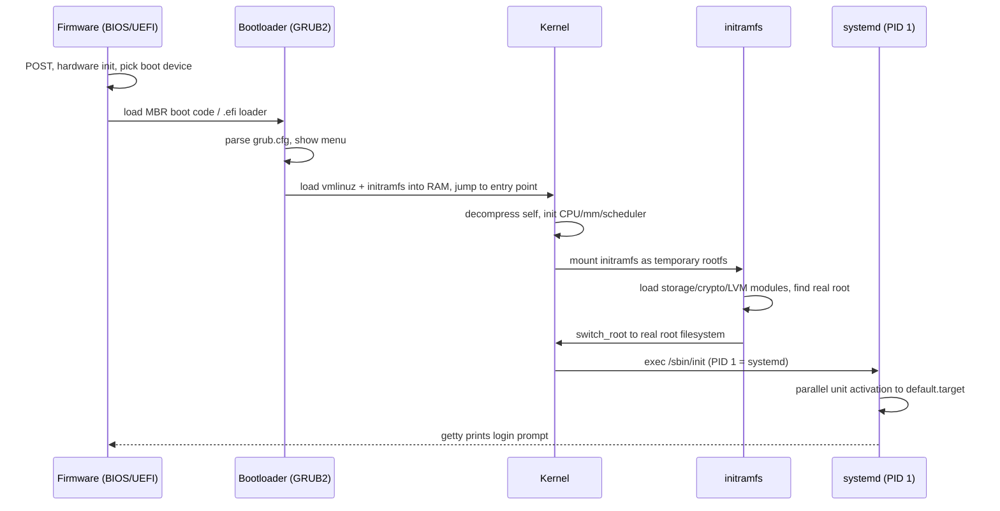

# Section 1: Linux Fundamentals & History

This section builds the foundation every later section depends on: where Linux came from, how a
kernel differs from a distribution, how the system architecture is organized, and — critically —
exactly what happens between pressing the power button and getting a login prompt. Interviewers use
this ground truth to test whether you actually understand the machine or just memorize commands.
Everything here is phrased so you can trace a real boot, not just recite definitions.

## Subtopic Index
- [History of UNIX and Linux](#history-of-unix-and-linux)
- [GNU/Linux Philosophy](#gnulinux-philosophy)
- [Kernel vs Distribution](#kernel-vs-distribution)
- [Monolithic vs Microkernel Design](#monolithic-vs-microkernel-design)
- [Linux Kernel Architecture Overview](#linux-kernel-architecture-overview)
- [Boot Process Overview (firmware to userspace)](#boot-process-overview-firmware-to-userspace)
- [BIOS/UEFI](#biosuefi)
- [Bootloaders (GRUB2)](#bootloaders-grub2)
- [initramfs / initrd](#initramfs--initrd)
- [Kernel Initialization](#kernel-initialization)
- [init systems (SysVinit, Upstart, systemd)](#init-systems-sysvinit-upstart-systemd)
- [Runlevels vs systemd Targets](#runlevels-vs-systemd-targets)
- [Linux Filesystem Hierarchy Standard (FHS)](#linux-filesystem-hierarchy-standard-fhs)
- [Standard Streams (stdin/stdout/stderr)](#standard-streams-stdinstdoutstderr)
- [Shells (bash, zsh, sh) and Shell Internals](#shells-bash-zsh-sh-and-shell-internals)
- [Environment Variables and Shell Initialization Files](#environment-variables-and-shell-initialization-files)

---

## History of UNIX and Linux

UNIX was born in 1969 at Bell Labs when Ken Thompson and Dennis Ritchie, reacting against the
complexity of the failed Multics project, built a small, portable, multi-user, time-sharing
operating system. Its founding ideas — everything is a file, small composable programs connected
by pipes, a hierarchical filesystem, and a clean process model with `fork`/`exec` — are still the
mental model you use today when you write `cat file | grep pattern | sort`. Ritchie's invention of C
alongside UNIX made the OS the first to be rewritten in a high-level language, which is why UNIX
(and Linux) could be ported to new hardware architectures instead of being locked to one CPU. This
matters in an interview because when you're asked "why does Linux have this weird backwards-looking
design decision," half the time the answer is "because it inherited it from UNIX and changing it
would break 50 years of software." AT&T commercialized UNIX and its licensing became restrictive,
which triggered a split: BSD (Berkeley Software Distribution) forked from UNIX source and became the
free/open lineage that produced FreeBSD, OpenBSD, and macOS's Darwin kernel; commercial UNIX vendors
(HP-UX, AIX, Solaris) forked their own proprietary lines. Richard Stallman's GNU Project, started in
1983, aimed to build an entirely free UNIX-compatible operating system (compiler, shell, coreutils,
libc) but never finished its own kernel (GNU Hurd stalled on microkernel design difficulties). Linus
Torvalds, a Finnish student, filled that missing piece in 1991 by writing a minimal, Intel
80386-specific kernel as a hobby project and posted it to Usenet ("just a hobby, won't be big and
professional like gnu") — that kernel, combined with the already-mature GNU userland, became what we
call Linux. This is why the strict name is "GNU/Linux": the kernel is Linux, nearly everything
around it historically came from GNU. Understanding this history explains modern Linux's licensing
(GPLv2 for the kernel, a mix of GPL/LGPL/MIT for userland), its culture of mailing-list-driven patch
review, and why the kernel alone is not an operating system you can boot into a shell — you still
need an init system, a libc, coreutils, and a shell, all supplied by whichever distribution packages
them.

### Key commands
```
uname -a                 # kernel name, version, build date, architecture
cat /proc/version        # kernel version string + compiler used to build it
cat /etc/os-release       # distribution identity (ID, VERSION_ID, PRETTY_NAME)
lsb_release -a            # distro info via LSB tooling (if installed)
```

## GNU/Linux Philosophy

The UNIX/GNU philosophy that Linux inherited rests on a small number of design maxims that show up
repeatedly in kernel and userspace design decisions, and interviewers love asking "why is Linux
designed this way" because the answer is almost always traceable to one of these tenets. First:
"everything is a file" — devices (`/dev/sda`), kernel state (`/proc/self/status`), kernel tunables
(`/sys/class/net/eth0/mtu`), and even process pipes are exposed through the VFS as file-like objects
you can `open()`, `read()`, `write()`, and `ioctl()` against, which lets generic tools (`cat`, `dd`,
`redirection`) operate uniformly over wildly different subsystems. Second: "do one thing well" —
`grep` filters, `sort` sorts, `wc` counts; no single tool tries to do everything, and instead you
compose small orthogonal programs with pipes, which is why the shell's pipe implementation
(anonymous pipes are just a pair of file descriptors backed by a kernel ring buffer) is one of the
most foundational syscall-level features you must understand for interviews. Third: mechanism over
policy — the kernel provides primitives (namespaces, cgroups, scheduling classes) and stays
deliberately agnostic about how they're used, pushing policy decisions (which init system, which
container runtime, which package manager) into userspace and distributions, which explains why
Linux fragments into hundreds of distributions built from one shared kernel. Fourth: text streams as
a universal interface — configuration files, logs, and command output are plain text so that tools
built decades apart can still interoperate, though this is now being challenged by structured-data
successors like `journald`'s binary log format and `systemd`'s JSON output modes. When an interviewer
asks you to justify a design (e.g., "why does `/proc` expose process info as text files instead of a
proper API"), tie your answer back to these principles rather than reciting kernel internals only.

### Key commands
```
man hier                 # manual page describing the filesystem hierarchy philosophy
ls -l /dev | head        # devices exposed as files
cat /proc/cpuinfo        # kernel state exposed as a readable text file
```

## Kernel vs Distribution

A very common early interview filter question is: "what is the difference between Linux and
Ubuntu/Fedora/Debian?" The precise answer is that "Linux" strictly refers only to the kernel — the
privileged piece of software that manages the CPU scheduler, memory manager, device drivers,
filesystems, and network stack, running in kernel-mode (ring 0 on x86) with full hardware access. A
"distribution" (distro) is the kernel plus a curated, integrated userland: a C library (glibc or
musl), coreutils, an init system, a package manager (apt/dnf/pacman/apk), default shell, desktop
environment (optional), and a security/patch model, all glued together and tested as a shippable
product. Two distributions (say, Ubuntu and Fedora) can run the exact same upstream kernel version
yet behave completely differently because of userland choices — SELinux vs AppArmor, systemd unit
defaults, different default filesystems (ext4 vs Btrfs vs XFS), different sysctl defaults, and
different packaging/patch cadences (Debian stable freezes package versions for years and backports
security fixes; Fedora ships bleeding-edge packages every 6 months). Distributions also diverge in
how much they patch the kernel itself — Red Hat/CentOS/RHEL famously backport security and driver
fixes into an old upstream kernel version number rather than tracking upstream releases directly,
which is why `uname -r` on RHEL can look ancient while still containing recent CVE fixes; this
"kernel ABI stability" strategy is a deliberate trade-off between compatibility and having the latest
kernel features. In an interview, always separate "is this a kernel behavior" (true on every distro
running that kernel version/config) from "is this a distro policy" (true only because of how that
distro packaged/patched things) — for example, cgroup v2 unified hierarchy is a kernel feature but
whether it's enabled by default was a distro/systemd rollout decision.

### Key commands
```
cat /etc/os-release        # distro identity
uname -r                   # exact kernel release string (may include distro patch suffix)
rpm -q kernel / dpkg -l | grep linux-image   # installed kernel package + its distro-specific version
zcat /proc/config.gz 2>/dev/null | head      # kernel build config, if exposed by the distro
```

## Monolithic vs Microkernel Design

Operating system kernels fall on a spectrum between monolithic (all core services — scheduler,
memory manager, filesystems, network stack, device drivers — run in a single privileged address
space) and microkernel (only the bare minimum — IPC, scheduling, and basic memory management — runs
in privileged mode; filesystems, drivers, and network stacks run as unprivileged userspace servers
that communicate over message passing). Linux is monolithic: a device driver bug can corrupt kernel
memory and crash the entire machine, because drivers execute with full kernel privilege and share the
same address space as the scheduler and memory manager, with no memory protection boundary between
subsystems. The trade-off Linus made deliberately was performance and simplicity: a monolithic kernel
avoids the overhead of message-passing IPC between the filesystem "server" and disk driver "server"
that a microkernel like Minix, QNX, or GNU Hurd requires for every single I/O operation, at the cost
of fault isolation. Linux mitigates the isolation weakness without becoming a microkernel by using
loadable kernel modules (LKMs) — drivers and filesystems can be compiled separately and
inserted/removed at runtime via `insmod`/`modprobe`/`rmmod`, which gives you monolithic performance
with microkernel-like modularity for maintenance, though a buggy module can still panic the whole
system since it still executes in kernel space with full privilege. Some modern mitigations blur the
line further: FUSE (Filesystem in Userspace) lets you implement filesystems as userspace daemons that
the kernel proxies I/O to via `/dev/fuse`, trading some performance for the same fault-isolation
benefit a microkernel gives natively; similarly, userspace network drivers (DPDK) and io_uring reduce
kernel involvement per operation for performance rather than isolation reasons. In interviews, expect
to be asked to compare Linux's model against seL4 or QNX (used in safety-critical/embedded systems
precisely because microkernels give provable isolation) and to explain why cloud providers still
choose Linux (ecosystem, driver support, raw performance) despite the blast radius of a kernel panic
taking down an entire VM/host.

### Key commands
```
lsmod                      # list currently loaded kernel modules (monolithic kernel's pluggable parts)
modinfo <module>           # description, license, params of a kernel module
dmesg | grep -i panic      # look for kernel panic traces in the kernel ring buffer
cat /proc/modules          # same data as lsmod, machine-parseable
```

## Linux Kernel Architecture Overview

The Linux kernel is organized into a handful of major subsystems that interact through well-defined
internal APIs, and being able to draw this diagram from memory is a strong interview signal. At the
top, syscalls form the single, stable boundary between userspace and the kernel — a process invokes
a syscall via a trap instruction (`int 0x80` historically, `syscall`/`sysenter` on modern x86_64),
which switches the CPU into ring 0, looks up the syscall number in the syscall table
(`arch/x86/entry/syscalls/syscall_64.tbl`), and dispatches to the corresponding kernel function. Below
that: the process scheduler (`kernel/sched/`) decides which runnable task gets the CPU next; the
memory manager (`mm/`) handles virtual memory, page tables, the page cache, and the OOM killer; the
VFS (`fs/`) provides a uniform file interface over wildly different concrete filesystems (ext4, XFS,
Btrfs, NFS, tmpfs); the network stack (`net/`) implements the full protocol stack from the device
driver up through sockets; and device drivers (`drivers/`) — by far the largest fraction of the
kernel's source code — talk to physical and virtual hardware. Cutting across all of these are
cross-cutting mechanisms: interrupt handling (top halves execute minimal work immediately in
interrupt context; bottom halves — softirqs, tasklets, workqueues — defer the rest to a safer
context), locking primitives (spinlocks, mutexes, RCU) that keep multi-core access to shared kernel
data structures consistent, and the module loader that allows drivers/filesystems to be added at
runtime. All of this is exposed to userspace not just through syscalls but through pseudo-filesystems
— `/proc` for process and kernel runtime state, `/sys` for the device/driver model (sysfs mirrors the
kernel's internal `kobject` tree) — which is how tools like `ps`, `top`, and `systemd` introspect and
tune kernel behavior without new syscalls.

```
 ┌─────────────────────────── userspace ───────────────────────────┐
 │  bash, systemd, sshd, containers, applications                   │
 └───────────────────────────┬───────────────────────────────────────┘
                              │ syscalls (open, read, write, fork, socket…)
 ┌───────────────────────────▼───────────────────────────────────────┐
 │                         LINUX KERNEL                              │
 │  ┌───────────┐ ┌────────────┐ ┌───────┐ ┌─────────┐ ┌──────────┐  │
 │  │ Scheduler │ │ Memory Mgmt│ │  VFS  │ │ Network │ │ Drivers  │  │
 │  │  (CFS)    │ │ (mm/, TLB, │ │(fs/)  │ │ (net/)  │ │(drivers/)│  │
 │  │           │ │ page cache)│ │       │ │         │ │          │  │
 │  └───────────┘ └────────────┘ └───────┘ └─────────┘ └──────────┘  │
 │        interrupts / softirqs / workqueues / locking (RCU, spin)   │
 └───────────────────────────┬───────────────────────────────────────┘
                              │ hardware access (MMIO, DMA, IRQ)
 ┌───────────────────────────▼───────────────────────────────────────┐
 │                       Physical Hardware                           │
 └─────────────────────────────────────────────────────────────────────┘
```

### Key commands
```
cat /proc/interrupts        # interrupt counts per CPU per device — spot IRQ imbalance
cat /proc/softirqs          # deferred bottom-half work counts
ls /sys/class/               # sysfs device/driver model tree
cat /proc/kallsyms | wc -l  # exported kernel symbol table size (sanity check on kernel build)
```

## Boot Process Overview (firmware to userspace)

The full boot sequence is one of the highest-value things to be able to narrate end-to-end in an
interview because it touches firmware, bootloaders, the kernel, and init all in one story. Power-on
triggers firmware (legacy BIOS or modern UEFI) stored in flash on the motherboard, which runs a
Power-On Self-Test (POST) to verify essential hardware (CPU, RAM, basic buses), then looks for a
bootable device according to its configured boot order. On legacy BIOS/MBR systems, firmware reads
the first 512-byte sector of the boot disk (the Master Boot Record), which contains a tiny first-stage
bootloader (446 bytes of code plus a 4-entry partition table) that cannot itself understand
filesystems, so it just loads a slightly larger second-stage loader from disk. On modern UEFI/GPT
systems, firmware itself understands the FAT32-formatted EFI System Partition (ESP) and directly loads
a `.efi` executable (e.g., `/EFI/<distro>/grubx64.efi`) — no MBR boot code needed, which is faster and
more flexible (multiple boot entries defined in NVRAM, not squeezed into 446 bytes). Either way,
control transfers to GRUB2, which reads its configuration (`grub.cfg`), presents a boot menu, then
loads the selected Linux kernel image (`vmlinuz`) and an initramfs image into memory and jumps to the
kernel's entry point, passing a boot command line (kernel parameters) and, on UEFI, a memory map via
the boot protocol. The kernel decompresses itself, initializes CPU state, sets up its own page tables
and memory zones, brings up early console output, initializes the scheduler and core subsystems, and
mounts the initramfs as a temporary root filesystem entirely in RAM. Inside the initramfs, a small
`init` script or program's job is to load whatever kernel modules are needed to see the *real* root
filesystem (e.g., encrypted LVM-on-RAID modules, or a specific NVMe/SCSI driver not built into the
kernel image), then it performs `switch_root` (or historically `pivot_root`) to hand off from the
temporary initramfs root to the real root filesystem on disk. From there, the kernel executes PID 1
— on virtually every modern distro, `/sbin/init` is a symlink to `systemd` — and systemd takes over,
parallelizing service startup by dependency graph until the system reaches its default target
(`multi-user.target` or `graphical.target`), at which point getty spawns a login prompt on the
console (or a display manager renders a graphical login).



### Key commands
```
systemd-analyze                    # total boot time split: firmware, loader, kernel, userspace
systemd-analyze blame              # which unit took longest to start
systemd-analyze critical-chain     # dependency chain that determined total boot time
dmesg | less                       # full kernel boot log, ring buffer from kernel init onward
journalctl -b                      # full boot log for current boot (kernel + userspace merged)
cat /proc/cmdline                  # exact kernel command line passed by the bootloader
```

## BIOS/UEFI

Legacy BIOS (Basic Input/Output System) is 16-bit real-mode firmware that provides a minimal, fixed
set of interrupt-based services (disk read via `int 13h`, video via `int 10h`) just enough to load a
bootloader; it knows nothing about GPT partitioning or large disks beyond 2TB (due to MBR's 32-bit LBA
addressing) and has no concept of secure boot or driver extensibility. UEFI (Unified Extensible
Firmware Interface) replaced BIOS as a full pre-OS execution environment with its own 32/64-bit
runtime, a driver model, a shell, network stack, and — crucially for booting — native understanding of
GPT (GUID Partition Table) disks and FAT-formatted EFI System Partitions, so it can load `.efi`
executables directly off disk without needing 446 bytes of hand-assembled boot code. UEFI stores boot
entries (which `.efi` binary to run, in what order) in non-volatile NVRAM variables, manageable from a
running Linux system with `efibootmgr`, rather than being baked into a boot sector. UEFI also introduced
Secure Boot: firmware holds a database of trusted signing keys (`db`) and a revocation list (`dbx`);
it will refuse to execute an `.efi` binary (like `grubx64.efi` or the kernel itself in EFI stub mode)
unless it's signed by a trusted key, which is why distributions ship a small trusted "shim" binary
signed by Microsoft's UEFI CA that in turn verifies GRUB and the kernel using the distro's own key —
this chain-of-trust matters for interview questions about supply-chain security and why a self-compiled
unsigned kernel fails to boot with Secure Boot enabled unless you enroll your own Machine Owner Key
(MOK). Operationally, UEFI systems boot noticeably faster (parallelized device init, no 16-bit
real-mode emulation) and support features BIOS cannot, like booting directly off NVMe drives >2TB, but
they also introduce their own class of failures — a corrupted or missing EFI boot entry after a
firmware update, or an ESP that got unmounted/reformatted, leaves a machine that "won't boot" even
though the OS on disk is perfectly intact.

### Key commands
```
efibootmgr -v                 # list UEFI boot entries stored in NVRAM
mokutil --sb-state            # check whether Secure Boot is enabled
ls /boot/efi/EFI/              # inspect the EFI System Partition contents
dmesg | grep -i efi           # kernel messages about EFI runtime services
```

## Bootloaders (GRUB2)

GRUB2 (GRand Unified Bootloader, version 2) is the near-universal Linux bootloader whose job is to
locate a kernel image and initramfs, optionally present a menu for multiple boot options (different
kernel versions, recovery mode, other installed OSes), and hand off execution with the correct kernel
command line. Internally GRUB2 is itself staged: `boot.img` (BIOS/MBR case) is a tiny 512-byte stub
whose only job is to load `core.img`, which embeds enough filesystem drivers to read GRUB's own
modules and configuration directly off a real filesystem (ext4, XFS, Btrfs) rather than requiring a
separate raw boot partition — this is why GRUB2 can boot from almost any filesystem layout, unlike
GRUB Legacy. On UEFI systems, GRUB ships as a signed `grubx64.efi` binary on the ESP loaded directly by
firmware, with no MBR-stage code involved. GRUB2's configuration (`/boot/grub2/grub.cfg` or
`/boot/grub/grub.cfg`) is generated, not hand-written — administrators edit `/etc/default/grub` for
top-level options (default kernel, timeout, extra kernel parameters like `quiet` or `console=`) and
drop custom rules into `/etc/grub.d/`, then run `grub2-mkconfig`/`update-grub` to regenerate the actual
config by scanning `/boot` for installed kernels and other OSes (`os-prober`). At boot time GRUB reads
`grub.cfg`, displays the menu (or boots the default immediately if the timeout is zero), loads the
selected `vmlinuz` and `initrd.img` into memory using the `linux`/`initrd` (BIOS) or `linuxefi`/
`initrdefi` (UEFI) commands, and jumps into the kernel's decompression stub. GRUB2 also supports a
rescue/interactive shell if `grub.cfg` is missing or corrupted, which is the standard recovery path
when a bad kernel update or misconfiguration leaves a machine unbootable — you interactively type
`linux`/`initrd`/`boot` commands at the GRUB prompt to boot manually once, then fix the underlying
config from within the running system.

### Key commands
```
grub2-mkconfig -o /boot/grub2/grub.cfg   # regenerate GRUB config from installed kernels/os-prober
update-grub                              # Debian/Ubuntu equivalent wrapper
grub2-install /dev/sda                   # (re)install GRUB boot code onto a BIOS disk's MBR
cat /etc/default/grub                    # top-level GRUB options (timeout, default kernel params)
```

## initramfs / initrd

initramfs (initial RAM filesystem) is a small, self-contained filesystem image — a compressed cpio
archive — that the bootloader loads into RAM alongside the kernel and that the kernel mounts as a
temporary root filesystem before the real root filesystem is available. It exists to solve a
chicken-and-egg problem: the kernel needs driver modules to access the real root device (an NVMe
driver, a RAID/LVM assembly tool, a LUKS decryption tool for encrypted root, or an iSCSI/network
initiator for diskless boot), but those modules can't be compiled statically into every possible
kernel image without bloating it enormously, so instead they're shipped inside initramfs and loaded
dynamically based on the actual hardware detected at boot. Its predecessor, initrd, was a similar
concept but used an actual block-device-backed filesystem image (ext2 in a ramdisk) rather than a
cpio archive extracted directly into a tmpfs, making initramfs both simpler and more memory-efficient
since tmpfs pages are reclaimable. Distributions build the initramfs image with tools like `dracut`
(Red Hat family) or `initramfs-tools`/`update-initramfs` (Debian family), which inspect the running
system (loaded modules, LVM/RAID/LUKS configuration, root filesystem type) and package exactly the
drivers and userspace helper binaries (`lvm`, `cryptsetup`, `mdadm`, busybox utilities) needed to
mount that specific root — this is why an initramfs built on one machine often won't boot different
hardware, and why cloning a disk image to different hardware sometimes requires rebuilding the
initramfs. At runtime, the initramfs's `/init` script executes as the kernel's very first userspace
process, mounts `/proc`, `/sys`, and `/dev` (via `devtmpfs`), loads whatever kernel modules `udev`
determines are needed for the detected hardware, assembles RAID/LVM/LUKS volumes if configured,
locates the real root device, and finally calls the `switch_root` syscall sequence, which unmounts
everything mounted under the old root, makes the new root the actual `/`, and `exec`s the real init
(systemd) with PID 1 preserved.

### Key commands
```
lsinitrd /boot/initramfs-$(uname -r).img     # (RHEL/dracut) inspect initramfs contents
dracut --list-modules                        # list dracut modules available to include
dracut -f                                    # rebuild the initramfs for the current kernel
update-initramfs -u -k all                   # (Debian) rebuild initramfs for all installed kernels
lsinitramfs /boot/initrd.img-$(uname -r)     # (Debian) list initramfs contents
```

## Kernel Initialization

Once GRUB jumps into the loaded kernel image, execution begins at a small real-mode/protected-mode
setup stub (`arch/x86/boot/`) that establishes a minimal environment, decompresses the actual
compressed kernel body (`vmlinuz` is literally "compressed vmlinux") into memory, and jumps to the
architecture-specific `start_kernel()`-reaching entry point. From there, generic kernel startup
(`init/main.c:start_kernel()`) runs a long, strictly ordered sequence: it initializes the boot CPU
and interrupt descriptor table, sets up early memory management (parses the firmware-provided memory
map, initializes the buddy allocator's zones), initializes the scheduler's data structures enough to
create the very first kernel thread, brings up the console/printk buffer (so kernel boot messages
start appearing), parses the kernel command line for boot parameters, initializes SMP and brings up
secondary CPUs, initializes RCU, timekeeping, and the slab/slub allocator, then mounts an internal
rootfs (a tiny in-memory filesystem, distinct from the bootloader-provided initramfs but where the
initramfs cpio archive actually gets unpacked into), and finally spawns the first userspace process
(historically PID 1 directly; on modern kernels, a kernel thread executes `kernel_init()` which calls
`run_init_process()` to exec `/init` from the unpacked initramfs, becoming PID 1). Every one of these
steps produces a `printk()` message you can see with `dmesg`, timestamped relative to kernel start,
which is exactly how you diagnose "why does boot hang" — you look for the last message before the
hang to identify which subsystem or driver stalled. This entire sequence up to PID 1's `execve()` is
what `systemd-analyze` reports as "kernel" time in its boot breakdown, distinct from "firmware" time
(before the kernel took over) and "userspace" time (systemd's own unit activation afterward).

### Key commands
```
dmesg -T                       # kernel boot log with human-readable timestamps
dmesg | grep -i "Kernel command line"   # confirm exact parameters the kernel booted with
cat /proc/cmdline              # same, from a running system
systemd-analyze time           # firmware + loader + kernel + userspace time breakdown
```

## init systems (SysVinit, Upstart, systemd)

PID 1 — whatever process the kernel execs first from the real root filesystem — is the ancestor of
every other userspace process and is responsible for starting all system services, reaping orphaned
zombie processes (since PID 1 inherits any process whose original parent has died), and driving
system shutdown. SysVinit, the classic UNIX-derived init system, drove startup through numbered
runlevels (0=halt, 1=single-user, 2-5=varying multi-user/graphical modes, 6=reboot) and a rigid,
strictly sequential set of shell scripts under `/etc/init.d/` invoked in a fixed numeric order via
symlinks in `/etc/rcN.d/` — simple and transparent, but slow (fully serial, one script at a time) and
fragile (a script's ordering was manually encoded in its filename, and a hanging script blocked all
subsequent startup). Upstart, developed by Ubuntu, was an event-based intermediate step: services
declared the events they depended on (e.g., "start when networking is up") rather than a fixed numeric
order, allowing some parallelism, but it never gained universal adoption before systemd overtook it.
systemd, now the init system on nearly every major distribution, models the entire system as a
directed graph of units (services, sockets, mounts, devices, timers, targets) with explicit
dependency relations (`Requires=`, `Wants=`, `After=`, `Before=`, `Conflicts=`), and starts as many
units in parallel as their dependency graph allows, dramatically cutting boot time versus SysVinit's
serial model. Beyond faster boots, systemd unified previously separate subsystems under one project:
service supervision and automatic restart, socket activation (a service can be started lazily on
first connection to its socket rather than eagerly at boot), cgroup-based process tracking (so
`systemctl stop` reliably kills every process a service ever spawned, not just its direct child),
structured logging via `journald`, and device/hotplug management via `udevd`. This consolidation is
also systemd's most criticized aspect — its scope creep beyond "just an init system" is a genuinely
contested design debate you may be asked to discuss, and a mature interview answer acknowledges both
the operational wins (faster boot, reliable process tracking, unified logging) and the legitimate
criticisms (a monolithic project controlling many previously independent, swappable components,
increasing blast radius of a systemd bug and reducing modularity).

### Key commands
```
ps -p 1 -o comm=          # confirm what PID 1 actually is on this system
systemctl list-units --type=service --state=running   # active services
systemctl status <unit>   # unit state, recent log lines, cgroup member processes
systemctl list-dependencies <unit>   # dependency tree for a unit
```

## Runlevels vs systemd Targets

SysVinit runlevels were a flat, numbered concept — the system was in exactly one runlevel at a time
(0, 1, 2, 3, 4, 5, or 6), and each runlevel corresponded to a directory of symlinks
(`/etc/rc3.d/S*`,`K*`) pointing back at scripts in `/etc/init.d/`, executed strictly in filename
order to start (`S`) or kill (`K`) services for that runlevel. systemd replaced this with targets —
named synchronization points in the unit dependency graph (`multi-user.target`, `graphical.target`,
`rescue.target`, `reboot.target`) that other units declare a relationship to via `Wants=`/`Requires=`
rather than a hardcoded numeric order, and — critically — a system can be considered to have reached
multiple targets simultaneously since targets are just grouping units, not mutually exclusive states.
systemd preserves the old numeric runlevel vocabulary purely for compatibility: `runlevel3.target` is
literally a symlink alias to `multi-user.target`, and the `runlevel` command still works by mapping
the current default target back to a legacy number, so operators and scripts that predate systemd
keep functioning. The practical benefit of targets over runlevels is expressiveness and parallelism —
you can define a custom target that only a subset of units need to reach before, say, network
services are allowed to start (`network-online.target`), without having to renumber an entire
runlevel scheme, and systemd will start every unit whose dependencies are satisfied concurrently
rather than serially walking a sorted directory listing. `systemctl get-default`/`set-default` replace
editing `/etc/inittab`'s `initdefault` line, and `systemctl isolate <target>` replaces `telinit N` for
switching the running system's active target on the fly (e.g., `systemctl isolate rescue.target` to
drop into single-user/rescue mode without rebooting).

### Key commands
```
systemctl get-default             # current default target (replaces old initdefault runlevel)
systemctl set-default multi-user.target   # change default target persistently
systemctl isolate rescue.target   # switch running system to rescue target immediately
runlevel                          # legacy compatibility: shows previous/current runlevel number
systemctl list-units --type=target --all   # all targets and whether they're active
```

## Linux Filesystem Hierarchy Standard (FHS)

The FHS defines a standardized, predictable directory layout so that software, administrators, and
tooling can rely on where things live regardless of distribution — `/bin`,`/sbin` (essential
user/system binaries, though most modern distros symlink these into `/usr/bin`,`/usr/sbin` under the
"UsrMerge" initiative to simplify read-only `/usr` images), `/etc` (host-specific configuration files,
never binaries), `/var` (variable, growing runtime data — logs in `/var/log`, package caches, spool
directories, databases), `/tmp` (world-writable temporary storage, typically cleared on reboot and
often backed by `tmpfs` for speed), `/usr` (the bulk of installed software: binaries, libraries,
documentation, historically meant to be shareable/read-only across multiple hosts), `/opt`
(self-contained third-party application bundles that don't want to scatter files across the standard
tree), `/home` (per-user data), `/root` (the root user's home directory, kept outside `/home`
deliberately so it's available even if `/home` is a separate unmounted filesystem), `/boot` (kernel
images, initramfs, and bootloader files — often its own small partition so it's available before
complex filesystem/LVM/encryption layers are assembled), `/dev` (device nodes, populated dynamically
at boot by `devtmpfs`/`udev` rather than being a static directory), `/proc` and `/sys` (pseudo-
filesystems exposing kernel/process state as text, not real files on disk at all), and `/lib`,
`/lib64` (shared libraries needed by binaries in `/bin`,`/sbin`, again usually symlinked under
`/usr/lib` today). Interviewers probe FHS knowledge to test whether you understand *why* a directory
exists, not just its name — for example, `/var` being separate from `/usr` historically allowed
`/usr` to be mounted read-only (shared, immutable, network-mounted across many machines) while
`/var` absorbed all locally-growing, writable state, a separation that directly foreshadows today's
immutable-infrastructure and container image design (a container image is essentially a read-only
`/usr`-like layer with `/var`,`/tmp`,`/etc` as the mutable parts).

### Key commands
```
man hier                  # FHS reference manual page
df -h                     # see which directories are separate mounted filesystems
mount | column -t         # full mount table with filesystem types and options
findmnt --real            # tree view of real (non-pseudo) mounted filesystems
```

## Standard Streams (stdin/stdout/stderr)

Every process on Linux is handed three open file descriptors by convention before it even runs any of
its own code: fd 0 (stdin, input), fd 1 (stdout, normal output), and fd 2 (stderr, error/diagnostic
output) — these are not special kernel objects, just ordinary file descriptors that happen to be
pre-opened (usually pointing at the controlling terminal, or wherever the parent process/shell
redirected them) by convention and inherited across `fork()`/`execve()`. The shell implements
redirection (`>`, `<`, `2>`, `>>`) by manipulating these file descriptors *before* calling `execve()`
in the child process — `command > file` is implemented as: fork, in the child open the file, then
`dup2()` the new file descriptor onto fd 1 (closing whatever stdout previously pointed at and making
fd 1 an alias for the opened file), then `execve()` the target program, which never even knows its
stdout was redirected since it just writes to fd 1 as always. Pipes (`cmd1 | cmd2`) work the same way
using an anonymous pipe pair from the `pipe()` syscall: the shell forks both commands, `dup2()`s the
pipe's write end onto cmd1's fd 1 and the pipe's read end onto cmd2's fd 0, closes the original pipe
descriptors in both children, then execs both — the kernel-backed pipe buffer (a fixed-size ring
buffer, default 64KB on modern Linux, tunable via `fcntl(F_SETPIPE_SZ)`) handles blocking backpressure
automatically: if cmd2 reads slower than cmd1 writes, cmd1's `write()` calls block once the pipe
buffer fills, and if cmd2 tries to read from an empty pipe whose write end is still open, its
`read()` blocks until more data arrives or the pipe is closed (yielding EOF). Separating stdout from
stderr is what allows `command > out.log 2>&1` idioms (note the two-step: file first, `2>&1` after,
so stderr becomes a *second* alias to whatever fd 1 currently points at) and is why well-behaved
programs write actual output to stdout and diagnostics/errors to stderr — mixing them makes stdout
unusable for further piping into something that expects clean data (`command | jq` breaks if error
text pollutes the JSON on stdout).

### Key commands
```
ls -l /proc/self/fd            # shows what stdin/stdout/stderr currently point at for a shell
command 2>&1 1>/dev/null       # redirect stderr to where stdout WAS pointing, discard stdout
command > out.log 2>&1         # redirect both stdout and stderr into the same file
strace -e trace=dup2,open,pipe -f cmd1 | cmd2   # observe fd plumbing for a pipeline live
```

## Shells (bash, zsh, sh) and Shell Internals

A shell is just another userspace program — not a kernel component — whose job is to read a command
line, parse it according to grammar rules (word splitting, globbing, quoting, parameter/command
substitution), then `fork()` and `execve()` the resulting program(s), optionally wiring up pipes and
redirections beforehand, and finally `wait()` for the child(ren) to finish and report their exit
status. `sh` historically refers to the Bourne shell and today is usually a symlink to `dash` (Debian)
or `bash` running in POSIX-compatibility mode — a minimal, fast, POSIX-only shell used for scripts that
don't need interactive conveniences, chosen specifically for `/bin/sh` because it starts faster and has
a smaller attack surface than a full-featured shell. `bash` (Bourne Again SHell) is the default
interactive/scripting shell on most Linux distributions, layering many non-POSIX conveniences on top
of the Bourne shell grammar: arrays, `[[ ]]` extended test syntax, process substitution (`<(cmd)`),
brace expansion (`{a,b,c}`), and rich command-line editing/history via `readline`. `zsh` goes further
still with more powerful globbing, better completion, and a plugin ecosystem (oh-my-zsh), and has
become macOS's default shell, but is functionally a superset for interactive use rather than a
POSIX-safe scripting target. Internally, when you type a command, the shell's parser builds an
abstract representation of the command line, performs expansions in a strict order (brace expansion,
tilde expansion, parameter/variable expansion, command substitution, arithmetic expansion, then word
splitting, then pathname/glob expansion, then quote removal — getting this order wrong is the source
of most "why did my script mangle this filename with spaces" bugs), resolves the command name against
built-ins first, then functions, then `$PATH` search order, and only then forks a child process to
`execve()` an external binary — built-ins like `cd`, `export`, and `read` deliberately do *not* fork
because they need to mutate the shell's own process state (you can't `cd` in a child process and have
it affect the parent shell). Job control (`&`, `fg`, `bg`, `Ctrl-Z`) is implemented via process groups
and sessions: the shell puts each pipeline into its own process group and uses the `tcsetpgrp()`
syscall to hand the terminal's controlling process group back and forth between the shell itself and
whichever job currently has foreground focus, which is how `Ctrl-C` (SIGINT) only interrupts the
foreground job's process group and not the shell or backgrounded jobs.

### Key commands
```
echo $0                       # which shell is actually running this script/session
type -a command                # resolution order: builtin, function, alias, or which $PATH binary
strace -f -e trace=execve bash -c 'echo hi | cat'   # observe fork/exec for a simple pipeline
ps -o pid,ppid,pgid,sid,tty,comm -t $(tty)   # process group/session structure for job control
```

## Environment Variables and Shell Initialization Files

Environment variables are key-value strings stored per-process (visible in the kernel as the
`envp[]` array passed to `execve()`, and readable at runtime from `/proc/<pid>/environ`) that are
inherited by every child process at fork time, forming the primary mechanism for passing configuration
down a process tree without explicit command-line arguments — `PATH`, `HOME`, `LANG`, `TERM`, and
countless application-specific variables all flow this way. Critically, environment variables only
flow *downward*: a child can read and modify its own copy, but any change is invisible to the parent
once the child exits, which is why `export FOO=bar` inside a subshell or script doesn't affect the
shell that invoked it — this trips up almost every new engineer trying to `cd` or set variables from
inside a script and wondering why the calling shell didn't change (the fix is sourcing the script with
`. script.sh` instead of executing it, which runs it in the *current* shell process rather than a
forked child). Bash's initialization file loading order is one of the most commonly misremembered
interview facts: for an interactive login shell, bash reads `/etc/profile` first, then the first of
`~/.bash_profile`, `~/.bash_login`, or `~/.profile` that exists (only one, not all three); for an
interactive non-login shell (e.g., opening a new terminal tab), bash instead reads `/etc/bash.bashrc`
then `~/.bashrc`; non-interactive shells (running a script) read neither of those — instead they
consult only `$BASH_ENV` if set. This is precisely why `~/.bash_profile` conventionally just sources
`~/.bashrc` at the bottom, ensuring both login and non-login interactive shells converge on the same
aliases/functions/PATH setup regardless of which file the shell actually decided to read. `zsh`
follows a parallel but distinct chain: `/etc/zshenv` → `~/.zshenv` → (login) `/etc/zprofile` →
`~/.zprofile` → (interactive) `/etc/zshrc` → `~/.zshrc` → (login) `/etc/zlogin` → `~/.zlogin`. Getting
this file-loading order right matters operationally because `PATH` mutations, SSH agent forwarding,
and Kubernetes/cloud CLI environment setup are commonly placed in the wrong file, silently failing in
non-interactive contexts like cron jobs or CI pipelines that never source `.bashrc` at all.

### Key commands
```
env                              # print current process's full environment
printenv PATH                    # print a single variable
export FOO=bar                   # set and mark for inheritance by child processes
cat /proc/$$/environ | tr '\0' '\n'   # raw environment of the current shell process, from the kernel
bash -x -c 'echo hi'              # trace shell execution to debug init-file/expansion behavior
```

---

### Interview Questions

**Conceptual/Internals (8)**

1. **What is the practical difference between the Linux kernel and a Linux distribution?**
   The kernel is the single privileged program managing CPU scheduling, memory, drivers, filesystems,
   and networking, built from a single upstream source tree at kernel.org. A distribution takes that
   kernel and bundles a complete userland around it — libc, init system, package manager, shells,
   default configuration/security posture — turning it into an installable, supportable product. Two
   distros can run the identical kernel version yet behave completely differently due to userland and
   default configuration choices.

2. **Why is Linux described as a monolithic kernel, and what's the practical consequence?**
   All core subsystems — scheduler, memory manager, VFS, network stack, and device drivers — execute
   in a single shared privileged address space rather than as isolated userspace servers exchanging
   messages (as in a microkernel). The consequence is performance (no IPC overhead per operation) at
   the cost of fault isolation: a buggy driver can corrupt kernel memory and crash the entire system,
   which is why kernel modules, though loadable at runtime for flexibility, still run with full kernel
   privilege and are not a substitute for real isolation.

3. **Walk through what happens between pressing the power button and getting a login prompt.**
   Firmware (BIOS/UEFI) runs POST, selects a boot device, and loads a bootloader (GRUB2) either from
   an MBR boot sector (BIOS) or directly as a signed `.efi` binary off the ESP (UEFI). GRUB reads its
   config, loads the selected kernel image and initramfs into RAM, and jumps to the kernel entry point.
   The kernel decompresses itself, initializes core subsystems (scheduler, memory zones, RCU), mounts
   the initramfs, and execs `/init`, which loads drivers needed for the real root device, assembles
   LVM/RAID/LUKS if configured, and performs `switch_root` onto the real filesystem. The kernel then
   execs the real init (systemd as PID 1), which parallel-starts units by dependency graph until
   reaching the default target, at which point getty presents a login prompt.

4. **Why does Linux need an initramfs at all — why not just build every driver into the kernel?**
   The kernel needs modules (storage controller drivers, RAID/LVM assembly tools, LUKS decryption) to
   even *find and mount* the real root filesystem, but statically compiling every possible driver for
   every possible hardware configuration into one kernel image would be enormous and impractical to
   distribute generically. initramfs solves this by shipping only the drivers/tools relevant to the
   detected hardware in a small RAM-resident image loaded alongside the kernel, used only to bridge the
   gap until the real root filesystem is mounted.

5. **Explain the order of Bash initialization file loading for login vs non-login interactive shells,
   and why this matters operationally.**
   A login shell reads `/etc/profile` then the first existing one of `~/.bash_profile`,
   `~/.bash_login`, `~/.profile`. A non-login interactive shell instead reads `/etc/bash.bashrc` then
   `~/.bashrc`. A non-interactive shell (running a script) reads neither by default, only `$BASH_ENV`
   if set. This matters because PATH/tooling setup placed only in `.bashrc` silently never runs for
   cron jobs, CI runners, or non-interactive SSH commands, which is a very common source of "works in
   my terminal but not in the pipeline" bugs.

6. **How does the shell implement a pipe like `cmd1 | cmd2` at the syscall level?**
   The shell calls `pipe()` to get a connected read/write file descriptor pair, forks twice, in the
   first child `dup2()`s the pipe's write end onto fd 1 before `execve`-ing cmd1, and in the second
   child `dup2()`s the pipe's read end onto fd 0 before `execve`-ing cmd2, closing the original pipe
   descriptors in both children first. The kernel-backed pipe ring buffer provides automatic
   backpressure: writes block when the buffer is full, reads block on an empty buffer while the write
   end remains open.

7. **What's the difference between BIOS/MBR and UEFI/GPT booting?**
   BIOS is 16-bit real-mode firmware limited to reading a 512-byte MBR boot sector with a 4-entry
   partition table and no native filesystem understanding, so it always needs a staged bootloader.
   UEFI is a full pre-OS execution environment that natively understands GPT partitioning and the
   FAT-formatted EFI System Partition, loading `.efi` executables directly with boot entries stored in
   NVRAM rather than a boot sector, and additionally supports Secure Boot signature verification of the
   entire boot chain.

8. **What replaced SysVinit's runlevels in systemd, and why is that a better model?**
   systemd targets replace numbered runlevels as named synchronization points in a unit dependency
   graph, where units declare relationships (`Wants=`, `Requires=`, `After=`) rather than relying on a
   hardcoded numeric filename order. This enables systemd to start independent units in parallel
   rather than SysVinit's strictly serial script execution, cutting boot time significantly, while
   `runlevelN.target` aliases preserve backward compatibility for tooling that still expects numeric
   runlevels.

**Scenario/Troubleshooting (6)**

9. **A server won't boot after a kernel update — it drops to a GRUB rescue prompt saying "file not
   found." How do you recover, and what likely caused it?**
   At the GRUB rescue prompt, manually set the root device (`set root=(hdX,Y)`) and load the kernel and
   initramfs by hand (`linux /vmlinuz-... root=...`, `initrd /initrd.img-...`, `boot`) to get the
   system running once. The root cause is typically a stale or unregenerated `grub.cfg` that doesn't
   reference the newly installed kernel/initramfs, or `/boot` being on a separate partition that
   changed device ordering; the permanent fix is booting successfully once, then running
   `grub2-mkconfig`/`update-grub` to regenerate the config against the currently installed kernels.

10. **Boot hangs for a long time with no error, eventually reaching a login prompt. How do you find
    the cause?**
    Use `systemd-analyze blame` and `systemd-analyze critical-chain` to identify which unit consumed
    the most time and where it sits in the dependency chain; cross-reference with `journalctl -b` for
    that unit's log output around the stall. Common culprits are a `network-online.target` dependency
    waiting on a DHCP timeout, a filesystem check (`fsck`) on an unclean shutdown, or a service with a
    long `TimeoutStartSec` waiting on an unreachable remote dependency.

11. **After enabling UEFI Secure Boot, a custom-compiled kernel or out-of-tree driver module fails to
    load. Why, and how do you fix it?**
    Secure Boot refuses to execute or load anything not signed by a key in the firmware's trusted
    database, and self-compiled kernels/modules are unsigned by default. The fix is either to disable
    Secure Boot (acceptable for a lab/dev machine, not production), or to generate your own signing
    key, enroll it into the firmware as a Machine Owner Key (MOK) via `mokutil --import`, and sign the
    kernel/module with that key before loading.

12. **A production host's environment variable set in `.bashrc` isn't visible to a cron job or systemd
    service running the "same" command. Why?**
    Cron jobs and systemd services do not spawn login or interactive shells, so `.bashrc`/
    `.bash_profile` are never sourced — only `$BASH_ENV` (rarely set) applies to non-interactive
    shells, and systemd services don't invoke a shell's rc files at all unless explicitly wrapped in
    one. The fix is defining the variable where the non-interactive context will actually read it: an
    `Environment=`/`EnvironmentFile=` directive in the systemd unit, or an explicit `PATH=`/variable
    line in the crontab itself.

13. **`switch_root` from the initramfs fails, and the boot drops to an emergency shell/dracut prompt
    complaining it can't find the root device. What's the general diagnosis path?**
    From the dracut/emergency shell, inspect `dmesg` for storage controller/driver detection errors and
    check whether the expected root device node exists under `/dev` (e.g., is `/dev/mapper/...` or
    `/dev/nvme0n1p2` present); this usually indicates either a missing driver module in the initramfs
    (fixed by rebuilding it with `dracut -f`/`update-initramfs`) after changing storage hardware/RAID/
    LVM layout, or an incorrect `root=` kernel parameter no longer matching the actual device/UUID.

14. **A container image boots fine standalone but a script that "worked in bash" behaves differently
    when the image's default shell is `dash`/`sh`. Why?**
    `sh` is often a symlink to a minimal POSIX-only shell (`dash`) lacking bash-only features — arrays,
    `[[ ]]`, process substitution, `local` in some historical shells — so a script relying on
    bashisms while declaring `#!/bin/sh` silently breaks in a stricter POSIX shell. The fix is either
    using `#!/bin/bash` explicitly and ensuring bash is actually installed in the image, or rewriting
    the script to be strictly POSIX-compliant if minimal image size matters.

**FAANG-level Deep Dive (6)**

15. **Explain exactly how `switch_root` differs from `pivot_root`, and why initramfs moved to the
    former.**
    `pivot_root` swaps the old and new root filesystems, keeping the old one mounted (now accessible
    at a specified directory) so it can be explicitly unmounted afterward — appropriate when the old
    root is a real, persistent filesystem you might still need. `switch_root` is simpler and tailored
    for tmpfs-based initramfs: it moves the new root to `/`, recursively deletes everything from the
    old (RAM-backed, disposable) root to free the memory immediately, and then execs the new init — it
    doesn't bother preserving the old root since a tmpfs initramfs has nothing worth keeping.

16. **Why can a self-signed/unsigned kernel driver still load with Secure Boot enabled if lockdown
    mode isn't also active — what's the relationship between Secure Boot and kernel lockdown?**
    Secure Boot alone only verifies the boot chain up through the kernel image itself; without kernel
    lockdown enabled, a running (verified) kernel can still be told to load unsigned modules, access
    `/dev/mem`, or have its runtime state altered via mechanisms that would otherwise bypass the trust
    established at boot. Kernel lockdown is a separate, additional restriction mode — automatically
    enabled by most distros when Secure Boot is on — that closes these residual bypass paths (module
    signature enforcement, disabling kexec of unsigned images, blocking raw memory/IO access) so that
    the guarantees established at boot persist through the running system's lifetime.

17. **Describe precisely how a syscall transitions the CPU from user mode to kernel mode on x86_64,
    and why `syscall`/`sysret` replaced the older `int 0x80` mechanism.**
    `int 0x80` triggers a software interrupt, which is relatively slow because it goes through the full
    interrupt descriptor table (IDT) lookup and involves more microarchitectural overhead per
    transition. The `syscall`/`sysret` instruction pair (and `sysenter`/`sysexit` on some older/32-bit
    designs) is a purpose-built, much faster fast-path mechanism using dedicated Model-Specific
    Registers (MSRs) to directly store the target kernel entry point and stack, skipping the general
    interrupt dispatch machinery entirely — modern x86_64 Linux uses `syscall` almost exclusively for
    64-bit binaries, falling back to `int 0x80`/`sysenter` compatibility paths only for legacy 32-bit
    binaries.

18. **Why is Linux's monolithic design able to achieve near-microkernel modularity via loadable kernel
    modules without paying microkernel IPC costs — and what's the actual isolation trade-off being
    made?**
    A loadable kernel module is dynamically linked into the running kernel's own address space and
    symbol table at `insmod`/`modprobe` time, so once loaded it calls other kernel functions directly
    (ordinary function calls) rather than through message-passing IPC, giving it identical performance
    to code compiled statically into the kernel. The trade-off is that this module also inherits full
    kernel privilege and shares the same fault domain — an out-of-bounds write in a buggy driver module
    can corrupt scheduler or memory-manager data structures belonging to an entirely unrelated
    subsystem, something a microkernel's per-server address-space isolation would contain to that one
    server crashing/restarting instead of panicking the whole machine.

19. **When systemd parallelizes unit startup, how does it actually determine which units are "ready"
    for dependents to proceed, given services aren't all equally instantaneous to start?**
    systemd uses each unit's declared `Type=` to know how to detect readiness rather than assuming
    "process forked = ready": `Type=simple` considers the unit started as soon as the main process is
    executed, `Type=forking` waits for the original process to exit (assuming it forked a daemon and
    the parent exiting signals successful daemonization), `Type=notify` waits for the service to
    explicitly call `sd_notify(READY=1)` over a private socket once it has actually finished
    initializing, and `Type=oneshot` waits for the process to fully exit before considering the unit
    "active" (or "activating" until then), which is what lets accurate dependency ordering exist
    despite wildly different startup semantics across services.

20. **Why does UEFI's boot entry mechanism (NVRAM variables) make dual-boot and disk-cloning scenarios
    behave differently than legacy BIOS/MBR did?**
    BIOS/MBR boot order is essentially "read the MBR of whichever disk the firmware boot order picks,"
    so a cloned disk with the same MBR boot code works identically on new hardware with no extra
    registration step. UEFI boot entries are firmware-resident NVRAM variables pointing at a specific
    ESP partition GUID and `.efi` file path on a *specific* disk as enumerated by that particular
    machine's firmware; cloning a disk to new hardware carries no NVRAM entries with it; the new
    machine's firmware must have a boot entry created for it (`efibootmgr --create`) or it will not
    know the cloned ESP is bootable at all, even though the files are physically present and correct.

### Hands-On Labs

**Lab 1: Build and boot a custom initramfs**
- Objective: Understand exactly what initramfs contains and does by constructing a minimal one by hand.
- Setup: A disposable VM (QEMU/VirtualBox) with a distro installed, root access.
- Tasks: Extract the existing initramfs with `lsinitrd`/`lsinitramfs`; write a trivial replacement
  `/init` script (mount `/proc`,`/sys`,`/dev`, print a message, `switch_root` onto the real root);
  repackage it as a cpio archive (`find . | cpio -o -H newc | gzip`); point GRUB at the new image for
  one boot entry and boot it.
- Expected outcome: You can see your custom `/init` script's print statements in the console log
  before the real root filesystem takes over, proving you understand the handoff mechanism.

**Lab 2: Modify GRUB kernel parameters and verify**
- Objective: Confirm the full path from GRUB config to a running kernel's parsed command line.
- Setup: A VM with GRUB2.
- Tasks: Add a custom parameter (e.g., `mylabel=test123`) to `GRUB_CMDLINE_LINUX` in
  `/etc/default/grub`; regenerate config with `grub2-mkconfig`/`update-grub`; reboot; confirm the
  parameter appears in `/proc/cmdline`.
- Expected outcome: You can trace a config change through GRUB regeneration to a live kernel value.

**Lab 3: Boot timing analysis and optimization**
- Objective: Use systemd's own tooling to find and explain your system's slowest boot component.
- Setup: Any systemd-based Linux VM or machine you can reboot freely.
- Tasks: Run `systemd-analyze`, `systemd-analyze blame`, and `systemd-analyze critical-chain`; disable
  or reorder (with `After=`) the slowest non-essential unit; reboot and compare timings.
- Expected outcome: A measurable, explained reduction in boot time with before/after `systemd-analyze`
  output.

**Lab 4: Shell initialization file tracing**
- Objective: Empirically verify Bash's login vs non-login initialization file order.
- Setup: Any Linux shell access.
- Tasks: Add a unique `echo "loaded: <filename>"` line to each of `/etc/profile`, `~/.bash_profile`,
  `~/.bashrc`; open a new login shell (`ssh` or `bash --login`), a new non-login interactive shell
  (a new terminal tab), and a non-interactive script; observe which echo lines print in each case.
- Expected outcome: A concrete, first-hand table matching the documented loading order.

**Lab 5: Recover from a broken bootloader**
- Objective: Practice the real recovery workflow for a "GRUB rescue>" unbootable state.
- Setup: A disposable VM; intentionally corrupt/rename `grub.cfg`.
- Tasks: Reboot into the GRUB rescue prompt; manually locate the boot partition, set `root`, and issue
  `linux`/`initrd`/`boot` commands to boot once; from the running system, regenerate `grub.cfg`
  permanently.
- Expected outcome: Confidence performing manual GRUB recovery under interview/on-call pressure.

### Production Incidents

**Incident 1: Fleet-wide unbootable hosts after a kernel security patch**
- Symptom: After an automated patch rollout, several hosts fail to come back up post-reboot, stuck at
  a GRUB menu or dropping to an initramfs emergency shell.
- Investigation: Serial/console access shows `dmesg` reporting the new kernel can't find the root
  device; comparing package versions reveals the initramfs regeneration step was skipped or failed
  silently during the patch job for a subset of hosts using a custom LVM-on-encrypted-root layout.
- Root cause: The patch automation updated the kernel package but the post-install hook that rebuilds
  initramfs (`dracut`/`update-initramfs`) failed non-fatally on a subset of hosts due to a disk-space
  check, leaving an initramfs that didn't include the LUKS module needed for the new kernel ABI.
- Recovery: Boot affected hosts from rescue media, chroot in, manually rebuild the initramfs, confirm
  successful boot before returning to service.
- Prevention: Make initramfs regeneration failures fatal (block the patch job) rather than warnings,
  and add a boot-verification step (serial console health check) as a required gate before marking a
  patched host healthy in the fleet orchestrator.

**Incident 2: Cron-driven backup script silently stopped working after a "harmless" shell change**
- Symptom: Nightly backups silently stop uploading for two weeks; no alerts fired because the cron job
  still "ran" (exit code from a truncated pipeline looked successful).
- Investigation: The backup script assumed environment variables (cloud credentials path, PATH
  additions for a CLI tool) set in `.bashrc`; an unrelated change to the default login shell of the
  service account broke the assumption that cron invoked an interactive shell.
- Root cause: Cron never sources `.bashrc`/`.bash_profile`; the script had always "worked" only because
  the CLI tool happened to also exist at a path already in cron's minimal default `PATH`, until an
  unrelated system update moved that binary, and the credential env var was genuinely missing the
  entire time, failing silently because of a missing `set -e`/`pipefail`.
- Recovery: Move all required environment/PATH setup into the crontab entry itself (or an
  `EnvironmentFile=` if converted to a systemd timer), add explicit credential-presence checks that
  fail loudly.
- Prevention: Standardize on systemd timers with explicit `Environment=` for anything security/
  backup-critical, and require `set -euo pipefail` plus real alerting (not just cron's own email-on-
  failure, which is frequently misconfigured or unmonitored) for all scheduled jobs.

**Incident 3: Secure Boot rollout breaks a custom out-of-tree kernel module fleet-wide**
- Symptom: After enabling UEFI Secure Boot as a security hardening initiative, hosts running a
  proprietary/out-of-tree storage driver module start failing to load that module at boot, degrading
  storage performance to a fallback path.
- Investigation: `dmesg` shows "module verification failed" style errors; the module was built and
  signed as part of the normal DKMS process, but the signing key used was never enrolled into the
  fleet's UEFI firmware as a trusted MOK on the affected hardware generation.
- Root cause: The MOK enrollment step was scripted for one hardware generation's firmware update
  workflow but silently skipped on a newer hardware generation with a different firmware update tool,
  so the signing key existed on disk but was never actually trusted by firmware.
- Recovery: Temporarily disable Secure Boot enforcement (`security override`) on affected hosts to
  restore driver function, then properly enroll the MOK key via the correct workflow for the new
  hardware generation and re-enable enforcement.
- Prevention: Add an explicit post-firmware-update verification check (`mokutil --list-enrolled`)
  to the hardware provisioning pipeline so a missing MOK enrollment fails the provisioning job instead
  of silently degrading a production host later.
