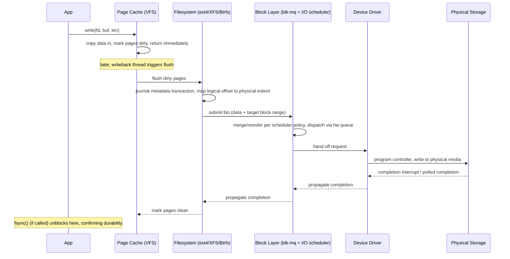

# Section 4: Filesystems & Storage

This section covers how Linux organizes data on disk — the VFS abstraction layer, concrete
filesystems (ext4, XFS, Btrfs), the block I/O path from syscall to physical media, LVM, RAID, and
storage troubleshooting. This is core material for any "disk full," "slow I/O," or "corrupted
filesystem" production scenario.

## Subtopic Index
- [VFS (Virtual Filesystem Switch) Layer](#vfs-virtual-filesystem-switch-layer)
- [Inodes, Dentries, Superblocks](#inodes-dentries-superblocks)
- [File Descriptors and File Table](#file-descriptors-and-file-table)
- [ext4 Architecture (journaling, extents)](#ext4-architecture-journaling-extents)
- [XFS Architecture](#xfs-architecture)
- [Btrfs Architecture (COW, snapshots)](#btrfs-architecture-cow-snapshots)
- [tmpfs, overlayfs, procfs, sysfs, devtmpfs](#tmpfs-overlayfs-procfs-sysfs-devtmpfs)
- [Journaling and Write-Ahead Logging](#journaling-and-write-ahead-logging)
- [Hard Links vs Symbolic Links](#hard-links-vs-symbolic-links)
- [File Permissions, Ownership, setuid/setgid/sticky bit](#file-permissions-ownership-setuidsetgidsticky-bit)
- [Access Control Lists (ACLs)](#access-control-lists-acls)
- [Extended Attributes (xattrs)](#extended-attributes-xattrs)
- [Block Devices vs Character Devices](#block-devices-vs-character-devices)
- [Partitioning (MBR vs GPT)](#partitioning-mbr-vs-gpt)
- [LVM (Physical Volumes, Volume Groups, Logical Volumes)](#lvm-physical-volumes-volume-groups-logical-volumes)
- [RAID Levels (0,1,5,6,10) software and hardware](#raid-levels-0156-10-software-and-hardware)
- [I/O Schedulers (noop, deadline, cfq, bfq, mq-deadline)](#io-schedulers-noop-deadline-cfq-bfq-mq-deadline)
- [Block Layer / multi-queue block layer (blk-mq)](#block-layer--multi-queue-block-layer-blk-mq)
- [Disk I/O Path (syscall to physical disk)](#disk-io-path-syscall-to-physical-disk)
- [Filesystem Mounting and Namespaces](#filesystem-mounting-and-namespaces)
- [Quotas](#quotas)

---

## VFS (Virtual Filesystem Switch) Layer

The Virtual Filesystem Switch is the kernel's abstraction layer that lets every concrete filesystem
implementation (ext4, XFS, Btrfs, NFS, tmpfs, procfs, and dozens more) present a uniform interface to
the rest of the kernel and to userspace, so that generic syscalls (`open`, `read`, `write`, `stat`,
`mkdir`, `rename`) work identically regardless of what's actually backing a given path. Internally,
VFS defines a small set of abstract object types — `struct super_block` (one per mounted filesystem
instance, describing filesystem-wide state), `struct inode` (one per filesystem object, whether file,
directory, symlink, or device node), `struct dentry` (a directory entry linking a name to an inode,
forming the directory hierarchy), and `struct file` (an open file's runtime state, including its
current read/write offset) — and requires each concrete filesystem to provide implementations of a
fixed set of operation tables (`super_operations`, `inode_operations`, `file_operations`,
`address_space_operations`) that VFS calls through generic function pointers, without needing to know
anything about how, say, ext4 actually stores extents on disk versus how XFS uses B+ trees. This
design is precisely why `cat somefile.txt` works identically whether the file lives on an ext4
partition, an NFS share, a FUSE-backed userspace filesystem, or even `/proc` (which isn't backed by a
real disk at all — its `inode_operations`/`file_operations` implementations synthesize content on the
fly from kernel data structures rather than reading blocks off a device). Path resolution
(`namei()`) is one of VFS's most performance-critical jobs: resolving `/var/log/app/current.log`
requires walking the dentry cache (see below) component by component, calling into each filesystem's
`lookup()` operation only on a dentry cache miss, and this walk happens on essentially every single
file-related syscall the entire system issues, making the dentry/inode caching layer's efficiency a
first-order performance concern for any I/O-heavy workload.

### Key commands
```
mount | column -t                 # every mounted filesystem and its VFS-visible type
cat /proc/filesystems              # filesystem types this kernel currently supports
stat -f /some/path                  # VFS-level filesystem statistics for the mount containing a path
cat /proc/<pid>/mountinfo            # detailed per-process view of the mount namespace
```

## Inodes, Dentries, Superblocks

An inode (`struct inode` in the VFS layer, backed by an on-disk representation specific to each
filesystem) is the fundamental object representing one filesystem entity — a regular file, directory,
symlink, device node, or named pipe — and holds all of that entity's metadata except its name: file
size, permissions, ownership (UID/GID), timestamps (access/modify/change), link count, and pointers
(direct or via extents/B-trees depending on the filesystem) to the actual data blocks on disk.
Crucially, a name is *not* part of an inode at all — names live entirely in directory entries, which
is exactly why hard links work (multiple directory entries, possibly in different directories, can
point at the very same inode, sharing all its metadata and data, distinguished only by an incremented
link count) and why renaming a file is normally an extremely cheap metadata-only operation (updating a
directory entry's name/parent pointer, not touching the inode or its data at all, as long as the
rename stays within the same filesystem). A dentry (directory entry) is the VFS's in-memory
representation linking a name string to its inode and parent directory, and the dentry cache
("dcache") keeps recently-resolved path components cached in memory specifically to avoid re-walking
the underlying filesystem's on-disk directory structures for every repeated path lookup — a negative
dentry (caching the fact that a particular name does *not* exist in a directory) is just as valuable a
cache entry as a positive one, since repeatedly failing to find the same nonexistent file (a common
pattern for library/config search paths trying several candidate locations) would otherwise repeatedly
hit the underlying filesystem. A superblock represents one mounted filesystem instance as a whole —
its type, size, block size, free space accounting, and a pointer to the root inode/dentry from which
the entire mounted tree hangs — and every mount operation ultimately allocates and populates one.

### Key commands
```
stat <file>                        # full inode metadata: size, perms, owner, timestamps, inode number, link count
ls -i <file>                        # show just the inode number
df -i                                 # inode usage/availability per mounted filesystem (can run out separately from space!)
cat /proc/sys/fs/dentry-state         # dentry cache statistics
```

## File Descriptors and File Table

A file descriptor is a small non-negative integer, unique per process, that indexes into that
process's private file descriptor table (`files_struct`), where each entry points not directly at an
inode but at a kernel-wide open file description (`struct file`) — this two-level indirection (per-
process fd table → shared open-file-description table → inode) is exactly what makes several UNIX
file-handling behaviors work correctly. Multiple file descriptors, even in different processes, can
point at the *same* open file description — this happens after `fork()` (parent and child share open
file descriptions for all inherited fds, meaning they share the same read/write offset — one process's
`read()` advances the position seen by the other too) or after `dup()`/`dup2()` (deliberately creating
a second fd referring to the same open file description, exactly how shell redirection like `2>&1`
works). By contrast, two independent `open()` calls on the same path create two *separate* open file
descriptions, each with its own independent offset, even though both ultimately point at the same
underlying inode — this is why two unrelated processes both writing to the same file via independent
`open()` calls can interleave unpredictably (each maintains its own offset), whereas a `fork()`ed
child sharing its parent's already-open fd for an append log genuinely shares the same offset,
avoiding that interleaving problem. The open file description itself holds the current file offset,
the status flags the file was opened with (`O_APPEND`, `O_NONBLOCK`), and a reference to the
underlying inode; the underlying inode is only truly freed once every open file description across
every process referencing it is closed — a classic and important consequence being that deleting
(`unlink()`) a file while a process still has it open does not immediately reclaim its disk space:
the directory entry is removed immediately, but the inode and its data blocks persist until the last
open file descriptor referencing it is closed, which is exactly why `df` (free space) and `du` (sum of
file sizes reachable by walking the directory tree) can disagree after such a delete-while-open
scenario.

```
Process A fd table        Process B fd table
   fd 3 ──┐                   fd 5 ──┐
          ▼                          ▼
    open file description    open file description   (independent offsets)
          │                          │
          ▼                          ▼
        inode (shared) ◄─────────────┘
          │
          ▼
     data blocks on disk
```

### Key commands
```
ls -l /proc/<pid>/fd/               # every open file descriptor for a process and what it points at
lsof -p <pid>                         # same information plus filesystem/socket/pipe detail, cross-process
lsof +L1                               # find open files with a link count of 0 — deleted-but-still-open files
cat /proc/sys/fs/file-nr               # system-wide open file handle count vs limit
```

## ext4 Architecture (journaling, extents)

ext4 is the widely-used default filesystem on many Linux distributions, an evolutionary successor to
ext2/ext3 that adds extents, larger volume/file size limits, and improved journaling performance while
retaining backward-compatible mount support for older ext2/ext3 volumes. Its on-disk layout divides
the volume into block groups, each containing its own inode table, block/inode bitmaps (tracking
free/used blocks and inodes within that group), and a backup copy of critical superblock metadata for
resilience against localized corruption — data blocks are allocated preferring locality within the
same block group as their inode and parent directory to minimize seek distance on spinning media (less
relevant, but still harmless, on SSDs). The most significant ext4 improvement over ext2/ext3 is
extent-based mapping: rather than ext2/ext3's indirect-block scheme (a fixed number of direct block
pointers in the inode, plus single/double/triple indirect blocks for larger files, requiring multiple
extra block reads just to locate data for large files), ext4 inodes store extents — compact
descriptors of the form "starting logical block, length, starting physical block" — that can describe
a large contiguous run of blocks in one small metadata entry, dramatically reducing both metadata
overhead and the number of on-disk metadata reads needed to map a large file's content, especially
when the file was written mostly-sequentially and so is mostly-contiguous on disk. ext4's journal
(see Journaling below) by default operates in `ordered` mode, meta-data journaled fully but regular
file data written to its final location before the corresponding metadata transaction commits,
striking a practical balance between crash-consistency guarantees and journaling overhead; `journal`
mode journals file data too (strongest consistency, meaningfully slower), and `writeback` mode
journals only metadata with no ordering guarantee relative to data writes (fastest, weakest
consistency — a crash can leave stale/garbage data visible in a file whose metadata says it was
extended, though the filesystem structure itself remains consistent). ext4 also supports delayed
allocation (deferring the decision of exactly which physical blocks to use until data is actually
flushed from the page cache, rather than at `write()` time), which allows better extent/contiguity
decisions once the true final file size and I/O pattern are known.

### Key commands
```
dumpe2fs -h /dev/sdX1                 # ext4 superblock summary: features, journal mode, block group layout
tune2fs -l /dev/sdX1                    # similar summary via tune2fs, plus tunable parameters
filefrag -v <file>                       # show a file's extent map and fragmentation level
e2fsck -f /dev/sdX1                       # offline filesystem check/repair (unmount first)
```

## XFS Architecture

XFS is a high-performance, scalable filesystem originally developed by SGI for IRIX, now the default
on RHEL/CentOS and widely used for large-scale storage and high-throughput workloads. Its defining
architectural choice is pervasive use of B+ trees for nearly every metadata structure — free space is
tracked by two B+ trees indexed by both block size and starting offset (enabling fast best-fit/first-
fit free-extent lookups), directories beyond a small inline size are B+ trees rather than ext-style
linear/hashed structures (giving consistently fast lookups even for directories containing millions of
entries, a genuine ext4 weakness at extreme scale), and extent maps for very large or heavily
fragmented files similarly upgrade from a compact inline array into a full B+ tree once they exceed a
threshold. XFS partitions the filesystem into allocation groups (conceptually similar to ext4's block
groups, but designed explicitly to enable parallelism — each allocation group can be
allocated-into/journaled somewhat independently, which is a major reason XFS scales especially well
on systems with many concurrent I/O threads and high core counts, since operations on different
allocation groups can proceed with less lock contention than a design with more centralized metadata).
XFS's journal (log) records only metadata operations (never file data, similar in spirit to ext4's
default ordered mode's metadata-only journaling, though implemented differently) using a logically
sequential log fully separate from the main allocation groups, and recovery after a crash replays
this log to restore metadata consistency without a full filesystem scan. Historically, XFS could not
be shrunk (only grown online, a still-true limitation today — shrinking an XFS filesystem or its
underlying block device requires backup/recreate/restore, not an in-place operation), a genuinely
important operational planning consideration when initially sizing an XFS volume for a database or
storage system compared to ext4/Btrfs, which do support shrinking. XFS is generally regarded as
excelling at large file, high-throughput, and highly parallel I/O workloads (databases, media storage,
big data platforms), while ext4 remains a very reasonable, slightly more flexible general-purpose
default for typical mixed workloads and smaller volumes.

### Key commands
```
xfs_info /mount/point                # XFS filesystem geometry: allocation groups, block size, log size
xfs_repair -n /dev/sdX1                # check (dry-run) an unmounted XFS filesystem for corruption
xfs_growfs /mount/point                 # grow an XFS filesystem online (no shrink equivalent exists)
xfs_db -c "freesp -s" /dev/sdX1          # (offline) inspect free-space fragmentation detail
```

## Btrfs Architecture (COW, snapshots)

Btrfs (B-tree filesystem) is a copy-on-write filesystem designed around a single unifying data
structure — everything (file data, metadata, free space tracking, even the filesystem's own internal
tree-of-trees structure) is represented as B-trees, and every modification follows copy-on-write
semantics: rather than overwriting existing on-disk blocks in place, a modified block is written to a
new location, and the tree structure pointing at it is updated (also via COW, propagating up to a new
tree root) rather than mutating anything in place — this is fundamentally different from ext4/XFS's
traditional journaling approach to crash consistency, since a crash mid-write simply leaves the old,
still-fully-consistent tree root as the valid state (the new blocks being written just never get
pointed to by a committed root), requiring no journal replay at all. This COW-everywhere design is
what makes Btrfs's headline features cheap and instantaneous: a snapshot is simply a new reference to
an existing tree root, sharing all of the same underlying blocks with the original subvolume until
either side modifies something (at which point COW naturally diverges just the modified blocks,
exactly like COW memory pages), meaning creating a snapshot of a multi-terabyte subvolume is an
effectively instant, constant-time metadata operation, not a data-copying one. Btrfs natively supports
subvolumes (independently mountable/snapshottable namespaces within one filesystem, commonly used to
separate `/`, `/home`, and package-manager-managed paths so a snapshot/rollback of the root subvolume
doesn't necessarily need to include or exclude `/home`'s independent history), built-in multi-device
support (software RAID-like functionality for data and metadata redundancy/striping without a separate
LVM/mdadm layer, though Btrfs's RAID5/6 implementation has a long-documented history of serious
"write hole" reliability issues that make it broadly not recommended for production use, unlike its
RAID0/1/10 modes which are considered solid), transparent compression (per-file or filesystem-wide,
trading CPU for reduced I/O and space), and checksumming of both data and metadata (catching silent
data corruption that traditional filesystems without checksums would simply never detect) with
automatic corruption detection on read against a redundant copy if configured. The main operational
trade-off versus ext4/XFS is that Btrfs's flexibility and COW-everywhere design come with real
performance overhead for certain workloads (particularly databases doing lots of small random
overwrites, where COW fragmentation can degrade performance unless `nodatacow` is deliberately set for
those specific files) and a comparatively higher operational complexity to reason about correctly.

### Key commands
```
btrfs subvolume create /path/to/subvol      # create a new subvolume
btrfs subvolume snapshot /src /dest           # instant, space-efficient COW snapshot
btrfs filesystem df /mount/point               # per-allocation-profile space usage (data/metadata/system)
btrfs scrub start /mount/point                  # verify checksums across the filesystem, repair from redundancy if found
```

## tmpfs, overlayfs, procfs, sysfs, devtmpfs

These are special-purpose filesystems that don't represent persistent on-disk storage in the
traditional sense, each solving a distinct problem within the VFS framework. `tmpfs` stores its
entire content in volatile memory (RAM and, if needed, swap) rather than any block device — files
written to a `tmpfs` mount vanish entirely on unmount/reboot, and it's used for `/tmp` on many
distributions (fast, automatically cleared) as well as `/dev/shm` (POSIX shared memory) and internally
as the backing store for the initramfs during early boot. `overlayfs` implements union-mount
semantics: it combines a read-only "lower" directory tree with a writable "upper" directory tree,
presenting a single merged view where reads are satisfied from upper if present there, otherwise from
lower, and any write triggers "copy-up" — the file is copied from lower into upper first, then
modified there, leaving the original lower content untouched — which is precisely the mechanism
container image layers are built on: each image layer is a read-only lower directory, stacked (often
many layers deep, using overlayfs's support for multiple lower directories), with a thin writable
upper layer representing the running container's own filesystem changes, letting many containers
share the same base image's blocks on disk without duplication while each maintains an independent
writable view. `procfs` (`/proc`) is a synthetic filesystem with no on-disk backing at all — every
file and directory under it is generated on-the-fly by kernel code when read, exposing live
process/kernel state (`/proc/<pid>/...`, `/proc/meminfo`, `/proc/cpuinfo`) as though it were ordinary
text files, purely as a convenient, tool-friendly presentation of internal kernel data structures.
`sysfs` (`/sys`) is similarly synthetic but organized specifically to mirror the kernel's internal
device/driver object model (the `kobject`/`kset` hierarchy) — every device, bus, driver, and class
the kernel knows about is represented as a directory with attribute files, and writing to certain
sysfs files is the standard mechanism for changing live kernel/device tunables (I/O scheduler
selection, CPU frequency governor, network interface parameters). `devtmpfs` is the filesystem
automatically mounted at `/dev` early in boot, populated dynamically by the kernel itself (in
cooperation with `udev` in userspace, which adds symlinks/permissions/naming policy) as devices are
detected, replacing the old approach of a static, pre-populated `/dev` directory that had to
anticipate every possible device node in advance.

### Key commands
```
mount -t tmpfs -o size=512m tmpfs /mnt/ram   # create a size-limited RAM-backed filesystem
mount | grep overlay                          # inspect active overlayfs mounts (very common for containers)
cat /proc/mounts                               # authoritative live list of mounted filesystems for this process's namespace
udevadm info /dev/sda                          # inspect udev-managed device metadata for a devtmpfs node
```

## Journaling and Write-Ahead Logging

Journaling is the standard technique traditional filesystems (ext3/ext4, XFS, and others) use to
guarantee metadata consistency across an unexpected crash or power loss, by writing a compact record
of the *intended* changes to a dedicated journal area *before* applying those changes to the
filesystem's actual, scattered on-disk structures — this is the same write-ahead-logging principle
databases use for transactional durability, applied at the filesystem level. A filesystem operation
that touches multiple, physically-scattered on-disk structures (creating a file, for example, updates
a directory entry, an inode, and a free-inode bitmap, potentially in three unrelated disk locations)
is first written as a single, sequential journal transaction (fast to write, since it's one
contiguous append to the journal area rather than three scattered seeks), and only after that
transaction is safely committed to the journal does the filesystem apply ("checkpoint") those changes
to their real, final on-disk locations at its own pace. If a crash occurs before checkpointing
completes, the still-fully-written-and-committed journal transaction can simply be replayed on next
mount, re-applying exactly the operations that were durably logged but not yet checkpointed — the
filesystem never ends up in a state where, say, a directory entry exists pointing at an inode that was
never actually allocated, because either the whole transaction committed to the journal (and will be
replayed/completed) or it didn't (and never happened at all, from the filesystem's perspective) —
this atomicity of the journal transaction itself is the core consistency guarantee. Critically,
journaling by itself typically only protects filesystem *metadata* consistency, not the durability of
file *data* content, unless the filesystem's chosen journal mode explicitly includes data (as ext4's
`data=journal` mode does, at a real performance cost) — this is why an application still must call
`fsync()` explicitly to guarantee its own data content survives a crash, and why a journaling
filesystem prevents filesystem corruption after a crash but does not, by itself, prevent an
application from losing recently-written data that was never flushed past the page cache.

### Key commands
```
dumpe2fs -h /dev/sdX1 | grep -i journal    # ext4 journal size/mode/features
tune2fs -O ^has_journal /dev/sdX1            # (dangerous, offline only) disable ext4 journaling
xfs_logprint /dev/sdX1                        # inspect XFS log contents (diagnostic tool)
mount | grep data=                            # confirm current ext4 data journaling mode from mount options
```

## Hard Links vs Symbolic Links

A hard link is simply an additional directory entry pointing at the same inode as an existing file —
there is no meaningful sense in which one hard link is "the original" and another is "the link";
both are equally valid names for the identical underlying inode, sharing the same data, permissions,
ownership, and timestamps, with the inode's link count incremented for each additional hard link
created. Because hard links reference an inode directly, they cannot cross filesystem boundaries
(an inode number is only meaningful within its own filesystem's inode table) and, on most filesystems,
cannot target a directory (to avoid creating cycles in the directory tree that would break tools
relying on it being a strict tree, like `find` or backup software) — the file's underlying data and
inode are only actually freed once every hard link (and every still-open file descriptor) referencing
it is gone, which is exactly the mechanism that makes `unlink()`-while-open safe: `rm`ing a file a
running process still has open just removes one directory entry/decrements the link count, while the
inode and its data persist until that last reference (link or open fd) disappears. A symbolic link
(symlink), by contrast, is a special file type whose content is simply a text string — a path — that
the kernel transparently re-resolves (dereferences) whenever the symlink is encountered during path
resolution; it has its own independent inode (a tiny one, though very short paths may be stored
inline in the inode itself as an optimization) and is a fundamentally different filesystem object
from what it points at, meaning it can point across filesystem boundaries, point at directories, and
even point at a path that doesn't currently exist (a "dangling" symlink, which resolves successfully
as an object but fails when something tries to actually open/traverse through it). Deleting a
symlink never affects its target at all (since it's just an independent inode holding a path string),
whereas the semantics for hard links are exactly the reverse — there genuinely is no "target" separate
from the link itself, only multiple equally-valid names sharing one inode.

### Key commands
```
ln original.txt hardlink.txt        # create a hard link (same inode, same filesystem required)
ln -s /path/to/target link.txt        # create a symbolic link (separate inode, cross-filesystem OK)
ls -li                                  # show inode numbers to confirm which files share one (hard-linked)
stat hardlink.txt | grep Links           # confirm the link count for a file's inode
readlink -f link.txt                      # fully resolve a symlink chain to its final target path
```

## File Permissions, Ownership, setuid/setgid/sticky bit

Every inode carries an owning UID, an owning GID, and a 9-bit permission field split into three
3-bit groups (owner, group, other), each group encoding read/write/execute permission — checked by
the kernel on every relevant syscall (`open`, `exec`, `mkdir`, etc.) against the *effective* UID/GID
of the requesting process, not necessarily its real/login UID (a distinction that matters enormously
for setuid programs, discussed next). Beyond the basic rwx bits, three special permission bits change
behavior in specific, important ways. The setuid bit, when set on an executable, causes the kernel to
run that program with its *effective* UID set to the file's *owner* UID rather than the invoking
user's UID — the classic example is `/usr/bin/passwd`, owned by root and setuid, which lets an
unprivileged user run a program that briefly gains root privilege specifically to modify the
otherwise-root-only-writable `/etc/shadow` file, with the program itself responsible for carefully
restricting exactly what that elevated privilege is used for. The setgid bit on an executable works
analogously for group ID; on a *directory* specifically, setgid has an entirely different meaning:
new files and subdirectories created within it inherit the directory's group ownership rather than
the creating user's primary group, which is the standard mechanism for maintaining consistent group
ownership across a shared team directory without every user needing to remember to `chgrp`
explicitly. The sticky bit, historically used to keep a program's text segment resident in swap for
faster subsequent launches (long obsolete on modern Linux), today is meaningful almost exclusively on
directories: within a sticky directory, a user may only delete or rename files they themselves own,
even if the directory's normal permission bits would otherwise allow any user with write access to
delete anything inside it — `/tmp` is the canonical example, world-writable so any user can create
files there, but sticky so users cannot delete or tamper with each other's files despite that shared
write access.

### Key commands
```
chmod u+s /path/to/binary          # set the setuid bit
chmod g+s /path/to/directory        # set the setgid bit (inherit group on new files, for directories)
chmod +t /path/to/directory          # set the sticky bit (restrict deletion to file owner)
find / -perm -4000 -type f 2>/dev/null   # audit: find all setuid binaries on the system
```

## Access Control Lists (ACLs)

Traditional UNIX permissions (owner/group/other, 9 bits) can only express permission for exactly one
user (the owner) and exactly one group at a time, which is insufficient for many real-world sharing
requirements — granting read access to three specific additional users and write access to one
specific additional group, all on the same file, simply cannot be expressed in the traditional model
without resorting to workarounds like creating dedicated shared groups for every combination needed.
POSIX ACLs extend this by allowing an arbitrary list of additional named-user and named-group entries,
each with their own independent rwx permissions, attached to a file or directory beyond the basic
owner/group/other triad — checked by the kernel in a defined precedence order (owner, then any
matching named-user ACL entry, then owning group and any named-group ACL entries, combined according
to a "mask" entry that caps the maximum effective permission any named entry can grant, then other) any
time traditional permission bits alone don't already resolve the access unambiguously. Default ACLs
can additionally be set on a directory specifically to be inherited automatically by every new file
and subdirectory created within it, extending the setgid-directory inheritance idea to a full,
arbitrary ACL rather than just group ownership — genuinely useful for shared project directories
where a consistent, more nuanced access policy needs to apply automatically to new content without
manual intervention every time. Filesystems must explicitly support the `acl` mount option (the vast
majority of modern filesystems, including ext4 and XFS, do by default) for ACL entries to be stored
and enforced at all; `ls -l`'s permission string gains a trailing `+` character as the visible hint
that a file carries ACL entries beyond the basic permission bits, prompting an administrator to check
`getfacl` for the full picture rather than trusting `ls -l`'s traditional rwx display alone, which is
a genuinely common source of "why can this user access this file, the permission bits say they
shouldn't be able to" confusion during access-control troubleshooting.

### Key commands
```
getfacl <file>                      # show full ACL entries for a file
setfacl -m u:alice:rwx <file>         # grant a specific additional user rwx access
setfacl -d -m g:devteam:rx <dir>       # set a default ACL, inherited by new files created in a directory
ls -l <file>                            # trailing '+' after permission bits hints at ACL presence
```

## Extended Attributes (xattrs)

Extended attributes are arbitrary name/value metadata pairs that can be attached to a filesystem
object beyond the fixed set of metadata (permissions, ownership, timestamps, size) that every inode
already carries by default, providing a generic extension point that different subsystems use for
their own specialized purposes without the VFS or on-disk inode format needing to hardcode support for
each one individually. They're namespaced by convention/prefix — `user.*` is available for arbitrary
application use (e.g., storing a checksum, a source URL, or a MIME type alongside a downloaded file),
`security.*` is used by security modules (SELinux stores its file security context/label as a
`security.selinux` xattr, which is precisely how SELinux enforces mandatory access control decisions
per-file — the label itself lives as filesystem xattr metadata, not in some entirely separate
database), `system.*` is used for kernel-level metadata like POSIX ACLs (an ACL, discussed above, is
actually implemented under the hood as a `system.posix_acl_access`/`system.posix_acl_default` xattr),
and `trusted.*` is restricted to processes with `CAP_SYS_ADMIN`, typically used by low-level system
tools. Not every filesystem supports xattrs, and those that do may impose size limits (ext4
historically limited xattr storage to what fits within a single filesystem block unless a
larger-xattr feature is enabled, while XFS and Btrfs are generally more generous), which matters
directly for anything relying heavily on xattrs at scale — SELinux-labeled filesystems in particular
require xattr support to be present and correctly preserved across operations like `cp`/`tar`/backup
tools (which must be explicitly told to preserve xattrs, e.g. `cp --preserve=xattr` or `tar
--xattrs`, or the security labels/ACLs silently vanish on copy, a common and security-relevant
migration/backup pitfall).

### Key commands
```
getfattr -d <file>                  # list all user-namespace extended attributes on a file
setfattr -n user.mycustomattr -v myvalue <file>   # set a custom xattr
getfattr -n security.selinux <file>   # inspect the SELinux security context stored as an xattr
cp --preserve=xattr src dst            # explicitly preserve xattrs across a copy (not default in all tools)
```

## Block Devices vs Character Devices

Linux exposes hardware (and some purely virtual) devices through device nodes in `/dev`, and every
device node is one of exactly two fundamental types determined by how the underlying driver structures
data access. A block device (major/minor numbers identifying the specific driver and device instance,
visible via `ls -l` showing a `b` in the first column) represents random-access storage addressed in
fixed-size blocks — disks, SSDs, RAID arrays, LVM logical volumes — and is accessed through the block
layer (discussed below), which provides buffering through the page cache, I/O scheduling/merging of
adjacent requests, and support for filesystems to be mounted on top of it; reads and writes to a block
device can seek to and address any block in any order. A character device (shown as `c` in `ls -l`)
represents a stream-oriented or otherwise non-block-addressable interface — terminals (`/dev/tty*`),
serial ports, `/dev/null`, `/dev/zero`, `/dev/random`/`/dev/urandom`, and most non-storage hardware
(sensors, GPIO, many USB devices) — where data is read or written as an unstructured sequential stream
without the concept of seeking to an arbitrary block offset being generally meaningful (some character
devices do support limited seeking, but it's driver-specific and not a general capability the way
block-addressability is). The major number identifies which driver handles a device node (visible in
`/proc/devices`, mapping major numbers to registered driver names) while the minor number
disambiguates between multiple devices/partitions handled by that same driver (e.g., `/dev/sda` major
8 minor 0, `/dev/sda1` major 8 minor 1) — historically these node files were manually created with
`mknod` using explicit major/minor numbers looked up from a fixed registry, while today `devtmpfs` and
`udev` create and remove them automatically and dynamically as the kernel detects hardware, with
`udev` additionally applying naming/symlink policy (predictable network interface names, `/dev/disk/
by-uuid/...` symlinks) on top of the kernel's raw major/minor device nodes.

### Key commands
```
ls -l /dev/sda /dev/tty1              # note the leading 'b' (block) vs 'c' (character) in the permission column
cat /proc/devices                       # major number to driver-name mapping, split into block and character sections
udevadm info -q all -n /dev/sda          # full udev-managed metadata for a block device node
lsblk                                     # tree view of block devices, partitions, and their mount points
```

## Partitioning (MBR vs GPT)

A partition table divides a physical (or virtual) block device into logically separate regions, each
independently formattable with its own filesystem or used as raw storage for something like a swap
area or an LVM physical volume. MBR (Master Boot Record) partitioning, inherited from the original
IBM PC BIOS era, stores its partition table within the disk's first 512-byte sector, allocating space
for only four "primary" partition entries directly — a limitation historically worked around via
"extended" partitions (one of the four primary slots repurposed to contain a linked list of
additional "logical" partitions), a genuinely awkward, error-prone scheme purely a consequence of
that original 512-byte space constraint. MBR also addresses partition start/size using 32-bit sector
counts, which combined with the traditional 512-byte sector size caps addressable disk size at 2TiB
— any capacity beyond that is simply unreachable under MBR regardless of the underlying disk's true
size, a hard limitation rather than a performance consideration. GPT (GUID Partition Table), part of
the UEFI specification but usable independently of whether a system actually boots via UEFI, resolves
both limitations: it uses 64-bit logical block addressing (supporting enormous disk sizes far beyond
any currently-existing physical media), supports up to 128 partitions natively with no
primary/extended distinction needed, assigns each partition a globally unique identifier (GUID) rather
than relying purely on ordering/type-byte conventions, and stores a duplicate backup copy of the
partition table at the *end* of the disk specifically so a corrupted primary table (at the start) can
be automatically detected (via CRC32 checksums covering the table) and repaired from the backup. For
backward compatibility, GPT disks include a "protective MBR" in the very first sector — a single MBR
partition entry marking the entire disk as an unrecognized partition type — specifically to prevent
old MBR-only tools from misinterpreting an empty-looking first sector as an uninitialized disk and
overwriting the real GPT structures that immediately follow. Today, GPT is the clear default choice
for any disk larger than 2TB or any system using UEFI boot, with MBR retained mainly for legacy
BIOS-only systems or very old small-capacity media.

### Key commands
```
parted /dev/sdX print                # show partition table (works for both MBR and GPT)
gdisk /dev/sdX                          # GPT-specific partitioning tool
fdisk -l /dev/sdX                        # list partitions; modern fdisk supports both MBR and GPT
sgdisk --backup=table.bak /dev/sdX        # backup a GPT partition table for disaster recovery
```

## LVM (Physical Volumes, Volume Groups, Logical Volumes)

LVM (Logical Volume Manager) inserts a flexible abstraction layer between raw block devices/partitions
and the filesystems built on top of them, solving the rigidity of directly formatting a filesystem
onto a fixed-size partition. A Physical Volume (PV) is a raw block device or partition initialized
for LVM use (LVM writes its own metadata header identifying it as a PV, typically consuming a small
reserved area at the start). One or more PVs are combined into a Volume Group (VG) — a pool of storage
capacity aggregated across however many underlying physical devices were added to it, internally
divided into fixed-size Physical Extents (PEs, commonly 4MB each) that serve as LVM's basic allocation
unit, analogous to how a filesystem allocates in fixed-size blocks. Logical Volumes (LVs) are then
carved out of a Volume Group's available extents, each LV appearing to the rest of the system as an
ordinary block device (`/dev/vgname/lvname`) that a filesystem can be created on and mounted exactly
like a plain partition, with the crucial difference that an LV's size is not tied to any single
physical disk's boundaries — it can span multiple PVs within its VG, and can be grown online
(`lvextend`, immediately followed by growing the filesystem on top with `resize2fs`/`xfs_growfs`)
without unmounting, as long as the VG has free extents available, either from existing PVs with spare
capacity or by adding an entirely new PV to the VG first (`vgextend`) if it's already full. LVM
snapshots work by allocating a separate LV that initially shares all of its origin LV's data blocks,
and using copy-on-write: when the origin LV is modified, the *original* block content is first copied
into the snapshot's own reserved space before being overwritten in the origin, preserving the
snapshot's point-in-time view — this is architecturally the inverse of Btrfs's approach (where new
writes go to new locations and old blocks are preserved naturally) and means a traditional LVM
snapshot's reserved space must be sized carefully in advance to hold however much divergence is
expected before the snapshot is removed, or the snapshot itself is invalidated/dropped if it fills up.
LVM's flexibility (online resize, spanning multiple physical disks, easy snapshotting for consistent
backups) comes at a modest additional layer of indirection and operational complexity compared to
formatting a filesystem directly onto a raw partition, a trade-off almost universally considered
worthwhile for any server deployment where storage needs are expected to grow or be reorganized over
time.

### Key commands
```
pvcreate /dev/sdb1                    # initialize a device/partition as an LVM physical volume
vgcreate myvg /dev/sdb1 /dev/sdc1        # create a volume group spanning two physical volumes
lvcreate -L 50G -n mylv myvg               # create a 50GB logical volume within a volume group
lvextend -L +20G -r /dev/myvg/mylv          # grow a logical volume AND its filesystem online (-r)
lvcreate -s -L 5G -n snap /dev/myvg/mylv     # create a copy-on-write snapshot of a logical volume
```

## RAID Levels (0,1,5,6,10) software and hardware

RAID (Redundant Array of Independent Disks) combines multiple physical drives into a single logical
unit for improved performance, redundancy, or both, implemented either in hardware (a dedicated RAID
controller card with its own processor and often battery-backed cache, transparent to the OS which
just sees one logical disk) or in software (the kernel's `md` — multiple devices — driver, managed
via `mdadm`, or a filesystem's own built-in RAID-like functionality as in Btrfs/ZFS). RAID 0
(striping) splits data across all member disks with no redundancy at all — reads and writes can be
parallelized across every disk in the array simultaneously for a large multiplicative throughput
improvement, but the loss of any single disk in the array destroys all data, since every disk holds
only a fragment of every file with no way to reconstruct the missing pieces. RAID 1 (mirroring)
writes identical, complete copies of all data to every member disk — no capacity benefit at all (usable
capacity equals a single disk's size regardless of how many mirrors you add), but read throughput can
improve (different reads can be serviced from different mirror members in parallel) and the array
survives the loss of any N-1 of N mirrors. RAID 5 stripes data across all member disks along with a
single distributed parity block per stripe (computed via XOR across the corresponding data blocks,
rotated across different disks per stripe rather than concentrated on one dedicated parity disk),
tolerating exactly one disk failure — the missing disk's data for any given stripe can be reconstructed
by XORing the surviving data blocks and parity together — at the cost of one disk's worth of usable
capacity across the whole array and a real, well-documented write performance penalty (a partial
stripe write requires reading the old data and old parity before computing and writing the new parity,
the "RAID 5 write hole/penalty"). RAID 6 extends this with a second, independently-computed parity
block per stripe, tolerating any two simultaneous disk failures at the cost of two disks' worth of
capacity, specifically favored for arrays built from very large modern drives where rebuild times after
a single failure can stretch long enough that a second failure during that rebuild window becomes a
genuinely realistic risk RAID 5 cannot survive. RAID 10 (striped mirrors) combines RAID 1 mirrored
pairs, then stripes data across those pairs (RAID 0 style) — offering both strong redundancy
(tolerating multiple failures as long as they're not both members of the same mirrored pair) and the
best write performance among redundant RAID levels (no parity computation overhead at all), at the
cost of the same 50% capacity overhead as plain mirroring, making it a common choice for
write-intensive database workloads that can afford the capacity cost for both performance and
resilience.

### Key commands
```
mdadm --create /dev/md0 --level=5 --raid-devices=4 /dev/sd[bcde]1   # create a software RAID5 array
cat /proc/mdstat                     # live status of all software RAID arrays, including rebuild progress
mdadm --detail /dev/md0                # detailed array configuration and per-disk state
mdadm --manage /dev/md0 --fail /dev/sdb1   # simulate/mark a disk as failed for testing recovery
```

## I/O Schedulers (noop, deadline, cfq, bfq, mq-deadline)

An I/O scheduler sits in the block layer between filesystems issuing I/O requests and the actual
device driver, deciding the order in which pending requests are dispatched to the underlying device —
its purpose is to optimize for the physical characteristics of the underlying media and the fairness/
latency needs of competing processes rather than simply dispatching requests in raw arrival order.
`noop` (and its modern multi-queue equivalent, `none`) performs no reordering or prioritization at all
beyond simple request merging (combining adjacent requests into one larger one) — appropriate for
devices like SSDs/NVMe where the underlying media has no meaningful seek-time penalty to optimize
around, since the device's own internal controller already handles request scheduling efficiently and
additional host-side reordering adds latency for no benefit. `deadline` (and `mq-deadline`) assigns
each request an expiration deadline and primarily services requests in a mostly-sequential order for
throughput, but will jump ahead to service any request that's about to breach its deadline, preventing
request starvation (a classic problem with naive elevator-style seek-minimizing schedulers, where
requests far from the disk head's current position could theoretically wait indefinitely as closer
requests keep arriving) — a solid, low-overhead general-purpose choice for both spinning disks and
many SSD workloads. `cfq` (Completely Fair Queuing, the older single-queue-era default) attempted to
give every process/cgroup a fair, proportional share of disk time by maintaining per-process request
queues serviced round-robin, but was retired along with the rest of the single-queue block layer in
favor of `bfq`. `bfq` (Budget Fair Queuing) is CFQ's modern multi-queue-era successor, providing
similar proportional fairness (including cgroup-aware I/O bandwidth allocation) with generally better
latency characteristics for interactive/desktop-style mixed workloads, at some CPU/complexity cost
that makes it less favored for maximum-throughput server storage workloads than `mq-deadline` or
`none`. The correct choice is genuinely workload- and device-dependent: fast NVMe storage
overwhelmingly benefits from `none` (letting the device's own internal queueing/scheduling do the
work, since host-side reordering only adds latency), server workloads on SATA/SAS SSDs or spinning
disks commonly default to `mq-deadline` for its deadline-bounded fairness with low overhead, and
desktop/interactive systems prioritizing responsiveness under mixed background/foreground I/O load may
prefer `bfq`.

### Key commands
```
cat /sys/block/sdX/queue/scheduler        # current scheduler and other available options for a device
echo mq-deadline > /sys/block/sdX/queue/scheduler   # change the active I/O scheduler live
iostat -x 1                                  # per-device throughput/latency to evaluate scheduler effectiveness
fio --name=test --ioengine=libaio --rw=randread --size=1G   # benchmark I/O under different scheduler settings
```

## Block Layer / multi-queue block layer (blk-mq)

The block layer is the kernel subsystem sitting between filesystems/block-device consumers and the
actual storage device drivers, responsible for representing I/O requests (`struct bio`, describing a
scatter-gather list of memory pages and the target block range), merging/reordering them per the
active I/O scheduler's policy, and handing them off to the underlying driver for actual execution.
The legacy single-queue block layer (pre-`blk-mq`, now fully removed from modern kernels) maintained
exactly one request queue per block device, protected by a single lock — entirely adequate for
spinning disks capable of perhaps a few hundred IOPS, where lock contention on that single queue was
never remotely the bottleneck, but becoming a severe scalability problem as NVMe SSDs capable of
millions of IOPS across dozens of CPU cores emerged, since every I/O submission and completion from
every CPU core had to serialize through that one queue's lock, turning the block layer itself into the
throughput bottleneck rather than the storage device. `blk-mq` (multi-queue block layer, the sole
block layer implementation in current kernels) redesigns this around per-CPU (or per-CPU-group)
software submission queues feeding into a smaller number of hardware dispatch queues that map directly
onto the NVMe/storage controller's own native multi-queue hardware support — since NVMe as a protocol
was itself designed around thousands of independent hardware queues specifically to eliminate this
class of software bottleneck, `blk-mq` lets each CPU core submit I/O through its own queue with far
less cross-core lock contention, and lets completions be handled on (or near) the same core that
issued the request, preserving cache locality and minimizing costly cross-core synchronization. This
redesign is what actually enables modern NVMe devices' theoretical millions-of-IOPS specifications to
be realized in practice under real multi-core Linux workloads — without `blk-mq`'s per-core queue
architecture, the single-queue-era lock would have become the dominant bottleneck long before any
individual NVMe device's own hardware limits were reached, no matter how fast the underlying flash
media itself was.

### Key commands
```
cat /sys/block/nvme0n1/queue/nr_hw_queues     # number of hardware dispatch queues in use (blk-mq)
cat /sys/block/sdX/queue/scheduler               # confirm blk-mq schedulers are active (none/mq-deadline/bfq)
fio --numjobs=8 --iodepth=32 ...                   # benchmark parallel per-core submission scaling
perf stat -e block:block_rq_issue ./workload         # low-level block-layer request issuance tracing
```

## Disk I/O Path (syscall to physical disk)

Tracing a `write()` syscall end-to-end ties together nearly everything covered in this section into
one coherent story, and being able to narrate it precisely is a strong interview signal. An
application calls `write(fd, buf, len)`; the kernel copies the data from the userspace buffer into the
page cache (allocating new page-cache pages backing the target file offset if not already resident,
marking them dirty) and, for an ordinary buffered write, returns immediately — the actual disk write
has not happened yet, only an in-memory buffering step. Independently, kernel writeback threads
(triggered by the dirty-page thresholds and periodic timers discussed in Section 3) eventually decide
to flush these dirty pages to stable storage: the filesystem (ext4/XFS/Btrfs) translates the logical
file offset into a physical block/extent location using its own on-disk metadata structures (extent
trees, B+ trees, or indirect blocks depending on filesystem), and if journaling is in use, first
writes a compact journal transaction describing the metadata change. The filesystem then constructs
one or more `bio` (block I/O) structures describing the actual data to be written and the target
physical block range, and submits them into the block layer, where the active blk-mq queues and I/O
scheduler decide dispatch order (potentially merging adjacent requests for efficiency) before handing
them to the underlying device driver (NVMe, SCSI/SATA, or a software layer like LVM/`md` RAID which
may itself further translate/replicate the request across multiple underlying physical devices before
those, in turn, reach their own device drivers). The device driver programs the actual hardware
controller (via memory-mapped I/O registers or a hardware command queue, for NVMe literally submitting
an entry into a hardware submission queue the SSD controller polls), the physical media performs the
write (updating NAND flash cells via a translation layer that itself handles wear-leveling and
its own internal block remapping, entirely opaque to the OS, for an SSD; or seeking the head and
writing to a specific sector for a spinning disk), and upon hardware completion an interrupt (or
polled completion queue entry, common for high-performance NVMe paths) signals the driver, which
propagates completion back up through the block layer, filesystem, and finally wakes any process
waiting on that specific I/O (relevant for a synchronous/`O_DIRECT` write, or an `fsync()` call
waiting for previously-buffered writes to actually complete).



### Key commands
```
strace -T -e trace=write,fsync ./program   # measure per-syscall time including any blocking fsync
iostat -x 1                                    # device-level throughput/latency/queue-depth over time
blktrace -d /dev/sdX -o - | blkparse             # full block-layer request lifecycle tracing
cat /sys/block/sdX/stat                          # raw cumulative block-device I/O statistics
```

## Filesystem Mounting and Namespaces

Mounting attaches a filesystem instance (whether a real block-device-backed filesystem, a network
filesystem like NFS, or a pseudo-filesystem like tmpfs/proc/sysfs) at a specific point in the
directory hierarchy, making its root directory's content transparently appear at that mount point —
prior to Linux namespaces, a system had exactly one global mount table shared by every process, but
mount namespaces (`CLONE_NEWNS`) let different processes see entirely independent sets of mounted
filesystems and mount points, which is the exact primitive containers rely on to give each container
its own private root filesystem view (typically an overlayfs stack, discussed above) with the host's
real filesystem layout completely invisible unless explicitly bind-mounted in. A bind mount
(`mount --bind`) is a distinct, simpler operation from mounting a new filesystem — it makes an
already-mounted directory tree (or even a single file) visible at a second location as well, without
creating any new filesystem instance at all; both the original and bind-mounted paths refer to the
exact same underlying inodes, so changes through either path are immediately visible through the
other. Mount propagation settings (`shared`, `private`, `slave`, `unbindable`, configurable per mount
via `mount --make-shared`/`--make-private`/etc.) control whether a mount/unmount event occurring in
one mount namespace is automatically replicated into other namespaces sharing a propagation
relationship with it — `shared` mounts propagate both ways (a new mount inside a shared mount point in
one namespace appears in all peer namespaces too), `private` mounts propagate nothing, and `slave`
mounts receive propagation from their master but don't propagate their own changes back — this
propagation model is exactly what lets a container runtime, for instance, control whether a volume
mounted inside a container should also become visible on the host, or vice versa, with fine-grained
per-mount control rather than an all-or-nothing choice. Mount options (`ro`, `noexec`, `nosuid`,
`noatime`) are enforced per mount point in the VFS layer regardless of what the underlying filesystem
itself would otherwise permit, letting an administrator, for example, mount a filesystem containing
user-uploaded content as `noexec` to prevent execution of anything placed there, purely as a mount-time
policy layered independently on top of the underlying filesystem's own permission bits.

### Key commands
```
mount --bind /src /dst                 # make an existing directory tree visible at a second location too
mount --make-private /mnt/foo            # stop mount events under this mount point from propagating elsewhere
cat /proc/<pid>/mountinfo                 # detailed view of this process's mount namespace, including propagation
unshare --mount bash                       # start a new shell in a fresh, independent mount namespace
```

## Quotas

Filesystem quotas let an administrator cap how much disk space and/or how many inodes a specific user
or group may consume on a given filesystem, independent of standard permission bits (which control
*who* can write, not *how much* they can accumulate). Quotas are tracked per-filesystem (requiring the
`usrquota`/`grpquota` mount options, or, on XFS, its own native `uquota`/`gquota`/`pquota`
implementation which additionally supports project quotas — grouping arbitrary directory subtrees
under one quota regardless of which user/group owns individual files within them, useful for
capping an entire application's or tenant's storage footprint spread across files owned by several
different users) and enforce two configurable thresholds: a soft limit, which can be temporarily
exceeded (typically for a grace period, after which the kernel begins refusing further writes/file
creation until usage drops back under the soft limit) intended to warn users approaching capacity
without immediately breaking their work, and a hard limit, which can never be exceeded under any
circumstances — an attempt to write past it fails immediately with `EDQUOT`. Quota accounting is
maintained by the kernel as writes occur (not computed retroactively by scanning the filesystem),
requiring quota tracking to be explicitly enabled and an initial accounting pass (`quotacheck`) run
before enforcement begins, since the kernel needs an accurate starting baseline of existing usage per
user/group before it can correctly track incremental changes going forward. Quotas are a genuinely
different resource-limiting mechanism from cgroup-based resource limits (discussed in later sections)
— quotas cap persistent storage consumption per user/group on a specific filesystem, entirely
independent of which processes or containers are doing the writing, whereas cgroup limits (and,
relatedly, container storage-driver size limits) cap resource usage per process group/container
regardless of which UID owns the files, making the two mechanisms complementary rather than
overlapping in a typical multi-tenant hosting scenario that needs both per-user and per-workload
storage governance simultaneously.

### Key commands
```
quotacheck -cug /mount/point          # initialize quota accounting files for users and groups
edquota -u alice                        # interactively set/edit a user's soft/hard quota limits
repquota -a                              # report current quota usage for all users on all quota-enabled filesystems
xfs_quota -x -c 'report -h' /mount/point   # XFS-native quota reporting, including project quotas
```

---

### Interview Questions

**Conceptual/Internals (8)**

1. **What problem does the VFS layer solve, and how does it achieve filesystem independence?**
   VFS provides a uniform set of abstract objects (superblock, inode, dentry, file) and operation
   tables that every concrete filesystem must implement, letting generic syscalls like `open`/`read`/
   `write` work identically regardless of the underlying filesystem type. Concrete filesystems plug in
   by implementing the required operation callbacks; VFS calls through function pointers without
   needing any filesystem-specific knowledge itself.

2. **Why does deleting an open file not immediately free its disk space?**
   `unlink()` only removes a directory entry and decrements the target inode's link count; the inode
   and its data blocks are only actually freed once every hard link and every open file descriptor
   referencing that inode are gone. A process holding the file open when it's "deleted" keeps the
   inode and data alive until it closes its file descriptor, which is why `df` and `du` can disagree
   in this scenario.

3. **Explain journaling's consistency guarantee, and what it does NOT protect against.**
   Journaling writes a compact record of an intended filesystem metadata change to a sequential
   journal area before applying it to scattered on-disk structures, so a crash either sees the full
   transaction committed (replayed on next mount) or not committed at all (never happened) —
   preventing metadata inconsistency. It generally does not guarantee file *data* durability unless
   the journal mode explicitly covers data (a real performance cost); applications must still call
   `fsync()` for data durability guarantees.

4. **What is the fundamental architectural difference between ext4 and Btrfs regarding crash
   consistency?**
   ext4 uses traditional write-ahead journaling: changes are logged then applied in place, requiring
   journal replay after a crash. Btrfs is copy-on-write everywhere: modifications are always written
   to new locations with tree structures updated via COW up to a new root, so a crash simply leaves
   the previous, still-fully-valid root as the current state with no replay needed at all.

5. **Why can't hard links cross filesystem boundaries or (generally) point at directories?**
   A hard link references an inode number directly, which is only meaningful within the inode table of
   the specific filesystem it belongs to, so it cannot reference an inode on a different filesystem.
   Hard links to directories are disallowed on most filesystems to prevent cycles in the directory
   tree, which would break tools (like `find`, backup software) that assume a strict tree structure.

6. **What is blk-mq and why did it replace the legacy single-queue block layer?**
   blk-mq is the multi-queue block layer redesign using per-CPU software submission queues feeding
   hardware dispatch queues mapped onto a device's native multi-queue support (as NVMe was designed
   for). It replaced the legacy single request-queue-per-device design (protected by one lock) because
   that single lock became a severe scalability bottleneck once NVMe SSDs capable of millions of IOPS
   across many cores emerged, well before the storage media itself would otherwise be the limiting
   factor.

7. **What's the practical difference between MBR and GPT partitioning?**
   MBR stores its partition table in a 512-byte boot sector, supports only 4 primary partitions
   directly (requiring an awkward extended/logical scheme for more), and is capped at 2TiB addressable
   disk size due to 32-bit sector addressing. GPT uses 64-bit addressing (supporting far larger disks),
   natively supports up to 128 partitions, stores a checksummed backup table at the end of the disk for
   resilience, and is required for disks larger than 2TB or systems booting via UEFI.

8. **How does an LVM snapshot work, and why must its size be planned in advance?**
   An LVM snapshot initially shares all data blocks with its origin logical volume; when the origin is
   modified, the *original* content of the changed block is copied into the snapshot's own reserved
   space before being overwritten in the origin, preserving the snapshot's point-in-time view. Because
   this copy-out space is a fixed allocation set at creation time, if divergence between origin and
   snapshot exceeds that reserved size, the snapshot is invalidated/dropped, making correct sizing
   based on expected write volume and snapshot lifetime essential.

**Scenario/Troubleshooting (6)**

9. **`df` shows a filesystem is 100% full, but `du -sh` on the mount point reports far less data
    actually present. What's the most likely explanation and how do you find the culprit?**
    A process is very likely holding open file descriptors to deleted files, whose inodes and data
    blocks persist (invisible to `du`'s directory-tree walk since the directory entries are gone) until
    those descriptors are closed. Use `lsof +L1` to find open files with a link count of zero, then
    identify and safely restart/signal the owning process to release them.

10. **A filesystem reports plenty of free space via `df` but applications still fail to create new
    files with "No space left on device." What else should you check?**
    Check inode exhaustion with `df -i` — a filesystem can run out of free inodes (each consuming a
    small fixed metadata allocation, common on filesystems with huge numbers of tiny files) well before
    running out of raw block space, and `df`'s default space-based view alone will not reveal this.

11. **After enabling Transparent overlayfs-based container storage, disk usage grows much faster than
    expected across many containers built from the same base image. What should you verify?**
    Confirm the container runtime's storage driver is genuinely using shared, read-only lower layers
    (each base image layer stored and referenced once, not duplicated per container) — a misconfigured
    storage driver, an unsupported backing filesystem for overlayfs's expected semantics, or images not
    actually sharing common base layers (rebuilt inconsistently) can all cause unexpected duplication
    that a correctly functioning overlayfs layer-sharing setup would otherwise avoid.

12. **An application performing sequential writes to an NVMe-backed volume performs unexpectedly
    worse under a `bfq` I/O scheduler than expected. What would you check/try?**
    Confirm the active scheduler with `cat /sys/block/<dev>/queue/scheduler`; `bfq`'s additional
    fairness/latency bookkeeping overhead is generally unnecessary and can reduce achievable throughput
    on fast NVMe media whose own internal controller already handles scheduling efficiently. Switching
    to `none` (or `mq-deadline` if some fairness/deadline bounding is still desired) is the standard
    remediation for high-throughput NVMe workloads.

13. **A RAID5 array shows degraded performance for weeks after a single disk failure and replacement,
    even after the rebuild completes according to `mdadm --detail`. What should you investigate?**
    Confirm the rebuild genuinely completed (`cat /proc/mdstat` showing no ongoing resync/recovery);
    if complete, investigate whether the replacement disk has a different (slower) performance profile
    than the original array members, or whether RAID5's inherent read-modify-write parity penalty for
    the workload's I/O pattern (small random writes) was always the underlying issue independent of the
    rebuild, suggesting RAID10 might be the more appropriate level for that specific workload.

14. **A backup/copy operation of SELinux-labeled files onto a new filesystem results in application
    access denials that weren't present before, despite permission bits looking identical. Why?**
    The backup/copy tool very likely did not preserve extended attributes (`security.selinux` xattr
    holding the SELinux label), which most copy tools do not preserve by default. Re-run the
    copy/restore explicitly preserving xattrs (`cp --preserve=xattr`, `tar --xattrs`, or `restorecon`
    afterward to reapply correct default labels based on policy).

**FAANG-level Deep Dive (6)**

15. **Explain precisely why ext4's extent-based mapping reduces metadata overhead for large files
    compared to the older indirect-block scheme, at the data-structure level.**
    Indirect-block mapping requires the inode to reference individual block pointers (directly, or via
    single/double/triple indirect blocks for larger files), meaning a large contiguous file still
    requires walking and storing an enormous number of individual block pointer entries, each
    requiring its own metadata read to resolve during mapping. Extents instead describe a run of
    logically-and-physically-contiguous blocks as one compact (start, length, physical-start) tuple,
    so a large mostly-contiguous file needs only a handful of extent entries rather than one entry per
    individual block, both shrinking on-disk metadata size and reducing the number of metadata reads
    needed to fully map the file.

16. **Why does Btrfs's copy-on-write design make snapshots essentially instantaneous, while LVM
    snapshots (also technically COW) require pre-allocated reserved space and can be invalidated if
    that space is exhausted?**
    Btrfs is COW at the level of its own filesystem tree structures — a snapshot is just a new
    reference to an existing tree root, and subsequent divergence naturally allocates new blocks
    wherever needed, drawing from the filesystem's ordinary free space pool with no separate
    reservation required. LVM operates one layer below any filesystem, on raw blocks, and its
    snapshot implementation instead preserves *old* block content into a fixed, separately-allocated
    copy-out area whenever the origin is overwritten (the inverse direction of COW compared to Btrfs),
    meaning that reserved area's size is a hard, must-be-estimated-in-advance constraint rather than
    drawing from the same general-purpose free space the origin volume itself uses.

17. **Describe the RAID5 "write hole" problem and why RAID6 does not eliminate it, only reduce its
    practical impact.**
    A RAID5 stripe write that doesn't cover a full stripe requires reading the old data and old parity,
    computing new parity, then writing new data and new parity — if a crash/power-loss occurs between
    writing the new data and writing the new parity, the stripe is left with data and parity that don't
    correspond to each other, and this inconsistency is undetectable by RAID5 alone (it has no way to
    know which of the two writes, if either, actually completed). RAID6's second, independent parity
    block doesn't prevent this same write-ordering hazard from occurring — it can still leave an
    inconsistent stripe after a crash — but does mean the array has enough redundancy to tolerate one
    additional wrong/missing value during reconstruction in some scenarios, meaningfully reducing (not
    eliminating) the odds that a genuinely undetectable, unrecoverable corruption results; the more
    complete fix requires either a dedicated non-volatile write-intent journal (as `mdadm`'s
    `--write-journal` option provides) or a filesystem/RAID design (like Btrfs's or ZFS's) with
    checksums that can positively detect (not just probabilistically reduce the odds of) this class of
    inconsistency after the fact.

18. **Why does blk-mq's per-CPU submission queue design specifically improve NVMe performance more
    than it would have mattered for older SATA/SAS-based spinning disks?**
    NVMe as a hardware/protocol specification was designed from the outset around thousands of
    independent hardware command queues specifically to allow massively parallel, lock-minimal
    submission from many CPU cores simultaneously — a design assumption blk-mq's per-CPU software
    queue architecture directly maps onto, letting each core largely avoid contending with other cores
    for submission/completion handling. Older SATA/SAS protocols and their spinning-disk-era command
    queuing depths were comparatively shallow and the underlying media's own seek-time bottleneck was
    always going to dominate regardless of software-side queue contention, so the legacy single-queue
    block layer's lock contention was rarely the binding constraint for those slower devices in the
    first place.

19. **Why does a `write()` syscall returning successfully not guarantee the underlying filesystem
    metadata is fully consistent on disk yet, even on a fully journaling filesystem?**
    A buffered `write()` only guarantees data has been copied into page-cache pages and marked dirty;
    neither the data nor any associated metadata change (like an extended file size) is necessarily
    written to the journal or checkpointed to final on-disk locations at that point — that happens
    later, asynchronously, via writeback. Only an explicit `fsync()`/`fdatasync()` call (or a
    synchronous mount/open mode) forces both the relevant data and the filesystem's metadata journal
    entry describing it to be durably written and confirmed before returning, which is the only point
    at which a genuine on-disk consistency and durability guarantee for that specific write actually
    exists.

20. **Explain why overlayfs's "copy-up" semantics can produce surprising behavior for large files
    that are only trivially modified inside a container.**
    Any write to a file that currently exists only in a read-only lower layer triggers copy-up: the
    *entire* file is copied from the lower layer into the writable upper layer first, and only then is
    the actual (possibly tiny) modification applied to that upper-layer copy — there is no partial or
    incremental copy-up at the block level in standard overlayfs semantics. This means even a
    single-byte modification to a multi-gigabyte file baked into a container's base image triggers a
    full-file copy operation the first time it's touched, which can be a surprising and measurable
    latency/I/O spike for container workloads that weren't designed with this cost in mind, and is a
    well-known reason to avoid storing very large, occasionally-mutated files directly inside container
    image layers.

### Hands-On Labs

**Lab 1: Extent mapping and fragmentation observation**
- Objective: Directly observe ext4 extent-based mapping and fragmentation.
- Setup: A loopback ext4 filesystem in a VM.
- Tasks: Create a large file with `fallocate`, then a heavily fragmented one by interleaving writes to
  multiple files with `dd`; inspect both with `filefrag -v` and compare extent counts.
- Expected outcome: Demonstrated correlation between write pattern and extent count/fragmentation.

**Lab 2: LVM online resize workflow**
- Objective: Practice the full PV/VG/LV lifecycle including online growth.
- Setup: A VM with two spare virtual disks.
- Tasks: Create PVs on both disks, combine into one VG, create an LV smaller than the VG, format and
  mount it, then grow the LV and filesystem online with `lvextend -r` while a file is being actively
  written to it.
- Expected outcome: A successfully grown, still-mounted, uninterrupted filesystem with verified data
  integrity throughout.

**Lab 3: RAID5 failure and rebuild simulation**
- Objective: Understand RAID5 fault tolerance and rebuild behavior firsthand.
- Setup: A VM with four loopback/virtual disks.
- Tasks: Create a RAID5 array with `mdadm`; write and checksum a test file; mark one disk failed
  (`mdadm --fail`); confirm data is still readable and correct; replace the failed disk and monitor
  rebuild via `/proc/mdstat`; verify data integrity after rebuild completes.
- Expected outcome: A documented, successful single-disk-failure recovery with verified data integrity.

**Lab 4: Btrfs snapshot and rollback**
- Objective: Experience Btrfs's instant, space-efficient snapshotting model.
- Setup: A Btrfs-formatted loopback filesystem.
- Tasks: Create a subvolume, populate it with files, snapshot it, modify the original subvolume
  further, then compare space usage (`btrfs filesystem df`) and roll back by mounting/restoring from
  the snapshot.
- Expected outcome: A demonstrated instant snapshot with measured, minimal additional space
  consumption until divergence occurs.

**Lab 5: I/O scheduler benchmark comparison**
- Objective: Quantify the real throughput/latency impact of different I/O schedulers.
- Setup: A VM or bare-metal host with both a spinning disk (or emulated one) and an NVMe/SSD if
  available.
- Tasks: Run identical `fio` random-read/write benchmarks against the same device under `none`,
  `mq-deadline`, and `bfq`; tabulate throughput and latency percentiles for each.
- Expected outcome: A data-backed recommendation for scheduler choice per device type, matching (or
  informatively contradicting) the general guidance given in this section.

### Production Incidents

**Incident 1: Fleet-wide "disk full" alerts traced to deleted-but-open log files**
- Symptom: Multiple application hosts alert on filesystem-full conditions despite log rotation
  appearing to run successfully and `du` on the log directory showing well under the reported usage.
- Investigation: `lsof +L1` on affected hosts reveals large, unlinked (deleted) log files still held
  open by long-running application processes that hadn't been restarted since their log rotation
  policy renamed/deleted the underlying files out from under them.
- Root cause: The log rotation tool deleted/renamed log files without signaling the application to
  reopen its log handle (missing the standard "copy-truncate" or `SIGHUP`-to-reopen pattern), leaving
  the old, deleted file's space held indefinitely by the still-open file descriptor.
- Recovery: Restarted (or sent the appropriate reopen signal to) the affected application processes,
  immediately reclaiming the held disk space.
- Prevention: Standardized log rotation configuration to always signal applications to reopen their
  log files post-rotation, and added `lsof +L1`-based deleted-open-file monitoring as a proactive
  fleet-wide check.

**Incident 2: Backup restoration broke SELinux enforcement after a filesystem migration**
- Symptom: Immediately after restoring a production filesystem from backup onto new storage,
  numerous services fail to start or access their expected files, with `audit.log` showing SELinux
  denials.
- Investigation: Confirmed the backup tool used did not preserve extended attributes by default,
  stripping `security.selinux` labels from every restored file, causing them to receive generic
  default labels inconsistent with the policy the services expected.
- Root cause: Backup/restore tooling was not configured to preserve xattrs, a requirement easy to miss
  since permission bits and ownership were preserved correctly and looked fine on cursory inspection.
- Recovery: Ran `restorecon -R` across the restored filesystem to reapply correct SELinux labels based
  on the active policy, resolving the denials without needing a second full restore.
- Prevention: Updated the backup/restore runbook and tooling configuration to explicitly preserve
  xattrs, and added a post-restore validation step running `restorecon -Rv` and diffing against
  expected labels before declaring a restore complete.

**Incident 3: RAID5 array suffered undetected data corruption after a power event during a partial
stripe write**
- Symptom: A small number of files on a RAID5-backed volume are found to contain corrupted content
  weeks after an unplanned power loss event, discovered only when an application-level checksum
  validation failed.
- Investigation: Correlating file modification timestamps with the power event's timing, combined with
  understanding of RAID5's write-hole vulnerability, identified that the corrupted files were being
  actively, partially written at the exact moment power was lost, leaving an inconsistent
  data/parity stripe that RAID5 itself had no way to detect after the fact.
- Root cause: The array lacked a write-intent journal or any checksum-based corruption detection, so
  the classic RAID5 write-hole scenario went completely undetected until an unrelated application-level
  integrity check happened to catch it much later.
- Recovery: Restored the specific corrupted files from the most recent good backup; broader array
  integrity was verified via a full `mdadm` array check/scrub.
- Prevention: Migrated critical volumes to RAID6 with a dedicated write-intent journal device, or
  alternatively to a checksumming filesystem (Btrfs/ZFS) capable of positively detecting this class of
  silent corruption, and added periodic `mdadm --action=check` scrub scheduling with alerting on any
  detected mismatch count going forward.
