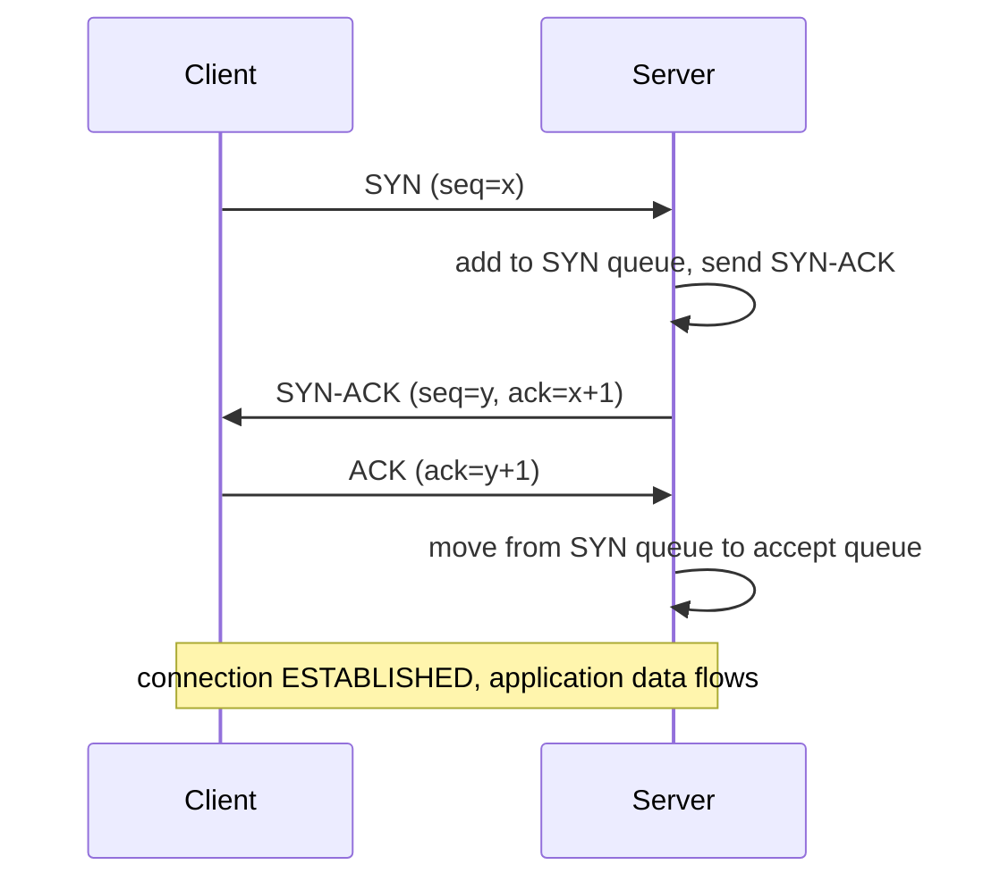

# Section 5: Networking Stack

This section covers the Linux kernel networking stack end-to-end — from a NIC interrupt through
sockets and TCP/IP, network namespaces, netfilter/iptables, and the emerging eBPF/XDP data path. This
is the material behind "why is this connection slow," "why is this packet being dropped," and
container/CNI networking interview questions.

## Subtopic Index
- [Linux Network Stack Overview (NIC to socket)](#linux-network-stack-overview-nic-to-socket)
- [Network Namespaces](#network-namespaces)
- [Netfilter and iptables/nftables](#netfilter-and-iptablesnftables)
- [Conntrack](#conntrack)
- [Sockets (TCP/UDP/UNIX domain sockets)](#sockets-tcpudpunix-domain-sockets)
- [Socket Buffers (sk_buff)](#socket-buffers-sk_buff)
- [TCP/IP Stack Internals (three-way handshake, congestion control)](#tcpip-stack-internals-three-way-handshake-congestion-control)
- [TCP State Machine](#tcp-state-machine)
- [TCP Congestion Control Algorithms (Reno, Cubic, BBR)](#tcp-congestion-control-algorithms-reno-cubic-bbr)
- [UDP Internals](#udp-internals)
- [Routing Tables and Policy Routing](#routing-tables-and-policy-routing)
- [ARP](#arp)
- [Network Interfaces (veth, bridge, bond, vlan, macvlan, ipvlan)](#network-interfaces-veth-bridge-bond-vlan-macvlan-ipvlan)
- [Network Namespaces and virtual ethernet pairs](#network-namespaces-and-virtual-ethernet-pairs)
- [DNS Resolution (resolv.conf, nsswitch, systemd-resolved)](#dns-resolution-resolvconf-nsswitch-systemd-resolved)
- [Network Interface Statistics](#network-interface-statistics)
- [ethtool and NIC offloading (checksum, TSO, GRO)](#ethtool-and-nic-offloading-checksum-tso-gro)
- [eBPF and XDP for networking](#ebpf-and-xdp-for-networking)
- [Traffic Control (tc, qdisc)](#traffic-control-tc-qdisc)
- [Load Balancing at L4/L7](#load-balancing-at-l4l7)

---

## Linux Network Stack Overview (NIC to socket)

The Linux network stack is a layered pipeline that moves a packet from physical wire to an
application's socket buffer (and back), and its architecture directly mirrors the OSI/TCP-IP
conceptual layering while adding real kernel-specific mechanics at every stage. A packet arrives at the
NIC, which uses DMA to write it directly into a pre-allocated ring buffer in host memory without CPU
involvement, then raises a hardware interrupt; the driver's interrupt handler does minimal work
(acknowledging the interrupt, scheduling further processing) and hands off to NAPI (New API), the
polling-based mechanism that lets the driver switch from pure interrupt-per-packet handling (which
would overwhelm the CPU with interrupts under high packet rates) to a poll loop that drains the ring
buffer in batches during a softirq context — this interrupt-to-polling hybrid is exactly what allows
Linux to sustain high packet-per-second rates without interrupt overhead alone dominating CPU time.
Once dequeued from the ring buffer, each packet is wrapped in an `sk_buff` (socket buffer, the
universal packet-representation structure used throughout the entire stack) and handed to the network
stack proper: the link layer strips the Ethernet header, the network layer (IPv4/IPv6) processes and
validates the IP header, potentially consults netfilter hooks (PREROUTING) and the routing subsystem
to decide whether the packet is destined locally or should be forwarded, and if local, the transport
layer (TCP/UDP) processes the corresponding header, matches the packet against a listening/connected
socket via a hash lookup keyed by the 4-tuple (source/destination IP and port), and finally appends
the payload to that socket's receive buffer, waking any process blocked in `read()`/`recv()`/`epoll()`
waiting on it. The reverse path for transmission is conceptually symmetric but driven by the
application calling `send()`/`write()`, flowing down through the transport and network layers (each
adding its own header), through any netfilter OUTPUT/POSTROUTING hooks, into the queuing discipline
(`qdisc`) layer for traffic shaping/prioritization, and finally into the driver's transmit ring for
the NIC to actually put on the wire.

```
   NIC (DMA into ring buffer) → hardirq → NAPI poll (softirq) → sk_buff allocated
        │
        ▼
   Link layer (Ethernet) → Network layer (IP, netfilter PREROUTING/routing decision)
        │
        ▼
   Transport layer (TCP/UDP) → socket lookup (4-tuple hash) → socket receive buffer
        │
        ▼
   Application wakes from read()/recv()/epoll_wait()
```

### Key commands
```
ethtool -S eth0 | grep -i drop      # driver-level packet drop counters
cat /proc/net/softnet_stat            # per-CPU NAPI poll/backlog statistics
ss -s                                  # socket summary across all protocols
tcpdump -i eth0 -nn port 443             # capture packets at the link layer for direct inspection
```

## Network Namespaces

A network namespace (`CLONE_NEWNET`) gives a process (or group of processes) its own completely
independent network stack — its own set of network interfaces (other than physical NICs, which belong
to exactly one namespace at a time but can be moved between them), its own routing table, its own
netfilter/iptables rule set, its own set of listening sockets and port space, and even its own
`/proc/net` view — such that two processes in different network namespaces can both bind to port 80
without any conflict, since each namespace's port space is entirely separate. This is the foundational
primitive underlying every container networking model: a container runtime creates a new network
namespace per container (or per pod, in Kubernetes, where all containers in a pod deliberately *share*
one network namespace to achieve the "localhost between containers in a pod" property), gives it a
veth pair (see below) as its sole connection to the outside world, assigns it an IP address, and sets
up routing/NAT rules so the isolated namespace can still reach and be reached by the rest of the
network despite having no direct access to any physical interface itself. The default/host network
namespace (the one `init`/PID 1 starts in) initially owns every physical network interface; moving an
interface into a different namespace (`ip link set <iface> netns <pid>`) makes it exclusively visible
and usable from within that namespace and invisible from the original one, which is exactly how SR-IOV
virtual functions or dedicated physical interfaces can be handed directly to a specific container or
VM for near-native network performance, bypassing the overhead of virtual interfaces and NAT entirely.
Because a network namespace is a first-class kernel object independent of any specific process,
namespaces can be created and manipulated directly via the `ip netns` tooling without necessarily
being tied to a running container at all, which is invaluable for testing/reproducing complex
networking scenarios (simulating multiple isolated hosts) on a single machine.

### Key commands
```
ip netns add mynet                    # create a new, named network namespace
ip netns exec mynet ip addr             # run a command inside a specific network namespace
ip link set veth0 netns mynet            # move an interface into a namespace
lsns -t net                               # list all network namespaces currently in use on the system
```

## Netfilter and iptables/nftables

Netfilter is the kernel's packet-filtering and manipulation framework, implemented as a series of
well-defined hook points throughout the network stack (`PREROUTING`, `INPUT`, `FORWARD`, `OUTPUT`,
`POSTROUTING`) where registered callback functions can inspect, modify, accept, drop, or redirect a
packet as it passes through — `iptables` (and its modern successor `nftables`) are userspace tools
that configure rules processed at these hooks, not the packet-filtering engine itself, which lives
entirely in the kernel. `PREROUTING` fires immediately after a packet is received, before any routing
decision is made (the natural place for destination NAT/DNAT, since you want to rewrite the
destination before the kernel decides where to route it); `INPUT` fires for packets whose routing
decision determined they're destined for a local socket on this host; `FORWARD` fires instead for
packets being routed *through* this host to somewhere else (relevant for routers/gateways, and for
container networking where the host acts as a router between the container's namespace and the
outside world); `OUTPUT` fires for packets generated locally by this host itself; and `POSTROUTING`
fires just before a packet leaves the host, the natural place for source NAT/SNAT/masquerading since
by this point the routing decision (and thus which outbound interface/source IP to use) is already
final. `iptables` organizes rules into chains (one per hook, plus user-defined chains) within tables
(`filter` for basic accept/drop decisions, `nat` for address translation, `mangle` for packet
header modification, `raw` for connection-tracking exemptions), evaluated top-to-bottom until a
rule matches and its target (`ACCEPT`, `DROP`, `REJECT`, `DNAT`, `SNAT`, jump to another chain) is
applied. `nftables` is the modern replacement, unifying what used to be separate `iptables`/
`ip6tables`/`arptables`/`ebtables` tools into one framework with a more expressive rule syntax, more
efficient rule evaluation (using a decision-tree/set-based lookup rather than iptables' strictly
linear per-rule matching for large rule sets), and atomic ruleset replacement — most distributions
now implement even their `iptables` command as a compatibility shim translating to the underlying
`nftables` kernel subsystem, since the older `iptables`-specific kernel code path has been largely
supplanted.

```
Packet arrives → PREROUTING (DNAT here) → routing decision
                                              │
                       ┌──────────────────────┴──────────────────────┐
                       ▼ (destined for this host)                    ▼ (destined elsewhere)
                    INPUT (filter)                                FORWARD (filter)
                       │                                              │
                 local socket                                  POSTROUTING (SNAT here) → out to network
                       │
              locally-generated reply → OUTPUT (filter) → POSTROUTING (SNAT here) → out to network
```

### Key commands
```
iptables -L -n -v --line-numbers      # list all filter-table rules with packet/byte counters
iptables -t nat -L -n -v                # list NAT-table rules (DNAT/SNAT/MASQUERADE)
nft list ruleset                          # list the full nftables ruleset (modern equivalent)
conntrack -L                               # list currently tracked connections (see Conntrack below)
```

## Conntrack

Connection tracking is the kernel subsystem that maintains state about every network flow passing
through a host — for each connection, it records the observed 4-tuple in both the original and
(if NAT is applied) translated direction, the protocol-specific state (TCP handshake progress, UDP
"connection" pseudo-state based on timeouts since UDP itself is stateless), and timers governing how
long an idle entry is retained before expiring — and this state is precisely what makes stateful
firewalling and NAT possible at all. Without conntrack, a stateless firewall rule can only match on
static packet fields (source/destination address and port, protocol) and cannot express "allow
inbound packets that are part of a connection *this host itself initiated* outbound," which is the
single most common and important firewall rule pattern in practice (`ESTABLISHED,RELATED` matching in
iptables/nftables rules is a direct consultation of conntrack state, not a fresh evaluation of packet
fields). NAT (both SNAT/MASQUERADE and DNAT) is built entirely on top of conntrack: the first packet of
a new connection triggers a new conntrack entry recording both the original address/port tuple and the
translated one, and every subsequent packet of that same connection (in either direction) is
transparently rewritten according to that stored mapping, which is exactly how a home router's single
public IP can multiplex many internal hosts' simultaneous connections (each tracked as a distinct
conntrack entry with a uniquely-chosen translated port), and exactly the mechanism Kubernetes's
iptables/IPVS-mode `kube-proxy` relies on to make a single Service IP transparently load-balance across
many backend pod IPs. Conntrack table exhaustion (`nf_conntrack: table full, dropping packet` in
kernel logs) is a real, common production failure mode on hosts handling very high connection
churn/rates — once the table (sized by `nf_conntrack_max`) is full, new connections are simply dropped
until existing entries expire, which is why high-connection-rate hosts (load balancers, NAT gateways,
busy Kubernetes nodes) need this limit tuned appropriately above default values, alongside tuned
timeout values (`nf_conntrack_tcp_timeout_established` and friends) to expire stale entries faster
under sustained high churn.

### Key commands
```
conntrack -L                          # list all currently tracked connections
conntrack -L | wc -l                    # quick count, compare against nf_conntrack_max
cat /proc/sys/net/netfilter/nf_conntrack_max   # current max tracked connections
cat /proc/sys/net/netfilter/nf_conntrack_count  # current tracked connection count
```

## Sockets (TCP/UDP/UNIX domain sockets)

A socket is the kernel-provided endpoint abstraction applications use for network (and local
inter-process) communication, created via the `socket()` syscall specifying an address family
(`AF_INET`/`AF_INET6` for IP networking, `AF_UNIX` for local IPC) and a type (`SOCK_STREAM` for
connection-oriented, reliable, ordered byte-stream delivery — TCP, or UNIX stream sockets;
`SOCK_DGRAM` for connectionless, unreliable, message-oriented delivery — UDP, or UNIX datagram
sockets). TCP sockets require an explicit connection setup (`connect()` on the client side performing
the three-way handshake, `bind()`+`listen()`+`accept()` on the server side) before data can be
exchanged, and the kernel maintains substantial per-connection state (sequence numbers, congestion
window, retransmission timers) for the connection's entire lifetime. UDP sockets need no connection
setup at all — a `sendto()` call can transmit a datagram to any destination immediately after
`bind()`ing a local port (or even without binding, letting the kernel choose an ephemeral source
port automatically), with no guarantee of delivery, ordering, or duplicate suppression, pushing all
of that responsibility to the application if it's needed (which is exactly why protocols built on
UDP, like QUIC or custom real-time media protocols, must reimplement whatever reliability semantics
they actually need rather than inheriting them for free). UNIX domain sockets provide the same
`SOCK_STREAM`/`SOCK_DGRAM` semantics as their network counterparts but for communication strictly
between processes on the same host, addressed by a filesystem path (or an abstract namespace name on
Linux specifically, not backed by any real filesystem path at all) rather than an IP/port — because
they never touch the actual network stack's IP/TCP/UDP processing, UNIX sockets are meaningfully
faster and lower-overhead for local IPC (no checksum computation, no routing lookup, no TCP
state-machine overhead), which is why performance-sensitive local IPC (a web server talking to a local
PHP-FPM/database socket, container runtimes' own control-plane communication) very commonly prefers
UNIX sockets over `localhost` TCP connections specifically for this efficiency gain, alongside the
security benefit of standard filesystem permission bits directly controlling access to the socket
path.

### Key commands
```
ss -tnp                            # TCP sockets with owning process (needs appropriate privilege)
ss -unp                             # UDP sockets with owning process
ss -xp                               # UNIX domain sockets with owning process
strace -e trace=socket,bind,listen,connect,accept ./program   # observe socket lifecycle syscalls live
```

## Socket Buffers (sk_buff)

`sk_buff` ("skb") is the single universal data structure representing a packet as it moves through
every layer of the Linux network stack, from the moment it's received off the wire (or constructed by
an application's `send()` call) until it's either delivered to a socket's receive buffer or
transmitted out a physical interface. Its design deliberately avoids copying packet data as it passes
between layers — each layer (link, network, transport) prepends its own header by adjusting internal
pointers (`head`, `data`, `tail`, `end` marking the boundaries of the allocated buffer and the
currently-valid header/payload region within it) rather than allocating a new buffer and copying
content forward, so a single `sk_buff` allocated once at packet reception keeps the same underlying
memory throughout the packet's entire journey up (or down) the stack, with headers logically
"peeled off" (moving the `data` pointer forward past a consumed header) or "pushed on" (moving it
backward to prepend a new header) purely through pointer arithmetic. Because network processing
frequently needs to reference the same packet from multiple contexts simultaneously (e.g., a copy
queued for retransmission alongside the original being processed further up the stack), `sk_buff`
supports reference-counted cloning (`skb_clone()`) that shares the same underlying data buffer across
multiple `sk_buff` structures while allowing each to have independent header-pointer state, avoiding
an actual data copy unless one of the clones needs to modify shared content (at which point
`skb_copy()`/`pskb_expand_head()` perform a real copy, conceptually similar in spirit to
copy-on-write memory pages, though implemented as an explicit function call rather than a
transparent page-fault mechanism). Managing `sk_buff` allocation efficiently is performance-critical
at high packet rates — the kernel maintains per-CPU caches of pre-allocated `sk_buff` structures
specifically to avoid the allocator overhead of a fresh allocation for every single packet under
sustained high-throughput conditions, and NIC driver features like GRO (Generic Receive Offload,
discussed below) work specifically by merging multiple incoming physical packets into a single larger
`sk_buff` before handing it further up the stack, amortizing per-packet processing overhead across a
larger effective payload.

### Key commands
```
cat /proc/net/softnet_stat          # per-CPU packet processing/backlog statistics related to skb handling
perf record -e skb:kfree_skb -a && perf report   # trace where/why skbs are being freed/dropped (kernel tracepoint)
ethtool -S eth0                       # driver-level skb-adjacent statistics (drops, errors)
```

## TCP/IP Stack Internals (three-way handshake, congestion control)

TCP provides reliable, ordered, connection-oriented byte-stream delivery over an unreliable IP network
layer, and its connection establishment — the three-way handshake — is foundational interview
material. A client sends a `SYN` segment carrying its initial sequence number (ISN, deliberately
randomized per connection for security, historically a mitigation against sequence-number-guessing
connection-hijacking attacks); the server, if willing and able to accept the connection, responds with
a `SYN-ACK` segment carrying both an acknowledgment of the client's ISN+1 and its own randomized ISN;
the client completes the handshake with an `ACK` acknowledging the server's ISN+1, at which point both
sides consider the connection `ESTABLISHED` and application data can flow. The server side of this
handshake involves two distinct queues the kernel maintains per listening socket: the SYN queue (half-
open connections that have received a `SYN` and sent `SYN-ACK` but not yet received the final `ACK`,
sized by `net.ipv4.tcp_max_syn_backlog`) and the accept queue (fully-established connections waiting
for the application to call `accept()` and dequeue them, sized by the `backlog` argument to `listen()`
combined with `net.core.somaxconn`) — a SYN flood attack specifically targets exhausting the SYN
queue with spoofed, never-completed handshakes, which SYN cookies (encoding the necessary connection
state into the cryptographically-verifiable sequence number itself rather than storing it in the SYN
queue at all) defend against by allowing the kernel to avoid maintaining per-half-open-connection state
for unacknowledged SYNs entirely. Beyond connection establishment, TCP's reliability guarantees are
implemented through sequence numbers (every byte of the stream has an implicit position, allowing
reordered segments to be correctly resequenced and gaps to be detected), cumulative and selective
acknowledgments (confirming received data and, with the SACK extension, specifically which
non-contiguous ranges were received when there are gaps, avoiding unnecessary full retransmission of
already-received data), and retransmission timers (an adaptively-computed RTO — retransmission
timeout, based on measured round-trip-time samples and their variance — that triggers retransmission
of unacknowledged data if no ACK arrives in time). Congestion control (discussed in detail in its own
entry below) is TCP's mechanism for adapting its sending rate to avoid overwhelming the network path's
actual available capacity, working in concert with (but conceptually distinct from) flow control
(the receiver's advertised window, preventing a sender from overwhelming the *receiver's* buffer
capacity specifically, independent of network conditions).



### Key commands
```
ss -tin                              # per-connection TCP internals: RTT, cwnd, retransmits, congestion algo
cat /proc/sys/net/ipv4/tcp_max_syn_backlog   # SYN queue size limit
cat /proc/sys/net/core/somaxconn               # accept queue size limit (system-wide cap)
tcpdump -nn 'tcp[tcpflags] & (tcp-syn|tcp-ack) != 0'   # capture just handshake-relevant segments
```

## TCP State Machine

Every TCP connection endpoint progresses through a well-defined state machine, and being able to
name and reason about every state is a classic, high-value interview topic because so many real
production issues manifest as connections stuck in an unexpected state. `LISTEN` is a server socket
waiting for incoming connections. `SYN_SENT`/`SYN_RECEIVED` are transient handshake-in-progress
states on the client and server respectively. `ESTABLISHED` is the normal, active data-transfer
state. When a side decides to close the connection, the active closer sends a `FIN` and enters
`FIN_WAIT_1`, transitioning to `FIN_WAIT_2` once that FIN is acknowledged; the passive side, upon
receiving a `FIN`, enters `CLOSE_WAIT` (meaning it has learned the peer wants to close but has *not*
yet itself called `close()`, an application-controlled transition — a large, growing number of
sockets stuck in `CLOSE_WAIT` is a classic symptom of an application bug that never actually closes its
end of a connection after being told the peer closed theirs, gradually leaking file descriptors),
eventually sending its own `FIN` and entering `LAST_ACK` until that final FIN is acknowledged, fully
closing. The active closer, after receiving the peer's final `FIN` and acknowledging it, enters
`TIME_WAIT` for a duration of twice the maximum segment lifetime (2MSL, commonly around 60 seconds
total) before finally transitioning to `CLOSED` — this deliberately long wait exists for two important
reasons: ensuring the final `ACK` is not lost (if it were, the peer would retransmit its `FIN`, and the
connection needs to still be around, in `TIME_WAIT`, to correctly re-acknowledge it rather than
responding with a confusing "connection doesn't exist" reset) and ensuring any old, delayed/duplicate
segments from this now-closed connection have fully drained from the network before the same
4-tuple could potentially be reused for a brand-new connection, avoiding confusion between old and new
data. A large volume of connections in `TIME_WAIT` (very common on high-churn short-lived-connection
servers, like busy HTTP servers or load balancers making many brief outbound connections) can exhaust
the local ephemeral port range available for *new outbound* connections specifically — the standard
mitigations are enabling `SO_REUSEADDR` (allows binding a new listening socket despite existing
`TIME_WAIT` entries occupying the same local port, safe for listening sockets), `net.ipv4.tcp_tw_reuse`
(allows the kernel to safely reuse a `TIME_WAIT` connection's 4-tuple for a new outgoing connection
under specific timestamp-based safety conditions), and, more fundamentally, using persistent/pooled
connections rather than opening a fresh short-lived TCP connection per request in the first place.

```
LISTEN ──(recv SYN)──► SYN_RECEIVED ──(recv ACK)──► ESTABLISHED
                                                          │ (active close: send FIN)
                                                          ▼
                                                     FIN_WAIT_1 ──(recv ACK)──► FIN_WAIT_2
                                                          │ (recv FIN, send ACK)
                                                          ▼
                                                     TIME_WAIT ──(2MSL timeout)──► CLOSED

ESTABLISHED ──(recv FIN, send ACK)──► CLOSE_WAIT ──(app calls close(), send FIN)──► LAST_ACK ──(recv ACK)──► CLOSED
```

### Key commands
```
ss -tan state time-wait | wc -l        # count connections currently in TIME_WAIT
ss -tan state close-wait                # find connections stuck in CLOSE_WAIT (app bug symptom)
cat /proc/sys/net/ipv4/tcp_tw_reuse       # confirm TIME_WAIT reuse policy for new outbound connections
netstat -ant | awk '{print $6}' | sort | uniq -c   # quick state histogram (older tool, still common)
```

## TCP Congestion Control Algorithms (Reno, Cubic, BBR)

Congestion control governs how aggressively a TCP sender increases its transmission rate and how it
reacts to signals of network congestion, and different algorithms make fundamentally different
assumptions about what those signals mean and how to respond. Reno (and its refinements, NewReno),
the classical algorithm, treats packet loss as the primary congestion signal: it grows its congestion
window (`cwnd`, the amount of unacknowledged data allowed in flight) via slow start (roughly doubling
every round-trip) until reaching a threshold or experiencing loss, then switches to linear
(additive-increase) growth, and upon detecting loss (via duplicate ACKs or a retransmission timeout),
multiplicatively halves `cwnd` — the classic "AIMD" (additive-increase, multiplicative-decrease)
sawtooth pattern that keeps overall throughput bounded but reacts somewhat slowly to recover full
bandwidth after any single loss event, and fundamentally conflates any packet loss with network
congestion, which is a poor assumption on networks (like many wireless or satellite links) where loss
can occur for reasons entirely unrelated to congestion. CUBIC, the long-standing Linux default,
addresses Reno's slow window-growth recovery after loss with a cubic (rather than purely linear)
growth function centered around the window size at which the last loss occurred, growing very quickly
right after backing off and then leveling off as it approaches that previous congestion point,
achieving both faster recovery and, notably, growth behavior that is independent of RTT (unlike Reno,
whose linear-increase rate is directly tied to how many round-trips occur per unit time, unfairly
favoring low-RTT flows over high-RTT ones competing for the same bottleneck), making CUBIC
particularly well suited to the high-bandwidth, variable-RTT conditions common on the modern internet
and in data centers. BBR (Bottleneck Bandwidth and Round-trip propagation time), developed at Google
and increasingly deployed as an alternative default, represents a fundamentally different philosophy:
rather than reacting to loss at all as its primary signal, it continuously and actively estimates the
path's actual bottleneck bandwidth and minimum RTT (by periodically probing and modeling delivery rate
over time) and paces its sending rate to match that estimated bottleneck capacity directly, aiming to
keep the network's bottleneck queue nearly empty (minimizing buffering delay, sometimes called
"bufferbloat") rather than deliberately filling queues until loss occurs the way loss-based algorithms
implicitly do — this generally achieves both higher throughput and lower latency on paths with deep
buffers (where loss-based algorithms would otherwise keep filling the buffer until it overflows,
adding substantial queuing delay along the way), though its behavior when competing against
traditional loss-based flows for the same bottleneck has been a genuinely debated fairness topic in
networking research.

### Key commands
```
sysctl net.ipv4.tcp_congestion_control            # currently active default algorithm
sysctl net.ipv4.tcp_available_congestion_control    # algorithms compiled/loaded into this kernel
ss -tin | grep -A1 <connection>                       # per-connection algorithm and cwnd/RTT stats live
echo bbr > /proc/sys/net/ipv4/tcp_congestion_control    # change the default algorithm system-wide
```

## UDP Internals

UDP provides minimal, connectionless, best-effort datagram delivery directly over IP, adding nothing
beyond a small header (source/destination port, length, and an optional checksum) and no
connection state, retransmission, ordering guarantee, or congestion control of its own — every one of
those properties, if an application needs them, must be built at the application layer on top of raw
UDP. This minimalism is precisely UDP's value proposition for specific use cases: DNS (a single
request/response round-trip where TCP's connection setup overhead would be disproportionate for most
queries, though DNS falls back to TCP for responses too large for a single UDP datagram), real-time
media/gaming (where a late-arriving retransmitted packet is often useless anyway — better to drop it
and move on than have TCP's reliable-in-order delivery block newer data behind a retransmission
timer), and increasingly QUIC/HTTP3 (which deliberately reimplements TCP-like reliability and
congestion control *inside* UDP payloads at the application/transport-library level specifically to
escape both TCP's head-of-line blocking behavior at the kernel level and the practical difficulty of
deploying entirely new transport-layer protocols through the pervasive TCP/UDP-only assumptions baked
into middleboxes, firewalls, and NAT devices across the internet). Because UDP has no true
"connection," the kernel's socket-level bookkeeping for a UDP socket is much lighter — a `connect()`
call on a UDP socket is actually just a convenience that fixes a default destination address for
subsequent `send()` calls and filters incoming datagrams to only that peer, not a real handshake — and
conntrack (discussed above) must maintain its own timeout-based pseudo-connection tracking for
firewall/NAT purposes specifically because the protocol itself provides no explicit connection
open/close signal to hook into, unlike TCP's explicit SYN/FIN lifecycle. Because UDP has no
built-in flow or congestion control, a naively-implemented UDP application sending as fast as it can
will happily overwhelm both the receiver's socket buffer (causing the kernel to silently drop
excess incoming datagrams once that buffer, `net.core.rmem_max`-bounded, fills) and any congested
network path in between, with no automatic backoff — this is exactly why real-world UDP-based
protocols that need to be good network citizens (QUIC being the primary modern example) must
deliberately reimplement congestion control themselves rather than getting it for free the way TCP
applications do.

### Key commands
```
ss -unp                              # list UDP sockets with owning processes
cat /proc/net/udp                      # raw kernel view of IPv4 UDP socket table
netstat -su                             # UDP-specific statistics including receive buffer errors/drops
cat /proc/sys/net/core/rmem_max           # maximum socket receive buffer size (relevant to UDP drop behavior)
```

## Routing Tables and Policy Routing

The kernel's routing subsystem decides, for every outgoing (and forwarded) packet, which network
interface and next-hop gateway should handle it, based on the packet's destination address matched
against the routing table using longest-prefix-match (the most specific matching route wins over any
broader, less-specific one, regardless of the order routes were added). A basic routing table
(`ip route show`) contains directly-connected network routes (added automatically when an interface
is configured with an address in that subnet), a default route (`0.0.0.0/0`, the catch-all used when
no more specific route matches, typically pointing at a gateway providing internet/broader-network
access), and any explicitly-configured static or dynamically-learned (via a routing protocol daemon
like BGP/OSPF) routes for specific remote networks. Policy routing extends this basic destination-only
model by supporting multiple independent routing tables (`ip rule` entries determine which table
applies to a given packet, matched not just on destination but potentially on source address, incoming
interface, fwmark set by netfilter, or other packet attributes) — this is the mechanism behind
scenarios like "route traffic from this specific source subnet out a different gateway/interface than
the default," multi-WAN load balancing/failover setups, or VPN split-tunneling configurations where
only specific traffic should be routed through the tunnel interface while everything else uses the
normal default route, none of which a single flat destination-based routing table alone could express.
Every routing decision is cached historically via a route cache (removed from modern kernels in favor
of a more efficient FIB — Forwarding Information Base — trie lookup structure directly, since the old
route cache became a scalability and security liability, specifically vulnerable to cache-exhaustion
denial-of-service attacks from traffic with highly varied destination addresses), and understanding
that modern route lookups are a direct trie traversal rather than a cache lookup is a subtle but real
distinction from older networking material that still describes the now-removed route cache as
current behavior.

### Key commands
```
ip route show                        # main routing table
ip route get 8.8.8.8                   # show exactly which route/interface would be used for a destination
ip rule show                            # policy routing rules determining which table applies to what traffic
ip route show table 100                  # inspect a specific non-main routing table used by policy routing
```

## ARP

Address Resolution Protocol solves the problem of mapping an IP address (a logical, layer-3 address)
to the MAC address (the physical, layer-2 hardware address) actually needed to deliver a frame on a
local Ethernet segment — IP routing decisions determine *which* next-hop IP to send a packet toward,
but the actual Ethernet frame carrying that packet must be addressed to a specific MAC address on the
local link, and ARP is the mechanism that discovers this mapping. When a host needs to send to an IP
address on its local subnet (or to its default gateway's IP, for anything beyond the local subnet)
and doesn't already have a cached mapping, it broadcasts an ARP request ("who has this IP address,
tell me") to the entire local Ethernet segment; the host owning that IP address responds directly
with an ARP reply containing its MAC address, and the requesting host caches this mapping (the ARP
cache, with a limited lifetime after which entries expire and must be re-resolved) to avoid repeating
this broadcast for every single subsequent packet to the same destination. ARP is purely a local-
segment protocol — it never crosses a router/gateway boundary, which is exactly why every router hop
along a packet's path performs its own independent ARP resolution (or the IPv6 equivalent, Neighbor
Discovery Protocol) for the *next* hop specifically, rather than the original sender needing to somehow
resolve the MAC address of the ultimate destination potentially many networks away. ARP's lack of any
authentication mechanism (any host on the local segment can claim to own any IP address by simply
replying to, or even unsolicited-ly announcing, an ARP mapping) is the basis of ARP spoofing/poisoning
attacks, where a malicious host on the local network tricks other hosts into caching an incorrect
IP-to-MAC mapping pointing at the attacker's own MAC address, enabling man-in-the-middle interception
of traffic intended for the spoofed IP — a genuinely important local-network security consideration
addressed by switch-level protections (Dynamic ARP Inspection on managed switches) rather than
anything the ARP protocol itself provides.

### Key commands
```
ip neigh show                        # current ARP (and IPv6 neighbor discovery) cache
arping -I eth0 192.168.1.1              # send an explicit ARP request and measure response
tcpdump -i eth0 arp                       # capture ARP traffic directly for diagnosis
ip neigh flush all                          # clear the ARP/neighbor cache (diagnostic use)
```

## Network Interfaces (veth, bridge, bond, vlan, macvlan, ipvlan)

Beyond physical NICs, Linux supports a rich set of virtual network interface types, each solving a
distinct connectivity/topology problem, and correctly distinguishing them is essential container-
networking interview material. A veth (virtual Ethernet) pair is always created as two connected
endpoints — anything transmitted into one end appears immediately at the other, conceptually like a
virtual patch cable — and is the standard way to connect a container's isolated network namespace to
the host or to a bridge: one end lives inside the container's namespace (appearing as its `eth0`), the
other end remains in the host namespace, plugged into a bridge. A bridge is a virtual, kernel-
implemented layer-2 switch: multiple interfaces (physical NICs, veth pair host-side ends, or other
virtual interfaces) can be attached as ports on a bridge, and the bridge learns MAC address-to-port
associations by observing traffic, forwarding frames only out the correct port rather than broadcasting
to all — this is exactly the mechanism Docker's default bridge network and many Kubernetes CNI plugins
use to connect multiple containers' veth pairs into one shared local layer-2 network on a host. A bond
(link aggregation) combines multiple physical interfaces into one logical interface for redundancy
and/or increased throughput, operating in different modes (active-backup for pure failover,
802.3ad/LACP for genuine load-balanced aggregation requiring matching switch-side configuration). A
VLAN (802.1Q) interface tags traffic with a VLAN ID, allowing a single physical interface/cable to
carry multiple logically-isolated layer-2 broadcast domains simultaneously, distinguished purely by
the tag in each frame's header rather than requiring separate physical cabling per isolated network.
macvlan lets you create multiple virtual interfaces on top of one physical interface, each with its
own distinct MAC address, making each macvlan sub-interface appear as an entirely independent, directly
network-visible host from the perspective of the physical network/switch (useful when containers need
to appear as genuinely separate hosts with their own MAC-level identity on the LAN, though this
requires the physical switch to tolerate multiple MACs behind one physical port, and doesn't allow the
host itself to communicate directly with macvlan sub-interfaces created from its own physical NIC due
to a deliberate kernel restriction). ipvlan is a closely related alternative that instead shares a
single MAC address across all its sub-interfaces while giving each its own IP address, distinguishing
traffic at layer 3 rather than layer 2 — a useful choice specifically when the surrounding network
infrastructure restricts the number of MAC addresses allowed per physical switch port, a real
constraint in some virtualized/cloud environments that macvlan would otherwise run afoul of.

### Key commands
```
ip link add veth0 type veth peer name veth1     # create a connected veth pair
brctl addif br0 eth0  /  ip link set eth0 master br0   # attach an interface to a bridge
cat /proc/net/bonding/bond0                        # bonding driver status and mode
ip link add link eth0 name eth0.100 type vlan id 100   # create a VLAN sub-interface
ip link add link eth0 name macvlan0 type macvlan mode bridge   # create a macvlan interface
```

## Network Namespaces and virtual ethernet pairs

Combining the two primitives above — network namespaces and veth pairs — is precisely how every
container networking model on Linux actually achieves per-container network isolation while still
providing connectivity, and walking through this construction explicitly is a very common practical
interview exercise. To give a container its own isolated network stack while still connecting it to
the outside world, a container runtime: creates a new network namespace for the container; creates a
veth pair, with one end (say `veth-host`) remaining in the host's default namespace and the other end
(`veth-container`, renamed to `eth0` once moved) moved into the container's namespace; attaches the
host-side end to a bridge shared by all containers on that host (or, for CNI plugins using a more
direct point-to-point approach, assigns the host-side end its own IP and adds explicit routes instead
of using a bridge); assigns an IP address to the container-side end from whatever subnet the runtime
manages; and finally configures routing (a default route inside the container's namespace pointing at
the bridge/gateway) and, typically, netfilter SNAT/MASQUERADE rules on the host so that outbound
traffic from the container's private IP appears to originate from the host's own routable IP when
leaving the physical network, since the container's IP is often only meaningful within that host's
private bridge network and not independently routable across the wider network. Kubernetes's "pod
gets a real, cluster-routable IP" model (in CNI plugins like Calico, Cilium, or the AWS VPC CNI)
differs from this default-Docker-bridge picture specifically by making the container's IP genuinely
routable across the whole cluster's network (via a cluster-wide overlay network, direct routing between
nodes, or, in the case of the AWS VPC CNI, literally allocating real VPC-routable IP addresses
directly to pods) rather than relying on per-host NAT/masquerading — the underlying veth-pair-into-
namespace construction remains conceptually the same, but the surrounding routing/NAT policy differs
substantially, which is exactly the distinction interviewers probe for when asking "how does pod
networking actually work" beyond a surface-level "CNI handles it" answer.

### Key commands
```
ip netns exec container1 ip addr show eth0     # confirm a container's veth-based eth0 configuration
ip link show type veth                           # list all veth interfaces on the host
bridge link show                                   # show which interfaces are attached to which bridge
iptables -t nat -L POSTROUTING -n -v                # confirm SNAT/MASQUERADE rules for outbound container traffic
```

## DNS Resolution (resolv.conf, nsswitch, systemd-resolved)

DNS resolution on a Linux host is not a single monolithic mechanism but a configurable chain governed
primarily by two files/subsystems working together. `/etc/nsswitch.conf`'s `hosts:` line determines
the overall *order* of name-resolution sources to consult — commonly something like `files dns`,
meaning `/etc/hosts` is checked first (allowing local static overrides to take precedence over any
network-based lookup) before falling through to actual DNS queries — and can include additional
sources like `mdns` (multicast DNS, for `.local` hostname resolution on local networks) or `nis` in
more specialized environments. `/etc/resolv.conf` configures the actual DNS resolution behavior once
the chain reaches the `dns` source: `nameserver` entries list which DNS resolver(s) to query,
`search`/`domain` entries configure automatic domain-suffix appending for unqualified hostnames (so
typing just `myhost` can automatically try `myhost.corp.example.com` based on the configured search
domain), and `options` can tune retry counts, timeouts, and resolution behavior. On modern systemd-
based distributions, `systemd-resolved` inserts itself as a local caching, forwarding DNS stub resolver
— `/etc/resolv.conf` is typically replaced with a symlink pointing at a stub file managed by
`systemd-resolved` itself (`127.0.0.53` as the "nameserver," a loopback stub listener), and
`systemd-resolved` handles actually querying upstream DNS servers (which may differ per network
interface, a genuinely useful feature for hosts with multiple active network connections needing
different DNS configuration per interface, such as a VPN-provided internal DNS domain alongside a
regular ISP-provided one), caching results, and optionally validating DNSSEC signatures — a design
that has occasionally caused confusion/incidents precisely because naively editing `/etc/resolv.conf`
directly on such a system either has no effect (overwritten back by `systemd-resolved`) or breaks
resolution entirely if the symlink is replaced with a static file that no longer matches what
`systemd-resolved` expects to manage. Applications performing name resolution almost universally go
through glibc's `getaddrinfo()`/`gethostbyname()` library functions (or their language runtime's
equivalent), which are themselves responsible for consulting NSS (Name Service Switch) according to
`nsswitch.conf`'s configured order — meaning the actual DNS query behavior an application experiences
is the composite result of glibc's NSS dispatch, `/etc/hosts` contents, and whatever DNS resolver
(potentially `systemd-resolved`'s local stub, or a directly-configured external resolver) actually
receives and answers the query.

### Key commands
```
cat /etc/nsswitch.conf | grep hosts       # resolution source order
cat /etc/resolv.conf                        # configured nameservers/search domains (or systemd-resolved stub)
resolvectl status                            # (systemd-resolved) per-interface DNS configuration and stats
getent hosts example.com                      # perform a resolution exactly as NSS/glibc would for an application
dig example.com                                # direct DNS query bypassing NSS/local caching, for comparison
```

## Network Interface Statistics

Every network interface maintains a set of cumulative counters the kernel updates as packets are
processed, exposed both via `/proc/net/dev` (a simple, universally-available summary) and via
`ethtool -S` (much more detailed, driver-specific counters exposing internals like ring buffer
overruns, checksum errors, and per-queue statistics not visible in the generic `/proc/net/dev` view).
The core generic counters — RX/TX packets, bytes, errors, and drops — are the essential starting point
for any network troubleshooting: a nonzero and growing "errors" counter typically indicates a
hardware/link-layer problem (bad cabling, a failing NIC, duplex mismatch with the connected switch
port), while "drops" specifically (distinct from errors) usually indicates the kernel or driver
deliberately discarded packets due to resource exhaustion — an interface's receive ring buffer filling
faster than the CPU can drain it via NAPI polling (visible more precisely in `/proc/net/softnet_stat`'s
per-CPU backlog-drop column), or a socket's receive buffer being full because the application isn't
reading fast enough (visible per-socket in `ss -tnp`'s `Recv-Q` growing persistently rather than
draining). Distinguishing "the NIC/driver dropped this before it ever reached the IP stack" from "the
IP stack delivered it but the destination socket's buffer was full" from "netfilter/iptables explicitly
dropped it via a rule" requires checking different counters at different layers (`ethtool -S` for the
first, `ss`/`nstat`'s per-protocol counters for the second, and `iptables -L -v`'s per-rule byte/packet
counters, or explicit `LOG`/`nflog` targets, for the third) — a common interview trap is assuming a
single "packet drop counter" exists somewhere that explains all packet loss, when in reality Linux
tracks drops independently and non-overlappingly at several distinct layers, and correctly diagnosing
loss requires checking each one systematically rather than any single command in isolation.

### Key commands
```
cat /proc/net/dev                     # basic per-interface RX/TX packet/byte/error/drop counters
ethtool -S eth0                         # detailed, driver-specific interface statistics
cat /proc/net/softnet_stat                # per-CPU NAPI backlog/drop statistics
nstat -az | grep -i drop                    # detailed protocol-layer (IP/TCP/UDP) drop/error counters
```

## ethtool and NIC offloading (checksum, TSO, GRO)

Modern NICs implement substantial protocol-processing logic directly in hardware specifically to
reduce CPU load for high-throughput networking, and `ethtool` is the standard tool for inspecting and
controlling these offload features. Checksum offload lets the NIC hardware compute (on transmit) and
verify (on receive) IP/TCP/UDP checksums directly in silicon rather than requiring the CPU to walk the
entire packet payload computing a checksum in software — a substantial CPU savings at high packet
rates, since checksum computation is proportional to payload size and would otherwise consume
meaningful CPU cycles per packet purely for this one bookkeeping task. TSO (TCP Segmentation Offload)
lets the kernel hand the NIC a single large "superpacket" (up to 64KB) that the *hardware* then splits
into properly-sized, individually-headed Ethernet frames respecting the path MTU, rather than the CPU
itself performing that segmentation in software — since per-packet processing overhead (interrupt
handling, header construction, `sk_buff` allocation) is largely fixed regardless of packet size,
letting the NIC handle segmentation of one large logical send into many wire-sized frames dramatically
reduces the *effective* per-byte CPU overhead for high-throughput transmission. GRO (Generic Receive
Offload) works in the opposite direction on receive: the kernel (in software, working with hardware
assistance where available) opportunistically merges multiple incoming physical packets that are part
of the same logical TCP stream into one larger `sk_buff` before handing it further up the stack,
similarly amortizing per-packet processing overhead across a larger effective unit — this is
specifically why GRO must sometimes be disabled for accurate packet-level troubleshooting or for
workloads (like software routers/forwarders) that genuinely need to see and act on individual
original packets rather than a coalesced merged view, since GRO can change what `tcpdump` or a
forwarding decision actually observes compared to the packets that arrived on the wire. While these
offloads are overwhelmingly beneficial for typical server/endpoint traffic, they are frequently
disabled specifically on interfaces used for packet capture/analysis, software-based routing/NAT
gateways, or certain virtualization/bridging scenarios where the offload's packet-merging/splitting
behavior interferes with correct forwarding or accurate inspection, making `ethtool -K` (to toggle
individual offload features) a genuinely important troubleshooting and configuration tool, not just
a performance-tuning one.

### Key commands
```
ethtool -k eth0                       # show current state of all offload features for an interface
ethtool -K eth0 gro off                 # disable GRO (e.g., for accurate packet capture)
ethtool -K eth0 tso off gso off          # disable segmentation offloads (e.g., for software forwarding paths)
ethtool -i eth0                           # driver/firmware version info, useful when offload bugs are suspected
```

## eBPF and XDP for networking

eBPF (extended Berkeley Packet Filter) lets verified, sandboxed programs be loaded into the kernel and
attached to a wide variety of hook points — including deep in the networking stack — without writing
a traditional kernel module, executed by an in-kernel JIT-compiled virtual machine with a strict
verifier ensuring the program cannot crash the kernel, loop unboundedly, or access memory outside its
permitted bounds, which is precisely what makes eBPF safe enough to allow (relatively) unprivileged,
dynamically-loadable custom logic to run directly in kernel context, unlike a traditional kernel module
which runs with full, unverified privilege. For networking specifically, eBPF programs can attach at
several distinct points along the packet path, each offering a different performance/flexibility
trade-off: TC (traffic control) hooks let eBPF programs process packets after they've already been
allocated as `sk_buff`s and passed some way into the stack, offering full access to already-parsed
packet/socket context at a moderate performance cost; socket-level eBPF programs can influence load
balancing decisions or filter/redirect at the socket layer (this is exactly the mechanism Cilium's
"socket-level load balancing" uses to redirect a container's outbound Service-IP-destined traffic
directly to a backend pod's IP without needing a full DNAT/conntrack round-trip through the traditional
netfilter path). XDP (eXpress Data Path) is the earliest, fastest hook point available — an eBPF
program attached via XDP runs directly in the NIC driver's receive path, before an `sk_buff` is even
allocated, operating on raw packet data straight out of the DMA ring buffer, letting it make an
extremely fast pass/drop/redirect decision (including redirecting a packet straight back out an
interface, or into another CPU's processing queue) with far lower per-packet overhead than anything
further up the stack, which is exactly why XDP is the technology of choice for line-rate DDoS
mitigation (dropping malicious traffic before the kernel spends any further resources allocating
`sk_buff` structures or running it through netfilter) and for extremely high-performance load
balancers (Cilium and Meta/Facebook's Katran being prominent real-world examples) that need to make
forwarding decisions at multi-million-packets-per-second rates that traditional iptables-based
processing simply cannot sustain. The broader trend eBPF/XDP represents — replacing iptables-based
Kubernetes service routing and network policy enforcement (as Cilium does) with eBPF programs attached
at these various hook points — is a direct response to iptables' linear rule-evaluation cost scaling
poorly with the very large, frequently-changing rule sets a large Kubernetes cluster's Service/
NetworkPolicy implementation naturally generates.

### Key commands
```
bpftool prog list                     # list all currently loaded eBPF programs
ip link show eth0                       # confirm an XDP program is attached (shown in link details)
bpftool net show                          # show eBPF programs attached to network hooks (XDP, TC) system-wide
bpftrace -e 'kprobe:tcp_drop { printf("dropped\n"); }'   # ad-hoc tracing example using bpftrace
```

## Traffic Control (tc, qdisc)

Traffic control is the kernel subsystem governing how outbound packets are queued, scheduled,
shaped, and potentially dropped on their way out an interface, implemented through queueing
disciplines ("qdiscs") that sit between the network stack proper and the driver's actual transmit
ring. The default qdisc on most interfaces (`pfifo_fast`, or increasingly `fq_codel` on modern
distributions) does simple, largely unshaped FIFO-with-basic-priority queuing — sufficient for the
common case where the underlying link isn't a genuine bottleneck requiring active management — but
`tc` lets an administrator replace this with far more sophisticated disciplines for specific needs:
`tbf` (token bucket filter) enforces a hard rate limit, useful for capping a specific interface or
traffic class's bandwidth consumption; `htb` (hierarchical token bucket) allows a tree of nested rate
limits and priorities, letting you express policies like "this VM/container gets a guaranteed minimum
bandwidth but can burst up to a higher ceiling if spare capacity exists, and multiple classes compete
fairly for that spare capacity according to configured weights" — the standard mechanism behind
network QoS/bandwidth-limiting in virtualization and container platforms; and `fq_codel` (fair queuing
with controlled delay) combines per-flow fair queuing (preventing one high-volume flow from starving
others sharing the same link) with an active queue management algorithm (CoDel) specifically designed
to combat bufferbloat by detecting and proactively dropping/marking packets when queuing delay grows
excessive, rather than passively letting a queue grow arbitrarily deep before any signal reaches the
sender to slow down. Beyond simple rate-limiting, `tc`'s classifier/filter mechanism (`tc filter`,
matching on packet fields similarly to netfilter rules, or directly integrating with eBPF programs for
arbitrarily complex classification logic) lets different traffic be sorted into different qdisc
classes with independent shaping policies, which is exactly the mechanism behind sophisticated
multi-tenant bandwidth isolation (ensuring one noisy container/VM cannot monopolize a shared host's
network capacity at the expense of others) and behind network emulation tooling (`tc qdisc add ...
netem` deliberately injecting artificial latency, jitter, packet loss, or reordering for realistic
testing of how an application behaves under degraded network conditions).

### Key commands
```
tc qdisc show dev eth0                # current queueing discipline configuration for an interface
tc qdisc add dev eth0 root netem delay 100ms loss 1%   # inject artificial latency/loss for testing
tc class show dev eth0                  # show HTB/hierarchical bandwidth classes, if configured
tc -s qdisc show dev eth0                 # show qdisc statistics including drops, useful for diagnosing shaping issues
```

## Load Balancing at L4/L7

Load balancing distributes incoming traffic across multiple backend servers, and the layer at which
this happens fundamentally determines both what information the load balancer can act on and how much
per-connection state and processing overhead it incurs. Layer 4 (transport-layer) load balancing makes
its distribution decision based purely on connection-level information (source/destination IP and
port, protocol) without inspecting or understanding any application-layer content at all — it can be
implemented efficiently at very high throughput, including via pure kernel-space mechanisms like IPVS
(IP Virtual Server, a kernel module implementing several load-balancing algorithms directly in the
network stack, avoiding any userspace proxying of the actual data path entirely — a connection's
packets are simply rewritten/forwarded kernel-side to the chosen backend, and after the initial
connection-establishment decision, all subsequent packets of that same connection are handled via the
exact same kernel-level fast path with essentially no additional per-packet decision-making overhead)
or via eBPF/XDP-based approaches for even higher performance. Kubernetes's `kube-proxy` in IPVS mode is
a direct, real-world application of this: Service-to-backend-Pod routing decisions are made via kernel
IPVS rules, not a userspace proxy process handling every packet. Layer 7 (application-layer) load
balancing understands the actual application protocol (HTTP, gRPC) and can make routing decisions
based on content within it — URL path, HTTP headers, hostname (virtual hosting), cookies (for session
affinity) — enabling far more sophisticated routing policies (canary/blue-green traffic splitting by
header, path-based microservice routing) at the cost of requiring the load balancer to actually
terminate and parse the application protocol, typically via a full userspace proxy (NGINX, Envoy,
HAProxy) sitting in the actual data path for every request rather than a lightweight kernel-level
connection-forwarding decision made once per connection. Modern service mesh architectures (Istio/
Envoy, Linkerd) push L7 load balancing and traffic management down to a sidecar proxy running
alongside every single service instance specifically to get L7-level routing sophistication (retries,
circuit breaking, fine-grained traffic splitting, mutual TLS) applied consistently and transparently
to every service-to-service call, at the real, measurable cost of an extra proxy hop's latency and
resource overhead per call compared to a pure L4 approach — a genuine architectural trade-off between
operational sophistication and raw performance/resource efficiency that's frequently the subject of
system-design interview discussion.

### Key commands
```
ipvsadm -L -n                        # list IPVS load-balancing rules and real-server weights/connections
ss -tnp | grep :443                    # confirm which process is actually terminating L7 connections (proxy vs app)
curl -v -H "Host: canary.example.com" http://lb-ip/    # test L7 host/header-based routing decisions directly
envoy admin (:9901/clusters)            # inspect Envoy's view of backend cluster health/routing (if using a mesh)
```

---

### Interview Questions

**Conceptual/Internals (8)**

1. **Trace a packet's journey from a NIC receiving it to an application reading it via `recv()`.**
   The NIC DMAs the packet into a ring buffer and raises an interrupt; NAPI polling drains the ring in
   a softirq context, wrapping the data in an `sk_buff`. The link layer strips the Ethernet header, the
   IP layer processes the header (consulting netfilter PREROUTING and the routing decision), and if
   locally destined, the transport layer (TCP/UDP) matches the packet to a listening/connected socket
   via a 4-tuple hash lookup and appends the payload to that socket's receive buffer, waking any
   process blocked in `recv()`/`epoll_wait()` on it.

2. **What is the purpose of a network namespace, and how does it relate to container networking?**
   A network namespace gives a process group its own independent network stack — interfaces, routing
   table, netfilter rules, and port space — isolated from the host and other namespaces. Container
   runtimes create one network namespace per container (or per pod in Kubernetes, shared across
   containers in that pod) and connect it to the outside world via a veth pair, which is the
   foundational primitive behind essentially all container networking models.

3. **Explain conntrack's role and why stateful firewalling depends on it.**
   Conntrack tracks the state of every network flow through a host (4-tuple, protocol state, NAT
   translation mapping), which is what allows a stateless-looking rule like "allow established/related
   inbound traffic" to actually work — the kernel checks whether an inbound packet belongs to a
   connection this host itself initiated outbound, rather than evaluating it purely on static packet
   fields. NAT is also built entirely on conntrack, since translated address mappings must be
   remembered and consistently reapplied to every subsequent packet of the same connection.

4. **Why does TCP's `TIME_WAIT` state exist, and why can it become an operational problem?**
   `TIME_WAIT` (lasting roughly 2x maximum segment lifetime) ensures the connection's final ACK isn't
   lost without a mechanism to correctly handle a retransmitted FIN, and ensures old segments from
   the closed connection have fully drained from the network before the same 4-tuple could be reused.
   High-churn, short-lived-connection servers can accumulate enough `TIME_WAIT` sockets to exhaust the
   local ephemeral port range for new outbound connections, typically mitigated via `tcp_tw_reuse`,
   `SO_REUSEADDR`, or switching to persistent/pooled connections.

5. **Compare CUBIC and BBR congestion control at a conceptual level.**
   CUBIC is loss-based: it grows the congestion window aggressively after a loss event using a cubic
   function centered on the previous loss point, treating packet loss as the primary congestion
   signal, with RTT-independent growth behavior favoring fairness across flows with different RTTs.
   BBR instead actively models the path's bottleneck bandwidth and minimum RTT and paces sending to
   match that estimate directly, aiming to avoid filling network buffers (and the resulting queuing
   delay/bufferbloat) that loss-based algorithms implicitly tolerate before backing off.

6. **What's the difference between L4 and L7 load balancing, and what does each cost/gain?**
   L4 load balancing decides purely on connection-level information (IPs/ports/protocol) without
   understanding application content, enabling very high-throughput, low-overhead implementations
   (like kernel-level IPVS) since the decision is made once per connection. L7 load balancing
   understands the application protocol and can route on content (URL path, headers, cookies),
   enabling far more sophisticated policies at the cost of requiring a full userspace proxy to
   terminate and parse every request.

7. **Why does XDP achieve much higher packet-processing performance than a traditional netfilter/
    iptables-based approach?**
    XDP attaches directly in the NIC driver's receive path, operating on raw packet data before an
    `sk_buff` is even allocated, letting it make pass/drop/redirect decisions with minimal per-packet
    overhead. Netfilter/iptables processing happens much further up the already-allocated `sk_buff`
    path, after significant stack processing has already occurred, and its linear rule-evaluation model
    also scales poorly with very large rule sets compared to eBPF's more flexible, efficient
    implementations.

8. **What is the difference between macvlan and ipvlan, and when would you choose one over the
    other?**
    macvlan gives each sub-interface its own distinct MAC address, making it appear as an independently
    addressable host at layer 2, but requires the physical switch to tolerate multiple MACs per port
    and doesn't allow host-to-macvlan-sub-interface communication. ipvlan instead shares one MAC
    address across all sub-interfaces, distinguishing traffic at layer 3 by IP instead, making it the
    better choice when the surrounding network infrastructure restricts the number of MAC addresses
    permitted per switch port.

**Scenario/Troubleshooting (6)**

9. **A load balancer starts refusing new connections under high traffic despite CPU and memory
    headroom. What kernel-level cause should you investigate first?**
    Check `dmesg`/kernel logs for "nf_conntrack: table full" messages and compare
    `nf_conntrack_count` against `nf_conntrack_max` — a high-connection-churn load balancer can exhaust
    the conntrack table well before any CPU/memory limit is reached, silently dropping new connections
    until existing entries expire. Remediation is raising `nf_conntrack_max` and tuning shorter
    established/timeout values appropriately for the actual workload.

10. **An application shows a steadily growing number of sockets in `CLOSE_WAIT`. What does this
    indicate and how do you find the root cause?**
    `CLOSE_WAIT` means the peer has closed its end (sent FIN) but this application hasn't yet called
    `close()` on its own socket — a classic application-level bug where a connection-handling code path
    fails to close a socket after detecting peer closure (often due to an exception path skipping
    cleanup). Use `ss -tan state close-wait` combined with the owning process/thread's stack trace or
    code review of its connection-handling/error paths to find the specific leak.

11. **DNS resolution intermittently fails or is slow only on a specific host, while `/etc/resolv.conf`
    looks correct. What should you check given systemd-resolved is in use?**
    Check `resolvectl status` for the actual per-interface DNS configuration systemd-resolved is using,
    since `/etc/resolv.conf` may just be a stub pointing at `127.0.0.53` and not reflect the real
    upstream servers or their per-interface routing. Also check whether a VPN or additional network
    interface introduced a conflicting or unreachable DNS server into the per-link configuration that
    `resolvectl status` would reveal but a static `/etc/resolv.conf` inspection would not.

12. **After migrating a service to use BBR congestion control, throughput to some clients on high-loss
    networks appears worse than before with CUBIC. What could explain this and how would you
    validate it?**
    BBR is not purely loss-reactive; on genuinely lossy (not congested) links, unrelated loss doesn't
    necessarily trigger the same backoff behavior CUBIC would apply, and depending on BBR version/
    implementation and competing traffic, fairness/interaction with loss-based flows sharing the same
    bottleneck can behave differently than expected. Validate with per-connection `ss -tin` inspection
    comparing cwnd/pacing/retransmit behavior under both algorithms on the same path, and consider
    per-path or per-client-segment algorithm selection if the effect is confirmed and consistent.

13. **A packet capture (`tcpdump`) on a server shows fewer, larger TCP segments than what the client
    claims to have sent. What's the likely explanation?**
    GRO (Generic Receive Offload) is very likely merging multiple physically-received packets of the
    same TCP stream into fewer, larger `sk_buff`s before `tcpdump`'s capture point, showing you the
    post-merge view rather than the original wire-level segments. Disable GRO temporarily
    (`ethtool -K eth0 gro off`) for accurate packet-level capture and analysis.

14. **A newly-deployed container cannot reach the internet, but can successfully ping other
    containers on the same host. What's the systematic troubleshooting sequence?**
    Confirm the container's network namespace has a default route (`ip netns exec <ns> ip route`)
    pointing at the bridge/gateway; confirm the host has IP forwarding enabled
    (`net.ipv4.ip_forward`) and correct SNAT/MASQUERADE rules in the `POSTROUTING` chain for the
    container's subnet; and confirm no netfilter `FORWARD` chain policy is dropping the container's
    outbound traffic by default — same-host container-to-container connectivity working while
    external connectivity fails almost always points at a missing route, missing IP forwarding, or
    missing/incorrect NAT rule rather than a namespace or veth-pair-level problem.

**FAANG-level Deep Dive (6)**

15. **Explain precisely how SYN cookies allow a server to survive a SYN flood without maintaining
    per-half-open-connection state, and what the trade-off is.**
    Instead of storing connection state in the SYN queue when responding with a SYN-ACK, the server
    encodes the necessary state (a hash derived from the connection's 4-tuple, a timestamp, and
    negotiated options) directly into the chosen initial sequence number itself. When the final ACK of
    the handshake arrives, the server can cryptographically reconstruct and validate that encoded state
    from the ACK's acknowledgment number alone, without ever having stored anything in the SYN queue in
    the interim — the trade-off is that some TCP options (like certain window-scaling factors) can't
    be fully preserved in the limited bits available for encoding, slightly degrading connection
    performance for cookie-validated connections compared to a normal handshake.

16. **Why does `sk_buff`'s header-manipulation-via-pointer design avoid data copying between network
    stack layers, and where does this break down?**
    Each layer adjusts the `data` pointer within an already-allocated buffer to logically add/remove
    its own header, rather than allocating a new buffer and copying payload content forward at every
    layer transition, since the underlying memory region is large enough (with reserved headroom) to
    accommodate every layer's header without reallocation. This breaks down when a packet needs
    genuine content modification shared across multiple references (e.g., a cloned `sk_buff` where one
    clone must be independently modified) — at that point `pskb_expand_head()`/`skb_copy()` perform an
    actual data copy, since pointer-only manipulation can no longer safely represent divergent content
    across shared clones.

17. **Why can BBR and loss-based congestion control algorithms (like CUBIC) produce meaningfully
    unfair bandwidth sharing when competing for the same bottleneck link, and what causes this?**
    A loss-based algorithm backs off specifically in response to detected loss, which under BBR's
    behavior (deliberately avoiding filling the bottleneck queue, and thus avoiding triggering the
    loss events a competing loss-based flow depends on as its congestion signal) may occur less
    frequently or less predictably than it would if both flows were loss-based, allowing BBR flows to
    claim a disproportionate share of available bandwidth at a shared, buffer-limited bottleneck —
    this fairness interaction has been an active area of networking research and led to refinements in
    later BBR versions specifically attempting to better coexist with loss-based traffic.

18. **Explain why XDP's "before `sk_buff` allocation" hook point makes certain operations impossible
    or much harder to implement compared to a TC-level or netfilter-level eBPF hook.**
    Because XDP operates on raw packet data straight from the DMA ring buffer before any `sk_buff` is
    allocated, it has no access to the richer, already-parsed context (socket association, connection
    tracking state, full stack-processed metadata) that later hook points take for granted — this is
    precisely why XDP excels at simple, fast pass/drop/redirect decisions based on packet header
    content alone, but is a poor fit for anything requiring deeper stack integration (like consulting
    conntrack state or socket-level policy), which is exactly why systems like Cilium use a
    combination of XDP for simple fast-path filtering/DDoS mitigation and later TC/socket-level eBPF
    hooks for logic that genuinely needs deeper stack context.

19. **Why does moving a physical interface into a different network namespace (rather than using a
    veth pair) sometimes provide better performance for container networking, and what capability is
    lost by doing so?**
    A physical interface moved directly into a container's namespace communicates straight through the
    NIC's own hardware, avoiding the extra processing (bridge forwarding decisions, additional
    `sk_buff` traversal through a veth pair's virtual "wire") that a veth-plus-bridge setup imposes on
    every packet — a meaningful latency/throughput advantage for network-intensive workloads (this is
    the basis of SR-IOV-based container/VM networking). What's lost is the host's own ability to
    simultaneously use or share that specific physical interface (it now belongs exclusively to the
    container's namespace) and any host-side traffic shaping/netfilter policy that depended on
    intercepting traffic on the host's side of a veth pair, which no longer exists in this topology.

20. **Why does `nftables`'s set-based rule evaluation scale better than `iptables`'s linear rule
    evaluation for very large rule sets, and what real-world scenario makes this difference
    material?**
    `iptables` evaluates rules within a chain strictly in order, one at a time, until a match is
    found, meaning worst-case evaluation cost grows linearly with the number of rules in a chain.
    `nftables` supports native set and map data structures (backed by efficient lookup structures like
    hash tables or interval trees) that can express "match any of these thousands of IPs/ports" as a
    single efficient set-membership lookup rather than thousands of sequential individual rules — this
    difference becomes materially important in large Kubernetes clusters, where a naive
    iptables-based `kube-proxy` implementation's Service/endpoint rule count (and therefore per-packet
    evaluation latency) scales linearly with cluster size and Service count, a well-documented
    scalability limitation that motivated both IPVS-mode `kube-proxy` and eBPF-based alternatives like
    Cilium in the first place.

### Hands-On Labs

**Lab 1: Manual container networking from primitives**
- Objective: Build container-style network isolation entirely by hand, without any container runtime.
- Setup: A single Linux VM with root access.
- Tasks: Create a network namespace with `ip netns add`; create a veth pair; move one end into the
  namespace and assign it an IP; attach the other end to a Linux bridge with a host-side IP; enable IP
  forwarding and add a MASQUERADE rule; verify the namespace can reach the internet.
- Expected outcome: A fully working, manually-constructed isolated network namespace with outbound
  connectivity, mirroring exactly what a container runtime automates.

**Lab 2: Observe and induce conntrack table exhaustion safely**
- Objective: Reproduce and diagnose a conntrack exhaustion scenario in a controlled environment.
- Setup: A disposable VM.
- Tasks: Lower `nf_conntrack_max` to a small value; generate many concurrent short-lived connections
  (a simple script opening many sockets); observe `dmesg` reporting "table full" and confirm new
  connections are dropped; raise the limit back and confirm recovery.
- Expected outcome: A first-hand demonstration of the exact failure mode and its remediation.

**Lab 3: TCP state machine and TIME_WAIT observation**
- Objective: Directly observe TCP state transitions and TIME_WAIT accumulation.
- Setup: Any Linux host with `ss`/`netstat` and a simple TCP client/server test tool.
- Tasks: Open and close many short-lived TCP connections rapidly to a local test server; observe the
  resulting `TIME_WAIT` accumulation with `ss -tan state time-wait`; enable `tcp_tw_reuse` and repeat,
  comparing local ephemeral port exhaustion behavior.
- Expected outcome: A measured demonstration of TIME_WAIT accumulation and the effect of the standard
  mitigation.

**Lab 4: Congestion control comparison under emulated network conditions**
- Objective: Compare CUBIC and BBR behavior under controlled latency/loss conditions.
- Setup: Two VMs connected via a link you can shape with `tc netem`.
- Tasks: Configure `tc qdisc ... netem delay 50ms loss 0.5%` on the link; run a sustained transfer
  under CUBIC, then switch to BBR (`sysctl net.ipv4.tcp_congestion_control=bbr`) and repeat; compare
  achieved throughput and `ss -tin` reported cwnd/RTT behavior.
- Expected outcome: Quantified, explained throughput/latency differences between the two algorithms
  under identical emulated network conditions.

**Lab 5: Write and attach a minimal XDP packet counter**
- Objective: Get hands-on experience with the eBPF/XDP networking hook point.
- Setup: A Linux VM with a modern kernel, `clang`/`llvm`, and `bpftool`/`libbpf`.
- Tasks: Write a minimal XDP program that counts packets by source IP into a BPF map; compile and
  attach it to a test interface; generate traffic and read the map's counters; detach and confirm
  normal traffic flow resumes.
- Expected outcome: A working, attached XDP program with verified packet counting, demonstrating the
  full eBPF load/attach/introspect/detach lifecycle.

### Production Incidents

**Incident 1: Load balancer fleet-wide connection drops during a traffic spike**
- Symptom: During a sudden legitimate traffic spike, a fleet of L4 load balancers begins refusing new
  connections despite low CPU and memory utilization.
- Investigation: `dmesg` on affected hosts shows repeated "nf_conntrack: table full, dropping packet"
  messages; `conntrack -L | wc -l` confirms the tracked-connection count is at the configured
  `nf_conntrack_max` ceiling.
- Root cause: `nf_conntrack_max` was left at a legacy default sized for a much smaller expected
  connection-churn rate, never revisited as traffic and connection-per-second rates grew over time.
- Recovery: Raised `nf_conntrack_max` and shortened relevant established-connection timeout values to
  reduce stale entry retention, immediately restoring the ability to accept new connections.
- Prevention: Added `nf_conntrack_count`-to-`nf_conntrack_max` ratio as a standard fleet-wide
  monitored/alerted metric, with capacity planning reviews tied to observed peak connection-per-second
  rates rather than a one-time default value.

**Incident 2: Intermittent packet loss traced to duplex/offload mismatch after a NIC firmware
update**
- Symptom: After a routine NIC firmware update across a rack of hosts, applications report
  intermittent connection resets and elevated retransmission rates specifically on affected hosts.
- Investigation: `ethtool -S` shows a growing count of hardware checksum errors on the updated NICs;
  disabling checksum offload (`ethtool -K eth0 rx off tx off`) immediately eliminates the errors,
  strongly suggesting a firmware regression in the offload implementation itself rather than a genuine
  wiring/switch issue.
- Root cause: The NIC firmware update introduced a bug in its hardware checksum offload logic,
  intermittently computing incorrect checksums that the receiving stack correctly rejected as
  corrupted, manifesting as retransmissions and, under load, connection resets.
- Recovery: Disabled the affected offload feature as an immediate mitigation while a firmware fix was
  sourced from the vendor, then re-enabled it once a corrected firmware version was validated and
  deployed.
- Prevention: Added a post-firmware-update validation step specifically checking offload-related error
  counters under load before considering a firmware rollout complete, rather than relying solely on
  basic connectivity checks.

**Incident 3: Cross-namespace connectivity broken after a routine iptables rule change**
- Symptom: After an automated configuration management run updated firewall rules on Kubernetes worker
  nodes, pod-to-pod connectivity across nodes intermittently fails cluster-wide.
- Investigation: Comparing `iptables -L FORWARD -n -v` before and after the change shows the
  automation inserted a new default-deny rule into the `FORWARD` chain ahead of the CNI plugin's own
  pod-networking rules, since the automation wasn't aware those rules needed to remain first in
  evaluation order.
- Root cause: The configuration management tool assumed ownership of the `FORWARD` chain's rule
  ordering without accounting for the CNI plugin's own dynamically-managed rules, inserting a
  conflicting default-deny rule ahead of them.
- Recovery: Reverted the offending rule change, restoring correct evaluation order and cluster-wide
  pod connectivity.
- Prevention: Established a clear ownership boundary (dedicated custom chains, explicitly jumped to
  from a well-defined, documented point in the base chains) between CNI-managed and general
  host-firewall-managed iptables/nftables rules, with configuration management validated in a
  non-production cluster against the exact CNI plugin in use before any fleet-wide rollout.
