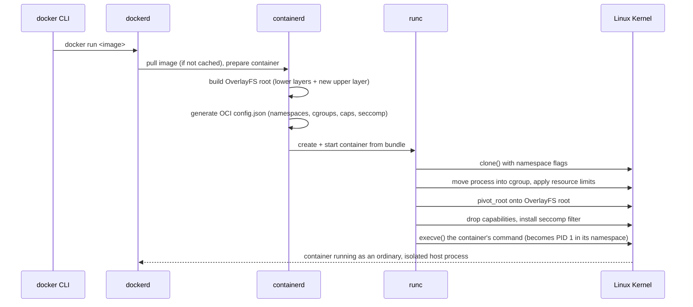

# Section 9: Virtualization & Containers on Linux

This section covers how Linux implements virtualization (KVM/QEMU) and containers — tying together
namespaces, cgroups, and OverlayFS from earlier sections into the concrete mechanics of `docker run`
and a KVM guest, including how to build a container from raw primitives by hand.

## Subtopic Index
- [Hypervisors (Type 1 vs Type 2)](#hypervisors-type-1-vs-type-2)
- [KVM Architecture](#kvm-architecture)
- [QEMU](#qemu)
- [Virtio](#virtio)
- [Linux Namespaces (recap: PID, NET, MNT, UTS, IPC, USER, CGROUP)](#linux-namespaces-recap-pid-net-mnt-uts-ipc-user-cgroup)
- [cgroups v1 vs v2](#cgroups-v1-vs-v2)
- [OverlayFS for Containers](#overlayfs-for-containers)
- [Container Runtimes (runc, containerd, CRI-O)](#container-runtimes-runc-containerd-cri-o)
- [How `docker run` Maps to Kernel Primitives](#how-docker-run-maps-to-kernel-primitives)
- [Nested Virtualization](#nested-virtualization)

---

## Hypervisors (Type 1 vs Type 2)

A hypervisor is the software layer responsible for creating and managing virtual machines, and the
classic Type 1 vs Type 2 distinction is about where that software sits relative to the physical
hardware. A Type 1 ("bare-metal") hypervisor runs directly on physical hardware with no general-purpose
host operating system underneath it at all — VMware ESXi and Xen are the canonical examples — meaning
the hypervisor itself is the most privileged software on the machine, directly managing physical CPU
scheduling, memory, and devices across all guest VMs. A Type 2 ("hosted") hypervisor instead runs as an
application on top of an already-running general-purpose host operating system (VirtualBox or VMware
Workstation running atop Windows/macOS/Linux), relying on the host OS for its own scheduling and device
access, which is simpler to install and use for desktop/development scenarios but introduces an
additional layer of scheduling/resource-management indirection compared to a bare-metal design. KVM
(Kernel-based Virtual Machine), the dominant Linux virtualization technology, genuinely blurs this
classic dichotomy: it's implemented as a Linux kernel module that turns the ordinary, already-running
Linux kernel itself into a Type-1-style hypervisor — the "host OS" and "hypervisor" are, in KVM's
model, the same running kernel, with the kernel's ordinary process scheduler directly scheduling VM
guest execution as just another kind of schedulable task alongside regular processes, rather than
introducing a wholly separate, independent hypervisor scheduling domain. This is precisely why a KVM
guest ("VM") is visible in `ps`/`top` output on the host as an ordinary process (specifically, `qemu-
system-x86_64` or similar, discussed further below) — from the host Linux kernel's own scheduling
perspective, a KVM virtual machine genuinely is just a process, distinguished only by the specific
hardware virtualization extensions it exercises via the `/dev/kvm` device to actually execute guest
CPU instructions directly on the physical CPU rather than through the interpretation/emulation a purely
software hypervisor would otherwise require.

### Key commands
```
lsmod | grep kvm                    # confirm the kvm kernel module is loaded
cat /sys/module/kvm_intel/parameters/nested   # (Intel) check nested virtualization support/enablement
ps aux | grep qemu                    # KVM guests appear as ordinary host processes
virsh list --all                        # (libvirt) list managed VMs and their state
```

## KVM Architecture

KVM turns the Linux kernel into a Type-1-style hypervisor by exposing hardware virtualization
extensions (Intel VT-x or AMD-V) through a kernel module and a simple device interface, `/dev/kvm`,
that userspace virtualization software (almost always QEMU, discussed next) opens and issues `ioctl()`
calls against to create and control virtual machines. The hardware extensions themselves are what make
modern virtualization performant rather than requiring pure software emulation of every single CPU
instruction: VT-x/AMD-V introduce a new CPU privilege mode (VMX root/non-root on Intel) allowing guest
code to execute the vast majority of its instructions *directly* on the physical CPU at full native
speed, with the CPU hardware itself automatically trapping only specific privileged operations (like
accessing certain control registers, or executing an I/O instruction) back out to the hypervisor for
emulation/handling — this hardware-assisted trap-and-emulate model is fundamentally different from
(and vastly faster than) older, pre-hardware-virtualization techniques that had to either interpret
every guest instruction in software or use complex binary translation to rewrite privileged
instructions dynamically. KVM specifically handles the CPU and memory virtualization pieces — creating
virtual CPUs (each represented, from the host kernel's scheduling perspective, as an ordinary thread
within the owning QEMU process, meaning a 4-vCPU guest is scheduled by the host kernel as 4 independent
threads competing for host CPU time exactly like any other multi-threaded process would), and managing
guest physical memory via nested/extended page tables (EPT on Intel, NPT on AMD) — a second layer of
hardware-assisted address translation sitting below the guest's own page tables, translating
guest-physical addresses to genuine host-physical addresses directly in hardware, avoiding the need for
software-based "shadow page table" bookkeeping that earlier virtualization approaches required and
that imposed substantial overhead on any guest memory-management-heavy workload. Device emulation
(virtual disk controllers, network cards, graphics) is deliberately *not* KVM's job at all — that
responsibility belongs entirely to QEMU, running as the userspace process that actually owns the
`/dev/kvm` file descriptor for a given guest, with KVM itself narrowly scoped to just the CPU/memory
virtualization primitives a hypervisor fundamentally needs.

### Key commands
```
cat /proc/cpuinfo | grep -o 'vmx\|svm'    # confirm CPU hardware virtualization extension support
virsh dominfo <vm-name>                     # libvirt-managed VM configuration/state summary
cat /sys/kernel/debug/kvm/*                  # (if debugfs mounted) low-level KVM statistics
ps -T -p <qemu-pid>                            # show per-vCPU threads within a running QEMU process
```

## QEMU

QEMU (Quick EMUlator) is the userspace component that actually constructs a complete virtual machine
around KVM's CPU/memory virtualization primitives, providing everything KVM itself deliberately leaves
out: emulated (or, more commonly today, paravirtualized via virtio, see below) disk controllers,
network interfaces, graphics adapters, USB controllers, and the overall guest firmware/BIOS
environment a guest operating system expects to boot into. QEMU can actually operate in two
fundamentally different modes: as a pure software emulator (capable of running a guest built for an
entirely different CPU architecture than the host — emulating an ARM guest on an x86 host, for
instance, via full instruction-by-instruction dynamic binary translation, necessarily much slower
since every guest instruction must be translated/interpreted in software with no hardware
acceleration available for a mismatched architecture) or, when running a guest matching the host's own
architecture, as KVM's userspace counterpart (`qemu-kvm`, or modern QEMU with `-enable-kvm`),
delegating the actual CPU instruction execution to KVM's hardware-accelerated path entirely and
retaining only the device-emulation/management responsibilities itself. This is precisely why a KVM-
accelerated VM appears in `ps` as a `qemu-system-x86_64` (or similarly-named) process on the host:
that process is QEMU providing the virtual machine's "hardware" (disk, network, console) and overall
management, opening `/dev/kvm` and delegating the actual guest CPU execution to the kernel's KVM module
for near-native speed, rather than QEMU itself interpreting guest instructions. Management tooling like
`libvirt` (and its `virsh` CLI, or higher-level tools like `virt-manager`) sits above raw QEMU
invocations, providing a standardized, XML-configuration-driven API for defining, starting, stopping,
and migrating VMs without administrators needing to hand-construct the (frequently very long and
detailed) raw QEMU command line themselves for every VM — cloud platforms' own hypervisor layers
(historically, much of AWS's early EC2 infrastructure) have themselves been built atop Xen or KVM/QEMU
foundations, with substantial custom engineering layered on top for their specific multi-tenant,
massive-scale operational requirements.

### Key commands
```
qemu-system-x86_64 -enable-kvm -m 2G -hda disk.img   # launch a KVM-accelerated guest directly
virsh edit <vm-name>                                    # edit a libvirt-managed VM's underlying XML definition
virt-install --name test --memory 2048 --disk size=10     # create a new VM via the higher-level virt-install tool
qemu-img create -f qcow2 disk.img 20G                        # create a virtual disk image
```

## Virtio

Early virtual machine device emulation faithfully emulated real physical hardware (a real, specific
model of network card or disk controller) purely so that unmodified guest operating systems with
existing drivers for that real hardware could run without any awareness they were virtualized at all —
functionally correct, but carrying substantial performance overhead, since every single device
interaction (a disk read, a network packet) had to be trapped out to the hypervisor and processed
through emulation logic replicating that specific physical device's exact register-level behavior,
often requiring many separate trap-and-emulate round trips for what should conceptually be one logical
operation. Virtio is a standardized paravirtualization interface specifically designed to eliminate
this overhead: rather than emulating a specific real device's exact hardware behavior, virtio defines
an efficient, virtualization-aware device model from the ground up — guest drivers written
specifically for virtio (virtio-net, virtio-blk, virtio-scsi, virtio-gpu, and others, included in the
mainline Linux kernel and available for other major guest operating systems too) communicate with the
hypervisor through shared-memory ring buffers ("virtqueues") that both the guest driver and the
host-side backend can access directly, batching many I/O requests into shared memory descriptors and
requiring far fewer expensive trap-to-hypervisor transitions than faithfully emulating real hardware's
register-level interaction pattern would need. This is a direct trade-off requiring guest awareness —
the guest operating system must have virtio-specific drivers installed (universally true for any
reasonably modern Linux guest, and available via installable drivers for Windows guests too) — in
exchange for substantially better I/O performance than fully-emulated "real hardware" device models,
which is exactly why virtio devices are the default, strongly recommended choice for any KVM/QEMU
guest capable of using them, with legacy fully-emulated device models retained mainly for
compatibility with guest operating systems too old or specialized to have virtio driver support at
all. `vhost` further optimizes the virtio model for networking/storage specifically by moving the
host-side backend processing of virtqueues from QEMU's own userspace process directly into the host
kernel (`vhost-net`, `vhost-scsi`), removing an additional userspace-kernel round trip from the
already-optimized virtio data path for even lower latency and higher throughput on the highest-
performance-sensitive device types.

### Key commands
```
lsmod | grep virtio                  # confirm virtio guest drivers are loaded (run inside the guest)
virsh domiflist <vm-name>              # confirm a VM's network interface is configured as virtio model
qemu-system-x86_64 ... -device virtio-net-pci,netdev=net0   # explicitly request virtio-net for a guest NIC
cat /sys/module/vhost_net/refcnt         # confirm vhost-net kernel acceleration is in use on the host
```

## Linux Namespaces (recap: PID, NET, MNT, UTS, IPC, USER, CGROUP)

(Individual namespace types are covered in depth in their respective subject-matter sections — PID in
Section 2, NET in Section 5, USER/security implications in Section 6 — this entry consolidates them
specifically as the container-construction toolkit.) The seven namespace types combine to give a
process group an isolated *view* of a specific kind of system resource, and the practical exercise of
"build a container from scratch" is precisely the exercise of combining all seven correctly. PID
namespace gives an isolated process ID space, where the first process created inside becomes PID 1
*within that namespace* (with its own subreaper/zombie-reaping responsibilities exactly as discussed in
Section 2), while remaining an ordinary, differently-numbered process from the host's own PID
namespace's perspective. Mount namespace gives an independent view of mounted filesystems, letting a
container have an entirely different root filesystem (typically an OverlayFS stack, discussed next)
and set of mount points invisible to and independent from the host's own mount table. UTS namespace
isolates hostname and NIS domain name, letting a container report its own distinct hostname via
`hostname`/`uname` independent of the host's actual hostname. IPC namespace isolates System V IPC
objects (shared memory segments, semaphores, message queues) and POSIX message queues, preventing a
container from being able to see or interfere with IPC objects belonging to the host or other
containers. Network namespace (Section 5) gives an independent network stack. User namespace (Section
6) gives independent UID/GID mapping, the security-critical piece enabling "rootless" containers.
Cgroup namespace (the newest of the seven, added specifically to complete the isolation picture) gives
a process an isolated *view* of its own cgroup hierarchy path, so that tools running inside a container
inspecting `/proc/self/cgroup` see paths relative to the container's own cgroup root rather than the
full, revealing host-wide cgroup hierarchy path — closing a comparatively minor but real information-
disclosure/potential-confusion gap that existed before this namespace type was introduced. No single
namespace, nor even most of the seven combined without the remainder, constitutes genuine container
isolation on its own — the combination of all seven, plus cgroups for resource limiting and MAC/
seccomp/capabilities for permission restriction (Section 6), together comprise what "a container" 
actually is at the kernel primitive level.

### Key commands
```
unshare --pid --mount --uts --ipc --net --user --cgroup --fork bash   # construct all seven namespace types at once
lsns                                    # list every active namespace of every type on the system
ls -l /proc/<pid>/ns/                     # inspect which specific namespace instances a process belongs to
nsenter --target <pid> --all bash           # enter every namespace of an existing process (debugging containers)
```

## cgroups v1 vs v2

(cgroups' resource-control mechanics are covered per-resource throughout this guide — CPU in Section
2, memory in Section 3, PIDs/security framing in Section 6; this entry focuses on the v1-vs-v2
architectural distinction itself.) cgroups v1 allowed each resource controller (cpu, memory, blkio,
pids, and others) to be mounted as an entirely independent hierarchy, meaning a process could
simultaneously belong to different, unrelated positions in the CPU-controller hierarchy versus the
memory-controller hierarchy versus the blkio-controller hierarchy — a flexibility that turned out, in
practice, to create substantial real-world complexity and inconsistency: different controllers'
hierarchies could disagree about how processes were logically grouped, making it genuinely difficult to
reason about a specific workload's *total* resource footprint across every dimension consistently, and
several controllers ended up implemented with subtly inconsistent semantics and interfaces from one
another since each was developed somewhat independently over cgroups v1's long evolution. cgroups v2
(the "unified hierarchy," the default and increasingly the *only* option on modern kernels/
distributions) consolidates every controller onto a single, unified hierarchy — every process belongs
to exactly one cgroup at a time, and every controller enabled for that cgroup applies consistently to
that same single grouping, eliminating the possibility of controllers disagreeing about a workload's
logical grouping and substantially simplifying both the mental model and the actual administrative
interface (a consistent `cgroup.controllers`/`cgroup.subtree_control` mechanism for enabling
controllers per-subtree, replacing v1's more ad-hoc, per-controller-hierarchy mounting conventions).
cgroups v2 also introduced meaningfully improved semantics for several controllers along the way —
the `memory.high` soft-throttling limit discussed in Section 3 has no clean v1 equivalent, and v2's PID
controller and I/O controller (`io.max`, replacing v1's less consistent `blkio` controller naming/
semantics) are generally considered better-designed than their v1 counterparts. Most modern container
runtimes and orchestrators (recent Docker, containerd, Kubernetes with `cgroupDriver=systemd`) have
fully migrated to cgroups v2 by default, though understanding v1's still-encountered legacy behavior
(older kernels, some enterprise-distribution default configurations, and troubleshooting older
documentation/tooling that still assumes v1's separate-hierarchy model) remains genuinely relevant
interview and operational knowledge.

### Key commands
```
mount | grep cgroup                  # confirm whether v1 (multiple mounts) or v2 (single unified mount) is active
cat /sys/fs/cgroup/cgroup.controllers   # (v2) list available controllers on the unified hierarchy
cat /sys/fs/cgroup/<path>/cgroup.subtree_control   # (v2) controllers enabled for child cgroups at this level
stat -fc %T /sys/fs/cgroup/               # filesystem type check: cgroup2fs (v2) vs tmpfs (v1's mount point convention)
```

## OverlayFS for Containers

(OverlayFS's general mechanics are covered in Section 4; this entry focuses specifically on its role
as the standard container image/filesystem model.) A container image is built as a stack of
independent, read-only layers, each representing one step of the image's build process (a base OS
layer, then a layer adding installed packages, then a layer adding application code) — and OverlayFS's
support for stacking multiple read-only "lower" directories beneath one writable "upper" directory maps
directly onto this layered image model: every layer of a pulled image becomes one read-only lower
directory in the overlay stack, and the running container's own filesystem changes are captured
entirely in a thin writable upper layer unique to that specific container instance, with copy-up
semantics (Section 4) ensuring any file the container modifies is first copied from whichever
read-only layer it originates in up into the container's own private upper layer before being changed,
leaving the shared, read-only image layers completely untouched and safely shareable across every
other container instance running from the same image. This layer-sharing property is precisely what
makes container images space-and-time efficient at scale: pulling ten different container images that
all happen to share the same common base-OS layer (a very common scenario, since most images in an
organization are frequently built from the same small set of approved base images) requires storing
that shared base layer's content exactly once on disk, and starting a new container from any image
whose layers are already present locally requires no data copying at all — merely constructing a new,
empty writable upper layer and mounting the appropriate overlay stack, an operation that completes in
well under a second regardless of the total image size, which is exactly why container startup is so
dramatically faster than provisioning an equivalent traditional VM. Because a container's writable
upper layer is discarded by default when the container is removed (unless explicitly committed back
into a new image layer, or unless persistent data is instead placed on an explicitly-mounted volume
bypassing the overlay entirely), this architecture also directly embodies and enforces the "immutable
infrastructure" pattern discussed in Section 11 — a container's writable state is explicitly meant to
be ephemeral and disposable by design, not something the platform expects to durably persist across
the container's own lifecycle without an explicit, deliberate volume mount.

### Key commands
```
docker inspect <container> --format '{{.GraphDriver.Data}}'   # show the actual overlay lower/upper/merged paths in use
mount | grep overlay                                             # inspect active overlayfs mounts directly
du -sh /var/lib/docker/overlay2/*/diff                              # per-layer disk usage on the host
ctr images ls                                                         # (containerd) list locally-cached image layers
```

## Container Runtimes (runc, containerd, CRI-O)

Container "runtimes" actually span several distinct layers of responsibility, and precisely
distinguishing them is a frequently-tested, genuinely important interview distinction. `runc` is the
low-level OCI (Open Container Initiative) runtime — a small, focused program whose entire job is
taking an already-fully-prepared filesystem bundle (an extracted root filesystem plus a `config.json`
describing namespaces, cgroup limits, capabilities, and the command to execute) and performing the
actual low-level kernel work of creating the namespaces, setting up cgroups, applying seccomp/
capabilities restrictions, and finally `execve()`-ing the container's specified process — it does not
pull images, does not manage a daemon, and does not persist any state about running containers beyond
the single container it was just invoked to create; nearly every higher-level container tool (Docker,
containerd, CRI-O, Podman) ultimately shells out to `runc` (or an OCI-runtime-spec-compatible
alternative like `crun` or the sandboxed `gVisor`/`runsc` and Kata Containers' VM-based runtimes) for
this final, lowest-level container-creation step. `containerd` sits one layer above `runc`,
responsible for the broader lifecycle: pulling and unpacking images from a registry, managing image
storage (the OverlayFS layer stack discussed above), and supervising running containers (tracking
their state, handling restarts, streaming logs) — `containerd` is what Docker itself is actually built
on top of today (Docker's own daemon delegates most of this heavy lifting to an embedded `containerd`
instance rather than reimplementing it), and `containerd` is also directly usable as a
Kubernetes-compatible container runtime in its own right via its native CRI (Container Runtime
Interface) plugin, without needing Docker involved at all. `CRI-O` is a purpose-built, minimal
alternative specifically implementing just the Kubernetes CRI interface (unlike containerd, which
supports CRI as one of several possible consumption interfaces but wasn't originally built exclusively
for it) — CRI-O deliberately implements nothing beyond exactly what Kubernetes itself needs from a
container runtime, favoring a smaller, more tightly-scoped codebase and attack surface over the
broader general-purpose feature set containerd/Docker also provide for non-Kubernetes use cases. This
overall layering — CRI (Kubernetes' runtime-agnostic interface) → containerd/CRI-O (image management
and container lifecycle) → runc/crun/gVisor/Kata (actual namespace/cgroup/execution primitives) — is
precisely what lets Kubernetes remain runtime-agnostic, supporting any CRI-compliant implementation
interchangeably without the rest of the Kubernetes control plane needing any awareness of which
specific low-level runtime is actually in use underneath.

### Key commands
```
runc list                             # list containers directly managed by runc on this host
ctr containers list                     # (containerd's own CLI) list containers containerd is managing
crictl ps                                 # CRI-level view of containers (works against containerd or CRI-O)
docker info | grep -i "Runtime\|driver"     # confirm which runtime/runc variant Docker itself is configured to use
```

## How `docker run` Maps to Kernel Primitives

Tracing exactly what happens when `docker run` executes ties every earlier concept in this section
into one concrete, memorable narrative, and is one of the most common practical "explain what actually
happens" interview exercises for container-focused roles. The Docker CLI sends a request to the Docker
daemon (`dockerd`), which checks whether the requested image is already present locally and, if not,
pulls it from a registry — downloading each of the image's layers and unpacking them into the
OverlayFS-backed local image store managed by the embedded `containerd` instance discussed above.
`containerd` then prepares a new container: it constructs the container's root filesystem by building
an OverlayFS mount stacking the image's read-only layers beneath a fresh, empty writable layer unique
to this container instance, generates an OCI-spec `config.json` describing the requested namespaces
(PID, mount, UTS, IPC, network — and user namespace too, if rootless/user-namespace-remapped mode is
configured), resource limits (translated from `docker run`'s `--memory`/`--cpus` flags into the
corresponding cgroup v2 controller settings), capability grants/drops, and seccomp profile, and hands
this fully-prepared bundle off to `runc`. `runc` performs the actual low-level kernel work: it calls
`clone()` with the appropriate namespace flags to create the isolated execution context, moves the new
process into the pre-created cgroup (applying the configured resource limits), performs the mount
namespace setup and `pivot_root` onto the prepared OverlayFS root, drops capabilities and installs the
seccomp filter per the OCI spec, and finally `execve()`s the container's actual specified command,
which becomes PID 1 within its own new PID namespace. From this point forward, the running container
process is, at the kernel level, nothing more than an ordinary Linux process — subject to the exact
same scheduler, memory manager, and VFS layer as any other process on the host — distinguished only by
which namespaces it was created within, which cgroup constrains its resource consumption, and which
capability/seccomp/MAC restrictions apply to it, precisely the combination of primitives discussed
throughout this entire section.



### Key commands
```
docker run --rm -it alpine sh          # trigger the full pipeline just described
docker inspect <container> --format '{{.State.Pid}}'   # find the host-visible PID of a container's init process
cat /proc/<host-pid>/status | grep NSpid   # confirm the same process's PID within its own namespace vs the host's
ls -l /proc/<host-pid>/ns/                  # inspect every namespace the container process actually belongs to
```

## Nested Virtualization

Nested virtualization is running a hypervisor (and its guest VMs) inside a VM that is itself already a
guest of another hypervisor — a genuinely useful capability for CI/testing environments that need to
spin up and test full VM-based infrastructure without provisioning dedicated bare-metal hardware for
every test run, and for cloud environments offering "bring your own hypervisor" capability to
customers running virtualization workloads (like a nested Kubernetes-in-KVM lab) atop an already-
virtualized cloud instance. KVM supports nested virtualization by exposing the hardware virtualization
extensions (VT-x/AMD-V) themselves *into* a guest, letting that guest's own kernel load its own KVM
module and create its own "level 2" guests underneath it — requiring the outer (level 0) hypervisor to
explicitly enable this pass-through (`kvm_intel nested=1`/`kvm_amd nested=1` kernel module parameters)
since exposing raw hardware virtualization capability into a guest is not a default-safe assumption
the host makes unprompted. Performance-wise, nested virtualization carries genuinely real, compounding
overhead: a level-2 guest's privileged instruction traps must now be handled by *two* layers of
hypervisor emulation/mediation in sequence (the level-1 guest's own KVM instance, itself running atop
the level-0 host's KVM), and certain hardware-assisted acceleration features (particularly around
nested page table walks, since address translation must now traverse three levels — guest-virtual to
guest-physical to host-physical, rather than just two) are historically less mature/complete for the
nested case than for standard single-level virtualization, meaning nested VMs can show meaningfully
worse performance than an equivalent single-level VM, especially for memory-management-intensive or
I/O-intensive workloads, making nested virtualization a very reasonable choice for functional testing
and development but one to approach cautiously for genuine production performance-sensitive workloads
without careful benchmarking specific to the actual hardware/kernel version combination in use.

### Key commands
```
cat /sys/module/kvm_intel/parameters/nested   # confirm nested virtualization is enabled at the host/level-0 layer
modprobe kvm_intel nested=1                     # enable nested virtualization support (Intel)
lscpu | grep Virtualization                       # confirm virtualization capability visible from within a guest
virt-host-validate                                  # sanity-check a host's virtualization capability/configuration
```

---

### Interview Questions

**Conceptual/Internals (8)**

1. **Why is KVM described as blurring the Type 1 vs Type 2 hypervisor distinction?**
   KVM is a kernel module that turns an already-running, ordinary Linux kernel into a hypervisor — the
   "host OS" and "hypervisor" are the same running kernel, and the kernel's own process scheduler
   directly schedules VM guest execution as just another kind of task, rather than KVM introducing an
   independent hypervisor scheduling domain the way a classic Type 1 design (or a Type 2 design running
   as an application atop a separate host OS) would.

2. **What is the division of responsibility between KVM and QEMU?**
   KVM handles CPU and memory virtualization — creating virtual CPUs (scheduled as threads within the
   owning QEMU process) and managing guest-physical-to-host-physical memory translation via hardware
   nested/extended page tables. QEMU handles everything else a complete virtual machine needs: device
   emulation/paravirtualization (disk, network, graphics), guest firmware, and overall VM lifecycle
   management, delegating only the actual CPU instruction execution to KVM's hardware-accelerated path.

3. **What problem does virtio solve compared to fully-emulated virtual hardware?**
   Fully-emulated device models faithfully replicate real physical hardware's register-level behavior,
   requiring many expensive trap-to-hypervisor round trips per logical I/O operation. Virtio is a
   paravirtualized, virtualization-aware device interface using shared-memory ring buffers
   (virtqueues) that batch requests and require far fewer traps, at the cost of requiring guest-side
   virtio-specific drivers rather than working with any unmodified, hardware-agnostic guest driver.

4. **List the seven Linux namespace types and, briefly, what each isolates.**
   PID (process ID space), Mount (filesystem mount table), UTS (hostname/domain name), IPC (System
   V/POSIX IPC objects), Network (network stack), User (UID/GID mapping), and Cgroup (view of the
   cgroup hierarchy path). No single one alone constitutes container isolation; all seven combined,
   plus cgroups and MAC/seccomp/capabilities, comprise what "a container" actually is.

5. **What is the key architectural difference between cgroups v1 and v2?**
   v1 allowed each resource controller to be mounted as an independent hierarchy, letting a process
   belong to different logical groupings per controller and creating real inconsistency reasoning about
   a workload's total resource footprint. v2 unifies every controller onto a single hierarchy where
   every process belongs to exactly one cgroup, with all enabled controllers applying consistently to
   that same grouping.

6. **Explain the layering between runc, containerd, and CRI-O.**
   `runc` is the lowest-level OCI runtime performing the actual namespace/cgroup/capability/seccomp
   setup and final `execve()` for one container, given an already-prepared bundle. `containerd` sits
   above it, handling image pulling/unpacking, image layer storage, and running-container lifecycle
   management, and is what Docker itself is built on top of. `CRI-O` is a purpose-built, minimal
   alternative implementing only the Kubernetes CRI interface, favoring a smaller scope/attack surface
   over containerd's broader general-purpose feature set.

7. **How does OverlayFS's layer model make container images space-efficient across many containers
   sharing a base image?**
   Each image layer becomes a read-only lower directory in an overlay stack; a running container's
   changes are captured entirely in its own private, thin writable upper layer via copy-up semantics,
   leaving shared read-only layers untouched. Multiple containers built from images sharing common
   base layers store that shared content exactly once on disk, and starting a new container requires no
   data copying, only constructing a new empty upper layer and mounting the stack.

8. **Why does nested virtualization carry meaningfully more overhead than single-level
    virtualization?**
    A nested (level-2) guest's privileged instruction traps must be handled by two layers of hypervisor
    mediation in sequence rather than one, and address translation must traverse three levels
    (guest-virtual to guest-physical to host-physical) instead of two, with hardware acceleration for
    this nested translation historically less mature than for standard single-level virtualization —
    together producing real, compounding performance overhead especially for memory- and I/O-intensive
    workloads.

**Scenario/Troubleshooting (6)**

9. **A container running as UID 0 needs to be verified as either genuinely isolated (user-namespace-
    mapped) or a real host-root risk. How do you check quickly?**
    Inspect `/proc/<host-pid>/uid_map` for the container's process — a genuine, non-identity mapping
    confirms the container's apparent root is mapped to an unprivileged host UID; an identity mapping
    (or the file showing the full, unrestricted UID range) indicates the container is running with
    real host-root privilege despite its own internal appearance of being isolated.

10. **A host running many containers from the same base image shows disk usage far higher than
    expected, given OverlayFS's layer-sharing design.**
    Check whether the images were actually built consistently from a shared base layer (`docker
    history`/comparing layer digests) — images rebuilt independently even from "the same" Dockerfile
    without deterministic build caching can produce layers with different digests despite conceptually
    identical content, defeating layer sharing. Also confirm the storage driver in use genuinely
    supports the expected overlay semantics (some backing filesystems have historically had overlay
    driver compatibility issues that silently degrade to less space-efficient behavior).

11. **A KVM guest's disk I/O performance is far below the underlying host storage's actual
    capability. What's the first thing to check?**
    Confirm the guest's disk device model is actually virtio-blk/virtio-scsi rather than a fully-
    emulated legacy device model (`virsh domblklist`/inspecting the QEMU command line/XML config) —
    fully-emulated device models incur substantially higher per-I/O-operation overhead than virtio's
    paravirtualized ring-buffer-based approach, and this is one of the most common, easily-fixed causes
    of poor guest storage performance.

12. **After enabling nested virtualization for a CI pipeline, level-2 guest VMs are functional but
    noticeably slower than expected compared to equivalent single-level VMs on the same hardware.**
    This is largely expected given nested virtualization's inherent compounding overhead (two layers
    of trap handling, three-level address translation); confirm nested extended/nested page table
    hardware support is actually active and being used (rather than falling back to a slower software
    shadow-paging path for the nested case specifically) and benchmark against the specific hardware/
    kernel combination in use, since nested virtualization performance characteristics vary
    meaningfully across CPU generations and kernel versions.

13. **A container image build process produces a final image far larger than expected, despite
    apparently minimal application code being added in the final layers.**
    Inspect the full layer history (`docker history <image>`) rather than only the final Dockerfile
    stage — a common cause is temporary build artifacts (package manager caches, compiled dependencies
    later deleted) being added in one layer and then "deleted" in a subsequent layer; because OverlayFS
    layers are immutable once built, a deletion in a later layer does not shrink the already-built
    earlier layer that still contains the large content, only masks it in the merged view, meaning
    multi-stage builds (or combining install-and-cleanup into a single layer) are required to actually
    reduce final image size.

**FAANG-level Deep Dive (6)**

15. **Explain precisely why KVM's use of extended/nested page tables (EPT/NPT) avoids the overhead
    that pre-hardware-virtualization "shadow page table" techniques required.**
    Shadow paging required the hypervisor to maintain and keep synchronized an entirely separate,
    software-managed page table reflecting the composition of guest-virtual-to-host-physical
    translation, trapping and emulating every guest page table modification to keep the shadow tables
    consistent — a significant per-modification overhead for any guest workload that frequently updates
    its own page tables (process creation/exit, memory-mapping-heavy workloads). EPT/NPT instead let
    the guest maintain its own ordinary page tables (translating guest-virtual to guest-physical)
    entirely without hypervisor involvement, with the CPU's memory management unit performing a second,
    hardware-native translation step (guest-physical to host-physical) automatically on every memory
    access, requiring no hypervisor trapping or shadow-table synchronization at all for ordinary guest
    page table updates.

16. **Why does a container's PID namespace's "PID 1 equivalent" still need the same subreaper/
    zombie-reaping responsibilities as a real system's actual PID 1, and what commonly goes wrong when
    this is overlooked?**
    Within a PID namespace, the first process is that namespace's own PID 1, and the kernel's PID-1
    semantics (inheriting orphaned descendants, being the mandatory reaper of last resort for that
    namespace) apply exactly the same as for the host's real PID 1 — a container's main process, even
    if it's just an application binary never designed to be an init system, still becomes responsible
    for reaping its own zombie children within that namespace. This is commonly overlooked when a
    container's `ENTRYPOINT` is an ordinary application (or a simple wrapper shell script) with no
    proper `SIGCHLD` handling, leading to exactly the zombie-accumulation problem discussed in Section
    2, which is why minimal init wrappers like `tini`/`dumb-init` (or a runtime's built-in equivalent)
    are the standard remediation.

17. **Explain why cgroups v1's independent per-controller hierarchies could allow a process's
    *effective* resource limits to become genuinely difficult to reason about, with a concrete
    example.**
    Because a process could belong to different positions in the CPU-controller hierarchy versus the
    memory-controller hierarchy independently, an administrator inspecting "what CPU limit applies to
    this process" and "what memory limit applies to this process" might need to trace two entirely
    separate, potentially inconsistently-organized hierarchy trees to answer each question, with no
    guarantee those two hierarchies group related processes the same way at all — a process could,
    for instance, be grouped with a database's other processes for memory-limiting purposes while
    simultaneously being grouped with an unrelated batch job for CPU-limiting purposes, if the two
    hierarchies were configured/populated independently, a genuinely confusing possibility cgroups v2's
    single unified hierarchy eliminates by construction.

18. **Why does `vhost-net` reduce network I/O latency for a KVM guest beyond what plain virtio-net
    alone achieves, at a mechanistic level?**
    Plain virtio-net still requires QEMU's own userspace process to process each virtqueue
    notification/data transfer, meaning a guest network packet's path includes a guest-to-host trap,
    then host-kernel-to-QEMU-userspace handoff, then QEMU performing the actual host-side network
    operation. `vhost-net` moves the host-side virtqueue processing directly into the host kernel,
    letting the guest's virtqueue notifications be handled without needing to schedule and context-
    switch into QEMU's userspace process for each one, removing an entire kernel-to-userspace-and-back
    round trip from the per-packet data path and correspondingly reducing latency and CPU overhead for
    network-intensive guest workloads.

19. **Explain why a container image's layer digest-based content-addressing (rather than, say,
    layer-order-based identification) is what actually enables cross-image layer sharing in practice,
    and what breaks this sharing.**
    Container image layers are identified by a cryptographic content hash of their actual data, not by
    their position/order within any specific image's manifest — two entirely different images that
    happen to produce byte-for-byte identical layer content (e.g., both built `FROM` the same base
    image with the same initial `RUN` commands producing identical resulting filesystem state) will
    have identical layer digests and can therefore share that stored layer content on disk regardless
    of which image "logically" is considered to own it. This sharing breaks whenever build
    non-determinism (embedding build timestamps, non-reproducible package manager metadata, or
    differing build-argument values) causes what's conceptually "the same" layer to actually produce
    different byte content and therefore a different digest across separate builds, which is why
    reproducible, deterministic build practices are a genuine prerequisite for realizing OverlayFS's
    layer-sharing space efficiency at scale across many independently-built images.

20. **Why does CRI-O's narrower scope (versus containerd's broader general-purpose feature set)
    represent a genuine security/attack-surface trade-off rather than merely a stylistic
    implementation choice?**
    containerd supports multiple consumption interfaces and use cases beyond just Kubernetes CRI
    (standalone use via `ctr`, being Docker's own embedded engine, various plugin extension points),
    meaning its codebase necessarily includes functionality unrelated to what any specific Kubernetes
    deployment actually exercises through the CRI interface — extra code paths that, while not
    necessarily used by a given deployment, still exist as potential attack surface and maintenance
    burden. CRI-O deliberately implements nothing beyond exactly the Kubernetes CRI specification's
    requirements, meaning its entire codebase is relevant to and exercised by its actual Kubernetes
    use case, a genuinely smaller and more auditable attack surface for organizations whose only
    container runtime consumer is Kubernetes itself, at the cost of losing containerd's broader
    flexibility for any non-Kubernetes use case.

### Hands-On Labs

**Lab 1: Build a container from raw primitives without any container runtime**
- Objective: Construct full container-equivalent isolation entirely by hand.
- Setup: A Linux VM with root access.
- Tasks: Use `unshare` to create PID, mount, UTS, IPC, network, and user namespaces together; set up an
  OverlayFS root filesystem stack manually; `pivot_root` into it; create and apply a cgroup with CPU/
  memory/PID limits; finally `exec` a shell inside this fully-constructed environment.
- Expected outcome: A working, manually-constructed "container" demonstrating every underlying kernel
  primitive discussed in this section, with no container runtime tool involved at all.

**Lab 2: Launch and inspect a KVM guest directly with QEMU**
- Objective: Understand the KVM/QEMU relationship hands-on, without libvirt abstraction.
- Setup: A Linux host with KVM support (nested virtualization if working inside a cloud VM).
- Tasks: Create a virtual disk with `qemu-img`; launch a guest directly with `qemu-system-x86_64
  -enable-kvm`; from the host, use `ps -T` to observe the guest's vCPU threads and confirm the guest
  process's presence in `/dev/kvm`'s open file descriptors.
- Expected outcome: A running KVM guest with documented, verified evidence of its host-visible process/
  thread structure.

**Lab 3: cgroups v1 vs v2 comparison**
- Objective: Directly compare the two cgroup architectures' administrative interfaces.
- Setup: Two VMs (or one VM bootable with a kernel parameter forcing v1 vs v2), if available; otherwise
  a written comparison based on `/sys/fs/cgroup` inspection on available systems.
- Tasks: On a v1 system, inspect the separate per-controller mount points and note how a process's
  membership differs across controllers; on a v2 system, inspect the single unified hierarchy and
  `cgroup.subtree_control`.
- Expected outcome: A clear, hands-on-verified written comparison of the two architectures'
  administrative differences.

**Lab 4: OverlayFS layer sharing verification**
- Objective: Empirically confirm container image layer sharing and copy-up behavior.
- Setup: Docker or Podman installed on a test host.
- Tasks: Pull two different images sharing a common base layer; confirm (via `docker system df` or
  inspecting `overlay2` storage directly) the shared layer is stored only once; start a container,
  modify a file that originates in a shared read-only layer, and confirm (via `du`/direct inspection)
  the copy-up occurred into that container's own private upper layer without affecting the shared
  layer or other containers from the same image.
- Expected outcome: A documented, verified demonstration of both layer sharing and copy-up semantics.

**Lab 5: Full `docker run` kernel-primitive trace**
- Objective: Directly observe every kernel primitive `docker run` sets up, tying the whole section
  together.
- Setup: A Docker host.
- Tasks: Start a long-running container; find its host PID; inspect `/proc/<pid>/ns/*` to enumerate
  every namespace it belongs to; inspect its cgroup path and applied limits under `/sys/fs/cgroup/`;
  inspect its capability set via `/proc/<pid>/status`; confirm its root filesystem is an OverlayFS
  mount via `mount | grep overlay`.
- Expected outcome: A complete, evidence-backed inventory mapping every abstract concept in this
  section to concrete, observed state for one real running container.

### Production Incidents

**Incident 1: Container escape traced to a missing user namespace combined with an overly broad
capability grant**
- Symptom: A security assessment demonstrates a proof-of-concept container escape achieving genuine
  host-level root access from within a production container.
- Investigation: Confirmed the affected containers ran without user namespace remapping (container
  "root" was genuine host root) and were granted `CAP_SYS_ADMIN`, the same broad capability flagged in
  Section 6's incident record, here specifically exploited via a mount-related operation only possible
  because the escaping process was genuinely, not just apparently, running as host root.
- Root cause: Neither of the two independent, complementary isolation mechanisms (user namespace
  remapping, narrow capability grants) that should each have independently prevented or contained this
  escape was actually in place, allowing a single overly-broad capability grant to translate directly
  into full host compromise.
- Recovery: Removed the unnecessary capability grant and enabled user namespace remapping for all
  containers on the affected hosts, then re-ran the proof-of-concept to confirm the escape path was
  closed by each mitigation independently.
- Prevention: Established a mandatory security baseline requiring both user namespace remapping and
  minimal capability grants (not either one alone) for all production container workloads, validated
  by automated policy scanning before deployment.

**Incident 2: Disk exhaustion from non-deterministic container image builds defeating layer sharing**
- Symptom: A container registry and build-node local storage both grow far faster than expected given
  the organization's stated policy of building all images from a small set of shared, standardized
  base images.
- Investigation: Comparing layer digests across recently-built images revealed that a shared base
  layer, expected to be identical (and thus stored once) across dozens of images, actually had dozens
  of distinct digests — tracing the build process found a non-deterministic step (embedding a live
  build timestamp into a layer) that made every build's "identical" base layer content actually differ
  byte-for-byte.
- Root cause: A seemingly innocuous timestamp-embedding step in the shared base image's own Dockerfile
  broke reproducibility, defeating the content-addressed layer-sharing mechanism the storage capacity
  planning had implicitly assumed was in effect.
- Recovery: Removed the non-deterministic timestamp embedding, rebuilt the base image, and triggered a
  rebuild of dependent images, immediately restoring expected layer-sharing behavior and storage usage.
- Prevention: Added a reproducible-build validation check to the base image's own CI pipeline,
  specifically verifying that two consecutive builds from identical source produce identical layer
  digests before the base image is published for broader use.

**Incident 3: Severe, unexplained I/O latency traced to a guest using a legacy emulated disk
controller**
- Symptom: A newly-provisioned KVM-based virtual machine shows disk I/O latency an order of magnitude
  worse than other, similarly-specified VMs on the same physical host and storage backend.
- Investigation: Comparing the affected VM's libvirt XML definition against a known-good VM's
  configuration revealed the affected VM was configured with a legacy, fully-emulated IDE disk
  controller (inherited from an outdated provisioning template) rather than virtio-blk/virtio-scsi used
  by the comparison VM.
- Root cause: An outdated VM provisioning template, predating the organization's standardization on
  virtio device models, was still in use for a subset of VM images, silently causing every VM
  provisioned from it to suffer substantially degraded I/O performance compared to the organization's
  current standard.
- Recovery: Reconfigured the affected VM to use a virtio-scsi controller (requiring a guest-side driver
  verification and a reboot), immediately restoring expected I/O performance.
- Prevention: Audited and retired all outdated provisioning templates still specifying legacy emulated
  device models, and added an automated post-provisioning validation check confirming virtio device
  model usage before a newly-provisioned VM is marked ready for service.
